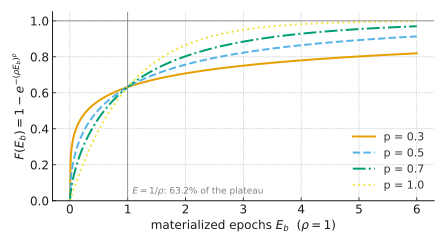
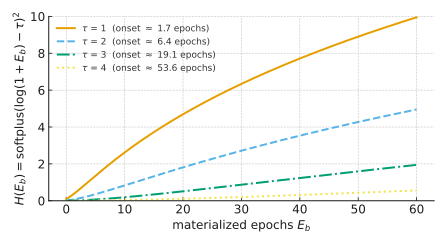
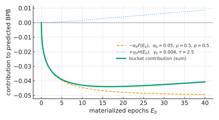
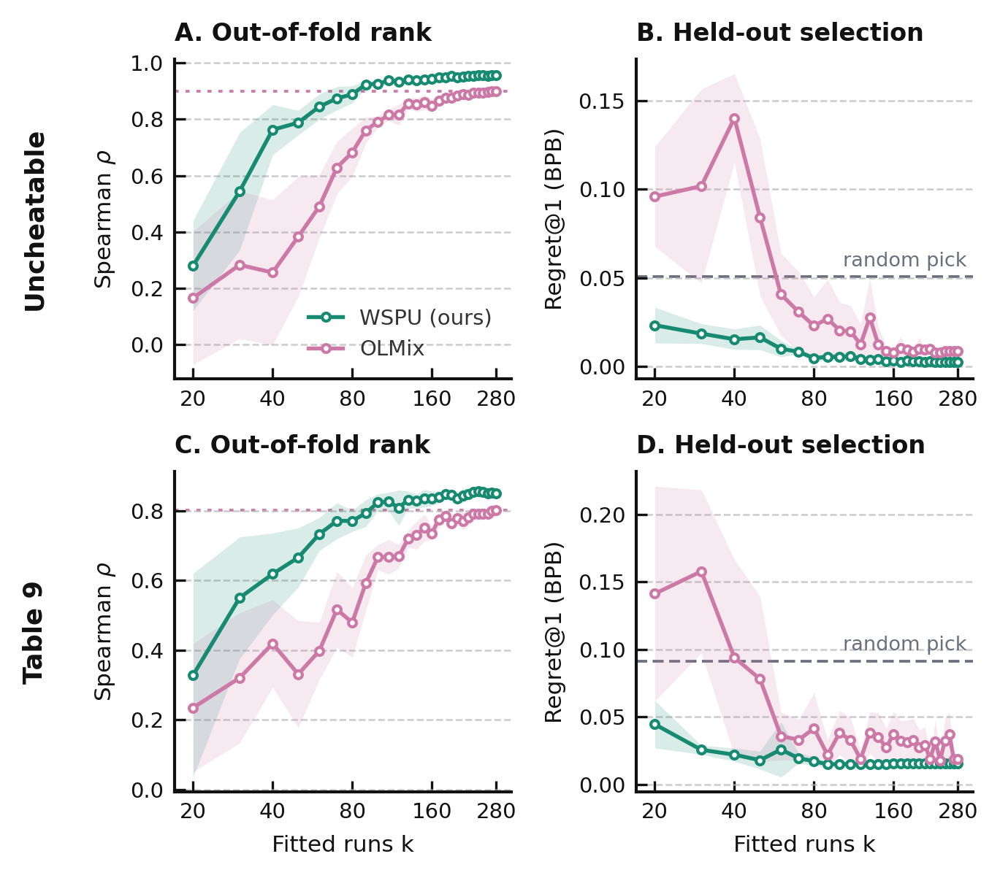
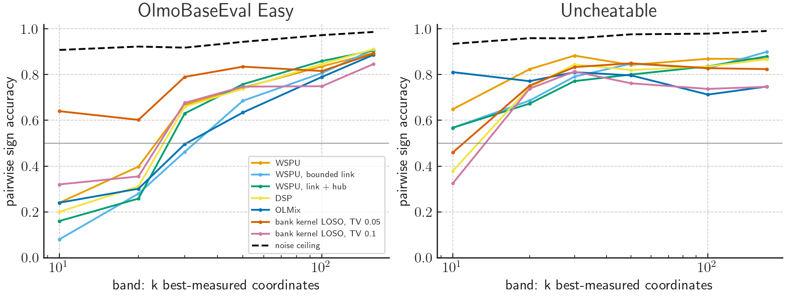

# Single-phase Observatory benchmark

What was done, and the `weibull_softplus_unscaled` model

<div class="mt-8 text-sm opacity-80">
2026-09-02 · branch <code>calvin/swarm-olmo3-regmix-test</code> · commit <code>99bea291d7</code><br>
Fieldbook experiment <code>exp_01m1ge7ye6hz2epd0mjkbkrvt8</code>
</div>

---

# The handoff

Reduce every single-phase surrogate in the Mixture Fit Observatory to one shared benchmark, then build
the smallest model the evidence supports.

- Registry of all 18 Observatory model ids with exact single-phase reductions and equivalence classes
- One shared, resumable benchmark harness with Screen, Certify, and finalist tiers under one split manifest
- External heldout optimum selection, a 45-curve StarCoder shape gate, and matched one-factor ablations
- Two independent read-only reviews (Codex, DeepSeek) before any successor is synthesized
- Every artifact, validation, failure, and decision recorded in Fieldbook; no training jobs launched

---

# What was produced

<div class="text-xs">

| Stage | Outcome |
|---|---|
| Registry | 18 ids collapse to 16 parent classes; 2 references; 67 ablations and controls; 2 successors with 21 ablations |
| Reductions | 46 checks against the original modules pass; largest discrepancy 1.5e-11; profiled DSP solver reproduces the ladder to 1.3e-13 |
| Screen | 108 entries, 6 anchor components + 8 Michael tasks + 45 curves each, 0 failed shards |
| Certify | 16 parents, 2 references, 36 promoted ablations, both successors: 1,175 fits each, 0 failed |
| Heldout | Frozen refits scored on the coordinate-disjoint bank for every parent and successor |
| Finalist | 8 models at 5 repeats (4,975 fits each) |
| Reviews | Codex: 10 defects found, all fixed and refit; DeepSeek: blocked by account quota, outstanding |
| Successor | `weibull_softplus_shared` registered, then revised to `weibull_softplus_unscaled` after its own ablations |
| Record | Report under `.agents/handoffs/`, 51 Fieldbook notes, 14 validations, code and report committed |

</div>

---

# Registry and exact reductions

Every Observatory model is a two-phase policy model. Its single-phase image fixes the phase structure and
keeps only the columns that survive.

$$
E_b = c_b\, w_b, \qquad \alpha_0 = \frac{c_0}{c_0 + c_1}
$$

- $E_b$: materialized epochs of bucket $b$ under weight $w_b$; $c_b$ is the exposure per unit weight
- Phase-only columns are removed: phase total variation, late concentration, ordering channels
- `crs_plus` and `crs_bounded` keep the revisit-gated retention $(\alpha_0 e^{-f(1-w)} + L\alpha_1)E$ as an exact image
- Equivalences found: canonical DSP = effective-exposure DSP; bucket-family GRP = separate-heads GRP at late = 1, forgetting = 0
- Families come only from the declared domain and quality splits: 13 `dolma3_cc` high/low pairs plus 13 singletons; semantic families are banned

---

# Benchmark design

<div class="text-sm">

**Sources.** 60M, 300M, and Delphi 3e18 39-bucket panels (7 Uncheatable + 51 Table 9 components each);
dclm and high-quality Michael swarms (118 and 120 buckets, frozen 8-task mean); 45 StarCoder endpoint curves in 4 families.

**Splits.** One manifest: 5 mixture-blocked outer folds (seed 20260902), 3 inner folds shared by every model.

**Tiers.** Screen: 6 anchors, 8 Michael tasks, 45 curves per model. Certify: every component, 1,175 fits per model.
Finalist: 5 repeats of the outer folds.

**Cache.** Shard keys hold the models-module hash, the fit-path source hash, a per-split fingerprint, and the built
model's configuration; recorded generations keep unchanged configurations valid across module edits.

**Metrics.** RMSE and RMSE over repeat SD, Spearman, calibration, regret@1 and top-k, selection optimism, basin metrics,
fit diagnostics. Contrasts are paired with the Nadeau-Bengio correction; pooled sign tests use family-macro units
(38 at Screen) so the 45 curves count as 4.

</div>

---

# Parents at Certify

Reconstructed-aggregate RMSE (BPB). Family GRP models lead canonical DSP by 0.002 to 0.004 on the
39-bucket cells; no five-fold interval excludes zero for any pair.

<div class="text-xs">

| Model | 60M U | 60M T9 | 300M U | 300M T9 | Delphi U | Delphi T9 | dclm | high quality |
|---|---|---|---|---|---|---|---|---|
| canonical DSP | 0.0101 | 0.0264 | 0.0054 | 0.0127 | 0.0090 | 0.0283 | 0.264 | 0.160 |
| bucket-family power GRP | 0.0069 | 0.0216 | 0.0058 | 0.0120 | 0.0078 | 0.0290 | 0.153 | 0.135 |
| Weibull family shared onset | 0.0078 | 0.0218 | 0.0058 | 0.0118 | 0.0099 | 0.0298 | 0.138 | 0.202 |
| taskwise OLMix | 0.0134 | 0.0225 | 0.0095 | 0.0192 | 0.0133 | 0.0316 | 0.223 | 0.145 |
| log-link linear epoch (reference) | 0.0111 | 0.0247 | 0.0094 | 0.0170 | 0.0129 | 0.0376 | 0.119 | 0.083 |
| `weibull_softplus_unscaled` | 0.0076 | 0.0211 | 0.0052 | 0.0116 | 0.0092 | 0.0302 | 0.117 | 0.086 |

</div>

On the Michael panels every literal-replay, log-deficit, and OLMix model explodes on some folds; GRP pairs,
the bowl, the hierarchical model, and the log-link reference stay bounded.

---

# Heldout optimum selection and the StarCoder gate

<div class="grid grid-cols-2 gap-6 text-sm">
<div>

**Heldout bank (frozen refits, argmin over candidates).**
Power-benefit family models select an extrapolated Delphi coordinate with 56 percent `stack_edu`
weight: Table 9 regret 0.107, rank 129 of 146. Canonical DSP selects rank 8 (regret 0.0132).
`weibull_softplus_unscaled` selects rank 8 too, and its top-5 shortlist regret is zero on every cell.

Evidence is retrospective: the bank was measured before the models were fitted.

</div>
<div>

**StarCoder equal-family macro (45 curves, out of fold).**

| Model | RMSE | Spearman | regret@1 |
|---|---|---|---|
| canonical DSP | 0.078 | 0.904 | 0.0158 |
| GRP pairs | 0.033 | 0.981 | 0.0032 |
| Weibull family onset | 0.039 | 0.979 | 0.0026 |
| taskwise OLMix | 0.101 | 0.610 | 0.158 |
| `weibull_softplus_unscaled` | 0.048 | 0.981 | 0.0031 |

</div>
</div>

---

# Review gate

<div class="text-sm">

**Codex (read-only, before synthesis): 10 defects, all reproduced and fixed, affected shards refit.**

- Two-stage grid screen was not selection-equivalent (inner RMSE 0.02900 against 0.02599): search made exhaustive
- `crs_plus` singleton family columns were not duplicates (residual 0.05 to 0.34): exact image restored
- Cache keys lacked code and configuration hashes; StarCoder curves over-weighted pooled tests (now family-macro units)
- Missing capacity-matched harm control; Weibull-versus-power ablation confounded by pooling and grid budget
- Signed-head ridge grid mismatch; ablation metadata copied from parents; verifier exited zero on failure

**DeepSeek (read-only, after the successor work): plumbing verified, three blockers accepted.** The log-deficit link beats the successor on all 8 Certify cells and is excluded only by the StarCoder gate; the exponential-benefit ablation was not budget-matched (rerun added); the unscaled-head revision was a Screen selection whose mirror ablation is circular, so the finalist replication is its evidence. Also: correlated units, no multiplicity correction; cache generations prove configuration equality only.

**Post-review correction found by the successor's own controls:** the column-scrambled harm control is a
no-op for per-bucket harms and understates the effect for family harms. A row-scrambled control replaced it.

</div>

---

# Mechanism verdicts from matched ablations

<div class="text-xs leading-tight">

| Mechanism | Ablation or control | Verdict |
|---|---|---|
| Epoch coordinate from the true inventory | permuted inventory, weight coordinate | Needed: 33/1 and 29/9 units worse; DSP loses 0.007-0.008 in the weight coordinate |
| Saturating benefit shape | exponential ($p = 1$), power (matched grid) | Weibull needed on the curves (0.099 against 0.012); ties power at the aggregate |
| Softplus overexposure harm | removed, row-scrambled | Needed at 60M and Delphi; row scrambling costs as much as removal: the block carries information |
| Nonnegative unscaled head | signed head, column-scaled head | Both lose 35/3 units; scaling causes the Michael explosions |
| Families, hierarchy, pair ties | no families, shuffled families | Ties within 0.0004 |
| Literal replay, retention gate, per-bucket shapes | removed | Tie or improve; removing the gate improves `crs_plus` on every 39-bucket cell |
| Link | log-deficit | Better on tabular anchors, explodes on the dense-horizon curve (RMSE 120) |
| Taskwise OLMix solver | analytic gradient | Lower training loss, out-of-fold RMSE 9e7: the parent relies on early stopping |

</div>

---

# From the registered successor to the revision

<div class="text-sm">

**Registered before the gate:** `weibull_softplus_shared`, shared Weibull benefit, shared-threshold per-bucket
softplus harm, no families, column-scaled nonnegative head. At Certify it ties canonical DSP on every 39-bucket
cell and explodes on the Michael panels (high quality RMSE 1,140).

**Its own matched ablations decided the revision.** The unscaled-head ablation wins 35 of 38 Screen units
(p < 0.001) and every cell. On the exploding folds the scaled head selects threshold 1.0 at the largest ridge and
predicts up to 1.6e5 where the unscaled head selects thresholds 3 to 6 and stays at 0.09 to 0.23.

**Why scaling fails.** Each harm column is divided by its training RMS. A column that is almost zero in training
and large on an extrapolated test mixture is amplified, and the ridge shrinks the scaled coefficient, so the
coefficient in original units stays large.

**Revision:** `weibull_softplus_unscaled`, identical design and grid, no column scaling. The choice was a selection on Screen; its independent support is the five-repeat finalist (no explosion, against 38 +- 54 and 4,546 +- 5,709 for the scaled head), heldout parity, and the solver mechanism.

</div>

---
layout: section
---

# The model: `weibull_softplus_unscaled`

---

# Top level

One head per bits-per-byte component $y$; aggregates are reconstructed from the components and the optimum is
their argmin over candidate mixtures. For a mixture $w$:

$$
\hat y(w) \;=\; \beta_0 \;-\; \sum_{b=1}^{B} \alpha_b\, F(E_b) \;+\; \sum_{b=1}^{B} \gamma_b\, H(E_b)
$$

<div class="text-xs leading-tight">

| Symbol | Meaning |
|---|---|
| $E_b$ | materialized epochs of bucket $b = 1, \dots, B$ under the mixture (next slide); $B = 39$, 118, or 120 |
| $F(E_b)$ | shared saturating benefit response, Weibull shape |
| $H(E_b)$ | shared overexposure harm response, squared softplus |
| $\alpha_b \ge 0$ | benefit amplitude of bucket $b$: how much BPB the bucket can remove at saturation |
| $\gamma_b \ge 0$ | harm amplitude of bucket $b$: how fast repetition of bucket $b$ costs BPB |
| $\beta_0$ | intercept, fixed by centering |

</div>

---

# Input: materialized epochs

$$
E_b \;=\; w_b \cdot \frac{T}{N_b} \;=\; c_b\, w_b
$$

<div class="text-xs">

| Symbol | Meaning |
|---|---|
| $w_b$ | weight of bucket $b$ in the mixture, $w_b \ge 0$, $\sum_b w_b = 1$ |
| $T$ | tokens seen by the proxy run |
| $N_b$ | tokens available in bucket $b$ (its inventory, from the manifest) |
| $c_b = T / N_b$ | exposure per unit weight; the 39-bucket panels use the tied two-phase exposure $c_0 + c_1$ |

</div>

<div class="text-xs mt-2">

- $E_b < 1$: the bucket is sub-sampled; $E_b = 1$: seen once; $E_b > 1$: repeated $E_b$ times
- One dclm bucket has zero weight everywhere, so the inventory comes from manifest token counts, never from exposures
- The coordinate matters: permuting inventories across buckets costs 33 of 34 Screen units, and replacing $E_b$
  by $w_b$ costs 29 of 38

</div>

---
layout: two-cols
---

# Benefit term

$$
F(E) \;=\; 1 - \exp\!\big(-(\rho E)^{p}\big)
$$

<div class="text-xs">

The Weibull cumulative distribution in the epoch count: $F(0) = 0$, increasing, $F \to 1$.

| Symbol | Role |
|---|---|
| $\rho > 0$ | rate: at $E = 1/\rho$ the benefit is $1 - e^{-1} = 63.2\%$ of its plateau |
| $p \in (0, 1]$ | shape: $p < 1$ concave from zero (steep early returns); $p = 1$ exponential |
| $\alpha_b$ | plateau of bucket $b$: the total BPB reduction it can deliver |

Shared $(\rho, p)$ across buckets, per-bucket $\alpha_b$. The exponential ablation ($p = 1$) loses
27 of 38 units (p = 0.014), mostly on the matched-onset StarCoder curves (RMSE 0.099 against 0.012).

</div>

::right::



---
layout: two-cols
---

# Harm term

$$
H(E) \;=\; \operatorname{softplus}\!\big(\log(1 + E) - \tau\big)^{2},
\qquad \operatorname{softplus}(x) = \log(1 + e^{x})
$$

<div class="text-xs">

| Symbol | Role |
|---|---|
| $\log(1 + E)$ | repetition in log-epochs; zero at $E = 0$ |
| $\tau$ | onset: harm is negligible below $E \approx e^{\tau} - 1$ ($\tau = 1$: 1.7 epochs; $\tau = 3$: 19; $\tau = 6$: 402) |
| softplus | smooth hinge: $\approx 0$ below the onset, $\approx x$ above it |
| square | quadratic growth in log-epochs past the onset |
| $\gamma_b$ | per-bucket sensitivity to repetition |

Removing the harm costs 31 of 38 units. Permuting the mixtures inside the harm block costs 34 of 38, so
the block carries overexposure information about the mixture and is more than fitting capacity.

</div>

::right::



---
layout: two-cols
---

# One bucket's contribution

$$
g_b(E_b) \;=\; -\alpha_b F(E_b) + \gamma_b H(E_b)
$$

<div class="text-xs">

Each bucket adds a curve in its own epoch count: a saturating gain that plateaus at $-\alpha_b$, then a
repetition penalty that grows once $E_b$ passes $e^{\tau} - 1$.

The prediction is the intercept plus the sum of these curves. Because $\alpha_b, \gamma_b \ge 0$, a bucket can
only help (until it saturates) and then only hurt (once it repeats). Buckets never interact except through the
simplex constraint on $w$.

The three shape parameters $(\rho, p, \tau)$ are shared by all buckets; the $2B$ amplitudes carry the
per-bucket differences.

</div>

::right::



---

# The head: centered nonnegative least squares

With $X$ the $n \times 2B$ design $[\,-F(E_b)\ \big|\ H(E_b)\,]$ and $\beta = (\alpha, \gamma)$:

$$
\min_{\beta \ge 0}\;\; \big\| (X - \bar X)\,\beta - (y - \bar y) \big\|_2^2 \;+\; \lambda\, \|\beta\|_2^2,
\qquad
\beta_0 = \bar y - \bar X \beta
$$

<div class="text-sm">

- Centering gives a free intercept without a column; the ridge is implemented as $2B$ extra rows $\sqrt{\lambda}\,I$
- Nonnegativity is what makes every bucket a benefit and every harm a cost; the signed ridge head loses 35 of 38 units
- No column scaling: columns enter in their natural units, so a harm column that is near zero in training keeps a
  small coefficient on extrapolated mixtures (the column-scaled head loses 35 of 38 units and explodes on Michael)
- Identity link on BPB; the log-deficit link was rejected on the curves
- Row weights are uniform; there is no Huber reweighting

</div>

---

# Shape and ridge selection

<div class="text-sm">

Exhaustive grid, chosen by the shared 3-fold inner cross-validation RMSE on the training rows, then refit on all
training rows:

| Parameter | Grid |
|---|---|
| $\rho$ | 0.05, 0.1, 0.25, 0.5, 1, 2, 4 |
| $p$ | 0.3, 0.5, 0.7, 1.0 |
| $\tau$ | 1, 2, 3, 4, 5, 6 |
| $\lambda$ | 0, 0.001, 0.01, 0.1, 1 |

168 shapes, 840 candidates per fit. Degrees of freedom: 3 nonlinear parameters, $2B$ nonnegative amplitudes,
one intercept (79 linear parameters on a 39-bucket panel, fitted on about 190 to 225 mixtures per outer fold; the
panels hold 242 mixtures at 60M and 280 at 300M and Delphi, and NNLS leaves a median of 51 amplitudes active).

Every fit is one shard: 1,175 shards per model at Certify, 4,975 at the finalist tier; a fit takes seconds.

</div>

---

# Every term has a matched ablation

Worse / better over 38 correlated Screen units, uncorrected sign test: read p <= 1e-4 as established.

<div class="text-xs leading-tight">

| Term | Ablation | Worse / better | p |
|---|---|---|---|
| $E_b$ from the true inventory | permuted inventory | 33 / 1 | < 0.001 |
| $E_b$ instead of $w_b$ | weight coordinate | 29 / 9 | 0.002 |
| Weibull $F$ with $p < 1$ | exponential benefit ($p = 1$), not budget-matched; ties at Certify | 27 / 11 | 0.014 |
| harm $H$ present | no harm | 31 / 7 | < 0.001 |
| harm carries mixture information | row-scrambled harm | 34 / 4 | < 0.001 |
| per-bucket harm | family harm | 23 / 11 | 0.058 |
| $\beta \ge 0$ | signed ridge head | 35 / 3 | < 0.001 |
| no column scaling | column-scaled head (mirror of the selection event) | 35 / 3 | < 0.001 |
| model learns the outcome | outcome permutation | 38 / 0 | < 0.001 |

</div>

---

# Results of the revised successor

<div class="text-xs">

| Tier | 60M U | 60M T9 | 300M U | 300M T9 | Delphi U | Delphi T9 | dclm | high quality |
|---|---|---|---|---|---|---|---|---|
| Certify RMSE | 0.0076 | 0.0211 | 0.0052 | 0.0116 | 0.0092 | 0.0302 | 0.117 | 0.086 |
| Certify minus canonical DSP | -0.0018 | -0.0050 | +0.0001 | -0.0009 | +0.0003 | +0.0018 | -0.152 | -0.074 |
| Finalist RMSE (5 repeats) | 0.0072 | 0.0193 | 0.0054 | 0.0116 | 0.0089 | 0.0286 | 0.113 | 0.093 |
| Finalist repeat SD | 0.0002 | 0.0011 | 0.0004 | 0.0003 | 0.0003 | 0.0012 | 0.003 | 0.006 |
| Heldout rank of its pick | 1 | 1 | 3 | 3 | 3 | 8 | – | – |
| Heldout top-5 regret | 0 | 0 | 0 | 0 | 0 | 0 | – | – |

</div>

<div class="text-sm mt-4">

- Screen: better than canonical DSP in 35 of 38 units and than taskwise OLMix in 34 of 38 (p < 0.001)
- Finalist: best or tied-best on 60M Table 9, 300M Uncheatable, 300M Table 9, dclm, high quality; second to the
  bucket-family model on 60M Uncheatable (0.0070) and both Delphi cells (0.0074, 0.0273); no explosion on any repeat
- Against OLMix at the finalist: -0.0055, -0.0044, -0.0041 on the Uncheatable cells and -0.127 on dclm, intervals excluding zero
- StarCoder macro: RMSE 0.048, Spearman 0.981, regret@1 0.0031 (canonical DSP 0.078, 0.904, 0.0158)

</div>

---

# Limitations

<div class="text-sm">

- No 25-fold interval against canonical DSP excludes zero on any 39-bucket cell: five mixture-blocked folds with
  the Nadeau-Bengio correction leave few effective degrees of freedom, and no model pair achieves it; the
  unit-level Screen sign tests carry the ordering evidence
- On both Delphi cells the bucket-family power GRP model is ahead by 0.0014 to 0.0019 BPB at Certify and at the finalist
- The harm block matters at 60M and Delphi 3e18; at 300M removing it is a tie or a small gain
- The heldout evidence is retrospective: the bank existed before the models, and the argmin is over measured candidates
- The 300M panel has no identified same-mixture repeat SD, so its basin tolerance is undefined
- The log-deficit link beats the successor on all eight Certify cells (by 0.0002 to 0.005 BPB on 39-bucket cells, 0.015 to 0.019 on Michael) and is excluded only because its exponential inverse link blows up on the dense-horizon StarCoder family (RMSE 120 with Spearman 0.98)
- The Weibull shape rests on p = 0.014 from a non-budget-matched ablation and ties at Certify; the head revision was selected on Screen and rests on the finalist replication

</div>

---

# Artifacts and reproduction

<div class="text-sm">

Code (all under `experiments/domain_phase_mix/exploratory/two_phase_many/`):
`single_phase_observatory_models_20260902.py` (designs, heads, solver),
`single_phase_observatory_registry_20260902.py` (108 entries),
`benchmark_single_phase_observatory_20260902.py` (tiers, shards, metrics, heldout, report),
`verify_single_phase_reductions_20260902.py` (46 checks; run with `uv run --with cvxpy`).

Outputs: `reference_outputs/single_phase_observatory_benchmark_20260902/` with `model_registry.csv`,
`equivalence_classes.md`, `split_manifest.csv`, `protocol.json`, the metric and contrast tables, `screen/`,
`finalist/`, `shards/`, and `heldout_shards/`.

```bash
uv run python experiments/domain_phase_mix/exploratory/two_phase_many/benchmark_single_phase_observatory_20260902.py \
  --tier certify --models weibull_softplus_unscaled --heldout-models weibull_softplus_unscaled --stage all --workers 14
```

Report: `.agents/handoffs/single_phase_observatory_benchmark_cc_report_20260902.md`.
Codex review: `.agents/handoffs/single_phase_observatory_codex_review_20260902.md`.

</div>

---
layout: section
---

# Round 2 (in progress, 2026-09-02 evening)

---

# Round-2 timeline

Done: code and checks (16:38), Screen 13 entries (17:37), refined Screen (17:50), Certify 8 entries (18:13),
heldout refresh on the 12 new Delphi coordinates (18:38), bounded refinement Screen and Certify (19:49).

<div class="text-sm">

| Remaining step | Status | ETA |
|---|---|---|
| Certify report, StarCoder gates, finalist for the bounded log link | done | 21:02 |
| CV-selected link: Screen, Certify, report, gate, finalist | done | 22:10 |
| Codex review: 5 P1 + 8 P2 findings, all verified and accepted | done | 22:15 |
| Dispositions: code fixes, prior entries refit, report and deck corrections | running | ~22:55 |
| DeepSeek review: 4 blockers + 13 findings, all verified and accepted | done | 22:45 |
| DeepSeek dispositions: report rewrite, fit-path hash, pins, versioned scripts, table regeneration | done | 23:00 |
| Commit and push round 2 (954a881eea) | done | 23:05 |

</div>

Round 2 is closed. No successor named: both link candidates win the tabular tiers and fail the curve gate; details on the next slides and in the round-2 report.

---

# Round-2 Screen: no mechanism beats the successor

<div class="text-xs leading-tight">

| Entry | Worse / better | p (Holm) | Reading |
|---|---|---|---|
| shared shape per target / panel / scale | 20/14, 23/11, 22/12 | 0.39, 0.058, 0.12 | sharing shapes hurts, mostly on Michael |
| interaction: family products / total square | 8/10, 17/21 | 0.82, 0.63 | ties; total square explodes on dense curves |
| significance prior / scrambled prior | refit after a cache defect | | 300M cells leak test outcomes (Codex); not interpretable |
| quality axis: benefit / both / shuffled | 23/10, 26/8, 25/9 | 0.035, 0.003, 0.009 (Holm 0.25 at best) | worse; the control is equally worse: capacity |
| Huber head | 21/17 | 0.63 | tie |
| wide grid | 4/0 | 0.125 | tabular identical; out-of-fold curves collapse |
| bounded log-deficit link | 14/24 | 0.14 | tabular better everywhere, curves worse |
| refinement, unbounded / bounded | 23/15, 20/18 | 0.26, 0.87 | unbounded collapses on curves; bounded ties |

</div>

Residual diagnostic: pairwise products have negative out-of-fold $R^2$ on every panel (median $-0.21$ to $-0.63$); the surface is additive at this sample size.

---

# Prospective test: 12 successor-proposed Delphi coordinates

<div class="text-sm">

Refreshed registry (542 runs; Delphi bank 171 Uncheatable / 158 Table 9). Frozen models only.

- No proposed coordinate beats the pre-sweep bank: Uncheatable 0.9834 to 1.0091 against 0.9811; Table 9
  1.0722 to 1.1292 against 1.0579.
- Six of the eight tabulated models (DSP, DSP-concentration, bucket-family, Weibull family onset, both successors)
  select a new coordinate as their argmin: Uncheatable regret 0.0023 to 0.0035 (rank 5 to 7 of 171), Table 9
  0.014 to 0.016 (rank 10 to 14 of 158); OLMix and GRP pairs do not. The successor's Delphi Uncheatable regret
  moves from 0.0012 to 0.0023, level with canonical DSP (0.0035 / 0.0151).
- Predictions at the proposals are optimistic for seven of eight: Uncheatable bias $-0.019$ to $-0.031$ BPB
  (successor $-0.030$, DSP $-0.031$), Table 9 $-0.027$ to $-0.067$ (successor $-0.041$, DSP $-0.067$); OLMix is
  pessimistic ($+0.011$ / $+0.025$); within-set Spearman 0.89 to 0.99 except GRP pairs.
- Reading: the DSP and Weibull families rank their own proposals well and overestimate the gain at them by 3 to 7
  percent. These rows become development data the moment they inform selection.

</div>

---

# Round-2 Certify and finalist: the bounded log-deficit link

<div class="text-xs">

| Model (finalist, 5 repeats) | 60M U | 60M T9 | 300M U | 300M T9 | Delphi U | Delphi T9 | dclm | high quality |
|---|---|---|---|---|---|---|---|---|
| canonical DSP | 0.0088 | 0.0222 | 0.0057 | 0.0134 | 0.0096 | 0.0295 | 0.476 | 0.183 |
| bucket-family power GRP | 0.0070 | 0.0199 | 0.0054 | 0.0120 | 0.0074 | 0.0273 | 0.158 | 0.129 |
| `weibull_softplus_unscaled` | 0.0072 | 0.0193 | 0.0054 | 0.0116 | 0.0089 | 0.0286 | 0.113 | 0.093 |
| `@log_deficit_bounded_link` | 0.0059 | 0.0176 | 0.0040 | 0.0116 | 0.0075 | 0.0260 | 0.102 | 0.064 |

</div>

<div class="text-sm mt-3">

- Bounded log link vs successor at Certify: better on 7 of 8 cells (-0.0013 to -0.0051 on 39-bucket cells, -0.015 / -0.020 on Michael); 134 / 60 Certify-scope units (Holm 5e-6); finalist repeat SDs 0.0002 to 0.0009; 60M Uncheatable contrast -0.0020 with a 25-fold interval excluding zero.
- Against OLMix every finalist cell excludes zero; against canonical DSP all negative, high quality -0.12 excludes zero.
- Weakness: out of fold it is worse than the benchmark DSP on 15 of 45 StarCoder curves (successor 5).
- Link chosen per fit by inner CV (`@link_by_cv`): finalist 0.0058 / 0.0176, 0.0039 / 0.0113, 0.0074 / 0.0263, 0.102, 0.065; leads the bounded link on 5 of 8 cells (no interval between them excludes zero); curves worse than DSP on 10 of 45. Both are candidates, not successors: the in-sample curve gate is unmet, neither was promoted by the frozen rule (advanced by operator choice, disclosed), and the reviews found no basis for naming either.

</div>

---

# StarCoder gate, both protocols

<div class="text-sm">

**In-sample, the tied-curves page's protocol.** The page's DSP fit is CV-selected too (three interleaved folds inside
the optimizer), so the like-for-like comparison uses the benchmark's CV-selected fits refit on all points. Every
candidate loses in-sample RMSE to that DSP on most curves: successor 33 of 45 (median ratio 1.56), bounded log link 33,
bounded refinement 35 (1.29), wide grid plus bounded refinement 28 (1.06), CV-selected link 32. An earlier
training-objective comparison (0 of 45 for wide grid plus refinement) was not like-for-like and is withdrawn.

**Out of fold, the benchmark's protocol.** The successor beats the benchmark's DSP on 40 of 45 curves and every
family macro; worse than DSP on: successor 5, bounded refinement 6, CV-selected link 10, wide grid 13, bounded log
link 15. Unbounded refinement and the wide grid collapse on held-out blocks; hull bounds were added after that
collapse on these same curves, so they are a post-hoc repair, not a replication.

**Verdict:** the in-sample gate is not met by any variant; the out-of-fold gate is met by the successor.

</div>

---

# Next steps

- Bound the log-deficit link's exponent and re-run it as a successor candidate; it is the one dropped mechanism that improves every tabular cell
- Any mixture proposed by the successor needs fresh seeds under the epoch caps before a frontier claim
- A larger 3e18 epoch-cap validation bank would resolve whether the harm block's bucket alignment is real at scale
- Wire the one-phase fit panel into `load_scale`; the general surrogate with a split head gains 0.054 rank correlation there
- Keep the row-scrambled control as the standard capacity control for every harm form

---

# Round 3 (in progress, 2026-09-03)

Goal: a surrogate whose **Delphi 3e18 optimum** for Uncheatable and Table 9 beats `weibull_softplus_unscaled` (cap-6 sweep: U 0.9834, T9 1.0722; bank frontier U 0.9811, T9 1.0579).

Rules for this round:

- the final optimum is fitted on the canonical **280-run panel only** (apples-to-apples with OLMix)
- every other Delphi run (471 bank runs, 408 coordinates) is development data: fit on it, hold it out, or estimate noise from it; once it informs a choice it is development evidence
- Table 9 is pending for 181 dose-response runs; the stage is rerun after the refresh

---

# Round-3 timeline

<div class="text-sm">

| Step | Status | ETA |
|---|---|---|
| Registry audit: 57 dose-response runs exported with stale W&B summaries (U +0.12 to +0.21); exact final-step values recovered from GCS | done | 00:35 |
| Frozen heldout refresh on the refreshed registry (22 models, 3828 fits) | done | 00:40 |
| Selection scoring on the corrected bank: U and T9 separately, regret, best-of-5, frontier rank, paired bootstrap | done | 00:44 |
| Error anatomy on the corrected dose curves (which term fails: benefit saturation or harm onset) | done | 00:50 |
| Development regimes: panel + dose, leave-one-source-out on the archive bank (rerun with the frontier rows and short Table-9 names) | done | 01:35 |
| Fixed-shape bank scan (1680 shape × ridge × link rows) and its split-half out-of-sample check | done, negative | 01:11 |
| Box trust-region proposal search (caps 4–16, boxes 0.02/0.05 around the frontier) for the frozen model | done | 01:10 |
| Coarse grid rules (harm onset, rate, power, ridge, link) with per-component inner CV, split-half check | done, negative | 01:15 |
| Fixed ensembles of frozen models on the bank | done, negative | 01:18 |
| Multi-model predictions at the box proposals (agreement on the gain over the frontier) | done | 01:27 |
| Report and deck | done | 01:40 |
| Codex + DeepSeek reviews (4 P1 + 4 P2 + 1 P3; 5 blockers + 9 notes), all verified and dispositioned; reruns with membership-aware holdouts and per-source paired bootstrap | done | 02:30 |
| Fieldbook checkpoint, commit and push (8240201184) | done | 02:45 |
| Canonical registry repaired by its owner; heldout stage, scoring and Table-9 union regimes rerun on it: Uncheatable identical, Table-9 conclusions unchanged with 247 coordinates | done | 14:18 |
| Table-9 refresh rerun after the remaining 173 pending payloads | waiting | owner |
| Candidate mechanisms fitted on the panel, scored on the bank | queued | ~03:00 |
| Trust-region proposals for U and T9, bank-verified ordering | queued | ~04:00 |
| Codex + DeepSeek reviews, dispositions | queued | ~05:30 |
| Table-9 refresh rerun, report, Fieldbook checkpoint, commit | queued | after the refresh |

</div>

---

# Round 3: the registry defect

Of the 277 dose-response runs, 84 are `crashed` in W&B (preempted, training finished from checkpoints; all 277 have step-3006 exports).

- 27 of them had incomplete summaries and were recovered from `eval_metrics.jsonl` at step 3006: correct
- 57 had complete but **stale** summaries (an earlier eval step); the exporter accepted them: Uncheatable is 0.12 to 0.21 BPB too high, in 7 of 7 cases where the panel holds the same coordinate
- finished runs agree with the panel repeats to 0.0015 ± 0.0014 (n = 28)
- Table 9 comes from separate eval runs on the exported checkpoints and is unaffected

Fixed in the canonical pipeline: non-finished runs now require exact step-3006 metrics and Table-9 names are canonical; the rebuilt registry matches the corrected view on all 779 Uncheatable rows and adds 8 Table-9 dose rows (247 coordinates complete). Heldout stage and Table-9 scoring rerun on it.

---

# Round 3: frozen models on the corrected bank

Delphi 3e18 bank (repaired canonical registry): **408 Uncheatable / 247 Table-9 coordinates**; 237 / 89 dose perturbations near the anchor, 171 / 158 archive mixtures that hold the frontier. Numbers below are identical on the corrected view.

<div class="text-xs leading-tight">

| Model | U regret@1 | U best-of-5 | U frontier rank | U bias at L1 > 0.75 | T9 regret@1 | T9 best-of-5 | T9 frontier rank | T9 bias at L1 > 0.75 |
|---|---:|---:|---:|---:|---:|---:|---:|---:|
| weibull_softplus_unscaled | 0.0023 | 0.0012 | 6 | −0.033 | 0.0157 | 0.0132 | 10 | −0.030 |
| @log_deficit_bounded_link | 0.0030 | 0.0016 | 8 | −0.005 | 0.0143 | 0.0143 | 35 | +0.010 |
| @link_by_cv | 0.0035 | 0.0012 | 7 | −0.017 | 0.0143 | 0.0143 | 22 | −0.001 |
| canonical DSP | 0.0035 | 0.0023 | 9 | −0.027 | 0.0151 | 0.0132 | 16 | −0.054 |
| DSP concentration | 0.0030 | 0.0012 | 8 | −0.029 | 0.0143 | 0.0132 | 20 | −0.048 |
| bucket-family GRP | 0.0023 | 0.0023 | 7 | −0.019 | 0.0157 | 0.0132 | 10 | −0.027 |
| OLMix | 0.0086 | 0.0012 | 9 | −0.011 | 0.0190 | 0.0190 | 38 | +0.009 |
| random ranking | 0.0505 | 0.0191 | | | 0.0889 | 0.0276 | | |

</div>

Paired bootstrap vs the successor: no interval excludes zero except canonical DSP and GRP pairs (worse on U). Every model picks the same neighbourhood; none ranks the true frontier first. Componentwise (247 T9 / 403 U coordinates) the bounded link is the best predictor (T9 component RMSE 0.037 vs 0.053 for the successor) and still does not select better.

---

# Round 3: why the frontier is misranked (successor, fitted on the panel)

<div class="text-sm">

| | Table 9 frontier (HPR-280 control, 1.0579) | successor cap-8 pick (1.0736) |
|---|---|---|
| predicted | 1.034 | 1.004 |
| total benefit / harm | −0.563 / +0.056 | −0.578 / +0.041 |
| what differs | common-crawl HQ 8 %, finance/health/entertainment-high 3 % each, synth-math at 11 epochs, wikipedia at 16 | literature-high 7 %, history-high 3.4 %, food-low 2.5 %, cc-low 17 % in total |

</div>

Half of the 0.030 error is benefit (the model values one to two epochs of mid-quality CC above the same mass of high-quality CC), half is harm (synth-math, finemath, synth-instruction and thinking at 5 to 11 epochs are charged 0.015 more than the cap-8 point). Uncheatable shows the same pattern with common-crawl HQ (12 % in the frontier, 4 % in the pick) and science-math-high.

---

# Round 3: dose-response anatomy (successor fitted on the panel)

277 single-bucket dose runs around the proportional anchor, corrected values.

- multipliers 0 to 8: Uncheatable residual −0.001 to −0.002 (RMSE 0.002–0.003); the model is accurate near the anchor
- multipliers 16 and 32: optimistic by 0.008 / 0.025 (U) and 0.022 / 0.073 (T9); calibration slopes: U 1.5 × benefit + 1.3 × harm, T9 1.3 × benefit + 3.0 × harm
- the optimism sits in the Common Crawl buckets (measured damage 2–3× the prediction at 29 epochs); the panel never exposes them beyond 1.5–22 epochs, so their harm amplitudes are unidentified. Special buckets the panel exposes to 20–50 epochs are calibrated
- deletion direction: stack-edu, stack-edu-fim, synth-code and finemath are over-valued by 0.003–0.005; arxiv and science-math-high under-valued; Table-9 deletion values are wrong at the 0.005 level in both directions

The frontier mixtures stay inside every bucket's covered epoch range: their distance from the panel is compositional, which an additive model cannot see. Next test: does an additive fit that has seen the frontier's neighbourhood rank it?

---

# Round 3: can development data pick a better shape? No.

All 1680 (shape, ridge, link) rows of the successor's grid, amplitudes fitted on the panel, one shared shape, scored on the archive stratum of the corrected bank:

<div class="text-sm">

| | Uncheatable | Table 9 |
|---|---|---|
| frozen inner-CV model | regret 0.0023, frontier 6th | regret 0.0157, frontier 10th |
| best fixed row (in sample) | rate 0.1, power 1, threshold 1: regret 0, frontier 1st | rate 0.05, power 0.3, threshold 5, ridge 1: regret 0.0082, frontier 2nd, bias +0.06 |
| rows at or below the frozen regret | 7 % | 31 % |
| **split-half check** (choose on half the sources, score on the other half, 200 splits; multi-source coordinates dropped) | chosen 0.0047 vs frozen 0.0010; better in 14 % | chosen 0.0177 vs frozen 0.0092; better in 16 % |

</div>

A regret-0 row among 1680 is a selection artifact. Now testing coarse rules instead (restrict the harm onset or rate range, choose the link; inner CV still picks per component), with the same split-half protocol.

---

# Round 3: coarse rules and ensembles do not help either

<div class="text-xs leading-tight">

| Selector (fitted on the panel) | U regret / frontier rank | T9 regret / frontier rank | split-half vs frozen |
|---|---|---|---|
| frozen: per-component inner CV, full grid | 0.0023 / 6 | 0.0157 / 10 | reference |
| link chosen by inner CV | 0.0035 / 7 | 0.0143 / 22 | |
| threshold ≥ 4 (late harm onset) | 0.0078 / 23 | 0.0151 / 12 | |
| threshold ≤ 2 (early onset) | 0.0023 / 6 | 0.0143 / 22 | |
| best rule chosen on half the sources, scored on the other half (200 splits) | +0.0002 (0 to +0.0012) | +0.0025 (−0.0014 to +0.0161) | frozen chosen 160 / 200 (U) |
| rank ensemble successor + DSP + OLMix | 0.0030 / 7.5 | 0.0132 / 16 | −0.0016 (−0.0025 to 0) on T9 |

</div>

No tested selector (one shared-shape search, fifteen coarse rules) shows a transferable improvement over the full-grid inner CV on the panel, and no fixed ensemble of frozen models ranks the frontier first.

---

# Round 3: proposals, and why model agreement is not evidence

Min-plus dynamic programme on the exact 1/2048 grid (epoch cap, optional box around the measured frontier); with no box it reproduces the successor's sweep points exactly.

<div class="text-xs leading-tight">

| Proposal (successor, panel fit) | predicted | predicted gain over the frontier by 5 models | reality |
|---|---|---|---|
| U cap 6 (= the sweep's cap-6 run) | 0.9471 | +0.0085 / +0.0042 / +0.0024 / +0.0039 / −0.0009 (OLMix) | measured 0.9834, frontier 0.9811 |
| U cap 4, box 0.02 around the DSP cap-10 frontier | 0.9501 | +0.0055 / +0.0031 / +0.0037 / +0.0034 / +0.0005 | new point, L1 0.22 from the frontier |
| T9 cap 8 (= the sweep's cap-8 run) | 1.0039 | +0.030 / +0.014 / +0.011 / +0.022 / +0.004 | measured 1.0736, frontier 1.0579 |
| T9 cap 8, box 0.02 around the HPR-280 frontier | 1.0078 | +0.026 / +0.014 / +0.011 / +0.017 / +0.003 | new point, L1 0.33 from the frontier |

</div>

Every model is optimistic by 0.03–0.05 at its own proposal region, so five models agreeing on a 0.003–0.03 gain says nothing. What the bank does say: the Uncheatable frontier family (shared-shape DSP caps 4, 6, 8, 10: 0.9827, 0.9823, 0.9823, 0.9811) is flat to cap 8, improves at its last tested cap and is right-censored; the successor's family peaks at cap 6. The Table-9 frontier region needs 12–16 epochs on synth-math, finemath, wikipedia and stem-heavy crawl, which every frozen model charges 0.01–0.02 of harm for.

---

# Round 3: fitting on the bank (development regimes)

Archive stratum of the corrected bank (U 171, T9 158 coordinates); multi-source coordinates held out with every source.

<div class="text-xs leading-tight">

| Regime | U: successor / bounded link | T9: successor / bounded link |
|---|---|---|
| panel only | 0.0023, frontier 6th / 0.0030, 8th | 0.0157, 10th / 0.0143, 35th |
| + 237 dose-response coordinates | 0.0030, 7th / 0.0068, 8th | 0.0143, 25th / 0.0143, 37th |
| + dose + all archive sources but the held-out one (leave-one-source-out) | 0.0030, 11th / **0.0016, best-of-5 0, 5th** | 0.0168, 46th / 0.0168, 45th |
| dose runs alone, no panel | 0.0219, 137th / 0.0092, 73rd | 0.0793, 111th / 0.0793, 97th |
| within-source regret, leave-one-source-out vs panel only (paired over sources) | +0.0004 (−0.0003 to +0.0011) / **−0.0005 (−0.0011 to −0.0000)** | +0.0026 (−0.0011 to +0.0063) / −0.0026 (−0.0057 to +0.0002) |
| bias at L1 ≥ 0.5, panel only → leave-one-source-out | −0.027 → +0.001 / +0.001 → −0.000 | −0.029 → +0.003 / +0.010 → +0.002 |

</div>

- **Uncheatable is coverage-limited**: with the frontier's neighbours in training, the bounded link is calibrated and selects within best-of-5 regret 0. The dose-response rows alone do not help.
- **Table 9 is not coverage-limited for these models**: with the neighbours in training the models rank better *inside* a family (within-source regret down for the bounded link) but worse *across* families (pooled frontier rank 31st–48th); dose runs alone predict nothing in the archive region.

---

# Round 3 TLDR

- **No successor named.** Under a panel-only final fit, nothing tested beats `weibull_softplus_unscaled`'s bank selection: bank-selected shapes and coarse grid rules lose their in-sample edge in split-half-by-source checks, fixed ensembles have no interval excluding zero, and adding the dose rows to training is a wash (two cells worse, two better, four ties).
- **Uncheatable** (frontier 0.9811, successor's pick 0.9834, ≈ 3 run SDs): coverage-limited; the shared-shape DSP epoch-cap family is still improving at cap 10 — extend it to caps 12 and 16 (no surrogate change needed). The bounded link is the right link once coverage exists.
- **Table 9** (frontier 1.0579, successor's pick 1.0722): the frontier region (12–16 epochs on synth-math / finemath / wikipedia / stem-heavy, 8 % CC-HQ, 8 % CC-low) is ranked 10th–48th by the four tested additive models, with or without its neighbours in training, so the limit is not coverage for these models. The pending 181 Table-9 dose payloads will show whether those buckets' harm onset is later than the panel implies.
- **Registry**: 57 dose-response runs had stale Uncheatable summaries (corrected view used); epoch-cap sources store Table-9 components under short names. Both go back to the registry owner.

---

# Round 4 (in progress, 2026-09-03 evening): mechanisms from the literature

Six repetition-aware mixing papers reviewed (`single_phase_related_work_review_20260903.md`). What they agree on: epochs, not share, is the harm coordinate; tolerance to repetition depends on model size, unique tokens and a domain's attainable loss (one shared threshold is what every paper argues against); nobody repeats web data; web × domain pairs carry the non-additive structure.

<div class="text-xs leading-tight">

| Entry (nested on the successor) | Mechanism | Paper |
|---|---|---|
| `@share_penalty` | nonnegative linear share penalty per bucket | Sedova et al. (γh) |
| `@onset_inventory`, `@onset_quality` | harm onset = threshold + slope × per-bucket covariate (log inventory; quality rank) | Domain Repetition, Finetuner's Fallacy |
| `@harm_hierarchical` | shared harm amplitude + shrunk signed per-bucket deviations | InfoLaw (shared λ) |
| `@interaction_total_hub`, `@interaction_cc_hub` | signed products of the total / CC benefit signal with each bucket | Scheffé hub pairs |
| `@unique_benefit` | benefit in unique tokens, harm in epochs | Repetition Mismatch |
| `pooled_effective_data` | concave pooled power law in effective data + share penalties (new class) | Sedova et al. |

</div>

Dose knees: the per-bucket conditional optimum in epochs correlates +0.69 (U) / +0.87 (T9) with log inventory (= budget / unique tokens: a share effect, small buckets stay small at any multiplier), −0.28 / −0.51 with the quality rank; the panel's inner CV picks the literature's sign (negative slope, earlier onset for small pools) in 34 of 58 fits. Cap policies on the bank: for Table 9 the best feasible measured value improves with the cap (1.083 at cap 4, 1.072 at 6, 1.066 at 8, 1.064 at 16) and the successor's pick within each policy stays 0.007–0.010 behind at caps 8–16; the cap never binds the successor (its own optimum tops out at 7.8 epochs, so caps ≥ 8 materialize the same mixture), its harm term keeps it out of the region.

---

# Round-4 timeline

<div class="text-sm">

| Step | Status | ETA |
|---|---|---|
| Literature review, six papers, test list | done | 19:30 |
| Code: seven nested entries, pooled law, tests, pin refresh (57 shards reproduce bit-for-bit) | done | 20:25 |
| Screen tier for the seven entries (2765 fits): three ties, four worse, none promoted | done | 23:08 |
| Heldout stage and bank scoring for the seven entries: no pick changes; hub interactions cut far-panel optimism; total-hub ranks the T9 frontier 6th | done | 23:30 |
| Leave-one-source-out (Table 9) for total-hub, CC-hub, share penalty, onset by inventory, pooled law: every entry behaves like the successor (frontier rank 46th–60th with neighbours in training) | done | 02:06 |
| Codex + DeepSeek reviews dispositioned (4 P1, 4 P2, 3 P3; 3 blockers + 9 notes); pooled law refit twice (converged-only acceptance, then analytic Jacobian) | done | 05:01 |
| Report, deck export, Fieldbook checkpoint, commit | done | 05:15 |
| Pooled law: Screen, heldout, bank scoring (Michael-panel fits refitted with a fallback solver) | done; refit queued | 23:57 / ~02:00 |
| Leave-one-source-out and split-half for anything that beats the successor | queued | ~23:45 |
| Codex + DeepSeek reviews, dispositions, report, checkpoint, commit | queued | ~01:30 |

</div>

---

# Round 4: Screen and bank

<div class="text-xs leading-tight">

| Entry (nested on the successor) | Screen RMSE units better / worse (38) | U regret / frontier rank / far bias | T9 regret / frontier rank / far bias |
|---|---|---|---|
| successor (reference) | | 0.0023 / 6 / −0.033 | 0.0157 / 10 / −0.030 |
| share penalty | 19 / 19 | 0.0023 / 6 / −0.032 | 0.0157 / 12 / −0.030 |
| onset by log inventory | 16 / 21 | 0.0023 / 10 / −0.030 | 0.0157 / 11 / −0.032 |
| onset by quality rank | 17 / 16 | 0.0030 / 7 / −0.029 | 0.0157 / 10 / −0.030 |
| hierarchical harm | 13 / 25 | 0.0023 / 7 / −0.034 | 0.0157 / 12 / −0.040 |
| total-hub interactions | 13 / 25 | 0.0023 / 6 / −0.013 | 0.0157 / **6** / −0.032 |
| CC-hub interactions | 11 / 27 | 0.0030 / 18 / −0.005 | 0.0151 / 25 / +0.005 |
| unique-token benefit | 0 / 38 | 0.0927 / 155 / −0.001 | 0.2530 / 20 / +0.027 |
| **pooled effective-data law** (new class, converged fit) | beats DSP 32/6, OLMix 36/2 on RMSE (38 units) | 0.0086 / 28 / **+0.008**, RMSE 0.009 vs 0.029 | 0.0157 / 26 / −0.020 |

</div>

Four entries keep the successor's pick on both targets; onset-by-quality and CC-hub move one neighbour (paired bootstrap differences zero or positive on U; T9 CC-hub −0.0003, interval includes zero). The pooled law is a 3× better predictor than the successor far from the panel on Uncheatable (its first, non-converged fit looked 4× better and selected as well as the successor; run to convergence it selects significantly worse, +0.0055 regret), the hub interactions cut the optimism too, and none of them selects better: the fourth demonstration that calibration and selection are different properties on this bank. With the frontier's neighbours in training (leave-one-source-out, Table 9) every entry behaves like the successor: bias gone, frontier rank 46th–60th, no paired interval excluding zero. The unique-token benefit collapses.

---

# Round 4 TLDR

<div class="text-sm leading-snug">

- **No successor.** Seven literature mechanisms nested on `weibull_softplus_unscaled` plus a pooled effective-data law, all fitted on the 280-run panel: three tie at Screen, four are worse; on the bank none improves the pick on Uncheatable or Table 9 (paired differences zero or positive; the one negative, CC-hub on T9, −0.0003 with an interval including zero), and with the frontier's neighbours in training every one degrades like the successor.
- **Calibration moved, selection did not.** Hub interactions cut the Uncheatable far-panel bias from −0.033 to −0.005/−0.013; the pooled law is the best-calibrated predictor far from the panel (RMSE 0.009 vs 0.029) and the worst selector (+0.0055 regret). Fourth time calibration and ordering come apart on this bank.
- **Two corrections to earlier framing**: inventory is budget / unique tokens, so the literature's onset sign is the negative slope inner CV chooses (34 of 58 fits); the epoch cap never binds the successor (its own optimum tops out at 7.8 epochs), its harm term keeps it out of the Table-9 frontier region.
- **Fit cost**: Lawson–Hanson NNLS on the 236–480-column Michael designs costs 200–550 s per Screen fit; a warm-started projected-gradient solver with a coarse-to-fine grid is the fix for a future round.
- **What would change the answer**: a panel v2 that the final fit sees (Common Crawl over-exposure runs, a ring around the replicated Table-9 centre), all baselines refitted on it; replicates and the DSP cap-12/16 runs as validation.

</div>

---
layout: section
---

# Round 5 (2026-09-04): why WSPU beats matched-seed OLMix by so little

---

# Round-5 timeline

<div class="text-sm">

| Step | Status | ETA |
|---|---|---|
| Sweep artifacts, OLMix weights (W&B config), seven Table-9 evaluations pulled; aggregation and name audit clean | done | 13:40 |
| 51 heads refitted in-process (reproduce the sweep's runtime predictions exactly); 51-row predicted-vs-observed tables per cap; per-bucket decomposition; dose curves | done | 14:10 |
| Residual correlates: allocation, cap activity, panel distance, noise, family; bank residual audit (247 coordinates) | done | 14:40 |
| Offline remedies scored leave-one-source-out on the bank (calibration, reliability weights, family objectives, extrapolation rules, kernel) | done | 15:20 |
| Candidate set with predicted component effects, TV distances, cap activity | done | 15:30 |
| Report, tests, deck | done | 14:45 |
| Codex review: 2 P1 (matched-seed OLMix coordinate in the bank; multi-source leakage in LOSO), 2 P2 (box rounding, cap-activity flag), 2 P3 (text) — all fixed, reruns unchanged in conclusion | done | 15:20 |
| DeepSeek review (retry after a transport failure): 2 blockers (report predated the fixes; two §3 code-column cells) + notes (CC-low curve range, non-versioned audit numbers, DP guard, test naming) — all fixed; bank-audit script added | done | 15:55 |
| Fieldbook note, memory, commit d216cc944d, push | done | 15:25 |
| Registry refresh watcher (heldout stage on 408 T9 coordinates) | armed | when the manifest changes |

</div>

---

# Round 5: the heads never predicted the regressions

<div class="text-xs leading-tight">

| family (n) | cap 7 predicted Δ | observed Δ (matched seed) | residual | cap 6 / cap 8 residual |
|---|---:|---:|---:|---|
| arc (2) | −0.054 | +0.050 | +0.104 | +0.121 / +0.124 |
| qa_reading (8) | −0.052 | +0.036 | +0.088 | +0.089 / +0.108 |
| mmlu (4) | +0.019 | +0.037 | +0.018 | +0.018 / +0.036 |
| basic_skills (6) | −0.076 | −0.035 | +0.041 | +0.063 / +0.084 |
| commonsense (5) | −0.014 | −0.005 | +0.009 | +0.015 / +0.013 |
| math (7) | −0.046 | −0.020 | +0.026 | +0.034 / +0.025 |
| code (19) | −0.141 | −0.033 | +0.108 | +0.099 / +0.113 |
| **macro (51)** | **−0.078** | **−0.009** | **+0.069** | +0.070 / +0.082 |

</div>

Of the 15 systematic regressors the heads predict 8 to get worse at cap 7 and, on average, predict them to improve (−0.017 vs observed +0.048). Sign agreement 42/51 (37 at cap 8). Residual ∝ predicted delta (correlation −0.82; family explains 35% of the variance, the predicted delta 67%). Not noise: matched- and original-seed residual RMS agree to 0.001 at caps 6–7 (0.004 at cap 8); 13 of 15 regress at both seeds and all caps. Not cap activity (cap 8 has none and the largest error), not distance (OLMix is further from the panel, TV 0.51 vs 0.39, and predicted to 0.006). Aggregation and names are clean (harness macro = W&B macro to 1e-6; sweep components = W&B to 1e-16).

---

# Round 5: where the fantasy gain came from (cap 7, exact per-bucket decomposition)

<div class="text-xs leading-tight">

| bucket group | OLMix → WSPU share | predicted macro | on the 15 regressors | on code | bank evidence |
|---|---|---:|---:|---:|---|
| synthetic QA + OLMOCR cut | 0.46 → 0.16 | +0.027 | +0.046 | +0.015 | roughly right (observed regressor Δ +0.048) |
| stack buckets to the cap | 0.17 → 0.30 | −0.035 | +0.002 | −0.082 | too steep: code residual +0.89 correlated with stack share, +0.116 at ≥ 5 epochs |
| 18 CC buckets at 0.5–4% | 0.20 → 0.31 | −0.043 | −0.046 | −0.050 | not there: regressor residual +0.50 correlated with CC-low share |
| curated, math, other synthetic | | −0.027 | −0.020 | −0.024 | |
| total | | −0.078 | −0.017 | −0.141 | observed −0.009 / +0.048 / −0.033 |

</div>

The fitted dose curves say why: synthetic QA is worth −0.10 at 1 epoch and −0.15 at 4 epochs for the regressors with no harm upturn (panel max 2.3 epochs); the sampled CC-low buckets are worth −0.005 to −0.020 at 1–2 epochs, and eighteen such buckets add up; stack_edu is worth −0.26 at 6 epochs for code and nothing for the regressors. The panel (effective buckets 22–39) supports spread mixtures only; the bank's nearest coordinates to cap 7 (the sweep's own original-seed runs) already showed +0.06–0.07 macro optimism.

---

# Round 5: remedies and candidates

<div class="text-xs leading-tight">

| remedy (leave-one-source-out where learned) | regret@1 archive | best-of-5 | frontier rank | bias | RMSE |
|---|---:|---:|---:|---:|---:|
| successor | 0.0157 | 0.0132 | 10 | −0.025 | 0.038 |
| descriptor residual calibration (ridge 1) | 0.0143 | 0.0143 | 43 | +0.001 | 0.021 |
| kernel residual (TV 0.1) | 0.0151 | 0.0143 | 13 | +0.001 | 0.020 |
| reliability weights (panel repeat / bank residual) | 0.0143 | 0.0143 | 31 / 23 | −0.16 / −0.08 | |
| family-mean objective / excluding code | 0.0143 / 0.0168 | 0.0143 | 31 / 50 | +0.10 / +0.17 | |
| clamp exposures at panel max / p95 | 0.0151 / 0.0168 | 0.0132 / 0.0143 | 11 / 56 | | |
| buckets under 2% share count as absent | 0.0151 | **0.0086** | 20 | +0.086 | |

</div>

Remedies are scored leave-one-source-out on 246 bank coordinates (the coordinate measured by the matched-seed OLMix run is dropped; multi-source coordinates are held out with each of their sources). Calibration moves, selection does not (fifth time): every corrected model still picks a WSPU-sweep coordinate (1.072–1.073) and ranks the frontier lower. Candidates that restore synthetic QA/OLMOCR mass and keep the code gain: `floor_qa0.2_olmocr0.08_cap7` (QA 0.20, OLMOCR 0.08, stack 0.30 at cap, 16 effective buckets, predicted −0.073, kernel-corrected 1.043), `interp_cap7_0.5` (QA 0.23, stack 0.23, no active cap, predicted −0.061), `floor_qa0.25_olmocr0.13_cap7`. The measured evidence favours the region they move toward: the bank's top five (1.058–1.066) have QA 0.10–0.20, OLMOCR 0.02–0.05, stack 0.18–0.30, curated 0.13–0.17; the replicated frontier centre (26 seeds, 1.0639 ± 0.004) beats every WSPU cap. Nothing launched.

---

# Round 5 TLDR

<div class="text-sm leading-snug">

- **The heads did not know.** At cap 7 they predict a 0.078 BPB macro gain over OLMix and 8 of the 15 systematic regressors to get worse; observed 0.009 and 15. The error is proportional to the predicted delta, not to noise, cap activity or panel distance.
- **Two named causes, both visible in the bank beforehand**: credit for spreading 31% of the mixture over 18 small CC buckets (−0.043 predicted, −0.046 on the regressors; bank says no) and a stack benefit curve twice too steep for code (predicted −0.141, observed −0.033). The synthetic-QA/OLMOCR cut was predicted to cost the regressors +0.046 and did.
- **No offline remedy selects better**: residual calibration (descriptor or kernel) removes the bias and worsens the frontier rank; reliability weights, family objectives and exposure clamps tie or lose; a 2% share floor improves best-of-5 only. Aggregation and component names are clean.
- **Candidates for validation**: `floor_qa0.2_olmocr0.08_cap7`, `interp_cap7_0.5`, `floor_qa0.25_olmocr0.13_cap7`, against the replicated frontier centre as control. Two seeds each. Not launched.
- **Model fix that would matter**: the panel cannot separate per-bucket benefits at small shares (every row is spread) and has three rows with stack above 6 epochs; a panel v2 with concentrated rows and Common Crawl / stack dose ladders is what the heads need, not another head.

</div>

---
layout: section
---

# Round 6 (2026-09-04): a different 280-row training set from sampled and intervention runs

---

# Round-6 timeline

<div class="text-sm">

| Step | Status | ETA |
|---|---|---|
| Inventory: every Delphi 3e18 run classified as sampled/intervention (eligible) or model/OLMix optimum (evaluation only) | done | 16:05 |
| What the eligible rows add: every CC bucket over-exposed 2.4× beyond the panel (up to 29 epochs), stack to 14.5, concentrated rows to 9 effective buckets; nothing near the Table-9 frontier | done | 16:10 |
| Designs within the 280 budget (pruned swaps, random swaps, space-filling, pool-first, over-budget reference) fitted for four models on both targets; scored on the model-optimum archive with paired bootstrap | done | 17:00 |
| Codex review: the adversarial stress panel is surrogate-selected (its generator keeps only coordinates a frozen model predicted beyond the frontier) → removed; duplicate designs, unweighted proposal value, over-claims fixed | done | 17:15 |
| All four runs repeated without the panel; the first draft's DSP gain disappeared with it | done | 17:35 |
| DeepSeek review: provenance gap (artifacts regenerated mid-review) → `provenance.json` per output dir; numeric notes resolved by the rerun; design-composition test added | done | 17:50 |
| Report rewrite, deck, Fieldbook, commit | done | 18:05 |
| Rerun Table 9 when the registry refresh lands (237 dose rows with Table 9 instead of 89) | armed | on refresh |

</div>

---

# Round 6: what the eligible data adds, and what it cannot

<div class="text-xs leading-tight">

| source | coords (U / T9) | provenance | role |
|---|---|---|---|
| 280-run panel | 280 / 280 | proportional perturbations and deletions | training |
| conditional epoch-dose runs | 237 / 89 (237 after refresh) | single-bucket dose ladders around the panel's proportional anchor row | training pool |
| baseline mixture | 1 / 1 | reference | training pool |
| adversarial stress panel | 12 / 12 | looks sampled, but its generator keeps only coordinates a frozen surrogate predicted beyond the frontier | evaluation only |
| cap sweeps, HPR panels, tied controls, centre controls, OLMix sweeps, sepheads validations | 158 / 145 | surrogate or OLMix optima | evaluation only |

</div>

The eligible set over-exposes all 26 CC buckets beyond the panel maximum (median 2.4×, up to 29 epochs), stack to 14.5 epochs, and reaches 9 effective buckets (panel minimum 22): the CC over-exposure data the round-4 report asked for (the seeded training pools keep 17 / 10 CC buckets beyond the panel and 12 / 14 effective buckets). It contains nothing near the Table-9 frontier: the dose anchor is the panel's proportional row (Table-9 macro 1.19–1.38 across the ladders, TV 0.44 from the frontier), and every run near the frontier is a model optimum, evaluation-only under the rule. Protocol: a seeded half of the eligible rows is held out as an "interventions" stratum; designs draw from the panel and the other half; all model optima form the evaluation stratum (170 U / 157 T9) that carries the frontier, the OLMix coordinate and the WSPU sweep.

---

# Round 6: results (selection on the model-optimum archive, paired bootstrap vs the panel)

<div class="text-xs leading-tight">

| design (≤ 280 rows) | U successor regret@1 / frontier rank / bias | U DSP-conc regret / rank | T9 successor regret@1 / frontier rank / bias / held-out RMSE | T9 Δregret vs panel [95% CI], P(better) | T9 DSP-conc regret / rank |
|---|---|---|---|---|---|
| panel_280 (reference) | 0.0023 / 6 / −0.022 | 0.0030 / 8 | 0.0157 / 10 / −0.025 / 0.025 | reference | 0.0143 / 20 |
| swap_pruned_coverage_40 | 0.0030 / 20 / −0.011 | 0.0030 / 11 | 0.0143 / 22 / −0.020 / 0.021 | −0.0007 [−0.0014, +0.0023], 0.71 | 0.0143 / 24 |
| swap_pruned_coverage_80 (T9: 46) | 0.0030 / 17 / −0.014 | 0.0030 / 6 | 0.0151 / 13 / −0.024 / 0.023 | −0.0002 [−0.0007, +0.0000], 0.43 | 0.0143 / 25 |
| swap_pruned_coverage_120 (U only) | 0.0078 / 22 / −0.013 | 0.0035 / 14 | | | |
| swap_random_80 (T9: 46), 3 seeds | 0.0023–0.0030 / 7–10 | 0.0023–0.0035 / 9–13 | 0.0151 / 15–16 / −0.017 to −0.027 | −0.0003 to −0.0004, P 0.43–0.57 | 0.0143–0.0157 / 5–21 |
| coverage_280 | 0.0030 / 15 / −0.010 | 0.0078 / 11 | 0.0151 / 17 / −0.019 / 0.023 | −0.0002 [−0.0007, +0.0000], 0.43 | 0.0418 / 20 |
| pool_first_280 | 0.0030 / 9 / −0.016 | 0.0030 / 10 | 0.0151 / 17 / −0.022 / 0.022 | −0.0004 [−0.0014, +0.0000], 0.57 | 0.0151 / 13 |
| panel + every pool row (over budget: 400 / 326) | 0.0030 / 15 / −0.012 | 0.0035 / 9 | 0.0143 / 23 / −0.024 / 0.022 | −0.0007 [−0.0014, +0.0000], 0.71 | 0.0143 / 20 |

</div>

Every augmented design improves the successor's error on held-out interventions and trims its optimism; none improves its pick (Table 9: one neighbour inside the WSPU sweep, 1.0736 → 1.0722/1.0730, every interval covering zero; frontier rank 10th → 13th–23rd). Within the 157 Table-9 optima the refit still ranks the OLMix coordinate 88th–105th (measured 24th) and its own sweep 1st–3rd. No other model gains consistently (the first draft's DSP gain on Uncheatable came from the adversarial rows and is gone). The refit successor's Table-9 cap-7 optimum stays where the panel put it (stack 0.26–0.30, CC 0.40–0.45, 20–24 effective buckets).

---

# Round 6 TLDR

<div class="text-sm leading-snug">

- **Can a different 280-row training set of sampled/intervention runs improve the optimum? No**, on either target, for the successor or any of three other models: Table-9 regret@1 0.0157 → 0.0143–0.0151 (one neighbour, every interval covering zero), frontier rank 10th → 13th–23rd; Uncheatable 0.0023 → 0.0023–0.0078. The over-budget reference with every eligible row selects the same coordinates: for this pool the budget is not what binds.
- **What the eligible rows do**: over-expose CC buckets beyond the panel (17 / 10 of 26 in the pools) and reach 12–14 effective buckets, so they cut the held-out-intervention RMSE (T9 0.025 → 0.020–0.024) and trim the far-panel optimism. Sixth time on this bank that calibration moves and selection does not.
- **Why they cannot steer selection**: the dose ladders sit around the panel's proportional row (T9 macro 1.19–1.38, TV 0.44 from the frontier); every run near the frontier, including the adversarial stress panel, is a surrogate or OLMix optimum and stays evaluation-only under the rule.
- **What would**: designed perturbations around the replicated Table-9 centre and around OLMix (single-bucket ladders, deletions, a TV-0.1 ring) — interventions by construction, eligible by the rule, and the only data that puts support where the optimum lives. None exist yet.
- **Armed**: the Table-9 designs rerun automatically on the refreshed registry (237 dose rows with Table 9); same anchor region, no change expected.

</div>

---
layout: section
---

# Learning curves (2026-09-05): WSPU vs OLMix against the number of fitted runs

---

# Learning-curve timeline

<div class="text-sm">

| Step | Status | ETA |
|---|---|---|
| Solver speed-ups, both bit-identical to the benchmark fits: WSPU fold-major with one QR per (shape, ridge, inner fold) shared by all components (1.07 s vs 1.85 s per component); OLMix batched finite differences with scipy's step rule and a rescaled `maxfun` (1.4–2.9 s vs 5.9–9.2 s) | done | 06:59 |
| Resumable driver: one record per (target, model, k, draw, component chunk) with subset rows, fold labels, parameters, OOF / complement / held-out predictions; protocol hash over sources, inputs and library versions | done | 07:00 |
| DeepSeek and Codex reviews: hash coverage, held-out endpoint parity with the benchmark, sign conventions, record identity checks | done | 07:12 |
| Full run: k = 20 … 280 in steps of 10, 10 draws, both targets, both models; 3,780 jobs on 16 cores, 0 failures, 6.9 h | done | 14:11 |
| Draw 0 at k = 280 reproduces the benchmark's OOF and held-out numbers to every printed digit | done | 08:00 |
| Interim figures from the first five draws (next slide) | done | 10:45 |
| Final collection, figures with draw intervals, data-efficiency table, outline entry (Figure R6) | done | 14:25 |
| Worsened-components sweep (caps 4, 6, 7): first submission died for a missing W&B key, resubmitted 12:40, trained and evaluated; measured table in the outline (Table R-worsened) | done | 13:50 |

</div>

---

# Learning curves: paper figure (10 draws; bands are 95% t intervals over draws)



<div class="text-xs mt-1">
Rows: Uncheatable (byte-weighted, 7 components), Table 9 (macro mean, 51 components); log-k axis. Held-out bank 408 / 247 coordinates; regret against the bank's measured minimum; dashed: expected regret of a random pick. k = 280 is the benchmark itself (draw d = repeat d for the out-of-fold columns; the held-out fit is the benchmark's held-out fit). Dotted line: OLMix's full-panel out-of-fold ρ; WSPU stays at or above it from 90 (Uncheatable) and 100 (Table 9) runs. Outline: Figure R6; the 2×3 (with held-out rank ρ) and the 2×4 diagnostics are appendix figures.
</div>

---

# Learning curves TLDR

<div class="text-sm leading-snug">

- **Uncheatable: WSPU converges faster and higher on every column.** Out of fold ρ = 0.76 [0.67, 0.85] with 40 runs and 0.84 with 60 (OLMix 0.26, 0.49); the paired gap excludes zero from k = 30 and is still 0.058 [0.055, 0.061] at k = 280 (0.957 vs 0.899). Held-out regret at 1: 0.023 BPB with 20 runs, 0.010 with 60, 0.005 with 80; OLMix 0.08–0.14 BPB up to k = 50 (worse than a random pick, 0.05) and 0.009 at k = 280.
- **Data efficiency**: WSPU matches OLMix's full-panel out-of-fold ρ with 90 runs, its held-out ρ with 60 and its held-out regret with 70; OLMix never reaches WSPU's full-panel value on any of these (`efficiency.csv`).
- **Table 9**: WSPU leads out of fold at every k (0.73 vs 0.40 at k = 60, 0.85 vs 0.80 at 280; gap excludes zero from k = 30) and matches OLMix's full-panel ρ with 100 runs; held-out regret 0.026 BPB at k = 30 and 0.015 from k = 100 vs OLMix 0.14–0.16 (k ≤ 30), 0.04 (k = 60–100), 0.019 (280). Held-out rank ρ is the one column where both are alike (0.90 at k = 100, 0.94 at 280); OLMix wins only at k = 20 (0.68 vs 0.38).
- **Method**: fold-major WSPU fit sharing one QR per (shape, ridge, inner fold) and an OLMix solver with batched finite differences and a rescaled `maxfun`, both verified bit-identical to the benchmark fits; 3,780 resumable records, protocol hash over sources, inputs and library versions; DeepSeek and Codex reviews before the run; draw 0 at k = 280 reproduces the benchmark tables exactly.
- **Worsened-components sweep** (three components the full optimum hurt): caps 4/6/7 indistinguishable, three-component aggregate 1.115 vs 1.142 proportional and 1.168 full optimum; full Uncheatable 1.16–1.17 (code zeroed: github_cpp 1.48 vs 0.91). Surrogate optimistic off-support (three-component 1.092 predicted, github_cpp 1.14 predicted).

</div>

---
layout: section
---

# Overnight 2026-09-06/07: links, coupling, a factorial, and where the ordering skill ends

---

# Overnight timeline

<div class="text-sm">

| Step | Status | Time (UTC) |
|---|---|---|
| Round-2 log-deficit links refit on the frozen selection benchmark, alone and under Codex's coupling (WSPU refit reproduces the reference to 2e-16) | done | 12:40 |
| StarCoder gate plotted: the link's whole excess error is the held-out p = 0 corner (112% of it), interior and p = 1 at least as good as WSPU | done | 12:55 |
| Three link optima submitted (`lwspu_u_bl_cap06`, `lwspu_t9_bl_cap06/08`; Fieldbook `exp_01m1vdtb243bg75c233y34chr8`) | submitted | 13:17 |
| Link variants screened: floor fraction by inner CV; Scheffé hub interactions under the link; named pair columns | done | 13:50 |
| Two link + hub Table-9 optima submitted (`lwspu_t9_bh_cap06/08`; `exp_01m1vg9rc5yzx2htrgm9wn7x9p`) | submitted | 13:59 |
| 18-run resolution-V factorial around the replicated Table-9 centre designed, approved, submitted (`exp_01m1vh5s802cj685fbzcx3w475`) | submitted | 14:14 |
| Skill-weighted component aggregation, cross-target proxy, top-band ordering, two-stage policy, neighbour forecasts, factorial proposal step | done | 15:40 |
| 23 children still pending v6e-8 capacity in us-east5-b at the last check | waiting | 15:40 |

</div>

---

# The bounded log-deficit link: best calibration seen, no selection gain

<div class="text-sm">

| target | model | regret@1 | best-of-10 | rank | optimism | RMSE | Spearman | within-block regret vs WSPU |
|---|---|---:|---:|---:|---:|---:|---:|---|
| Uncheatable | WSPU | 0.0023 | 0 | 5/170 | +0.036 | 0.029 | 0.875 | reference |
| Uncheatable | bounded link | 0.0030 | 0 | 6/170 | −0.005 | 0.015 | 0.924 | 0.0000 [−0.0005, +0.0005] |
| Table 9 | WSPU | 0.0157 | 0 | 14/157 | +0.070 | 0.038 | 0.894 | reference |
| Table 9 | bounded link | 0.0143 | 0.0132 | 10/157 | −0.015 | 0.021 | 0.922 | +0.0036 [+0.0009, +0.0071] |
| Table 9 | link, floor by inner CV | 0.0151 | 0.0132 | 12/157 | +0.006 | 0.021 | 0.936 | +0.0001 [−0.0019, +0.0024] |
| Table 9 | link + hub interactions | 0.0140 | 0.0084 | 9/157 | −0.008 | 0.023 | 0.916 | −0.0005 [−0.0017, +0.0001] |
| Table 9 | WSPU + Codex coupling κ = 1 | 0.0157 | 0.0082 | 14/157 | +0.058 | 0.035 | 0.901 | 0 |

</div>

<div class="text-xs mt-2">
Fit log(BPB − floor) on WSPU's 78 columns, floor 0.95 × min training response, linear predictor capped at the largest training log-deficit + 0.5 nats. Blends of WSPU and link predictions interpolate the calibration and change no pick; three named pair columns chosen from panel residuals improve panel out-of-fold RMSE (0.030 → 0.027) and change no archive pick. Sixth demonstration that calibration far from the swarm and ordering near the frontier come apart. On the 45 StarCoder curves the link's excess error is entirely the held-out p = 0 corner: exponentiating an extrapolated benefit column overshoots at zero exposure (4.2 predicted vs 1.7 observed at 4× replay).
</div>

---

# Submitted: five optimum validations and an 18-run factorial (all pending capacity)

<div class="text-sm leading-snug">

- **Link optima** (seeds 666200 / 662009, v6e-8 in us-east5-b): predicted 0.9870 / 1.0841 / 1.0839; the link expects gains of only 0.003–0.005 BPB over the κ-0 WSPU policies (controls `wspu_uncheatable_cap06` 0.9834, `wspu_table9_cap06` 1.0722).
- **Link + hub optima** (Table 9, caps 6 and 8): predicted 1.0747 / 1.0737, expected gain 0.0066 over WSPU's policies; best archive selector (rank 9, best-of-10 0.0084).
- **Frontier factorial**: centre = the 26-run replicated Table-9 frontier coordinate (1.0639, SD 0.0041); five factors at ±δ balanced against the 26 CC cells (code ±0.02+0.02, synthetic QA ±0.04, CC-HQ ±0.04, synthetic reasoning ±0.006×3, PDF/arXiv ±0.015+0.005); 2^(5−1) with E = ABCD (all main effects and all ten two-factor interactions estimable) plus two centre replicates (trainer seeds 0 and 1); TV 0.09–0.16 from the centre, all rows within 16 epochs; effect SE ≈ 0.0019 BPB, so interactions of 0.005 BPB are detectable. About 6e19 FLOPs.
- **Bank-kernel neighbour forecasts** for every queued run (`queued_run_forecasts.csv`): all five optima at 1.073 ± 0.001 (the WSPU-sweep neighbourhood), factorial corners 1.066–1.084, best on corners that add code and synthetic reasoning and remove CC-HQ.
- **Morning**: `collect_delphi_3e18_validation_results_20260906.py`, then `analyze_delphi_frontier_factorial_20260906.py`, which now also ranks all 32 corners of the box and writes the six best unmeasured proposals in the launcher schema.
- **Prepared, not submitted**: floor replicates, the five best under-replicated Table-9 bank coordinates (1.0579–1.0678, one or two runs each) twice more at seed 662009: ten runs that give each a three-run mean and a difference from the 26-run centre with SE 0.0024. Launcher, tests, dry run and safety check done; one command in its SUBMISSION.md, held for Calvin's call on capacity.

</div>

---

# Where the ordering skill ends: no panel-fitted model orders the Table-9 floor



<div class="text-xs mt-1">
Pairwise sign accuracy on pairs differing by more than one run SD, inside the k best-measured coordinates of the optima stratum (157 Table 9, 170 Uncheatable). Dashed: what a perfect predictor of the true means would reach against the same single-run measurements. Table 9, 30 best (0.023 BPB): WSPU 0.67, DSP 0.66, OLMix 0.50, bounded link 0.46, link + hub 0.63, rank ensembles 0.60–0.65, source-block bootstrap intervals all covering 0.5; 10 best: 0.08–0.24. A held-out-source kernel on the bank (TV 0.05) orders the 30 best at 0.79 [0.62, 0.94] and picks rank 3 (regret 0.008). Uncheatable's 30 best are ordered at 0.88 by WSPU.
</div>

---

# Overnight TLDR

<div class="text-sm leading-snug">

- **Links, coupling, hub, pairs, floor CV**: every multiplicative or interaction mechanism fixes optimism far from the swarm (Table-9 optimism +0.070 → −0.015, RMSE 0.038 → 0.021) and moves the Table-9 pick by at most one or two archive neighbours; link + hub is the best archive selector (rank 9) and is queued for validation with the link's three optima.
- **Skill-weighted aggregation** (shrinking unpredictable Table-9 components toward their panel mean by out-of-fold R²): never changes a pick; hard thresholds worsen it. **Cross-target proxy**: measured Uncheatable ranks the Table-9 optima at Spearman 0.48. Both dead.
- **Where skill ends**: over the whole optima stratum every surrogate orders pairs at 0.89–0.92, but inside the 30 best Table-9 mixtures at 0.46–0.67 (ceiling 0.92) and inside the 10 best at 0.08–0.24; inside the band WSPU over-credits code (residual vs code share +0.64) and is most optimistic about its own optima (+0.06–0.07 vs +0.02–0.03 for other campaigns' optima): the floor's ordering is each model's optimizer's curse. A held-out-source kernel on the bank orders the floor at 0.79.
- **Two-stage policy** (surrogate's predicted top-20 as the basin, held-out kernel choosing inside it): Table-9 regret 0.0157 → 0.0082, rank 3, for WSPU, DSP and hub alike; nothing gained on Uncheatable, where the surrogate already orders the band. Shortlist size and bandwidth are a reported grid; split-half by source, the bandwidth chosen on one half beats WSPU on the other by +0.06 [−0.13, +0.23].
- **First results (19:40 UTC)**: the coupling Uncheatable optima (κ 0.25 / 0.5 / 1) measured 0.9841 / 0.9835 / 0.9827 against the κ-0 control's 0.9834; the κ = 0.25 Table-9 optimum at cap 6 measured 1.0659, 0.006 below the single-run WSPU control at a mixture 0.005 TV away and 0.002 above the 26-run centre: inside the noise of two single runs (SD of a difference 0.0054), which is why the floor needs replicates.
- **Reading**: the surrogate finds the basin; measured neighbours must order its floor. The factorial is the designed version of exactly that, its analysis now proposes the next runs automatically, and a ten-run replication of the five best single-run floor coordinates is prepared for the morning's decision.

</div>
