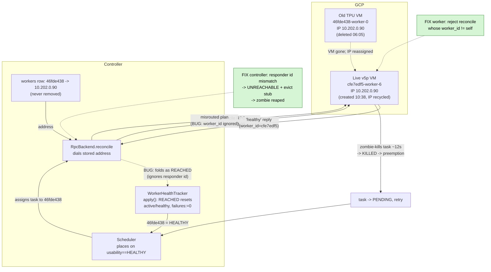

# Recycled-IP zombie worker black-holes and kills every task it is assigned

**Date:** 2026-06-16
**Cluster:** marin (GCP)
**Symptom:** A TPU training task (`/eczech/prot-exp75-w4p-e4-lr5e-4-wd0p1/.../0`)
was assigned to the *same* worker four times in a row, each attempt KILLED after
10–15 s (exit code 0, no error), charged as a preemption, then it finally ran
fine on a different worker.

## TL;DR

A v6e-8 slice (`...0508-46fde438`) was declared failed by the ping loop at
**06:05** and its TPU was deleted. The controller's `workers` row + in-memory
liveness for `...46fde438-worker-0` were **not** durably removed. At **10:38**
GCP recycled that worker's internal IP `10.202.0.90` onto a brand-new, healthy
v5p worker (`...1038-cfe7edf5-worker-6`). From then on, every control tick the
controller reconciled the **dead** worker by dialing its stale address — which
now reached the **live** v5p worker. The live worker answered "healthy", the
controller folded that as **REACHED**, which **reset the dead worker's failure
counter to zero and marked it HEALTHY again** — so the scheduler kept treating it
as a valid placement target. Every task placed there was killed ~12 s later
(misrouted reconcile cross-talk), charged as a preemption, retried, re-placed on
the same zombie — a loop that only broke when the autoscaler happened to bring up
a fresh slice the retry landed on.

The zombie was a **scheduling black hole** for **16+ hours**, killing tasks
across at least three jobs (`eczech/...wd0p05`, `eczech/...wd0p1`,
`power/iris-run-job-...`).

## Timeline (UTC, 2026-06-16)

| Time | Event |
|------|-------|
| 05:08 | Slice `...0508-46fde438` (v6e-8, addr `10.202.0.90`) created. |
| 05:15 → 06:05 | Repeated `reconcile_rpc_failed` (Request timed out) to `...46fde438-worker-0`. |
| 06:05:07 | **Ping loop** fails it over the ping threshold → `worker_failing` → `worker_failed` → autoscaler `worker_failed` → **TPU deleted (async)**. (Worker row + liveness linger.) |
| 10:38 | New v5p worker `...1038-cfe7edf5-worker-6` created; **GCP recycles IP `10.202.0.90` onto it.** |
| 13:32 | `reconcile_rpc_failed` to the zombie now returns **Connection refused** (old VM gone). |
| 13:32 → ~10:38+ | Reconciles to the zombie's address start reaching the **live** v5p worker → "healthy" → **REACHED** → zombie resurrected to HEALTHY/schedulable. |
| ~21:45 → 22:13 | Zombie black-holes `eczech/prot-exp75-w4e-...wd0p05/0`: assigned ≈ every 50 s, each killed in ~12 s. Recurring log: `apply_reconcile: worker ...46fde438-worker-0 sent 1 observations outside the plan; dropping`. |
| 22:19:26 | `prot-exp75-...wd0p1/0` attempt 0 assigned to the zombie → KILLED 22:19:41 (14.4 s). |
| 22:20:10 | attempt 1 → KILLED (11.5 s). |
| 22:20:50 | attempt 2 → KILLED (15.0 s). |
| 22:21:28 | attempt 3 → KILLED (15.7 s). |
| 22:22:20 | Zombie starts black-holing `power/iris-run-job-...` (attempts 3–10 all KILLED ~12–16 s). |
| 22:22:39 | Autoscaler creates fresh slice `...2222-db160366` (v6e-8). |
| 22:27:26 | `prot-exp75-...wd0p1/0` attempt 4 lands on `db160366` → **runs normally** (training resumes from step 3379). |

Both `...46fde438-worker-0` (zombie) and `...cfe7edf5-worker-6` (live) carry
address `10.202.0.90:10001` in the `workers` table — confirming the IP reuse.

## Root cause

The worker-daemon reconcile path **identifies workers only by stored address**,
with no check that the daemon answering at that address is the worker we meant to
reach:

1. **Controller** (`backends/rpc/backend.py::RpcTaskBackend.reconcile`): any
   non-error, self-healthy reconcile reply was folded as `REACHED`, regardless of
   the responder's identity. `WorkerHealthTracker.apply` then re-creates/refreshes
   the (dead) worker's liveness via `setdefault(...)` as `active=True,
   healthy=True, consecutive_failures=0` → HEALTHY → schedulable. The zombie could
   never accumulate enough failures to be reaped because the impostor kept
   resetting them.
2. **Worker** (`worker/worker.py::Worker.handle_reconcile`): "Routing is by
   attempt_uid only" — the handler ignored `ReconcileRequest.worker_id`, so the
   live v5p worker acted on the dead worker's plan (running its tasks /
   zombie-killing its own attempts that were absent from the misrouted plan). This
   cross-talk is what actually killed each task ~12 s in.

## Fix

Validate worker identity on both ends of the reconcile RPC:

- **Worker** refuses a `ReconcileRequest` whose `worker_id` ≠ its own id
  (logs a warning, returns its real id with empty observations, does not touch
  its task set or heartbeat). A misrouted reconcile can no longer corrupt the
  live worker.
- **Controller** captures the responder's `worker_id` and, on mismatch, folds the
  outcome as `UNREACHABLE` (not `REACHED`) and evicts the stale stub. The zombie
  now accrues failures → crosses the threshold → is reaped and removed, and the
  impostor's healthy reply can never resurrect it.

Together these break the loop and let the stale worker get cleaned up.

## Control-flow diagram

## Diagnostic recipe (for next time)

- Two `workers` rows sharing one address ⇒ recycled IP:
  `SELECT worker_id, address FROM workers WHERE address LIKE '<ip>%';`
- A worker still in `workers` whose `slices` row is gone ⇒ orphan/zombie.
- Recurring `apply_reconcile: worker <id> sent N observations outside the plan;
  dropping` ⇒ the controller is reaching a *different* worker than intended.
- `iris query "SELECT attempt_id,state,exit_code,worker_id,created_at_ms,finished_at_ms
  FROM task_attempts WHERE task_id='<task>' ORDER BY created_at_ms"` — repeated
  KILLED (state 6), null exit, on the same `worker_id`, ~10–15 s apart.
