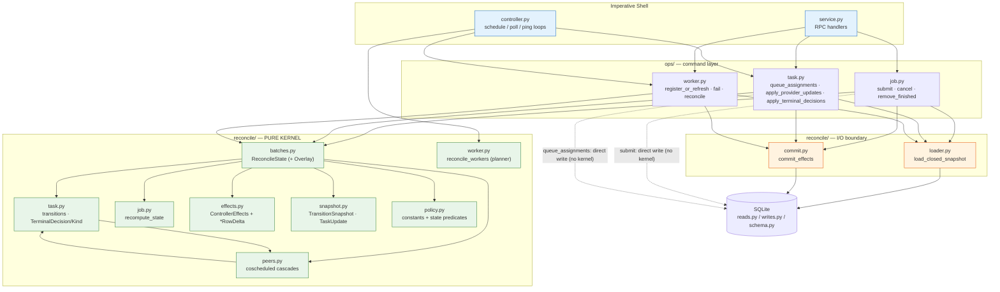
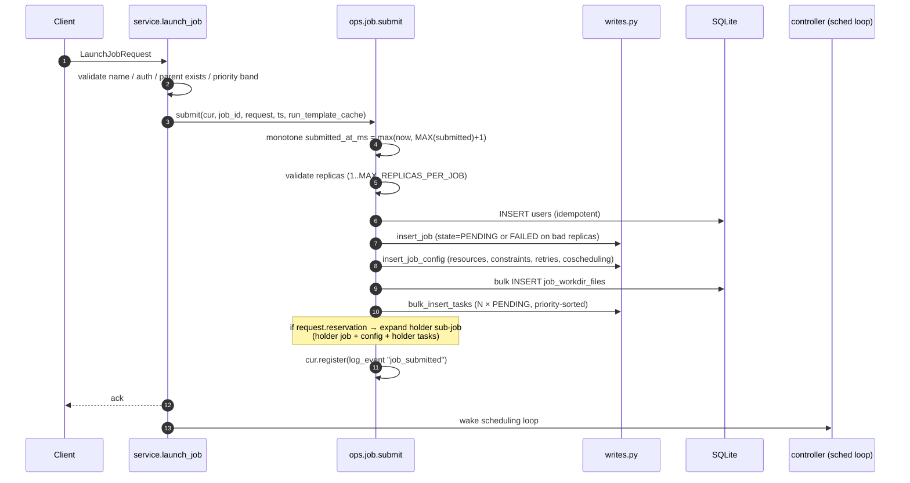
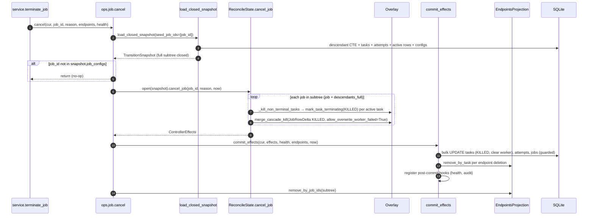
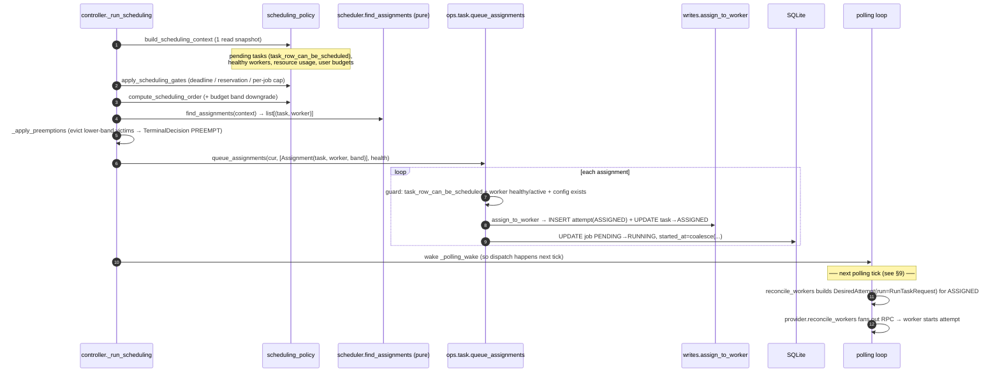
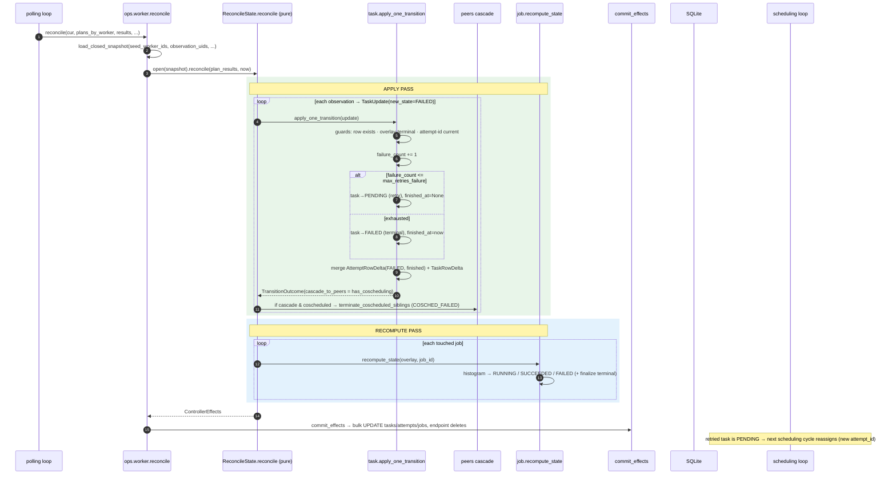
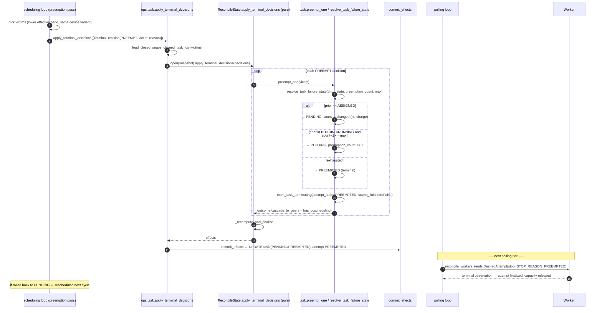

# Iris Controller — Reconciliation Control-Flow Report

**Date:** 2026-05-31
**Scope:** `lib/iris/src/iris/cluster/controller/` — the reconcile + ops refactor
**Branch:** `weaver/iris-reconcile-performance`

This report documents the static and dynamic control flow of the refactored
controller reconciliation logic, with sequence diagrams for the common
lifecycle actions, and closes with an architectural analysis of naming and
control-flow conventions.

---

## 1. Architecture at a Glance

The refactor implements a **functional core / imperative shell** design with
five concentric layers:

```
┌──────────────────────────────────────────────────────────────────────┐
│  service.py  — RPC handlers (auth, validation), no state mutation       │  imperative shell
│  controller.py — three background loops (schedule / poll / ping)        │
├──────────────────────────────────────────────────────────────────────┤
│  ops/{job,task,worker}.py — aggregate-scoped commands                   │  command layer
│      pattern: open tx → load snapshot → kernel verb → commit effects    │
├──────────────────────────────────────────────────────────────────────┤
│  reconcile/loader.py  (load_closed_snapshot)   → I/O in                 │  I/O boundary
│  reconcile/commit.py  (commit_effects)         → I/O out                │
├──────────────────────────────────────────────────────────────────────┤
│  reconcile/batches.py  — ReconcileState facade (two-pass orchestration) │  PURE KERNEL
│  reconcile/{task,job,peers,overlay,policy,worker,snapshot,effects}.py    │  (no db/schema)
└──────────────────────────────────────────────────────────────────────┘
```

### The kernel contract

Every state-changing operation (except scheduler assignment — see §8) follows
the same five-step shape, owned by an `ops/` verb:

```python
snapshot = load_closed_snapshot(cur, now=now, seed_*=...)   # reconcile/loader.py
effects  = ReconcileState.open(snapshot).<verb>(...)        # reconcile/batches.py (pure)
commit_effects(cur, effects, health=..., endpoints=..., now=now)  # reconcile/commit.py
```

* **`TransitionSnapshot`** (`reconcile/snapshot.py:34`) is a *closed-world*
  immutable bundle: every task/attempt/job/active-row the kernel may read for
  the batch, plus the transitive descendant + coscheduled-peer graph, so the
  kernel **never re-queries the DB mid-batch**.
* **`ReconcileState`** (`reconcile/batches.py`) layers prospective state in a
  mutable **`Overlay`** over the snapshot and accumulates a
  **`ControllerEffects`**.
* **`ControllerEffects`** (`reconcile/effects.py:69`) is the *only* value that
  crosses from the pure core back to I/O: dicts of `TaskRowDelta` /
  `AttemptRowDelta` / `JobRowDelta` plus side-effect request lists
  (endpoint deletions, worker-health pokes, audit log events).

### The two-pass kernel invariant

Every `ReconcileState` verb runs two passes so batches are order-independent and
avoid O(tasks²) recompute loops:

1. **Apply pass** — per-update/decision state transitions + coscheduled-peer
   cascades, merged into the overlay; touched job IDs recorded.
2. **Recompute/finalize pass** (`_recompute_and_finalize`) — one
   `job.recompute_state` per touched job, terminal-job finalization (kill
   remaining tasks, cascade to children), then drain deferred child cascades.

---

## 2. Static Control Flow (call graph)



**Dependency direction (verified):** `controller`/`service` → `ops` →
{`loader`, `commit`, `batches`}; the pure kernel modules import only each other
+ `task_state` + `rpc` + `rigging.timing` — **never** `db`/`schema`/
`projections`/`reads`/`writes`. The two dashed edges are the deliberate
exceptions (§8).

### Key data structures

| Type | Defined | Role |
|------|---------|------|
| `TransitionSnapshot` | `reconcile/snapshot.py:71` | Closed-world immutable input bundle |
| `TaskUpdate` | `reconcile/snapshot.py:19` | Provider-agnostic per-task state update |
| `TerminalDecision` / `TerminalKind` | `reconcile/task.py:69,45` | Controller-initiated terminal intents (`PREEMPT`/`TIMEOUT`/`UNSCHEDULABLE`) |
| `TransitionOutcome` | `reconcile/task.py:81` | Per-transition result; carries `cascade_to_peers` |
| `ControllerEffects` | `reconcile/effects.py:113` | Pure output: row deltas + side-effect requests |
| `TaskRowDelta`/`AttemptRowDelta`/`JobRowDelta` | `reconcile/effects.py:35,52,65` | Keyed, foldable row mutations |
| `Overlay` | `reconcile/overlay.py` | Mutable prospective state over the snapshot |
| `ActiveTaskRow` | `task_state.py:110` | Cascade/scheduling projection (task↔job↔config) |
| `Assignment` | `ops/task.py:42` | Scheduler decision `(task_id, worker_id, band)` |

---

## 3. Submit Job

RPC `LaunchJob` → `service.launch_job` → `ops.job.submit` (`ops/job.py:46`).
Submit is a **pure direct write** — it does not touch the kernel; it inserts the
job row, job_config, optional workdir files, and N `PENDING` task rows, plus an
optional reservation-holder sub-job.



**Notes**
- Monotone submission timestamp is derived from `MAX(jobs.submitted_at_ms)+1`
  (`ops/job.py:65`) rather than a separate counter table.
- Invalid `replicas` does not raise — it writes a `JOB_STATE_FAILED` job with an
  `error` string and zero tasks (`ops/job.py:104-114`).
- Reservation handling inlines a *second* full job/config/task insertion for the
  holder (`ops/job.py:216-306`) — see analysis §10 (duplication).

---

## 4. Cancel Job

RPC `terminate_job` → `ops.job.cancel` (`ops/job.py:318`). Unlike submit, cancel
**goes through the kernel** so that cancelling one half of a coscheduled group
cascades termination to its surviving peers (the bug the legacy direct-SQL
cancel had).



**Notes**
- `allow_overwrite_worker_failed=True` widens the cascade-kill guard so KILLED
  can overwrite a `WORKER_FAILED` job (`effects.py:65`, applied in `commit`).
- The post-cancel `endpoints.remove_by_job_ids(subtree)` sweep
  (`ops/job.py:351`) cleans endpoints whose owning task was already terminal
  (the kernel only emits `EndpointDeletion` for tasks it actively killed).

---

## 5. Schedule Task

Scheduling runs on its own loop (`controller._run_scheduling_loop`). Selection +
worker-matching is pure (`scheduling_policy.py` + `scheduler.py`); the commit is
the **second documented kernel exception** — a direct `PENDING → ASSIGNED`
write via `ops.task.queue_assignments` (no cascade semantics). The actual
dispatch to the worker happens later, on the polling loop.



**Notes**
- Worker selection (`scheduler.find_assignments`) is a pure bin-packer over
  worker capacity + hard/soft constraints; no I/O.
- The `Assignment.priority_band` is stamped point-in-time so the preemption pass
  uses a fixed band rather than re-evaluating spend each tick (avoids mutual
  preemption at the budget cliff — `ops/task.py:42-58`).
- **Coscheduling**: the scheduler skips coscheduled jobs in the preference pass
  (atomic all-or-nothing); siblings are resolved together. Sibling discovery is
  `peers.find_coscheduled_siblings`.
- **Reservation holder** (`is_reservation_holder`) tasks are *admitted* (anchor
  the worker for taint injection) but never produce a worker-bound
  `RunTaskRequest` (`ops/task.py:69-77`).

---

## 6. Task Failure (with retry)

A worker reports `TASK_STATE_FAILED` via the polling-loop reconcile. The kernel
decides retry-vs-terminal from `failure_count` vs `max_retries_failure`.



**Decision predicate** — `task_state.task_is_finished` (`task_state.py:62`):
`FAILED` is terminal iff `failure_count > max_retries_failure`; `WORKER_FAILED`/
`PREEMPTED` terminal iff `preemption_count > max_retries_preemption`.

---

## 7. Preempt Task

Preemption is decided in the scheduling loop's preemption pass and enacted as a
batch of `TerminalDecision(kind=PREEMPT)` through
`ops.task.apply_terminal_decisions`. The kernel rolls an executing victim back
to `PENDING` (charging a preemption) or to terminal `PREEMPTED` when the budget
is spent; the worker is told to stop on the next polling tick, and its terminal
observation finalizes the attempt.



**Note** — the attempt is left *unfinished* by the preemption decision
(`stamp_attempt_finished=False`) because the worker is still running it; the
worker's stop-and-report on the next reconcile finalizes the attempt and frees
capacity.

---

## 8. Worker Failure → Task Retry

Liveness is detected by the **ping loop** (no heartbeat RPC path anymore — the
legacy `apply_heartbeats` was removed). After `PING_FAILURE_THRESHOLD`
consecutive failures, the worker is failed via `ops.worker.fail`, which runs the
kernel `fail_workers` verb in **chunked transactions** so the SQLite writer is
released during a zone-wide failure.

```mermaid
sequenceDiagram
    autonumber
    participant PG as controller._run_ping_loop
    participant HT as WorkerHealthTracker
    participant TW as controller._terminate_workers
    participant OWF as ops.worker.fail
    participant CH as _apply_worker_failures_chunk
    participant RS as ReconcileState.fail_workers (pure)
    participant TK as resolve_task_failure_state / finalize_attempt
    participant CM as commit_effects
    participant W as writes.remove_worker
    participant AS as autoscaler / provider

    loop every heartbeat_interval (~5s)
        PG->>PG: provider.ping_workers(active)
        PG->>HT: ping(worker, healthy=err is None)
        PG->>HT: workers_over_threshold()  (>= PING_FAILURE_THRESHOLD)
    end
    PG->>TW: _terminate_workers(unhealthy, reason)
    TW->>OWF: fail(db, worker_ids, reason, health, endpoints, worker_attrs)
    OWF->>OWF: read_snapshot → filter to active workers
    loop chunks of FAIL_WORKERS_CHUNK_SIZE (10), one tx each
        OWF->>OWF: re-check liveness inside write tx (race guard)
        OWF->>CH: _apply_worker_failures_chunk(live_chunk)
        CH->>CH: load_closed_snapshot(seed_worker_ids)  # closes active tasks + peer graph
        CH->>RS: open(snapshot).fail_workers(failures)
        loop each active task on dead worker
            RS->>TK: resolve_task_failure_state(prior, preemption_count, max, WORKER_FAILED)
            alt ASSIGNED → PENDING · executing & budget left → PENDING(+1) · else WORKER_FAILED
                TK->>TK: finalize_attempt(attempt_state=WORKER_FAILED, stamp finished)
            end
            RS->>RS: cascade to coscheduled peers; recompute touched jobs
        end
        RS-->>CH: effects (incl. emit_worker_make_unhealthy)
        CH->>CM: commit_effects  (BEFORE remove_worker — attempts are FK-referenced)
        CH->>W: remove_worker (DELETE worker, CASCADE attrs; health.forget)
    end
    TW->>AS: provider.on_worker_failed + autoscaler slice-sibling teardown
    Note over RS: retried tasks are PENDING → rescheduled on a healthy worker (new attempt)
```

**Notes**
- `ASSIGNED` victims always retry (never executed → no preemption charge);
  `BUILDING`/`RUNNING` victims charge a preemption and retry within budget, else
  go terminal `WORKER_FAILED`.
- **Commit order matters**: `commit_effects` runs *before* `remove_worker`
  because task mutations reference attempt rows that `remove_worker` would
  CASCADE-delete (`ops/worker.py:251`).
- Note the signature asymmetry: `ops.worker.fail` takes a `ControllerDB`
  (it owns its chunked transactions); all other ops verbs take a `Tx`.

---

## 9. Bulk Reconcile Loop (per tick)

The polling loop is the steady-state engine: it snapshots which attempts are
live on healthy workers, builds a desired-state plan per worker, fans out
`Reconcile` RPCs, then folds every worker's observations through the kernel in
one write transaction. Timeout scans piggyback (~once/minute) as a separate
`apply_terminal_decisions` batch.

```mermaid
sequenceDiagram
    autonumber
    participant PL as controller._reconcile_tick
    participant SNAP as _snapshot_reconcile_inputs (read tx)
    participant WP as reconcile.reconcile_workers (planner, pure)
    participant PROV as provider.reconcile_workers (RPC fan-out)
    participant OW as ops.worker.reconcile
    participant RS as ReconcileState.reconcile (pure, ONE overlay)
    participant CM as commit_effects
    participant OT as ops.task.apply_terminal_decisions

    PL->>SNAP: snapshot inputs (scan_timeouts ~1/min)
    SNAP->>SNAP: list_active_healthy_workers
    SNAP->>SNAP: live worker-bound attempts (idx_task_attempts_live_workerbound)
    SNAP->>SNAP: run_request_template per ASSIGNED job
    SNAP->>SNAP: _scan_execution_timeouts → [TerminalDecision(TIMEOUT)]
    SNAP-->>PL: ReconcileInputs, addresses, timeout_decisions
    PL->>WP: reconcile_workers(inputs) → WorkerReconcilePlan per worker
    Note over WP: ASSIGNED→run(spec) · BUILDING/RUNNING→keep-alive ·<br/>terminal→stop(reason)
    PL->>PROV: reconcile_workers(plans, addresses)  (async, capped parallelism)
    PROV-->>PL: [ReconcileResult(observations | error)]
    rect rgb(227,242,253)
    note over PL,CM: single write transaction
        PL->>OW: reconcile(cur, plan_by_worker, results, ...)
        OW->>OW: load ONE closed snapshot over all (plan,result) pairs
        OW->>RS: open(snapshot).reconcile(plan_results, now)
        Note over RS: shared overlay → earlier workers' cascade kills<br/>visible to later workers; two-pass apply+recompute
        RS-->>OW: effects
        OW->>CM: commit_effects
        PL->>OT: apply_terminal_decisions(cur, timeout_decisions, ...)
    end
```

**Three independent loops** (background threads in `controller.py`):

| Loop | Cadence | Responsibility |
|------|---------|----------------|
| `_run_scheduling_loop` | adaptive backoff | select pending tasks, match workers, `queue_assignments`, run preemption pass |
| `_run_polling_loop` | ~1s (+ wake) | reconcile desired/observed task state per worker; timeout scan |
| `_run_ping_loop` | ~5s | worker liveness; fail workers over threshold |

Cross-loop signalling is via `Event` wakeups (`_scheduling_wake`,
`_polling_wake`): submit/cancel wake scheduling; `queue_assignments` wakes
polling so the new `ASSIGNED` rows dispatch immediately.

---

## 10. Analysis: Conventions, Boundaries, and Best-Practice Alignment

### 10.1 What the refactor gets right

**Clean functional-core / imperative-shell split (verified).** Every pure
kernel module (`batches`, `task`, `job`, `peers`, `overlay`, `policy`,
`snapshot`, `effects`, `worker`) imports only other kernel modules + `task_state`
+ `rpc` + `rigging.timing`. None import `db`, `schema`, `projections`, `reads`,
or `writes`. The only two I/O touchpoints — `loader.load_closed_snapshot` and
`commit.commit_effects` — are deliberately *not* re-exported from
`reconcile/__init__.py` to keep the package surface pure (`__init__.py:17-21`).
This is a textbook functional-core boundary, and it is actually enforced by the
import graph rather than just documented.

**The kernel contract is uniform.** All five mutating `ops` verbs that use the
kernel follow the identical `load_closed_snapshot → ReconcileState.open(snap)
.<verb>(...) → commit_effects(cur, effects, health=, endpoints=, now=)` shape.
`commit_effects` has one stable keyword-only signature across every call site.
The `ReconcileState.open(snapshot).<verb>()` fluent facade reads consistently.

**Closed-world snapshot is a strong invariant.** Loading the full descendant +
coscheduled-peer graph up front means the kernel is genuinely pure and
deterministic (same snapshot → same effects), cascades never re-query, and the
whole batch commits atomically. This is the single biggest correctness win of
the design and it is applied consistently (cancel, reconcile, fail_workers,
terminal decisions all seed the loader and trust the closure).

**Two-pass apply/recompute is consistent and well-motivated.** Every verb
records touched jobs in the apply pass and runs exactly one
`recompute_and_finalize`, which keeps recompute O(jobs) instead of O(updates)
and makes batch order irrelevant. The shared overlay across `(plan, result)`
pairs in the bulk loop (so earlier cascade-kills are visible to later workers)
is a real, documented design property, not an accident.

**Effect typing is disciplined.** `ControllerEffects` carries typed row deltas
with explicit keyed-fold merge rules (`effects.py:86`), so repeated merges of the
same row collapse to one write and the fold semantics (first-wins timestamps,
last-non-null fields) live in one place. The `merge_*` (typed row delta) vs
`emit_*` (cross-aggregate side effect) prefix split in the overlay is a clear,
followed convention.

**Vocabulary is coherent.** `snapshot / overlay / effect / delta / verb /
cascade / outcome / decision` are used consistently across modules, and the
`working_state.py → overlay.py` rename is complete (no stale `working_state`
references remain).

### 10.2 Rough edges and inconsistencies

These are real but mostly minor; none break the architecture.

1. **Two documented kernel bypasses weaken the "one path" story.**
   `ops.job.submit` (insert) and `ops.task.queue_assignments`
   (`PENDING→ASSIGNED`) write the DB directly, not through the kernel. Both are
   defensible — submit has no prior state to reconcile, and assignment has no
   cascade semantics — and both are documented (`ops/task.py:8-15`,
   `ops/task.py:61-77`). But it means a reader can't assume "all task state
   transitions flow through the kernel"; `current_attempt_id` is bumped in
   `writes.assign_to_worker`, while every *other* attempt transition is a kernel
   delta. The asymmetry is intentional but is a sharp edge for maintainers.

2. **`ops` verb naming is not uniform.** Two naming schemes coexist:
   bare verbs (`submit`, `cancel`, `fail`, `reconcile`) and `verb_noun`
   (`queue_assignments`, `apply_provider_updates`, `apply_terminal_decisions`,
   `register_or_refresh`, `remove_finished`). Module-qualified call sites read
   fine (`ops.job.submit`), but within `ops/task.py` the mix of `apply_*` and
   `queue_*` is arbitrary. A single convention (prefer `verb_noun`) would read
   better.

3. **`ops` verb *signatures* are inconsistent.** Most verbs take `cur: Tx`
   (caller owns the transaction); `ops.worker.fail` takes `db: ControllerDB` and
   opens its own chunked transactions. The reason (release the SQLite writer
   during zone-wide failure) is sound and documented, but it breaks the "every
   ops verb is a step inside one caller-owned tx" mental model, and it's the kind
   of asymmetry worth a one-line callout at the module level.

4. **`load_closed_snapshot` is a kitchen-sink loader.** Its signature accepts
   `seed_job_ids`, `seed_task_ids`, `seed_worker_ids`, `extra_attempt_keys`, and
   `observation_uids`, and each caller passes a different subset. This is
   flexible and avoids five near-duplicate loaders, but the wide optional-kwargs
   surface makes it non-obvious which combination yields a valid closure for a
   given verb. Worth a docstring table mapping caller → required seeds.

5. **`ops.job.submit` is large and self-duplicating.** At ~270 lines it is by
   far the heaviest command, and the reservation-holder path
   (`ops/job.py:216-306`) re-implements the same `insert_job` /
   `insert_job_config` / `task_row` / `bulk_insert_tasks` sequence as the main
   job with a parallel set of `holder_*` locals. Extracting an
   `_insert_job_with_tasks(...)` helper would remove the duplication and shrink
   the function substantially. This is the clearest single cleanup target.

6. **`controller.py` remains a 1,559-line orchestrator.** The imperative shell
   legitimately owns thread lifecycle, three loops, snapshot-input assembly,
   scheduler-pass wiring, and wake signalling — but it is large enough that the
   scheduling-pass helpers (`_run_scheduler_pass`, `_apply_preemptions`,
   `_commit_assignments`) and the snapshot-input builder are plausible
   extraction candidates if it keeps growing.

7. **Minor: `task_state.py` lives at the controller level, not in `reconcile/`,
   yet is imported by pure kernel modules.** This is fine (it is itself pure —
   predicates + frozen dataclasses), but it means the "pure kernel" set is
   actually `reconcile/* + task_state.py`, which the package docstring doesn't
   quite say. A reader auditing purity has to know `task_state` is honorary
   kernel.

### 10.3 Verdict

The refactor is a faithful, well-executed functional-core / imperative-shell
design. The boundary is real (import-graph-enforced, not just documented), the
kernel contract is uniform, and the closed-snapshot + two-pass invariants are
genuine correctness improvements that fixed real bugs (coscheduled cancel,
budget-cliff mutual preemption). The remaining issues are surface-level:
naming/signature inconsistencies in the `ops` layer, two intentional-but-sharp
kernel bypasses, a kitchen-sink loader signature, and one large self-duplicating
`submit`. None compromise the architecture; the highest-value follow-ups are
(a) de-duplicating `ops.job.submit`'s reservation path and (b) standardizing
`ops` verb naming/signatures with a short module-level note on the deliberate
exceptions.

---

### Appendix: primary file references

| Concern | File |
|---------|------|
| Loops, wake signalling, snapshot inputs | `controller.py` (`_run_scheduling_loop`, `_run_polling_loop`, `_run_ping_loop`, `_reconcile_tick`, `_snapshot_reconcile_inputs`, `_terminate_workers`) |
| RPC handlers | `service.py` (`launch_job`, `terminate_job`) |
| Job commands | `ops/job.py` (`submit:46`, `cancel:318`, `remove_finished:355`) |
| Task commands | `ops/task.py` (`queue_assignments:61`, `apply_provider_updates:138`, `apply_terminal_decisions:164`) |
| Worker commands | `ops/worker.py` (`register_or_refresh:52`, `fail:152`, `_apply_worker_failures_chunk:226`, `reconcile:258`) |
| Kernel facade + two-pass | `reconcile/batches.py` (`ReconcileState`) |
| Transitions / terminal intents | `reconcile/task.py` (`apply_one_transition`, `preempt_one`, `resolve_task_failure_state`, `TerminalDecision/Kind`) |
| Job recompute | `reconcile/job.py` (`recompute_state:17`) |
| Coscheduled cascades | `reconcile/peers.py` (`find_coscheduled_siblings`, `terminate_coscheduled_siblings`, `requeue_coscheduled_siblings`) |
| Prospective state | `reconcile/overlay.py` (`Overlay`) |
| Effects + deltas | `reconcile/effects.py` |
| Snapshot inputs | `reconcile/snapshot.py`, `reconcile/loader.py` (`load_closed_snapshot`) |
| Commit | `reconcile/commit.py` (`commit_effects`) |
| State predicates | `task_state.py` (`task_is_finished:62`, `task_row_can_be_scheduled:81`, `ActiveTaskRow:110`) |
