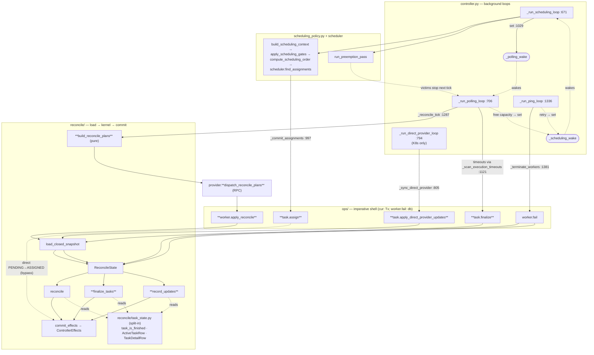

# Iris reconcile: naming cleanup + scheduling flow (DRAFT for review)

Status: **proposal only — no edits made.** Follow-on to
`2026-05-31_iris_reconcile_control_flow.md`. The two wins flagged there were
(1) pull `task_state.py` into the kernel and (2) make the verb names consistent.
This doc grounds both in the actual scheduling call graph, proposes a concrete
naming rule, redraws the flow under the new names, and critiques the result.

Call sites and signatures below were re-verified against source (file:line).

---

## 1. What's actually inconsistent (the evidence)

### 1a. "reconcile" means seven different things

Grepping the controller package, the bare word `reconcile` is the name of:

| # | symbol | file:line | what it actually is |
|---|--------|-----------|---------------------|
| 1 | `_run_polling_loop` / `_reconcile_tick` | controller.py:706, 1287 | the polling **loop** + one tick |
| 2 | `reconcile_workers` | reconcile/worker.py:94 | **pure planner** → `list[WorkerReconcilePlan]` |
| 3 | `provider.reconcile_workers` | worker_provider.py:196 | the **RPC fan-out** to workers |
| 4 | `ops.worker.reconcile` | ops/worker.py:258 | the **commit** of reconcile results |
| 5 | `ReconcileState.reconcile` | reconcile/batches.py:162 | the **kernel fold** |
| 6 | `reconcile/` | (package) | the kernel subsystem |
| — | `reconcile_user_budget_tiers`, `ScalingGroup.reconcile` | budget.py:169, autoscaler/scaling_group.py:608 | unrelated |

Four of these (#2–#5) fire *in a single chain* inside `_reconcile_tick`:

```python
plans   = reconcile_workers(inputs)                 # plan   (pure)
results = self._provider.reconcile_workers(plans, addresses)  # dispatch (RPC)
apply_reconcile(cur, plans_by_worker, results, ...) # commit  (ops.worker.reconcile)
#   └─ which internally calls ReconcileState(...).reconcile(...)   # fold (kernel)
```

### 1b. The code already aliases at import to stay sane

`controller.py:48–69` renames two ops verbs *at the import* purely to tell them
apart:

```python
from iris.cluster.controller.ops.worker import reconcile as apply_reconcile
from iris.cluster.controller.ops.task   import apply_provider_updates as apply_direct_provider_updates
```

If a name has to be aliased everywhere it's used to be readable, the definition
is misnamed. **The on-disk name should be the name you'd alias it to.** That's
the single clearest signal in the whole package.

### 1c. `ops/` verbs alias the kernel verb they wrap

`ops.task.apply_provider_updates` → `ReconcileState.apply_provider_updates`;
`ops.task.apply_terminal_decisions` → `ReconcileState.apply_terminal_decisions`;
`ops.worker.reconcile` → `ReconcileState.reconcile`. Same name on both sides of
the imperative-shell / pure-core line the refactor exists to draw.

### 1d. One transaction-signature outlier (and it's justified)

Re-checked every ops verb's first parameter:

| ops verb | first param |
|----------|-------------|
| `job.submit`, `job.cancel`, `job.remove_finished` | `cur: Tx` |
| `task.queue_assignments`, `task.apply_provider_updates`, `task.apply_terminal_decisions` | `cur: Tx` |
| `worker.register_or_refresh`, `worker.reconcile` | `cur: Tx` |
| **`worker.fail`** | **`db: ControllerDB`** |

So the norm is `cur: Tx` (caller owns the transaction); `worker.fail` is the
*only* deviation — and a principled one: it commits in chunks
(`FAIL_WORKERS_CHUNK_SIZE=10`), so it must own several transactions, which a
single caller-supplied `Tx` can't express. (My earlier draft had this
backwards — the fix is to keep `cur: Tx` as the rule, not to move everything to
`db`.)

### 1e. `task_state.py` is package-wide vocabulary, not kernel-private

It's imported by **18 modules**, including outer-layer ones the kernel must not
pull in: `service.py`, `budget.py`, `scheduling_policy.py`, `direct_provider.py`,
`reads.py`, `controller.py`, `ops/task.py` — alongside the whole `reconcile/`
package. It also contains `hint_rare_state` (a SQLite `likelihood()` planner
hint) and `task_row_can_be_scheduled` — query-flavored helpers that serve the
scheduler and `reads.py`, **not** the pure kernel.

So a wholesale "move it into `reconcile/`" is wrong: it would make the kernel a
vocabulary provider for the entire package and drag a SQL planner hint into the
"no-db" core. The right move is a **split** (§2d).

---

## 2. Proposed naming rule

**Name by layer role, and never let a name appear in two layers. Pick names
that don't need an import alias.**

### 2a. Disambiguate the reconcile chain by verb prefix

Each step keeps "reconcile" but gains a verb that says which step it is; the
bare `reconcile` survives only as the kernel fold (the one true meaning).

| today | proposed | role |
|-------|----------|------|
| `reconcile_workers` (reconcile/worker.py) | `build_reconcile_plans` | plan (pure) |
| `provider.reconcile_workers` | `dispatch_reconcile_plans` | RPC fan-out |
| `ops.worker.reconcile` | `ops.worker.apply_reconcile` | commit |
| `ReconcileState.reconcile` | `reconcile` (keep) | kernel fold |
| `_reconcile_tick` | `_reconcile_tick` (keep) | loop tick |

The chain reads `build_… → dispatch_… → apply_… → reconcile`, and the
`reconcile as apply_reconcile` import alias **disappears** because the ops verb
is now literally `apply_reconcile`.

### 2b. Kernel verbs (`reconcile/` `ReconcileState`) — drop `apply_`

`apply_` distinguishes nothing in the kernel (everything applies) and collides
with the ops wrapper.

| today | proposed |
|-------|----------|
| `apply_provider_updates` | `record_updates` |
| `apply_terminal_decisions` | `finalize_tasks` |
| `reconcile`, `cancel_job`, `fail_workers` | keep |

### 2c. `ops/` verbs — intent verbs, distinct from the kernel verb, no alias

| today (`ops.<mod>.…`) | proposed | wraps kernel |
|-----------------------|----------|--------------|
| `task.queue_assignments` | `task.assign` | (bypass — direct write) |
| `task.apply_provider_updates` | `task.apply_direct_provider_updates` | `record_updates` |
| `task.apply_terminal_decisions` | `task.finalize` | `finalize_tasks` |
| `worker.reconcile` | `worker.apply_reconcile` | `reconcile` |
| `worker.register_or_refresh` | `worker.register` | (upsert) |
| `worker.fail`, `job.submit`, `job.cancel`, `job.remove_finished` | keep | — |

Both import aliases in `controller.py` vanish:
`apply_provider_updates as apply_direct_provider_updates` → the name *is*
`apply_direct_provider_updates`.

### 2d. Split `task_state.py`, don't move it

- **Kernel-pure types/predicates** the `reconcile/` package reads
  (`ActiveTaskRow`, `TaskDetailRow`, `task_is_finished`, `attempt_is_terminal`,
  `attempt_is_worker_failure`, `ACTIVE_TASK_STATES`) → move into `reconcile/`
  (e.g. `reconcile/task_state.py`, or fold rows into `snapshot.py` and
  predicates into `policy.py`). This is what makes "kernel imports no I/O"
  checkable by a directory-scoped import lint.
- **Query-flavored helpers** (`hint_rare_state`, `task_row_can_be_scheduled`,
  `job_scheduling_deadline`) stay at the package level — they serve the
  scheduler, `ops/`, and `reads.py`, and `hint_rare_state` is SQLite-specific,
  so it must not live in the pure core.

### 2e. The one transaction rule

All `ops` verbs take `cur: Tx` (caller owns the boundary). `worker.fail` keeps
`db: ControllerDB` as the **sole, documented** exception because it owns chunked
multi-transaction commits — note that in its docstring so the asymmetry reads as
intentional, not accidental.

---

## 3. Scheduling control flow under the new names

Every scheduling-related path that originates in `controller.py`. New names in
**bold**; kernel-bypass writes dashed; cross-loop wakeups dotted.



**The four loops:**

- **scheduling loop** (`:671`) — `build_scheduling_context → gates → order →
  find_assignments`, then `_commit_assignments` calls **`ops.task.assign`** (the
  documented direct PENDING→ASSIGNED bypass) and sets `_polling_wake` so the new
  rows fan out on the next tick. `_apply_preemptions` marks victims; they stop on
  the next reconcile tick (no direct ops call).
- **polling loop** (`:706`) — *the reconcile chain*:
  **`build_reconcile_plans`** (pure) → **`dispatch_reconcile_plans`** (RPC) →
  **`ops.worker.apply_reconcile`** → kernel `reconcile`. Execution-timeout
  decisions from `_scan_execution_timeouts` go through **`ops.task.finalize`** in
  the same tick. Sets `_scheduling_wake` when capacity frees.
- **ping loop** (`:1336`) — liveness probe; over-threshold workers go through
  `ops.worker.fail` (→ kernel `fail_workers`, chunked tx). A retried task sets
  `_scheduling_wake`.
- **direct-provider loop** (`:794`, K8s only) — no scheduler/workers; folds
  provider reports via **`ops.task.apply_direct_provider_updates`** → kernel
  `record_updates`. This is the *only* caller of that verb, which is exactly why
  its real name should say "direct" instead of being aliased to it.

---

## 4. Analysis of the result

### What gets better

- **No symbol means two things.** The reconcile chain becomes
  `build_ → dispatch_ → apply_ → reconcile`; ops verbs and kernel verbs no
  longer share names. A call site tells you the layer without opening the callee.
- **Both import aliases disappear.** `controller.py:48–69` stops renaming
  imports because the definitions are finally named what they're used as. That's
  the concrete, measurable win — alias count goes to zero.
- **`apply_` stops being noise** in the kernel, where it distinguished nothing.
- **The kernel's import closure becomes checkable.** After the `task_state.py`
  split, `reconcile/` imports only `reconcile/` + types — a one-line directory
  import lint, instead of a convention you have to remember.
- **The tx-signature rule is now a rule with one named exception**, not a
  per-function coin flip.

### What this deliberately does not fix

- **The two bypasses still bypass.** `job.submit` (insert) and `task.assign`
  (direct write) still skip the kernel — correctly; they're not state-machine
  transitions. Renaming `queue_assignments → assign` just stops it *looking* like
  a kernel `queue_*` verb. Add a one-line "bypass — does not fold through
  ReconcileState" docstring to each.
- **`controller.py` stays ~1,559 lines** and `ops.job.submit` stays
  self-duplicating. Separate cleanups (prior report).

### Risks / cost

- **Pure mechanical churn, wide blast radius.** No-backward-compat repo, so every
  call site updates in one sweep: `controller.py`, `service.py`, `direct_provider.py`,
  `ops/`, and the kernel tests (`transition_driver.py` et al.). Low logic risk;
  `pyrefly` catches stragglers. Land as one commit per concern (kernel verbs / ops
  verbs / reconcile-chain rename / task_state split) so each is independently green.
- **The `task_state.py` split needs a judgment call per symbol** — which
  predicates are kernel-pure vs query-flavored. `hint_rare_state` (SQLite) and
  `task_row_can_be_scheduled` clearly stay out; the row dataclasses and
  terminal-state predicates clearly go in. A handful in between need a look.
- **`dispatch_reconcile_plans` touches the provider Protocol**
  (`worker_provider.py:196` and implementors), slightly wider than the controller
  package — worth confirming all implementors rename together.

### Suggested ordering

1. Split `task_state.py` (kernel-pure half → `reconcile/`); unblocks the import lint.
2. Rename kernel verbs (`apply_provider_updates → record_updates`,
   `apply_terminal_decisions → finalize_tasks`).
3. Rename the reconcile chain (`build_/dispatch_/apply_`) — kills the aliases.
4. Rename remaining `ops` verbs (`assign`, `finalize`, `register`,
   `apply_direct_provider_updates`); standardize `cur: Tx` + document `worker.fail`.

Each step is independently green under `pyrefly` + the reconcile tests.
