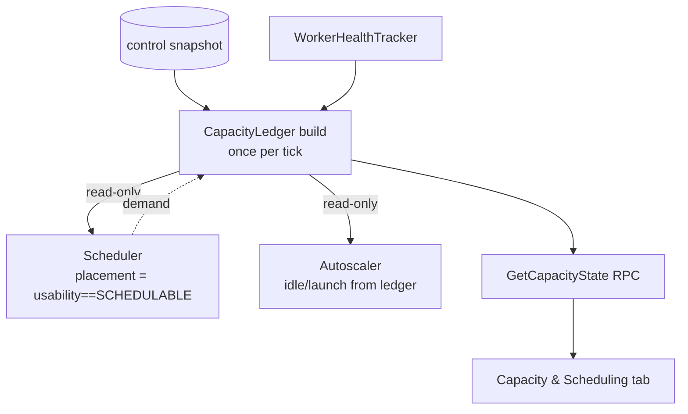

# Iris Autoscaler ↔ Scheduler State Disagreement: Diagnosis & a Unified Capacity Model

**Status:** Investigation + design proposal (no code changed yet)
**Author:** weaver session `inconsistent-autoscaler-state` (issue #178)
**Scope:** `lib/iris` controller — autoscaler, scheduler, dashboard

---

## TL;DR

The dashboard shows two v5p slices as **"idle Nm — eligible for scale-down"** (autoscaler tab)
while the scheduler simultaneously reports it is **"waiting for v5ps"**. This is not a single bug —
it is the *structural* consequence of a design where the autoscaler and the scheduler each derive
their own answer to *"is this slice usable?"* from **different, independently-evaluated predicates
over a shared worker table, with no reconciliation step and no shared state object** — and then the
dashboard renders those two answers in **two separate tabs** that never correlate.

There are **at least three different "is this worker alive enough?" predicates** in the controller,
plus a fourth slice-lifecycle notion. The autoscaler's idle detector uses the **loosest** one
(`active` only); the scheduler's placement gate uses the **strictest** one
(`healthy AND active AND consecutive_failures == 0`). A slice whose workers fall in the gap between
those predicates is *simultaneously* "idle, scale me down" and "unusable, still waiting."

The fix has two halves:
1. **State:** compute a single **per-tick Capacity Ledger** — one reconciled per-pool / per-slice
   view, with **one** liveness classification — that both the autoscaler and the scheduler read.
2. **Reporting:** collapse the separate Autoscaler and Scheduler tabs into **one "Capacity &
   Scheduling" view** keyed by pool, that answers the operator's real question in one place:
   *what is pending, where, why, and what is available.*

---

## 1. The symptom

```
20260616-1206-4c0a57c3   1 host · up 1h 59m   idle 26m — eligible for scale-down
20260616-1351-4f789d51   1 host · up 14m      idle 6m  — eligible for scale-down
        ↑ Autoscaler tab says: idle v5p capacity, shrink it

        Scheduler tab says:    "waiting for v5ps"
        ↓ i.e. pending demand it cannot place
```

Two views of the **same TPU family at the same instant** telling opposite stories: *too much* v5p
on one tab, *too little* on the other. An operator cannot tell from the UI whether this is a bug, a
race, or expected — and the two states are not even wired to the same data.

---

## 2. Root cause

### 2.1 The controller has (at least) three liveness predicates over one worker table

All three read the same `WorkerHealthTracker` (`scheduling/worker_health.py`), whose per-worker
record is `WorkerLiveness(healthy: bool, active: bool, consecutive_failures: int)`
(`worker_health.py:66-75`). `consecutive_failures` increments on every `UNREACHABLE` reconcile probe
and resets to 0 on `REACHED` (`worker_health.py:115,136,138`).

| # | Predicate | Used by | Code |
|---|-----------|---------|------|
| 1 | `active` | **Autoscaler idle map** (`worker_status_map`) | `controller.py:1474` |
| 2 | `healthy AND active` | Reconcile targets (keep probing) | `reads.py:1330` (`_healthy_active_worker_ids`) |
| 3 | `healthy AND active AND consecutive_failures == 0` | **Scheduler placement** | `reads.py:1341` (`_schedulable_worker_ids`) |

A fourth notion — the slice **lifecycle** `READY/BOOTING/INITIALIZING/FAILED` in the autoscaler's
own model (`scaling_group.py` `SliceLifecycleState`) — is *controller-model state, not worker
liveness*. (Known hazard: a slice adopted on controller restart can read `lifecycle=READY` with zero
live workers; `worker_healthy` is the authoritative per-host signal.)

The crucial asymmetry: **predicate #1 (autoscaler idle) is the loosest, #3 (scheduler placement) is
the strictest.** Every worker that is `active` but unhealthy or mid-failure lives in the gap.

### 2.2 How the autoscaler decides "idle → eligible for scale-down"

`worker_status_map` is built once per control tick from **only the `active` flag** — health and
failure count are not consulted:

```python
# controller.py:1467-1481  _worker_status_map_from_tx
worker_ids = {wid for wid, l in self._health.all().items() if l.active}      # <-- active only
running_by_worker = reads.running_tasks_by_worker(tx, worker_ids)
for wid in worker_ids:
    result[wid] = WorkerStatus(worker_id=wid,
        running_task_ids=frozenset(...running_by_worker.get(wid, set())...))
```

A worker `is_idle` iff it has **no running tasks** (`running_task_ids` empty). The autoscaler stamps
a slice's `quiet_since` the first tick all its workers are idle, and marks it eligible for
scale-down once `now - quiet_since >= idle_threshold`:

```python
# scaling_group.py:799-829
if self._slice_has_active_workers(state, worker_status_map):   # any worker with a running task?
    state.quiet_since = None
elif state.quiet_since is None:
    state.quiet_since = timestamp
...
return idle_duration >= self._idle_threshold        # is_slice_eligible_for_scaledown
```

Nothing in this path asks *"does the scheduler still have pending demand for this slice's pool?"* or
*"is this worker even schedulable?"* — it asks only *"is a task running right now?"*

### 2.3 How the scheduler decides "waiting for v5ps"

Placement only ever targets `_schedulable_worker_ids` = `healthy AND active AND
consecutive_failures == 0` (`reads.py:1341`). A pending task whose only candidate v5p workers are
unhealthy / mid-failure finds **no fitting worker** and stays pending. The user-facing reason is
assembled per-job by merging two independent sources:

```python
# service.py:1284-1291  (GetJobStatus)
sched_reason = self._controller.get_job_scheduling_diagnostics(job_id)   # scheduler view
hint = self._get_autoscaler_pending_hints().get(job_id)                  # autoscaler view
pending_reason = f"Scheduler: {sched_reason}\n\nAutoscaler: {scaling_prefix}{hint.message}"
```

The autoscaler hint comes from the **routing decision** (`status.py:116-171`). The telling branch:

```python
# status.py:154-160  -- fires when the pool needs NO new launch but the job still isn't placed
hints[job_id] = PendingHint(
    message=f"Waiting for workers in scale group '{primary_group}' to become ready{suffix}",
    is_scaling_up=False)
```

That is exactly the **"I have slices but they are not usable"** case — the routing layer sees the
pool, decides it does *not* need to launch more, yet the scheduler still cannot place. The two
subsystems are each individually self-consistent and jointly contradictory.

### 2.4 Demand is per-(size, zone) group, not per-family

The autoscaler routes pending demand to a specific scale group — each `tpu_pool` size expands into a
per-(size, zone) group (`config/marin.yaml:47-165`). An idle slice in group `v5p…8…us-central1-a`
**does not reduce demand** for group `v5p…64…us-east5-a`. So "idle v5ps" and "waiting for v5ps" can
both be literally true while referring to **different shapes of v5p** — correct behavior, but
indistinguishable in the UI. (This is the benign half of the "demand gap": the autoscaler *should*
ignore ready slices of the wrong shape; the bug is that the UI doesn't say so.)

### 2.5 The three ways this disagreement actually arises

| Scenario | Mechanism | Bug? | Right fix |
|---|---|---|---|
| **A. Liveness-gap** | Slice workers `active` but `healthy=False` / `consecutive_failures>0`: idle to the autoscaler (#1), unschedulable to the scheduler (#3). | **Yes** — same slice is "wasted" and "missing" at once; risks down-then-up churn. | One shared liveness classification (§4). |
| **B. Shape mismatch** | Idle slice is the wrong size/zone (or a coscheduled-group shortfall) for the pending job's pool. | No — correct, but opaque. | Reporting: correlate per-pool (§5). |
| **C. Cadence skew** | Autoscaler and scheduler evaluate on independent ticks and briefly disagree. | Transient. | Single per-tick ledger removes the skew window (§4). |

### 2.6 Why there is nothing to reconcile them today

Demand flows **one way**: scheduler → `demand_entries` → autoscaler (`runtime.py` `evaluate`). The
scheduler never reads the autoscaler's `current_demand`, idle slices, or `quiet_since`; the
autoscaler never reads the scheduler's schedulable-worker set. There is **no shared mutable state
object** and **no reconciliation pass** that says "this pool has K idle slices AND J pending tasks —
why aren't they meeting?" The contradiction is structurally unobservable from inside either
subsystem.

---

## 3. Why this is also a reporting failure

The dashboard mirrors the code split exactly (confirmed in `dashboard/src/components/controller/`):

- **AutoscalerTab.vue** → `GetAutoscalerStatus` RPC. Renders per-group fleet, waterfall routing, and
  the **`{N} idle`** badge from `SliceInfo.idle` (`AutoscalerTab.vue:306,990-996`).
- **SchedulerTab.vue** → `GetSchedulerState` + `ListJobs`. Renders per-user budgets and the pending
  jobs list with `job.pendingReason` (`SchedulerTab.vue:415`).

There is **no component that joins per-pool demand + availability + pending-reason.** The operator's
actual question — *"v5p: what's pending, where, why, and what's free?"* — requires mentally
diffing two tabs that don't share a key. The dashboard-eval doc already names these as the questions
the UI must answer (`.agents/projects/20260128_iris_dashboard_analyze.md`): *why is a job not
scheduled? why is a scale group available/unavailable?* Today they live on different pages.

---

## 4. Proposal A — maintain state coherently: a per-tick **Capacity Ledger**

Introduce one reconciled, read-only snapshot computed **once per control tick**, before both the
scheduler and the autoscaler run, and handed to both (and to the dashboard RPCs). It is the single
source of truth for "what exists, what it can do, and who wants it."

### 4.1 One liveness classification, not three predicates

Replace the ad-hoc booleans with a single enum computed once, so every consumer agrees on what a
worker *is*:

```python
class WorkerUsability(StrEnum):
    SCHEDULABLE   = "schedulable"    # healthy, active, no recent failures — placement target
    DEGRADED      = "degraded"       # active but consecutive_failures>0 / unhealthy — NOT placeable
    DRAINING      = "draining"       # marked for teardown
    DEAD          = "dead"           # gone / no worker row
```

- Scheduler placement = `usability == SCHEDULABLE` (today's predicate #3).
- Autoscaler idle/scale-down must treat **`DEGRADED` as not-idle-eligible-for-shrink-as-spare**: a
  degraded slice may still be torn down, but as *failure recovery*, reported distinctly from "idle
  spare." This kills Scenario A's false "idle" label.
- Reconcile keeps probing `SCHEDULABLE ∪ DEGRADED` (today's predicate #2).

The three predicates collapse to **projections of one enum**, defined in one place.

### 4.2 The ledger shape

```python
@dataclass(frozen=True)
class PoolCapacity:
    pool: str                       # scale-group key (family, size, zone)
    slices: list[SliceView]         # per-slice: lifecycle, usability of its workers, quiet_since
    schedulable_slots: int          # free capacity the scheduler may place onto NOW
    idle_spare_slices: int          # SCHEDULABLE + no running task + over target  → true scale-down
    degraded_slices: int            # idle-looking but UNUSABLE (Scenario A)        → recovery, not spare
    demand: int                     # pending tasks routed to this pool
    launch_planned: int             # autoscaler will launch this many
    unmet_reason: str | None        # why demand here is unmet, if so

@dataclass(frozen=True)
class CapacityLedger:
    pools: dict[str, PoolCapacity]
    pending: list[PendingTaskView]  # task → routed pool → status (placeable / waiting-on-launch /
                                    #                              blocked-degraded / wrong-shape)
```

Both subsystems read `CapacityLedger`; neither recomputes liveness independently. The autoscaler's
`worker_status_map` and the scheduler's `_schedulable_worker_ids` become **views derived from the
ledger**, not parallel derivations from the raw table — removing the cadence-skew window (Scenario
C) and making the contradiction *representable* (a pool with `idle_spare_slices>0 AND demand>0` is a
real bug the ledger can assert/log; a pool with `degraded_slices>0 AND demand>0` is recovery-in-
progress the UI can explain).

### 4.3 The reconciliation invariant (the thing that's missing today)

With the ledger, the controller can assert per tick, per pool:

```
schedulable_slots > 0  AND  demand > 0   ⇒   BUG  (placeable capacity + unmet demand — log loudly)
degraded_slices  > 0  AND  demand > 0    ⇒   recovery: degraded slices are being recycled, expected
idle_spare_slices> 0  AND  demand == 0   ⇒   normal scale-down
```

This invariant is exactly the cross-check that no component can perform today.

---

## 5. Proposal B — report coherently: one **"Capacity & Scheduling"** view

Collapse the Autoscaler and Scheduler tabs into a single pool-keyed table fed by the ledger. One row
per pool, expandable to slices and pending jobs:

```
POOL              DEMAND  AVAIL  IDLE        STATUS
v5p · 8  · usc1a    3      0     2 spare     ⚠ 2 idle spare AND 3 pending elsewhere → see below
v5p · 64 · use5a    1      0     —           ⏫ scaling up (1 slice requested)
v6e · 4  · euw4a    0      4     4 spare     ✓ idle, eligible for scale-down (no demand)
  └ slice 20260616-1206  READY  worker DEGRADED (3 consec. failures)  idle 26m
        → counted as DEGRADED, not spare; recycling, not "wasted capacity"
  └ pending job foo/bar  band INTERACTIVE  → routed to v5p·64·use5a  waiting on scale-up
```

Key UI rules that directly answer the operator's question:

- **Per-slice reconciliation badge.** An idle slice that is *not schedulable* is labelled
  **"idle but unschedulable — workers DEGRADED (N failures)"**, never bare "idle." This single label
  would have made the reported symptom self-explaining.
- **Per-pool contradiction banner.** When `schedulable_slots>0 AND demand>0` for the same pool,
  surface it as an explicit warning ("placeable v5p capacity with unmet v5p demand") — the one case
  that is a genuine bug.
- **Pending-job routing column.** Each pending job shows *which pool it was routed to* and *why it's
  waiting* (scale-up / degraded / wrong-shape), so "waiting for v5ps" is never ambiguous about
  *which* v5p.

Almost all data already exists at the API layer (`GetAutoscalerStatus`: per-group demand, slices,
`SliceInfo.idle`, routing/unmet reasons; `GetSchedulerState` + `ListJobs`: pending buckets and
merged pending reasons). The missing piece is the **join key (pool) and the usability
classification** — both provided by the ledger.

---

## 6. Holistic refactor — recommended shape



**The single idea:** lift the duplicated "what's alive / what's free / who wants it" logic out of
the scheduler and autoscaler into one `CapacityLedger` built per tick, and make both subsystems —
and one merged dashboard tab — pure consumers of it.

### Incremental, low-risk path (each step shippable on its own)

1. **One liveness enum.** Define `WorkerUsability`; reimplement `_schedulable_worker_ids` and the
   autoscaler's `worker_status_map` filter as projections of it. *No behavior change* — just removes
   the three-predicate drift and gives one definition site. (Smallest, highest-leverage step.)
2. **Distinguish degraded from spare in the autoscaler.** Idle detection counts `DEGRADED` workers as
   not-spare; tear-down of a degraded slice is reported as recovery, not "idle scale-down." Fixes the
   false "idle — eligible for scale-down" label (Scenario A) at the source.
3. **Build the read-only `CapacityLedger`** from the existing snapshot + health tracker; add the
   per-tick reconciliation assert/log (§4.3). Pure addition; nothing consumes it yet.
4. **`GetCapacityState` RPC** projecting the ledger; **new unified dashboard tab** (§5). Keep the old
   tabs until the new one is validated by the e2e screenshot suite
   (`tests/e2e/test_dashboard.py`), then retire them.
5. **Point scheduler + autoscaler at the ledger** as their state source; delete the parallel
   derivations.

### What stays
- Per-(size, zone) scale groups and one-way demand routing are fine — the ledger *reports* the
  shape mismatch (Scenario B) instead of hiding it; it does not try to make a size-8 slice satisfy
  size-64 demand.
- `quiet_since` / `idle_threshold` mechanics are unchanged; they just feed `idle_spare_slices` after
  the usability filter.

### Risks / open questions
- **Tick ordering & cost.** The ledger must be built before both passes from the same snapshot; it
  reuses the existing control-read transaction (the autoscaler already piggybacks on it —
  `controller.py:971`), so no extra read. Validate it adds no measurable tick latency.
- **Degraded-but-recoverable churn.** Step 2 must not over-aggressively tear down a slice that is
  briefly degraded and about to recover — gate teardown on the existing `consecutive_failures`
  teardown threshold, not on the looser idle timer.
- **Coscheduled groups.** Pending-job routing status must represent "N-of-M slices of a coscheduled
  group ready" so the UI doesn't mislabel a partially-satisfied gang as wrong-shape.

---

## 7. Recommended immediate action (independent of the full refactor)

Even before the ledger lands, **Step 1 + Step 2 + the per-slice reconciliation badge (§5)** are
small and would have made the reported incident self-explaining. They are the recommended first PR.

---

## Appendix — code map

| Concern | Location |
|---|---|
| Autoscaler idle map (predicate #1: `active` only) | `controller.py:1467-1481` |
| Reconcile targets (predicate #2: `healthy AND active`) | `reads.py:1319-1330` |
| Scheduler placement (predicate #3: `+ consecutive_failures==0`) | `reads.py:1333-1341` |
| Worker liveness record | `scheduling/worker_health.py:66-75,115,136-148` |
| `quiet_since` / idle-eligibility | `scaling_group.py:791-829` |
| Scale-down (`target_capacity`, verify-idle) | `scaling_group.py:846-939` |
| `SliceInfo.idle` for dashboard | `scaling_group.py:265-297` |
| Autoscaler pending hints ("Waiting for … scale group") | `autoscaler/status.py:116-171` |
| Per-job pending-reason merge (scheduler + autoscaler) | `service.py:1284-1291` |
| Scheduler placement loop / `first_fitting_worker` | `scheduling/scheduler.py:520-537,643-744` |
| `GetAutoscalerStatus` handler | `service.py:1773-1819` |
| `GetSchedulerState` handler | `service.py:2386-2490` |
| Autoscaler dashboard tab + idle badge | `dashboard/src/components/controller/AutoscalerTab.vue:306,990-996` |
| Scheduler dashboard tab + pending reason | `dashboard/src/components/controller/SchedulerTab.vue:415` |
| Scale-group config (per-size, per-zone) | `lib/iris/config/marin.yaml:47-165` |
| Operator questions the UI must answer | `.agents/projects/20260128_iris_dashboard_analyze.md` |
