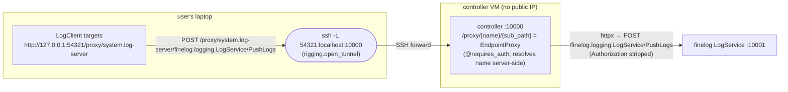
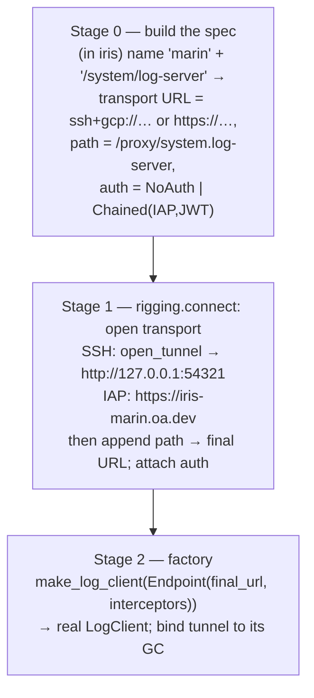

# `rigging.connect` — a composable connection & auth library

> Status: **approved — implementing** (weaver #236; see [§Decisions](#decisions-locked-on-user-review)).
> Revised after a `codex`
> critical pass (see [§Codex review](#codex-review-and-how-the-design-changed))
> and a round of user review. Two headline corrections from that review:
> **(1) rigging knows nothing about iris** — it consumes generic transport URLs;
> the cluster-name → spec expansion lives in iris. **(2) The "extra hop" to a
> service behind the controller is just the opaque URL path
> `/proxy/<endpoint-name>`**, resolved server-side — no client-side
> `ListEndpoints`, no resolver, no routing modes. The result is a tiny
> transport+auth library, not a proxy and not a hop algebra.

## Problem

Reaching a Marin backend service from a client (laptop CLI, notebook, ops
script) is ad-hoc and per-service. Each service re-invents the same three moving
parts — *transport* (how bytes reach the box), *auth* (how the request proves
who it is), and *routing* (straight there, or through a proxy) — and bakes them
into a bespoke client constructor.

Concretely, today:

- **Iris** has its *own* tunnel implementations: `_gcp_tunnel` (gcloud SSH `-L`)
  in `backends/gcp/controller.py`, `kubectl.port_forward` in
  `backends/k8s/controller.py`, and `nullcontext` for manual/local — exposed
  through `ControllerProvider.tunnel(address) -> AbstractContextManager[str]`.
  The CLI enters that context lazily in `require_controller_url`
  (`cli/connect.py`) and threads a `TokenProvider` into `client_interceptors`
  to attach the JWT.
- **finelog**'s CLI has a *different* path: it builds a `rigging.tunnel`
  `TunnelTarget` from its own config (`deploy/cli.py:_tunnel_target`), calls
  `open_tunnel`, and points `LogClient.connect(url)` at the local port.
- **rigging** already owns `open_tunnel` (`GcpSshForwardTarget` /
  `K8sPortForwardTarget` → `http://127.0.0.1:<port>`), the `connect-python`
  interceptor utilities (`rpc.py`), and name→config resolution
  (`config_discovery.resolve_cluster_config`). Its own docstring already says
  *"iris's k8s port-forward should migrate here too."*

So there are **three parallel tunnel implementations** and **two unrelated ways
to attach auth**, and neither composes. The sharpest symptom the user named:

> To set the status text for a job we call `report_task_status_text` from the
> **Iris** client, even though that data only goes to the **finelog** log
> server.

That indirection exists because a user client has **no first-class way to obtain
an authenticated connection to a service behind a cluster** without spinning up
the whole `IrisClient`. `RemoteClusterClient` builds its `LogClient` with
`use_controller_proxy=True`, so log writes ride `client → SSH tunnel → Iris
controller → LogServiceProxy → finelog`. The hops are real and correct — but
they are welded inside `RemoteClusterClient`. You cannot write a 20-line `marin
status` CLI that just opens a finelog connection and writes a row.

PR #6466 (open) adds a *fourth* transport — a public controller behind Google
IAP — with its own client credential plumbing (`IapUserIdTokenProvider`,
`ProxyAuthTokenInjector`, `ClientCredentials` threaded through
`IrisClient.remote`/`rpc_client`/`call_rpc`). The bug that PR itself calls out
(*"`cluster vm status` rejected by IAP because a call site attached the JWT and
forgot the IAP token"*) is exactly the failure mode of threading credentials by
hand.

### What is *already solved* (and therefore not this design's job)

A first draft of this doc proposed adding a generic controller reverse proxy.
**That already exists.** The controller has:

- `EndpointProxy` (`controller/endpoint_proxy.py`) — a generic HTTP reverse
  proxy mounted at `/proxy/{endpoint_name}/{sub_path}` (and a subdomain variant),
  resolving the name (with `.`→`/` substitution) via a `resolve: (name) ->
  address | None` callable that consults both the SQL endpoint store and the
  in-memory `system_endpoints` map — i.e. it mirrors `ListEndpoints`. It streams
  bodies both ways, rewrites `Location`, and **strips `Authorization` and
  `Cookie` on the client→upstream hop** as a deliberate credential-leak guard.
- A typed mount of finelog's `LogService`/`StatsService` at their canonical RPC
  paths (`controller/dashboard.py`), backed by `LogServiceProxy`, behind the
  controller's own `auth_interceptor`.

So "the extra hop to finelog" is a controller capability that exists today. What
does **not** exist is a clean *client-side* way to say *"give me an
authenticated connection to `<service>` behind cluster `<name>`, and hand it to
my client factory"* — independent of `IrisClient`. That gap is this design.

## Goal

A small library in **`lib/rigging`** that makes a connection a **value you can
name, pass around, and resolve once** — and that **knows nothing about iris**:

1. Express a connection as a **fully written-out, generic spec**: a transport
   (how to get a base HTTP URL — direct, or open an SSH/k8s tunnel), an optional
   URL path, and auth. No cluster names, no config files, no service registry
   live inside rigging.
2. Resolve that spec to an **`Endpoint`** (base URL + auth interceptors),
   establish the transport once, and hand the caller's own
   `factory(endpoint) -> client` the resolved endpoint. The user owns what a
   "client" is (a Connect/RPC client, almost always).
3. Return the **real client** and bind the tunnel's lifetime to *that client's*
   GC (the original brief's "kept alive via the GC"), with `disconnect(client)`
   for deterministic teardown — no mandatory context manager, no wrapper object
   (see [§Lifetime](#lifetime--anchor-on-the-client-not-a-wrapper)).
4. Treat the controller's `/proxy/<endpoint-name>` route as an **opaque URL
   path**: `https://host/proxy/system.log-server` is just a URL the client
   targets, and the controller resolves the name to a backing address
   *server-side*. rigging needs **no `ListEndpoints`, no resolver, no
   proxy-specific logic** — verified: the connectrpc client builds each request
   as `f"{address}/{service}/{method}"` (`_client_sync.py:282`), so a base URL
   with a `/proxy/<name>` path prefix is preserved by plain concatenation.
5. Live at the **bottom of the dependency graph** (`rigging` is a leaf), so
   `iris`, `finelog`, `zephyr`, and `marin` can all adopt it without cycles.

### Layering — who knows what (the boundary the design turns on)

- **rigging** knows only generic primitives: URL-scheme → transport, generic
  auth injectors, and that a URL path is opaque. It never imports iris, never
  reads a config file, never makes a cluster RPC.
- **iris** knows clusters. It owns the convenience that turns a short cluster
  name into a *written-out generic rigging spec* — reading its config proto for
  the controller's transport (SSH VM vs IAP host) and its token store for
  credentials — then calls `rigging.connect`. The `iris://<cluster>` shorthand,
  if kept, is parsed **here**; rigging never sees it.
- **finelog / any caller** either writes a generic spec directly (a standalone
  VM) or asks iris for one (a service behind a cluster).

### Non-goals

- Not a service mesh, pooling, or load balancing. One client, one journey, torn
  down when done.
- Not a new auth *model*. The JWT/role/IAP design in
  `20260312_iris_auth_design.md` and PR #6466 is unchanged on the **server**.
  This library owns only the **client** side: acquiring tokens and attaching
  them as the transport requires.
- Not a new controller proxy, and not a re-litigation of the existing proxy's
  authorization model (that is separate controller security work — see
  [§Security](#security--the-proxy-is-a-boundary-already)).
- Not a client-side endpoint resolver. Proxy name→address resolution happens
  **server-side** in the controller's `EndpointProxy`. The separate in-cluster
  optimization (resolve a service's pod/VM IP and skip the proxy hop entirely) is
  *iris's* concern and simply produces a plain `http://ip:port` spec for rigging.
  rigging never calls `ListEndpoints`. (This retires the first draft's
  `EndpointResolver`/`Routing`/PROXY-vs-DIRECT machinery — codex CRITICAL-1
  dissolves because there is no client-side resolution.)

## The model

Two composable primitives — **transport** and **auth** — and one rule: **the URL
path is opaque to rigging.** That's the whole library.

### `Endpoint` — what transport+auth produce

```python
@dataclass(frozen=True)
class Endpoint:
    """A reachable URL plus the auth a caller must attach to use it."""
    url: str                                   # "http://127.0.0.1:54321" | "https://iris-marin.oa.dev"
    interceptors: tuple[Interceptor, ...] = () # connect-python client interceptors (auth headers, etc.)

    def socket_address(self) -> tuple[str, int]:
        """(host, port) for socket-level callers. Valid only for a bare
        origin URL (no path); raises otherwise so a proxy-prefixed URL is
        never silently truncated to host:port."""
        parts = urlsplit(self.url)
        if parts.path not in ("", "/") or parts.hostname is None:
            raise ValueError(f"endpoint {self.url!r} is not a bare host:port")
        return parts.hostname, parts.port or (443 if parts.scheme == "https" else 80)
```

`url` is the canonical address — it carries scheme, host, port, and any proxy
path prefix. `socket_address()` is a guarded convenience for the user's stated
`(ip, port) -> client` factory shape, but most Connect clients want the URL +
interceptors (codex MINOR-10).

> **Reconciling with "a function that takes IP:port".** The user asked for a
> factory `(ip, port) -> client`. Connect attaches interceptors at construction,
> so auth must reach the client; the factory therefore takes the richer
> `Endpoint`, which exposes `.url`, `.interceptors`, and `.socket_address()`.
> The two real adapters are one line each:
> `lambda e: LogClient.connect(e.url, interceptors=e.interceptors)` and
> `lambda e: ControllerServiceClientSync(e.url, interceptors=e.interceptors, ...)`.

### `Transport` — establishes the byte path

```python
class Transport(Protocol):
    """Establishes the network path to a service and yields its base Endpoint.

    `open` registers any background resource (a tunnel subprocess) on `stack`,
    so the connection's lifetime owns it, and returns the base Endpoint the
    client should target.
    """
    def open(self, stack: ExitStack) -> Endpoint: ...
```

| Transport | `open` does |
|-----------|-------------|
| `DirectTransport(url)` | returns `Endpoint(url)` — no tunnel (public HTTPS, loopback, in-cluster DNS). |
| `SshTunnel(GcpSshForwardTarget)` | `stack.enter_context(open_tunnel(target))` → `Endpoint("http://127.0.0.1:<port>")`. Wraps the **existing** `rigging.tunnel`. |
| `K8sPortForward(K8sPortForwardTarget)` | same, via `kubectl port-forward`. |

This is the user's "SSH is a tunnel that returns a new localhost connection",
unchanged — it just *is* `rigging.tunnel` with an `Endpoint` wrapper.

### `Auth` — contributes interceptors

```python
class Auth(Protocol):
    """Returns the client interceptors needed to authenticate to a target."""
    def interceptors(self) -> tuple[Interceptor, ...]: ...
```

| Auth | interceptors |
|------|--------------|
| `NoAuth()` | `()` (loopback/SSH-tunnel-trust clusters) |
| `JwtAuth(token_provider)` | `(AuthTokenInjector(token_provider),)` — Iris JWT in `Authorization` |
| `IapAuth(id_token_provider)` | `(ProxyAuthTokenInjector(id_token_provider),)` — IAP OIDC token in `Proxy-Authorization` (lands with PR #6466) |
| `ChainedAuth(*auths)` | concatenation — IAP + JWT together, attached **as a unit** so a call site can't attach one and forget the other (the PR #6466 bug, fixed structurally) |

**Edge auth vs app auth.** IAP is *edge* auth — you cannot reach the GCLB at all
without the OIDC token — so it is tied to the transport and is selected by the
**scheme** (`iap+https`, below). The Iris **JWT** is *app* auth (the controller
verifies it), so it rides the `auth=` argument because its value is a secret. The
two compose: a scheme that implies `IapAuth` plus an `auth=JwtAuth(...)` argument
yields `ChainedAuth(IapAuth, JwtAuth)`, attached **as a unit** so a call site
can't attach one and forget the other (the PR #6466 bug, fixed structurally).

### The "extra hop" is just a URL path — no resolver, no `ListEndpoints`

The controller's `EndpointProxy` is a plain HTTP reverse proxy at
`/proxy/<endpoint-name>/<sub_path>`: hit it and the controller resolves the name
(`.`→`/`, consulting its endpoint store / `system_endpoints` map) and forwards
**server-side**. So reaching finelog through cluster `marin` is just the URL
`https://iris-marin.oa.dev/proxy/system.log-server` — point a `LogClient` at it
and the connectrpc client appends `/finelog.logging.LogService/PushLogs`
(`_client_sync.py:282` builds `f"{address}/{service}/{method}"`), which the
`/proxy/{name}/{sub_path:path}` route matches with
`sub_path = finelog.logging.LogService/PushLogs`.

Consequences for rigging:

- **No client-side resolver, no `Routing` enum, no `ListEndpoints`.** The path is
  opaque; rigging just concatenates it onto the base URL. (rigging may offer a
  one-line helper `proxy_path(name) -> "/proxy/" + name.strip("/").replace("/", ".")`,
  but it's a string utility, not a concept.)
- **Auth is the controller's gate, finelog's is the controller's job.** The
  `/proxy/...` route is `@requires_auth`, so the user's IAP/JWT authorize them
  *at the controller*; the proxy then **strips `Authorization` upstream** and
  forwards to finelog on the controller's behalf. finelog never sees (or needs)
  the user's JWT. So the auth a caller attaches is purely "how do I authenticate
  to this controller" — identical whether the target is the controller itself or
  a service behind it.
- **The in-cluster direct-connect optimization is iris's, not rigging's.** If a
  worker wants to skip the proxy hop and talk to finelog's pod IP directly, iris
  resolves that IP (its `ListEndpoints`, its concern) and hands rigging a plain
  `http://10.x.x.x:port` spec. rigging stays oblivious.

### `connect` inputs — a generic spec, optionally a string

```python
def connect(transport: Transport | str, factory: ClientFactory[ClientT], *,
            path: str = "", auth: Auth = NoAuth(),
            options: ConnectionOptions = ConnectionOptions()) -> ClientT: ...
```

`transport` may be a `Transport` object or a transport URL string that rigging
parses (table below). `path` (e.g. `/proxy/system.log-server`) is appended to the
established base URL. `auth` supplies interceptors. `ConnectionOptions` carries
the connect/tunnel timeout and per-RPC deadline; **retry/re-resolution stay
inside the client** and **transport respawn stays inside `open_tunnel`'s
watchdog** — no cross-hop retry layer (codex MAJOR-9). `explain(transport, auth)`
prints the resolved transport, auth providers by name (never token values), and
the final URL, so *"why SSH / why IAP / why no JWT?"* is answerable (codex
MAJOR-7).

#### rigging's string grammar — generic transport URLs only

rigging understands transport-scheme URLs and nothing cluster-specific (there is
**no `iris://`** scheme — cluster names are not rigging's concern). The grammar is
uniform: **scheme** = how to reach + edge-auth; **`host:port`** = what to connect
to; **path** = appended after the transport resolves; **query** = transport
parameters. No chaining (codex MAJOR-8) — the path rides on the URL.

| Scheme | Transport + edge auth | Example |
|--------|-----------------------|---------|
| `http` / `https` | `DirectTransport`, no edge auth | `https://finelog-1.example:7000` |
| `iap+https` | `DirectTransport(https://…)` **+ `IapAuth`** (OIDC token via ambient google-auth in `Proxy-Authorization`; `?audience=` for the OAuth client id) | `iap+https://iris-dev.oa.dev/proxy/system.log-server` |
| `ssh+gcp` | `SshTunnel(GcpSshForwardTarget)`; `?project=&zone=` required, `?sa=` → impersonation, `?iap=true` → `--tunnel-through-iap` | `ssh+gcp://iris-controller:10000/proxy/system.log-server?project=marin&zone=us-central1-a` |
| `k8s` | `K8sPortForward`; `?namespace=` required, `?context=` optional | `k8s://iris-controller:10000/proxy/system.log-server?namespace=iris` |

Parsing is plain `urlsplit`: for `ssh+gcp://iris-controller:10000/proxy/system.log-server?project=marin&zone=us-central1-a`,
`hostname=iris-controller`, `port=10000` (the SSH-forward target), `path=/proxy/system.log-server`
(appended to the forwarded `http://127.0.0.1:<p>` base), `query` carries
project/zone. So **`iap+https` vs `https` is the entire IAP-vs-plain distinction**,
one token in the scheme; the app-level JWT, if any, is the separate `auth=` arg.

#### iris builds these URLs — as a function, not a string scheme

The cluster-name convenience lives in **iris** (where config + token store are)
and is a plain function that *emits one of the generic URLs above* and the
matching `auth=` — it does **not** introduce an `iris://` string into rigging:

```python
# in lib/iris — NOT in rigging
def iris_connect(cluster: str, factory, *, endpoint: str | None = None):
    cfg  = load_cluster_config(cluster)                  # reads iris config proto
    base = cfg.transport_url()                           # "iap+https://…" | "ssh+gcp://…?project=&zone="
    path = rigging.proxy_path(endpoint) if endpoint else ""   # "/proxy/system.log-server"
    auth = build_app_auth(cfg, token_store_lookup(cluster))   # NoAuth | JwtAuth (edge IAP is in the scheme)
    return rigging.connect(base, factory, path=path, auth=auth)
```

`iris_connect("marin", make_log_client, endpoint="/system/log-server")` thus
resolves — in iris — to
`connect("iap+https://iris-dev.oa.dev/proxy/system.log-server", make_log_client)`
for an IAP cluster, or the `ssh+gcp://…` form for an SSH cluster. The function
signature is stable across the SSH→IAP migration because iris picks the scheme
from config; rigging only ever sees a fully written-out generic URL.

### `connect()` — returns the real client; the client is the lifetime anchor

`connect()` returns **the client the factory built** — not a wrapper. An RPC
client is a value you construct once and pass around (store on `self`, return
from a factory, hand to other functions); a mandatory `with` block fights that.
So the tunnel's lifetime is bound to **the client's GC lifetime**, exactly as the
original brief asked ("kept alive via the GC and/or context managers").

```python
ClientFactory = Callable[[Endpoint], ClientT]

def connect(transport: Transport | str, factory: ClientFactory[ClientT], *,
            path: str = "", auth: Auth = NoAuth(),
            options: ConnectionOptions = ConnectionOptions()) -> ClientT:
    """Open `transport`, build Endpoint(base_url + path, auth.interceptors()),
    and return `factory(endpoint)`. The transport (e.g. an SSH tunnel
    subprocess) is torn down when the returned client is garbage-collected, via
    `disconnect`, or at interpreter exit — whichever comes first."""
    ...

def disconnect(client) -> None:
    """Tear down `client`'s transport now (idempotent; no-op if already gone)."""
    ...
```

```python
# The supported shape — a free-floating client you can pass around.
# (Via the iris-side helper; the bare rigging call is the commented line below.)
log = iris_connect("marin", make_log_client, endpoint="/system/log-server")
# == connect("iap+https://iris-marin.oa.dev/proxy/system.log-server?audience=<client-id>",
#            make_log_client)   # iap+https scheme attaches the IAP token
self.log = log                       # store it, return it, share it — no `with` scope
log.get_table(...).write([row])
# tunnel dies when `log` becomes unreachable (GC), or:
disconnect(log)                      # optional, deterministic
```

#### Lifetime — anchor on the client, not a wrapper

The first draft made a `Connection` wrapper that `__getattr__`-proxied the client
and held a finalizer. Codex killed it (MAJOR-4/5): `__getattr__` doesn't forward
dunders, and — worse — `LogClient.get_table()` returns `Table`s whose background
flush threads call back into the client, so dropping the *wrapper* while holding
a *Table* would kill the tunnel mid-write.

The fix is to **key teardown on the client itself**, via
`weakref.finalize(client, stack.close)` stored in a module-level
`WeakKeyDictionary[client → finalize]`:

- A `Table` strong-references its `LogClient` (it must, to flush into it), so as
  long as any derived object is alive the **client** is reachable, so the
  **tunnel** is alive. The client outlives everything derived from it — the exact
  invariant the Table-flush hazard needs. The codex bug only existed because
  teardown was keyed on a *droppable wrapper*; keyed on the client, it cannot
  fire early.
- No wrapper, no `__getattr__`, no dunder-forwarding lie — `connect()` returns
  the genuine client, so `isinstance`, context-manager use, and everything else
  behave normally.
- `disconnect(client)` looks the client up in the `WeakKeyDictionary` and runs
  its finalizer for deterministic teardown; the dict holds only weak refs, so it
  never keeps a client (or its tunnel) alive by itself.
- GC/atexit is the backstop for orphaned `ssh`/`kubectl` subprocesses. Leaky for
  a client that's never collected and never `disconnect`ed — accepted, as the
  brief states.

A scoped helper is available for callers who *do* want a `with` block (tests,
short-lived scripts), built on the same primitive:

```python
with closing_connection("ssh+gcp://logging@proj/us-central1-a/finelog-1:7000",
                        make_log_client) as log:
    print(log.query('select * from "iris.task_status" limit 10'))
```

### Worked example — finelog behind a controller (the hard case)

A laptop client writing a finelog row, where finelog sits behind cluster
`marin`'s controller, reached by SSH tunnel *or* IAP. Two facts make this simple:
**(a)** the finelog endpoint is just the proxy URL
`<controller>/proxy/system.log-server` — no client-side resolution; and **(b)**
the user authenticates to the *controller*, never to finelog — the `@requires_auth`
proxy route verifies the user's identity at the controller, then forwards to
finelog with `Authorization` stripped, on the controller's own behalf.

```python
log = iris_connect("marin", make_log_client, endpoint="/system/log-server")
# resolves (in iris) to one of:
#   connect("iap+https://iris-marin.oa.dev/proxy/system.log-server?audience=<id>",
#           make_log_client)                                         # IAP cluster
#   connect("ssh+gcp://iris-controller:10000/proxy/system.log-server?project=marin&zone=us-central1-a",
#           make_log_client)                                         # SSH cluster
log.get_table(TASK_STATUS_NAMESPACE, TaskStatusRow,
              storage_policy=TASK_STATUS_STORAGE_POLICY).write([TaskStatusRow(...)])
```

The cluster name + endpoint stay constant; only iris's expansion differs by
config, so this survives the SSH→IAP cutover untouched.

#### Physical topology — one client-side hop; the proxy forwards server-side



The IAP variant replaces the tunnel with the GCLB+IAP edge; the client targets
`https://iris-marin.oa.dev/proxy/system.log-server` and everything else is
identical. Still one client-side connection; the proxy does the forwarding.

#### The pipeline — three stages, no routing stage, no RPC



There is no "routing" stage. The "extra hop" is encoded entirely in the URL path
`/proxy/system.log-server`; the controller resolves the name → finelog address
**server-side** when the first request arrives. rigging never inspects the path,
never calls `ListEndpoints`, never makes a pre-flight RPC. (The in-cluster
direct-connect optimization, if used, is handled *in iris* at Stage 0 by emitting
a plain `http://10.x.x.x:port` transport URL with empty `path`.)

#### Auth pattern — authenticate to the controller; finelog is the controller's job

The user's auth pattern for finelog **is** the cluster's auth pattern, because
the request is addressed to the controller. The user's JWT is verified at the
controller's `@requires_auth` proxy route and then **stripped** before the
forward — finelog never sees it and doesn't need it.

```mermaid
sequenceDiagram
    participant U as LogClient (laptop)
    participant LB as GCLB + IAP
    participant K as controller (/proxy, @requires_auth)
    participant F as finelog
    Note over U: one-time: iris login --cluster=marin<br/>caches IAP refresh token + Iris JWT
    U->>U: ChainedAuth attaches BOTH headers per request
    U->>LB: POST /proxy/system.log-server/…/PushLogs<br/>Proxy-Authorization: Bearer <IAP id_token><br/>Authorization: Bearer <Iris JWT>
    LB->>LB: verify IAP token + IAM; STRIP Proxy-Authorization;<br/>inject signed X-Goog-IAP-JWT-Assertion
    LB->>K: forward (Authorization JWT survives)
    K->>K: @requires_auth verifies Iris JWT → role; resolves<br/>system.log-server → finelog address
    K->>F: httpx POST /finelog.logging.LogService/PushLogs<br/>(Authorization & Cookie STRIPPED upstream)
    F-->>U: PushLogsResponse (streamed back)
```

The `Auth` iris builds from cluster config, per mode:

| Cluster config | Transport URL (iris emits) | `Auth` | Headers on the wire |
|----------------|----------------------------|--------|---------------------|
| SSH tunnel, null-auth (today) | `ssh+gcp://…/proxy/system.log-server` | `NoAuth()` | none — loopback peer ⇒ admin |
| SSH/manual, auth enabled | `ssh+gcp://…` / `http://…` | `JwtAuth(StaticTokenProvider(jwt))` | `Authorization` only |
| Public, behind IAP (#6466) | `iap+https://host/proxy/system.log-server?audience=<id>` | `IapAuth` (in scheme) + optional `JwtAuth` (`auth=`) | `Proxy-Authorization` (+ `Authorization` if a JWT) |
| In-cluster direct (iris-resolved) | `http://10.x.x.x:port` (no proxy path) | worker token / `NoAuth` | reached directly; never hits the IAP edge |

`ChainedAuth` attaches the IAP token and the JWT **as a unit**, so a call site
cannot attach one and forget the other — PR #6466's `cluster vm status` bug
fixed structurally. The IAP token's audience is the backend-service resource, the
same for controller RPCs and proxied RPCs, so one token covers both. The user
writes **no** auth code: `iris login` once, then `iris_connect(...)`. All of this
auth assembly is in **iris**; rigging only attaches the interceptors it's handed.

## Security — the proxy is a boundary, already

The existing `EndpointProxy` is an internal-network pivot surface: it forwards
arbitrary methods (minus CONNECT/TRACE), streams unbounded bodies, and can reach
any registry-resolved address. Today it is gated by `@requires_auth` and strips
`Authorization`/`Cookie` upstream. This design **does not widen** that surface —
it only *consumes* the proxy from the client side. Tightening proxy
authorization (per-endpoint allowlists for `/system/*`, owner checks for
task-registered endpoints, request/response size caps, audit logging) is real
and worth doing, but it is **controller security work, tracked separately**, not
part of this client library (codex CRITICAL-3). This doc flags it so it isn't
lost.

## Re-architecture

### `lib/rigging` — new `rigging/connect.py` + a conservative `rigging/auth.py`

- `rigging/connect.py`: `Endpoint`, `Transport` (+ `DirectTransport`,
  `SshTunnel`, `K8sPortForward` wrapping `rigging.tunnel`), the transport-URL
  parser, `Auth`, `connect` / `disconnect` / `closing_connection`, the
  client→finalizer `WeakKeyDictionary`, and the `proxy_path(name)` string helper.
  **No cluster, registry, or endpoint-resolution concepts** — rigging stays iris-
  agnostic.
- `rigging/auth.py`: **only transport-generic client pieces** — the
  `TokenProvider` protocol, `AuthTokenInjector`, `GcpAccessTokenProvider`, and
  (post-#6466) `IapUserIdTokenProvider` / `ProxyAuthTokenInjector`. These depend
  only on `google-auth` + `connect-python`. **Staying in `iris`:** JWT minting
  and verification, role semantics, loopback trust, the SQLite token-store
  schema, and the desktop-OAuth login UX — none are service-neutral (codex
  MAJOR-6).

### `lib/iris`

- A new `iris_connect(cluster, factory, *, endpoint=None)` helper (and the
  `iris://` CLI shorthand) lives **here**: it reads the iris config proto +
  token store and expands a cluster name into a generic
  `rigging.connect(transport_url, factory, path=…, auth=…)` call. This is the
  *only* place that knows iris config shapes; rigging stays a clean leaf
  (resolves the first draft's open question Q2 — the registry is iris-side, full
  stop, not a rigging protocol).
- `cli/connect.py::require_controller_url` → `iris_connect(cluster,
  rpc_client_factory)` and register `disconnect(client)` via `ctx.call_on_close`
  (replaces the manual `tunnel_cm.__enter__()` dance; the click context scopes
  the client to the command).
- `ControllerProvider.tunnel()` and the three `_gcp_tunnel` /
  `kubectl.port_forward` / `nullcontext` impls **collapse** into rigging
  transports: GCP → `SshTunnel`, k8s → `K8sPortForward`, manual/local →
  `DirectTransport`. Kills two of the three duplicate tunnels.
- `RemoteClusterClient`'s `use_controller_proxy` flag + `resolve_endpoint`
  disappear: external callers get a `/proxy/system.log-server` URL; in-cluster
  callers get a direct `http://ip:port` URL (iris resolves the IP). Both are just
  arguments to `rigging.connect`; the proxy-vs-direct choice is iris computing a
  URL, not a rigging mode.

### `lib/finelog`

- `deploy/cli.py`: replace `_tunnel_target` + `open_tunnel` + `LogClient.connect`
  with `rigging.connect(transport_url, lambda e: LogClient.connect(e.url, interceptors=e.interceptors))`.
  A standalone deployment maps its config to a `ssh+gcp://…`/`k8s://…` transport
  URL (the data `_tunnel_target` reads today); finelog-behind-a-cluster calls
  `iris_connect(...)`. finelog gains **no** dependency on iris internals — it
  either writes a generic URL or calls the iris helper.
- **The payoff — a direct status-text path.** A standalone writer becomes:

  ```python
  log = iris_connect("marin", make_log_client, endpoint="/system/log-server")
  log.get_table(TASK_STATUS_NAMESPACE, TaskStatusRow,
                storage_policy=TASK_STATUS_STORAGE_POLICY).write([TaskStatusRow(...)])
  ```

  No `IrisClient`. `report_task_status_text` becomes a thin finelog write over a
  `rigging` connection; the Iris client keeps a convenience wrapper delegating to
  the same path.

## Migration plan (validate the hard path first)

Reordered per codex MINOR-11 — prove the controller-auth + proxy-URL path before
extracting the abstraction, since standalone-finelog is already handled by
`open_tunnel`:

1. **Spike the concrete win, concretely.** Build the direct status-text path as
   a thin iris-side helper: read `marin`'s config → emit
   `https://…/proxy/system.log-server` (or the SSH transport URL) + the right
   `Auth`, point `LogClient` at it. This exercises the *hard* parts — config
   resolution, transport choice, auth attach, the proxy URL — against a live
   cluster, before any abstraction is frozen.
2. **Extract `rigging/connect.py`** from the spike: `Transport`, the transport-URL
   parser, `Auth`, `Endpoint`, `connect`/`disconnect` — only the seams the spike
   proved necessary. Unit-test with a fake `spawn` (the pattern `tunnel.py` uses)
   and a fake factory.
3. **Relocate transport-generic auth** (`AuthTokenInjector`, `TokenProvider`,
   `GcpAccessTokenProvider`) into `rigging/auth.py`; iris imports from there. Pure
   move + import rewrite, no compat shims (repo policy). Sequence **after**
   PR #6466 merges so `IapAuth`/`IapUserIdTokenProvider` land on top.
4. **Adopt in iris** (`require_controller_url`, the `tunnel()` collapse, dropping
   `use_controller_proxy`) and **finelog CLI**.
5. **Ship the direct status-text CLI** as the first capability the library
   unlocks for users.

Steps 1 + 5 deliver the user's concrete need even if the abstraction (2–4)
slips; that ordering is itself the hedge codex asked for.

## Testing

Follows `lib/rigging`'s conventions (`test_rpc.py`, `test_tunnel`) and root
`TESTING.md` (behavior-focused, injectable seams, no slop):

- `connect` with a fake `spawn` + fake factory: assert transport opens, auth
  interceptors accumulate (and `ChainedAuth` attaches IAP+JWT together), and the
  factory receives the final localhost `Endpoint`.
- Lifetime: `connect` returns the bare factory client; `disconnect(client)`
  terminates a fake tunnel subprocess and is idempotent; dropping the client and
  running `gc.collect()` reaps the subprocess via the finalizer; a fake "Table"
  holding the client keeps the tunnel alive until *both* are dropped (the
  Table-flush invariant codex flagged).
- Transport-URL parsing: each scheme (`https`, `ssh+gcp`, `k8s`) maps to the
  right `Transport`, and a `/path` suffix is preserved onto the established base
  URL (table-driven); `proxy_path("/system/log-server") == "/proxy/system.log-server"`.
- The iris-side `iris_connect` expansion (tested in `lib/iris`): a fake config
  for an IAP cluster yields `https://…/proxy/system.log-server` +
  `ChainedAuth`; an SSH cluster yields the `ssh+gcp://…` transport URL.

## Codex review and how the design changed

Full `codex` pass on the first draft; verdict *"revise, bordering on rethink —
the concrete need fits a much smaller design."* Findings and responses:

| # | Sev | Finding | Response |
|---|-----|---------|----------|
| 1 | CRIT | `ControllerProxyHop` can't be a pure hop — in-cluster resolution needs a `ListEndpoints` RPC (I/O + policy). | **Accepted, then fully dissolved on user review.** There is *no* client-side resolution at all: the "extra hop" is the opaque URL path `/proxy/system.log-server`, resolved **server-side** by the controller. The first draft's `EndpointResolver`/`Routing` was deleted. |
| 2 | CRIT | A generic proxy already exists (`/proxy/<dot-name>`); don't invent `/system/proxy`; typed mounts ≠ generic proxy. | **Accepted.** The design connects via the existing generic `/proxy/<dot-name>` route as a plain URL (verified the connectrpc client preserves the base path prefix); no new route, and the typed mount is no longer special-cased. |
| 3 | CRIT | The generic proxy is a security boundary (network pivot, no size caps); needs an authz policy. | **Accepted, scoped out.** Documented as separate controller security work ([§Security](#security-the-proxy-is-a-boundary-already)); this client library doesn't widen it. |
| 4 | MAJ | Transparent-proxy `Connection` + GC finalizer is unsafe — `LogClient` `Table`s have daemon flush threads that outlive a dropped wrapper. | **Accepted, then revised again on user review.** No wrapper at all: `connect()` returns the real client and the finalizer is keyed on *the client*, which every derived `Table` strong-references — so the tunnel cannot be reaped while any `Table` is live. (Earlier "mandatory context manager" answer was dropped: an RPC client must be passable around.) |
| 5 | MAJ | `__getattr__` doesn't forward dunders, so it can't stand in for a client. | **Accepted.** No proxy object; `connect()` returns the genuine client, so `isinstance`/context-manager/everything behaves normally. |
| 6 | MAJ | Auth relocation over-reached (moving login UX, token store, roles into a leaf lib). | **Accepted.** Only transport-generic injectors/providers move to `rigging/auth.py`; minting/verification/roles/loopback-trust/token-store/login stay in iris. |
| 7 | MAJ | Compact name hides operationally critical facts (SSH vs IAP, audience, token source). | **Accepted.** Added `explain(transport, auth)`; the cluster shorthand still hides transport/auth for migration-stability, but iris resolves it from config and it's inspectable. |
| 8 | MAJ | `::` chaining is ambiguous vs existing endpoint/proxy encoding and reverses fsspec. | **Accepted.** No chaining: rigging takes a single transport URL (the proxy path rides on it); the cluster shorthand is iris-side sugar that emits that URL. |
| 9 | MAJ | Timeouts/retries aren't compositional across hops. | **Accepted.** `ConnectionOptions` for connect-timeout/deadline; retry/re-resolution stay in the client, transport respawn stays in `open_tunnel`'s watchdog. No cross-hop retry layer. |
| 10 | MIN | `Endpoint.address` snippet drops scheme/path and mishandles `None`. | **Accepted.** `url` is canonical; `socket_address()` is guarded and raises on path-prefixed URLs. |
| 11 | MIN | Migration starts with the algebra, not a real call site; standalone-finelog is already solved. | **Accepted.** Reordered: spike the status-text path first, extract the abstraction from what it proves. |

**Where the design deliberately keeps more than codex's minimal suggestion.**
Codex proposed *"just a `finelog_connection_from_iris_cluster(...)` helper + shared
interceptors."* The user explicitly asked for a *reusable, composable* connection
library with a compact string and a user-supplied factory, because the same
shape recurs (iris controller, finelog, future services) and the three duplicate
tunnels are real debt to consolidate. The synthesis: keep a **minimal**
composable core (`Transport` + `Auth` + `connect`), but (a) validate it through
the concrete status-text spike *first* (codex's step ordering), and (b) refuse
the parts that didn't survive scrutiny (hop-based resolution, transparent proxy,
new controller route, broad auth relocation). The result is closer to codex's
"small" than to the first draft, while still being the library the user asked
for.

## Decisions (locked on user review)

- **D1 — keep the composable library.** Build the minimal `Transport` + `Auth` +
  `connect` core now (not just a one-off helper).
- **D2 — no `iris://` in rigging.** rigging takes only generic transport URLs
  (`http`/`https`/`iap+https`/`ssh+gcp`/`k8s`). The cluster-name convenience is an
  iris-side *function* (`iris_connect`), not a URL scheme rigging parses.
- **D3 — `disconnect` via an implicit, identity-keyed finalizer.** `connect()`
  returns the bare client; teardown is a `weakref.finalize` keyed on `id(client)`
  (not a `WeakKeyDictionary` — clients may be unhashable or compare equal, either
  of which would corrupt a hash/eq-keyed map). No explicit handle.
- **D4 — proxy strips end-user identity; accepted.** Proxied services are
  authorized at the controller, not downstream. A future opt-in
  identity-forwarding header is controller work, out of scope here.
- **D5 — IAP vs plain HTTP is encoded in the scheme** (`iap+https` vs `https`);
  edge auth (IAP) is scheme-implied, app auth (JWT) is the `auth=` argument.

## Implementation notes — what actually shipped

This section is authoritative where it differs from the proposal prose above;
the changes came out of the implementation-stage codex review and a slop pass on
the diff. The shipped surface is deliberately smaller than the proposal.

**Names that differ from the proposal:**

- **One `TunnelTransport` instead of `SshTunnel` + `K8sPortForward`.** The tunnel
  kind already follows from the target type `open_tunnel` dispatches on
  (`GcpSshForwardTarget` vs `K8sPortForwardTarget`), so a single transport covers
  both — no value in two near-identical classes or a private base.
- **One `BearerTokenInjector(provider, header)` instead of `AuthTokenInjector` +
  `ProxyAuthTokenInjector`.** They differed only by header name; the app-vs-edge
  intent lives in `JwtAuth` (`authorization`) and `IapAuth`
  (`proxy-authorization`), which is where it belongs.

**Behavior that changed to fix real bugs:**

- **Auth injectors are Connect *metadata* interceptors, not unary interceptors.**
  `BearerTokenInjector` implements `on_start` / `on_start_sync` (the
  `MetadataInterceptor` protocol), so `connectrpc` applies it to every RPC shape
  — unary and all three streaming shapes — and a streaming call can't silently go
  out unauthenticated.
- **`connect` validates the appended path and the client.** The effective path
  must be empty or a single-rooted `/…` segment (rejecting `proxy/a` and
  `//proxy`), `parse_transport` rejects hostless URLs, and a client that can't be
  weak-referenced raises rather than leaking its transport. Re-registering the
  same live client object closes the prior transport instead of orphaning it.
- **Lifetime is an `id(client)`-keyed `weakref.finalize`** (see D3), not a
  `WeakKeyDictionary`.

**Speculative surface cut from the proposal (re-add when a caller needs it):**
`explain()`, `Endpoint.socket_address()`, the `closing_connection()` context
manager, and the `ConnectionOptions` object (now a plain `connect_timeout`
keyword argument). `proxy_path()` stays — it is the one piece iris adoption must
call.
