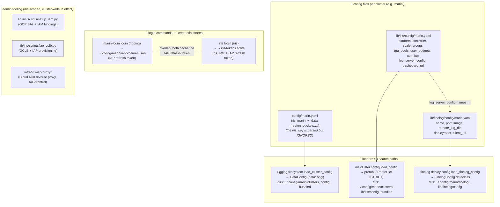
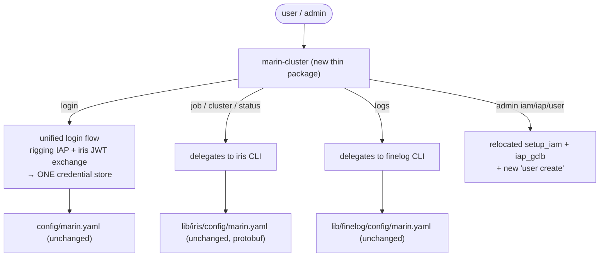
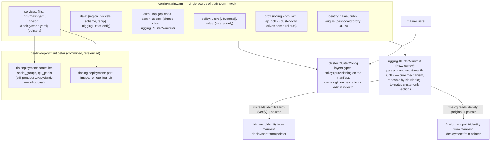
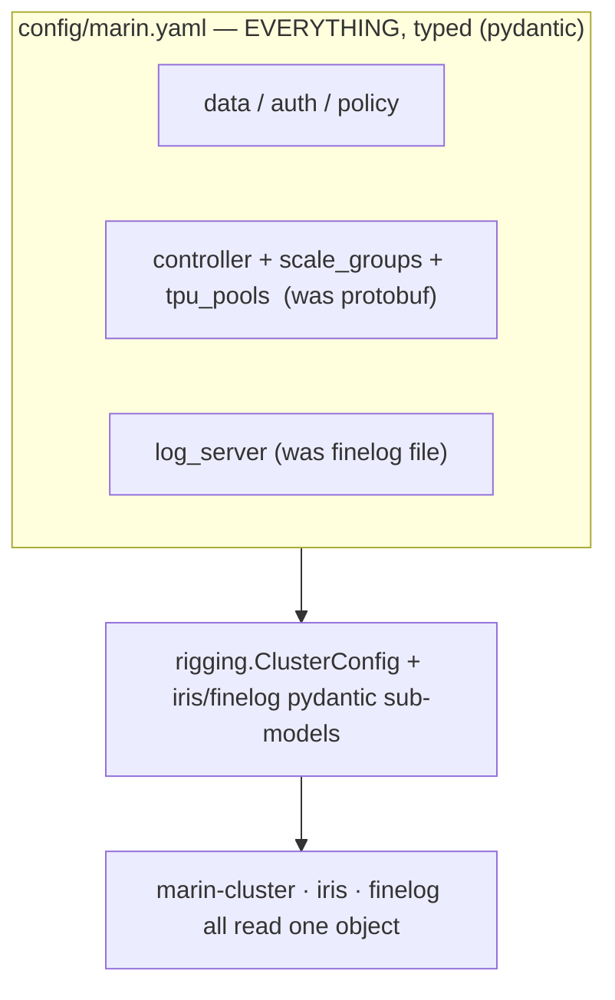
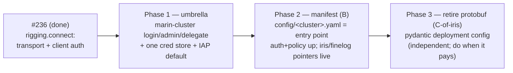

# Unifying cluster config, login & admin into `marin-cluster`

> Status: **proposal — approved for A+B, rev 2** (weaver #270). Builds directly on
> the just-landed `rigging.connect` work ([`2026-06-20_rigging_connection_auth.md`](2026-06-20_rigging_connection_auth.md),
> weaver #236), which already put transport + client-auth primitives in rigging
> as a leaf. This doc is the *next layer up*: one config source of truth, one
> login, one admin tool.

> **rev 2 — incorporates a codex re-review and the maintainer's sharpened
> layering** ("rigging = pure-mechanism leaf that only *describes* how to auth;
> `cluster` imports everything and owns cluster creation, global config, and the
> one-time rollouts — driven from config, not hard-coded `iris.oa.dev` URLs").
> Three changes from rev 1, detailed in [§8](#8-codex-re-review--what-changed-rev-2):
> (1) **login orchestration + the concrete Marin credential schema move to
> `cluster`, not rigging** — rigging keeps only the primitives and a generic,
> opaque credential-store interface; (2) the manifest gains a typed
> **`provisioning:`** section so `marin-cluster admin` rollouts are config-driven;
> (3) **Phase 1 is re-sequenced** to pull that minimal `identity/auth/provisioning`
> schema forward (the rev-1 "configs untouched" Phase 1 was mis-sequenced for
> admin). Approved direction: **proceed with A then B.**

## TL;DR — the recommendation

Ship a thin **`marin-cluster`** umbrella CLI that **delegates** to the existing
libraries, and unify the three things users actually trip over — **login,
credentials, and admin** — *before* touching the heavier config internals.
Concretely, a phased path:

1. **Phase 1 (the user-visible win + config-driven admin):** new `lib/cluster`
   package with a `marin-cluster` console script. It introduces a **minimal typed
   top-level schema** (`identity` / `auth` / `provisioning`) read from
   `config/<cluster>.yaml`. `marin-cluster login` runs one flow **orchestrated in
   `cluster`** (rigging supplies the IAP/JWT primitives; iris supplies the token
   exchange) and writes **one** credential store. `marin-cluster admin {iam,iap,user}`
   relocates `setup_iam.py` / `iap_gclb.py` **and refactors them to consume the
   typed `provisioning:` spec instead of hard-coded project/zone/URL/SA values**,
   and adds `admin user create` (IAM + IAP + iris policy in one shot).
   `job`/`cluster`/`status`/`logs` delegate to iris/finelog. IAP becomes the
   default access path; the SSH tunnel demotes to an admin escape-hatch command.
2. **Phase 2 (config unification):** promote the top-level `config/<cluster>.yaml`
   to the **single entry point** (a *federated manifest*). It owns cluster
   identity + auth + policy and **points at** per-lib deployment files (which keep
   the heavy deployment detail). Wire up the `iris:`/`finelog:` keys that the
   manifest already carries but currently ignores.
3. **Phase 3 (independent, do when it pays):** retire iris's protobuf config in
   favor of pydantic/dataclasses. Decoupled from Phase 2 — the manifest does not
   require it.

The recommended **end-state config model is option B (federated manifest)**, not
the maximal "one giant typed file" (option C). It matches your stated constraint —
*"libs keep deployment details but are mostly configured from the top-level
config"* — and lets the protobuf-retirement happen on its own schedule.

---

## 1. Where we are today (the fragmentation)

One logical cluster (`marin`) is described by **three** config files, loaded by
**three** independent loaders with **three** search-path constants, and reached
by **two** login commands writing **two** credential stores.



What this costs a user:

- **"Which file do I edit?"** — cluster identity is split across all three; the
  one file that *looks* unified (`config/marin.yaml`) feeds only rigging's
  `DataConfig`; its `iris:` key is read and thrown away (`filesystem.py:178`).
- **"Which login?"** — `marin-login` gets you IAP creds; `iris login` gets you the
  app JWT. You generally need both, in order, and nothing says so.
- **"Where's the admin command?"** — onboarding a teammate means running
  `setup_iam.py` (IAM), then `iap_gclb.py grant` (IAP), then `iris user budget
  set` (app policy), each a different tool in a different place.

### What is *already* in the right place (post-#236)

rigging is already the leaf that owns the **client-side** primitives:

| Concern | Where it lives today | Verdict |
|---|---|---|
| Transport grammar (`iap+https`, `ssh+gcp`, `k8s`) | `rigging.connect.parse_transport` | ✅ keep |
| Tunnels (SSH `-L`, `kubectl port-forward`) | `rigging.tunnel.open_tunnel` | ✅ keep |
| IAP desktop OAuth login + refresh-token cache | `rigging.iap_login` + `marin-login` script | ✅ keep, **grow** |
| Token providers / injectors | `rigging.auth` (`BearerTokenInjector`, `IapServiceAccountTokenProvider`) | ✅ keep |
| Generic YAML cluster discovery | `rigging.config_discovery` | ✅ keep, **make canonical** |
| **Server-side** JWT mint/verify, roles, authz | `iris.cluster.controller.auth`, `iris.rpc.auth` | ✅ **stays in iris** (it's the controller) |
| Credential store (IAP refresh + app JWT) | `iris.cluster.token_store` (`~/.iris/tokens.sqlite`) **and** `rigging.iap_login` (`~/.config/marin/iap/*.json`) | ⚠️ **unify into one store** — generic *opaque* store interface (0600, atomic) in rigging; the **concrete Marin credential schema + login orchestration in `cluster`** (see §8) |
| Login orchestration (IAP id_token → iris JWT exchange) | `iris.cli.main` (`login`) | ⚠️ **moves up to `cluster`** — rigging stays pure mechanism |
| Cluster-name → transport URL expansion | `iris.cli.connect` | ✅ stays in iris |

The gap #270 closes is **above** rigging: a single front door, a single config
entry point, and a home for cluster-admin that isn't "an iris script."

---

## 2. Forces & constraints

- **Dependency layering is the hard constraint.** `iris → rigging` and
  `finelog → rigging`; rigging may **never** import iris. So anything that must
  call iris policy RPCs or read the iris deployment config (e.g. `admin user
  create`, `login`'s JWT exchange) **cannot** live in rigging — it lives *above*
  iris. That is why the umbrella is a **new package**, not a rigging subcommand.
- **"rigging owns JWT & IAP & login" needs a three-way split** (rev-2, post-codex).
  rigging is the **pure-mechanism leaf**: it *describes* how to auth — `run_iap_desktop_login`,
  `IapRefreshTokenProvider`, `JwtAuth`/`IapAuth`/`ChainedAuth`, and at most a
  *generic, opaque* credential-store interface (cluster/endpoint → bytes, 0600).
  The **controller (iris)** mints and verifies app JWTs (it holds the signing key
  and role model) and exposes the `Login` RPC. **`cluster` owns the orchestration**:
  it sequences "desktop IAP id_token → iris `Login` exchange → app JWT," defines
  the concrete Marin credential record, and writes the one store. The rev-1 framing
  ("rigging owns the login lifecycle; iris passes an `exchange` closure") was
  rejected as making rigging sequence a two-token app login it doesn't semantically
  own — it stays mechanism, `cluster` does the sequencing.
- **protobuf-for-config is replaceable but not free.** The config protos are used
  only for YAML parsing and internal representation — **not on the wire** (one
  exception: `vm.proto`'s `ScaleGroupStatus` embeds `ScaleGroupConfig` in a status
  response). Retiring it means rewriting ~200 `HasField`/`WhichOneof`/`CopyFrom`
  call sites, the `oneof` platform/controller dispatch, the enums, and the
  JSON-to-VM `WorkerConfig` bootstrap. Moderate, self-contained, and **independent
  of the manifest** — so it gets its own phase.
- **SSH→IAP is a policy change, not just code.** IAP becomes the default; the SSH
  tunnel stays as an *admin/debug* command that prints the exact populated
  `gcloud … start-iap-tunnel` / port-forward invocation (the industry escape-hatch
  pattern), rather than being silently woven into the default connect path.

---

## 3. Industry patterns we should borrow (cited)

- **kubeconfig's three-part split** — `clusters` (connection info, no secrets),
  `users` (credentials, decoupled), `contexts` (named `(cluster, user)` with a
  `current-context` pointer). The payoff: switching clusters never touches tokens;
  secrets live in their own file you can `chmod 600`. gcloud mirrors this (named
  configs vs a separate `credentials.db`). → *We should store cluster definitions
  (committed, `config/`) separately from cached credentials (per-user, one store),
  with a `current-context` pointer + `MARIN_CLUSTER` env + `--cluster` flag.*
  [k8s docs](https://kubernetes.io/docs/concepts/configuration/organize-cluster-access-kubeconfig/)
- **Teleport `tsh` (user) vs `tctl` (admin)** — two surfaces: end-user verbs
  authenticate through the proxy and need no privilege; admin verbs talk to the
  auth service and can be withheld from laptops entirely. Least-privilege on the
  *tooling surface*, plus trivially separable audit. → *Split `marin-cluster`
  (everyone) from `marin-cluster admin …` (a clearly-fenced group), borrowing
  gcloud's `--member/--role` binding shape.*
  [tctl](https://goteleport.com/docs/reference/cli/tctl/)
- **Google IAP programmatic auth** — desktop OAuth loopback flow → OIDC `id_token`
  (`aud` = the desktop client id, allowlisted on IAP) in `Authorization`; cache the
  refresh token, re-mint the ~1h id_token on demand; service-account path via
  `fetch_id_token(target_audience=IAP_ID)` for CI. The backend trusts the
  ES256 `x-goog-iap-jwt-assertion` header (`iss=https://cloud.google.com/iap`),
  **not** a forwarded bearer. → *rigging already implements the desktop+SA halves;
  the controller already verifies the assertion. We're wiring, not inventing.*
  [IAP auth](https://docs.cloud.google.com/iap/docs/authentication-howto) ·
  [signed headers](https://docs.cloud.google.com/iap/docs/signed-headers-howto)
- **Declarative one-shot provisioning** — Terraform composing
  `google_project_iam_member` + `google_iap_web_backend_service_iam_member` + app
  policy in one `apply` keeps the three layers consistent and idempotent; imperative
  `add-iam-policy-binding` chains drift and half-fail. → *`admin user create` should
  converge all three layers from desired state and be safely re-runnable* — exactly
  the reconcile shape `setup_iam.py` already uses for project members.
  [Terraform IAP IAM](https://registry.terraform.io/providers/hashicorp/google/latest/docs/resources/iap_web_backend_service_iam)
- **IAP TCP forwarding replaces the bastion** — `--tunnel-through-iap` /
  `start-iap-tunnel`, firewall locked to `35.235.240.0/20`, gated by
  `roles/iap.tunnelResourceAccessor`, every open audit-logged. Keep a *printed*
  raw-tunnel escape hatch labelled "debug/admin only."
  [IAP TCP](https://docs.cloud.google.com/iap/docs/using-tcp-forwarding)

---

## 4. The options

Three points on a spectrum from "unify the CLI only" to "unify everything into one
typed file." They are **not** mutually exclusive over time — the recommendation is
a *path* through them.

### Option A — Umbrella only (CLI + login + admin; configs untouched)



- **What changes:** add the umbrella + unified login + admin relocation; flip the
  IAP default. **Config files and loaders are untouched.**
- **Pros:** delivers the entire user-facing win (one front door, one login, one
  admin home) fast and with low blast radius. No config migration risk.
- **Cons:** does **not** achieve "configured from the top-level config" — the three
  files and protobuf remain. It's a UX wrapper, not a structural fix.

### Option B — Federated manifest (single entry config; libs keep deployment files) — **recommended end-state**



- **What changes:** the top-level manifest gains typed `identity:` / `auth:` /
  `policy:` / **`provisioning:`** sections and its `services:` map becomes *live
  pointers* to deployment files. Schema is split by who reads it: rigging owns a
  **narrow `ClusterManifest`** (identity + auth + data — the cross-lib slice that
  iris and finelog must read, parsed as pure mechanism, tolerant of sections it
  doesn't model); `cluster` owns **`ClusterConfig`** which layers the typed
  `policy:` + `provisioning:` models (read only by `marin-cluster`) and the login
  orchestration. iris & finelog read **identity/auth from the manifest** and their
  **deployment detail from the referenced file**.
- **Pros:** one entry point; one home for auth + permission policy + the
  config-driven rollout spec; libs keep the heavy scale-group/deployment detail
  where it belongs; **decoupled from protobuf** (the deployment file can stay
  protobuf during the migration). The manifest owns **public origins** (dashboard
  + proxy URLs), killing the iris `dashboard_url` ↔ finelog `client_url` drift.
  This is exactly *"libs keep deployment details but are mostly configured from
  top-level."*
- **Cons:** two physical files per lib (manifest slice + deployment file); we must
  draw and hold the identity/auth/policy ↔ deployment boundary, and the
  manifest-parser layering (rigging narrow vs cluster-only sections) must be kept
  honest so rigging never grows a `provisioning:` dependency.

#### The `provisioning:` section (config-driven admin rollouts)

The rollout scripts today bake cluster identity into constants — `DEFAULT_PROJECT
= "hai-gcp-models"`, `DEFAULT_ZONE = "us-central1-a"` (`iap_gclb.py:65-66`), the
`iris-{cluster}-*` resource names (`iap_gclb.py:85-132`), CI principal + SA ids
(`setup_iam.py:25-28`) — and *print* the resulting `auth` block for manual
paste-back (`iap_gclb.py:602-631`). `marin-cluster admin` should read all of this
from config so the same command provisions `marin` or any future cluster. Shape:

```yaml
identity:
  name: marin
  dashboard_url: https://iris.oa.dev        # public origins live here, once

auth:
  iap:
    url: https://iris-marin.oa.dev
    desktop_oauth_client_id: "...apps.googleusercontent.com"
    desktop_oauth_client_secret_ref: gcp-secret://projects/.../iap-desktop
    programmatic_audiences: ["...apps.googleusercontent.com"]
    signed_header_audience: /projects/<num>/global/backendServices/<id>
  admin_users: ["alice@…", "bob@…"]

provisioning:                                # cluster-only; drives `marin-cluster admin`
  gcp: { project: hai-gcp-models, default_zone: us-central1-a, network: default }
  iam:
    service_accounts: { controller: iris-controller, worker: iris-worker }
    principals: { ci: "serviceAccount:iris-ci-smoke@…", operators: ["…"] }
    # required_apis + role-sets stay as code-level policy constants (platform, not identity)
  iap_gclb:
    enabled: true
    domain: iris-marin.oa.dev
    controller: { port: 10000, discovery_label: iris-marin-controller }
    resources: { prefix: iris-marin }        # NEG/backend/url-map/cert/fr names derive from prefix
    firewall: { apply_allow_rule: true, deny_public_default: false }
```

Secrets are **references** (`gcp-secret://…`), never committed. Provider-specific:
`provisioning.gcp`/`iap_gclb` apply to GCP clusters; a non-GCP cluster
(`coreweave.yaml`, S3/CoreWeave) carries no `provisioning.gcp`, and GCP-only admin
verbs must fail with a clear "not a GCP cluster" message rather than half-run.
Code-level *policy* (required APIs, the controller/worker IAM role-sets in
`setup_iam.py:29-63`) stays in code — it's platform mechanics, not cluster
identity — while every *identity* value (project, zone, SAs, principals, domain,
audiences, resource prefix) moves to config.

### Option C — Fully unified typed config (one file, drop protobuf)



- **What changes:** one file holds data, auth, policy, the full iris deployment
  (controller + scale groups), and the finelog deployment, as typed pydantic
  sub-models. iris protobuf config is **retired**.
- **Pros:** true single source of truth; consistent dataclass/pydantic everywhere;
  no strict-`ParseDict`; cross-cutting keys are trivial.
- **Cons:** biggest effort and blast radius — port ~200 proto call sites, convert
  `oneof`→discriminated unions, enums, the `WorkerConfig` JSON bootstrap, and the
  one wire use (`ScaleGroupStatus`). And it **merges concerns**: a laptop user's
  cluster file now also carries the full autoscaler scale-group spec. High risk for
  marginal gain over B.

### Side-by-side

| | A — umbrella only | **B — federated manifest** | C — one typed file |
|---|---|---|---|
| Single CLI front door | ✅ | ✅ | ✅ |
| One login + one cred store | ✅ | ✅ | ✅ |
| "Configured from top-level config" | ❌ | ✅ | ✅ |
| Config-driven admin rollouts (`provisioning:`) | ❌ | ✅ | ✅ |
| One home for auth + policy | partial | ✅ | ✅ |
| Libs keep deployment detail | ✅ (separate) | ✅ (pointer) | ❌ (inlined) |
| Drops protobuf | ❌ | ⟂ independent | ✅ (required) |
| Effort | S | M | L |
| Risk | low | medium | high |

---

## 5. Recommended path — A now, B next, C when it pays



Phase 1 is self-contained and delivers the user-named pain relief without waiting
on the config refactor. Phase 2 is the structural unification. Phase 3 is a clean
follow-on that the manifest does not block on.

### Target command tree (`marin-cluster`)

```text
marin-cluster
├── login                 # IAP desktop OAuth → iris JWT exchange → one cred store
├── logout                # drop cached creds for the current cluster
├── status                # cluster + my identity/role/budget   (delegates to iris)
├── job ...               # submit / status / list / logs       (delegates to iris)
├── cluster ...           # start / stop / scale / dashboard     (delegates to iris)
├── logs ...              # query the log server                 (delegates to finelog)
├── config
│   ├── use <cluster>     # set current-context pointer
│   ├── list              # discovered clusters (rigging.config_discovery)
│   └── show              # resolved, merged cluster config
└── admin                 # fenced like tctl — withholdable from laptops
    ├── user create <email>   # IAM binding + IAP grant + iris policy, one shot, idempotent
    ├── user check  <email>   # ← today's setup_iam.py check
    ├── iam ...               # ← setup_iam.py (init / reconcile)
    ├── iap ...               # ← iap_gclb.py (deploy / grant / status / teardown)
    └── tunnel <target>       # print/open the SSH/IAP-TCP escape hatch (debug)
```

### The login flow — before vs after

```mermaid
sequenceDiagram
    participant U as user
    participant MC as marin-cluster login
    participant R as rigging (IAP login + cred store)
    participant I as iris controller (Login RPC)

    Note over U,I: BEFORE — two commands, two stores, manual ordering
    U->>R: marin-login login marin   (→ ~/.config/marin/iap/marin.json)
    U->>I: iris login                (→ ~/.iris/tokens.sqlite)

    Note over U,I: AFTER — one command; rigging owns the lifecycle, iris supplies the exchange
    U->>MC: marin-cluster login
    MC->>R: desktop OAuth → IAP id_token (+ refresh token cached)
    MC->>I: Login(identity_token=id_token)  [exchange callback, iris-provided]
    I-->>MC: app JWT
    MC->>R: store {iap_refresh_token, app_jwt} under cluster 'marin'  (ONE store)
    Note over R: subsequent calls: ChainedAuth attaches IAP (proxy-authorization)<br/>+ app JWT (authorization) as a unit — can't attach one and forget the other
```

The key boundary that keeps rigging a clean leaf: rigging's login takes an
`exchange: Callable[[id_token], app_token]` it does not understand; iris passes a
closure over its `Login` RPC. rigging stores the opaque `app_jwt` and attaches it;
iris keeps minting and verifying it.

### Credential & config layout (kubeconfig-shaped)

| Kind | Path | Owner | Committed? |
|---|---|---|---|
| Cluster definitions ("clusters") | `config/<cluster>.yaml` + `~/.config/marin/clusters/<cluster>.yaml` override | rigging discovery | yes (repo) / no (override) |
| Credentials ("users") | **one** store, `~/.config/marin/credentials/<cluster>.json` (refresh token + app JWT) | rigging | no |
| Current context | `~/.config/marin/config` pointer + `MARIN_CLUSTER` env + `--cluster` | rigging | no |

This collapses the two stores (`~/.iris/tokens.sqlite`, `~/.config/marin/iap/*.json`)
into one and gives switching clusters a single, secret-free pointer.

---

## 6. What to change *first* (Phase 1, concretely — rev 2)

Codex's sharpest point: the rev-1 "configs untouched" Phase 1 was **mis-sequenced
for admin** — relocating `setup_iam.py`/`iap_gclb.py` without the config schema
forces either throwaway `--project/--zone/--domain` flags or shipping
`marin-cluster admin` still reading hard-coded values, both of which violate the
config-driven-rollout requirement on day one. So Phase 1 now pulls a *minimal*
typed schema forward. Each step is independently reviewable; together they're one
coherent PR (or a small stack).

1. **Create `lib/cluster`** (package `marin-cluster`), depending on
   `marin-rigging`, `marin-iris`, `marin-finelog`. Console script
   `marin-cluster = "marin_cluster.cli:main"`. A thin click group — delegation +
   wiring + the schema/orchestration below; no duplicated business logic. (New top
   package above iris; no cycle.) **Split install extras** so an admin laptop
   doesn't inherit iris's full training/JAX closure: `marin-cluster[user]` (login +
   delegated client verbs) vs `marin-cluster[admin-gcp]` (provisioning); lazy-import
   the heavy iris/gcp paths per subcommand.
2. **Minimal manifest schema (rigging + cluster).** In **rigging**, add a narrow
   `ClusterManifest` (a *separate* loader — do **not** overload `DataConfig` in
   place) that parses `identity:` + `auth:` from `config/<cluster>.yaml` and is
   tolerant of cluster-only sections. In **cluster**, add `ClusterConfig` that
   layers the typed `provisioning:` model on top. Wire `config/marin.yaml` (and
   `coreweave.yaml`) with the new sections; the previously-ignored top-level keys
   become live.
3. **Unify the credential store.** In **rigging**, define the generic, *opaque*
   store interface — `CredentialRecord(cluster, endpoint, edge_refresh_token,
   app_token, metadata)` written atomically with owner-only `0600` (dir + file),
   no knowledge of what minted the tokens. In **cluster**, own the concrete Marin
   record + the read/write path. Add a **one-time importer** from the two legacy
   stores (`~/.iris/tokens.sqlite`, `~/.config/marin/iap/*.json`) with explicit
   messaging, then stop writing them (importer, not a silent compat shim).
4. **`marin-cluster login` (orchestration in `cluster`).** `cluster` sequences:
   `rigging.run_iap_desktop_login` → IAP id_token → iris `Login` RPC exchange →
   app JWT → write the one store. rigging supplies primitives only; iris supplies
   the `Login` client. Add the **non-browser CI/service-account path** explicitly
   (`IapServiceAccountTokenProvider` + `fetch_id_token(audience=…)`), distinct from
   human desktop OAuth. `iris login` / `marin-login` become thin aliases onto this
   path (or are removed — no back-compat).
5. **`marin-cluster admin`, consuming `provisioning:`.** Move
   `lib/iris/scripts/setup_iam.py` → `admin iam` / `admin user check` and
   `lib/iris/scripts/iap_gclb.py` → `admin iap`, **refactoring both to read the
   typed `provisioning:` spec** (project, zone, SAs, principals, domain, resource
   prefix) instead of `DEFAULT_*` constants and printed paste-back. Gate GCP-only
   verbs on `provisioning.gcp` being present (clear failure for CoreWeave). Add
   **`admin user create`** composing GCP IAM binding (`setup_iam` reconcile) + IAP
   grant (`iap_gclb grant`) + iris policy (`SetUserBudget`/role) — idempotent,
   desired-state, re-runnable.
6. **Delegate** `job` / `cluster` / `status` / `logs` to the existing iris/finelog
   click groups (import and mount; don't fork).
7. **Flip the default to IAP** and add `admin tunnel`: when a raw tunnel is needed,
   print the exact populated `gcloud … start-iap-tunnel` / `kubectl port-forward`
   command, labelled debug/admin-only, instead of opening one implicitly.

**Tests** (three levels, no live GCP except marked integration): pure
config parse/validation (incl. CoreWeave rejecting GCP-only admin verbs); dry-run
command generation for IAM/GCLB without invoking `gcloud`; login orchestration
against a fake IAP + fake iris `Login` exchange.

The cheapest highest-leverage slice, if Phase 1 must be split: **steps 1–4**
(umbrella + minimal schema + one credential store + one login). That removes the
"which login / which store?" pain; step 5 (config-driven admin) is the second PR.

Deferred to later phases (flagged so they aren't lost):
- **Phase 2:** promote the manifest to the full single entry point — `services:`
  pointers to the per-lib deployment files go live; iris & finelog load
  identity/auth from the manifest and deployment from the pointer; move `policy:`
  fully up.
- **Phase 3:** retire iris protobuf config → pydantic. Must handle the **one wire
  use** — `ScaleGroupStatus.config` embeds `ScaleGroupConfig` (`vm.proto:130-132`),
  an RPC field, not just YAML parsing — by sending a dict/typed status instead.
- **infra:** rename `infra/iris-iap-proxy/` → `infra/cluster-iap-proxy/` (it is
  cluster infra, not iris-specific); drive its origins/audiences from the manifest.

---

## 7. Decisions — resolved (rev 2) + still open

Resolved by the maintainer's layering + codex re-review:

1. **Does "rigging owns login" include the credential store / login lifecycle?**
   **No.** rigging owns the *primitives* and a generic *opaque* store interface;
   `cluster` owns login orchestration and the concrete Marin credential schema; the
   controller keeps mint/verify. (Revises rev-1's "store + lifecycle to rigging.")
2. **Umbrella as a new `lib/cluster` package, or fold into `marin`?** **New thin
   package**, *and* split install extras (`[user]` vs `[admin-gcp]`) + lazy imports
   so an admin laptop doesn't inherit iris's heavy closure.
3. **`marin-cluster admin` in-tool vs a separate `marin-cluster-admin` binary**
   (strict tsh/tctl split)? **In-tool group** now; the least-privilege *install*
   story is carried by the extras above, not a forked binary. Revisit if we ever
   need to withhold the admin surface from laptops entirely.

Still genuinely open:

4. **Phase 3 scope:** retire iris's protobuf config entirely, or only lift the
   shared `auth`/identity bits to pydantic and leave the scale-group deployment in
   protobuf? Leaning **latter first** (smaller, lower risk; the `ScaleGroupStatus`
   wire use makes a full retirement a bigger lift). Not on the Phase-1 critical path.
5. **Where exactly does `policy:` settle in Phase 1 vs Phase 2?** Phase 1 needs
   `auth.admin_users` + `provisioning` for `admin user create`; the broader
   per-user budget/role `policy:` block can stay iris-side until Phase 2. Confirm
   that's the cut you want, or pull all of `policy:` up in Phase 1.

---

## 8. Codex re-review — what changed (rev 2)

The rev-1 doc went to `codex` (gpt-5.5) for an independent, skeptical re-review
against the sharpened layering. It **endorsed the package split** (`rigging`
mechanism leaf; new `cluster` above iris/finelog) and **A-then-B as the path**, but
flagged three things that this rev folds in:

1. **Credential store / login lifecycle was over-placed in rigging.** Codex:
   *"acceptable but unnecessarily clever … it makes `rigging` responsible for
   sequencing a two-token app login it does not semantically own."* The rev-1 record
   ("IAP refresh token + app JWT") isn't generic IAP material — the app JWT is an
   iris artifact and the flow calls iris's `Login` RPC. **Fix:** rigging exposes
   primitives + a generic *opaque* `CredentialRecord`/store interface only;
   `cluster` owns orchestration and the concrete schema. → §1 table, §2, §6 steps 3–4.
2. **Config-driven rollouts had no home in Option B.** `auth:`/`policy:` had a slot
   but GCLB/IAP/IAM provisioning did not, and the maintainer explicitly wants those
   driven from config. **Fix:** a typed top-level **`provisioning:`** section
   (project, zone, SAs, principals, domain, resource prefix), secrets as references,
   provider-discriminated; code-level role-sets/APIs stay constants. → §4 Option B.
3. **Phase 1 "configs untouched" was mis-sequenced for admin.** Relocating the
   scripts without the schema forces throwaway flags or ships hard-coded values.
   **Fix:** pull the minimal `identity/auth/provisioning` schema into Phase 1 and
   refactor `setup_iam.py`/`iap_gclb.py` to consume it immediately. → §6.

Additional blind spots it raised, now reflected in §6: one-time **credential
migration** from both legacy stores (not a silent compat drop); **file-perm
hardening** (atomic owner-only create, not post-hoc `chmod`); an explicit
**CI/service-account** login path distinct from desktop OAuth;
**provider-discriminated** admin (GCP-only verbs fail clearly on CoreWeave); the
`ScaleGroupStatus.config` **wire** use of the proto (`vm.proto:130-132`) that any
Phase-3 retirement must handle; **install-weight** (`marin-cluster` pulling iris's
full closure → split extras + lazy imports); keep **`DataConfig` narrow** (separate
manifest loader, don't overload it); and the manifest owning **public origins** to
kill the iris `dashboard_url` ↔ finelog `client_url` drift.

Codex's verdict, verbatim on the ranking: **(1)** move login orchestration + the
Marin credential schema to `cluster`, keep rigging generic; **(2)** add the Phase-1
`provisioning:` schema and refactor the scripts onto it; **(3)** specify migration,
secrets, and provider boundaries. All three are incorporated above.
