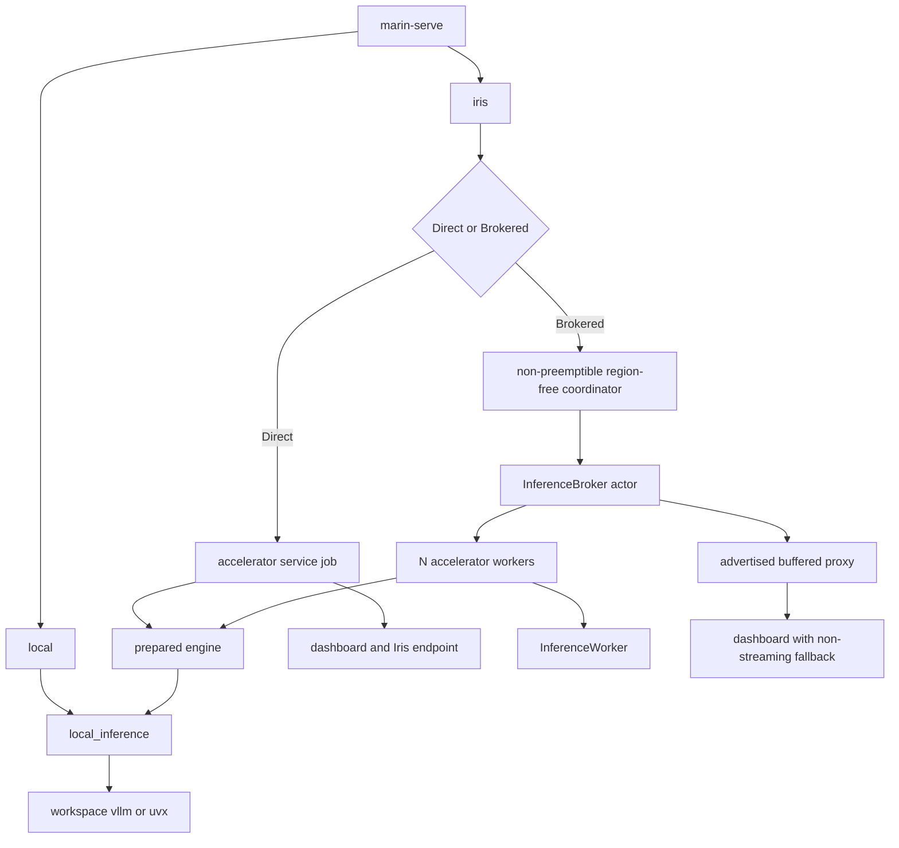

# Unify `marin-serve` with Iris inference

## TL;DR

Expose two public launch paths:

```python
with local_inference(model, engine) as session:
    session.check_alive()  # vLLM or Levanter on this host

with remote_inference(model, engine, iris, instances=1) as session:
    ...  # one or more Iris inference workers
```

The CLI mirrors them as `marin-serve local MODEL` and
`marin-serve iris MODEL`. The Iris API and CLI use direct mode for one instance,
broker mode for multiple instances, and accept an explicit `BrokerConfig` or
`--broker` for brokered single-instance fault tolerance.

Direct Iris mode keeps the current efficient topology: one accelerator job
owns its endpoint and dashboard. Brokered mode uses a non-preemptible CPU
coordinator colocated with its accelerator workers. Only brokered requests pass
through the coordinator.

## Current code

Three implementations overlap:

- `marin.inference.quick_serve` starts a `ServingBackend` in an accelerator
  job, builds the dashboard, and registers the public endpoint.
- `marin.inference.vllm` starts vLLM directly or starts an Iris broker actor
  and worker jobs. Its local path routes one process through a broker, worker,
  and proxy. Its Iris path exposes a loopback-only parent proxy.
- `experiments/evals/evalchemy/serve_and_eval.py` independently chooses worker
  resources and environments, submits a quick-serve child, polls the registry,
  resolves its endpoint, and terminates it.

`VllmBackend` and `VllmServerConfig` both describe vLLM startup.
`QuickServeConfig` and `BrokeredVllmSystemConfig` both describe the model and
worker. Evalchemy and `quick_serve_cli.py` duplicate resource, environment,
endpoint, readiness, retry, and cleanup policy.

The broker transport is narrower than quick serve. `InferenceProxy` handles
only models, completions, and chat completions. It buffers JSON objects and
drops headers. Quick serve forwards arbitrary `/v1/*` GET/POST/OPTIONS,
headers, bytes, and streaming responses.

## Lightweight configuration

Move configuration dataclasses into modules that do not import JAX, Levanter,
or vLLM implementations. The CLI and CPU parents must be able to construct and
cloudpickle configs with base Marin installed.

```python
@dataclass(frozen=True)
class ServedModelConfig:
    model: str
    tokenizer: str | None = None
    dtype: str = "bfloat16"
    max_model_len: int | None = None
    tensor_parallel_size: int | None = None
    chat_template_content: str | None = None


@dataclass(frozen=True)
class VllmEngineConfig:
    launcher: VllmLauncherType = VllmLauncherType.WORKSPACE
    source: VllmSource = VllmSource.UPSTREAM
    version: str | None = None
    startup_timeout_seconds: int = 1800
    max_num_batched_tokens: int | None = None
    extra_args: tuple[str, ...] = ()


@dataclass(frozen=True)
class LevanterEngineConfig:
    max_seqs: int = 16
    page_size: int = 128
    hbm_utilization: float = 0.8


InferenceEngineConfig = VllmEngineConfig | LevanterEngineConfig
```

`VllmLauncherType` selects workspace, isolated CUDA, or isolated TPU launch.
Worker-only factories translate these plain configs into
`VllmLauncher`, `VllmBackend`, or `LevanterBackend` objects with lazy imports.
Split the current `serving_backend.py` so importing the config and protocol
does not import `jax`, `jmp`, or Levanter. The Levanter implementation remains
in a worker-only module.

There is one vLLM description: `ServedModelConfig + VllmEngineConfig`.
`ModelSpec` becomes the resolved worker-side form after model caching and
automatic tensor-parallel selection. No second process config repeats dtype,
sequence length, tensor parallelism, or chat template fields.

## Local inference

```python
@contextmanager
def local_inference(
    model: ServedModelConfig,
    engine: VllmEngineConfig | LevanterEngineConfig,
    *,
    host: str = "127.0.0.1",
    port: int | None = None,
) -> Iterator[LocalInferenceSession]: ...
```

`local_inference` selects `VllmBackend` or `LevanterBackend` from the engine
config and yields the direct OpenAI endpoint plus a liveness check. The vLLM
backend translates typed fields to vLLM arguments, reserves an ephemeral
loopback port when `port is None`, and delegates subprocess lifecycle to
`VllmEnvironment`.
It does not inspect Iris, allocate resources, create a broker, or start a
proxy. `extra_args` is an escape hatch after typed arguments.

Local model paths are used as given. Iris cache mirroring and accelerator
inspection do not run locally. Leaving tensor parallelism unset lets vLLM use
its default.

The requested “right here” CLI is intended for a reserved GPU/TPU shell or a
developer host with vLLM available:

```text
marin-serve local MODEL --launcher workspace
marin-serve local MODEL --launcher cuda --vllm-source upstream --vllm-version 0.25.1
marin-serve local MODEL --launcher tpu
```

`workspace` runs `vllm` from `PATH`. `cuda` and `tpu` use the existing `uvx`
launchers. CUDA-only flags fail with other launchers.

## Remote inference boundary

The first two arguments are identical to `local_inference`. `IrisConfig` adds
worker resources, environment, caching, endpoint-readiness timeout, priority,
and retry policy:

```python
@contextmanager
def remote_inference(
    model: ServedModelConfig,
    engine: VllmEngineConfig | LevanterEngineConfig,
    iris: IrisConfig,
    *,
    instances: int = 1,
    broker: BrokerConfig | None = None,
) -> Iterator[RemoteInferenceSession]: ...
```

One instance with `broker=None` uses the direct topology. More than one
instance constructs the default `BrokerConfig` automatically. Passing
`BrokerConfig()` requests broker mode for one instance. This keeps the
topology decision at the remote API boundary; local backends never inspect Iris
or construct broker transport.

`BrokerConfig` owns request timeouts, proxy settings, broker resources,
and worker retry policy. It validates
`0 < worker timeout < lease timeout < proxy timeout`. `instances` must
be positive.

Every inference instance is one single-task, single-host Iris job. `IrisConfig`
rejects `worker_resources.replicas != 1` and TPU variants whose topology has
more than one VM. Distributed vLLM within an instance needs a separate design.

The CLI maps `--instances` and `--broker` to the same API:

```python
broker_config = BrokerConfig() if broker or instances > 1 else None
```

CLI output reports `mode direct` or `mode brokered`, instance count, and
streaming support. Every CLI endpoint uses link access; after readiness the CLI
always mints and prints an endpoint-scoped JWT capability URL before holding
the controller connection open.

## Direct Iris flow

`remote_inference(model, engine, iris)` submits one accelerator child when
`instances=1` and `broker=None`.
The child resolves the cached model path, computes automatic tensor
parallelism, starts the selected engine, binds the existing dashboard/proxy to
its advertised interface, registers one stable Iris endpoint name, and blocks.

Extract the generic header-faithful streaming proxy from
`dashboard_server.py`; do not implement a second proxy. It keeps the
current `/v1/*` GET/POST/OPTIONS, hop-by-hop header filtering, blank
Authorization filtering, raw byte forwarding, status codes, and streaming.

`RemoteInferenceSession` contains the initial `RunningModel`, endpoint name,
worker handles, resolved serving metadata, and a `resolve_model()` operation that
re-resolves the registry name. Evalchemy uses the shared submission lifecycle
and keeps its current connection-failure and endpoint-refresh policy. There is
no coordinator HTTP server in direct mode.

The direct worker registers resolved tensor parallelism and backend metadata.
Chat capability is still probed after readiness; it is not inferred from the
config. A worker retry re-registers the same endpoint name at its new address.
Readiness fails if the job terminates before registration and cleanup removes
stale endpoint state.

For direct `marin-serve iris`, the CLI submits the accelerator service
job itself. No CPU coordinator or child accelerator job is added. This
preserves federated `--target-cluster` behavior and the current one-proxy data
path.

## Brokered Iris flow

`remote_inference(..., broker=BrokerConfig())` runs in a CPU coordinator,
creates one `InferenceBroker` actor, submits `instances` accelerator workers,
and binds the broker proxy to `job_info.advertise_host`. Eval children can call
that address; it is not loopback-only.

The coordinator must be non-preemptible. The CLI applies `--target-cluster` to
the coordinator job but deliberately omits its `--region` constraint in broker
mode, so child workers can schedule in any region with matching accelerator
capacity. Direct mode continues to apply `--region` to its accelerator job.
Programmatic callers can constrain broker workers explicitly through
`IrisConfig.worker_resources`.

This can put the coordinator and workers in different regions. Actor clients
send large broker payloads with zstd and advertise zstd/gzip for responses;
actor servers offer the same encodings. A dry-run of
`base_model_evals()` in `experiments/evals/evals.py` counted at least 210.4M
echoed token positions. Top-5 OpenAI completion responses serialized with
Qwen3 token pieces and float32 logprobs compress to roughly 61–66 bytes/token
under ConnectRPC's gzip level 6, or 12.9–13.9 GB of response traffic; prompts
add about 0.8 GB. That cost is accepted in exchange for schedulability.

For library callers already inside Iris, broker mode requires the ambient job
to be in the intended worker region/cluster. It cannot use Fray to federate
children because `JobRequest` has no target-cluster constraint. Callers that
need federation submit the coordinator through `marin-serve iris` or an outer
Iris job with the constraint.

Upgrade the broker payload to carry:

- method, path and query string;
- raw request bytes;
- request headers filtered by the extracted quick-serve policy;
- response status, raw bytes, and response headers with hop-by-hop headers
  removed.

Route all `/v1/{path:path}` GET/POST/OPTIONS through the buffered protocol.
Preserve `Content-Type`, `Accept`, Authorization when nonblank, request IDs,
and other end-to-end headers; remove only the existing hop-by-hop set. Request
field removal remains a JSON-only optional transform for configured eval
compatibility.

Broker mode rejects `stream=true` with 400 because lease-based request/response
transport cannot deliver partial SSE chunks. Add `streaming: bool` to
`ServingInfo`. The dashboard uses its existing SSE client when true and a
normal JSON completion request when false, so chat remains usable in broker
mode.

`IrisInferenceSession` contains the advertised coordinator endpoint, all
worker handles, `uses_broker=True`, `streaming=False`, and serving metadata.
Worker readiness metadata supplies resolved tensor parallelism; chat support is
probed through the broker endpoint.

The broker recovers an unanswered buffered request when one worker fails or is
preempted and the lease expires, provided coordinator and broker remain alive
and Iris replaces the worker. The in-memory broker and coordinator remain
single failure domains. Coordinator loss discards in-flight state and tears
down its children.

## Long-running Iris service

```python
@dataclass(frozen=True)
class IrisServiceConfig:
    model: ServedModelConfig
    engine: InferenceEngineConfig
    iris: IrisConfig
    endpoint_name: str
    instances: int = 1
    broker: BrokerConfig | None = None
    access: int = EndpointAccess.ENDPOINT_ACCESS_PRIVATE
    timeout_hours: float = 24.0
    controller_proxy_timeout_seconds: float = 600.0
```

`run_iris_service` applies the same remote boundary rule:

- direct mode: run the prepared engine in the current accelerator job, then bind
  dashboard/proxy and register the public endpoint.
- broker mode: enter `remote_inference` in the non-preemptible CPU
  coordinator, bind dashboard/proxy against the advertised broker endpoint,
  and register the public endpoint.

Both modes retain endpoint metadata, capability links, health, and wall-clock
shutdown. `marin-serve iris` always registers LINK access and mints the scoped
URL after the live endpoint can be owner-authorized. `controller_proxy_timeout_seconds`
is distinct from the broker request timeout and is used only for endpoint metadata.

## Control flow



## Module ownership

- `inference/config.py`: lightweight model, engine, Iris, and broker
  dataclasses; no accelerator framework imports.
- `inference/vllm_server.py`: executable selection, subprocess lifecycle,
  readiness, logs, and metrics.
- `inference/vllm_backend.py`: vLLM launcher selection and local subprocess
  backend; no Iris or broker orchestration.
- `inference/levanter_backend.py`: heavy Levanter/JAX implementation, imported
  only in accelerator workers.
- `inference/backend.py`: lightweight local backend protocol and resolved
  `ModelSpec`.
- `inference/http_proxy.py`: proxy extracted from quick-serve dashboard,
  including header policy and streaming.
- `inference/serve.py`: `local_inference`, shared by direct and broker workers.
- `inference/iris.py`: `remote_inference`, Iris job/actor lifecycle, model
  preparation, remote session, and long-running service entrypoint.
- `inference/broker.py`, `proxy.py`, `worker.py`: buffered broker transport.
- `inference/serve_cli.py`: Click parsing and topology-aware outer-job
  submission.

Delete `quick_serve.py` after moving preparation and presentation. Rename the
Iris command implementation to `iris_cli.py`, compose it under `serve_cli.py`,
and update the `marin-serve` entrypoint.
Do not leave import aliases.

## CLI and operational mapping

- `--gpu`/`--tpu`, worker `--cpu`/`--memory`/`--disk`, and backend flags build
  worker config.
- Direct CLI mode submits those resources as the service job. Brokered CLI mode
  submits a small non-preemptible CPU coordinator with the same region and
  target-cluster constraints; children inherit placement.
- `--extra`, checkout-free install, `--task-image`, and launcher selection
  build the lightweight engine and worker environment.
- `--endpoint-name`, `--proxy-timeout`, and `--timeout-hours` build
  `IrisServiceConfig`.
- Readiness waiting, capability minting, controller selection, and detach
  instructions stay CLI-side. `--no-wait` is an explicit opt-out of waiting
  and minting because the controller cannot mint a token until the endpoint
  exists; the default flow always waits and mints.
- Direct and broker workers use `max_retries_failure=1` and
  `max_retries_preemption=10`. Broker actor restart remains disabled because
  state is in-memory.

The breaking grammar is:

```text
marin-serve local MODEL [local vLLM flags]
marin-serve iris MODEL [Iris/service/backend flags]
```

`marin-serve MODEL` is removed.

## Migration

| Current caller | Replacement |
| --- | --- |
| `start_local_brokered_vllm` | `local_inference`; no local broker |
| `start_local_vllm_server` | `local_inference` |
| `start_iris_brokered_vllm` | `remote_inference(..., broker=BrokerConfig())` |
| `BrokeredVllmSystemConfig` | model + engine + `IrisConfig` + `BrokerConfig` |
| `QuickServeConfig` / `serve_in_job` | `IrisServiceConfig` / `run_iris_service` |
| `marin-serve MODEL ...` | `marin-serve iris MODEL ...` |
| Evalchemy private submission | `remote_inference`; retain result/error and refresh policy |
| brokered lm-eval wrapper | `remote_inference(..., broker=BrokerConfig())` |

No deprecated dataclasses, forwarding functions, old CLI grammar, or duplicate
submission helpers remain.

## Verification

1. `local_inference` builds workspace/CUDA/TPU vLLM commands from typed fields, reserves
   an ephemeral default port, yields a direct endpoint, and constructs no
   broker components.
2. `BrokerConfig` rejects invalid timeout ordering; `remote_inference` rejects zero instances;
   multi-replica resources, multi-host TPU variants, and broker worker
   invalid worker placement.
3. Direct mode submits one worker, preserves the current streaming proxy, waits
   for registry readiness, fails on early job exit, refreshes a changed address,
   and cleans up.
4. Broker mode preserves raw buffered requests/responses and end-to-end headers
   for arbitrary `/v1/*` routes, rejects streaming, and binds an advertised
   address.
5. Broker recovery requeues a leased request after worker loss and lets a
   replacement finish it while broker/coordinator remain alive.
6. Dashboard tests exercise SSE in direct mode and JSON fallback in brokered
   mode. Health and chat-template probing work for both.
7. CLI tests cover subcommands, automatic topology selection, launcher-specific
   validation, direct versus coordinator resource placement, checkout-free
   installs, federation/region constraints, task images, and unconditional
   capability minting.
8. Evalchemy and lm-eval tests use the shared Iris API and no longer construct
   `QuickServeConfig` or call broker-specific launch functions.

Run focused Marin tests, `uv run pyrefly`, the required pre-commit pass, and
lint review before the PR.

## Rejected alternatives

An always-on CPU coordinator makes the common direct path slower and can break
cross-region or federated connectivity. Evalchemy already handles direct worker
re-registration. Only broker mode needs a coordinator in the data path.

Routing local vLLM through a broker adds a broker, worker thread, and proxy
around one process. Local mode exposes vLLM directly.

Adding a `ports` field to Fray is unnecessary. Direct service jobs continue to
use the raw Iris submission path for their public named port; broker internal
servers bind advertised ephemeral ports.

Streaming cannot be hidden behind the current lease protocol. Broker mode
rejects it explicitly and the dashboard uses a non-streaming fallback.
