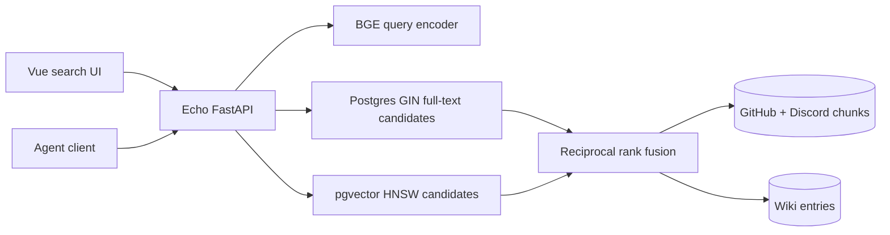

# Echo Wiki and Hybrid Search

## Checkpoint

Echo currently stores 46k-scale GitHub and Discord chunks with
`BAAI/bge-small-en-v1.5` passage embeddings, then ranks queries only by cosine
distance. The reported production query `grafana` returns unrelated MoE comments
at distances 0.421–0.435 even though exact lexical matching is available through a
separate, unranked `grep` endpoint.

The current API and CLI use `TextEmbedding.embed()` for queries. FastEmbed exposes
`query_embed()` and `passage_embed()` for this model, and the BGE model card calls
for a query instruction in short-query-to-passage retrieval. This is a query-side
bug; the existing passage embeddings do not need to be regenerated to correct it.

This session cannot query the production database: its VM service account can
describe `echo-api`, but lacks both `cloudsql.instances.connect` and IAP access.
The supplied `grafana` output is therefore the production baseline. Search-quality
iteration will use checked-in behavior fixtures plus local PostgreSQL when
available, followed by a post-deploy probe from an authorized identity.

## Decision

Add PostgreSQL full-text indexes and combine lexical and vector candidate lists
with reciprocal rank fusion (RRF):

```sql
WITH semantic AS (
  SELECT id, row_number() OVER (
    ORDER BY embedding <=> CAST(:embedding AS vector)
  ) AS rank
  FROM chunks
  ORDER BY embedding <=> CAST(:embedding AS vector)
  LIMIT :candidate_limit
),
lexical AS (
  SELECT id, row_number() OVER (
    ORDER BY ts_rank_cd(search_document, websearch_to_tsquery('english', :q), 32) DESC
  ) AS rank
  FROM chunks
  WHERE search_document @@ websearch_to_tsquery('english', :q)
  LIMIT :candidate_limit
)
SELECT id, sum(1.0 / (60 + rank)) AS score
FROM (
  SELECT * FROM semantic
  UNION ALL
  SELECT * FROM lexical
) candidates
GROUP BY id
ORDER BY score DESC;
```

RRF is preferable to adding cosine similarity and `ts_rank_cd` directly because
those scores have unrelated, query-dependent scales. Exact identifiers and names
enter through the lexical list, while paraphrases still enter through the vector
list. Title terms receive PostgreSQL weight `A`; body terms receive weight `B`.
The implementation will expose component ranks/scores so later tuning is
observable.

Keep `BAAI/bge-small-en-v1.5` and its 384-dimensional vectors for this change. It
is already embedded into the runtime image, is inexpensive on CPU, and supports
the existing corpus space. Query vectors will use `query_embed()`; new wiki
documents will embed `title + body` with `passage_embed()`. A model migration can
be evaluated later against a labeled relevance set instead of forcing a costly
corpus rewrite into this feature.

## Wiki schema and API

Add a `wiki_entries` table:

```python
wiki_entries = Table(
    "wiki_entries",
    metadata,
    Column("id", BigInteger, Identity(always=True), primary_key=True),
    Column("created_at", DateTime(timezone=True), server_default=func.now(), nullable=False),
    Column("updated_at", DateTime(timezone=True), server_default=func.now(), nullable=False),
    Column("author", Text, nullable=False),
    Column("title", Text, nullable=False),
    Column("body", Text, nullable=False),
    Column("reference_count", BigInteger, server_default=text("0"), nullable=False),
    Column("embedding", Vector(EMBED_DIM), nullable=False),
)
```

A stored, weighted `tsvector` and GIN index provide lexical lookup; an HNSW cosine
index provides semantic lookup. The API surface is:

- `GET /search` — hybrid activity search over existing chunks.
- `GET /wiki/search` — hybrid wiki search, or recent entries for a blank query.
- `GET /wiki/{id}` — retrieve a complete note.
- `POST /wiki` — create and embed a note, attributing it to the IAP caller.
- `POST /wiki/{id}/references` — atomically increment and return the reference count.

Reference counts represent deliberate citations, not search impressions. Searches
must not mutate notes. Direct human database access remains read-only for wiki
entries; creation and reference updates go through the API so attribution,
embedding, and atomic counters remain consistent.

## UI and deployment

Build `infra/echo/dashboard` with the repository’s Vue 3, Rsbuild, TypeScript,
Tailwind 4, and Noto Sans setup. The basic interface has a prominent search field,
Activity/Wiki/All scopes, source filters for GitHub and Discord activity, compact
result cards, loading/error/empty states, and a wiki detail view. “Activity” is
the UI name for the existing GitHub/Discord talk corpus.

The API Dockerfile becomes a two-stage build: Node builds the SPA, then the Python
runtime copies `dist`. FastAPI serves its existing API routes, `/docs`, and
`/healthz`, mounts static assets, and falls back to `index.html` for browser
routes. Keeping one IAP-gated Cloud Run service avoids CORS and a second deployment
surface.



## Validation

- API behavior tests cover caller attribution, query-vs-passage encoding,
  create/detail/reference-count contracts, filters, and empty/missing cases.
- Ranking tests use an independent small fixture where `grafana` must outrank
  unrelated semantically plausible text and a paraphrase must remain discoverable
  from the vector candidate list.
- Migration SQL is tested for both weighted generated search documents and grants.
- The dashboard must pass `npm run build:check`.
- Echo Python tests, required pre-commit checks, and Docker build/smoke tests run
  before deployment.
- If credentials permit deployment, run representative queries (`grafana`,
  `ragged_all_to_all`, `expert parallel MoE MFU on B200`, `TPU vLLM`, `Zephyr
  straggler`) before and after, record top-five results, and restart/deploy
  `echo-api`. Otherwise make the authorization gap explicit in the handoff.

## Work ledger

- #170 Add hybrid activity search, wiki persistence/API, the Vue dashboard,
  validation, deployment, and PR.
