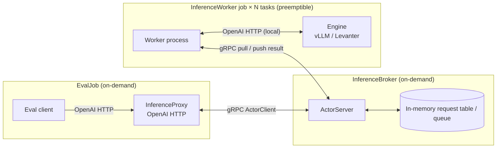

# RFC 3: Iris Inference Service

This RFC assumes:
- eval clients already target the contract in [`01-rfc-evals-over-openai-http.md`](./01-rfc-evals-over-openai-http.md)
- engines already satisfy that contract, with Levanter-specific work tracked in [`02-rfc-levanter-http-parity.md`](./02-rfc-levanter-http-parity.md)

## Raison d'être

Allow easy elastic inference on both TPUs and GPUs, backed by Iris.

## Goals

### The system

- Support our current evals in [`lib/marin/src/marin/evaluation`](../../../lib/marin/src/marin/evaluation), so we can get off Ray ([#4269](https://github.com/marin-community/marin/issues/4269)) in the near future.
- Run both vLLM and Levanter as worker-side engine choices.
- Keep the system simple enough to build now:
  - one eval job
  - one broker job
  - one worker job with `N` replicas / tasks
- Tolerate worker preemption via replay.
- Keep the queue in-memory and scoped to one eval batch job.

### Non-goals

- Defining the eval-side OpenAI-compatible contract. That lives in [`01-rfc-evals-over-openai-http.md`](./01-rfc-evals-over-openai-http.md).
- Engine-specific HTTP implementation work. That lives in [`02-rfc-levanter-http-parity.md`](./02-rfc-levanter-http-parity.md).

## Assumptions

Client side:
- The eval job speaks to a local proxy over OpenAI-compatible HTTP.
- We own the proxy code, so we can put request / retry logic there.
- The pipelines are triggered offline, as batch workloads.
- A single client task is enough.

System:
- The system will run on Iris.
- Worker nodes will mostly be preemptible.
- The proxy and broker can run on on-demand compute.
- A single broker actor is enough to start with.

### Out of scope (initially)

- OpenAI's server-driven streaming
- OpenAI Batch API
- Server-side batching beyond what the engine already does
- Parameter syncing for in-training-loop systems
- Multi-tenant / persistent service deployment
- Persistent broker queue across broker restarts
- Cancellation of in-flight requests
- Direct Levanter analysis jobs such as [`log_probs.py`](../../../lib/marin/src/marin/evaluation/log_probs.py), [`save_logprobs.py`](../../../lib/marin/src/marin/evaluation/save_logprobs.py), and [`visualize.py`](../../../lib/marin/src/marin/evaluation/visualize.py). Those need separate follow-up and are tracked in [#4640](https://github.com/marin-community/marin/issues/4640#issuecomment-4256093134).

## System design

### Components

There are 3 separate Iris jobs in this system:
- EvalJob:
  - Spin up a local `InferenceProxy` HTTP service.
  - Read the eval data and submit inference work to that proxy.
  - Assign a request id before talking to the broker, and reuse it if the proxy retries locally.
- InferenceBroker:
  - A single Iris job using `ActorServer`.
  - Sits on top of an in-memory request table / queue.
  - Tracks outstanding work and correlates results back to the proxy.
- InferenceWorker:
  - A single Iris job with `N` replicas / tasks.
  - Each task boots a local inference engine (vLLM or Levanter), exposed as a local OpenAI-compatible HTTP server.
  - Each task pulls work from the broker and forwards it to the local engine.



### Configuration

The pipeline launcher should know 3 things:
- what eval to run
- what model and engine the workers should serve
- how large the Iris deployment should be

That top-level config is enough to build the broker job, worker job, and eval job. The eval job itself should only get the proxy URL plus whatever small evaluator-specific fields it still needs.

One reasonable shape is:

```python
@dataclass(frozen=True)
class EvalWorkloadConfig:
    evaluator: EvaluatorKind
    tasks: list[EvalTaskConfig]
    max_eval_instances: int | None
    output_path: str
    wandb_tags: list[str] = field(default_factory=list)


@dataclass(frozen=True)
class ModelDeploymentConfig:
    model_name: str
    model_path: str | None
    apply_chat_template: bool
    generation_params: dict[str, Any] = field(default_factory=dict)
    engine_kwargs: dict[str, Any] = field(default_factory=dict)


@dataclass(frozen=True)
class BrokerConfig:
    lease_timeout: float
    max_pending_requests: int | None = None


@dataclass(frozen=True)
class WorkerPoolConfig:
    resources: ResourceConfig
    replicas: int
    max_retries_preemption: int = 1000
    max_retries_failure: int = 0


@dataclass(frozen=True)
class ProxyRetryConfig:
    request_timeout: float
    max_attempts: int
    backoff_initial: float


@dataclass(frozen=True)
class InferenceServiceConfig:
    engine: EngineKind
    broker: BrokerConfig
    workers: WorkerPoolConfig
    proxy: ProxyRetryConfig


@dataclass(frozen=True)
class EvalJobConfig:
    workload: EvalWorkloadConfig
    model: ModelDeploymentConfig
    service: InferenceServiceConfig
```

This keeps the split explicit:
- `workload` says what eval to run
- `model` says what artifact is being served
- `service` says how Iris should deploy the inference system

The smaller evaluator-specific client config should be derived from this.

### Broker

- Accept opaque OpenAI request envelopes from the proxy:
  - `request_id`
  - endpoint kind
  - serialized request payload
- Track request lifecycle state:
  - `pending`
  - `leased`
  - `done`
  - `failed`
- Correlate worker results back to the proxy.
- If multiple workers report a result for the same `request_id`, the broker keeps the first terminal result and ignores later duplicates.

One reasonable envelope shape is:

```python
@dataclass(frozen=True)
class InferenceRequestEnvelope:
    request_id: str
    endpoint: Literal["completions", "chat_completions"]
    payload_json: str
```

### Queue semantics and request identity

- The queue is intentionally in-memory only.
- Delivery is at-least-once while the broker is alive:
  - a worker leases a request
  - if the worker dies before reporting a result, the lease expires
  - expired work is requeued
- The proxy should generate `request_id` before the first broker call.
- The id should be stable across proxy retries.
- The id should not be a raw hash of the OpenAI payload, because two distinct eval items can legitimately produce identical payloads.
- A proxy-generated UUID / trace id is fine, as long as it is created once for the logical request and then reused on retry.
- If replay causes multiple workers to report a result for the same `request_id`, the broker keeps the first terminal result and ignores later duplicates.
- Iris may reschedule a dead broker, but that is not queue recovery. The restarted broker comes back with fresh in-memory state.
- Recovery across broker restarts therefore has to come from the proxy:
  - if the proxy sees timeout / RPC failure
  - it retries the same logical request
  - it reuses the same `request_id`
- A plain HTTP client timeout only detects failure. It does not give replay / dedupe semantics by itself.
- The broker does not need to keep terminal request records forever. Since this service is spun up per eval batch job, those records only need to live for the lifetime of that job.

## Future work

- Always-on batch inference service
- Lower-priority workloads that take advantage of spare TPU capacity ([#4401](https://github.com/marin-community/marin/issues/4401))
- Dynamic-parameter use cases such as in-training-loop evals and RL rollouts
