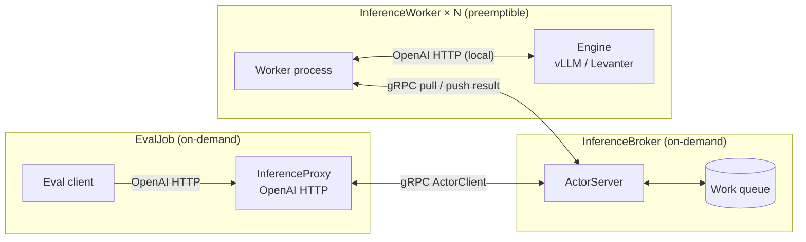

# Iris Inference Service RFC

## Raison d'être

Allow easy elastic inference, on both TPUs and GPUs, backed by Iris :tm:.

## Goals

### This document

Make the system requirements explicit to:
1. Humans, to get agreement on the RFC
2. Agents (later), give context for better vibez

### The system

- Support our current evals in [`lib/marin/src/marin/evaluation`](../../../lib/marin/src/marin/evaluation), allowing to get off Ray ([#4269](https://github.com/marin-community/marin/issues/4269)) in the near future
- Start simple but, potentially, allow future extensions, e.g.:
  - Allow an offline inference system that takes care of spare TPU capacity ([#4401](https://github.com/marin-community/marin/issues/4401))
  - Stretch: Allow "dynamic parameters" use cases, such as in-the-training-loop evals and RL rollouts
  - Note: The examples above have vastly different complexity and timeline requirements than our original task. They might end up sharing very little with it.

## Assumptions

Client side:
- The leading inference standard is currently the OpenAI Http API and it's a good idea to follow this standard
- We don't have full control of the client's behavior (eg rate limiting, retries)
- The pipelines are triggered offline, as batch workloads.
- A single client task is enough (as the bulk of the workload is in the workers)

System:
- The system will run on Iris
- All worker nodes will mostly run on preemptible
- The client code and the broker can run on on-demand compute
- It's best to start with both vLLM and Levanter inference engines (eventually we'll want to favor vLLM)
- A single broker actor is enough (as the bulk of the workload is in the workers)

### Out of scope (initially)
- Partial support of the OpenAI API spec. Exclude:
  - OpenAI's server driven streaming, TODO:
    - Do any clients fully require it? (i.e. are there use cases that we wouldn't support?)
    - How would we add it later?
  - OpenAI Batch API not supported
- Server side batching (beyond what vLLM automagically does). The client can choose to batch at request time.
- In the training loop systems: Parameter syncing won't be supported initially.
- non Centralized system: Initially we'll spin up a new inference service system for each eval batch job.
- Persistent work queue: We want to keep the system simple and as stateless as possible, especially initially, therefore the queue won't be resilient to broker preemptions.
- Improve vLLM to support:
  - the custom Grug architecture
  - the prompt_logprob required to support prefill scoring ([vllm-project/tpu-inference#2072](https://github.com/vllm-project/tpu-inference/issues/2072))

## System design

### Components

There are 3 separate iris `Job` in this system:
- EvalJob:
  - Spin up a local InferenceProxy http service, speaks to the broker using Iris's gRPC `ActorClient` system.
  - Read the eval data, submit inference work to the proxy.
- InferenceBroker: A single Iris job, using the `ActorServer` component to act as a centralized RPC server. It sits on top of a local queue to track the outstanding work.
- InferenceWorker: Iris tasks that (1) boot up a local inference engine (vLLM or Levanter) exposed as a local OpenAI HTTP server, and (2) pull work from the broker's queue and forward it to that local server.



### Configurations

All systems are configured using Python dataclasses.

The dataclasses above will be nested into an `EvalJobConfig` that will be passed at the entrypoint of the pipeline:
```python
@dataclass
class EvalJobConfig:
	...
```

### Abstractions

#### Broker

TODO

#### Queue

TODO

#### InferenceServer

Both

## External Resources
- [OpenAI API reference](https://platform.openai.com/docs/api-reference) — HTTP endpoint spec (chat completions, completions, embeddings, models, …) that vLLM's [OpenAI-compatible server](https://docs.vllm.ai/en/stable/serving/openai_compatible_server/) implements
- Eval harnesses used by marin:
  - [EleutherAI/lm-evaluation-harness](https://github.com/EleutherAI/lm-evaluation-harness)
  - [mlfoundations/evalchemy](https://github.com/mlfoundations/evalchemy) (builds on lm-evaluation-harness)
  - [harbor-framework/harbor](https://github.com/harbor-framework/harbor)

## Appendix A: Taxonomy
- Eval: TODO
- Client: The code that originally makes inference requests, typically using the `openai.OpenAI` client.
- Proxy: An http server that runs locally with the client and routes inference requests to the broker.
- Broker: Iris Actor responsible for managing the queue of workload requests, and routing the results back to the proxy.
- Workers: Iris tasks that (1) boot up a local inference engine and (2) pull work from the broker's queue.
- (Inference) Engine: vLLM or Levanter, running locally and exposed via an OpenAI http API.

## Appendix B: Eval abstractions

We assume the eval datasets can be run against an OpenAI http server
```python
def run_eval(url: str) -> EvalResult:
	...
```

## Appendix C: Allowing future extensions

- Always on Batch Inference System: An always on server could implement the OpenAI Batch inference API, and spin up inference services for each supported model. Iris priorities could be leveraged to run workloads with low priorities.
- Parameter hot swapping: Seems like too much of a scope departure from the current project. We'll reconsider in the future based on requirements at that time.
