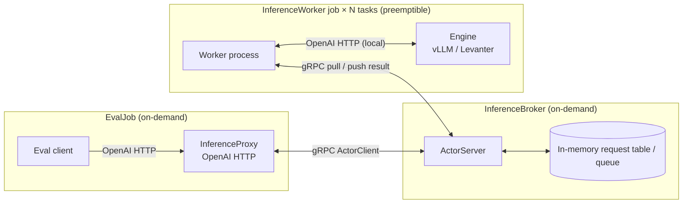

# Iris Inference Service RFC

## Raison d'être

Allow easy elastic inference, on both TPUs and GPUs, backed by Iris :tm:.

## Goals

### This document

Make the system requirements explicit to:
1. Humans, to get agreement on the RFC
2. Agents (later), give context for better vibez

### The system

- Support our current evals in [`lib/marin/src/marin/evaluation`](../../../lib/marin/src/marin/evaluation), allowing to get off Ray ([#4269](https://github.com/marin-community/marin/issues/4269)) in the near future
- For this RFC, "current evals" means the `run.py` evaluators we need to get off Ray:
  - `lm_evaluation_harness`
  - `harbor`
  - `evalchemy`
- For this RFC, engine choice should be a worker-side config detail. Levanter should run through the same `lm_evaluation_harness` path as vLLM, and `levanter_lm_evaluation_harness` should disappear as part of this work.
- Bringing Levanter's OpenAI-compatible HTTP layer up to the parity needed by `lm_eval` is part of this RFC.
- Porting `evalchemy` from its current direct-vLLM integration to the same OpenAI-compatible client path is in scope for this RFC.
- Start simple but, potentially, allow future extensions, e.g.:
  - Allow an offline inference system that takes care of spare TPU capacity ([#4401](https://github.com/marin-community/marin/issues/4401))
  - Stretch: Allow "dynamic parameters" use cases, such as in-the-training-loop evals and RL rollouts
  - Note: The examples above have vastly different complexity and timeline requirements than our original task. They might end up sharing very little with it.

## Assumptions

Client side:
- The leading inference standard is currently the OpenAI Http API and it's a good idea to follow this standard
- We own the proxy code, so we are free to put request / retry logic there (for example, attaching a request id before talking to the broker)
- The pipelines are triggered offline, as batch workloads.
- A single client task is enough (as the bulk of the workload is in the workers)

System:
- The system will run on Iris
- All worker nodes will mostly run on preemptible
- The client code and the broker can run on on-demand compute
- It's best to start with both vLLM and Levanter inference engines (eventually we'll want to favor vLLM)
- A single broker actor is enough (as the bulk of the workload is in the workers)

### Out of scope (initially)
- Partial support of the OpenAI API spec. Exclude:
  - OpenAI's server driven streaming, TODO:
    - Do any clients fully require it? (i.e. are there use cases that we wouldn't support?)
    - How would we add it later?
  - OpenAI Batch API not supported
- Server side batching (beyond what vLLM automagically does). The client can choose to batch at request time.
- In the training loop systems: Parameter syncing won't be supported initially.
- non Centralized system: Initially we'll spin up a new inference service system for each eval batch job.
- Persistent work queue: We want to keep the system simple and as stateless as possible, especially initially, therefore the queue won't be resilient to broker preemptions.
- Direct Levanter analysis jobs in [`log_probs.py`](../../../lib/marin/src/marin/evaluation/log_probs.py), [`save_logprobs.py`](../../../lib/marin/src/marin/evaluation/save_logprobs.py), and [`visualize.py`](../../../lib/marin/src/marin/evaluation/visualize.py). These are not inference-service clients and need separate follow-up, tracked in [#4640](https://github.com/marin-community/marin/issues/4640#issuecomment-4256093134).
- Cancellation of in-flight requests.
- Improve vLLM to support:
  - the custom Grug architecture
  - the prompt_logprob required to support prefill scoring ([vllm-project/tpu-inference#2072](https://github.com/vllm-project/tpu-inference/issues/2072))

## System design

### Components

There are 3 separate Iris jobs in this system:
- EvalJob:
  - Spin up a local InferenceProxy http service, speaks to the broker using Iris's gRPC `ActorClient` system.
  - Read the eval data, submit inference work to the proxy.
  - Assign a request id before talking to the broker, and reuse it if the proxy retries locally.
- InferenceBroker: A single Iris job, using the `ActorServer` component to act as a centralized RPC server. It sits on top of an in-memory queue / request table to track outstanding work and results.
- InferenceWorker: A single Iris job with `N` replicas / tasks. Each task (1) boots up a local inference engine (vLLM or Levanter) exposed as a local OpenAI HTTP server, and (2) pulls work from the broker's queue and forwards it to that local server.



### Configurations

All systems are configured using Python dataclasses.

The entrypoint should take one nested config object that is rich enough to derive:
- the Iris deployment config for the broker and workers
- the smaller runtime client config that the eval job uses to talk to the proxy

One reasonable shape is:
```python
class EvaluatorKind(StrEnum):
    LM_EVALUATION_HARNESS = "lm_evaluation_harness"
    HARBOR = "harbor"
    EVALCHEMY = "evalchemy"


class EngineKind(StrEnum):
    VLLM = "vllm"
    LEVANTER = "levanter"


class OpenAIEndpointKind(StrEnum):
    COMPLETIONS = "completions"
    CHAT_COMPLETIONS = "chat_completions"


@dataclass(frozen=True)
class EvalTaskConfig:
    name: str
    num_fewshot: int = 0


@dataclass(frozen=True)
class EvalWorkloadConfig:
    evaluator: EvaluatorKind
    tasks: list[EvalTaskConfig]
    max_eval_instances: int | None
    output_path: str
    wandb_tags: list[str] = field(default_factory=list)


@dataclass(frozen=True)
class ModelDeploymentConfig:
    model_name: str
    model_path: str | None
    apply_chat_template: bool
    generation_params: dict[str, Any] = field(default_factory=dict)
    engine_kwargs: dict[str, Any] = field(default_factory=dict)


@dataclass(frozen=True)
class BrokerConfig:
    lease_timeout: float
    max_pending_requests: int | None = None


@dataclass(frozen=True)
class WorkerPoolConfig:
    resources: ResourceConfig
    replicas: int
    max_retries_preemption: int = 1000
    max_retries_failure: int = 0


@dataclass(frozen=True)
class ProxyRetryConfig:
    request_timeout: float
    max_attempts: int
    backoff_initial: float


@dataclass(frozen=True)
class InferenceServiceConfig:
    engine: EngineKind
    broker: BrokerConfig
    workers: WorkerPoolConfig
    proxy: ProxyRetryConfig


@dataclass(frozen=True)
class EvalJobConfig:
    workload: EvalWorkloadConfig
    model: ModelDeploymentConfig
    service: InferenceServiceConfig
```

This keeps the split explicit:
- `workload` says what eval to run
- `model` says what artifact is being served
- `service` says how Iris should deploy the inference system

The eval job should not decide whether the workers are running vLLM or Levanter. It should receive derived client config that points at the proxy.

### Abstractions

#### Broker

- Accept opaque OpenAI request envelopes from the proxy:
  - `request_id`
  - endpoint kind
  - serialized request payload
- Track request lifecycle state:
  - `pending`
  - `leased`
  - `done`
  - `failed`
- Correlate worker results back to the proxy.
- If multiple workers report a result for the same `request_id`, the broker keeps the first terminal result and ignores later duplicates.

#### Queue

- The queue is intentionally in-memory only.
- Delivery is at-least-once while the broker is alive, i.e. the same logical request may be handed to a worker more than once:
  - a worker leases a request
  - if the worker dies before reporting a result, the lease expires
  - expired work is requeued
- Iris may reschedule a dead broker, but that is not queue recovery: the restarted broker comes back with fresh in-memory state.
- Recovery across broker restarts is still possible, but it needs to be proxy logic: on timeout / RPC failure, the proxy can retry the same logical request with the same `request_id` against the restarted broker.
- A plain HTTP client timeout by itself only detects failure. It does not give us replay / dedupe semantics.
- The broker does not need to keep fulfilled requests forever across runs. Since this service is spun up per eval batch job, terminal request records can live only for the lifetime of that job (or until the proxy has consumed them).

One reasonable envelope shape is:
```python
@dataclass(frozen=True)
class InferenceRequestEnvelope:
    request_id: str
    endpoint: Literal["completions", "chat_completions"]
    payload_json: str
```

#### InferenceServer

Both engines should reuse their existing OpenAI-compatible HTTP layers rather than introduce a second serving abstraction:
- vLLM: existing OpenAI-compatible server
- Levanter: existing [`levanter.inference.openai.InferenceServer`](../../../lib/levanter/src/levanter/inference/openai.py)

Making the Levanter HTTP layer good enough for the `lm_eval` scoring surface is part of this RFC.

Initially, workers should support both:
- `/v1/completions`
- `/v1/chat/completions`

Even though OpenAI now treats `/v1/completions` as legacy, we still likely need it because `lm_eval`'s `local-completions` path supports loglikelihood-style tasks that `local-chat-completions` generally cannot.

## External Resources
- [OpenAI API reference](https://platform.openai.com/docs/api-reference) — HTTP endpoint spec (chat completions, completions, embeddings, models, …) that vLLM's [OpenAI-compatible server](https://docs.vllm.ai/en/stable/serving/openai_compatible_server/) implements
- Eval harnesses used by marin:
  - [EleutherAI/lm-evaluation-harness](https://github.com/EleutherAI/lm-evaluation-harness)
  - [mlfoundations/evalchemy](https://github.com/mlfoundations/evalchemy) (builds on lm-evaluation-harness)
  - [harbor-framework/harbor](https://github.com/harbor-framework/harbor)

## Appendix A: Taxonomy
- Eval: TODO
- Client: The code that originally makes inference requests, typically using the `openai.OpenAI` client.
- Proxy: An http server that runs locally with the client and routes inference requests to the broker.
- Broker: Iris Actor responsible for managing the queue of workload requests, leasing work to workers, and routing the results back to the proxy.
- Lease: Temporary assignment of a request to a worker task. If the worker disappears before reporting a result, the lease expires and the request returns to the queue.
- Request ID: Identifier attached by the proxy to a logical request and reused across proxy retries to the broker.
- Workers: Iris tasks that (1) boot up a local inference engine and (2) pull work from the broker's queue.
- (Inference) Engine: vLLM or Levanter, running locally and exposed via an OpenAI http API.

## Appendix B: Eval abstractions

We assume the eval datasets can be run against an OpenAI http server, but the eval job still needs a small derived client config rather than just "a URL":
```python
@dataclass(frozen=True)
class OpenAIEndpointConfig:
    api_base: str
    model: str
    endpoint: OpenAIEndpointKind


@dataclass(frozen=True)
class LmEvalClientConfig:
    endpoint: OpenAIEndpointConfig
    tokenizer: str | None = None
    extra_model_args: tuple[str, ...] = ()


@dataclass(frozen=True)
class HarborClientConfig:
    endpoint: OpenAIEndpointConfig
    dataset: str
    version: str
    agent: str
    n_concurrent: int


@dataclass(frozen=True)
class EvalchemyClientConfig:
    endpoint: OpenAIEndpointConfig
    tokenizer: str | None = None


def run_eval(client_config: LmEvalClientConfig | HarborClientConfig | EvalchemyClientConfig) -> EvalResult:
    ...
```

For example:
- `lm_evaluation_harness` wants a model id and often a tokenizer
- `harbor` has its own dataset / agent config in addition to `api_base`
- `evalchemy` is currently wired directly to vLLM and needs to be ported to the same style of derived client config

So the top-level pipeline config should be rich enough to derive both:
- the Iris deployment config
- the smaller runtime client config passed to the eval job

The important bit for this RFC is:
- engine selection stays in the deployment config
- the eval job gets a smaller client config for the proxy
- once the client is configured, the proxy can forward the request body opaquely to the broker and workers

## Appendix C: Allowing future extensions

- Always on Batch Inference System: An always on server could implement the OpenAI Batch inference API, and spin up inference services for each supported model. Iris priorities could be leveraged to run workloads with low priorities.
- Parameter hot swapping: Seems like too much of a scope departure from the current project. We'll reconsider in the future based on requirements at that time.

## Appendix D: Levanter HTTP Parity

Levanter already has an OpenAI-compatible HTTP layer in [`levanter.inference.openai.InferenceServer`](../../../lib/levanter/src/levanter/inference/openai.py). This RFC should bring that layer up to the parity needed to run Levanter through `lm_evaluation_harness` like vLLM, and then delete `levanter_lm_evaluation_harness`.

The likely remaining gap is prompt-side scoring support on `/v1/completions`. `lm_eval` scoring tasks still rely on a completions-style surface, even if OpenAI now treats that endpoint as legacy.

## Appendix E: Request Identity and Dedupe

- The proxy should generate the `request_id`, because it is the component that knows whether it is retrying the same logical request to the broker.
- The id should be stable across proxy retries, but it should not be a raw hash of the OpenAI payload: two distinct eval items can legitimately produce identical payloads.
- A proxy-generated UUID / trace id is fine, as long as it is created once for the logical request and then reused on retry.
- If replay causes multiple workers to report a result for the same `request_id`, the broker keeps the first terminal result and drops the later duplicates.
