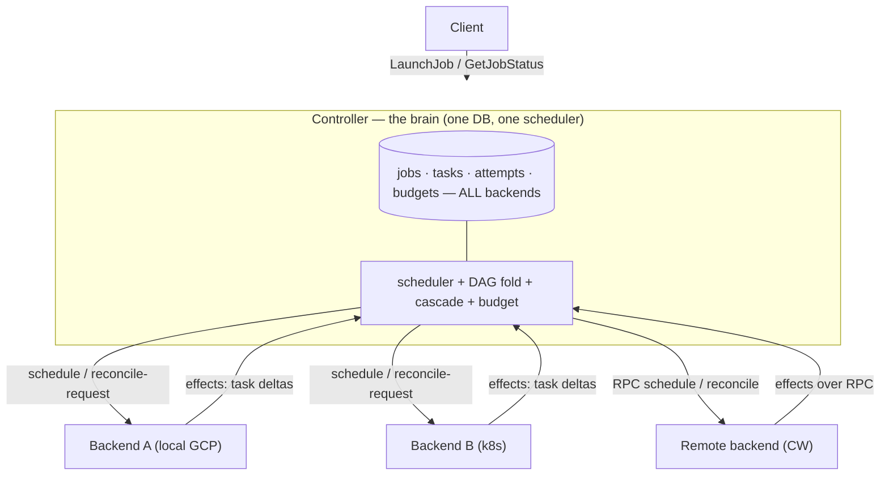
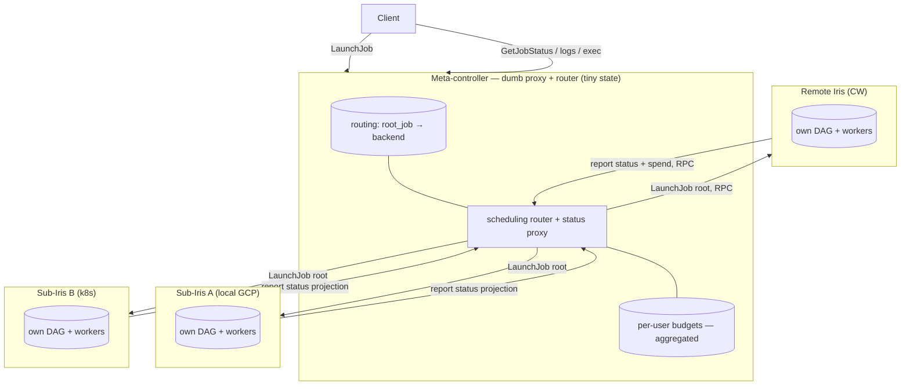
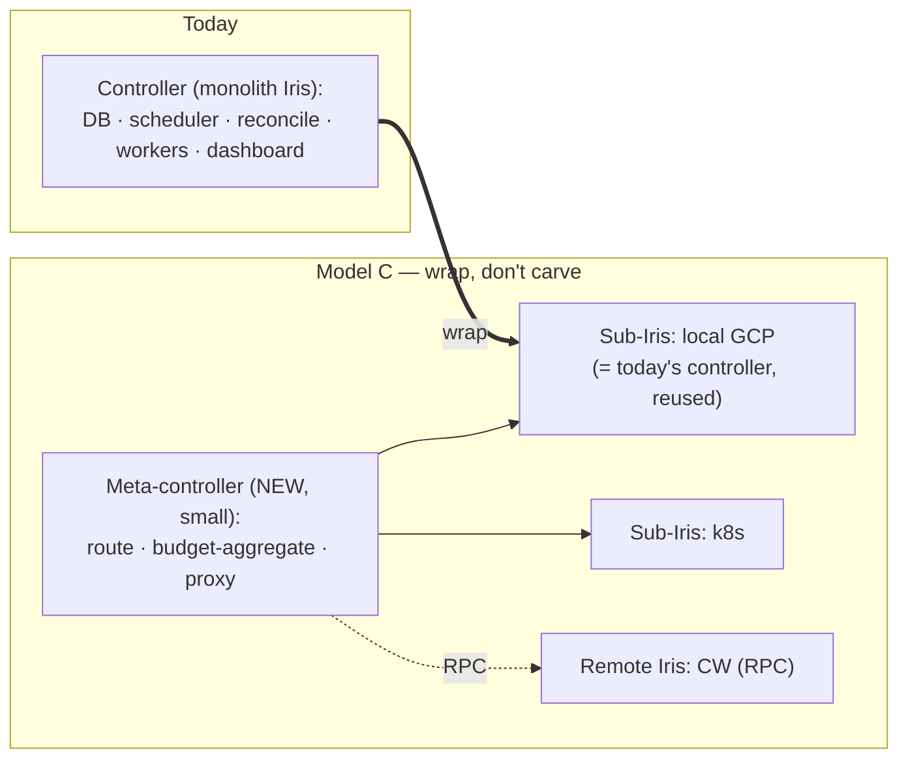
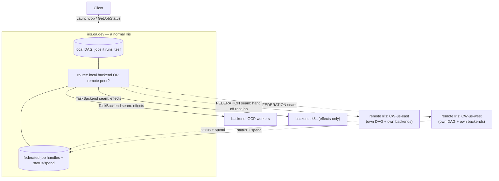

# Iris multi-backend: where does the job DAG live?

The WorkerJobService refactor (make the worker/execution-facing RPC surface backend-owned,
turn the controller into a router) exposed a deeper fork that the phased spec never named:
**where does the job/task DAG live — jobs, tasks, attempts?** Every other decision, and the
fate of the in-flight commit-ownership pivot (#353 / "PR-6"), follows from that one answer.

This doc lays out three points on that spectrum (A / B / C), then a fourth framing (**Model D**)
that dissolves the fork by refusing to treat a remote Iris as a backend at all — local backends
and remote Iris *peers* are kept as separate concepts. It says plainly what each means for #353,
and recommends **Model D**. It is the decision doc; `spec.md` is rewritten to match once we pick.

> **TL;DR.** The A-vs-B agony ("does the backend own the DAG?") only exists because we assumed a
> remote cluster must be a *backend*. Model D drops that: **backends are local execution substrates
> (Model A, one DAG, cheap); remote Iris clusters are federation peers (own DAG, own backends,
> job-handoff), and are not backends.** The expensive distributed-protocol seam lands only at the
> real cross-cluster boundary; the backend contract stops needing to be remote-safe (its single
> biggest simplification); and #353 becomes lower-priority *local* hardening, not a remote blocker.

> **DECIDED — 2026-07-01: Model D.** Job trees are **locked to the parent's peer** (a federated
> root and its whole subtree run on the one peer). #353 is stood down — PR #6805 closed, issue #353
> closed, loom session archived, branch `weaver/iris-mb-6-commit-pivot` + commits preserved for
> salvage. Remaining work re-planned into two independent tracks (see Recommendation → Transition).

## The spectrum: how much control does a backend have?

Today the backend owns almost nothing structural; the controller is the brain. The migration
has been walking rightward one notch at a time. The mini-iris idea is a leap to the far right.

| # | State | Backend owns | Controller owns | Status |
|---|---|---|---|---|
| 1 | **Today** | authors *effects* (runs full reconcile kernel over a shared snapshot) | the DB, the whole DAG, commits everything, all worker state | shipped |
| 2 | **P1–P4** | its *worker state* (store, attrs, register, prune) | the DAG, commits execution, folds cascades | landed (#6788/#6795/#6799/#6792) |
| 3 | **P6 / #353** | execution *apply* pass (its workers' transitions) | the DAG *fold* (recompute/finalize/cascade), still commits | **in flight** |
| 4 | **Mini-iris** | the **entire DAG** for its jobs — schedule, apply, fold, commit, own DB | routing, budgets, a proxy/status view — **no execution state** | proposed |

**#353 is notch 3 — it moves the DAG fold *into* the controller and makes it authoritative.
The mini-iris model is notch 4 — it moves the DAG fold *out* of the controller entirely.
They push in opposite directions.** That is the crux of "do we still land PR-6."

## Model A — controller-owned DAG ("effects-up"), the current spec

The controller's `ControllerDB` holds jobs/tasks/attempts for **every** backend, local and
remote alike. Backends author execution effects; the controller folds the DAG, enforces
budgets, and coordinates cross-backend cascades. Remote = the same, with effects shipped over
RPC into the controller's DAG. #353 is the capstone of this model.



- **Budgets: trivial.** The controller sees every task, so spend = f(active tasks) is a local
  read (`budget.py:43`). No coordination.
- **Cross-backend cascades: real, and the controller handles them.** Routing is per-job with
  **no subtree pinning** — a parent on backend A can have a descendant whose tasks route to B
  (`controller.py:944`). The controller-side fold kills the descendant directly; each owning
  backend tears down on its next reconcile. #353 exists precisely to make this fold
  authoritative over the union.
- **Views: trivial.** One DB; the dashboard and `GetJobStatus` read it directly.
- **Failure isolation: poor.** `backend.reconcile` is called inline on the control loop; a
  hung backend (stuck k8s client, dead-IP worker) freezes the whole control plane. We have
  seen this in production.
- **Remote is heavyweight.** The controller's DB must hold every remote cluster's tasks and
  attempts; every remote effect streams up per tick. The controller is never "dumb."
- **Cost paid to get here:** the painful surgical partition of shared controller state
  (P1–P9), and #353's high-risk N=1 fold.

## Model B — backend-owned DAG ("mini-iris" / job handoff)

Each backend **is a full Iris** that owns the DAG for the jobs routed to it: its own DB,
scheduler, reconcile loop, commit. The meta-controller hands a backend a **root job
description** ("take over this job") and afterward only **routes, gates budgets, and proxies
status** — it holds no task or attempt state.



- **The seam is small and one-directional.** Down: a job spec + a budget grant. Up: a status
  projection + a spend report. No per-tick effect streaming, no worker identities, no DAG rows
  cross the boundary. This is the smallest possible contract.
- **Failure isolation: excellent.** A sub-Iris stalling takes down only its own jobs; the meta
  and the other sub-Irises are untouched. This is the single strongest argument for B.
- **Remote is native and uniform.** A remote backend is *the same object* as a local one — a
  full Iris. "local == remote modulo transport" stops being an aspiration and becomes literally
  true, because there is no in-process special case: every backend is an Iris, some reached by
  loopback, some by connect RPC.
- **Requires whole-job-tree pinning.** A job and all its descendants must land on one backend
  (else the DAG spans backends and B collapses). For the actual use case — route a *run* to
  GCP or to CW-us-east — this is fine and arguably desirable: you do not want one gang-scheduled
  training job split across two physical clusters anyway. It makes the "root job → same backend"
  intent (which the code does **not** enforce today) a first-class routing invariant.
- **Budgets become a distributed protocol — the real cost.** The meta no longer sees tasks, so
  it cannot derive spend. Each sub-Iris reports spend up; the meta enforces the global per-user
  cap via **admission control** (grant/deny a root job, possibly with a reservation) rather than
  a local read. This is genuinely new machinery and the sharpest downside of B.
- **Views: aggregation.** The dashboard and `GetJobStatus` fan out to sub-Irises or read cached
  reported projections. More moving parts than one DB.
- **What it throws away:** most of the P1–P9 *partitioning* of shared controller state — a
  mini-iris owns its workers natively, so "carve the worker tables out of the shared DB by
  backend_id" (P1–P4) is moot — and **all of #353's controller-side fold.**

## Model C — "wrap, don't carve": the pragmatic transition to B

The insight that makes B cheap: **today's controller already *is* an Iris.** So do not
decompose the monolith into backend-shaped stores (the hard P5–P9 surgery). Instead:

1. **Freeze today's controller as the first sub-Iris** — the local/default backend. It barely
   changes; it keeps its DB, scheduler, reconcile, commit.
2. **Add a thin meta-controller on top** — routing map + budget aggregation + status/exec proxy.
   This is *new, small* code, not refactored controller internals. It is the only genuinely new
   component.
3. **Add further backends as separate Iris instances** — remote CW as a remote Iris. **k8s is
   the exception (codex):** today it is not an Iris at all — it is a `CLUSTER_VIEW` effects-only
   backend that polls pods and returns effects (`k8s/tasks.py`), with no DAG, scheduler, or
   worker store. So B's "every backend is an Iris" uniformity is *false for k8s*: either k8s
   becomes a degenerate sub-Iris owning a trivial DAG, or it stays a Model-A effects-only island
   *under* the meta (the meta owns k8s's DAG, everything else is a real sub-Iris). This is a real
   design decision, not incidental — see open question 6.



C is B's topology reached by **reuse** instead of surgery. The physical split (own DB file per
sub-Iris, separate process) is forced only where it is already unavoidable — a remote cluster —
and the local sub-Iris can keep sharing the box until there is a reason not to. The one
constraint C must respect is the SQLite single-writer rule: co-located sub-Irises either share
one write-serialization point (one process, one write lock) or take separate DB files; a shared
*file* with two writer processes is the `SQLITE_BUSY` pathology and is off the table.

## Model D — federation ≠ backend: local backends + remote Iris peers

A/B/C all share one buried premise: **a remote Iris cluster is a kind of backend**, reached over
RPC. That premise *is* the impedance mismatch. A backend returns per-tick *effects* the controller
commits — natural for a local substrate you drive. A remote Iris is a whole control plane that owns
its own DAG — so "make it return effects" is the heavyweight Model-A-remote, and "make everything a
mini-iris" (B) over-generalizes the expensive seam onto local k8s too. Model D drops the premise:
**an Iris has two distinct kinds of downstream, and we stop forcing them into one abstraction.**

- **Backends** — local execution substrates (GCP workers, k8s) driven through the `TaskBackend`
  seam. Tasks on a backend live in *this* Iris's DAG; the backend authors effects, the controller
  folds. This is Model A, correct and cheap for the local case.
- **Remote Iris peers** — other Iris clusters this Iris *federates whole jobs to*. A federated root
  job is handed off via a `LaunchJob`-style RPC; the peer runs the entire tree on its own DAG + its
  own backends and reports status + spend back. The federating Iris tracks it as a *federated-job
  handle*, not as tasks in its DAG.

There is no separate "meta-controller" class — **federation is a feature of Iris.** iris.oa.dev is
just an Iris that has some local backends and several remote Iris peers.



**Why this is the clean cut:**

1. **It matches what the concepts actually are.** A backend shares your DAG; a peer owns its own.
   The entire "does the backend own the DAG?" agony (A vs B) was an artifact of pretending these
   were one thing. Two honest seams beat one leaky abstraction — even though it costs us the
   "local == remote modulo transport" north star (that aspiration was the *source* of the mismatch).
2. **The expensive seam lands only where it is unavoidable.** Every distributed-protocol cost codex
   flagged — exactly-once handoff, cross-seam cancel, budget admission, auth delegation, two-layer
   recovery — is a *federation* cost, paid at a genuine cross-cluster boundary where you would pay
   it anyway. Local k8s+GCP multi-backend stays Model A: one DAG, trivial budget, direct queries, no
   protocol. B put those costs on *every* backend; D puts them only on peers.
3. **The backend-contract project shrinks and de-risks.** Its single hardest driver was "the backend
   must be RPC-safe because remote is a backend" — which forced the separate-DB-file split (P9), the
   "controller never reads worker state so it can be RPC'd," the `RemoteBackendWorkerStore`. If
   remote is federation, none of that is a backend concern. `TaskBackend` stays a local, in-process,
   shared-DB seam. P1–P8's local hygiene (store boundary, per-backend worker ownership, the
   WorkerJobService split) still stands; the remote-driven contortions drop out.
4. **k8s stays what it is** — an effects-only backend with no DAG. No degenerate mini-iris needed.

**The real costs of D (honest):**

- **Two seams to build and maintain**, deliberately un-unified: effects vs handoff, two routing
  modes, two status-projection shapes. Real duplication; we give up the one-seam elegance on purpose.
- **The federation feature is genuinely new** — federated-job registry + status sync, cross-peer
  cancel/preemption, budget admission across peers, auth/trust to peers, restart re-attach.
  Everything codex listed for "Model B's meta" lives here — but *scoped to federation*, not smeared
  across all backends.
- **A federated job needs a local proxy handle** so `GetJobStatus`/dashboard still show it — a new
  record type + a status-sync loop, distinct from the DAG.
- **The router picks among two target kinds** (backend vs peer) under one constraint language.

Model D is essentially **Model A locally + federation for remote, with "federation" firmly *not* a
backend.** It keeps the cheap seam where it works and quarantines the expensive seam to where it is
real.

**The sharp edge of D — and why it is mostly self-enforcing (DECIDED: lock the tree to the peer).**
Codex's biggest risk was federated *child* submission: a single job's tasks never split across
backends, but a job *tree* can — a child routes independently of its parent (`service.py:1241`,
`ops/job.py:145`). The decision is to **lock a federated root and its whole subtree to the one
peer** (Model B's whole-tree pinning, but only at the federation boundary). The key realization is
that **this happens automatically for the common case**: a running task's Iris client connects to
`job_info.controller_address` — the controller that *launched it*, injected per-job into the task's
environment (`client/client.py:1190-1197`, `get_iris_ctx`). A task running on a peer was launched
by the peer's controller, so when it spawns a child, the child's `LaunchJob` goes to the *peer* and
is materialized in the peer's DAG. The federating Iris never sees it. So child jobs inherit their
parent's peer **by construction** — the peer is just a normal Iris to the jobs running on it.

Federation therefore only has to (a) handle the *root* handoff, and (b) refuse the two ways a child
could escape the peer: never re-point a child's `controller_address` back at the federating Iris,
and reject/ignore a cross-cluster routing constraint on a non-root job. An out-of-band child submit
(a client directly submitting a job with a federated parent id to the top-level Iris — the uncommon
path) is routed to the parent's peer via the federated-job handle, or rejected. The capability D
gives up is a *single tree deliberately split across a local backend and a remote cluster* — which
the "you handed the root to the peer" model makes incoherent anyway, and which no current workload
needs.

**The federated-job handle (minimum, codex).** For the federating Iris to show a handed-off job in
`GetJobStatus`/dashboard without mirroring remote tasks (which would reintroduce the DAG coupling),
it stores a handle, not a DAG subtree: `{local_federated_id, peer_id, remote_job_id, submit
idempotency-key/request-digest, owner/auth principal, cached JobStatus summary+counts, spend
snapshot, timestamps, terminal error, sync cursor/revision, cancel intent+version}`. `GetJobStatus`
today assumes a local job row + local task summary (`service.py:1465`), so D adds a branch (or a
separate projection) for federated ids. **Never mirror remote task rows locally** — that is the one
move that would drag the DAG coupling back in.

## So: do we still land PR-6 / #353? (codex-corrected; revised for Model D)

**Under Model A: yes, it is the capstone.** Under Models B and C: **partly throwaway — the
expensive, risky half is; the cleanup half survives.** Being precise (codex):

- **Dies under B/C:** the *controller-side union fold* — recompute/finalize/child-cascade over
  the union of all backends' apply results (`batches.py:340,82`), the controller commit of
  (remote) effects, and cross-backend child-cascade handling in `_commit_tick`
  (`controller.py:1120`). This is exactly what #353's commit 6a built, and it directly conflicts
  with a meta that holds no jobs/tasks/attempts.
- **Survives, inside each sub-Iris:** the per-task transition code, the overlay/effects types,
  the apply-vs-fold decomposition itself, the tests, and any refactor that makes `ReconcileState`
  cleaner *within one Iris*. A mini-iris still folds its own DAG — it just does the whole fold
  locally instead of the controller doing it over a union.

So #353 is not a *stepping stone toward* mini-iris (it pushes DAG ownership the wrong way, into
the controller), but neither is it 100% waste — the reconcile-kernel cleanup transfers. The
**controller-union-fold** is the throwaway part, and it is precisely the hard, high-risk part
(the N=1 parity gate).

**Under Model D: #353 becomes a local robustness cleanup, decoupled from remote.** Its two
original drivers were (i) local multi-backend fold correctness and (ii) surviving the remote
separate-DB split. Under D, (ii) evaporates: remote is federation, not a backend, so nothing about
the backend fold has to be remote-safe. (i) remains real, but is narrower than "works by luck"
(codex): a *single* job's tasks do **not** split across backends — routing stamps one backend onto
the job and all its tasks (`meta_scheduler.py:93`, `writes.py:208`). What *can* span backends is a
job **tree** — a child job routes independently of its parent (`service.py:1241`, `ops/job.py:145`),
so a parent on GCP can have a child on k8s. The current fold is correct (the reconcile snapshot
closes over the descendant DAG, `loader.py:255`, and cascades run over that closed set,
`batches.py:82,339`); the brittleness is that each backend authors effects from its *own* pre-commit
snapshot and the controller commits them serially (`controller.py:812,1120`). #353 hardens exactly
that. So under D it is neither capstone nor throwaway — a genuine but **lower-priority** cleanup of
the *local* cross-backend-tree fold, no longer blocking remote.

Concretely: **#353 stays paused** in every live model. Under A it is the capstone (resume when we
commit to A). Under B/C the union fold dies (salvage the kernel cleanup, drop the fold). Under D it
is lower-priority local hardening (resume only when local multi-backend correctness — not remote —
is the priority). In none of the three does it need to burn *now*, and in two of three the union
fold is not what ships. Pausing was the correct hedge; the decision is which of A / B-C / D we build.

## What each model costs us from here

| | Model A (current spec) | Model B / C (mini-iris) |
|---|---|---|
| **Controller role** | the brain (schedule + DAG + budget + cascade) | dumb proxy + router + budget gate |
| **DAG ownership** | controller, all backends | each backend, its own jobs |
| **Contract per tick** | effects (task deltas) up, requests down | job spec down, status/spend up (not per-tick) |
| **Budgets** | trivial (local read) | distributed admission control (**new**) |
| **Cross-backend job trees** | supported (controller cascades) | disallowed (whole-tree pinning) |
| **Failure isolation** | poor (inline reconcile stalls control loop) | excellent (per-Iris blast radius) |
| **Remote** | heavyweight (controller holds remote DAG) | native (remote = another Iris) |
| **Views** | one DB, direct | aggregate / proxy reported projections |
| **#353 / PR-6** | capstone — keep | throwaway — pause |
| **P1–P9 partition** | the plan | mostly moot; replaced by "wrap + meta-layer" |
| **New code** | fold + store surgery | a small meta-controller |
| **Migration risk** | high (surgical state partition) | moderate (reuse monolith, build meta) |

## What Model B/C understates (codex)

The cost table above names the big rocks; codex flags that the "meta stays small" premise is the
load-bearing bet, and these costs *relocate into the meta* rather than disappearing:

- **Exactly-once root handoff.** The meta must durably record the route *and* submit to the
  sub-Iris with no duplicate/missing job if either side crashes mid-handoff. Today submit is one
  SQLite transaction with a recheck (`service.py:1255`); B replaces it with a two-party protocol.
- **Whole-tree pinning has an enforcement site.** Child submit today validates the parent's
  presence/state but does **not** inherit its backend (`service.py:1241`); B must force every
  child to the parent's backend at that seam, and reject a child that asks for another.
- **Cross-backend cancel becomes a distributed protocol.** Today cancel loads and kills an entire
  subtree in one DB transaction (`ops/job.py:284`). Under B it must be routed, idempotent,
  observable, and retryable across the meta seam — the same for kick/preemption cascades.
- **Budget is admission + fairness, not just spend.** The controller enforces submit-time
  max-band and active-task caps (`service.py:1171,1217`) and threads spend at scheduling time
  (`controller.py:951`). B's meta needs a real admission/reservation protocol, not just a spend
  report — this is bigger than the table's "distributed budget admission" line implies.
- **Recovery is now two-layer.** Meta route/budget recovery *plus* each sub-Iris's own recovery,
  and re-attach to still-running sub-Irises after a meta restart.
- **Auth delegation.** Authz is controller-local today (`service.py:1152`); a proxy/redirect
  router needs identity propagation and a sub-Iris trust policy.

None of these is fatal, but together they are the meta-controller — and they are why "wrap, don't
carve" is cheaper than carving *only if* the meta genuinely stays a thin router. That is the
single highest-risk assumption in this whole doc.

## Recommendation

**Build Model D: keep the backend seam local and Model-A-shaped, add federation as a distinct,
non-backend concept for remote Iris peers.** D is not a fourth point on the A↔B line; it dissolves
the line. The A-vs-B fight was over who owns the DAG *because we assumed remote had to be a
backend*. Once remote is a federation peer instead:

- **Local multi-backend is Model A** — one authoritative DAG, trivial budget reads, exact
  cross-backend cascades, direct dashboard queries. Cheap where it works.
- **Remote is federation** — the distributed-protocol cost is paid only at the real cross-cluster
  boundary, not smeared across local k8s.
- **The backend project de-risks** — no "must be RPC-safe" pressure, so no P9 DB-file split, no
  `RemoteBackendWorkerStore`. P1–P8 becomes pure local hygiene + the WorkerJobService split.
- **#353 is decoupled from remote** — it drops to lower-priority local hardening (above).

Two things to still weigh honestly:

1. **We give up the one-seam north star on purpose.** "local == remote modulo transport" was the
   original elegance; D says it was a false economy that created the mismatch. Accepting two seams
   (effects + federation) is the core trade — cleaner concepts, more surface.
2. **Federation is a real new project**, with all the distributed-protocol costs codex listed —
   just quarantined to the peer boundary. The near-term question is *when* remote is actually
   needed; until then, D means "finish the local backend hygiene (P1–P8, minus the remote-safety
   contortions), optionally make `backend.reconcile` bounded/concurrent for isolation, and design
   federation as its own thing when a real remote cluster is on the table."

Net: D lets us stop agonizing over DAG ownership, keep the cheap local seam, shrink the backend
refactor, and treat remote as the genuinely separate problem it is. The immediate consequence is
that **the backend contract no longer has to be remote-safe** — which is the single biggest
simplification on the table.

## Transition (the work re-planned into two independent tracks)

**Track 1 — local backend hygiene (continue, lighter).** Pure local cleanups, no remote-safety
pressure: **P5** (WorkerJobService — backend owns endpoints + the on-demand RPC surface, controller
routes), **P7** (`BackendWorkerReport` published projection), **P8** (autoscaler single-writer).
**#353 (P6) is stood down** — under D it is lower-priority *local* cross-backend-tree fold hardening
that does not gate anything; its branch/commits are preserved to salvage the reconcile-kernel
cleanup opportunistically. **P9 (remote-as-a-backend) is deleted** — there is no per-backend DB-file
split and no `RemoteBackendWorkerStore` in the backend contract.

**Track 2 — federation (new, greenfield, later).** Designed on its own when a real remote cluster
is on the table. Shape: a `remote Iris peer` concept + root-job handoff (exactly-once, idempotent);
the federated-job handle (fields above — *never* mirror remote task rows locally); status/spend sync
loop; cross-peer cancel routing; budget admission across peers; peer auth/trust. The whole-subtree
lock (above) is largely free via `controller_address` inheritance, so the machinery is genuinely
smaller than "make remote a backend" would have been.

The two tracks share nothing but the router (which grows a second target kind: peer vs backend), so
Track 1 proceeds now and Track 2 waits for real remote demand.

## Open questions (for codex + discussion)

1. **Budget admission protocol.** Grant-per-root-job with a spend reservation, or report-and-throttle
   after the fact? What is the overspend bound while a sub-Iris's spend report is in flight?
2. **Whole-tree pinning enforcement.** Where is it enforced (submit-time routing of the root, and
   a hard rejection of a child that requests a different backend)? Any existing job that legitimately
   wants to span clusters?
3. **On-demand RPC to a remote sub-Iris: proxy or redirect?** Does exec/profile/logs proxy through
   the meta (uniform auth, one endpoint, meta on the data path) or redirect the client to the
   sub-Iris (meta off the hot path, client needs reach + auth)? This is the load-bearing shape of
   the meta's router and the WorkerJobService boundary.
4. **Meta-controller state durability.** Routing map + budgets must survive a meta restart and
   re-attach to still-running sub-Irises. Is that a tiny dedicated store, or does the meta rehydrate
   by querying each sub-Iris on boot?
5. **Is Model C's local sub-Iris ever worth splitting to its own DB file, or does it stay the
   shared-box monolith forever?** (i.e. is there a real in-process multi-sub-Iris case, or is the
   only split remote?)
6. **k8s as a sub-Iris.** k8s has no worker store and only authors effects. Is it a degenerate
   sub-Iris (owns a trivial DAG), or does it stay an effects-only backend under the meta — a small
   Model-A island inside Model B? (codex: load-bearing, not incidental.)
7. **The real decision pivot.** Is *remote* a first-class goal in the near term (→ B pays off; A's
   remote story is genuinely heavy) — or is the near-term need failure isolation + cleaner local
   layering (→ stay A, make `backend.reconcile` bounded-timeout + concurrent for isolation, keep
   #353)? The A-with-concurrent-reconcile option should be costed before committing to B.
```

