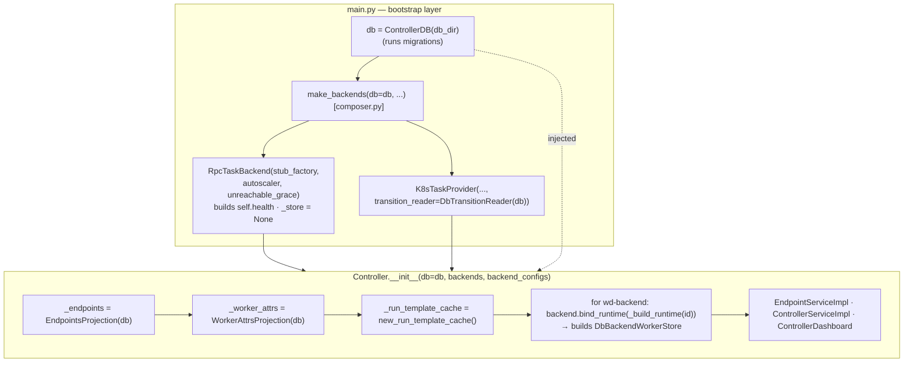
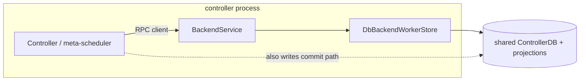
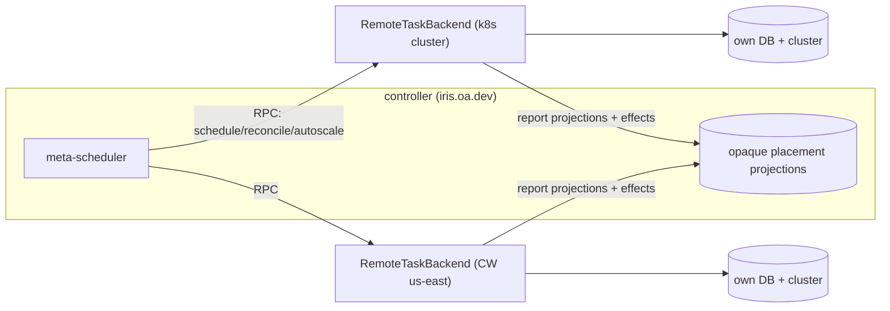

# Backend service topology & construction ownership — options

Two questions surfaced from the `_store: BackendWorkerStore | None` two-phase-init
smell in `RpcTaskBackend`:

1. **Service topology (Axis A).** Is there a world where a backend runs its *own*
   RPC service instead of being invoked in-process inside the controller's connect
   server (the one that also serves the dashboard)? What would that look like?
2. **Construction ownership (Axis B).** Can the bootstrap layer construct the DB and
   the projections (and the store) instead of the controller, so the store is always
   present and the two-phase `bind_runtime` disappears?

This doc establishes the current shape, walks both options with their ramifications,
and recommends a path. The two axes are coupled — B is a prerequisite for the clean
version of A — so they are analysed together. (Reviewed by codex; its corrections on
the ownership wording, the `TaskBackend` vs `BackendWorkerStore` seam, the reopen-hook
order, and the k8s carve-out are folded in below.)

---

## 0. Current shape (the baseline both options modify)

### Construction order

The DB is **already** built by the bootstrap layer (`main.py:146`) and injected into
both `make_backends` and `Controller` — `composer.py` does not build it. The
controller builds the *projections* and, in a second phase, the *store*.



The store's ingredients are split across **two owners**: the backend owns `health`
and `autoscale`; the controller owns `db` + `endpoints` + `worker_attrs` +
`run_template_cache`. They only meet at `bind_runtime` (`controller.py:380-382`),
which is the entire reason `_store` is `Optional` and `register_worker` opens with
an `assert self._store is not None`.

Note the **asymmetry**: the k8s backend already receives a db-derived read surface
(`DbTransitionReader(db)`) from the composition layer at construction
(`composer.py:201`). Only the rpc backend's store is deferred.

### Service topology

One uvicorn server. A worker's `RegisterWorker` lands on the controller's
`ControllerService` and calls into the backend as an ordinary Python method.

```mermaid
flowchart LR
    Worker -->|RegisterWorker RPC| Server
    subgraph Server["single uvicorn server (controller.py:_server)"]
        Dash["ControllerDashboard<br/>(auth + Vue static assets)"]
        CS["ControllerServiceImpl"]
        ES["EndpointServiceImpl"]
        Dash --> CS
        Dash --> ES
    end
    CS -->|in-process call| Backend["backend.register_worker()"]
    Backend --> Store["DbBackendWorkerStore"]
    Store --> DB[("ControllerDB + projections")]
    CS -. backend.status() .-> Backend
```

The backend has **no network surface**. `schedule` / `reconcile` / `autoscale` /
`register_worker` / `status` are in-process method calls passing rich Python objects
(`TransitionSnapshot`, `ControlSnapshot`, `Assignment` lists). The controller-facing
seam is `TaskBackend`; `BackendWorkerStore` is consumed *inside* a worker-daemon
backend (`rpc/backend.py:216`), not by the controller.

### The load-bearing constraint

`EndpointsProjection` and `WorkerAttrsProjection` are **write-through in-memory caches
over DB tables**. They are mutated by the controller's reconcile/commit path
(`reconcile/commit.py`), `ops/task.py`, `ops/job.py`, the `EndpointService`, the
`pruner`, **and** the backend store (`register_worker` → `register_worker_row`,
`reap_workers` → `fail_workers`). Every one of these must hold the **same instance**,
or the caches diverge from each other and from SQLite. Today they do: the controller
creates one of each and threads it everywhere. They also register their own reopen
hooks in their constructors (`endpoints.py:101`, `worker_attrs.py:69`) so they
rehydrate on checkpoint restore. This single fact drives both axes.

---

## 1. Axis B — who constructs the DB + projections + store

### B0 — current (controller builds projections + store; two-phase bind)

`_store: BackendWorkerStore | None`, `bind_runtime`, the `assert`. Already described.

### B1 — bootstrap layer assembles all ingredients; store is a constructor arg

`main.py` already builds `db` and injects it; have it build `endpoints` /
`worker_attrs` / `run_template_cache` too and pass them into `make_backends`. The rpc
backend builds its `health` and its `_store` **in `__init__`** from the injected
ingredients; the same projection instances are then handed to `Controller`. (This is
an ownership move *within the bootstrap layer* — the projections can be built in
`main.py` beside `db`, or in a small `make_projections(db)` in `composer.py`. Either
keeps the bootstrap layer as owner; it is a bigger move than "the composer already
builds `db`," because today it does not.)

```mermaid
sequenceDiagram
    participant Main as main.py (bootstrap)
    participant Back as RpcTaskBackend.__init__
    participant Ctrl as Controller.__init__
    Main->>Main: db = ControllerDB(...)
    Main->>Main: endpoints, worker_attrs, run_template_cache = projections(db)
    Main->>Back: RpcTaskBackend(db, endpoints, worker_attrs,<br/>run_template_cache, owns_scale_group, autoscaler, defaults)
    Back->>Back: self.health = WorkerHealthTracker(grace)
    Back->>Back: self._store = DbBackendWorkerStore(...)   ← non-Optional
    Main->>Ctrl: Controller(db, backends, endpoints, worker_attrs, run_template_cache)
    Note over Ctrl: no bind_runtime, no _build_runtime;<br/>still registers the liveness-reseed hook (order matters)
```

**Feasibility — all green:**

- `owns_scale_group(sg)` is `backend_id_for_scale_group(sg) == backend_id`, derived
  purely from `backend_configs`, which the bootstrap layer already has via
  `resolve_backends`. Computable up front. ✓
- `defaults` = `config.user_budget_defaults`; available in the bootstrap layer. ✓
- The autoscaler is already built in `make_backend` **before** the backend and
  `restore_from_db(db)`-ed — so the store's `autoscale` ingredient already exists. ✓
- Migrations run inside `ControllerDB.__init__` (`main.py:146`), before
  `make_backends` (`:175`), so projections built up front load post-migration state. ✓
- `health` stays backend-private — the backend builds it in `__init__` and feeds its
  own store. The controller never sees it. ✓

**Ramifications:**

- **Removes the Optional and the second phase.** `_store` is always set; `assert`,
  `bind_runtime`, and `_build_runtime` go away, and `register_worker` loses its guard.
  The liveness **reseed** on checkpoint-reopen stays (`controller.py:388`) — only the
  **rebind** disappears. B1 must keep the reopen-hook *order*: projections rehydrate
  first (their own hooks, registered in their constructors), then backend liveness
  reseeds from the reopened DB. Building projections before the controller registers
  its seed hook preserves that order naturally.
- **Makes rpc and k8s construction more symmetric** — both receive a db-derived
  surface from the bootstrap layer. But the `DbTransitionReader` precedent
  (`composer.py:201`, `transition_reader.py:47`) is **weaker** than the store: it is a
  *stateless read surface*, whereas the store injects write-through projections and
  mutates worker rows, endpoints, attrs, liveness, and autoscaler state
  (`backend_store.py:125,227`). It is a direction-of-travel precedent, not an
  equivalent one.
- **Relocates projection ownership** from the controller to the bootstrap layer,
  consistent with where the *biggest* shared singleton — the DB itself — already lives.
- **Churn — more than constructor fan-out.** `TaskBackend` loses `bind_runtime`;
  `RpcTaskBackend` and the k8s no-op methods change; and `local_cluster.py:247`, the
  controller test fakes (`conftest.py:259`), and the direct-controller tests all
  reconstruct. Mechanical but broad.

**Required B1 invariants (state them in the PR):**

- exactly one `EndpointsProjection` and one `WorkerAttrsProjection`, shared by the
  `EndpointService`, pruner, controller commit path, and every backend store;
- those projections register their reopen hooks **before** the controller registers
  the liveness-reseed hook (rehydrate-then-reseed);
- `owns_scale_group` keeps unmapped scale groups routing to `DEFAULT_BACKEND_ID`
  (`controller.py:backend_id_for_scale_group`).

### B2 — per-backend DB (the asymptote, not for local)

Each backend gets its **own** `ControllerDB` and projections — no shared state. This
is the natural state model for a *remote* backend (it owns its cluster's state and
reports projections back). For a **local** backend it is over-engineered: the
controller's job/task tables and the backend's worker tables live in one SQLite file
and the commit path writes them transactionally together. **B2 is the remote (P7)
model; out of scope for local.**

---

## 2. Axis A — does a backend run its own service

### A0 — current (in-process method calls)

No backend network surface. Described above.

### A1 — backend-hosted service (uniform local == remote transport)

Each backend exposes a `BackendService` connect endpoint; the controller talks to it
through an RPC client **even co-located** (loopback / in-process channel), or in a
separate process.



**Ramifications:**

- **The wire is cheap; the storage is the cost.** Worker state does *not* cross the
  controller↔backend boundary — `ScheduleRequest` carries "never worker data,"
  `ReconcileRequest` is "ignored" by worker-daemon backends, `ReconcileResult` carries
  "no worker identity." Per tick the boundary carries only routed pending tasks +
  budgets (in) and `effects` + placements + `autoscaler_state` (out) — task-delta-bounded,
  not worker-bounded. So A1's real cost is not serialization volume; it is that a
  separate process needs its own DB, and the DB split is the hard part.
- **Sharing one SQLite file (disjoint tables) does not work cleanly.** WAL admits
  concurrent readers but **one writer at a time, database-wide** — disjoint tables grant
  no per-table write concurrency, so two writer processes contend for the single write
  lock (`SQLITE_BUSY` / `busy_timeout`; the batch-load "database is locked" pathology).
  The current design dodges this with essentially one writer (the control thread).
  Separately, the in-memory write-through projections are per-process, so a shared file
  leaves the controller's and backend's caches incoherent unless caches are partitioned
  strictly by table ownership — and even then the write-lock contention remains.
- **The clean DB split is a separate file + reported projections — i.e. B2.** Each
  process is the sole writer of its own file (no contention) and owns its caches
  (coherent); the backend reports an opaque projection back over RPC (capacity for
  routing + a periodically-refreshed per-worker status for the dashboard), small and
  low-frequency. So a worker-daemon BackendService is only coherent paired with B2 —
  and B2-done-right is the remote model, which a co-located backend gains nothing from
  over staying in-process (A0).
- **The k8s backend is the exception — A1 there needs no B2.** k8s has no worker store
  and no liveness; it only *authors effects* from a read surface
  (`k8s/tasks.py:1457,1511`) and the controller commits them. A k8s sidecar can expose
  `TaskBackend.reconcile` over RPC and return effects, with the controller still owning
  commit + projections. So out-of-process k8s is a real, cheap middle path — **not** a
  stepping stone that needs the full per-backend-DB split.
- **Failure isolation is the strongest argument against a blanket A0.** The control
  loop calls `backend.reconcile` **inline**, so a hung backend — a stuck k8s client, a
  dead-IP-worker communication stall — freezes the whole control plane. We have already
  seen dead-IP-hung workers force every reconcile round to its timeout. A
  separate-process k8s backend contains that blast radius, and (per the point above)
  needs no B2.
- **Auth + dashboard surface multiplies.** A backend service needs its own auth
  boundary, and the dashboard must fan out to per-backend status (or consume a pushed
  status cache — exactly the published-`BackendStatus` projection planned as P4).

### A2 — remote backend = separate process/cluster (the P7 roadmap)

The backend runs in another process/cluster; controller ↔ backend is connect RPC
(relay + agent, already sketched). The remote backend owns its own state
(B2-for-remote), polls its own cluster, and reports effects + an opaque placement
projection (`backend_id, worker_id, address, lease`) back. This is the actual goal
(`iris.oa.dev` fronting k8s + GCP + multiple CW clusters) and is already on the P7
roadmap. The service boundary here is unavoidable and correct.



---

## 3. Synthesis — the axes are coupled, and uniformity is a Protocol-seam concern

The intuition behind A1 is "make local and remote the same so we don't write two code
paths." **That uniformity lives at a Protocol seam, not the transport — and the
controller-facing seam is already `TaskBackend`, not `BackendWorkerStore`.** The
controller only ever calls `TaskBackend`; `BackendWorkerStore` normalizes worker-state
access *inside* a worker-daemon backend. So there are two distinct normalization
points, and neither needs a transport boundary around a local shared-DB backend:

- A **remote backend** is just another `TaskBackend` impl (a `RemoteTaskBackend`
  speaking connect RPC) — the controller cannot tell it apart from a local one.
- Within a **worker-daemon** backend, worker-*state* access is normalized behind
  `BackendWorkerStore`: in-process `DbBackendWorkerStore` today, and a **planned** (P7)
  RPC-client impl for a remote worker-daemon cluster. (`RemoteBackendWorkerStore` does
  not exist in code yet — it is a design point.)

Either way, "local == remote modulo transport" comes from swapping an impl behind a
Protocol, **not** from forcing a local backend to pay RPC for shared in-process state.

| | keep in-process (A0) | host a service (A1/A2) |
|---|---|---|
| **shared DB (B0/B1)** | **worker-daemon — recommended** | worker-daemon: incoherent · **k8s: viable (effects-only)** |
| **own DB (B2)** | pointless locally | **remote backends (P7) — recommended** |

---

## 4. Recommendation

1. **Adopt B1 — move projection + store construction into the bootstrap layer.**
   `main.py` already builds `db` and injects it; have it build the projections too and
   pass them into `make_backends`, so the rpc backend builds `health` + `_store` in
   `__init__`. Removes the `Optional`, deletes `bind_runtime` / `_build_runtime`, drops
   the `register_worker` guard. Honour the three invariants in §1 and call out the
   protocol/test churn. A clean, self-contained refactor — do it independent of A.

2. **Keep worker-daemon backends in-process (A0).** Their state is the shared DB +
   projections; an RPC boundary in front of that is strictly worse than today
   (serialization + retained coupling). The local==remote uniformity is delivered by
   swapping a `TaskBackend` / `BackendWorkerStore` impl, not by a transport boundary.

3. **Seriously consider running the k8s backend out-of-process (effects-over-RPC),
   independent of remote.** It is the one backend where inline `reconcile` can stall the
   whole control loop, and — being effects-only with no worker store — a sidecar needs
   **no** per-backend DB: it speaks `TaskBackend.reconcile` over RPC and the controller
   keeps commit + projections. The cheapest failure-isolation win, and it does not wait
   on the full remote design.

4. **Remote backends keep the service boundary (the existing P7 roadmap) with their own
   state.** A `RemoteTaskBackend` (and, for a remote worker-daemon cluster, a *planned*
   RPC-client `BackendWorkerStore` impl) slots behind the same seams B1 cleans up.

### Open questions for review

- **Where the projections get built** — `main.py` beside `db`, or a `make_projections(db)`
  in `composer.py`? Both keep the bootstrap layer as owner; pick by what reads cleaner.
- **k8s out-of-process now or later** — is the reconcile-loop-stall risk pressing enough
  to pull the k8s sidecar (rec 3) forward, ahead of the remote work, or fold it into P7?
- **Per-backend DB (B2) for a co-located backend** — ever needed locally, or strictly
  the remote end-state?
