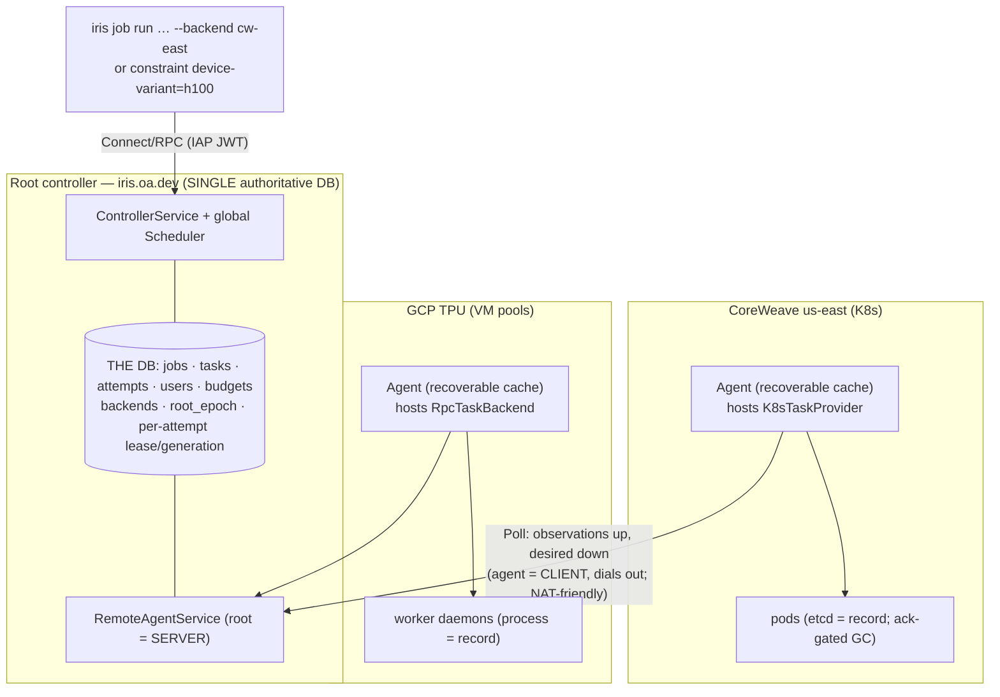
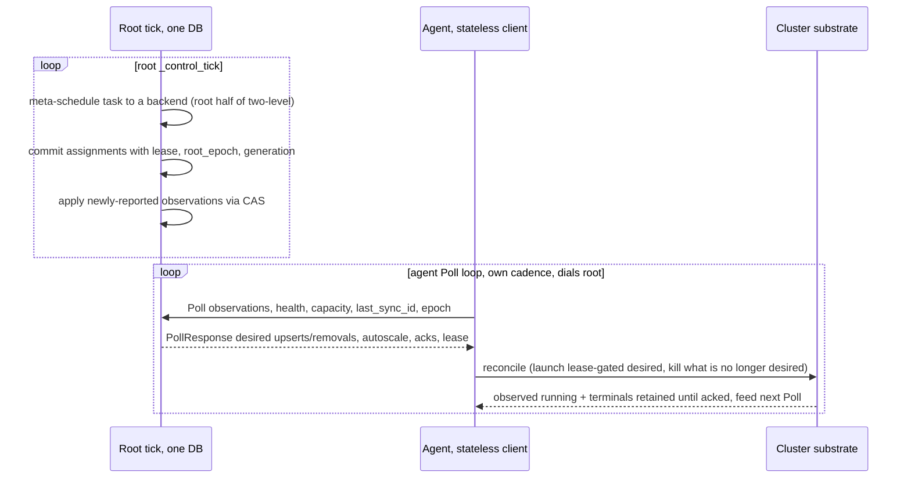

# Iris Multi-Backend Mode

_Why are we doing this? What's the benefit?_

One Iris controller drives one cluster today. We want `iris.oa.dev` to be a single front door for many
clusters — GCP TPU pools, multiple CoreWeave/Kubernetes GPU clusters, manual/bare-metal — with one job
namespace, one dashboard, and a top-level scheduler that routes work and queues when the target is
full. This unblocks serving a heterogeneous accelerator fleet behind one SDK/CLI, cross-cluster
capacity routing ("needs an H100, send it wherever one is free, else wait"), and per-backend fault
isolation so a single cluster's partition or restart never takes down the federation.

This is a load-bearing design (multi-week, new service + persistent-shape changes, crosses the
controller/scheduler/backend seams), so it goes through the design-doc process. The full background —
prior art, the current seam, the 8-round `codex` review log, and the alternatives we rejected — lives
in [`research.md`](./research.md); the concrete contracts (proto, config schema, DB migration, file
layout, auth) live in [`spec.md`](./spec.md).

## Challenges

The hard part is **not** "tunnel commands to a remote cluster" — it's doing that without a distributed
database and without ever double-running a task.

- **Avoiding a distributed DB.** The naive model (each backend is a full controller with its own DB +
  scheduler) buys fault isolation but also split-brain, N+1 databases to back up / migrate /
  version-skew, and a backend-DB-loss failure mode. We rejected it (Option S, `research.md`).
- **Safe re-placement after a partition.** A running pod/process keeps running over a dead link. The
  root's belief goes stale; re-placing a task before the old execution is *provably* dead double-runs
  it. This is the one irreducible danger and it drives the whole safety design.
- **The control wire.** We have been burned repeatedly by imperative start/stop RPCs drifting from
  reality; the lesson — *reconcile, don't command* — has to hold at the new cross-cluster boundary too.
- **Two-level scheduling** that doesn't drag every worker in every cluster into the root DB.

## Costs / Risks

- Real churn: a prerequisite refactor (split `backends/` · `platforms/` · `setup/`), a new per-cluster
  **agent** process, and a new RPC service.
- The root meta-scheduler becomes a real (if thin) component, not "the existing scheduler with a
  backend attribute."
- A new **authoritative-vs-recoverable invariant** that must be enforced as a hard rule, not a
  convention (below).
- No immediate single-cluster user-visible improvement, and single-cluster behavior must stay
  byte-for-byte unchanged through every phase.

## Design

**The principle: one authoritative DB at the root; the per-cluster agent holds no authoritative state —
only a recoverable cache.** (Naming: the tiers are **controller / agent / worker**. "Agent" replaces
the earlier "executor", which collided with marin's DAG `ExecutorStep`.)

The realization that makes this safe and cheap: **the cluster substrate is already the durable
execution record.** A worker daemon knows the process it runs; Kubernetes' etcd holds the pod; the
cloud `list_all_slices()` is already treated as slice ground truth. Iris already keeps all
authoritative state in the single controller DB and treats backends as I/O — the `TaskBackend` contract
([`backend.py:340`](https://github.com/marin-community/marin/blob/1013be215490cce01d095518ba3c07bbe0de0a7f/lib/iris/src/iris/cluster/controller/backend.py#L340))
is `schedule` (a pure decision over a DB snapshot) + `reconcile` (stateless I/O) and never touches the
DB. So a remote backend needs **no database** — it is a faithful, idempotent reconciler between the
root's desired state and the cluster's actual state.

**The governing invariant.** A fact may live **outside** the root DB *iff* it is a pure function of
`(worker re-registration ∪ list_all_slices() ∪ the root's Poll response)`. So:

- **Root DB — authoritative:** jobs, tasks, attempts, task→**backend** assignment, budgets, backend
  registry, fencing fields (epoch / generation / lease).
- **Agent-local DB — recoverable cache (in-memory):** worker roster, health, slices, attempt→**worker**
  binding, allocated host ports, local placement. Losing it on every restart is the forcing function
  that keeps it from silently becoming authoritative; it rebuilds from the substrate on boot.

**Two-level scheduling.** Root: task→backend (constraints over per-backend capacity *summaries*).
Agent: task→worker (today's `Scheduler` over the local cache). K8s backends already force two-level
(root routes, Kueue places), so this **unifies** both backend kinds rather than special-casing
worker-daemon as "root places directly." A root job **pins to one backend** (descendants inherit);
preemption re-places on the *same* backend, and only an operator `drain` moves a job's tasks across
backends — a job never splits across clusters.

**One reconcile `Poll()` wire.** Iris's worker contract is *already* a single level-triggered reconcile
([`worker.proto:154`](https://github.com/marin-community/marin/blob/1013be215490cce01d095518ba3c07bbe0de0a7f/lib/iris/src/iris/rpc/worker.proto#L154):
`Reconcile(desired)` where the worker kills any attempt absent from the desired set). We lift that exact
shape to the agent↔root boundary as `RemoteAgentService.Poll`: the **agent dials home** (Connect-native
unary, NAT/IAP-friendly, no inbound endpoint on any cluster), sends observations up, receives the full
desired state down. There is **no separate Fence / Heartbeat / Autoscale / Register**: a fence is
*absence from desired*; a heartbeat is the Poll cadence; autoscale rides down as target capacity; the
first Poll is registration; the lease renews by applying the response. A `sync_id` makes steady-state
Polls a cheap delta with a free full-snapshot resync fallback (`spec.md`). Root-side, a
`RemoteTaskBackend` adapter implements the existing `TaskBackend`, so the control loop keeps its shape
and `composer` just builds it per configured backend
([`composer.py:158`](https://github.com/marin-community/marin/blob/1013be215490cce01d095518ba3c07bbe0de0a7f/lib/iris/src/iris/cluster/composer.py#L158)).

**Four safety mechanisms** replace distributed consensus — none is a second DB:

1. **Root leadership epoch** — a monotonic token bumped on every root start; fences a stale root.
2. **Per-attempt monotonic launch-lease** — gates the *launch* (not just the kill), re-checked
   immediately after substrate create; a skew-safe `root_reuse > agent_self_fence` invariant guarantees
   the agent kills the old runner before the root reuses the task.
3. **Execution-layer self-fence — worker-daemon only.** A partitioned *worker* is the sole authority
   over its own process, so it self-terminates on a lost lease — a **dedicated short lease** (~20–30 s
   target, ~8–9 s floor — spike S3), not the worker's 600 s heartbeat-timeout. **k8s needs no pod
   self-fence:** the apiserver is a durable, independently-reachable authority and the agent is
   recoverable, so any live agent reconciles an undesired pod away (poll-and-delete, today's model;
   idempotent across agents because pods are named by `attempt_uid`). The two-phase reroute — remove from
   the old backend first, add to the new only after observed-drain or the lease horizon — waits for that
   drain. A lease sidecar survives only as an **opt-in hard-fence** for jobs with external side effects
   that can't tolerate even a brief overlap.
4. **Ack-gated terminal retention + CAS apply** — the substrate *is* the buffer (don't GC a terminal
   pod/container until the root acks); the root applies observations only under compare-and-swap on
   `attempt_uid`, returning `APPLIED` / `STALE_DISCARDED` / `RETRY_LATER`.

**Prerequisite refactor.** The agent can only "host a backend and drive a platform" if the code is
split that way. Today `cluster/backends/` blends three concerns per platform dir. We regroup by
concern: `cluster/backends/` (pure `TaskBackend`) · `cluster/platforms/` (runtime substrate drivers —
the `WorkerInfraProvider` impls + cloud services) · `cluster/setup/` (admin bring-up — `ControllerProvider`,
VM lifecycle, IAM). The win is a compile-time fact: **the agent depends only on `backends/` +
`platforms/`, never `setup/`.** Details and migration order in `spec.md`.

**Config & auth.** A new `backends:` map in the pydantic `IrisClusterConfig`
([`config.py:564`](https://github.com/marin-community/marin/blob/1013be215490cce01d095518ba3c07bbe0de0a7f/lib/iris/src/iris/cluster/config.py#L564));
an absent `backends:` = one implicit in-process backend, so single-cluster is unchanged. Each agent
carries a backend-scoped `system:controller` identity parallel to `system:worker`. Full schema in
`spec.md`.

## Testing

The correctness core needs **zero new infrastructure** — an in-process agent over a fake substrate with
fault injection proves the dangerous semantics before any cross-cluster networking exists. Day-one
tests: stale-cache launch is dropped; the post-create re-check kills a slow-create overrun; CAS drops a
superseded terminal (returns `STALE_DISCARDED`, GC proceeds); a `root_epoch` bump fences an old
command; **agent-DB-loss → rebuild → no double-run / no lost terminal**.

The load-bearing claim — the cache really is recoverable — gets a CI harness (spike **S1**): in the
existing single-cluster controller, drop the worker table + `WorkerHealthTracker`, rebuild purely from
re-registration + `list_all_slices()`, and assert roster + active bindings + **port reservations** are
identical (health reset is the only allowed diff). This also surfaces any secretly-authoritative worker
state — it already caught one: `TaskAttempt.adopt()` rebuilds with empty ports
([`task_attempt.py:303`](https://github.com/marin-community/marin/blob/1013be215490cce01d095518ba3c07bbe0de0a7f/lib/iris/src/iris/cluster/worker/task_attempt.py#L303)),
so adoption must re-reserve stamped ports or a post-restart task clashes.

Final cloud smoke: root + one GCP backend + one CoreWeave backend; e2e job + exec + logs + a forced
agent restart + a forced partition (assert fence + safe re-place + correct terminal status).

## Spike results & open questions

Four throwaway spikes (`.agents/projects/iris_multi_backend/spikes/`) validated the load-bearing claims;
the design above folds in their results.

- **S1 — recoverability: holds, with caveats.** Roster, slice inventory, and active attempt→worker
  bindings rebuild *exactly* from the three sources; only health resets (the allowed diff). Two
  carve-outs: host **ports** have no substrate footprint today — a live double-allocation bug on any
  worker restart ([#6721](https://github.com/marin-community/marin/issues/6721)), fixed by stamping +
  re-reserving on adopt; and **service endpoints** are *not* recoverable from the three sources, so they
  stay root-authoritative (reframed as a lease in
  [#6722](https://github.com/marin-community/marin/issues/6722)), never demoted to the agent cache.
- **S2 — two-level placement: no meaningful loss.** Replaying 512 tasks across 5 backends through one
  global scheduler vs. root(task→backend from a summary) + agent(task→worker) placed 512/512 with 0
  starved, costing +0.15 tick mean wait and −0.6 pts utilization; the only losses are the accepted
  non-goals (cross-backend rebalancing / preemption). The `CapacitySummary` is pinned in `spec.md` §3.1.
- **S3 — fence/reuse margins: ~20–30 s achievable.** With a dedicated short lease, worker-daemon
  post-partition re-placement is ~20–30 s (vs. ~10 min on today's 600 s heartbeat); `kill_grace` ≈ 5 s
  and `transport_grace` = 3 s dominate, skew negligible. **k8s needs no pod self-fence** — the agent
  reconciles undesired pods against the durable apiserver (today's poll-and-delete, idempotent across
  agents via `attempt_uid` pod naming); a brief reroute overlap is benign (fresh attempt → fresh
  output path), and a lease sidecar is an opt-in hard-fence only for external-side-effect jobs. Validate
  pod create/delete latency + idempotent reconcile locally via `kind` (no gated infra needed).
- **S4 — transport: dial-home works.** A loopback Connect prototype runs the agent as a pure dialing
  client with `system:controller` auth and the §1.1 interactive piggyback end-to-end; interactive
  latency is ≈0.5× Poll cadence with a fast-follow re-poll, and an opt-in held stream covers
  latency-sensitive in-VPC backends.

Two earlier "open questions" resolved on review:

- **Operator cordon/drain — simple.** The root owns a `draining` flag per worker (low-cardinality,
  authoritative) and pushes it down in the Poll desired-state; the agent's local scheduler skips
  draining workers; **drain** = cordon + re-place running attempts via the normal path. Recoverability
  is a non-issue — the root is authoritative across agent restarts, and a worker can also persist the
  flag on local disk and re-report it (recoverable by construction). k8s gets it free via native
  `kubectl cordon` (node taint), which the agent projects from the root flag. Not a new mechanism.
- **k8s self-fence — not needed** (see safety mechanism 3 / `spec.md` §1.2). Remaining work is a local
  `kind` smoke for pod create/delete latency + idempotent reconcile, not a gated live run.
