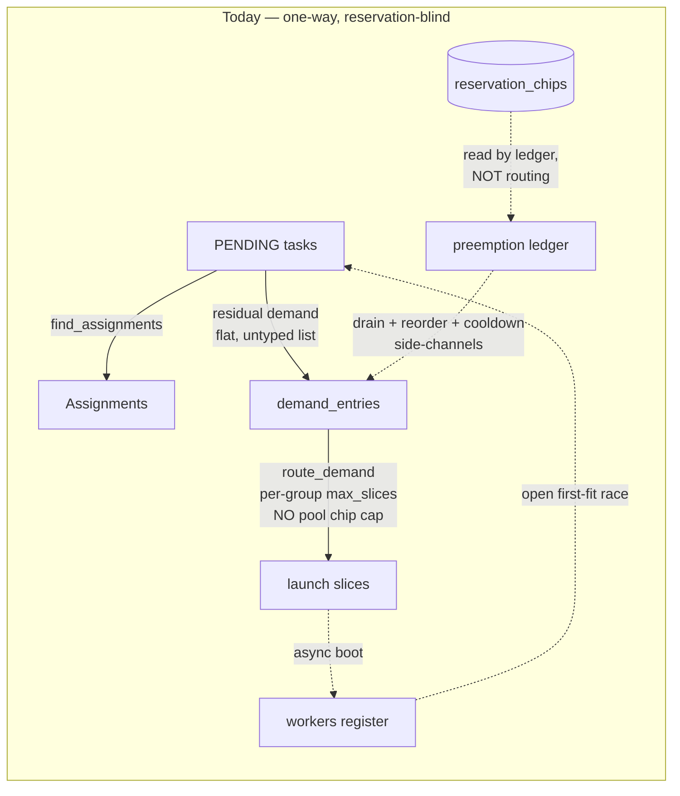
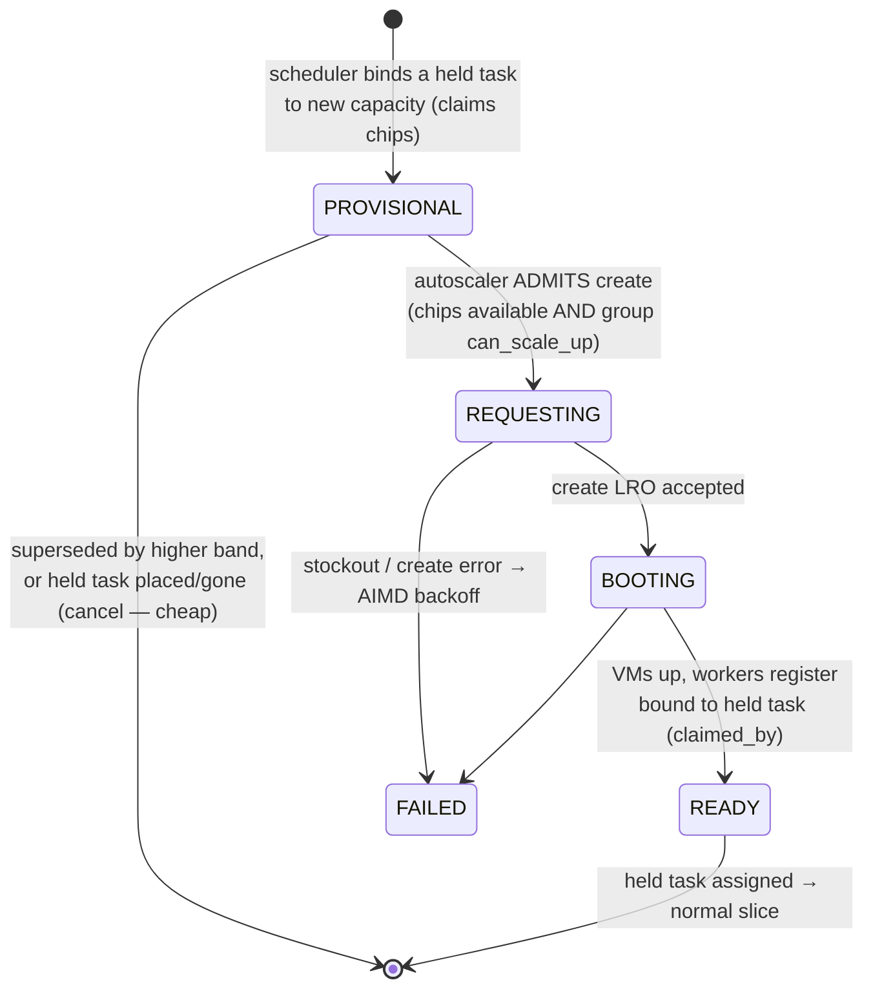
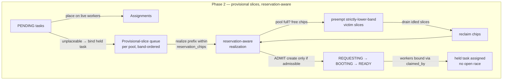

# Provisional Slices: a unified capacity model for the Iris scheduler ↔ autoscaler

**Status:** Design proposal (no code changed). Successor framing to the cross-variant
preemption PR (#6531, issue #6217). Reviewed once by `codex`; soundness holes it raised are folded
into §3–§5.
**Scope:** `lib/iris` controller — scheduler, autoscaler, slice lifecycle.

---

## TL;DR

Today the scheduler and autoscaler talk through a **one-way, untyped demand list**: the
scheduler emits "I have N unplaceable tasks of shape S," the autoscaler launches slices, and the
task waits as `PENDING`, re-emitting demand every tick until a slice boots and it wins an **open
first-fit race** for the new workers. There is **no object that binds a waiting task to the
capacity being created (or freed) for it.** Cross-variant reserved preemption (#6531) bolted three
side-channels onto this list — a demand *reorder*, a drain-worker set, and a 5-minute *cooldown* —
to fake that binding, and the reorder **cannot make #6531 sound** (`route_demand` is reservation-
blind; see §1.2).

This proposes a **two-phase** path:

- **Phase 1 — reservation-aware routing.** Teach `route_demand` a per-`quota_pool` chip cap, admitted
  in band order. This alone makes #6531 *sound* (no more 2× over-commit, no re-grab) and delivers most
  of property 3, at low risk. It is the recommended first PR.
- **Phase 2 — the provisional slice.** A first-class slice that exists *before* its VMs, **holds** the
  task it is created for, and **claims** chips against its pool. This closes what Phase 1 cannot: the
  open first-fit race (property 2's binding half) and the lack of a stable per-pool queue identity
  (property 3's "cancel superseded"). Demand becomes a *band-ordered, chip-capped queue of
  provisional slices*.

The four properties the user asked for are satisfied incrementally: Phase 1 covers 1, 3, and the
chip-budget half of 2; Phase 2 adds the binding half of 2 and makes the queue explicit. Properties 1
and 4 (preempt-to-free-chips, reclaim-idled-slices) reuse the existing drain path throughout.

---

## The four properties (the spec we're designing to)

1. A high-priority task **can preempt** a low-priority task if doing so lets it schedule.
2. A low-priority task **cannot** occupy a worker/slice (or chips) in a way that **blocks** a
   high-priority task from scheduling.
3. The autoscaler **must not scale up smaller slices while a larger, higher-priority slice is
   queued** for the same fungible pool — it should hold a priority-ordered queue per pool and only
   fall through to a lower-priority request if the higher one is abandoned, cancelling launches that
   have been superseded.
4. The autoscaler **must reclaim slices idled by preemption** so the freed capacity is reusable.

---

## 1. Why the current model can't express these

### 1.1 Demand is one-way and the resolution is delayed — for *every* preemption

The control tick runs `schedule → reconcile → autoscale → commit` (`controller.py:_control_tick`).
The scheduler is a pure function: pending tasks in, `(assignments, residual_demand)` out
(`backend.py:run_scheduling_decision`). Demand flows **strictly one way** — scheduler →
`demand_entries` → autoscaler — with no shared mutable state and no reconciliation pass (established
in `.agents/projects/2026-06-16_iris_autoscaler_scheduler_unification.md` §2.6).

The structural gap: **even same-variant preemption is a two-tick handshake, not an atomic swap.**
`apply_preemptions` (`scheduling/decision.py:30-70`) runs *after* `find_assignments` and only emits
`PREEMPT` decisions for victims — the preemptor is placed in **neither** the assignment list nor a
reservation (`backend.py:308-346`). The victim returns to `PENDING` at commit; only on the **next**
tick's fresh context is the freed capacity visible, and the still-`PENDING` preemptor competes for it
via an **open `first_fitting_worker`** (`scheduling/scheduler.py:515-532`).

In the common case this resolves correctly: pending tasks are walked in resolved-band order
(`policy.py:681`, `scheduler.py:700`), so the preemptor — the highest-band waiter — usually wins the
freed slot before any lower-band task. The race is **latent**, not routine: a lower-band task wins
the freed worker only through budget gating, the preemptor disappearing/expiring, a constraint or
resource change on retry, per-job assignment caps, or coscheduling-shape mismatches. It is real
because *nothing binds the freed capacity to the preemptor* — but it is an edge, not the norm.

The cross-variant case is the *same shape with a longer, guaranteed delay*: there is no worker to
free — a new slice must be **provisioned** (minutes of async GCP boot, `runtime.py:refresh`) from
chips freed by preempting *other-sized* slices. Here the window is wide and the race bites in
practice (the booted slice can be grabbed by a lower-band task before the preemptor gets to it).
**The missing primitive — a task bound to its incoming capacity — is the same in both cases.**

### 1.2 Routing is reservation-blind, so the chip math is unenforced

`reservation_chips` (e.g. `1024` for `v4-reserved`, `marin.yaml`) is consulted by the preemption
ledger (`reserved_pool.py:116-147`, `reserved_pool_usage`) and the scheduler's reserved view — but
**`route_demand` never reads it.** Routing bounds each per-(size,zone) group only by its own
**static** `max_slices` (`scaling_group.py:432`), and `route_demand` is **skip-and-continue**
(`routing.py:619-692`): it never stops at an unsatisfiable entry. So routing will fill
`v4-reserved-8` to 256 slices **and** `v4-reserved-16` to 128 slices at once — **2048 chips against a
1024-chip reservation.** GCP arbitrates the overflow as a stockout.

This is why the #6531 reorder cannot make the feature sound. `_order_reserved_demand_by_band` does
change which entry consumes a group's budget first when two entries target the *same* group — but the
re-grab happens across *different size groups* with *independent* `max_slices` budgets, and ordering a
skip-and-continue loop over independent budgets can't impose a shared cap. The just-drained victim's
same-size demand routes against its **own** group's freed headroom regardless of position, re-grabbing
the chips the drain freed. The 5-minute cooldown only gates the *preemption* pass, never routing — so
it can't stop the re-grab either. **The reorder orders within a group; it cannot enforce the
cross-size pool cap that #6217 actually needs.**



Properties **2** and **3** are *inexpressible*: routing has no notion of a pool budget or a queue,
and incoming capacity has no owner.

---

## 2. Phase 1 — reservation-aware routing (the sound, low-risk fix)

Teach the autoscaler a **per-`quota_pool` chip budget**. When routing demand to the groups of a
fungible reservation pool, debit `chip_count(variant)` per slice from a shared pool budget seeded at
`reservation_chips` and pre-charged with current usage from `reserved_pool_usage()` (which already
counts READY/BOOTING/INITIALIZING/REQUESTING via `slice_count()`, `scaling_group.py:744`). Route the
pool's reserved demand in **band order**, and stop committing to the pool once
`Σ committed_chips ≥ reservation_chips`. Excess **high-band** demand that the pool can't fit becomes a
**preempt-to-free-chips** decision (the existing reserved-preemption pass); excess **low-band** demand
simply doesn't route (it waits).

What Phase 1 buys, against the four properties:

- **Property 3 (no smaller-slice scale-up while a bigger one is queued):** mostly satisfied. Band-
  ordered debit means a larger high-band slice consumes the shared budget before a smaller low-band
  one; the low-band slice finds no chips and is not launched. It also makes the #6531 reorder
  *meaningful* (order now affects a real shared cap) — or lets us delete the reorder in favor of the
  cap doing the ordering directly.
- **Property 2 (chip half):** a low-band task can no longer cause the pool to over-commit and starve a
  high-band slice via stockout — the cap holds the chips.
- **Property 1, 4:** unchanged (existing preempt + drain).

What Phase 1 does **not** fix, and why Phase 2 exists:

- The **open first-fit race** (property 2's binding half): once a slice boots, a lower-band task can
  still grab its workers — Phase 1 controls *provisioning*, not *placement onto the result*.
- **Same-variant atomicity:** still a two-tick handshake with no binding.
- **Stable queue identity / "cancel superseded"** (property 3's tail): Phase 1's per-tick recompute
  gives band order but no durable claim to cancel; an in-flight create superseded by a higher-band
  arrival is handled only as well as the existing cancel/rebuild does.
- It still needs an **in-flight-drain marker** (a thin cooldown or the claim of Phase 2) so the
  preemption pass doesn't re-preempt while drained chips aren't yet represented as a pending create.

Phase 1 must also compose with the existing **quota-pool tier monotonicity** waterfall
(`routing.py:539-563`, `_pool_blocked_tiers`): a fungible reservation is a single budget at its
allocation tier, so a high-band claim for a tier-blocked pool **waits head-of-line** on that pool
rather than waterfalling its reserved chips into a different tier. Phase 1 treats the reservation pool
as one capped budget *within* the tier waterfall, not as a competitor to it.

**Phase 1 is the recommended first PR. It makes #6531 sound on its own.** The rest of this document is
Phase 2 — the deeper primitive that closes the binding and queue-identity gaps.

---

## 3. Phase 2 — the provisional slice

A **provisional slice** is a *tracked* slice entity that exists *before* any VM — the same kind of
in-flight capacity `_pending_scale_ups` already represents, but with **identity** and a **held task**
that counter lacks. It carries:

- **slice_id** — durable identity from creation (what `_pending_scale_ups` has no notion of).
- **target** — quota pool + device variant.
- **held task(s)** — the specific pending task ids it was created to run (one, or a coscheduled gang).
  *This is the binding the model lacks today.*
- **band** — the effective band of its held task(s); the queue key (already stamped at assign time,
  `ops/task.py:41-52`).
- **chip claim** — `chip_count(variant)`, counted against the pool budget. To make this real, the
  provisional slice must be a **tracked entity included in `slice_count()`** (not merely a new enum
  value): either a real entry in `_slices` with a `PROVISIONAL` lifecycle, or a structured extension
  of `_pending_scale_ups` carrying identity + held task. Adding the enum value alone does nothing —
  `slice_count()` is `len(_slices) + _pending_scale_ups`, so the claim only lands in
  `reserved_pool_usage` if it is one of those.

It extends the slice lifecycle (`SliceLifecycleState`, `scaling_group.py:49-69`) with one state
*upstream* of `REQUESTING`:



`PROVISIONAL` is cheap to cancel (no VMs, no drained victims yet — see §3.3); `REQUESTING`+ is
**sticky** (§3.2). The split is what prevents thrash.

### 3.1 Demand becomes a band-ordered, chip-capped queue

For each pending task it cannot place on existing workers, the scheduler **re-derives a provisional
slice** and enqueues it on its target pool, ordered by band. The autoscaler realizes the queue
**prefix that fits the reservation chip budget** (Phase 1's cap), preempting strictly-lower-band
slices to free chips for a high-band claim:



- **Property 2 (binding half):** when a provisional slice is realized, its booted workers register
  with a hard **`claimed_by:<task_id>`** attribute (resolved through the existing `ConstraintIndex`
  like `availability:` markers, `policy.py:124-143`, `scheduler.py:433-440`), so only the held task
  can land there until it is placed — the **open first-fit race is closed**.
- **Property 3 (stable queue + cancel superseded):** the queue is re-derived each tick from the band-
  ordered pending set (deterministic), but **admission is sticky** (§3.2), so "cancel superseded" is a
  bounded diff, not per-tick churn.

### 3.2 Tick-ordering contract (codex hole #1, #2) — the claim is visible before the next pass

The claim must be counted **the moment it preempts**, or the next tick's preemption pass sees freed
chips with no owner and over-preempts. The contract:

1. In one `schedule` phase, the scheduler emits, **as a single atomic decision committed together**:
   the `PROVISIONAL` claim (with its chip charge), the victim `PREEMPT` decisions, and the
   `drain_workers` set. `_commit_tick` writes all three in the one end-of-tick transaction
   (`controller.py:_commit_tick`), exactly as #6531 already commits PREEMPT + drain together.
2. The claim's chips are charged to `reserved_pool_usage` **from that commit** (because the
   provisional slice is a tracked entity, §3). So on tick N+1, `reserved_pool_view().free_chips`
   already reflects the claim: the preemption pass sees the deficit **already covered** and preempts
   nothing further. *This is what replaces the cooldown's over-preemption role* — by accounting, not
   by a timer.
3. The drained chips and the claim net to zero additional free chips until the create is admitted, so
   no other demand can route into them (Phase 1 cap) — *this replaces the cooldown's re-grab role.*

The 5-minute cooldown is therefore retired **only once the claim is a tracked, counted entity that
survives between the drain tick and the create tick.** If the claim is memory-only and re-derived, a
restart (which empties `_pending_scale_ups`, AIMD, and cooldowns — `recovery.py:109-163`) or the held
task disappearing between drain and create re-opens over-preemption. Decision (§5 Q2): persist a
minimal `provisional_slices` row, **or** keep a thin cooldown purely as the restart backstop. The doc
recommends the thin-cooldown backstop for v1 (smaller surface; the cooldown already exists and is the
established "transient commitment, not persisted" precedent).

### 3.3 Lifecycle of the binding (codex hole #3) — what clears `claimed_by`

A claim and its `claimed_by` marker are released on exactly these transitions:

- **Held task → RUNNING** (the success path): the binding is cleared, the slice becomes a normal
  READY slice, its workers lose `claimed_by` and rejoin the open pool.
- **Held task terminal/cancelled/expired/UNSCHEDULABLE, or placed elsewhere before READY:** the claim
  is released. If the slice has not yet booted (`PROVISIONAL`/`REQUESTING`), it is **cancelled**
  (`cancel_scale_up`); if it has booted (`BOOTING`/`READY`), it converts to **unclaimed capacity** and
  is reclaimable by the normal idle path (`scale_down_if_idle`) — no leak, no mis-assignment.
- **Held task's resources/constraints change on retry:** treated as held-task-gone for the old claim
  (release) + a fresh re-derivation next tick. The binding is keyed on the exact `(task_id, resource
  shape)`; a changed shape does not inherit the old slice.

Because the queue is re-derived each tick, these are not bespoke event handlers — they fall out of "is
the held task still pending with this shape?" evaluated every tick. The only state that must be
*durable* is admission (§3.2), not the binding.

### 3.4 Stickiness & anti-thrash (codex hole #4)

- `PROVISIONAL` claims are re-derived and freely reordered/dropped each tick — cheap, no side effects.
- Once **admitted** (`REQUESTING`+), a claim is **sticky**: it is cancelled only if a *strictly
  higher-band* claim needs its exact chips **and** it has not yet reached `BOOTING`. A claim that has
  reached `BOOTING` is never cancelled by the queue (its create cost is sunk; let it finish, then the
  idle path reclaims if its held task vanished). This bounds "cancel superseded" to the pre-boot
  window and kills launch/cancel oscillation from equal-band / near-cap churn.
- Equal-band claims **never** preempt or supersede each other (no priority inversion, no oscillation);
  ties hold their admission order.

### 3.5 Realization failure after draining (codex hole #5) — drain late, not eagerly

The top operational risk: draining victims, then having GCP refuse the create (stockout), having paid
the preemption cost for nothing. Resolution: **admit-then-drain (two-phase realization).** A claim
triggers a drain **only when the create is admissible** — i.e. the group `can_scale_up` (not quota-
blocked / not in AIMD backoff, `scaling_group.py:1009-1018`) and the *only* thing missing is chips. If
the pool is quota-blocked, the claim waits head-of-line **without draining**. This means we never
preempt to feed a create the cloud will immediately reject. It is a genuinely new path (today's drain
is synchronous and the autoscale drain-branch returns early, `backends/rpc/backend.py:261-266`), so it
is called out as real Phase-2 work, not a free change. If a create still fails *after* an admissible
drain (a true race), the freed chips are held by the surviving claim and the create retries under
AIMD — the victims are already gone, which is inherent to any preemptive scheduler.

### 3.6 Worked sequence — cross-variant preemption, end to end

```mermaid
sequenceDiagram
  participant S as Scheduler
  participant Q as Provisional queue (pool v4-reserved)
  participant AS as Autoscaler
  participant GCP

  Note over S: tick N — a v4-32 (16 chips, PRODUCTION) is unplaceable; pool full of BATCH v4-8s
  S->>Q: create PROVISIONAL P(v4-32, held=task, band=PROD), claim 16 chips
  S->>S: pool can_scale_up? yes → free_chips(0) < claim(16): select 4 BATCH v4-8 victims (strictly lower band)
  S-->>AS: commit ATOMICALLY: PROVISIONAL claim + PREEMPT victims + drain_workers (tick N)
  Note over AS,GCP: claim charged to reserved_pool_usage from commit N
  AS->>GCP: terminate 4 victim slices (drain)
  Note over S: tick N+1 preemption pass sees deficit already covered by P's claim → no over-preempt
  AS->>GCP: tick N+k — ADMIT P: create_slice(v4-32) [REQUESTING→BOOTING]
  GCP-->>AS: BOOTING→READY; workers register slice_id=P, claimed_by=task
  S->>S: tick N+k+1 — held task assigns to P's workers (no open race) → RUNNING; claim released
```

---

## 4. What dies, what stays

**Dies once Phase 1 + Phase 2 land:**

- `_order_reserved_demand_by_band` + `_UNRANKED_BAND` — the reorder. Phase 1's chip cap enforces band
  order at the pool level directly; the reorder's within-group ordering is subsumed.
- `RESERVED_DRAIN_COOLDOWN` — retired **once the claim is a tracked, counted entity** (§3.2). Both its
  jobs (re-grab, over-preemption) become accounting facts. A thin cooldown may remain *only* as the
  restart backstop (§5 Q2).
- The drain-worker *side-channel* shape: preemption-to-free-chips becomes a normal consequence of
  admitting a claim.

**Stays (fundamental to async GCP):** the explicit drain path; async create-LRO + describe-poll
lifecycle; per-(size,zone) scale groups; the per-worker placement / per-slice provisioning asymmetry;
the pure scheduler and `schedule → reconcile → autoscale → commit` order (the design rides the demand
channel, it does not add a control path).

---

## 5. Contracts, prior work, risks

**Contracts (the surface a reviewer agrees to).**
- **Phase 1:** a per-`quota_pool` chip budget in `route_demand` for `fungible_reservation` pools,
  seeded `reservation_chips` − `reserved_pool_usage()`, debited `chip_count(variant)` per routed
  slice in band order; composes with `_pool_blocked_tiers` as head-of-line-per-pool (§2).
- **Phase 2:** `SliceLifecycleState.PROVISIONAL`; a `ProvisionalSlice {slice_id, pool, variant,
  held_task_ids, band, chips}` that is a tracked entity counted by `slice_count()`; a hard
  `claimed_by:<task_id>` worker attribute resolved through `ConstraintIndex`; the atomic-commit
  contract (§3.2); the binding-release rules (§3.3); admit-then-drain (§3.5).
- **Naming** (`2026-05-31_iris_scheduling_naming_plan.md`): ops verbs `verb_noun` (`slice.claim`,
  `slice.cancel`), kernel bare verbs, no import aliases.

**Prior work.**
- *#178 `CapacityLedger` (deferred):* a provisional slice is a natural row in the per-tick reconciled
  ledger that #178 shelved. The designs compose — #178 unifies *liveness*, this unifies *intent*.
- *`availability_constraints` (shipped) deleted a reservation apparatus*
  (`migrations/0029_drop_reservations.py`): a per-**job**, long-lived, **speculative** variant hold
  that blocked capacity a job *might* use. A provisional slice is the opposite regime — **transient**,
  **per-task**, **reactive**: it exists only while a task that *cannot schedule now* waits for capacity
  it has **justified preempting for**, and never blocks other zones or pre-provisions speculatively.
  The earlier deletion removed *speculation*; this adds *accounting*. (Reviewers will pattern-match
  these; the distinction is load-bearing.)

**Risks / open questions.**
1. **Tier behavior** (§2): confirmed head-of-line-per-pool. Reviewer check: any pool where reserved
   chips *should* waterfall to an on-demand tier instead of waiting?
2. **Restart vs persistence** (§3.2): thin-cooldown backstop (recommended) vs a persisted
   `provisional_slices` table. Accept rare duplicate preemption after a controller restart?
3. **Equal-band & starvation:** strictly-lower-band preemption avoids inversion; equal-band never
   preempts. A sustained high-band stream can hold a reservation indefinitely — correct by priority,
   but do we want an anti-starvation floor for BATCH?
4. **Coscheduled claims:** a gang is **one** queue unit, admitted all-or-nothing across its N
   provisional slices; partial admission wastes chips. Confirm the gang, not the slice, is the unit.
5. **Scope:** Phase 1 + 2 are fungible-reservation-pools only (`fungible_reservation: true`); the same
   primitive could later replace the flat residual-demand list for *all* pools, or fold into the
   `CapacityLedger`. Out of scope for now.

**Incremental path.**
1. **Reservation-aware `route_demand`** (Phase 1) — fixes the #6531 soundness bug; delete or subsume
   the reorder. *Shippable alone; recommended first PR.*
2. **`PROVISIONAL` tracked claim + atomic-commit contract** (§3.2) — replaces the cooldown's two roles
   by accounting; keep a thin cooldown as restart backstop.
3. **`claimed_by` realization binding** (§3.1, §3.3) — closes the open first-fit race.
4. **Admit-then-drain two-phase realization** (§3.5) — removes the stockout-after-drain risk.
5. *(Later)* generalize provisional slices to all pools / fold into the `CapacityLedger`.
