# Iris resource architecture: current checkpoint and cleanup contract

Checkpoint `ffdf7396b0a113f6edbdf543a7a563d86d61e16c` makes
`ResourceService` the first-party API for Job, Task, Attempt, Node, Slice, and
Endpoint noun operations. The checkpoint does not make generated resource
messages the internal model. Production code still imports `job_pb2` in 73
modules and `controller_pb2` in 17 modules; their union is 76 modules.

The cleanup has one structural rule: generated messages are transport values.
An RPC adapter decodes them before it calls a controller operation, persistence
operation, scheduler, federation coordinator, backend port, worker runtime, or
endpoint registry. The adapter encodes native results before bytes leave the
process. This applies to new and old protobufs.

“Native” does not mean every layer uses the public `JobSummary` or `TaskDetail`
record. Persistence rows, scheduling inputs, `AttemptLaunch`, backend
observations, controller effects, and federation deltas have different useful
shapes. They remain separate frozen dataclasses or typed row records. They may
contain resource identities, states, and specifications, but they may not
contain generated messages.

## Current runtime flow

The arrows in this section are runtime requests and returned data. They are not
Python import directions.

```mermaid
flowchart LR
    classDef caller fill:#f3f3f3,stroke:#666,color:#111
    classDef wire fill:#dcecff,stroke:#2b67a0,color:#111
    classDef core fill:#dff5e1,stroke:#2f7d32,color:#111
    classDef leak fill:#ffe2dc,stroke:#b8432f,color:#111
    classDef store fill:#f4ebd0,stroke:#8a6d1d,color:#111

    resourceCaller[First-party resource noun caller]:::caller
    oldCaller[Old ControllerService caller]:::caller
    taskClient[Task endpoint client]:::caller
    workerRuntime[Worker runtime]:::caller
    peer[Federation peer]:::caller

    resourceClient[ResourceClient adapter]:::wire
    resourceRpc[ResourceServiceImpl]:::wire
    oldRpc[ControllerServiceImpl]:::wire
    endpointRpc[EndpointServiceImpl]:::leak
    workerRpc[WorkerServiceImpl]:::leak
    peerRpc[Federation RPC client and codecs]:::leak

    resourceWire[resource.proto bytes]:::wire
    controllerWire[controller.proto and job.proto bytes]:::wire
    workerWire[worker.proto and job.proto bytes]:::wire

    resourceFacade[ResourceController facade]:::leak
    nounServices[JobResources and controller operations]:::leak
    controllerCore[Persistence, scheduling, and reconcile]:::leak
    backendPort[TaskBackend]:::leak
    rpcBackend[RpcTaskBackend]:::leak
    k8sBackend[K8sTaskProvider]:::leak
    endpointRegistry[Endpoint registry and projection]:::core
    federationCore[FederationManager and store]:::leak
    sqlite[(Controller SQLite)]:::store
    kube[Kubernetes API]:::caller

    resourceCaller --> resourceClient --> resourceWire --> resourceRpc --> resourceFacade
    oldCaller --> controllerWire --> oldRpc --> resourceFacade
    resourceFacade --> nounServices --> controllerCore
    resourceFacade --> controllerCore
    controllerCore <--> sqlite
    controllerCore --> backendPort
    backendPort --> rpcBackend --> workerWire --> workerRpc --> workerRuntime
    backendPort --> k8sBackend --> kube

    taskClient --> controllerWire --> endpointRpc --> endpointRegistry --> sqlite
    workerRuntime --> controllerWire --> oldRpc --> controllerCore

    resourceFacade --> federationCore --> peerRpc --> peer
    peer --> peerRpc --> federationCore
```

`cluster/controller/dashboard.py` mounts `ResourceService`,
`ControllerService`, and `EndpointService`. A worker separately mounts
`WorkerService`.

The resource noun path is:

1. `cluster/client/resource_client.py` converts native client records to
   `resource_pb2`.
2. generated `resource_connect.py` carries those messages to
   `cluster/controller/resources/rpc.py:ResourceServiceImpl`.
3. `ResourceServiceImpl` converts identities, queries, and results around calls
   to `cluster/controller/resources/facade.py:ResourceController`.
4. `ResourceController` reads through `reads.py`, writes through noun
   operations and `writes.py`, and routes provider actions through
   `TaskBackend` or `FederationManager`.

The old Job and Task methods in `ControllerServiceImpl` mostly have the intended
shape. `resources/legacy_rpc.py` converts `LaunchJobRequest` to `JobSpec`, and
converts resource Job and Task records back to old responses. These methods call
the same `ResourceController`; they do not run a second Job or Task persistence
path.

The request context and error path do not yet have that shape.
`cluster/authorization.py` and `controller/resources/jobs.py` read Rigging's
request-local `VerifiedIdentity` and raise `ConnectError` from application code.
`ResourceServiceImpl` separately implements owner filtering and repeats
per-handler exception mapping, while `ControllerServiceImpl` has another copy
of owner and federation-target authorization. Finelog and federated peer
failures can also carry a remote `ConnectError` through a noun operation.

That statement applies only to the old Job and Task methods.
`ControllerServiceImpl` also contains worker registration, worker and process
status, checkpoint, budget, scheduler, backend, peer, raw-query, and federation
RPC logic. `EndpointServiceImpl` combines protobuf handling with registry and
persistence work. `WorkerServiceImpl.TaskProvider` accepts and returns generated
worker and Job messages. These active transports still pass wire objects beyond
their handlers.

Federation currently uses two transports. Resource actions, profile, and exec
use `ResourceService`; handoff, heartbeat, delta sync, process status, and some
termination calls use old `ControllerService` messages. `federation/peer.py`
contains both the native peer coordination object and the generated clients, so
the boundary is not isolated.

## Current generated-type debt

| Area | Generated values in core code | Target |
| --- | --- | --- |
| Resource server and client adapters | `resource_pb2` codecs | Allowed only in the adapter modules |
| Old ControllerService Job/Task wrapper | `controller_pb2` and `job_pb2` codecs | Allowed; delegate to native noun services |
| Other ControllerService methods | worker, checkpoint, budget, backend, peer, query, and process messages | Decode into native services before doing work |
| EndpointService | registration, lease, lookup, and access messages mixed with registry logic | Thin RPC adapter over a native endpoint registry |
| WorkerService and worker runtime | `RunTaskRequest`, reconcile, task status, profile, exec, process, and metadata messages | Thin worker RPC adapter over native worker operations |
| `resources/job.py` and `cluster/types.py` | entrypoint, environment, resources/device, state aliases, policies, and endpoint access | Native resource types |
| `resources/log.py` and client protocols | protobuf log levels/entries and profile request types | Native log and profile types in public signatures |
| `constraints.py`, config, and composer | device and constraint messages | Native device and constraint types |
| persistence, scheduling, and reconcile | protobuf state constants and `RunTaskRequest` templates | Native enums, rows, decisions, and `AttemptLaunch` |
| `controller/backend.py` | launch, backend status, autoscaler status, process status, and `ControllerEffects` | Native backend port; controller folds observations into effects |
| RPC and Kubernetes backends | generated worker/Job messages used before the network or pod-render boundary | Encode at the worker call; render pods from native launch records |
| autoscaler and stats | protobuf resource, VM, worker metadata, and state values | Native capacity, worker, and state records |
| federation manager and peer | protobuf backend/peer summaries and process status | Native peer observation and process records |
| client, CLI, runtime, and `env_resources.py` | generated enums, logs, profiles, resources, and container inputs | Native public/runtime types; codecs stay in client adapters |
| generated `*_pb2.py` and `*_connect.py` | generated implementation | Allowed |

The public resource model itself still leaks old messages:

- `resources/job.py:JobSpec` embeds `job_pb2.RuntimeEntrypoint`,
  `EnvironmentConfig`, policy enums, priority, and container profile.
- `cluster/types.py:ResourceSpec.device` is `job_pb2.DeviceConfig`; Job and Task
  states are aliases of protobuf enums.
- `resources/log.py:LogQuery` and `LogPage` expose `iris_logging_pb2`.
- `cluster/client/protocol.py` exposes protobuf log entries and
  `job_pb2.ProfileType`.
- `resource.proto` imports Job state, specification, resource, constraint,
  coscheduling, and profile shapes from `job.proto`.

The backend and worker path has the same problem at a larger scale:

- `RunTemplatesProjection`, dispatch, `ReconcileRequest`, `ControlSnapshot`,
  and `BackendWorkerStore` carry `job_pb2.RunTaskRequest`.
- `controller/reconcile/worker.py` constructs `worker_pb2` desired attempts and
  reconcile requests before the network call and returns protobuf observations
  to the controller fold.
- `runtime/types.py:ContainerConfig` embeds Job entrypoint, resource, worker
  metadata, and container-profile values.
- `TaskBackend.status`, `autoscaler_status`, and `get_process_status` expose
  controller, VM, and Job messages.

## Target dependency direction

The arrows in this diagram mean “the source package may import the destination
package.” Runtime calls through an injected protocol can travel in the opposite
direction. External systems and generated schemas are shown only to identify
adapter dependencies.

```mermaid
flowchart TB
    classDef domain fill:#dff5e1,stroke:#2f7d32,color:#111
    classDef adapter fill:#dcecff,stroke:#2b67a0,color:#111
    classDef external fill:#f3f3f3,stroke:#666,color:#111
    classDef store fill:#f4ebd0,stroke:#8a6d1d,color:#111

    resources[iris.cluster.resources]:::domain
    backendPort[backend ports and native records]:::domain
    federationCore[federation core and peer port]:::domain
    persistence[persistence ports, rows, and codecs]:::domain
    controllerCore[controller operations, scheduling, reconcile]:::domain
    nounServices[Job, Task, Attempt, Node, Slice, Endpoint, Action services]:::domain
    services[ResourceServices composition record]:::domain
    endpointCore[native endpoint registry]:::domain
    workerCore[native worker and container runtime]:::domain

    resourceServer[ResourceService server adapter]:::adapter
    legacyServer[ControllerService adapters]:::adapter
    endpointServer[EndpointService adapter]:::adapter
    workerServer[WorkerService adapter]:::adapter
    resourceClient[ResourceService client adapter]:::adapter
    rpcBackend[RPC TaskBackend adapter]:::adapter
    k8sBackend[Kubernetes TaskBackend adapter]:::adapter
    federationRpc[Federation RPC peer adapter]:::adapter
    composition[controller and worker composition roots]:::adapter

    generated[generated protobuf and Connect code]:::external
    kubernetes[Kubernetes API]:::external
    sqlite[(SQLite)]:::store

    backendPort --> resources
    federationCore --> resources
    persistence --> resources
    controllerCore --> resources
    controllerCore --> backendPort
    controllerCore --> persistence
    nounServices --> resources
    nounServices --> persistence
    nounServices --> backendPort
    nounServices --> federationCore
    services --> nounServices
    endpointCore --> resources
    endpointCore --> persistence
    workerCore --> resources

    resourceServer --> generated
    resourceServer --> services
    legacyServer --> generated
    legacyServer --> services
    legacyServer --> controllerCore
    endpointServer --> generated
    endpointServer --> endpointCore
    workerServer --> generated
    workerServer --> workerCore
    resourceClient --> generated
    resourceClient --> resources
    rpcBackend --> generated
    rpcBackend --> backendPort
    k8sBackend --> backendPort
    k8sBackend --> kubernetes
    federationRpc --> generated
    federationRpc --> federationCore

    composition --> services
    composition --> controllerCore
    composition --> endpointCore
    composition --> workerCore
    composition --> rpcBackend
    composition --> k8sBackend
    composition --> federationRpc
    persistence --> sqlite
```

Core packages do not import concrete adapters. Composition roots construct the
selected backend and peer implementations and inject them through native
protocols. A concrete RPC backend is an adapter even if it also owns connection
pooling or retry policy. A Kubernetes backend is an infrastructure adapter; it
may import Kubernetes client types but not generated Iris messages.

## Target responsibilities

### Resource records

`iris.cluster.resources` owns frozen identities, locators, specifications,
queries, summaries, details, actions, logs, profiles, and source status. It owns
explicit native `IntEnum` or `StrEnum` state and policy types. Persisted numeric
enums have explicit stable values; adapters use exhaustive conversion functions
and reject unsupported values.

The package does not import `iris.rpc`, SQLAlchemy rows, controller modules, or
backend implementations. Worker, peer, backend, and capacity records live here
only when they are part of the public resource API. Backend-only and
federation-only observations live with their native ports.

### Resource application services

Noun services own behavior for Jobs, Tasks, Attempts, Nodes, Slices, Endpoints,
and Actions. `ResourceServices` is an immutable composition record containing
those services; it has no forwarding methods. ResourceService and the retained
ControllerService adapters call the relevant noun directly. Shared
authorization, pagination, source-status, and exact-identity helpers are
injected or factored once when multiple noun services need them.

Every authorized noun call takes an explicit native `CallerContext`. It carries
the principal, role, and whether the identity is verified or ambient; it does
not carry an RPC method name, request object, or endpoint-token audience.
Ownership, dashboard read scope, elevated submission, and federation-target
checks use this value and raise native semantic errors. No application service
reads Rigging's identity context variable.

### Authentication and errors

The Connect interceptor authenticates the request and enforces transport-level
method allowlists. A server adapter calls `require_identity` once, converts the
`VerifiedIdentity` to `CallerContext`, decodes the request, invokes one noun
service, maps a native error, and encodes the response. Endpoint-scoped token
denial and dashboard or federation method allowlists therefore stay at the RPC
boundary; resource ownership and target policy stay in the noun services. The
old ControllerService adapter follows the same path and uses the same error
mapper as ResourceService.

Native errors describe the failed contract rather than carrying a transport
code. The shared RPC mapper applies this table:

| Native error | Connect code |
| --- | --- |
| invalid key, page token, or argument | `INVALID_ARGUMENT` |
| access denied | `PERMISSION_DENIED` |
| resource absent | `NOT_FOUND` |
| resource already exists or action idempotency conflict | `ALREADY_EXISTS` |
| replaced resource, rejected policy, or failed precondition | `FAILED_PRECONDITION` |
| resource limit exceeded | `RESOURCE_EXHAUSTED` |
| required source unavailable | `UNAVAILABLE` |
| unsupported resource verb | `UNIMPLEMENTED` |

Only request decoding may translate a narrow `ValueError` to
`INVALID_ARGUMENT`; an unexpected application `ValueError` remains an internal
failure. Finelog, backend, and federation adapters translate their own
transport failures before returning control to a noun service.

### Persistence and controller core

Persistence owns typed rows, queries, transactions, and codecs between stored
columns and native records. It need not materialize public summary records for
internal hot paths. It does not store or return generated messages.

Controller operations own scheduling, retries, lifecycle folds, and
`ControllerEffects`. A backend returns observations and decisions; controller
code validates them against the snapshot and authors persistence effects. This
keeps `TaskBackend` independent of `ControllerDB`, SQL rows, and
`ControllerEffects`.

### Backend and worker ports

The backend port owns `AttemptLaunch`, desired Attempt, Attempt observation,
placement, backend observation, process status, and schedule/reconcile/autoscale
request and result records. These records use exact resource identities and
native resource specifications.

The RPC backend converts these records to `worker_pb2` and any worker-used
`job_pb2` declarations at the worker stub call. `WorkerServiceImpl` performs the
inverse conversion before calling worker and container runtime operations. The
Kubernetes backend renders a pod from `AttemptLaunch` and returns native
observations.

### Endpoint registry

The task-side endpoint lease protocol remains an active transport until a new
resource mutation RPC replaces it. `EndpointServiceImpl` becomes a thin codec
and error-mapping layer. A native endpoint registry owns lease selection,
registration, renewal, removal, lookup, and projection updates.

### Federation

`FederationManager`, routing, and the store use a native peer protocol. The
existing `FederationSyncBatch`, `FederationJobDelta`, `SyncedJob`, `SyncedTask`,
and `SyncedAttempt` are already native dataclasses and may remain specialized
incremental records. They gain native state, resource, identity, and runtime
fields where needed. They do not need to become public `JobSummary` and
`TaskSummary` objects unless those semantics match exactly.

The RPC peer implementation converts native handoff, heartbeat, sync, action,
profile, exec, and process records at each network call. Authority and execution
identity remain explicit in the native delta envelope.

### Client, CLI, autoscaler, stats, and runtime

`ResourceClientProtocol`, `RemoteClusterClient`, CLI commands, journey fakes,
autoscaler models, stats rows, environment resource readers, and container
runtime records use native types. `ResourceClient`, the endpoint client, and
other narrow transport clients own generated request and response conversion.
Boundary-specific CLI tooling that intentionally exposes a raw RPC is isolated
and named in the final allowlist.

## Proto ownership

- `resource.proto` is the canonical public resource transport. It declares its
  Job specification, states, policies, resources, constraints, coscheduling,
  and profile request shapes instead of importing those declarations from
  `job.proto`.
- `controller.proto` and the ControllerService Job/Task messages are the old
  public wire. Their adapter can be removed with the last old caller.
- `controller.proto` also contains active worker, endpoint, checkpoint, budget,
  backend, peer, and admin transports. Those messages remain usable at their
  RPC handlers but do not become domain types.
- `worker.proto` is an active worker transport and currently imports
  worker-used messages from `job.proto`. Those declarations may remain in
  `job.proto` until wire files are reorganized. Their location does not permit
  `job_pb2` in controller, backend, worker-runtime, or resource records.
- `iris_logging.proto`, `vm.proto`, `query.proto`, `time.proto`, and error
  messages are transport schemas. Native code converts logs, capacity/process
  observations, raw-query results, time values, and errors at the relevant
  boundary.

No backwards-compatibility layer exists inside the process. Compatibility is
limited to explicit old RPC adapters.

## Cleanup slices

Each slice lands in the same PR and leaves a testable native seam. The order is
dependency-driven; it is not an externally staged rollout.

### 1. Install and ratchet the generated-import boundary

- Add one full-production-tree AST import test over `lib/iris/src/iris`.
- Track the initial debt as a sorted exact manifest of `(path, generated
  module)` entries. New entries fail immediately; each later slice removes its
  entries.
- Exempt generated files and a short exact list of transport modules. Do not
  exempt whole mixed modules such as current `service.py`, `peer.py`, or
  `endpoint_service.py`.
- Add a stricter package rule that rejects every `iris.rpc` import from resource
  records, backend ports, federation core, and persistence.
- Keep port signatures fully typed and run Pyrefly so protobuf values cannot
  cross through `Any` after their import disappears.

The final allowlist contains only generated code and named adapters: resource
client/server codecs, the old ControllerService adapters, endpoint client/server
adapters, worker client/server adapters, federation RPC adapters, and narrow
shared protobuf codecs such as time conversion. Every allowlist entry must send
or receive serialized transport data.

### 2. Make the public resource and client model native

- Add native state/policy, entrypoint, environment, device/resource,
  constraint/coscheduling, endpoint access, profile, process, and log records.
- Make `JobSpec`, `ResourceSpec`, Job/Task/Attempt records, `LogPage`, and client
  protocols use them.
- Make `resource.proto` own its resource-specific messages and regenerate code
  with `uv run python lib/iris/scripts/generate_protos.py`.
- Update ResourceService codecs, the old LaunchJob wrapper, first-party client,
  CLI, `env_resources.py`, and configuration parsing together.
- Remove obsolete protobuf aliases and in-process Controller convenience methods
  that construct old requests.

### 3. Replace the resource facade with noun services

- Move direct Job, Task, Attempt, Node, Slice, Endpoint, Action, and
  observability behavior out of `ResourceController` into native noun services.
- Replace `ResourceController` with an immutable `ResourceServices` composition
  record. ResourceService, the old wrapper, and local composition select a noun
  explicitly instead of calling forwarding methods.
- Pass a native `CallerContext` to authorized operations and move object-level
  access checks into the noun that owns the operation.
- Replace application `ConnectError` raises with semantic resource errors; use
  one mapper from both public server adapters.
- Preserve bounded query and transaction behavior while moving code; do not add
  wrapper methods that duplicate persistence queries.

### 4. Make persistence, scheduling, autoscaler, stats, and runtime native

- Replace protobuf state constants in schemas, row projections, lifecycle
  folds, scheduling, budgets, autoscaling, and stats with explicit native enums.
- Replace cached `RunTaskRequest` templates with native `AttemptLaunch` records.
- Make container/runtime configuration and worker metadata native.
- Keep persisted integer values stable and test exhaustive DB/proto conversion.

### 5. Make the backend and worker boundaries native

- Move `TaskBackend` and its native request/result records to a backend interface
  module with no controller or generated imports.
- Return backend observations and decisions; build `ControllerEffects` in the
  controller fold.
- Convert desired attempts, observations, profile, exec, process status, backend
  status, and autoscaler status at the RPC backend call.
- Decode WorkerService requests before invoking worker/container operations.
- Render Kubernetes objects directly from native `AttemptLaunch`.

### 6. Separate active Controller and Endpoint transports from their services

- Extract native worker-registration, status, checkpoint, budget, scheduler,
  backend, peer, raw-query, and endpoint-registry operations.
- Leave `ControllerServiceImpl` and `EndpointServiceImpl` as request decoding,
  transport-level authorization, caller conversion, error mapping, delegation,
  and response encoding.
- Keep old Job/Task conversions in the dedicated legacy adapter.

### 7. Make federation boundaries native

- Convert backend heartbeats to native peer observations immediately in the RPC
  peer implementation.
- Remove protobuf backend/peer summaries and process-status messages from
  `PeerConnection`, `PeerHeartbeat`, routing, and manager views.
- Evolve the existing typed sync delta records only where they carry old states
  or resource/device values.
- Keep old handoff and sync wire conversion at the network call. Keep resource
  action/profile/exec conversion at the ResourceService peer call.

### 8. Close the boundary and delete the debt manifest

- Reduce the import manifest to the reviewed final adapter allowlist.
- Search production signatures and dataclass fields for generated message types,
  not only imports.
- Confirm every first-party API and journey uses native records.
- Keep protobuf construction in adapter contract tests; move it out of domain,
  persistence, scheduler, backend-port, and journey tests.

## Behavioral and structural tests

Adapter tests prove exhaustive native-to-wire and wire-to-native conversions,
including unknown or absent enum/message fields. Persistence and backend tests
exercise native ports. The global import/signature gate proves the boundary.
It also rejects `connectrpc`, `rigging.server_auth`, and `iris.rpc.auth` imports
from resource records and noun-service modules.

A small boundary suite proves that the old and resource RPCs return the same
codes for invalid submission, duplicate submission, cross-owner access, stale
Attempt identity, and an unavailable required source. One direct noun-service
test proves a denied native caller receives the native access error rather than
a `ConnectError`. Existing owner scoping, endpoint token, elevated-profile,
federation handoff, idempotency, stale-incarnation, and partial-source behavior
tests remain the primary policy coverage.

Journey tests use only the native resource and backend interfaces. Protobuf is
permitted only in boundary-specific adapter tests. Keep these journeys compact:

- submit a multi-task Job, fail Task 7, retry it, and exhaust its retry budget;
- cancel before Attempt creation and after an Attempt starts;
- carry a timeout budget from client to parent controller to federation peer to
  worker without an earlier hop expiring first;
- lose a federation peer before handoff acknowledgement and after acceptance,
  then replay without duplicate Jobs or Attempts;
- replace a Job incarnation and reject stale Task actions, Attempt actions, and
  runtime observations;
- restart the controller with pending dispatch, action, and federation work and
  re-drive each operation once;
- register an Endpoint lease for the current Attempt, reject a stale Attempt,
  and expire the lease;
- run the same launch and terminal observation through RPC-worker and Kubernetes
  backend fakes.

These journeys guard behavior while native records replace wire objects. They
do not repeat codec field assertions or internal helper call order.

## Completion condition

The cleanup is complete when the full-tree gate can explain every generated
protobuf or Connect import as a named client/server transport adapter, generated
implementation, or narrow shared codec. Public client protocols, resource
records, controller operations, persistence rows, scheduler inputs, backend
ports, worker runtime, endpoint registry, federation core, CLI, and journeys
contain no generated message types.

A Job submitted through either public RPC is decoded once into native records.
Persistence normalizes it into typed rows, scheduling derives native launch
records, providers return native observations, and federation carries typed
deltas. Generated messages reappear only when an adapter sends bytes.
