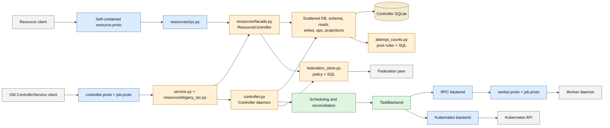
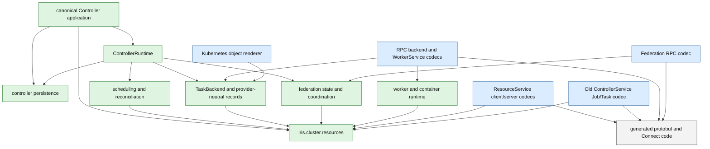

# Iris resource architecture and protobuf boundaries

Checkpoint `cb5e87478fe66d4fdd12b4a5abaa39c3b79675ed` makes
`ResourceService` the first-party API for Jobs, Tasks, Attempts, Nodes, Slices,
and Endpoints and removes generated Job values from the controller core. This
document pins the remaining package cleanup so the filesystem expresses that
architecture directly.

The governing rule is narrower than “remove protobuf from Iris”: the old Job
model must not remain the in-process product model. Generated messages are
decoded at the transport that owns them. Frozen records in
`iris.cluster.resources` carry Job and resource semantics through clients,
admission, persistence, federation admission, and provider coordination.

## Why `job_pb2` still appears

At the checkpoint, `resource.proto` imports `job.proto`. Its `JobSpec` embeds
`iris.job.RuntimeEntrypoint`, `ResourceSpecProto`, `EnvironmentConfig`,
constraints, policies, and profiles; its Job and Task reads also use
`iris.job.JobState` and `iris.job.TaskState`. The resource wire therefore is not
yet independent of the old Job schema.

`job.proto` itself has two roles:

1. It defines the retained ControllerService Job and Task wire. That API is an
   old network boundary and has no first-party callers after this PR.
2. It defines messages used by the active worker protocol, including
   `RunTaskRequest`, `WorkerMetadata`, task observations, and related execution
   values. `worker.proto` and parts of `controller.proto` still import those
   declarations.

The first role is legacy. The second is an active transport contract. This PR
does not need to delete `job.proto` or renumber the worker wire. It must stop
using `job_pb2` as controller, persistence, scheduling, Kubernetes, client, or
federation application state.

## Current flow at the checkpoint

The native value flow is correct, but the orange nodes combine responsibilities
or retain names from the incremental implementation.



The resource server and old Job wrapper already decode at their handlers. The
remaining problem is ownership: the canonical application controller is called
a facade, the process runtime is called the controller, SQLAlchemy is spread
through application modules, and the legacy service can reach both persistence
and runtime operations directly.

## Target flow for this pull request

`resource.proto` owns the complete public resource wire. Both public RPCs
decode immediately into the same frozen resource records. Controller and
provider code consume those records. The retained worker RPC converts to
`job_pb2` only where it sends or receives the active worker transport.

```mermaid
flowchart LR
    classDef caller fill:#f3f3f3,stroke:#666,color:#111
    classDef wire fill:#dcecff,stroke:#2b67a0,color:#111
    classDef core fill:#dff5e1,stroke:#2f7d32,color:#111
    classDef store fill:#f4ebd0,stroke:#8a6d1d,color:#111

    resourceCaller[Resource client]:::caller
    oldCaller[Old ControllerService client]:::caller
    worker[Worker daemon]:::caller
    kubernetes[Kubernetes API]:::caller
    peer[Federation peer]:::caller

    resourceWire[Self-contained resource.proto]:::wire
    oldWire[controller.proto + job.proto]:::wire
    workerWire[worker.proto + job.proto]:::wire

    resourceRpc[api/resource_service.py]:::wire
    oldRpc[legacy/controller_service.py]:::wire
    records[Frozen resource records]:::core
    controller[controller.py<br/>Controller application]:::core
    runtime[ runtime.py<br/>ControllerRuntime]:::core
    persistence[persistence/<br/>SQLAlchemy and SQLite]:::core
    scheduling[Existing scheduling and reconciliation]:::core
    backend[Existing TaskBackend contract]:::core
    rpcBackend[Worker RPC codec]:::wire
    k8sBackend[Kubernetes renderer]:::wire
    federation[Federation boundary codec + native store]:::wire
    sqlite[(Controller SQLite)]:::store

    resourceCaller --> resourceWire --> resourceRpc --> records
    oldCaller --> oldWire --> oldRpc --> records
    records --> controller
    controller --> persistence --> sqlite
    controller --> runtime
    runtime --> scheduling --> backend
    backend --> rpcBackend --> workerWire --> worker
    backend --> k8sBackend --> kubernetes
    runtime --> federation --> peer
```



The arrows describe runtime data flow. They do not require one universal DTO.
Persistence rows, scheduling inputs, launch templates, and provider
observations may remain specialized frozen records. They share resource
identities, states, specifications, and exact-target semantics rather than
generated messages.

## Proto ownership

| Schema | Ownership after this PR | Where generated values may appear |
| --- | --- | --- |
| `resource.proto` | Canonical public resource RPC, including its own Job specification, states, resources, constraints, policies, and profile shapes | Resource client/server codecs and generated code |
| `controller.proto` | Retained old Job/Task RPC plus active controller administration and worker-registration transports | The corresponding ControllerService/client adapters |
| `job.proto` | Definitions required by the old ControllerService and active worker wire | Old Job/Task codec, worker RPC codec, generated code |
| `worker.proto` | Active controller-to-worker transport | RPC backend and WorkerService adapters |
| `iris_logging.proto`, `time.proto`, `query.proto`, `vm.proto` | Specialized transport schemas | Their narrow client/server codecs |

An import is not acceptable merely because the schema remains active. Job and
Task lifecycle values are decoded by their owning transport; persistence,
scheduling, resource records, and federation state do not consume generated
Job messages. Existing `TaskBackend.status` and autoscaler/dashboard status
methods still return the historical controller/VM operational projections.
Those exact imports remain tracked debt for a later operational-client sweep;
they are not an excuse to pass Job or Task messages through backend behavior.

## Python dependency direction



Core modules never import concrete network adapters. `main.py` constructs one
concrete persistence implementation, `ControllerRuntime`, the canonical
`Controller`, and both RPC adapters. Persistence is organized by noun and
transaction rather than hidden behind a generic repository framework.

`Controller` is intentionally the stable application facade, not another
transport or persistence layer. Callers should not have to select separate Job,
Task, Endpoint, observability, or inventory controllers before they can perform
one resource operation. Those areas may use private collaborators and named
transaction/dispatch stages internally, but the public ownership remains one
cohesive resource contract over the same snapshot, authorization policy,
backends, and federation runtime. This is the facade exception to the ordinary
god-class rule; splitting its public surface would expose implementation
taxonomy and recreate the ambiguous ownership this layout removes.

## Target package layout

```text
iris/cluster/resources/                 frozen native contracts
iris/cluster/controller/
  controller.py                         canonical resource application API
  runtime.py                            daemon lifecycle and control loop
  jobs.py                               typed Job admission
  main.py                               composition root
  api/
    resource_service.py                 canonical ResourceService adapter
  legacy/
    controller_service.py               old ControllerService adapter/router
    codec.py                            old Job/Task request and response mapping
  persistence/
    database.py                         engine, transactions, reopen
    schema.py                           SQLAlchemy tables and indexes
    json_codec.py                       native persisted JSON shapes
    reads.py / writes.py                shared typed statements
    federation.py                       atomic FederationStore implementation
    attempt_counts.py                   SQL aggregate expressions
    action.py                           durable action receipts
    migrations/                         ordered schema deltas
    projections/                        controller projections and caches
  scheduling/                           pure placement policy
  reconcile/                            snapshot, effects, and commit planning
```

`legacy/controller_service.py` may implement active operational methods that
still share the historical service descriptor, but those methods delegate to
`ControllerRuntime`. Old Job and Task methods delegate only to `Controller`.
The adapter owns neither SQL statements nor resource semantics.

## Bounded cleanup sequence

1. Rename the daemon `Controller` to `ControllerRuntime` in `runtime.py`, then
   promote `ResourceController` to `Controller` in `controller.py`.
2. Move ResourceService and ControllerService translation into `api/` and
   `legacy/`; make both delegate to the canonical controller.
3. Move DB, schema, migrations, reads, writes, transactional operations,
   projections, checkpoints, and persisted codecs under `persistence/`.
4. Put the atomic DB-backed `FederationStore` and its persisted candidate reads
   under persistence while keeping federation protocols and policy records in
   `cluster/federation`; split pure Attempt count semantics from SQL expressions.
5. Use Rigging `Provenance.to_json`/`from_json` for its persisted JSON instead
   of maintaining an Iris serializer.
6. Add boundary gates: generated Job imports only in named transports and
   SQLAlchemy imports only in persistence. Legacy Job/Task methods must delegate
   to `Controller`; operational methods sharing the descriptor may delegate to
   `ControllerRuntime` and typed persistence operations.
7. Run existing resource, controller, federation, worker, Kubernetes, journey,
   and migration behavior suites. This refactor adds no second behavior path.

This is one forward-only change. There is no dual internal model and no
controller option selecting old versus resource behavior.

## Behavior that proves the boundary

- A fully populated Job submitted through ResourceService survives controller
  reopen and describes with the same normalized specification.
- The retained ControllerService wrapper admits the same Job and returns the
  same identity, state, and error semantics.
- Mutable input mappings and sequences cannot change an admitted Job after
  construction.
- Existing persisted protobuf-JSON remains byte-shape compatible, including
  decimal strings for int64 constraint values and omitted-field defaults.
- One launch behaves the same through the RPC-worker fake and Kubernetes fake;
  deadline conversion preserves sub-second remainder instead of shortening it.
- Existing journeys continue to cover retry exhaustion, replacement, restart,
  federation outage/redelivery, exact Attempt actions, and Endpoint leases.
- A full-production import gate accounts for every generated import as a named
  transport adapter or fails on new and stale debt.

## Explicitly deferred

- Deleting or reorganizing `job.proto`, `controller.proto`, or `worker.proto`.
- Replacing `TaskBackend`, the scheduler, autoscaler, federation protocol, or
  controller composition.
- Introducing a generic repository or dependency-injection framework.
- A broader client facade or simultaneous redesign of all client-level value
  objects beyond the Job/resource values needed to close this boundary.
- Replacing the remaining controller/VM operational status protobuf return
  types on `TaskBackend` with native records.
- Auth database and historical migration rollup.
- Attempt runtime sidecar persistence.
- Slice deletion and time-series Node utilization.
