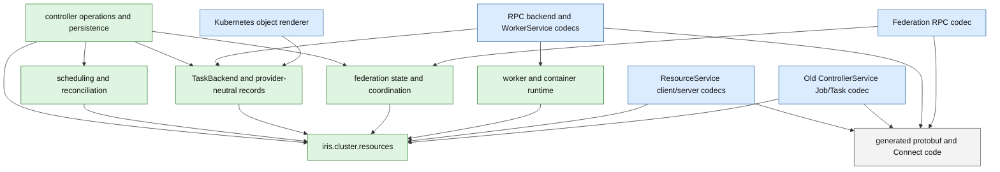

# Iris resource architecture and protobuf boundaries

Checkpoint `746b3ffeb9c3b0717887a8e07c55d8459e8e91f5` makes
`ResourceService` the first-party API for Jobs, Tasks, Attempts, Nodes, Slices,
and Endpoints. This document clarifies the remaining protobuf cleanup. It does
not propose a new controller, persistence, scheduler, federation, or backend
architecture.

The governing rule is narrower than “remove protobuf from Iris”: the old Job
model must not remain the in-process product model. Generated messages are
decoded at the transport that owns them. Frozen records in
`iris.cluster.resources` carry Job and resource semantics through clients,
admission, persistence, federation admission, and provider coordination.

## Why `job_pb2` still appears

At the checkpoint, `resource.proto` imports `job.proto`. Its `JobSpec` embeds
`iris.job.RuntimeEntrypoint`, `ResourceSpecProto`, `EnvironmentConfig`,
constraints, policies, and profiles; its Job and Task reads also use
`iris.job.JobState` and `iris.job.TaskState`. The resource wire therefore is not
yet independent of the old Job schema.

`job.proto` itself has two roles:

1. It defines the retained ControllerService Job and Task wire. That API is an
   old network boundary and has no first-party callers after this PR.
2. It defines messages used by the active worker protocol, including
   `RunTaskRequest`, `WorkerMetadata`, task observations, and related execution
   values. `worker.proto` and parts of `controller.proto` still import those
   declarations.

The first role is legacy. The second is an active transport contract. This PR
does not need to delete `job.proto` or renumber the worker wire. It must stop
using `job_pb2` as controller, persistence, scheduling, Kubernetes, client, or
federation application state.

## Current flow at the checkpoint

The red nodes are places where old generated Job values travel beyond the
transport that owns them.

```mermaid
flowchart LR
    classDef caller fill:#f3f3f3,stroke:#666,color:#111
    classDef wire fill:#dcecff,stroke:#2b67a0,color:#111
    classDef core fill:#dff5e1,stroke:#2f7d32,color:#111
    classDef leak fill:#ffe2dc,stroke:#b8432f,color:#111
    classDef store fill:#f4ebd0,stroke:#8a6d1d,color:#111

    resourceCaller[Resource client]:::caller
    oldCaller[Old ControllerService client]:::caller
    worker[Worker daemon]:::caller
    kubernetes[Kubernetes API]:::caller
    peer[Federation peer]:::caller

    resourceWire[resource.proto<br/>imports job.proto]:::leak
    oldWire[controller.proto + job.proto]:::wire
    workerWire[worker.proto + job.proto]:::wire

    resourceRpc[ResourceService adapter]:::wire
    oldRpc[Old Job/Task adapter]:::wire
    controller[ResourceController + JobResources]:::core
    persistence[Reads, writes, projections]:::leak
    scheduling[Scheduling and reconciliation]:::leak
    backend[TaskBackend]:::leak
    rpcBackend[RPC backend]:::wire
    k8sBackend[Kubernetes backend]:::leak
    federation[Federation manager and store]:::leak
    sqlite[(Controller SQLite)]:::store

    resourceCaller --> resourceWire --> resourceRpc --> controller
    oldCaller --> oldWire --> oldRpc --> controller
    controller --> persistence --> sqlite
    controller --> scheduling --> backend
    backend --> rpcBackend --> workerWire --> worker
    backend --> k8sBackend --> kubernetes
    controller --> federation --> peer
```

The resource server already converts most public responses to `resource_pb2`
at the RPC handler. The remaining leak begins with the Job specification and
execution types imported from `job.proto`. Those values are persisted as JSON,
cached as `RunTaskRequest`, passed through scheduling and backend contracts,
and rendered by worker or Kubernetes implementations.

## Target flow for this pull request

`resource.proto` owns the complete public resource wire. Both public RPCs
decode immediately into the same frozen resource records. Controller and
provider code consume those records. The retained worker RPC converts to
`job_pb2` only where it sends or receives the active worker transport.

```mermaid
flowchart LR
    classDef caller fill:#f3f3f3,stroke:#666,color:#111
    classDef wire fill:#dcecff,stroke:#2b67a0,color:#111
    classDef core fill:#dff5e1,stroke:#2f7d32,color:#111
    classDef store fill:#f4ebd0,stroke:#8a6d1d,color:#111

    resourceCaller[Resource client]:::caller
    oldCaller[Old ControllerService client]:::caller
    worker[Worker daemon]:::caller
    kubernetes[Kubernetes API]:::caller
    peer[Federation peer]:::caller

    resourceWire[Self-contained resource.proto]:::wire
    oldWire[controller.proto + job.proto]:::wire
    workerWire[worker.proto + job.proto]:::wire

    resourceRpc[Resource RPC codec]:::wire
    oldRpc[Old Job/Task codec]:::wire
    records[Frozen resource records]:::core
    controller[Existing controller operations]:::core
    persistence[Existing typed rows and JSON codecs]:::core
    scheduling[Existing scheduling and reconciliation]:::core
    backend[Existing TaskBackend contract]:::core
    rpcBackend[Worker RPC codec]:::wire
    k8sBackend[Kubernetes renderer]:::wire
    federation[Federation boundary codec + native store]:::wire
    sqlite[(Controller SQLite)]:::store

    resourceCaller --> resourceWire --> resourceRpc --> records
    oldCaller --> oldWire --> oldRpc --> records
    records --> controller
    controller --> persistence --> sqlite
    controller --> scheduling --> backend
    backend --> rpcBackend --> workerWire --> worker
    backend --> k8sBackend --> kubernetes
    controller --> federation --> peer
```

The arrows describe runtime data flow. They do not require one universal DTO.
Persistence rows, scheduling inputs, launch templates, and provider
observations may remain specialized frozen records. They share resource
identities, states, specifications, and exact-target semantics rather than
generated messages.

## Proto ownership

| Schema | Ownership after this PR | Where generated values may appear |
| --- | --- | --- |
| `resource.proto` | Canonical public resource RPC, including its own Job specification, states, resources, constraints, policies, and profile shapes | Resource client/server codecs and generated code |
| `controller.proto` | Retained old Job/Task RPC plus active controller administration and worker-registration transports | The corresponding ControllerService/client adapters |
| `job.proto` | Definitions required by the old ControllerService and active worker wire | Old Job/Task codec, worker RPC codec, generated code |
| `worker.proto` | Active controller-to-worker transport | RPC backend and WorkerService adapters |
| `iris_logging.proto`, `time.proto`, `query.proto`, `vm.proto` | Specialized transport schemas | Their narrow client/server codecs |

An import is not acceptable merely because the schema remains active. A module
may import a generated type only when that module serializes or deserializes
the owning transport. `TaskBackend`, persistence, scheduling, resource records,
federation state, and Kubernetes rendering are not protobuf boundaries.

## Python dependency direction

Core modules never import concrete network adapters. Existing composition roots
continue to construct `ResourceController`, `JobResources`, `TaskBackend`, and
federation implementations; this PR does not add a forwarding facade or a new
repository hierarchy.

## Bounded cleanup sequence

1. Make `resource.proto` self-contained while preserving field numbers, enum
   numbers, oneofs, and presence. Generate only its checked-in outputs.
2. Move Job specification, resource/device, environment/entrypoint,
   constraints, policies, states, and profiles to frozen Python records.
3. Convert the resource RPC and the old Job/Task RPC at their handlers. Keep
   exact old-wire behavior without re-export or in-process compatibility shims.
4. Preserve the current SQLite column and protobuf-JSON shapes while making
   persistence and cached launch templates native.
5. Pass provider-neutral launch and observation records through scheduling and
   `TaskBackend`. Encode `job_pb2`/`worker_pb2` only in the RPC backend and
   WorkerService; render Kubernetes objects from the same native launch.
6. Decode federation Job specifications and execution observations at the peer
   transport. Keep its authenticated wire and redrive behavior unchanged.
7. Update existing first-party clients, CLI, dashboard, configuration, and
   journeys only where they currently exchange the affected Job values.
   Ratchet every resolved generated import from the exact debt manifest.

This is one forward-only change. There is no dual internal model and no
controller option selecting old versus resource behavior.

## Behavior that proves the boundary

- A fully populated Job submitted through ResourceService survives controller
  reopen and describes with the same normalized specification.
- The retained ControllerService wrapper admits the same Job and returns the
  same identity, state, and error semantics.
- Mutable input mappings and sequences cannot change an admitted Job after
  construction.
- Existing persisted protobuf-JSON remains byte-shape compatible, including
  decimal strings for int64 constraint values and omitted-field defaults.
- One launch behaves the same through the RPC-worker fake and Kubernetes fake;
  deadline conversion preserves sub-second remainder instead of shortening it.
- Existing journeys continue to cover retry exhaustion, replacement, restart,
  federation outage/redelivery, exact Attempt actions, and Endpoint leases.
- A full-production import gate accounts for every generated import as a named
  transport adapter or fails on new and stale debt.

## Explicitly deferred

- Deleting or reorganizing `job.proto`, `controller.proto`, or `worker.proto`.
- Replacing `TaskBackend`, the scheduler, autoscaler, federation protocol, or
  controller composition.
- Splitting `ResourceController` into noun services or introducing a generic
  resource repository.
- A broader client facade or simultaneous redesign of all client-level value
  objects beyond the Job/resource values needed to close this boundary.
- Auth database and historical migration rollup.
- Attempt runtime sidecar persistence.
- Slice deletion and time-series Node utilization.
