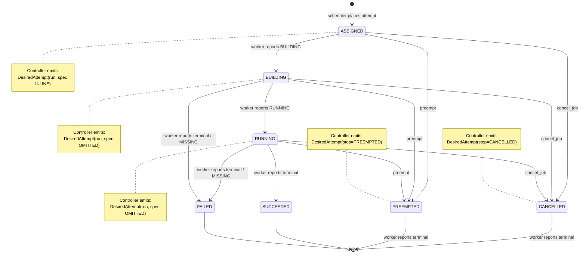

# Operation Puffin Bill — Iris Reconciliation Refactor

**Status:** Draft 3 — 2026-05-18. Revised twice after senior review.
**Scope:** Controller ↔ worker protocol, identity model, transition layer.
**Out of scope:** Scheduler internals (already pure), autoscaler, dashboard.
**Companion docs:** `sub/protocol.md`, `sub/identity.md`, `sub/transitions-split.md`, `sub/migration.md`, `sub/rollout.md`, `sub/comparison.md`.

## 1. Goals & Non-Goals

### Goals

1. **Replace `StartTasks` + `PollTasks` + `UpdateTaskStatus` + `GetTaskAttemptInfo` with a single `Reconcile` RPC.** Level-triggered, controller→worker.
2. **Introduce stable per-incarnation `attempt_uid`s.** Names remain user-facing; UIDs are the routing key.
3. **Split `transitions.py` into pure-compute + write-apply layers** so reconcile decisions are testable as `(inputs) → (outputs)` functions.
4. **Rolling upgrade**: new controller works with old workers; new workers work with old controllers; for at least one release cycle.

### Non-Goals

- **No leader election / controller HA.** Single-controller for now.
- **No streaming RPCs.** Unary Connect only.
- **No worker-initiated state push.** Workers serve `Reconcile`; controller drives the loop. Latency bounded by tick interval.
- **No event-driven wakes.** Controller's tick cadence is the only timing primitive. May reintroduce a wake mechanism later if measurement justifies it.
- **No scheduler changes.** Already pure.
- **No change to `TaskAttempt` lifecycle internally.** Bundle/build/run pipeline unchanged.
- **No fail-open worker** in this project. Acknowledged in §5.9 as design tension; left for a follow-up.

---

## 2. Current State

### 2.1 What works today (post the `iris-reconcile-only-worker` PR)

- **Polling loop** at `controller.py:1483 _run_polling_loop` ticks on `poll_interval` (default ≈250 ms) or wakes early on `_polling_wake.set()`. Each tick calls `_reconcile_worker_batch` at `controller.py:2168`:
  1. Read snapshot — line 2188. `reconcile_rows_for_workers` (single join over `tasks` × `task_attempts` filtered to live attempts).
  2. Fan out asyncio — `WorkerProvider.reconcile_workers` at `worker_provider.py:268`. Per worker: `StartTasks` (now a no-op stub) then `PollTasks(expected_tasks=...)`.
  3. Write — `_process_heartbeat_updates` applies returned `TaskUpdate`s in one transaction via `apply_heartbeats_batch` at `transitions.py:1689`. Cross-worker cascades (preemption, coscheduling, job-state recompute) ride this transaction.
- **Worker side**: `worker.py:_serve` waits passively. `handle_poll_tasks` receives `expected_tasks`, partitions into known/unknown/strays, fetches spec for unknowns via `GetTaskAttemptInfo`, returns observed status.
- **Scheduler** runs on its own thread (adaptive backoff 30–900 s). Pure function. Writes `ASSIGNED` rows the poll loop picks up on its next tick.
- **Liveness**: implicit. Controller successfully calling worker = worker alive. Worker's `_serve` deadline timer resets if no controller contact within `heartbeat_timeout` (default 600 s).

### 2.2 What's wrong / awkward

| Issue | Where | Why it matters |
|---|---|---|
| Four overlapping RPCs (StartTasks/StopTasks/PollTasks/UpdateTaskStatus + GetTaskAttemptInfo) | `worker.proto`, `controller.proto` | Each is a partial expression of "reconcile this worker." `StartTasks` is now a no-op stub. The StartTasks-before-PollTasks ordering at `worker_provider.py:209` is the visible artifact of the inconsistency. |
| Identity by `(task_id: JobName, attempt_id: int)` | `schema.py:783`, all RPCs | `JobName` is a reusable name. `attempt_id` resets per task. Same submitted name across job replacements collides on storage keys, log keys, container labels. |
| `transitions.py` interleaves read/decide/write | `transitions.py` (2781 lines) | Hard to unit-test scheduling decisions without spinning up SQLite. Cross-worker effects buried in nested calls. |
| Spec-fetch race in `GetTaskAttemptInfo` | `service.py:1600` | Worker polls with `(task_id, attempt_id)`, controller's `current_attempt_id` has moved on, response is `FAILED_PRECONDITION`. Avoidable if spec rides inline. |

### 2.3 What's already right

- **`scheduler.py` is pure** — zero runtime imports from controller state. Inputs are dataclasses (`WorkerSnapshot`, `JobRequirements`). We don't touch it.
- **Polling loop already has three phases**: read snapshot → fan-out without DB lock → batched write. The k8s controller-runtime shape. We keep it; we just clarify it.
- **`WorkerServiceImpl`** is a 168-line dispatcher with no logic. Adding `Reconcile` is mechanical.

The existing `_polling_wake` event is deleted in v3. The controller's tick interval becomes the only timing primitive. See §4.5.

---

## 3. Direction: Push, Pull, or Stream?

| Axis | Worker-pulls | Controller-pushes (Iris) | Bidi stream |
|---|---|---|---|
| Notification latency on spec change | up to poll | up to tick | RTT |
| Idle CPU | O(N/interval) workers polling | O(N/interval) controller ticking | ≈0 |
| Controller knows *which* worker needs attention | no | yes | yes |
| Works through NAT | yes | no | no |
| Connection state | none | per-call HTTP | persistent per worker |
| Debuggability | trivial | trivial | hard |

Iris workers are reachable; controller-push wins. We keep it.

**Single direction, controller → worker only.** Workers do not initiate state pushes. Anything the worker observes (container exit, build complete, etc.) propagates on the next controller tick. The latency cost is bounded by the tick interval (1 s today).

We do not implement leases (no HA controller). We do not implement streaming (operational pain not justified at our scale). We do not implement worker-initiated reconcile or wake events (latency bound is acceptable; can revisit with measurements).

---

## 4. Core Design

### 4.1 Identity

`attempt_uid` is the only wire-level routing key. 16 hex chars (128 bits, random, server-minted). On every `task_attempts` row. On every container label. On every log key.

**DB-only fields** (not on the wire):
- `job_uid` on `jobs` — disambiguates same-name resubmissions on the storage side. Internal joins and dashboards use it; the wire format never carries it.
- No `task_uid`. Tasks are addressed via `(attempt_uid)` (resolves to a task row through `task_attempts.task_id`).

**Wire-form discipline:**
- `JobName.to_wire()` and `to_safe_token()` are unchanged. Display-only.
- New `AttemptUid = NewType("AttemptUid", str)` for type discipline. `pyrefly` flags accidental mixing.

Detailed audit of consumers in `sub/identity.md`.

### 4.2 The Reconcile RPC

Single RPC, controller → worker, unary. Request carries desired state; response carries observed state.

```proto
message ReconcileRequest {
  string worker_id = 1;
  repeated DesiredAttempt desired = 2;        // complete expected set
}

message ReconcileResponse {
  string worker_id = 1;
  repeated AttemptObservation observed = 2;   // complete observed set
  WorkerHealth health = 3;
}

message DesiredAttempt {
  string attempt_uid = 1;
  oneof intent {
    AttemptSpec run = 10;
    StopReason stop = 11;
  }
  // Compat for Phase B (uid not yet on every row):
  string task_id = 100;
  int32 attempt_id = 101;
}

message AttemptSpec {
  iris.job.RunTaskRequest request = 1;        // OMITTED when worker is known to have it cached
}

message AttemptObservation {
  string attempt_uid = 1;
  iris.job.TaskState state = 2;
  int32 exit_code = 3;
  string error = 4;
  string container_id = 5;
  iris.time.Timestamp finished_at = 6;
  iris.job.ResourceUsage resource_usage = 7;
}

enum StopReason {
  STOP_REASON_UNSPECIFIED = 0;
  STOP_REASON_CANCELLED = 1;
  STOP_REASON_PREEMPTED = 2;
  STOP_REASON_SUPERSEDED = 3;
  STOP_REASON_JOB_TERMINATED = 4;
  STOP_REASON_TASK_TIMEOUT = 5;
  STOP_REASON_WORKER_DRAIN = 6;
}

service WorkerService {
  rpc Reconcile(ReconcileRequest) returns (ReconcileResponse);
}
```

**Semantics:**

- `desired` is the **complete** set of attempts the worker should currently be running. Anything the worker has that isn't in `desired` (and isn't terminal) gets stopped. Level-triggered.
- `observed` is the worker's complete current view of attempts it knows about — including freshly-terminal ones the controller hasn't yet acked.
- One RPC, one direction. The controller drives every state transition. The worker's role is reactive.
- No `controller_epoch`. No etags. No spec_required. See §4.3.

### 4.3 Spec dispatch: driven by DB attempt state

The worker caches `dict[attempt_uid, RunTaskRequest]` in memory for active attempts. The controller decides whether to include the spec inline using one rule, keyed only on the DB row's state:

> **The controller ships `AttemptSpec(request=...)` inline exactly when the attempt is in `ASSIGNED` state. For every other state (`BUILDING`, `RUNNING`, etc.) the spec is omitted; the worker is expected to have it cached from the assignment tick.**

That's the entire scheme. No hashing, no canonicalization, no `observed_uids` bookkeeping on the controller. An `attempt_uid` is one-shot — its spec is immutable for the lifetime of the attempt. If the spec needs to change, the scheduler places a *new* attempt with a new uid.

**Worker-side response to a no-spec dispatch:**
- Worker has the uid cached → reports its current observation (BUILDING / RUNNING / terminal).
- Worker has no record of the uid (cache lost: worker restart, or the spec was never delivered) → reports `AttemptObservation(uid=X, state=MISSING)`. The controller's apply layer transitions this attempt to `FAILED("worker_lost_spec")` and lets job-level retry/cascade decide what's next. The work isn't lost — only this incarnation is. The scheduler will place a fresh attempt with a new uid on the next tick.

**Cache lifetime** is in-memory only on the worker. Cold worker restart loses the cache; any attempts the controller still thinks are `BUILDING`/`RUNNING` on that worker fail forward via the `MISSING` path above, and the scheduler reissues. Persistence is a fail-open follow-up (§5.9), not a protocol concern.

### 4.4 Dispatch state machine



### 4.5 The reconcile loop (controller side)

Fixed-interval timer. No wake event. Tick every `reconcile_interval` (default 1 s). Each tick:

```python
def _run_polling_loop(self, stop_event):
    interval = self._config.reconcile_interval.to_seconds()
    while not stop_event.is_set():
        stop_event.wait(timeout=interval)
        if stop_event.is_set():
            break
        self._reconcile_worker_batch()

def _reconcile_worker_batch(self):
    # ── Phase 1: read snapshot ─────────────
    with self._db.read_snapshot() as snap:
        addresses = self._store.workers.list_active_healthy(snap)
        rows = self._store.attempts.reconcile_rows_for_workers(snap, worker_ids)

    # ── Phase 2: per-worker pure compute ─────────────
    # Spec dispatch is keyed only on DB attempt state (ASSIGNED → inline).
    # No per-worker observed-uid bookkeeping on the controller.
    plans = []
    for wid in worker_ids:
        inputs = build_reconcile_inputs(snap, wid)
        plans.append(reconcile_worker(inputs))      # pure function in reconcile.py

    # ── Phase 3: fan out concurrent RPCs (no DB lock) ─────────────
    results = self._provider.reconcile_workers(plans)

    # ── Phase 4: batched apply (one transaction across all workers) ─────────────
    with self._db.transaction() as cur:
        for result in results:
            apply_reconcile_response(cur, result.plan, result.response)
```

The pure function `reconcile_worker` produces a `WorkerReconcilePlan` (the wire payload). The wire layer (`reconcile_workers`) speaks either Reconcile (new workers) or StartTasks/PollTasks (legacy compat shim) based on capability. Phase 4 batches all workers' state transitions and cascades into one transaction — same as today's `apply_heartbeats_batch`.

**No `_polling_wake`.** The current event is deleted along with all its `.set()` callers. Producers that today wake the loop (`submit_job`, `cancel_job`, scheduler completion) simply write to the DB; the next tick picks them up.

**Shutdown is the only signal.** The `stop_event.wait(timeout=interval)` pattern above doubles as the shutdown break — when `stop()` sets `stop_event`, the timer wait returns immediately and the loop exits. The current `_polling_wake.set()` at `controller.py:1397-1398` is part of the shutdown path; when removing the wake event, verify in code review that `stop_event.set()` is the sole shutdown signal and the timer breaks on it.

**Tick interval = 1 second.** This matches today's `poll_interval` default (`controller.py:988`). 1 s is acceptable across every UX path. If a use case ever needs sub-1 s response, reintroduce a targeted wake for that specific producer — but only with measurements showing the latency is genuinely insufficient.

### 4.6 Pure transitions

`reconcile_worker(inputs) → outputs` is a pure function. New module `controller/reconcile.py`. Inputs are a dataclass; outputs are a `WorkerReconcilePlan` (the RPC payload to send) and a `list[TransitionDelta]` (DB writes to apply on RPC success).

The TransitionDelta types and refactor plan are in `sub/transitions-split.md`. The structural goal: `transitions.py` shrinks to an apply layer. The decision logic — "given observed and desired, what state transitions fire" — lives in `reconcile.py` and is unit-testable without SQLite.

---

## 5. Open Questions, Resolved

### 5.1 How do UIDs work during the interim?

Phase A (no UIDs): all routing by `(task_id, attempt_id)`. UID column doesn't exist.

Phase B (Reconcile RPC, still no UIDs): wire uses `task_id` + `attempt_id` fields on `DesiredAttempt` / `AttemptObservation`. The `attempt_uid` field exists in the proto but is left empty. No code reads it. The Reconcile semantics work fine with composite keys.

Phase C (UIDs added, dual-routing): migration adds the column with backfill (`sub/migration.md`). All RPC messages now carry `attempt_uid` as the primary routing key but also include `(task_id, attempt_id)` fallback fields. Worker prefers UID when set. Controller dispatches with both populated.

Phase D (cleanup): legacy fields deprecated. Compat fields stay in proto with `[deprecated = true]` annotation for one more release, then removed.

### 5.2 How do we roll out a new controller against old workers?

Capability declared in `Register` response. Old workers don't implement `Reconcile` (return `NOT_FOUND`). Controller's per-worker reconciler picks the wire layer based on capability:

```python
if worker.supports_reconcile_rpc:
    response = await stub.reconcile(message)
else:
    response = await legacy_translator.fan_out(message)  # StartTasks + PollTasks + Stops
```

Both paths consume the same `WorkerReconcilePlan`. The legacy translator is a 60-line module that takes the pure-compute output and translates to old RPCs. Full table in `sub/protocol.md`.

### 5.3 Full reconcile matrix: (DB state) × (worker observation)

The pure function `reconcile_worker` and the apply layer `apply_reconcile_response` together implement the following matrix. Rows index the DB attempt state (controller's view); columns index what the worker reports in `observed` for that uid.

| DB state ↓ / Worker obs → | (no record / MISSING) | BUILDING | RUNNING | terminal (SUCCEEDED / FAILED) |
|---|---|---|---|---|
| **ASSIGNED** | dispatch: `run(spec INLINE)`. No DB write — worker hasn't built yet. | dispatch: `run(no spec)`. DB write: `attempt → BUILDING`. | dispatch: `run(no spec)`. DB write: `attempt → RUNNING`. | dispatch: `run(no spec)`. DB write: `attempt → terminal`; fire cascades. (Build raced; worker observed and finished within one tick — rare but legal.) |
| **BUILDING** | dispatch: `run(no spec)`. DB write: `attempt → FAILED("worker_lost_spec")`; fire cascades. | dispatch: `run(no spec)`. No DB write. | dispatch: `run(no spec)`. DB write: `attempt → RUNNING`. | dispatch: `run(no spec)`. DB write: `attempt → terminal`; fire cascades. |
| **RUNNING** | dispatch: `run(no spec)`. DB write: `attempt → FAILED("worker_lost_spec")`; fire cascades. | (illegal — RUNNING shouldn't regress to BUILDING; log ERROR, treat as RUNNING.) | dispatch: `run(no spec)`. No DB write. | dispatch: `run(no spec)`. DB write: `attempt → terminal`; fire cascades. Apply must not overwrite an existing terminal `finished_at`. |
| **CANCELLED** | dispatch: `stop(CANCELLED)`. No DB write (already CANCELLED). | dispatch: `stop(CANCELLED)`. No DB write. | dispatch: `stop(CANCELLED)`. No DB write. | dispatch: `stop(CANCELLED)`. DB write: `attempt → terminal` (records the actual exit); fire cascades. |
| **PREEMPTED** | dispatch: `stop(PREEMPTED)`. No DB write. | dispatch: `stop(PREEMPTED)`. No DB write. | dispatch: `stop(PREEMPTED)`. No DB write. | dispatch: `stop(PREEMPTED)`. DB write: `attempt → terminal`; fire cascades. |
| **terminal (DB)** | omitted from `desired`. No DB write. | (impossible — terminal in DB shouldn't have a non-terminal observation in the same incarnation; if seen, log ERROR.) | omitted from `desired` → worker auto-stops as zombie. Log audit. | omitted from `desired`. No DB write. |
| **(no DB row, uid exists on worker)** | n/a | omitted → worker auto-stops. Log audit at WARN with `attempt_uid`. | omitted → worker auto-stops. Log audit at WARN. | omitted. Worker keeps the terminal record locally until evicted. |

**Controller as source of truth.** Right column ("no DB row") makes this explicit: if the controller has no record for an attempt the worker is running, the worker should stop it. Manually deleting a task row in the DB *should* result in killing the corresponding container. There is no "wait for the worker to register before issuing kills" invariant — `desired` is built from DB state alone. If a worker isn't reachable, no RPC fires and no kills propagate; when it is reachable, DB-derived `desired` is the truth.

**Spec dispatch invariant.** Inline `AttemptSpec(request=...)` is sent in exactly one cell of the matrix: `(ASSIGNED, no record)`. Every other dispatch sends `run(no spec)` or `stop(...)`. The worker is responsible for caching the spec between the ASSIGNED dispatch and the attempt reaching terminal; if it loses it (cache cleared, worker restart), the attempt fails forward via the `worker_lost_spec` path.

### 5.4 Do we need a verification handshake before destructive GC?

No, for the same reason as v1: SQLite single-writer is the source of truth, no Raft-style staleness. Add an INFO-level audit log on every "stopped because not in desired" so we can debug if it ever fires unexpectedly. Revisit if we move to a distributed backing store.

### 5.5 Reconcile cadence

**1 second.** Fixed. The tick interval is the only timing primitive in the design. This matches today's `poll_interval` default (`controller.py:988`).

- Cancellation: ≤ 1 s for the stop-intent to reach the worker.
- Assignment: ≤ 1 s between scheduler write and worker receiving spec. Job submit→start latency is dominated by bundle download and container build (tens of seconds); 1 s of dispatch is in the noise.
- Terminal-state propagation: ≤ 1 s between container exit and controller learning. Coscheduled-sibling cascades fire on the *next* tick after the terminal observation, so total cascade convergence is ≤ 2 s.

No wake event. At 1 s tick the wake-event optimization saves ~500 ms median, which doesn't justify the complexity. The simpler invariant — "one timer is the only timing primitive" — pays off in code reviews, debugging, and pedagogy.

**Floor on tick interval**: the batched-apply transaction in Phase 4 of the reconcile loop runs in tens to low-hundreds of milliseconds at fleet scale. 200 ms is the practical floor; below that the apply transactions overlap. Document this in the config.

### 5.6 Cancellation latency

User clicks Cancel → `transitions.cancel_job` writes `state=CANCELLED` to affected tasks. Next reconcile tick (≤ 1 s) propagates `DesiredAttempt(intent=stop)` to relevant workers.

Today's behavior: same write, then a wake event causes propagation within RTT. v3 removes the wake; cancellation takes up to 1 s on top of write-to-DB time. Practical user-visible latency: comparable. Not a regression worth engineering around.

### 5.7 Container adoption across the deploy boundary

Today, `adopt_running_containers` (`worker.py:339`) matches by docker label `(task_id, attempt_id)`. Phase C adds an `attempt_uid` label. Containers spanning the deploy:

- A container started under Phase B has labels `task_id=…, attempt_id=N`, no `attempt_uid`.
- The post-Phase-C worker reads the container. If `attempt_uid` label is missing, it falls back to `(task_id, attempt_id)` matching against its expected_tasks. This is exactly today's path, preserved.
- The controller, dispatching to a Phase-C worker, sends `DesiredAttempt(attempt_uid=…, task_id=…, attempt_id=…)`. Worker's match logic tries UID first, falls back to composite.

The Phase C migration backfills `attempt_uid` for all DB rows including currently-running attempts. So a container running during the deploy gets a UID stamped into the DB but its docker label doesn't have it. The worker's adoption logic must therefore:
1. Try to read `attempt_uid` label from the container.
2. If absent, look up the attempt by `(task_id, attempt_id)` to get the UID.
3. Tag the in-memory `TaskAttempt` with the UID for future Reconcile responses.
4. Optionally relabel the docker container with the UID (best-effort; not required for correctness).

The fallback works because composite keys remain unique through the entire phase plan (the PK swap in Phase D doesn't happen until C is stable for one release). Detail in `sub/identity.md`.

### 5.8 Side-channel addressing

`ExecInContainer`, `ProfileTask`, `finelog` log streaming all currently key by `(task_id, attempt_id)`. They're orthogonal to Reconcile.

- **`ExecInContainer`**: keep keying by `task_id` (most-recent attempt). Operator addressing is by task, not by attempt. Add an optional `attempt_uid` for the rare case "exec into a *specific* attempt" — useful for debugging.
- **`ProfileTask`**: same. Mostly used via `/job/.../task/N:attempt` wire form; the resolver already handles this. Add UID support.
- **`finelog` log streaming**: `task_log_key` in `log_store_helpers.py` keys by `task_attempt.to_wire()` which is `/user/job/task:attempt`. Migrate this to use `attempt_uid` in Phase C — log keys are durable storage references, getting them right matters. Dashboards that fetch logs by `(task_id, attempt_id)` resolve to UID via a DB lookup. Migration backfill includes a UID column on the existing log keys.

### 5.9 Fail-open tension

Today: when the controller is unreachable, the worker's `_serve` deadline timer (10 min default) fires `_reset_worker_state` which kills all containers. Fail-closed.

This is wrong for long TPU jobs. Borg's Borglet is fail-open: existing tasks keep running indefinitely even when Borgmaster is unreachable.

The v3 design doesn't change today's fail-closed behavior, and it doesn't make fail-open meaningfully harder either: today's worker also doesn't persist spec across restarts. The only related design choice is that the worker-side spec cache lives at a single well-defined location (`worker/reconcile.py:SpecCache`), so a future fail-open project can decide on persistence without touching the wire protocol. Code review on Phase B/C should keep that locality.

Fail-open is a follow-up project, not Operation Puffin Bill scope.

---

## 6. Module Structure & New Files

```
lib/iris/src/iris/cluster/controller/
├── reconcile.py            # NEW: pure reconcile_worker, TransitionDelta types,
│                           #      and the Phase-B legacy translator (deleted in Phase D)
└── transitions.py          # MODIFIED: thin apply layer; cascades stay

lib/iris/src/iris/cluster/worker/
├── reconcile.py            # NEW: handle_reconcile + in-memory SpecCache
└── worker.py               # MODIFIED: delegates handle_reconcile to new module

lib/iris/src/iris/cluster/
└── types.py                # MODIFIED: AttemptUid NewType; JobName unchanged

lib/iris/src/iris/rpc/
├── worker.proto            # MODIFIED: + Reconcile RPC
└── controller.proto        # MODIFIED: + Reconcile RPC, Register response gains capabilities
```

DB schema additions in `sub/migration.md`. Method-by-method refactor of `transitions.py` in `sub/transitions-split.md`.

---

## 7. Phased Rollout

**Four phases, ~5 PRs.** Compatibility matrix and rollback in `sub/rollout.md`.

### Phase A — Pure-compute split (1 PR; ships first; no protocol or schema change)
- New `controller/reconcile.py` with `reconcile_worker(inputs) → outputs` and a `legacy_translator` helper that turns the output into today's `StartTasks`/`PollTasks`/`StopTasks` plans.
- `_reconcile_worker_batch` calls `reconcile_worker` per worker, then passes plans to today's wire layer via `legacy_translator`.
- **No behavior change.** Same wire, same DB, same locks. Unit tests for `reconcile_worker` against handwritten inputs.
- **Rollback**: revert PR.

### Phase B — Reconcile RPC keyed by `(task_id, attempt_id)` (2 PRs; UIDs not required)
- PR B1: add `Reconcile` RPC + messages to both `worker.proto` and `controller.proto`. Regenerated stubs. `Register` response gains `WorkerCapabilities`. No callers.
- PR B2: worker implements `handle_reconcile`. Controller dispatches via Reconcile when `worker.supports_reconcile_rpc=true`, else via legacy. Feature-flagged on the controller side (`IRIS_RECONCILE_RPC_ENABLED`, default false).
- Roll the flag to true once the canary worker has been stable for 48 h.
- After flag is on for one release: **Reconcile is the steady-state wire**, legacy is fallback.
- Wire still uses `task_id` + `attempt_id` fields. The `attempt_uid` field is empty.
- **Rollback**: flag off; legacy wire resumes.

### Phase C — Add `attempt_uid` as additive routing key (2 PRs)
- PR C1: migration 0027 — add UID columns to schema, backfill, secondary indexes (see `sub/migration.md`).
- PR C2: code paths plumb `attempt_uid` through Reconcile, log keys, container labels. Composite key remains valid; UID is preferred when populated.
- Feature flag `IRIS_UID_PRIMARY_KEY=false` (still routing by composite key under the hood). UID is observed but not load-bearing.
- After two release cycles of UID-populated wire: flip flag, route by UID.
- **Rollback**: flag off; routing reverts to composite. Code is dual-pathed so this is real.

### Phase D — Cleanup (1 PR; gated on Phase C stable for one release)
- Migration 0028 — promote `attempt_uid` to primary key, demote `(task_id, attempt_id)` to unique secondary.
- Remove legacy `StartTasks`/`StopTasks`/`PollTasks`/`UpdateTaskStatus`/`GetTaskAttemptInfo` from proto and code.
- Hard rule: all workers must be on a binary ≥ Phase B for one release cycle. Tracked via `workers` audit log.
- **Rollback**: ugly. Revert migrations is a maintenance-window operation. Practically: forward-fix.

Total: ~6 PRs over 4 phases. (v1 spec proposed 8 over 6.)

---

## 8. Testing Strategy

### 8.1 Pure-function tests (highest leverage)

`reconcile_worker(inputs) → outputs` is the centerpiece. Test every cell of the §5.3 matrix plus:
- Spec inline iff DB state is ASSIGNED (the dispatch invariant).
- BUILDING/RUNNING with worker MISSING → emit no-spec dispatch; apply layer flips attempt to `FAILED("worker_lost_spec")`.
- Incarnation collision (same task_id, different uid; old uid not in desired → stops as zombie).
- Stop-for-each-reason (one test per `StopReason`).
- Terminal in DB → omitted from desired regardless of worker view.

~25 unit tests cover the decision space.

### 8.2 Integration tests (`tests/cluster/`)

- Controller + in-process worker, real DB, real Reconcile RPC end-to-end.
- Mixed-version test: controller speaks Reconcile, worker only legacy. Verify state convergence via compat shim.
- Worker-restart test: kill worker, controller has RUNNING attempts, new worker registers, controller resends specs, worker adopts containers.
- Controller-restart test: same RUNNING attempts, controller cold-starts, sends specs to all workers, fleet reconverges.

### 8.3 E2E

Existing `tests/e2e/test_smoke.py` runs both with feature flag on and off during Phase B-C. CI matrix covers both.

### 8.4 Chaos

Add chaos hooks:
- `controller.reconcile.fail` — drop reconcile responses, verify next-tick reconvergence.
- `worker.reconcile.delay` — slow worker, verify controller doesn't pile up parallel RPCs (the per-worker reconciler in `_reconcile_one` is the relevant guard).
- `worker.reconcile.spec_mismatch` — worker reports observed state inconsistent with DB; verify cascade handling.

---

## 9. Risks & Rollback

| Risk | Likelihood | Mitigation |
|---|---|---|
| Phase C migration slow on prod DBs | Medium | Test on prod snapshot; chunked backfill (1 K rows / statement); can run offline if needed. |
| Phase B compat shim has bugs | Medium | Feature flag, single-worker canary, 48 h soak. |
| Worker-spec-cache eats memory on a high-cardinality worker (1000s of attempts) | Low | LRU evict at 10k entries; old attempts terminal anyway. |
| Worker loses spec cache mid-attempt (restart) | Medium | Attempt fails forward via `worker_lost_spec` (§5.3); scheduler reissues under a new uid. |
| Phase D irreversible | Medium | Gate on Phase C stable ≥1 release; forward-fix is the realistic rollback story. |

Per-phase rollback in `sub/rollout.md`.

---

## 10. Appendices

Sub-documents in `sub/`:

- **`protocol.md`** — Full proto with field-by-field semantics, error codes, retry/idempotency, compat-shim translation table, wire examples.
- **`identity.md`** — UID type system, `JobName` API delta, consumer-by-consumer migration table.
- **`transitions-split.md`** — Method-by-method audit of `transitions.py`, `TransitionDelta` types, refactor PR sequence.
- **`migration.md`** — DB migration 0027 walked through, backfill performance test plan, rollback story.
- **`rollout.md`** — Compatibility matrix per phase, feature-flag plan, canary plan, operator escape hatches.
- **`comparison.md`** — Full prior-art table (k8s, Nomad, Mesos, Ray, Slurm, ECS, Temporal, Borg) with cited source paths.

Start with `comparison.md` for design context; `transitions-split.md` for implementation reviewers.
