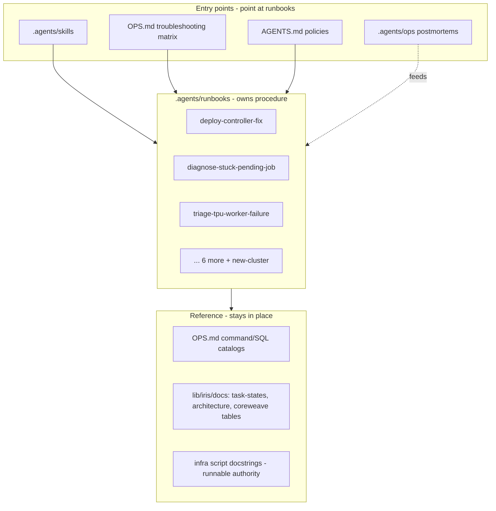

# Plan: Ops Runbooks — situation-walkthroughs as the single source of operational procedure

## Why

Marin's operational knowledge is spread across four surfaces that each restate
pieces of the other three:

- **`OPS.md`** (`lib/iris`, `lib/zephyr`, `experiments/ferries`) — mixes *reference*
  (command catalogs, SQL schemas, connection selectors) with *procedure*
  (controller restart, TPU bad-node recovery, offline analysis).
- **Agent skills** (`.agents/skills/*`) — task playbooks. Some already point at
  OPS.md (`restart-iris`, `debug`); others restate procedure inline.
- **Postmortems** (`.agents/ops/*`) — incident narratives that contain the *best*
  diagnosis flows we have, but they are dated one-offs nobody re-reads.
- **`AGENTS.md`** — house rules, but with a few operational policies (never
  restart a cluster, never cross-region large data) duplicated 3–4 times.

The same situation — "restart the controller to deploy a fix" — is documented in
`lib/iris/OPS.md:21-30`, the `restart-iris` skill, `lib/iris/docs/image-push.md`,
and the 2026-06-08 postmortem, with the load-bearing nuance (rebuild the image
*first*, because `:latest` is pinned) living in only one of them. That gap cost
~5 red-canary days.

A **runbook** is the missing primitive: a markdown walkthrough of one recurring
operational *situation* — what sends you here, how to diagnose, how to fix, how
to verify, and *why* it happens. Runbooks own the procedure; `OPS.md` keeps the
reference and links to them; skills point at them; postmortems feed them.

The persona driving this is `ops-steward` (`.agents/agents/ops-steward.md`):
canonical source owns the truth, runnable beats written, standardize then
propagate, don't gold-plate.

## Decisions (settled)

- **Home: `.agents/runbooks/`.** Sits beside `.agents/ops/` (postmortems) and
  `.agents/skills/` (task playbooks); the whole `.agents/` tree mirrors into
  `.claude/`, so runbooks are discoverable to every agent session. The
  operational surface spans iris + zephyr + finelog + infra + ferries, so one
  repo-wide home beats fragmenting per-subproject. (`docs/` is user-facing
  product docs in the MkDocs nav — not the place.)
- **Naming: undated kebab-case** (`deploy-controller-fix.md`), matching skill
  directory names. Runbooks are living docs, not dated incidents.
- **Format:** light front-matter (`name`, `description`) + a fixed section
  skeleton (When you're here / TL;DR / Before you touch anything / Diagnose /
  Resolve / Verify / Why / See also). Template lives in
  `.agents/runbooks/README.md`.
- **Reference stays put.** Command catalogs, SQL schemas, connection selectors,
  `task-states.md`, architecture docs, infra script docstrings, and the
  CoreWeave config tables remain where they are; runbooks **link** to them and
  never restate them.
- **Aggressive de-dup (single source).** Every *procedure* lives in exactly one
  place. When a runbook owns a procedure, the duplicated prose elsewhere is
  *deleted* and replaced by a one-line pointer — not left in place with a link
  bolted on. Rationale (user): more duplication = more chances for staleness.
  The only inline survivors are bare *policy* statements at their canonical home
  (e.g. the never-restart prohibition in `AGENTS.md`, which links to the runbook
  for the nuance) and at-a-glance *reference* (command/SQL catalogs), which is
  not duplication — reference and procedure are split, each in one place,
  cross-linked.
- **Troubleshooting matrix stays as an index.** The OPS.md troubleshooting table
  and Known-Bugs list remain at-a-glance indexes; rows that have a runbook become
  one-line pointers into it.
- **Skills that are already runbooks stay skills.** `babysit-job`,
  `babysit-zephyr`, `manage-hero-run`, `triage-canary`, `run-ferries` own
  loop/lifecycle logic OPS.md lacks. They are *not* re-extracted into
  `runbooks/`; they only lose their duplicated *reference* listings to OPS.md /
  runbook links.

## Diagram

## Tasks

First slice (this branch / PR) — the three triple-duplicated situations, chosen
because each is independently reported across an OPS.md section **and** a skill
**and** a postmortem, so the consolidation value is provable immediately:

- #165 Establish `.agents/runbooks/` home: `README.md` (index + template +
  conventions) and an `AGENTS.md` "Runbooks" pointer so agents discover them.
- #166 `deploy-controller-fix` — consolidates `OPS.md:21-30` +
  `restart-iris` skill + `image-push.md` + 2026-06-08 postmortem. Establishes the
  **never-full-restart** cross-cutting policy as a single referenced statement
  (its load-bearing home).
- #167 `diagnose-stuck-pending-job` — collapses the generic `OPS.md:208-210`
  PENDING row + the scheduler-freeze and reservation-taint postmortems into one
  decision tree (capacity vs frozen scheduler vs reservation EQ-taint). The
  "uniform pending-reason across many jobs ⇒ not capacity" heuristic, proposed in
  two postmortems, still does not exist in OPS.md.
- #168 `triage-tpu-worker-failure` — highest foot-gun: `OPS.md:257-266` tells you
  to *delete the node* on "No accelerator found", but the tpu-wedge postmortem is
  exactly the case where that is wrong. Adds the wedged-container-vs-bad-node
  disambiguation before the destructive step.

Remaining situations (#169 — now also in this branch / PR, the user chose to land
the whole pattern in one PR):

- `offline-checkpoint-analysis` — copy-the-checkpoint + duckdb-over-GCS; OPS.md's
  half-stated rule collapses to a pointer.
- `repair-task-attempts-invariant` — detection-query index for the ghost-co-tenant
  / orphan-attempt / split-slice family; Known Bug #1 points here.
- `tpu-ci-fleet` — net-new, thin pointer over the `infra/tpu-ci/` docstrings; adds
  `infra/tpu-ci/README.md` + an OPS.md CI-Workflows pointer (zero prior coverage).
- `finelog-rollout-rollback` — net-new (finelog has no OPS.md); `lib/finelog/AGENTS.md`
  gains an Operations pointer.
- `run-datakit-ferry-manually` — owns the submit/stop/validate triple;
  `experiments/ferries/OPS.md` collapses to a pointer (and a stale workflow path
  `marin-smoke-datakit.yaml` → `marin-canary-datakit-tier{1,2,3}.yaml` fixed).
- `stand-up-coreweave-cluster` — the guarded walkthrough; `coreweave.md` stays the
  detailed reference (the runbook points into it) and gets a top pointer.
- `new-cluster` — the from-scratch bootstrap order (the `ops-survey` #1 gap);
  `infra/README.md` links it.

Cross-cutting policy consolidation done this PR: the cost/cross-region guardrail
is now single-sourced with a 10 GB `TransferBudget` ceiling in `/AGENTS.md`, and
`lib/marin/AGENTS.md` + `experiments/AGENTS.md` defer to it (no more "few MB" vs
"10 GB" drift). The RPC-over-SSH posture was left as two complementary statements
(profiling-specific in iris OPS.md; request-new-tools in zephyr OPS.md) — not true
duplication, so not merged.

## Cross-cutting policies (single home, referenced everywhere)

| Policy | Duplicated at | Canonical home |
|---|---|---|
| Never restart/bounce a cluster without permission | `AGENTS.md:47`, `OPS.md:24`, `restart-iris:10`, `manage-hero-run:16`, `debug`, `babysit-job` | `deploy-controller-fix` runbook owns the nuance; others keep the bare prohibition + link |
| Never cross-region/internet large data; no STS without Percy-grants | `AGENTS.md`, `lib/marin/AGENTS.md`, `experiments/AGENTS.md` | **Done:** single cost-guardrail with a 10 GB `TransferBudget` ceiling in `/AGENTS.md`; the other two defer to it (killed the "few MB" vs "10 GB" drift) |
| Prefer `iris process` RPC over SSH | `OPS.md:84-85`, `lib/zephyr/OPS.md:117-119` | Left as-is — two *complementary* statements (profiling-specific vs request-new-tools), not true duplication |

## Not now

- A wholesale move of `coreweave.md` or per-subproject OPS.md into runbooks — too
  large for the first slice; carve incrementally (#169).
- Auto-validation of runbook `file:line` citations — `check_docs_source_links.py`
  only covers `docs/`, and line citations drift; not worth a new linter yet.
