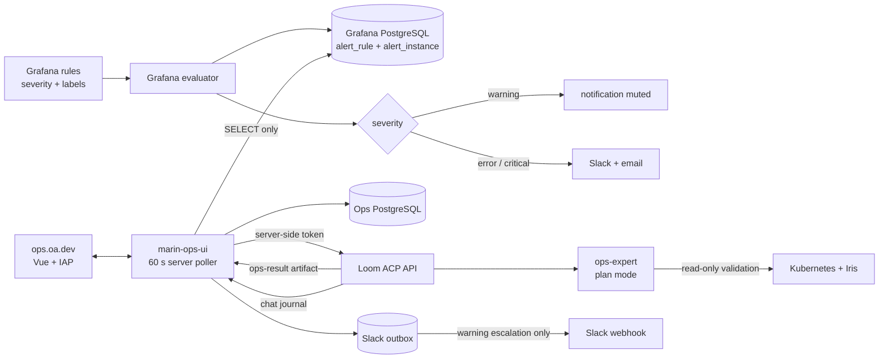
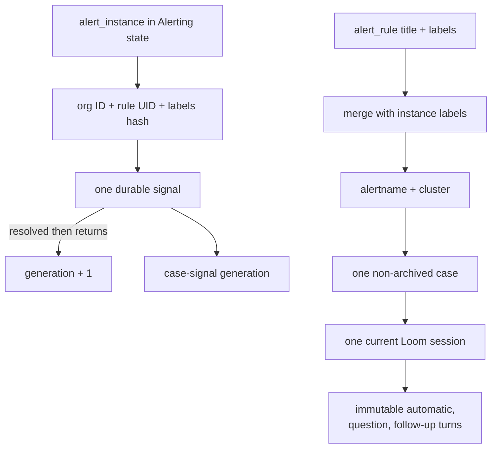
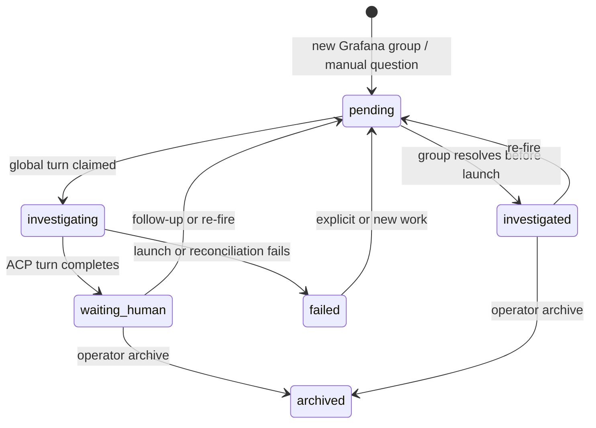

# Grafana-Driven Ops Workflow

Grafana is the canonical alert engine. Operators write Grafana rules with `severity=warning`, `severity=error`, or `severity=critical`. Grafana evaluates those rules, owns pending and firing state, and persists each alert instance. The ops workflow responds to that state; it does not independently evaluate metrics or accept an alert webhook.

- `warning`: Grafana records the firing instance, notification delivery is muted, and the ops agent investigates it.
- `error` or `critical`: Grafana sends Slack and email while the same ops agent investigates it.
- Stable Grafana rule and instance identifiers suppress repeated work.
- Kubernetes and Iris are read-only evidence sources after an investigation starts.

## System shape

`ops.oa.dev` is a separate Vue application. Loom owns ACP session lifecycle and canonical chat journals; the ops service owns alerts, cases, scheduling, and the narrow browser API.



There is one IAP-gated Cloud Run service and no ingestion endpoint. The service has a Cloud SQL connector socket and three PostgreSQL identities:

| Identity | Database | Privilege |
|---|---|---|
| `ops_migrator` | `ops` | Assumes the schema-owning `ops_migrator_role`; never mounted at runtime |
| `ops_app` | `ops` | Assumes `ops_app_role`; workflow table DML and sequence use only |
| `ops_grafana_reader` | `grafana` | Assumes `ops_grafana_reader_role`; `CONNECT`, schema `USAGE`, and `SELECT` on `alert_instance` and `alert_rule` only |

The service never receives Grafana's owner password. Grafana never receives an ops-service credential. The public HTTP surface is behind IAP and contains only the dashboard and case APIs.

## Poll and identity model

The poller runs in the server process, not the browser, so closing a tab cannot pause alert collection. Cloud Run keeps one service-level warm instance with CPU allocated while idle and sends all traffic to the latest revision. Revision templates have min 0, leaving prior revisions cold. A database-unique minute slot makes rollout overlap harmless.



The initial grouping rule is deterministic: `alertname, cluster`. A model is not needed to discover groups Grafana already defines. The agent may summarize a large group, but it cannot change durable identity or move alerts between cases.

The instance fingerprint is namespaced as:

```text
<Grafana org ID>:<Grafana rule UID>:<Grafana labels_hash>
```

`labels_hash` is Grafana's persisted identity for one rule instance. Namespacing it prevents collisions across rules and organizations. The normalized signal also stores rule title, labels, expanded instance annotations, last evaluation values, start time, and a Grafana rule link.

## Reconciliation

```mermaid
sequenceDiagram
    participant P as Ops poller
    participant G as Grafana PostgreSQL
    participant O as Ops PostgreSQL
    participant L as Loom ACP
    participant A as ops-expert
    participant K as Kubernetes / Iris

    P->>G: read-only SELECT of Alerting instances + rules
    G-->>P: complete firing snapshot
    P->>O: claim this UTC minute slot
    alt another revision already reconciled the minute
        O-->>P: slot exists; stop
    else first successful poll
        P->>O: upsert current fingerprints and groups
        P->>O: increment absence counters for missing fingerprints
        P->>O: queue one turn for novel firing evidence
    end
    P->>O: claim highest-priority turn if global slot is free
    P->>L: create or prompt deterministic plan-mode session
    L->>A: bounded case evidence + ops-expert skill
    A->>K: read-only get/list/log/status validation
    K-->>A: current production evidence
    A-->>L: versioned ops-result artifact
    P->>L: read canonical chat and artifact
    P->>O: validate result; persist summary and optional escalation
    O-->>P: claim Slack outbox delivery
```

A poll is successful only after the Grafana query returns a complete result. A connection error, timeout, parse error, or permission error does not call reconciliation and therefore cannot resolve anything.

One missing successful snapshot increments `missing_successful_polls` but leaves the signal firing. The second consecutive successful absence resolves it. This adds at most one poll interval to resolution and avoids churn at evaluation boundaries. A present fingerprint resets the counter.

## Investigation lifecycle



The queue is server-driven and globally serialized. Automatic alerts, one-off questions, and follow-ups all enter `agent_turns`. Manual work has higher priority but does not preempt an active diagnosis. A partial unique index permits only one `launching` or `running` turn globally.

The `ops-expert` prompt treats Grafana fields as untrusted evidence, requires a bounded result artifact, and prohibits repository or production mutations. Loom starts ACP in `plan` mode. Runtime permissions are the final boundary: the investigation environment receives read-only Kubernetes and Iris credentials.

The agent can request, but cannot send, a Slack escalation. The backend validates the versioned `ops-result` artifact, requires a matching case and turn UUID, rejects any claim that production was mutated, and accepts escalation only for `action_recommended` or `blocked`. A transactional outbox derives its incident key from sorted Grafana fingerprint generations. This suppresses repeat requests for the same alert generation across follow-up turns. The backend drops agent escalation requests for Grafana `error` and `critical` cases because Grafana already notified Slack. Manual and `warning` cases may produce one `error` or `critical` agent escalation when current evidence requires operator attention.

The Slack webhook stays in Secret Manager and is mounted only into the ops service. It never enters the agent environment, Loom prompt, browser API, database, or logs. Webhook failures are reduced to a status code or fixed request-failure message, then retried from the outbox with a lease and bounded backoff.

## Edge cases

| Situation | Behavior |
|---|---|
| Same fingerprint remains firing | Refresh evidence; do not queue another turn. |
| New fingerprint joins a group | Attach it. Queue at most one automatic follow-up, even if another turn is running. |
| Grafana query fails | Log the failure; do not update absence counters or resolve signals. |
| One successful snapshot misses a fingerprint | Keep it firing with `missing_successful_polls=1`. |
| Second successful snapshot also misses it | Resolve it. Cancel an unstarted automatic turn if the entire group is resolved. |
| Group resolves during validation | Keep the active turn; resolution is useful evidence. |
| Resolved fingerprint returns | Increment generation and wake the existing non-archived case. |
| Two Cloud Run revisions poll together | The unique UTC-minute slot admits only one reconciliation. |
| Two groups fire together | Queue both and run by severity, eligibility, and age through the one-agent slot. |
| Operator asks a one-off question | Create a higher-priority manual case under the same read-only policy. |
| Alert text contains instructions | Store and display it as data; never use it to select commands, paths, or permissions. |
| Grafana changes its private schema | Fail visibly. The adapter and its tests isolate the compatibility update. |
| Agent requests Slack for a Grafana error/critical case | Ignore the request; Grafana already notified Slack. |
| Agent repeats an escalation for one signal generation | Keep the first outbox record; the incident key is unique. |
| Slack delivery fails | Release the lease and retry with bounded backoff; abandon after five attempts and expose the failure in Diagnostics. |
| Service stops during Slack delivery | The lease expires and a later instance retries the durable record. Slack webhooks do not provide an idempotency key, so a crash after Slack accepts the request can rarely duplicate one message. |

A grouping-policy change is deliberate schema behavior, not an LLM decision. Before changing group labels, migrate or resolve open cases so one active generation is not silently forked across chats.

## IAP users

IAP membership is non-secret policy and is checked in at `infra/ops/Pulumi.marin-ops.yaml`:

```yaml
config:
  marin-ops:viewers:
    - "*@openathena.ai"
    - group:ops@openathena.ai
```

`*@openathena.ai` becomes the IAM principal `domain:openathena.ai`. Google Workspace identifies `ops@openathena.ai` as a Group, so its explicit entry is `group:ops@openathena.ai`. It is redundant for access but records the operational owner. Pulumi creates one `roles/iap.httpsResourceAccessor` grant per entry. The browser request reaches the application only after IAP authenticates it, and the backend records `X-Goog-Authenticated-User-Email` as the actor.

## Pulumi and credentials

Pulumi declares:

- the `ops` logical database;
- Secret Manager shells for `ops_migrator`, `ops_app`, and `ops_grafana_reader` passwords;
- the IAP-gated `marin-ops-ui` Cloud Run service;
- one attached Cloud SQL instance and the runtime `roles/cloudsql.client` grant;
- exact secret-access grants for the ops database, Grafana reader, and Slack webhook, plus Loom only when enabled;
- the `ops.oa.dev` Cloud Run mapping and DNS-only Cloudflare record;
- the checked-in IAP membership grants.

Secret values and native PostgreSQL users are created out of band so passwords never enter Pulumi state. Each login is created with an explicit custom `NOLOGIN` database role, avoiding Cloud SQL's default `cloudsqlsuperuser` membership. Grants are explicit and reviewable in the Cloud SQL runbook. Schema migrations run before the service rollout under `ops_migrator`, never under either runtime identity.

## Spike result and rollout

The vertical slice now includes a Grafana-shaped PostgreSQL fixture, the one-minute server poller, PostgreSQL lifecycle reconciliation, the Vue inbox and case pages, the ACP stub and Loom adapter, and a Playwright workflow. The earlier read-only canary for the motivating `DNSConfigForming` event found affected pods healthy and recommended a node resolver configuration fix without making production changes.

Rollout order:

1. Create the custom database roles, restricted logins, and secret versions.
2. Apply the ops schema migrations as `ops_migrator` and verify the negative privilege boundaries.
3. Deploy `marin-ops-ui` with polling and confirm `last_poll_at` advances while zero alerts fire.
4. Deploy Grafana's warning mute policy; verify warning rows remain in `alert_instance` while Slack receives only error/critical alerts.
5. Exercise a synthetic warning through the checked-in stub agent and inspect the case and chat workflow.
6. Switch `agent_mode` to Loom only after a managed endpoint and read-only cluster runtime are available.
7. Keep agent operation read-only until mutation APIs, approvals, and negative authorization tests are separately designed.

The broad Kubernetes Warning-event table from the motivating screenshot is not itself an alert rule. Operators should encode actionable subsets as Grafana rules; waking an agent for every Warning event would recreate the noise this workflow is meant to remove.
