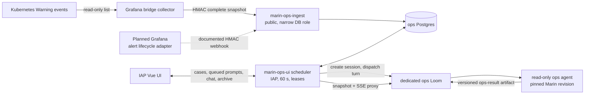
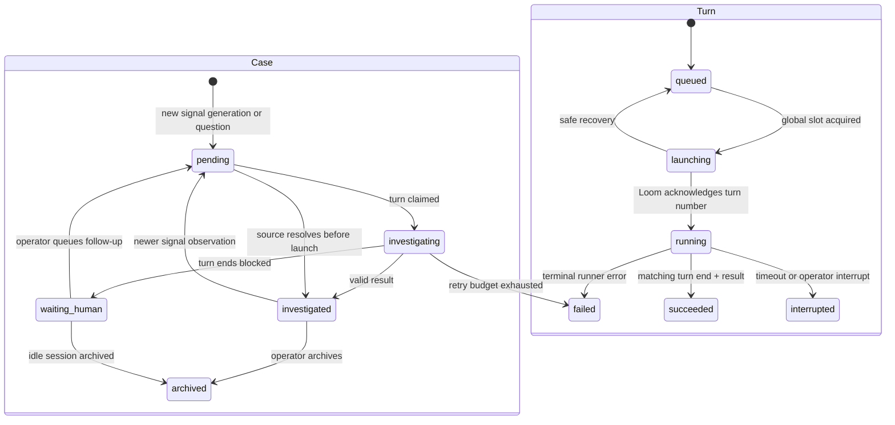

# Ops Workflow

Operational warnings should become durable investigations without turning every Kubernetes event into a Slack page. `ops.oa.dev` will collect low-urgency signals, preserve their lifecycle, serialize agent turns, and show the evidence, live conversation, and outcome to authenticated operators. The first release diagnoses and summarizes with read-only production access; it cannot mutate a cluster.

The [research brief](research.md) maps the existing Grafana, evaldash, Cloud SQL, Pulumi, and Loom contracts. Two findings shape the design: the motivating rows are lossy Kubernetes Warning events rather than Grafana alert instances, and Grafana's SQL schema is private state rather than a supported integration API.

## Challenges

Deliveries, signals, cases, agent sessions, and agent turns have different lifecycles. A warning count can rise after an investigation, a signal can disappear while a turn is running, and a person can ask a follow-up in the same chat. A single `cleaned` flag cannot represent those states.

The service also crosses a sharp trust boundary. Workload-controlled event messages are untrusted prompt input, while Kubernetes and Iris credentials can affect expensive production systems. Prompt text and an `ops-expert` skill are guidance, not security boundaries. V1 therefore combines dedicated runner tenancy, read-only RBAC, no GitHub write token, bounded evidence, and an audited result protocol.

## Costs and Risks

- The system adds an `ops` logical database, two always-warm Cloud Run services, and a dedicated ops-only Loom deployment or runner pool.
- A global one-turn scheduler deliberately trades investigation latency for predictable cost and blast radius. Flood controls and a launch budget are required before automatic launches.
- Kubernetes events have finite retention and noisy count updates. The source must preserve Kubernetes identity and publish complete snapshots; polling the existing 100-row Grafana projection would lose and duplicate events.
- Grafana, the collector, Postgres, the coordinator, and Loom can fail independently. Leases, idempotency keys, and reconciliation are correctness requirements.

## Design

The first source is the motivating Kubernetes Warning stream. The existing Grafana bridge already holds the fleet's read-only CoreWeave credential and runs continuously, so a new collector there lists complete Warning-event snapshots with stable event UID, object UID, resource version, count, and timestamps. Every 60 seconds it posts a bounded, timestamped HMAC batch to `marin-ops-ingest`. The receiver is a separate public Cloud Run service with no IAP, Loom token, or cluster credential. It verifies the signature and replay window, stores the delivery once, and calls an ingestion-only database function.

`marin-ops-ui` is a separate IAP-gated service. It owns the Vue application, case API, scheduler, and Loom proxy. Postgres serializes every automatic or human-requested turn with `FOR UPDATE SKIP LOCKED` and a fleet-wide unique active-turn constraint. A manual question enters the same queue at higher priority; prompting a waiting chat queues a turn instead of bypassing the scheduler. A permission request during a live turn continues to occupy the slot. V1 offers interrupt, not permission approval.

One case owns one Loom session; sessions and turns are separate records. Session creation is recoverable by a deterministic `ops-case-<UUID>` name and pinned Marin base commit. The coordinator creates an idle session, uploads evidence, then dispatches a prompt and records Loom's returned turn number. It never sends directly to an idle Loom session without first acquiring the database turn slot.

The agent writes a schema-versioned `ops-result` Loom artifact containing the case ID, ops turn ID, Loom turn number, outcome, evidence, action taken, and recommendation. After the matching ACP turn ends, reconciliation fetches and validates that artifact. `weaver status` remains human-facing progress, not the result protocol. Loom remains transcript authority; Postgres stores session/turn identity, durable results, and audit events, not a second chat copy.

For Kubernetes signals, a complete snapshot marks missing events resolved; a later reappearance starts a new generation. A newer observation reopens an investigated case but uses a cooldown before another turn. Archiving suppresses the current generation, so the next count update does not immediately create a replacement case. A resolved pending case closes as `no_action`; resolution during a turn is recorded but does not cancel the diagnosis. Older or out-of-order snapshots never regress newer source state.

The Vue application follows evaldash: Vue 3, TypeScript, Rsbuild, Tailwind, Vue Router, visibility-aware 60-second inbox refresh, and SSE only for an open conversation. A reconnect always refetches the full Loom chat snapshot because Loom's SSE stream has no replay cursor. Reads are available to the configured IAP viewer group; prompts, interrupts, overrides, and archive require the operator group.

Pulumi provisions separate service accounts, Cloud Run services, database users, and secrets. The ingest account can execute only the ingestion function. The UI account can read and update workflow tables and read only the dedicated ops Loom token. The source HMAC is readable only by the collector and ingest accounts. Secret values never enter Pulumi state. The dedicated Loom runtime has the existing CoreWeave read-role token and an explicitly read-only Iris principal, no GitHub write credential, and no access to unrelated Loom sessions. `$scan-logs` is disabled until production-log egress, redaction, cost, and credential policy are approved.

Four kill switches make rollout reversible: accept ingestion, create cases, dispatch automatic turns, and enable the real runner. Metrics and alerts cover rejected ingestion, last complete snapshot, queue age/depth, scheduler heartbeat, expired leases, launch/result failures, turn duration, daily launches, and retention lag. Default controls are 1 MiB per batch, 256 KiB per evidence packet, a 20-minute turn timeout, three attempts, a 15-minute reopen cooldown, and a configurable daily launch budget.

## Rollout

1. Land schema, pure state machine, fixture ingestion, fake runner, IAP UI shell, and both Cloud Run topologies with all dispatch disabled.
2. Enable the collector and case creation, compare the inbox against Grafana for a week, and tune provider-namespace priority without launching agents.
3. Deploy an isolated ops Loom against a pinned Marin revision and read-only test credentials; pass negative mutation tests before enabling manual turns.
4. Enable automatic turns for one cluster with a daily cap, then expand. Add existing Grafana alert lifecycle webhooks and an explicit webhook-only `handling=agent` notification policy only after Grafana 13 fixtures prove its HMAC and retry behavior. Existing paging routes continue to Slack.

## Testing

Behavior tests cover signed snapshots, replay and size rejection, snapshot resolution, out-of-order delivery, generation changes, reopen cooldown, archive suppression, manual queue priority, the all-turn global constraint, expired-lease recovery, deterministic session adoption, and result/turn correlation. A fake Loom server exercises create conflicts, prompt acknowledgement, turn end, chat resnapshot, interrupt, and archive. Pulumi tests assert the exact secret consumer sets and prevent the ingest service from receiving Loom or cluster credentials. Runner smoke tests prove allowed reads and denied create, patch, delete, exec, retry, restart, and node-pool operations.

## Decisions Still Required

- Provider namespaces (`kube-*`, `cw-*`) enter the inbox at low priority in the proposal. Operations should confirm that policy after the no-agent bake.
- Raw delivery retention defaults to 30 days; summaries and audit events remain until a separate retention policy is approved.
- The isolated runner can be a dedicated Loom deployment now, or scoped-token and per-session credential-profile support can be added upstream before sharing a deployment. Sharing today's unscoped deployment is not an option.
- The first mutation, if any, is a later design. V1 exposes no approval endpoint and has no production write credential.
