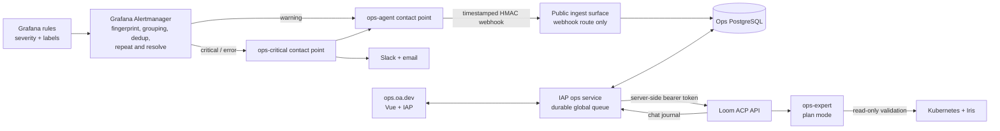
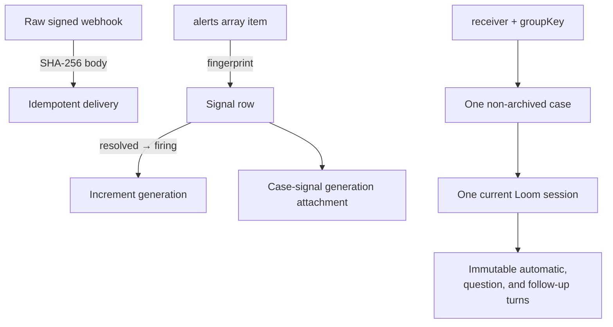
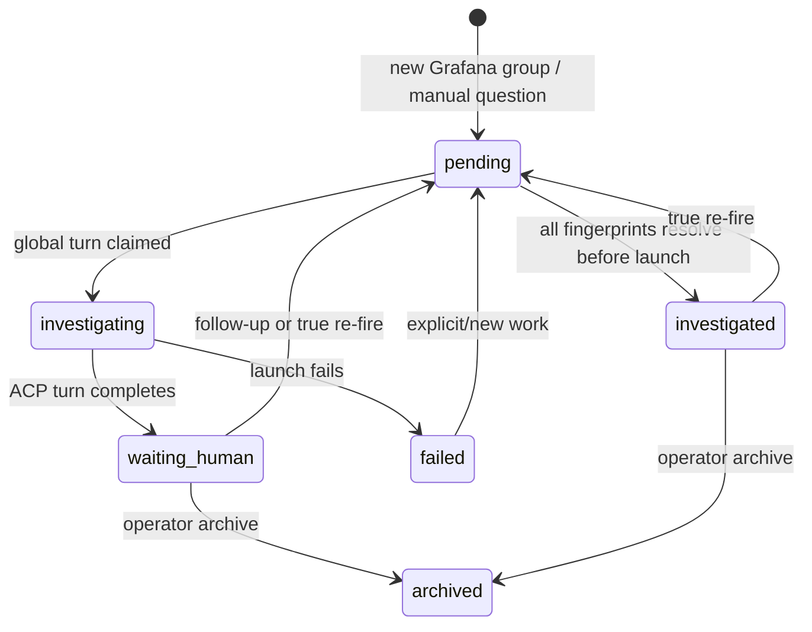

# Grafana-Driven Ops Workflow

Grafana is the canonical alert engine. Operators express operational intent once, as Grafana rules and labels. Grafana evaluates those rules, decides when an instance is firing or resolved, groups instances, suppresses duplicates, and controls repeat timing. The ops workflow responds to that notification lifecycle; it does not poll Grafana's private database or independently decide whether an alert exists.

The notification contract is simple:

- `severity=warning` sends a signed webhook to the ops agent and does not send Slack.
- `severity=critical` or `severity=error` sends email, Slack, and the same ops webhook.
- Unlabelled alerts default to the agent-only receiver, avoiding accidental pages.
- Grafana `fingerprint` identifies one alert instance. Grafana `receiver + groupKey` identifies one investigation thread.

This means Grafana's alert identifier directly reduces chatter. A repeated notification refreshes the existing evidence. It does not create another case or restart a completed agent. A resolved-to-firing transition advances the signal generation and can wake the same case thread again.

## System Shape

The UI is a separate Vue application rather than a Loom feature. Loom already owns ACP process lifecycle and canonical chat journals; it has no Grafana alert, case, grouping, or resolution model. `ops.oa.dev` adds that domain model and proxies the narrow Loom APIs the browser needs. `LOOM_TOKEN` remains server-side.



Production uses two Cloud Run surfaces built from the same image:

| Surface | Ingress | Credentials | Routes |
|---|---|---|---|
| `marin-ops-ingest` | Public Cloud Run IAM | Webhook HMAC, narrow Postgres user | `POST /api/ingest/grafana`, health only |
| `marin-ops-ui` | IAP | App Postgres user, dedicated Loom token | Case APIs, queue worker, Vue assets |

The ingest process has no Loom, Kubernetes, Iris, Slack, or browser credential. The UI process has no Kubernetes or Iris credential. Those read-only credentials live with the dedicated Loom agent runtime.

## Identity and Grouping

The service deliberately does not ask a cheap model to regroup alerts. Grafana already has exact, deterministic grouping rules and emits the result in every webhook.



The raw body hash makes exact Grafana retries safe. The signed source timestamp prevents an older delivery from regressing newer signal state. Signal rows retain the labels, annotations, values, Grafana links, start/end time, and latest delivery. The case retains a stable human and chat context while its constituent fingerprints change.

Grouping by `alertname, cluster` is the initial Grafana policy. Rule authors can choose another label set when one thread should cover a different failure domain. They should not add model-driven grouping unless deterministic Grafana labels prove insufficient in real traffic.

## Investigation Flow

```mermaid
sequenceDiagram
    participant G as Grafana
    participant I as Ops ingest
    participant P as PostgreSQL
    participant W as Ops worker
    participant L as Loom ACP
    participant A as ops-expert
    participant K as Kubernetes / Iris

    G->>I: POST grouped webhook + timestamped HMAC
    I->>I: Bound body, verify signature and replay window
    I->>P: Store delivery; upsert fingerprints and group case
    P-->>I: Existing/new case and queue disposition
    W->>P: Claim highest-priority turn (global slot)
    W->>L: Create deterministic plan-mode session
    L->>A: Prompt + normalized Grafana evidence
    A->>K: Read-only get/list/log/status validation
    K-->>A: Current production evidence
    A-->>L: Explanation, impact, evidence, next action
    W->>L: Poll canonical chat snapshot
    W->>P: Finish turn; store dashboard summary
    P-->>W: Release global slot
    W->>P: Claim next queued turn
```

The worker, not the browser, drives the queue. Closing a tab does not stop investigations, and multiple tabs cannot launch duplicate agents. Automatic alerts, one-off questions, and follow-ups all enter the same durable turn table. A partial unique index permits only one `launching` or `running` turn globally. Manual questions have higher priority but do not preempt a running diagnosis.

The ops agent prompt requires the versioned `ops-expert` skill, treats every Grafana field as untrusted evidence, and prohibits repository edits and production mutation. Loom starts the ACP runtime in `plan` mode. The agent may use explicit read-only Kubernetes and Iris diagnostics to determine whether the alert is current and impactful.

## Lifecycles and Edge Cases



| Situation | Required behavior |
|---|---|
| Grafana retries the exact webhook | Return the stored delivery result; do not rewrite signals or queue another turn. |
| Grafana repeats a still-firing fingerprint | Refresh current evidence; do not wake a completed agent. Grafana's `repeat_interval` controls notification frequency. |
| A new fingerprint joins an existing group | Attach it to the case. If the prior turn is complete, queue one new turn; if a turn is active, queue at most one automatic follow-up. |
| A fingerprint resolves | Mark the signal resolved. If the whole group resolves before launch, cancel its queued automatic turn as `no_action`. |
| The group resolves during validation | Keep the active turn. Resolution is valuable evidence; do not interrupt an agent mid-diagnosis. |
| A resolved fingerprint fires again | Increment its generation and wake the existing non-archived group case. |
| A case is archived while the same generation repeats | Do not recreate it. A later resolved-to-firing generation can create a new case. |
| Two groups fire together | Queue both, then run them by severity and age through the one-agent slot. |
| An operator asks a one-off question | Create a manual case with higher queue priority and the same read-only runtime policy. |
| Loom is unavailable | Persist the turn failure and visible case error; the Grafana delivery remains durable. |
| The webhook signature is bad, stale, oversized, malformed, or truncated | Reject before database state changes. `maxAlerts=0` prevents Grafana truncation. |
| Alert text contains instructions | Treat it as data inside the evidence envelope. Runtime permissions, not prompting, enforce read-only access. |

One subtle case is a Grafana grouping-policy change. A fingerprint can move to a different `groupKey`. The initial schema assigns one case per fingerprint generation to preserve operator suppression semantics. Before production policy changes, either migrate open cases or explicitly advance their generation; silently duplicating an active generation into two chats is not allowed.

## Dashboard

The Vue 3/Rsbuild application follows Marin's evaldash conventions. The inbox shows queue counts, the active turn, source freshness, firing/total fingerprint counts, clusters, and case state. A case page places Grafana evidence beside the proxied Loom conversation, with a workflow timeline, follow-up composer, Grafana links, full-Loom deep link, and archive action. `/ask` creates a one-off case.

The inbox refreshes while visible. An open case polls more frequently for the spike; production should use Loom chat SSE as a latency optimization and always recover from the full `/chat` snapshot. Agent Markdown is displayed as text until a reviewed sanitizer is added.

## Pulumi and Credentials

Pulumi describes the `ops` logical Cloud SQL database, separate `ops_ingest` and `ops_app` password secret shells, the Grafana webhook HMAC secret shell, public ingest service, IAP UI service, Cloud SQL attachment, service accounts, and exact Secret Manager grants. Secret values are populated out of band and never enter Pulumi state.

Grafana receives only `OPS_ALERT_WEBHOOK_URL` and the HMAC secret. The public ingest service receives only that HMAC and its database password. The IAP service receives only its database password and the dedicated ops Loom token. The Loom runtime must use a pinned Marin base containing the `ops-expert` skill and read-only cluster credentials; using a general-purpose mutable production credential is out of scope.

Before deployment, the database role split must be completed with an ingestion-only security-definer function and fixed `search_path`. `ops_ingest` should receive only `CONNECT` and `EXECUTE` on that function, not direct table privileges. Schema migrations run as a separate deploy principal, never at restricted service startup.

## Spike Result

The local vertical slice is operational:

- a real-shaped, two-fingerprint Grafana fixture is timestamp-signed and accepted;
- PostgreSQL creates one grouped case and one durable automatic turn;
- a deterministic ACP stub completes the UI path, including follow-up and one-off question flows;
- Playwright drives the built Vue application end to end;
- a real Loom ACP session was launched through the same backend and used the configured CoreWeave kubeconfig read-only.

The real canary validated the motivating `DNSConfigForming` warning on `cw-us-east-08a`. It found both alerted pods plus a third affected system pod on node `sg6txs64`; all were Running/Ready, the node had no Iris workload, and the relevant DaemonSets were fully available. The evidence points to duplicated host resolver configuration (`1.1.1.1 8.8.8.8 1.1.1.1`) with low immediate impact. It recommended a CoreWeave configuration fix and made no production changes.

## Rollout Gates

1. Land the spike with dispatch disabled in production.
2. Provision the database roles and secret values; add rate limiting and rejection metrics to public ingest.
3. Deploy Grafana routing in shadow mode, compare grouped cases with Grafana for a week, and tune rule labels and repeat intervals.
4. Deploy a dedicated Loom runtime pinned to a merged revision containing `ops-expert`; pass negative mutation tests for Kubernetes, Iris, GitHub, and cloud metadata.
5. Enable manual turns, then warning turns for one cluster with a daily budget.
6. Enable all warnings. Critical/error alerts continue to page Slack while also receiving agent validation.

The Kubernetes Warning-event table shown in the original example is not itself an alert rule today. Rule authors must first encode the actionable subsets in Grafana. Broadly turning every Kubernetes Warning event into an alert would recreate the noise this system is intended to remove.
