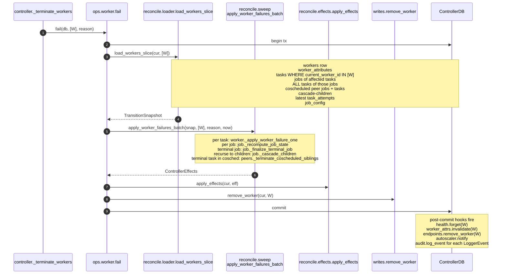
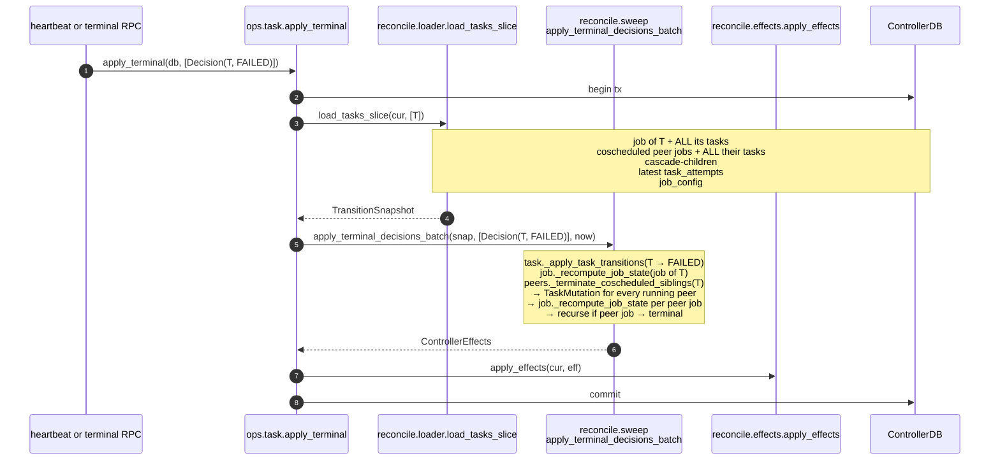
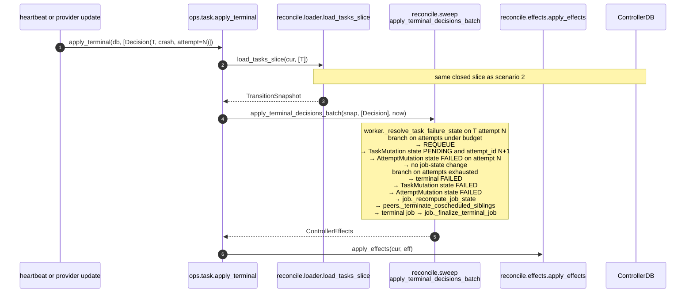
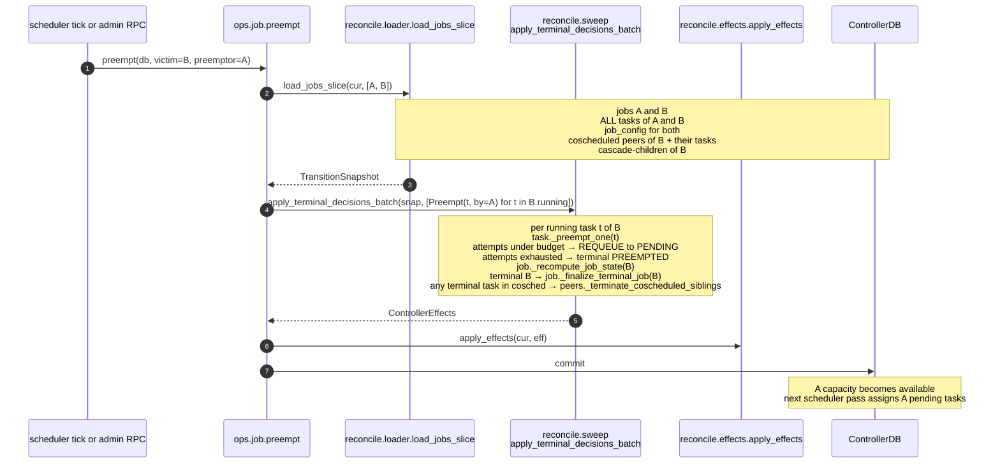
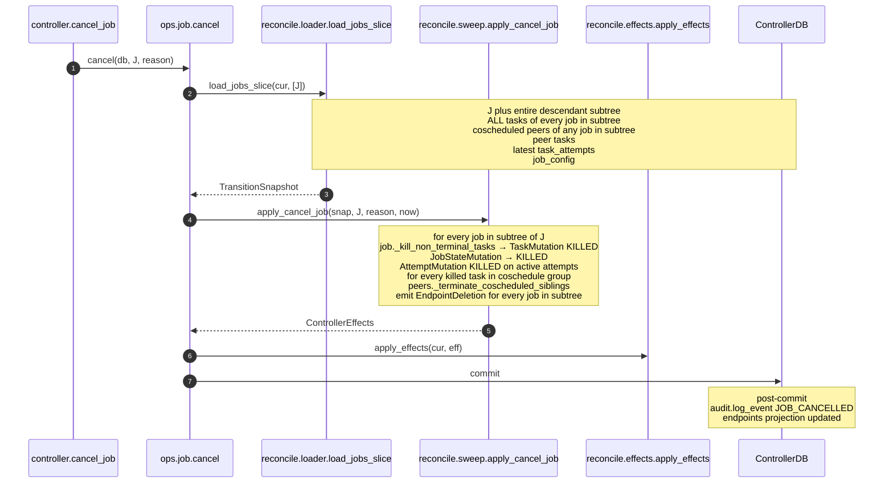
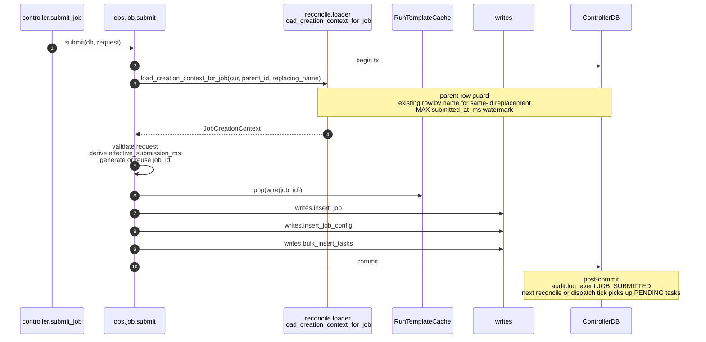
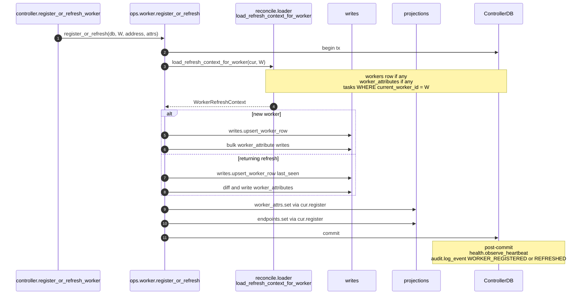
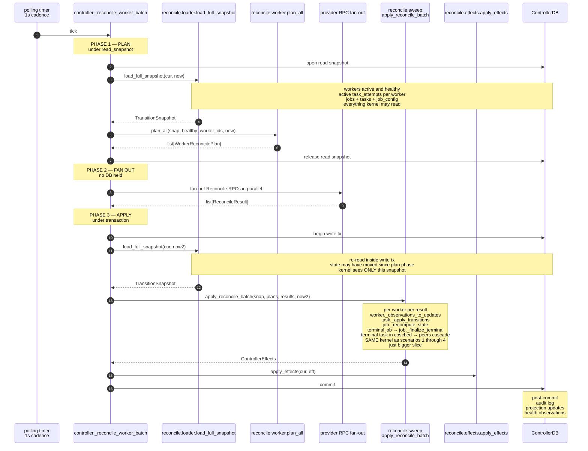

# Reconcile package split — design doc v3

Author: russell + claude — 2026-05-28
Branch: `weaver/iris-reconcile-performance`
Precursor: `.agents/projects/transitions-pure.md` (stages 1–9 already landed).

This supersedes v2. Changes vs v2 (driven by senior review):

- Closure contract specifies depths per relation (peers one-hop, descendants
  transitive, cascade-children transitive of seeded jobs).
- Mutation ownership flipped: `*Mutation` classes live in the aggregate file
  that emits them; `effects.py` defines only the `Mutation` Protocol plus
  named cross-aggregate effect categories (no Protocol-mimicry for
  post-commit-only effects like `WorkerHealthEffect`).
- Naming convention clarified: public API never restates module name; private
  helpers may, where it disambiguates within-file.
- `sweep.apply_cancel_job` is the only cancel entry; per-aggregate
  `cancel_job_pure` retired.
- `apply_effects` signature documented once; diagrams abbreviate.
- Migration plan is single-PR with explicit downward-only import direction
  and shims that don't survive merge.
- New scenarios: reservation-claim management, worker re-registration after
  failure, partial Reconcile-RPC failure.
- Bulk reconcile tick diagram phased and labelled (plan / fan-out / apply).

Changes vs v1: package is `reconcile/` not `domain/`; concrete file→function
placement throughout; explicit naming conventions; explicit fate for
`reads.py`/`writes.py`; `dispatch.py` renamed; eighth diagram added for the
bulk reconcile tick; broken mermaid fixed.

---

## Why we're doing this (recap)

After the transitions-pure refactor, the cascade laws (worker→tasks,
coscheduled peers, job-state derivation, terminal recursion to children) are
correctly centralized in pure code. Three smells remain:

1. **The trigger name leaks into the layer name.** Both `controller._terminate_workers`
   (RPC-driven) and the periodic timer route through `reconcile_io.*`. The file
   says *bulk reconcile*; the call site says *ad-hoc command*.
2. **`commands.cancel_job` skips the kernel** and skips coscheduled cascade.
   Cancelling one half of an atomic group leaves the other stranded.
3. **One 2000-LOC `reconcile.py`** mixes per-entity rules (worker, job, task,
   peers) with batch sweep orchestrators. They share `WorkingState` so the
   merge made sense at Stage 7, but the file shape stops telegraphing the
   aggregate each rule concerns.

We fix all three by splitting `reconcile.py` and `reconcile_io.py` into a
`reconcile/` package whose filenames *each name an aggregate or a verb*, and
by routing every ad-hoc op through the same kernel via a thin `ops/` surface.

---

## North star

**Functional Core, Imperative Shell**, applied the same way Nomad's scheduler
and Kubernetes' controller-runtime apply it: one pure kernel parameterized by
*scope*, two thin I/O sides (loader + effects), aggregate-scoped command
modules on top. Ad-hoc commands and the periodic sweep are both just "load a
slice, call the kernel, persist effects" — they differ only in slice size.

We explicitly do **not** build a generic identity map / `IRepository<T>`. The
research (Airflow scheduler, dbt-core, Dagster, Prefect, k8s DelegatingClient)
is consistent: use-case-specific loaders, plain dataclasses, per-operation
stack-frame lifetime. SQLAlchemy Core stays; the ORM does not enter.

---

## Naming conventions

These are the rules a reader uses to predict a file's contents from its path.

### Modules telegraph their aggregate or their verb

- `reconcile/worker.py` — pure rules concerning **workers**.
- `reconcile/job.py` — pure rules concerning **jobs**.
- `reconcile/task.py` — pure rules concerning **tasks** and **attempts**.
- `reconcile/peers.py` — coscheduled-peer cross-aggregate rules.
- `reconcile/sweep.py` — batch sweep orchestrators (verbs).
- `reconcile/loader.py` — produces snapshots (verb).
- `reconcile/effects.py` — applies effects (verb).
- `reconcile/state.py` — shared dataclass shapes that flow through the kernel.
- `ops/job.py`, `ops/worker.py`, `ops/task.py` — ad-hoc commands grouped by
  aggregate; called from `controller.py` RPC handlers.

### Function names do not stutter — for public API

Inside an aggregate module the aggregate is implicit. Public callers read
`worker.fail(...)`, not `worker.fail_workers(...)`. Private helpers are
exempt — `worker._apply_failure_one(...)` and `worker._plan_one(...)` may
restate the aggregate where it disambiguates the helper from sibling rules
in the same file (e.g., `task._preempt_one` vs `task._unschedulable_one`).

```
ops/job.py             → submit, cancel, remove_finished, preempt
ops/worker.py          → register_or_refresh, fail
ops/task.py            → queue_assignments, apply_heartbeats,
                         apply_terminal, apply_provider_updates
reconcile/sweep.py     → apply_reconcile_batch, apply_heartbeats_batch,
                         apply_worker_failures_batch,
                         apply_terminal_decisions_batch,
                         apply_direct_provider_updates_batch,
                         apply_cancel_job
reconcile/worker.py    → plan_all, plan_one (public)
reconcile/job.py       → no public surface (internals only; called from sweep)
reconcile/task.py      → no public surface
reconcile/peers.py     → no public surface
```

### `ops/` is for anyone who owns a Tx and wants the kernel

Not "RPC-driven" — `ops/*` is the right home for any caller that needs to
load a slice, run the kernel, and persist effects, *regardless* of whether
the trigger is an external RPC or a controller-internal loop. The scheduler
tick uses `ops.job.preempt` for the same reason an admin RPC does: same load
→ kernel → effects shape. The "ops" name is intentional — it's the
operation surface above the kernel.

### Loader naming: `load_<scope>_slice`

Every loader returns a `TransitionSnapshot`. The scope tells the reader what
the seed is and what closure rules the loader applied to expand it.

```
reconcile.loader.load_full_snapshot(cur, *, now)
                   — no seed, every active row, used by the tick

reconcile.loader.load_workers_slice(cur, worker_ids, *, now)
                   — seed=worker_ids, expand:
                       tasks WHERE current_worker_id IN ids
                       jobs of those tasks + ALL their tasks
                       coscheduled peer jobs + peer tasks
                       children of any job that may cascade terminal
                       latest task_attempts + job_config

reconcile.loader.load_jobs_slice(cur, job_ids, *, now)
                   — seed=job_ids, expand:
                       full descendant subtree
                       ALL tasks of every job in subtree
                       coscheduled peer jobs + peer tasks
                       latest task_attempts + job_config

reconcile.loader.load_tasks_slice(cur, task_ids, *, now)
                   — seed=task_ids, expand:
                       jobs of those tasks + ALL their tasks
                       coscheduled peer jobs + peer tasks
                       children of any job that may cascade terminal
                       latest task_attempts + job_config
```

Each `load_*_slice` is a thin wrapper around the same lower-level builders that
already exist in `reconcile_io.py` (`_load_descendants_multi`,
`_bulk_load_job_state_basis`, `_load_all_tasks_for_jobs`,
`_load_job_num_tasks`). The four entry points just differ in how the seed
job-id set is computed before the lower-level builders run.

### Closure contract — depths

A `TransitionSnapshot` is **closed**, but "closed" needs a bounded depth per
relation. Without bounds, "include coscheduled peers" recurses indefinitely.

- **Descendant subtree: transitive.** A job's children, their children, and
  so on. Today's `list_subtree_cte` already returns this.
- **Coscheduled peers: one hop only.** If task T is in coschedule group G,
  the slice contains every job in G and every task of those jobs. Peers of
  *those* peer jobs (their own coschedule groups) are NOT pulled. Rationale:
  the kernel rule `peers._terminate_coscheduled_siblings` only emits
  mutations on siblings of the failing task; sibling-of-sibling is a
  separate triggering event and runs in a different sweep call.
- **Cascade-children: transitive descendant subtree of any seeded job.** If
  job J is in the seed set, J's full descendant subtree is in the slice
  (J's children, their children, transitively). The loader cannot predict
  which jobs will hit terminal — it conservatively pulls every descendant
  of every seed. This is the same SQL as the descendant rule above, applied
  to every seed; the kernel decides terminal-cascade per descendant during
  the pass.
- **Latest task_attempts: per task.** Only the row whose `attempt_id` matches
  `tasks.current_attempt_id`. Historical attempts are not pulled.
- **job_config: per job in the slice.** Includes max_retries_preemption,
  preemption_policy, retain_children, coscheduling group id.

Loader closure tests (§Test Strategy) assert *exactly* this — too-narrow
loaders surface as kernel `KeyError`s; too-wide loaders surface as memory
regressions in benchmark fixtures.

### Creation/refresh paths use `load_<aggregate>_context`

State **transitions** go through `load_*_slice`. **Creation** ops
(`ops/job.submit`, `ops/worker.register_or_refresh`) need a much smaller
context — they're not running the kernel. Different return type telegraphs
that:

```
reconcile.loader.load_creation_context_for_job(cur, parent_id, replacing_name)
                   → JobCreationContext

reconcile.loader.load_refresh_context_for_worker(cur, worker_id)
                   → WorkerRefreshContext
```

---

## What happens to the existing files

| File today | Fate | Reason |
|---|---|---|
| `reconcile.py` (2007 LOC) | **Removed.** Becomes the `reconcile/` package. | One 2000-LOC file mixing all aggregates is the smell we're fixing. |
| `reconcile_io.py` (648 LOC) | **Removed.** Splits into `reconcile/loader.py`, `reconcile/effects.py`, `reconcile/sweep.py`. | "io" is two unrelated jobs (loading and effect-applying); the verb-per-file split makes that explicit. |
| `commands.py` (~600 LOC) | **Removed.** Splits into `ops/job.py`, `ops/worker.py`, `ops/task.py`. | A flat module of free functions across aggregates doesn't telegraph anything. |
| `dispatch.py` (307 LOC) | **Renamed to `direct_provider.py`.** | "dispatch" is generic — this file is specifically about the worker-less, K8s direct-provider mode. The new name telegraphs scope. Content unchanged. |
| `reads.py` (1248 LOC) | **Kept as-is, at top level.** | 36 row/list/SQL primitives that the loader (and ad-hoc reads) compose. Splitting by aggregate is a separate, optional cleanup; not blocking. |
| `writes.py` (523 LOC) | **Kept as-is, at top level.** | 18 row/batch writers that effects + creation ops compose. Same reasoning as reads.py. |
| `task_state.py` | **Kept unchanged.** | Pure task predicates + `ActiveTaskRow`/`TaskDetailRow` — used cluster-wide, not reconcile-private. |
| `projections/endpoints.py`, `projections/worker_attrs.py` | **Kept unchanged.** | Already well-bounded. |
| `controller.py` (2715 LOC) | **Slimmed.** RPC handlers delegate to `ops/*`; timer loops call into `reconcile/sweep.py`. Lifecycle, threading, provider wiring stay. | Was a god-file; the slim version is a wiring layer. |
| `codec.py`, `schema.py`, `db.py`, `lru_cache.py` | **Kept unchanged.** | Below the refactor. |

**Why `reads.py`/`writes.py` stay flat.** They're a row-access layer below
the package boundary. The loader composes them; `apply_effects` composes
them; `ops/*` creation paths compose them. Splitting them into
`reads/{job.py,worker.py,task.py}` plus `writes/{...}` would mirror the new
package structure and is *appealing*, but it's a pure rename pass with no
correctness payoff and triples the import-site count. Defer until a concrete
need pushes it (e.g., reads.py grows past 2K lines or a real boundary
violation appears).

**Why `dispatch.py` → `direct_provider.py`.** Today the name suggests
"task dispatch" generally, but the file's contents are entirely about the
**worker-less, K8s-native direct-provider path**: `RunTemplateCache`,
`drain_for_direct_provider`, `DirectProviderBatch`,
`DirectProviderSyncResult`. The worker-based path (Reconcile RPCs to worker
daemons) doesn't touch this file at all. Renaming makes the scope obvious.
A reader looking at this file from cold should know in one second it's
about the k8s mode. Considered alternatives: `k8s_sync.py` (too narrow —
might generalize to other direct providers), `pod_dispatch.py` (leaks the
backend). `direct_provider.py` matches the conceptual mode we already use
in code (`is_direct_provider`).

---

## Final layout

```
lib/iris/src/iris/cluster/controller/
  reconcile/                        # NEW PACKAGE — pure kernel + thin I/O
    __init__.py
    state.py                        # TransitionSnapshot, WorkingState,
                                    # JobConfigRow, JobStateBasis,
                                    # JobDescendants, TaskHistogramRow
    loader.py                       # load_full_snapshot, load_*_slice,
                                    # load_creation_context_*,
                                    # load_refresh_context_*
    effects.py                      # ControllerEffects, *Mutation classes,
                                    # LoggerEvent, LogEvent,
                                    # EndpointDeletion, WorkerHealthEffect,
                                    # apply_effects(cur, effects)
    worker.py                       # worker-aggregate rules
    job.py                          # job-aggregate rules
    task.py                         # task/attempt-aggregate rules
    peers.py                        # coscheduled cross-aggregate rules
    sweep.py                        # batch sweep orchestrators
  ops/                              # NEW PACKAGE — RPC-driven commands
    __init__.py
    job.py
    worker.py
    task.py
  reads.py                          # UNCHANGED — row/list primitives
  writes.py                         # UNCHANGED — row/batch writers
  task_state.py                     # UNCHANGED — pure predicates
  direct_provider.py                # RENAMED from dispatch.py
  projections/                      # UNCHANGED
    endpoints.py
    worker_attrs.py
  codec.py, schema.py, db.py        # UNCHANGED
  controller.py                     # SLIMMED — lifecycle + timers +
                                    # RPC wiring (delegates to ops/*)
REMOVED:
  reconcile.py
  reconcile_io.py
  commands.py
  dispatch.py
```

---

## Per-file contents

Function-level placement, derived from the catalogs of `reads.py`,
`writes.py`, `reconcile_io.py`, `reconcile.py`, `dispatch.py`,
`task_state.py`, `commands.py`, and the controller's RPC/timer surface.

### `reconcile/state.py` (~200 LOC)

The data shapes that flow through the kernel. Pure types, no I/O, no logic.
Mutation classes do *not* live here — they live in the aggregate file that
emits them (see effects.py / worker.py / job.py / task.py).

```python
# snapshot + working overlay
class TransitionSnapshot          # the closed snapshot returned by loader
class WorkingState                # mutable overlay used by rules during a kernel pass

# closure-helper row shapes
class JobConfigRow                # coscheduling/max_failures/policy/task_count
class JobStateBasis               # task counts and first error for one job
class JobDescendants              # subtree views (with/without reservation holders)
class TaskHistogramRow            # task+state+error for histogram aggregation

# return types of the creation/refresh loaders
class JobCreationContext          # load_creation_context_for_job
class WorkerRefreshContext        # load_refresh_context_for_worker

# constants — imported widely
MAX_REPLICAS_PER_JOB
DEFAULT_MAX_RETRIES_PREEMPTION
RESERVATION_HOLDER_JOB_NAME
HEARTBEAT_STALENESS_THRESHOLD
FAILURE_TASK_STATES
NON_TERMINAL_TASK_STATES
```

**Import direction.** `state.py` imports from `task_state.py` (uses
`ActiveTaskRow`, `TaskDetailRow`); never the reverse. `task_state.py` stays
top-level because non-reconcile callers (direct_provider.py, ops/task.py,
controller scheduler) also import its predicates.

### `reconcile/loader.py` (~400 LOC)

The reader side of I/O. Every public function returns either a
`TransitionSnapshot` or a small `*Context` dataclass.

```python
# top-level snapshot entry points
def load_full_snapshot(cur, *, now)                              -> TransitionSnapshot
def load_workers_slice(cur, worker_ids, *, now)                  -> TransitionSnapshot
def load_jobs_slice(cur, job_ids, *, now)                        -> TransitionSnapshot
def load_tasks_slice(cur, task_ids, *, now)                      -> TransitionSnapshot

# small creation/refresh contexts (different return type — intentional)
def load_creation_context_for_job(cur, parent_id, replacing_name) -> JobCreationContext
def load_refresh_context_for_worker(cur, worker_id)               -> WorkerRefreshContext

# private builders (lifted from reconcile_io.py, unchanged)
def _build_multi_root_descendants_stmt() -> CTE
def _load_descendants_multi(cur, root_ids)
def _bulk_load_job_state_basis(cur, job_ids, all_tasks_by_job)
def _load_all_tasks_for_jobs(cur, job_ids)
def _load_job_num_tasks(cur, job_ids)

# helpers
def _expand_to_closed_job_set(cur, seed_job_ids) -> set[JobName]
    # walks subtree + coscheduled peers + cascade children
```

### `reconcile/effects.py` (~150 LOC)

The writer side of I/O. Consumes `ControllerEffects` and stamps the DB.

**Mutation ownership rule.** Each aggregate file owns the mutation shapes it
emits (per the project memory entry "Iris transitions ownership": apply types
live in or beside the rule that emits them). `effects.py` defines the
`Mutation` Protocol — strictly for row-mutating effects — and a small set of
named cross-aggregate post-commit effect categories. Cross-aggregate effects
are **not** Protocol-shaped because they don't update rows the same way; a
no-op `apply(cur)` would be lying about the abstraction.

```python
class ControllerEffects:
    mutations: list[Mutation]              # row-touching effects (apply during tx)
    logger_events: list[LoggerEvent]       # post-commit; rolled back tx leaves no trace
    log_events: list[LogEvent]             # audit log; post-commit
    endpoint_deletions: list[EndpointDeletion]   # endpoints projection update; post-commit
    worker_health: WorkerHealthEffect | None     # health tracker update; post-commit

class Mutation(Protocol):
    def apply(self, cur: Tx) -> None: ...
    # Row-mutating effects ONLY. If your effect doesn't issue SQL during the
    # active tx, it does NOT implement Mutation — add a named category to
    # ControllerEffects above.

# cross-aggregate effect categories (named, NOT Protocol-shaped)
class EndpointDeletion                # endpoint_id; consumed post-commit
class LoggerEvent                     # deferred logger line
class LogEvent                        # audit log entry
class WorkerHealthEffect              # heartbeat / build_failed / make_unhealthy lists

# the single public entry point
def apply_effects(cur, effects, *, health, endpoints, now) -> None:
    # health, endpoints are projections — runtime state, not data.
    # They cannot be inlined into ControllerEffects (which is pure data).
    # Diagrams below abbreviate the kwargs.
    for m in effects.mutations:
        m.apply(cur)
    for d in effects.endpoint_deletions:
        endpoints.remove_by_id(cur, d.endpoint_id)
    if effects.worker_health is not None:
        cur.register(lambda eff=effects.worker_health: _apply_health(health, eff))
    for ev in effects.logger_events:
        cur.register(lambda e=ev: logger.log(e))
    for ev in effects.log_events:
        cur.register(lambda e=ev: audit.log_event(e))
```

Concrete `Mutation` implementations live in:
- `reconcile/task.py` → `TaskMutation`, `AttemptMutation`
- `reconcile/job.py` → `JobStateMutation`, `CascadeKillJobMutation`

Each defines its `apply(cur)` next to the rule that constructs it. The kernel
never names `cur` — only `apply_effects` invokes `m.apply(cur)`.

**Extensibility example.** Adding a new row-mutating effect (e.g.,
`ReservationClaimMutation`) requires only: (1) define the class in
`ops/reservation.py` (or wherever the rule lives) with an `apply(cur)`
implementation; (2) emit it via `effects.mutations.append(...)`. `effects.py`
does not change. The cross-aggregate effect list (LoggerEvent, etc.) is
closed; adding a new category there is a deliberate API change.

### `reconcile/worker.py` (~340 LOC)

Pure rules concerning **workers**. State-machine inputs and outputs are
plain values; rules take `WorkingState` as the mutable overlay.

```python
# worker-related dataclasses
class WorkerReconcilePlan          # proto payload for one Reconcile RPC
class ReconcileResult              # outcome of one Reconcile RPC
class ReconcileRow                 # one (task, attempt, worker) driving a plan row
class ReconcileInputs              # snapshot driving one reconcile tick
class WorkerAttributeParams        # typed attribute write

# public planning surface (the only public functions in this file)
def plan_all(snap, healthy_worker_ids, now_ms) -> list[WorkerReconcilePlan]
def plan_one(snap, worker_id, now_ms)          -> WorkerReconcilePlan

# private rule helpers — emitted into ControllerEffects by sweep functions
def _apply_failure_one(state, worker_id, reason, now_ms)
def _resolve_failure_state(task_row, current_attempts, max_retries) -> tuple[int, int]
def _filter_observations_to_plan(plan, observations) -> list[AttemptObservation]
def _observations_to_updates(state, plan, observations) -> list[TaskUpdate]
def _assigned_updates_from_plan(plan) -> list[TaskUpdate]
```

`WorkerHealthEffect` (the post-commit health-tracker effect) is defined in
`effects.py` because it's a cross-aggregate category, not a row mutation;
`worker.py` imports and constructs it. `plan_all`/`plan_one` rename: was
`reconcile_workers`/`_reconcile_worker`, which stutters the package name.

### `reconcile/job.py` (~280 LOC)

Pure rules concerning **jobs**. Owns the job mutation shapes per the
ownership rule.

```python
# job-owned mutations (implement Mutation Protocol)
class JobStateMutation             # state / started_at / finished_at / error
    def apply(self, cur): ...      # UPDATE jobs SET ... WHERE job_id = ...

class CascadeKillJobMutation       # cascade-kill non-terminal job to KILLED
    def apply(self, cur): ...      # UPDATE jobs SET state=KILLED ... WHERE ...

# private rule helpers
def _recompute_state(state, job_id, now_ms) -> int | None
def _kill_non_terminal_tasks(state, job_id, reason, now_ms)
def _cascade_children(state, parent_job_id, reason, now_ms)
def _finalize_terminal(state, job_id, terminal_state, now_ms)
def _cancel_one_in_subtree(state, job_id, reason, now_ms)
    # private helper called by sweep.apply_cancel_job per job in the subtree
```

No public surface — `sweep.py` calls these via `WorkingState` overlay. The
only externally-visible cancel entry is `sweep.apply_cancel_job` (not
`job.cancel_job_pure` — duplicated entry points were removed).

### `reconcile/task.py` (~620 LOC — the kernel hot zone)

Pure rules concerning **tasks** and **attempts**. The largest file in the
package; intentionally so — the task-state machine has the most rules. To
keep it navigable, organize as `# ─── section ───` banner comments, in this
order:

1. **Inputs** — `TaskUpdate`, `TerminalDecision`, `TerminalKind`, `HeartbeatApplyRequest`
2. **Mutations** — `TaskMutation`, `AttemptMutation` (own the Mutation Protocol)
3. **Snapshot lookups** — `_active_row_from_snapshot`, helpers
4. **Per-attempt transitions** — `_finalize_attempt`, `_mark_terminating`
5. **Per-task terminal entry points** — `_preempt_one`, `_unschedulable_one`
6. **The transition dispatcher** — `_apply_transitions` (the 230-LOC core)
7. **Batch-shape helpers** — `_timeout_batch` (two-phase dedup logic)

```python
# ─── inputs ───
class TaskUpdate                  # observed/decided task state change
class TerminalDecision            # asserted terminal: kind + task_id + reason
class TerminalKind                # PREEMPT | TIMEOUT | UNSCHEDULABLE
class HeartbeatApplyRequest       # batch of worker heartbeat updates

# ─── mutations ───
class TaskMutation                # state/error/exit/counts update
    def apply(self, cur): ...     # UPDATE tasks SET ... WHERE task_id = ...
class AttemptMutation             # attempt state/timestamps update
    def apply(self, cur): ...     # UPDATE task_attempts SET ... WHERE ...

# ─── snapshot lookups ───
def _active_row_from_snapshot(state, task_id) -> ActiveTaskRow | None

# ─── per-attempt transitions ───
def _finalize_attempt(state, task_id, attempt_id, terminal_state, now_ms)
def _mark_terminating(state, task_id, terminal_state, error, now_ms)

# ─── per-task terminal entry points ───
def _preempt_one(state, task_id, preemptor_id, now_ms)
def _unschedulable_one(state, task_id, reason, now_ms)

# ─── the transition dispatcher ───
def _apply_transitions(state, worker_id, updates, now_ms)
    # the 230-LOC core dispatcher from today's _apply_task_transitions;
    # branches on update kind and emits TaskMutation/AttemptMutation plus
    # cross-aggregate calls to job._recompute_state and peers._terminate_*

# ─── batch-shape helpers ───
def _timeout_batch(state, decisions, now_ms)
    # two-phase dedup so coscheduled siblings don't double-cascade
```

If `_apply_transitions` grows further, it's the candidate for its own file
(`reconcile/transitions.py` or similar). Reviewer's note: today it's
already the biggest function and the most-edited; isolating it later is
fine, but inlining a `from .task import _apply_transitions` is not worse
than a separate file at current scale.

### `reconcile/peers.py` (~80 LOC)

Coscheduled-peer cross-aggregate rules. The smallest file, but
intentionally its own — these are the cross-aggregate laws that
v1's `commands.cancel_job` skipped.

```python
def _find_coscheduled_siblings(state, task_id) -> list[ActiveTaskRow]
def _terminate_coscheduled_siblings(state, task_id, reason, now_ms)
def _requeue_coscheduled_siblings(state, task_id, now_ms)
```

### `reconcile/sweep.py` (~370 LOC)

Batch sweep orchestrators. Each function takes a `TransitionSnapshot` and
returns a `ControllerEffects`. Pure. These are the **only** kernel entry
points called from outside the `reconcile/` package — `ops/*` and the
periodic timer call sweep functions, never per-aggregate rule files.

```python
def apply_reconcile_batch(snap, plans, results, now_ms)            -> ControllerEffects
def apply_heartbeats_batch(snap, requests, now_ms)                 -> ControllerEffects
def apply_worker_failures_batch(snap, failures, now_ms)            -> ControllerEffects
def apply_terminal_decisions_batch(snap, decisions, now_ms)        -> ControllerEffects
def apply_direct_provider_updates_batch(snap, updates, now_ms)     -> ControllerEffects
def apply_cancel_job(snap, job_id, reason, now_ms)                 -> ControllerEffects  # NEW
```

`apply_cancel_job` is the only `sweep` function that takes a single seed
rather than a batch — kept here (not in `job.py`) because it iterates the
subtree the same way the other sweeps iterate workers/decisions and emits
the same `ControllerEffects` shape. The asymmetric `_batch`-less name is
intentional — "cancel a job" doesn't batch the same way "apply decisions"
or "apply heartbeats" do. If we ever support `cancel_many_jobs`, that
function takes the `_batch` suffix.

### `ops/job.py` (~350 LOC)

Aggregate-scoped commands for jobs. Each follows the same shape: open tx →
load → kernel-or-direct-write → apply effects → commit. Callers can be RPC
handlers in `controller.py` *or* internal controller loops (scheduler tick
calls `ops.job.preempt`).

```python
def submit(db, request, *, run_template_cache, audit) -> JobName
    # creation path — no kernel call
    # → loader.load_creation_context_for_job
    # → writes.insert_job + writes.insert_job_config + writes.bulk_insert_tasks
    # → run_template_cache.pop(wire) to evict stale template
    # → audit.log via cur.register

def cancel(db, job_id, reason, *, endpoints, audit) -> None
    # state-transition path — fires coscheduled cascade
    # → loader.load_jobs_slice([job_id])
    # → sweep.apply_cancel_job(snap, job_id, reason, now_ms)
    # → effects.apply_effects(cur, effects)

def remove_finished(db, job_id) -> bool
    # admin path — checks terminal then deletes
    # → reads.get_job_state guard
    # → writes.delete_job

def preempt(db, victim_job_id, preemptor_job_id, *, audit) -> None
    # admin/scheduler path — fires same kernel as automatic preemption
    # → loader.load_jobs_slice([victim_job_id, preemptor_job_id])
    # → sweep.apply_terminal_decisions_batch(snap, [Preempt(t, by=preemptor) for t in victim_running])
    # → effects.apply_effects
```

### `ops/worker.py` (~200 LOC)

```python
def register_or_refresh(db, worker_id, address, metadata, *,
                        health, worker_attrs, slice_id, scale_group) -> None
    # creation/refresh path — no kernel call
    # → loader.load_refresh_context_for_worker
    # → writes.upsert_worker_row + worker_attribute writes
    # → projection updates + health observe — via cur.register

def fail(db, worker_ids, reason, *,
         health, endpoints, worker_attrs, audit) -> WorkerFailureBatchResult
    # state-transition path — chunked, fires full cascade per chunk
    # for each chunk:
    #   → loader.load_workers_slice(chunk)
    #   → sweep.apply_worker_failures_batch(snap, chunk, reason, now_ms)
    #   → effects.apply_effects
    #   → writes.remove_worker per worker
    # returns WorkerFailureBatchResult{removed_ids, freed_capacity}

# return type lives here (per ops-owned shapes)
class WorkerFailureBatchResult
    removed_ids: list[WorkerId]
    freed_capacity: ClusterCapacity | None
```

### `ops/task.py` (~250 LOC)

```python
# input shape (per ops-owned shapes)
class Assignment
    task_id: JobName
    worker_id: WorkerId
    worker_address: str
    attempt_id: int

def queue_assignments(db, assignments: list[Assignment], *, health, audit) -> None
    # scheduler-driven state-transition; tasks PENDING → ASSIGNED
    # → reads.get_job_state guard
    # → writes.assign_to_worker per assignment
    # → sa_update jobs PENDING→RUNNING where assigned

def apply_heartbeats(db, requests, *, health, endpoints, audit) -> None
    # → loader.load_tasks_slice(task_ids_in_requests)
    # → sweep.apply_heartbeats_batch(snap, requests, now_ms)
    # → effects.apply_effects

def apply_terminal(db, decisions, *, health, endpoints, audit) -> None
    # PREEMPT | TIMEOUT | UNSCHEDULABLE
    # → loader.load_tasks_slice(task_ids_in_decisions)
    # → sweep.apply_terminal_decisions_batch(snap, decisions, now_ms)
    # → effects.apply_effects

def apply_provider_updates(db, updates, *, health, endpoints, audit) -> None
    # K8s direct-provider observations
    # → loader.load_tasks_slice(task_ids_in_updates)
    # → sweep.apply_direct_provider_updates_batch(snap, updates, now_ms)
    # → effects.apply_effects
```

### `direct_provider.py` (~307 LOC)

Contents unchanged from `dispatch.py`. Just the rename.

```python
class RunTemplateCache
class SchedulingEvent
class ClusterCapacity
class DirectProviderBatch
class DirectProviderSyncResult
DIRECT_PROVIDER_PROMOTION_RATE
RUN_REQUEST_TEMPLATE_CACHE_SIZE
def run_request_template(cache, snap, job_id) -> RunTaskRequest | None
def build_run_request(cur, row, attempt_id) -> RunTaskRequest
def drain_for_direct_provider(cur, *, cache, max_promotions) -> DirectProviderBatch
```

### LOC budget — does the split add bloat?

| File | New LOC | Source |
|---|---|---|
| `reconcile/state.py` | 200 | lifted from reconcile.py |
| `reconcile/loader.py` | 400 | lifted from reconcile_io.py + scoped wrappers (new) |
| `reconcile/effects.py` | 150 | lifted from reconcile_io.py + Protocol + categories |
| `reconcile/worker.py` | 340 | lifted from reconcile.py |
| `reconcile/job.py` | 280 | lifted from reconcile.py + mutations |
| `reconcile/task.py` | 620 | lifted from reconcile.py + mutations |
| `reconcile/peers.py` | 80 | lifted from reconcile.py |
| `reconcile/sweep.py` | 370 | lifted from reconcile.py + apply_cancel_job (new) |
| **reconcile/ total** | **2440** | |
| `ops/job.py` | 350 | lifted from commands.py + cancel cascade fix |
| `ops/worker.py` | 200 | lifted from commands.py |
| `ops/task.py` | 250 | lifted from controller.py + commands.py |
| `ops/reservation.py` | 100 | lifted from controller.py |
| **ops/ total** | **900** | |
| Slim `controller.py` | 1500 | down from 2715 |
| `direct_provider.py` | 307 | renamed dispatch.py |
| **Removed**: `reconcile.py` (2007) + `reconcile_io.py` (648) + `commands.py` (705) + 1215 LOC controller methods → 4575 LOC removed |  |  |
| **Added**: `reconcile/` (2440) + `ops/` (900) → 3340 LOC added |  |  |
| **Net delta** | **−1235 LOC** | scoped loaders + Protocol replace a fair amount of inline I/O |

The net reduction comes mostly from de-duplicating the apply patterns:
five glue-ops in `reconcile_io.py` collapse into one `apply_effects` plus
six callsite-specific sweeps. The new `loader.py` adds the scoped entry
points but those are thin wrappers over existing builders.

### `controller.py` (slimmed, ~1500 LOC vs 2715 today)

What stays: lifecycle (`__init__`, `start`, `stop`), timer loops
(`_run_scheduling_loop`, `_run_polling_loop`, `_run_ping_loop`,
`_run_autoscaler_loop`, `_run_prune_loop`, `_run_direct_provider_loop`,
`_run_checkpoint_loop`), provider RPC fan-out, reservation-claim
management, scheduler-pass implementation.

What changes: every RPC handler that used to call `commands.X(cur, ...)`
now calls `ops.<aggregate>.X(db, ...)`. Timer loops that called
`reconcile_io.apply_X(cur, ...)` now call `ops.task.apply_X(db, ...)` or
`reconcile/sweep.apply_X_batch` directly (when they own the snapshot
themselves — e.g., the polling loop).

---

## The eight scenarios

All seven ad-hoc cases plus the bulk reconcile tick. Diagrams use safe
mermaid syntax — no parens with commas, no semicolons inside notes.

### 1. Worker failure (the original smell)



### 2. Coscheduled task failure

A task T in coschedule group G hits a terminal failure via heartbeat or
direct-provider update. The coscheduled cascade is *not* a separate op —
it's a kernel rule that fires inside `apply_terminal_decisions_batch`.



### 3. Task failure exceeding max attempts

Same op as #2; the resolver inside the kernel decides REQUEUE vs terminal
based on attempt count vs `max_retries_preemption`.



### 4. Job A preempts job B



A doesn't change state here — the scheduling pass that picks A up runs
separately on the next tick.

### 5. Cancel job — fixes the latent coscheduled-skip bug



Today's `commands.cancel_job` is a direct SQL sweep that skips the
coscheduled cascade. New version costs one extra snapshot SELECT-set per
cancel; brings cancel into kernel parity with every other terminal
transition.

### 6. Create a new job

No state-machine cascade. Stays on a direct write path — but moves under
`ops/job.py` so the RPC layer is uniform.



### 7. New worker registers

No kernel call. Creation/refresh path.



### 8. Bulk reconcile tick — the periodic polling loop

The canonical "10K workers under one snapshot" path. This is the diagram
that proves the kernel parameterization works: ad-hoc and bulk share
`reconcile.sweep.apply_reconcile_batch`, just with different scope.



The three labelled phases make the two `load_full_snapshot` calls obviously
different — they read different snapshots under different lock modes. Phase
1 (planning) runs under a read-only snapshot so the RPC fan-out can take
seconds without holding any write lock. Phase 3 (applying) re-reads inside
the write transaction because state moved during the RPC round-trip; the
kernel runs *only* on the phase-3 snapshot. This is faithful to today's
code in `_reconcile_worker_batch`.

---

## Migration plan

**Single PR, five commits.** The intermediate commits use re-export shims
*only within the PR* — every shim is dropped in the final commit. AGENTS.md's
"NO BACKWARD COMPATIBILITY" rule rules out shims surviving past merge. The
PR is rebase-friendly: each commit type-checks and tests-green, but the
production surface only becomes the final layout when commit 5 lands.

**Import direction is downward only.** New aggregate files import *into*
each other along the dependency edge state → peers → {task, job, worker} →
sweep → effects. No cycles. The old `reconcile.py` shim, while alive, only
*re-exports* from the new files — it never imports back from them.

**Commit 1 — Create `reconcile/state.py`, `reconcile/peers.py`, `reconcile/effects.py`.**
- `state.py`: lift `TransitionSnapshot`, `WorkingState`, snapshot row shapes, constants.
- `peers.py`: lift the three coscheduled-sibling helpers; imports from `state.py` only.
- `effects.py`: lift `ControllerEffects`, define `Mutation` Protocol, lift `apply_effects` + cross-aggregate `LoggerEvent`/`LogEvent`/`EndpointDeletion`. Mutation classes are NOT here yet — they're still in `reconcile.py`.
- `reconcile.py`: re-exports all of the above so existing call sites work. Existing rule functions still live in `reconcile.py` but now import their dataclasses from the new files.
- Tests pass; purity guard temporarily covers both `reconcile.py` and the three new files.

**Commit 2 — Carve out `reconcile/worker.py`, `reconcile/job.py`, `reconcile/task.py`.**
- Move per-entity rule functions to their aggregate file.
- Move mutation classes to their owning aggregate file (`TaskMutation` + `AttemptMutation` → `task.py`; `JobStateMutation` + `CascadeKillJobMutation` → `job.py`; `WorkerHealthEffect` → `worker.py`).
- Each new file imports state.py and peers.py only.
- `reconcile.py` re-exports everything (still a shim).
- Tests pass.

**Commit 3 — Add `reconcile/loader.py` + `reconcile/sweep.py`.**
- `loader.py`: lift snapshot builders from `reconcile_io.py`; add the four scoped entry points + the two `load_*_context` functions.
- `sweep.py`: lift `apply_*_batch` orchestrators from `reconcile.py`; add `apply_cancel_job`.
- `reconcile_io.py` re-exports loader and sweep so existing call sites work.
- Tests pass.

**Commit 4 — Create `ops/{job,worker,task}.py`.**
- Split `commands.py`. Each op rewrites to the load → kernel-or-write → effects pattern.
- Fix `cancel_job`'s coscheduled-skip bug as part of `ops/job.cancel`.
- Update `controller.py` RPC handlers + scheduler internal loops to call `ops/*`.
- `commands.py` re-exports for any straggler call sites; expect zero by end of this commit.
- Tests pass; replay-golden tests updated for the new cancel cascade behavior.

**Commit 5 — Delete the shims; finalize.**
- Delete `reconcile.py`, `reconcile_io.py`, `commands.py`.
- Rename `dispatch.py` → `direct_provider.py`.
- Slim `controller.py` (drop now-unused private methods; private timer methods stay).
- Generalize purity guard from `test_reconcile_path_purity.py` to glob `reconcile/{worker,job,task,peers,sweep,state}.py` (loader.py and effects.py are I/O — purity does not apply).
- Tests pass.

A sixth optional commit: add replay/golden-test fixtures for the new
ad-hoc op paths (`cancel_job` with coscheduled peers, scheduler-driven
`preempt`) to lock cascade behavior in.

---

## Test strategy

- **Purity guard** (existing): generalize from a single-file AST check to a
  glob over `reconcile/{worker,job,task,peers,sweep,state}.py`. Same six
  assertions (no sqlalchemy, no reads/writes refs, no `.execute`, no
  `.register`, no `apply_effects` invocation, no `audit.log_event`/`logger`),
  applied per-file via parametrize.
- **Loader closure tests**: for each `load_*_slice` and each `load_*_context`,
  fixture a small DB with a known graph (jobs, tasks, coscheduled groups,
  cascade children), call the loader, assert every referenced entity has its
  closure peers present. This is the new test surface — without it, loader
  bugs leak into kernel `KeyError`s.
- **Replay tests**: existing golden-JSON tests pin kernel output. Extend to
  cover `apply_cancel_job` with coscheduled peers and the `preempt` path
  through `ops/job.preempt`.
- **No mocks for the DB.** Integration-style as today.

---

## Reservation-claim management

Not yet diagrammed, but in-scope. Today three controller loops
(`_refresh_reservation_claims`, `_cleanup_stale_claims`,
`_claim_workers_for_reservations`) write through `writes.replace_reservation_claims`
directly. The pattern matches "creation/refresh, no kernel call" — claims
are a worker↔reservation binding without cross-aggregate state-machine rules.

**Proposal:** add `ops/reservation.py` with two functions:

```python
def refresh(db, *, health) -> dict[WorkerId, ReservationClaim]
    # → reads.list_claims
    # → ops.reservation._cleanup_stale(cur, claims)
    # → ops.reservation._claim_workers(cur, claims, health)
    # → writes.replace_reservation_claims if changed

def _cleanup_stale(cur, claims) -> bool  # private helper
def _claim_workers(cur, claims, health) -> bool  # private helper
```

`controller.py` scheduler loop calls `ops.reservation.refresh(db)` once per
scheduling tick instead of inlining the three methods. No kernel involvement
— this is administrative state, not state-machine.

If reservations *did* gain cross-aggregate rules (e.g., "if a reservation's
holder job terminates, release its claims and let scheduler reassign"), that
rule would belong in `reconcile/sweep.py`'s `apply_terminal_decisions_batch`
flow, not in `ops/reservation.py`. Today no such rule exists.

## Worker re-registration after failure

Diagram 7 (`register_or_refresh`) shows the steady-state case. The edge case
— W bounced, was marked failed, came back with the same `worker_id` — is
handled by `_apply_failure_one` having already migrated W's tasks off
before W re-registers. On re-registration:

- `load_refresh_context_for_worker(W)` returns: workers row (possibly
  exists with old state), worker_attributes (possibly stale), tasks with
  `current_worker_id = W` (should be empty if `_apply_failure_one`
  completed; if non-empty, treat as concurrent-cleanup race and proceed
  with upsert — the next reconcile tick will resolve).
- The upsert refreshes `last_seen`, marks the worker active in health
  tracker. No special "I was failed" handling is needed; the failure cascade
  already ran. If failure cascade hasn't run yet (W died and came back
  faster than the ping interval), the next reconcile tick observes the
  worker has fresh `last_seen` and skips failure.

This logic is identical to today's; no rule change. The doc calls it out
explicitly because reviewer asked.

## Partial reconcile RPC failure

When the polling fan-out gets N successes and M failures from M+N workers:

- `apply_reconcile_batch(snap, plans, results)` receives results for *all*
  M+N workers; failed ones carry `ReconcileResult` with the failure flag.
- For failed workers, the kernel synthesizes `_assigned_updates_from_plan`
  outputs — every ASSIGNED attempt the controller *thought* was running on
  W becomes a `WORKER_FAILED` `TaskUpdate`.
- The kernel does NOT mark W itself failed; that's a health-tracker job
  driven by repeated ping failures. RPC failure alone might be transient.

Same as today's logic. Reviewer asked to confirm — confirmed.

## Open questions

1. **Coscheduled cascade on `cancel_job`** — confirm intent. Proposal fires
   the cascade (atomic group semantics: cancel one, cancel all). Search of
   `commands.cancel_job` callers shows: one RPC handler in `service.py`,
   plus tests. No production caller appears to rely on non-cascading
   behavior. Worth confirming with you before commit 4.
2. **Naming of `_reconcile_worker_batch` after the slim.** Doc keeps it on
   `Controller` because the polling loop is the **imperative shell** — it
   owns concurrency (parallel RPC fan-out), retry budgets, and the projection
   references that `apply_effects` consumes. The kernel boundary is exactly
   where the provider RPC is. Same for `_run_scheduling()`. They become *the*
   callers of `reconcile/sweep.apply_*_batch` from the bulk side. No
   alternative is being considered.
3. **Splitting `reads.py`/`writes.py`** — deferred to a separate refactor.
   Trigger criteria: `reads.py > 2000 LOC` or "single function takes >5
   minutes to locate." When the trigger fires, the obvious cut is by
   aggregate parallel to `ops/`: `reads/{job,worker,task,budget,reservation}.py`,
   `writes/{job,worker,task,budget,reservation}.py`. Tracking this here so
   the defer-decision doesn't repeat next quarter.
4. **`task.py` size.** ~620 LOC; documented with section banners. If
   `_apply_transitions` (the 230-LOC dispatcher) grows further, extract it
   to `reconcile/transitions.py`. Not doing so pre-emptively because the
   single-file shape is currently navigable with section comments. Revisit
   if it crosses 700 LOC.

---

## Out of scope

- Replacing the `WorkingState` overlay with something fancier (delta tracker,
  immutable persistent map). Current dict-of-overrides works.
- Adding a long-lived informer-style cache. Per-operation snapshot reads are
  what dbt/Dagster/Airflow-scheduler all do.
- Splitting reads into projections of denormalized state. The
  `TransitionSnapshot` *is* the projection, scoped per operation.
- ORM. Stays Core, stays Tx-based, stays dataclasses.
- Splitting `controller.py` further (RPC translation layer, etc.). Worth its
  own pass after this one lands.

---

## Postscript — shimless rollout plan

The v3 migration plan above used in-PR re-export shims (old `reconcile.py`
re-exporting from new locations) to keep intermediate commits green. That
plan doesn't work: Python cannot have both a `reconcile.py` file and a
`reconcile/` package at the same import path. The cleaner model below has
**no shims at any point**.

### The two import-stability mechanisms (neither is a shim)

1. **`git mv reconcile.py reconcile/__init__.py`** — atomic, no source
   change. Every `from iris.cluster.controller.reconcile import X` keeps
   working because the import path is unchanged. Python's package import
   machinery does the work. This is the foundational move that unlocks
   everything.

2. **`reconcile/__init__.py` re-exports submodule symbols** — `from .state
   import TransitionSnapshot, WorkingState, ...`. This is *not* a shim:
   `reconcile` is the package's public API and re-exporting from submodules
   is the standard pattern (cf. `numpy`, `pandas`). Callsites that want the
   stable surface use `from iris.cluster.controller.reconcile import X`;
   internal code uses `from .state import X`. Both are valid forever.

Distinction: a shim is code whose only job is to forward old names to new
ones during a transition. A package's `__init__.py` re-export IS the public
API and survives merge by design.

### Three stages, six commits, mostly mechanical

```
Stage A — Structural skeleton    (1 commit,  mechanical, no agent)
Stage B — Content extraction     (3 commits, parallel sonnet agents)
Stage C — Ops + cascade fix      (2 commits, opus + review)
```

#### Stage A — Skeleton (`git mv` + `sed`, no logic)

ONE commit. Pure mechanical operations:

```
git mv lib/.../controller/reconcile.py        lib/.../controller/reconcile/__init__.py
git mv lib/.../controller/dispatch.py         lib/.../controller/direct_provider.py
mkdir -p lib/.../controller/ops
touch lib/.../controller/reconcile/{state,peers,effects,worker,job,task,sweep,loader}.py
touch lib/.../controller/ops/__init__.py
touch lib/.../controller/ops/{job,worker,task,reservation}.py
```

Then bulk-rewrite imports of the renamed `dispatch` module:

```
rg -l 'iris\.cluster\.controller\.dispatch' --type py \
  | xargs sed -i 's/iris\.cluster\.controller\.dispatch/iris.cluster.controller.direct_provider/g'
```

Stage A is a single `git diff` of file moves + one import substitution. No
agent needed — a 10-line shell script does the whole thing. Verify by
running the existing test suite untouched; nothing should change behavior.

#### Stage B — Content extraction (3 commits, parallel-safe inside each)

Each Stage-B commit pulls disjoint code out of `reconcile/__init__.py` into
sibling files in the package and adds explicit re-exports back in
__init__.py. The commits are sequential (each modifies __init__.py), but
within each commit, agents working on different target files can run in
parallel because their target files are empty stubs they're filling in.

**B1 — Data shapes + peers (parallel: 3 agents).**
- Agent 1 → `state.py`: TransitionSnapshot, WorkingState, JobConfigRow,
  JobStateBasis, JobDescendants, TaskHistogramRow, constants, plus new
  JobCreationContext + WorkerRefreshContext placeholders.
- Agent 2 → `peers.py`: the 3 coscheduled helpers.
- Agent 3 → `effects.py`: ControllerEffects, Mutation Protocol, LoggerEvent,
  LogEvent, EndpointDeletion, WorkerHealthEffect, and apply_effects (lifted
  from current `reconcile_io.py`).

Each agent: extract its target symbols, remove them from __init__.py, add
re-exports to __init__.py, leave Mutation IMPLEMENTATIONS in __init__.py
(those move in B2). After all three return, one coordinator (this loop) runs
purity guard + 2 representative tests + pre-commit. Single commit.

**B2 — Aggregate rules + mutation ownership (parallel: 3 agents).**
- Agent 1 → `worker.py`: worker rules. WorkerHealthEffect stays in
  effects.py (it's a cross-aggregate category).
- Agent 2 → `job.py`: job rules + JobStateMutation + CascadeKillJobMutation
  (mutation classes own their `apply(cur)` here per memory rule).
- Agent 3 → `task.py`: task rules + TaskMutation + AttemptMutation.

After return: import direction check (state → peers → {task,job,worker}),
purity guard, 2 tests, pre-commit. Single commit.

**B3 — sweep + loader (parallel: 2 agents).**
- Agent 1 → `sweep.py`: lift `apply_*_batch` orchestrators from __init__.py;
  add new `apply_cancel_job`.
- Agent 2 → `loader.py`: lift snapshot builders from `reconcile_io.py`; add
  4 scoped entry points (`load_full_snapshot`, `load_workers_slice`,
  `load_jobs_slice`, `load_tasks_slice`) + 2 `load_*_context` functions.

Once B3 lands, `reconcile_io.py` is empty — delete it in the same commit.
Update its remaining import sites to point at `reconcile.loader` /
`reconcile.sweep` directly (one `sed` pass — by this point only a handful
remain because `reconcile_io.apply_effects` was already moved in B1).

#### Stage C — Ops + cascade fix (sequential, real logic)

**C1 (opus) — Create `ops/` and migrate callers.**
- Split `commands.py` into `ops/{job,worker,task,reservation}.py`.
- Each op rewrites to load → kernel-or-write → effects.
- Fix `cancel_job` coscheduled-skip bug as part of `ops/job.cancel`.
- Update every RPC handler in `controller.py` and scheduler loops to call
  `ops.<aggregate>.<verb>`.
- Bulk-rewrite import sites of `commands` via `sed`:
  ```
  rg -l 'from iris\.cluster\.controller\.commands' --type py
    | xargs -I{} python -m libcst.tool codemod ... {}
  ```
  Or simpler: agent does callsite updates because the symbol-to-module map
  isn't a trivial substitution (`commands.cancel_job` → `ops.job.cancel`).
- Delete `commands.py` in same commit.

**C2 (sonnet) — Slim controller + generalize purity guard.**
- Drop now-unused private methods from `controller.py`.
- Generalize purity guard to glob `reconcile/{worker,job,task,peers,sweep,state}.py`.
- Verify LOC budget matches design doc (~−1235 LOC net).

### What's mechanical vs what needs an agent

| Operation | Tool | Why mechanical |
|---|---|---|
| File rename | `git mv` | History-preserving, no semantics |
| Module path substitution | `rg -l ... \| xargs sed -i` | Pure import-string rewrite |
| Empty stub creation | `touch` | No content yet |
| Lifting whole class/function blocks to new file | Agent (small scope) | Need to identify exact line ranges + handle imports |
| Symbol-to-new-module mapping in callsites | Agent OR LibCST codemod | When mapping is non-trivial (`commands.cancel_job` → `ops.job.cancel`), needs understanding |
| New logic (cancel cascade fix) | Opus agent | Real behavior change |
| __init__.py re-export list | Agent (or just `python -c` print) | Needs to enumerate moved symbols |
| Test green/red diagnosis | Review agent | Need to read failures and fix |

### Bulk-refactor tools available

- **`git mv`** — file renames preserving history. The foundational move.
- **`rg -l <pattern> --type py | xargs sed -i 's/X/Y/g'`** — bulk import
  rewrite. Use for unambiguous module-path renames (e.g., `dispatch →
  direct_provider`). Always preview with `rg <pattern>` first.
- **`ast-grep` (`sg`)** — structural pattern matching. Use when sed-level
  text substitution is unsafe (e.g., renaming a method that shares its name
  with unrelated identifiers).
- **`libcst` codemod / `bowler`** — programmable Python refactors. Worth it
  for cross-module symbol moves where the new module varies per symbol
  (`commands.X` → `ops.{job|worker|task}.X` based on a mapping).
- **`ruff --fix`** — import sorting + unused-import removal after a refactor
  shuffles things around. Run after every Stage-B commit.
- **`pyrefly`** — type check, catches missed imports / signature drift.
- **`./infra/pre-commit.py --files <list>`** — lint gate.

### Parallelism summary

| Stage | Commits | Parallel agents | Why parallel-safe |
|---|---|---|---|
| A | 1 | 0 (shell script) | Pure file moves + sed |
| B1 | 1 | 3 | Each agent owns a disjoint target file |
| B2 | 1 | 3 | Disjoint aggregate files + disjoint mutation ownership |
| B3 | 1 | 2 | sweep.py and loader.py are independent |
| C1 | 1 | 1 (opus) | Logic change crosses ops + controller + callsites |
| C2 | 1 | 1 (sonnet) | Final cleanup |
| **Total** | **6** | **10 agent runs** (4 in parallel waves of 3+3+2+1+1) | |

### Testing cadence

- After **Stage A**: full test suite + pre-commit. Must be green (it's just renames).
- After each **Stage B** commit: purity guard + 2 representative tests + pre-commit.
- After **C1**: replay-golden tests for new cancel cascade + 2 representative tests.
- After **C2**: full test suite + pre-commit --review.
- No agent runs the full suite mid-stage — review-pass agents between stages handle that.

### Risk: parallel agents editing __init__.py

In Stage B, each agent extracts symbols FROM __init__.py. If we naively run
3 agents in parallel on the same file, they'll stomp each other.
Mitigation:

- Give each agent the EXACT line ranges to delete from __init__.py for their
  target. Coordinator reads __init__.py upfront, computes ranges, hands to
  agents.
- Agents WRITE their new file but only RETURN the lines to delete from
  __init__.py. Coordinator does the deletion in one pass.

This makes the agent's job purely "extract to new file" — write-only, no
conflict. Coordinator orchestrates the __init__.py rewrite.

Alternative if line-range coordination feels brittle: run B1's three agents
sequentially. Each one is small (~50 LOC moves) so the sequential cost is
small.
