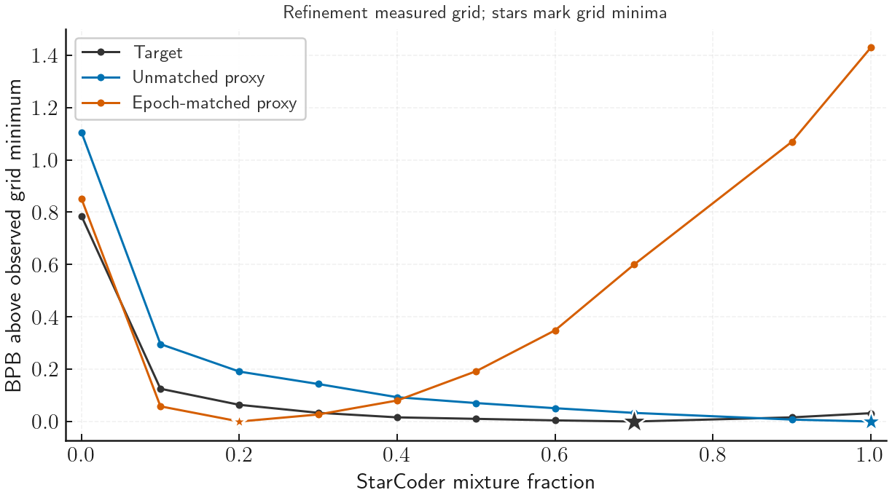

# Epoch matching moves the short-proxy optimum away from the target

Selection minimizes held-out Paloma programming-languages bits per byte (BPB), using its single native evaluation metric. The completed ten-point sweep does not support improved mixture selection from simulated epoching in this setting. The unmatched proxy selects 100% StarCoder; the epoch-matched proxy selects 20%; the target selects 70%. The matched selection incurs **0.063770 BPB target regret**, compared with **0.031826 BPB** for the unmatched selection. These are descriptive, measured-grid results conditional on the fixed subsets and seeds.

| Selection | StarCoder fraction | Target BPB at selected fraction | Target grid regret |
| --- | ---: | ---: | ---: |
| Target | 0.70 | 0.788043 | 0 |
| Unmatched proxy | 1.00 | 0.819869 | 0.031826 |
| Epoch-matched proxy | 0.20 | 0.851813 | 0.063770 |

Matched-minus-unmatched target regret is **+0.031944 BPB**. The matched selection's regret is 2.004 times the unmatched selection's regret. Absolute distance from the target's selected fraction is 0.50 for matched and 0.30 for unmatched. No statistical superiority test or repeat-based confidence interval is available.

## What the refinement resolved

The [original five-point pilot](../../pilot_results/RESULTS.md) selected p=0.3 for matched and p=1 for unmatched, with nearly equal target regrets. Adding p=0.2, 0.4, 0.5, 0.6 and 0.9 to both proxy arms moves the matched minimum to p=0.2. Its proxy loss there is 0.026886 BPB below p=0.3. The unmatched curve remains strictly decreasing through p=1. The target's grid minimum remains p=0.7.

Thus, filling the gap between p=0.3 and p=0.7 did not reveal neighboring proxy optima. The mismatch extends across the curve: at p=1 the matched proxy is 1.429004 BPB above its own minimum, whereas the target is only 0.031826 BPB above its minimum.

Subtracting each curve's own minimum preserves its loss differences; it does not calibrate proxy predictions to the target. Stars mark observed grid minima, and lines only connect measurements. The [raw-loss plot](curves.png) retains absolute BPB.

| StarCoder fraction | Unmatched proxy BPB | Matched proxy BPB | Target BPB |
| --- | ---: | ---: | ---: |
| 0.00 | 2.014069 | 2.014069 | 1.573216 |
| 0.10 | 1.204831 | 1.221240 | 0.913296 |
| 0.20 | 1.099736 | 1.163283 | 0.851813 |
| 0.30 | 1.052185 | 1.190170 | 0.821393 |
| 0.40 | 1.001796 | 1.243619 | 0.803919 |
| 0.50 | 0.979474 | 1.355551 | 0.798246 |
| 0.60 | 0.959771 | 1.511856 | 0.792351 |
| 0.70 | 0.941884 | 1.763008 | 0.788043 |
| 0.90 | 0.916325 | 2.232400 | 0.803891 |
| 1.00 | 0.908917 | 2.592288 | 0.819869 |

Post-hoc curve-agreement diagnostics also favor unmatched: Spearman correlation with target is 0.745 versus −0.285, and RMSE between curves after subtracting their respective minima is 0.132 versus 0.599 BPB. These equally weight the ten sampled coordinates, depend on that grid, and are not prespecified promotion criteria. Formulas and values are recorded in [descriptive_diagnostics.json](descriptive_diagnostics.json): excess-curve RMSE is the square root of the mean squared difference between the proxy and target excess losses. The file also reports RMSE after removing each curve's mean instead of its minimum.

## What this says about the design

All conditions use the same Qwen3 architecture: 210.05M total parameters, 45.88M excluding embeddings. Proxy training uses 277.87M tokens, or 6.06 tokens per nonembedding parameter; target training uses 7.408B tokens, or 161.45. The unmatched proxy draws from the fixed 279.97M-token StarCoder parent, reaching at most 0.9925 nominal epochs. The matched proxy uses its nested 10.486M-token prefix, reaching 26.5 epochs, close to the target's 26.4607. The second domain is Nemotron-CC web data: hq_actual, hq_synth, medium_high, medium, medium_low and low_actual. StarCoder receives token-sampling fraction p; the remaining 1−p is divided among those six components in fixed proportions to their archived token counts. They retain their full caches and remain nonrepeating; the [launcher defines their exact weights](../../../../../experiments/domain_phase_mix/launch_starcoder_wsd_80_20_surface.py).

Nominal StarCoder epochs equal training tokens times p divided by available StarCoder tokens. The construction matches these counts at the same p across proxy and target. The matched proxy selects about 5.3 nominal StarCoder epochs; the target selects about 18.5. Matching repetition counts did not recover the target-selected mixture. The shorter horizon, tiny fixed subset and their interaction are plausible explanations; this experiment does not isolate their contributions. The new parent exactly reproduces the historical interior runs' source indices, and the matched subset is its exact prefix. At most 0.174% allocator-level epoch discrepancy was measured, ruling out a gross repetition-count mismatch.

I recommend keeping this setting as a documented limitation. It cannot support the planned paper illustration that epoch matching recovers the target optimum. Further grid densification or simply increasing target repetition is not supported by these results. A useful next diagnostic is an independently drawn matched subset at fixed horizon and coordinates, which directly tests subset sensitivity. A longer nonrepeating proxy would require a larger finite parent and a newly specified target; its design should be fixed before inspecting outcomes. Neither follow-up has been submitted.

## Scope and verification

The refinement was chosen after inspecting the pilot and reuses its observations, so it is an adaptive follow-up. There are 19 distinct proxy artifacts plus one corrected target endpoint at p=1; the shared web-only proxy supplies both p=0 labels. The original p=1 run used a different StarCoder parent because removing zero-weight web components changed its shuffle key. The replacement restores the interior curve's parent. Nine target points on this grid come from the historical curve. No subset or trainer replication is present. Historical target interiors used JAX 0.10.1, whereas the new runs used 0.11.1; corpus-index parity does not establish numerical training equivalence.

The refinement parent completed on 8 September 2026 at 22:10:04 PDT. Collection on 9 September verified all 20 durable success records, frozen configuration fingerprints and unique finite final-step primary evaluations: step 1059 for proxies and 28259 for the corrected target endpoint. The analyzer uses the actual persisted submission plan. An independent calculation from the measurement CSV and frozen target JSON exactly reproduced all selections and regrets, checked that the ten original pilot measurements and four release-recorded pilot hashes were unchanged, and visually checked both plots.

- [Verified final measurements](../measurements.csv), [actual submission plan](../submission_plan.json), and [collection plan](../collection_plan.json)
- [Primary analysis](analysis.json), [curve points and provenance](curves.csv), and [independent verification](independent_verification.json)
- [Protocol and reproduction commands](../README.md)

Fieldbook experiment: `exp_01m21p4aw15bpvhnswz8gtwn0d`. The planned primary stage covers all 26 target fractions; the replicated stage adds two proxy trainer seeds on that grid. Both remain unsubmitted. This analysis changes no manuscript result or training configuration.
