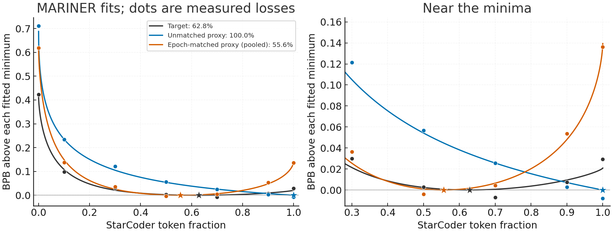

# MARINER fits to the TPP10 pilot

MARINER predicts a minimum near 63% StarCoder for the target, 100% for the unmatched proxy and 56% for the pooled epoch-matched curve. Fits to the three matched subset means place their minima between 51% and 55%.

| Curve | Observed grid minimum | Predicted continuous minimum | Fit RMSE (BPB) |
| --- | ---: | ---: | ---: |
| Target | 70% | 62.82% | 0.00815 |
| Unmatched, two trainer seeds averaged | 100% | 100.00% | 0.01129 |
| Matched subset 20260912, trainer mean | 50% | 54.53% | 0.00785 |
| Matched subset 20260913, trainer mean | 50% | 55.28% | 0.00871 |
| Matched subset 20260914, trainer mean | 50% | 50.85% | 0.01480 |
| Matched, pooled across subsets (secondary) | 50% | 55.57% | 0.00769 |

The decimals locate the numerical minima of the fitted functions; they do not indicate uncertainty in the underlying training response. The target fit predicts 0.79208 BPB at 70%, versus the measured 0.78439. That 0.00769 residual is comparable to the measured 0.00985 BPB difference between 50% and 70%. The predicted 62.82% minimum has not been trained or independently validated. Individual matched trainer/subset fits select 43.86–55.80%, showing sensitivity to the sparse measurements and hyperparameter selection. This range is not a confidence interval.



Lines show fitted responses, dots show the seven observed losses and stars mark fitted minima. Both panels subtract each fitted curve's own minimum. The matched line pools the three subsets as a secondary visualization; separate fits and all seed diagnostics remain in the JSON files. Observations below zero are negative fit residuals.

The analysis uses the native registry entry `weibull_softplus_unscaled@kappa_floor_link_flat15_nocap`: shared Weibull benefit and softplus-squared harm shapes, nonnegative amplitudes, an exponential deficit link and a fitted floor. Shape and ridge use the existing 168-shape, five-ridge grid, followed by the native floor-multiplier search. The two domains are StarCoder and the fixed blend of six web components. Their nominal epochs use the frozen training horizon and physical pool capacities, with the web capacities summed into one fixed-blend pool.

Each fit uses seven distinct mixture coordinates. Proxy trainer seeds are averaged within each subset before fitting. Shape, ridge and floor selection use leave-one-mixture-out cross-validation; the final fit uses all seven coordinates. There is no measured proportional calibration anchor for this pilot, so the existing StarCoder fallback anchors the floor at each training fold's median and applies no external noise margin. Each response curve is fitted independently; target losses never enter proxy fits. The target fit has four amplitudes, an intercept, three shape parameters and a floor: nine nominal parameters before counting ridge, against seven distinct coordinates. Its tuned cross-validation score is not an independent performance estimate.

This is a descriptive follow-up requested after the pilot completed. The pilot's primary result remains the observed common-grid selection analysis: target 70%, unmatched 100%, matched 50%, with regrets 0.036357 and 0.009852 BPB. Fitted minima do not replace those measurements. No training, dense release, manuscript or outline edits were made.

Reproduce from the repository root:

```bash
uv run python -m experiments.domain_phase_mix.exploratory.two_phase_many.fit_starcoder_tpp10_mariner_20260911 \
  --plan .agents/projects/starcoder_tpp10/live/pilot_plan.json \
  --measurements .agents/projects/starcoder_tpp10/live/pilot_metrics.csv \
  --design experiments/domain_phase_mix/starcoder_tpp10_assets/design.json \
  --output .agents/projects/starcoder_tpp10/live/pilot_results/mariner_fit
```

[summary.json](summary.json) contains all fourteen fits, model parameters, residuals, dense predictions, source/input hashes and runtime versions. The script checks the complete pilot identities and measured grid before fitting, scans the full mixture interval and refines every detected minimum while retaining both endpoints. Repository lint, formatting, AST checks and the script's type check pass. The rendered figure was visually checked.
