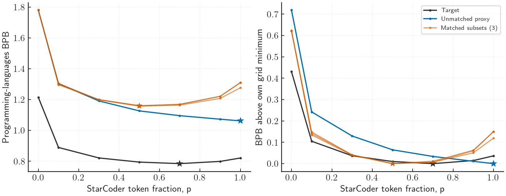

# StarCoder TPP10 pilot: complete target curve

All 57 pilot artifacts are complete. The 50 newly submitted child jobs succeeded, and seven earlier artifacts were reused. The parent finished on 10 September 2026 at 21:34:02 PDT (11 September 04:34:02 UTC).

Epoch matching improves the mixture selected for the target in this setting. The unmatched proxies select pure StarCoder, while all three matched subsets select 50% StarCoder. The target's measured minimum is at 70%.

| Selection source | Selected StarCoder fraction | Target loss (BPB) | Target regret (BPB) |
| --- | ---: | ---: | ---: |
| Target grid minimum | 0.70 | 0.784388 | 0 |
| Unmatched proxy | 1.00 | 0.820746 | 0.036357 |
| Epoch-matched proxy, each of three subsets | 0.50 | 0.794241 | 0.009852 |

The matched selection improves target loss by 0.026505 BPB, reducing regret by about 73%. Both trainer seeds agree on the unmatched selection and on each matched subset's selection. Matching recovers an interior optimum but places it earlier than the target and overstates the penalty at high repetition.

| StarCoder fraction | Target BPB |
| ---: | ---: |
| 0.00 | 1.214910 |
| 0.10 | 0.889110 |
| 0.30 | 0.821187 |
| 0.50 | 0.794241 |
| 0.70 | 0.784388 |
| 0.90 | 0.798773 |
| 1.00 | 0.820746 |

Left: raw endpoint losses. Right: each curve with its own grid minimum subtracted; this removes the vertical loss difference between scales. Proxy lines average two trainer seeds, with each matched subset shown separately. Stars mark observed grid minima; straight segments only connect observations.

Across the seven coordinates, excess-curve RMSE is 0.12878 BPB for unmatched and 0.08756, 0.08603 and 0.08251 for matched subsets 20260912–20260914. Spearman correlations with the target are 0.67857 for unmatched and 0.78571, 0.78571 and 0.85714 for matched. Subtracting the minimum does not remove scale-dependent differences in curvature.

These are grid-selection results, not continuous optima. The target has one trainer seed and one finite parent corpus; the three subset comparisons share target and unmatched curves. The pilot supports improved selection in this setting, with residual transfer error. It does not establish uncertainty over target training seeds or other domains. The dense stage remains unreleased.

The [endpoint CSV](../pilot_metrics.csv) was collected through the archived-plan collector, which requires successful executor records, exact fingerprints and source/runtime receipts, and finite primary metrics at every planned final step. The analysis rechecks the full 57-run identity and grid before selecting minima. The [target checkpoint check](target_checkpoint_validation.json) independently verifies all seven final-step metadata records without reading tensor payloads. The [JSON analysis](analysis.json) retains full precision; the [PDF plot](curves.pdf) is available for review.

Frozen pilot SHA-256: `afa613b25468dd3dadff230544361d815f8524370bd33c14e6c58d3717496ba0`.
