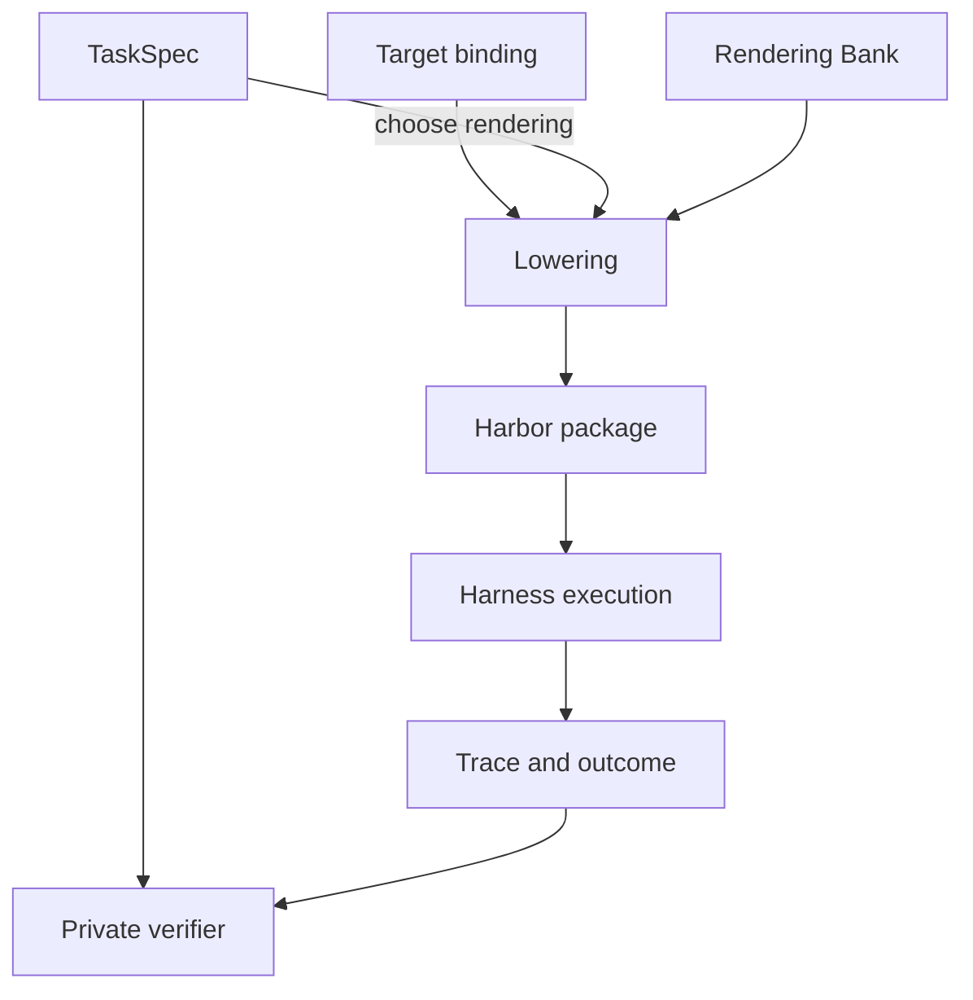

# Design: Task Compendium, a unified semantic representation of RL tasks

The goal of TaskCompendium is to provide a source-agnostic and target-agnostic semantic representation of tasks for model evaluation and training. It should support a wide range of task shapes, including:

- Single-step tasks in a stateless "chat" format.
- Tasks that require a specific initial state, such as a Docker image, a pinned repository, or a provider action surface.
- Multi-step tasks with ordered requests, each with its own submission and correctness check.

TaskCompendium stores reproducible task semantics separately from task presentation and execution. Each record specifies what problem the model needs to solve, what state must exist, what needs to be submitted, and how success is determined. A rendering chooses how that submission is presented. A lowering adapts the rendered task to a runtime such as Harbor or a direct chat rollout.

Separately, TaskCompendium comes with a loose facet-based ontology for tasks, which can be used to evaluate coverage of subject area, difficulty, and other dimensions. This ontology is not meant to be prescriptive, but rather to provide a common vocabulary for describing tasks.


## Problems being solved

- Right now, we don't have an obvious way of jointly training an agentic + nonagentic model. Our current recipes choose one or the other.
- Our training and evaluation recipes also have to select the right grader for each source. Tasks should carry enough versioned verification information that different consumers evaluate the same task consistently. (We should probably still use official harnesses for final evaluation, but we can use a common verifier during training.)
- Our current agentic dataset TaskTrove standardizes specifically on a single lowering of tasks into a docker environment + file submission acceptance formula. Given what we know about Snowball's preference to overfit to training distribution formatting, this is likely to be a problem for generalization: we know that AA-II requires supporting multiple harnesses including chat-only harnesses.
- While TaskTrove is split into multiple datasets based on their source, some of those sources, including the voluminous `laion__nemotron-gym-knowledge-mcqa-v2` dataset contain many, many subject areas. We don't have a holistic sense of how well our datasets cover the space of tasks, subject areas, difficulty, and other dimensions. TaskCompendium will allow us to evaluate coverage of these dimensions in a source-agnostic way.
- TaskCompendium also supports multi-step tasks, which are not currently supported in TaskTrove. Not a big extension.

Keeping TaskTrove's existing packaging would preserve its narrow interaction conventions. Generating directly for individual benchmarks would be faster, but would give us less reusable machinery for future capability gaps. Benchmarks inform our priorities; the representation should support tasks beyond those benchmarks.

## Design

More information in [SPECIFICATION.md](../../../lib/taskcompendium/SPECIFICATION.md).


TaskCompendium has two layers:

- `TaskSpec`: a source-agnostic representation of the task, including its initial state, instructions, and verification criteria.
- `Lowering`: a target-specific/framework-specific adaptation of the task specification, which selects a submission convention and a compatible environment and tool interface. For instance, lowerings may specialize to Harbor.

Most specs come from importers that convert a pinned dataset row or task archive into instructions, resources, and a correctness contract, much like the TaskTrove conversion. An importer should reject a row when it cannot recover enough information to specify or verify the task. Generated tasks would need to meet the same requirements.

A rendering chooses the requested submission format and extraction rule. A target binding says how one target runs a `TaskSpec`: the environment it uses and the tools it exposes. A lowering combines the specification, rendering, and target binding. The launch selects a compatible harness, model, and rollout settings. Tasks declare requirements; environments provide them; harnesses orchestrate them; traces record what happened.

Honestly it is probably best to just look at the data. Here are links to the HF dataset spike for each layer:

- [Specs](https://huggingface.co/datasets/open-athena/taskcompendium-spike/viewer/specifications)
- [Lowerings](https://huggingface.co/datasets/open-athena/taskcompendium-spike/viewer/lowerings)

The Rendering Bank in the diagram is the collection of available presentation and submission conventions.



For instance, consider a simple GSM8K math problem. The `TaskSpec` would include the question, the instructions (solve the problem), and the verification criteria (the correct answer). One lowering might request a plain chat answer, while another might ask for JSON in `/app/answer.json` and provide filesystem access (as is done in TaskTrove). Both retain the same correctness check. Multiple task lowerings can be created for the same `TaskSpec`, allowing us to ensure that the model encounters a variety of packagings and formats for the same kinds of problems. (Likely we'd typically only want one rendering per epoch, but we could vary the rendering across epochs.)

As an extension, we can also imagine combining multiple TaskSpecs into a single multi-step task to better simulate real-world use.

Harbor is the first and currently the only implemented execution target. We start by lowering everything through Harbor; a future MarinSkyRL Generator can also use direct chat lowerings for compatible tasks while still using Harbor for agentic tasks. The current spike establishes the representation and Harbor integration. Coverage-directed generation, Snowball rollouts, and training admission are later stages. Ordered steps retain the preceding visible conversation; reactive user simulators are deferred. MCP and browser support are planned extensions.

## TaskSpecs

TaskSpecs declare the following fields (see the specification for their full definitions):

- id: a unique identifier for the task specification.
- metadata: source provenance and descriptive labels.
- steps: a list of steps that make up the task, each of which includes:
  - instructions: the instructions for the step.
  - answer_requirements: intrinsic constraints on what the step produces.
  - verifier: private criteria for determining whether the step was completed successfully.
  - resources: resources introduced at this step, with explicit visibility.
  - context_requirement: whether the step depends on prior conversation or only its instruction and workspace.
- requirements: capabilities, initial state, and action interfaces required by the task.
- resources: a list of files (with paths and content or pointers to content) that are required for the task, such as input data or reference materials.
- coverage_tags: sparse labels for subject area, task shape, and other semantic distinctions that help analyze corpus coverage.
- difficulty: a 1–10 estimate of the model capability needed for reliable success under the declared tools and a normal budget.
- success_policy: how step scores combine into the task's result. The current Harbor adapter supports `mean` and `final` for multi-step tasks.

`success_policy` is part of the private correctness contract: it specifies how the per-step verifiers' scores become one task result.
`context_requirement` declares what a step depends on; the current lowering always retains the preceding visible conversation.

### Requirements

Requirements are split into three categories:

- Capabilities: Semantic requirements like `filesystem`, `shell`, and `process`.
- State: image, working directory, etc.
- Action Interfaces: stateful action surfaces meant to encapsulate things like tool bundles, MCP, etc.

An action interface is a package of tools plus the persistent world they act on. The current Workplace example is pinned from [NVIDIA's Nemotron RL Workplace Assistant dataset](https://huggingface.co/datasets/nvidia/Nemotron-RL-agent-workplace_assistant). It has:

```
Tools: email_reply, create_task, move_task, look_up_employee, ...
State: inboxes, projects, task boards, directory records
Seed: the specific initial company snapshot
Rules: how each tool mutates state and what it returns
```

Action Interfaces are not fully baked. They're meant to cover non-shell, non-filesystem stateful providers. They should be versioned and pinned to a specific seed state.

### Resources and visibility

Every resource has a normalized relative path, content, roles, and an executable bit. Content is embedded bytes or a URI with a SHA256 digest. Roles describe what scopes have access to the resource (`agent`, `verifier`, `oracle`)

Only agent-visible resources and instructions reach the model. Verifier resources, reference answers, and oracle material stay private. Oracle material holds reference solutions or source evidence for auditing and reference runs. Instructions state the requested work and submission location, without mentioning judges, verifiers, rewards, or hidden tests.


### Verifiers

Verifiers can come from an ontology of known verifiers or be backed by a script. They are used to determine whether a task has been completed successfully.

Submission extraction belongs to the rendering: it recovers an answer from plain text, boxed LaTeX, a JSON/XML field, or a file. The verifier checks that recovered answer against the same semantic correctness criteria. Intrinsic formatting requirements remain part of the task and cannot be relaxed by a rendering.

Common math and MCQA checks can run directly; executable checks declare their own isolated runtime and dependencies. A common representation should not require booting Docker to grade a math answer. Use the cheapest verifier that adequately checks the task; where deterministic checks are incomplete, supplement them with a judge.

The spike runs on a pinned Marin fork of Harbor, with TaskCompendium environment, agent, and verifier plugins. The private verifier is stored in `specification.json`; the launch selects `SemanticVerifier`, which reads it and evaluates the submission. The export contains no `tests/test.sh`; Harbor requires an explicit custom-verifier launch to run it. The separate specification, rendering, binding, and manifest JSON files make the spike inspectable; this duplication is an export implementation choice, not a requirement of the representation.

We haven't fully specced LLM-as-judge yet but it fits here.

Verifier infrastructure failure is recorded separately from an incorrect answer with score zero. During import, reject tasks with incomplete verifiers, underspecified instructions, leaking answers, or null submissions that pass. Training usefulness is a separate assessment, relative to Snowball's roughly 2B active scale and observed success rates; frontier-model solvability alone is insufficient.


## Coverage Ontology

More information in [TAGGING.md](../../../lib/taskcompendium/TAGGING.md).

The basic idea is to describe coverage in terms of subject, task shape, difficulty, and other useful distinctions. Semantic tags and a numeric difficulty estimate let us inspect those distributions across source datasets. The [tagging guide](../../../lib/taskcompendium/TAGGING.md) defines the working vocabulary.

The vocabulary is a starting point for labeling tasks and expressing desired RL mixtures, and we expect to revise it. The mechanics matter more than fixing the detailed taxonomy now. Subjects describe topics such as medicine or physics; competencies describe recurring operations across those topics. Tags that add little information or blur that distinction should be revised or removed.

- `competency:`, an optional cross-subject skill, such as:
  - `recall`
  - `causal_reasoning`
  - `information_extraction`
  - `rule_application`
  - `planning`
  - `debugging`
- `subject:`:
  - `math`
  - `science`
  - `history`
  - `literature`
  - `javascript.react` (note: sub-subject areas are allowed)
- `shape:`: the shape of the task, including:
  - `multiple_choice`
  - `explanation`
  - `code_generation`
- `artifact:`: the type of artifact produced by the task, including:
  - `prose`
  - `python_package`
  - `artifact:application/xml`
- `context:`: important inputs or the setting
  - `context:filesystem`
  - `context:workplace_assistant`
`TaskSpec.difficulty` is an integer from 1 to 10: 1–2 is routine for Snowball's roughly 2B active scale, 3–4 stretches it, 5–6 likely requires a larger model, 7–8 is frontier-level, and 9–10 requires a production frontier model or agent for reliable success. These are initial estimates, not measured pass rates. Tags remain sparse, with recurring subjects and subsubjects. Lowerings add output-format tags such as `result:json`, `result:xml`, and `result:file`, separately from semantic work. Measured success should record model, lowering, tools, and budget.


We can use a medium-sized model to assign tags to a task specification, and then use those tags to evaluate the coverage of the task compendium as a whole. For instance, we can look at the distribution of subject areas, difficulty levels, and other dimensions across the entire compendium. This will allow us to identify gaps in coverage and ensure that we are providing a diverse set of tasks for model evaluation and training.
Those gaps can then guide further imports or task generation, with each accepted example represented as a reproducible TaskSpec.
