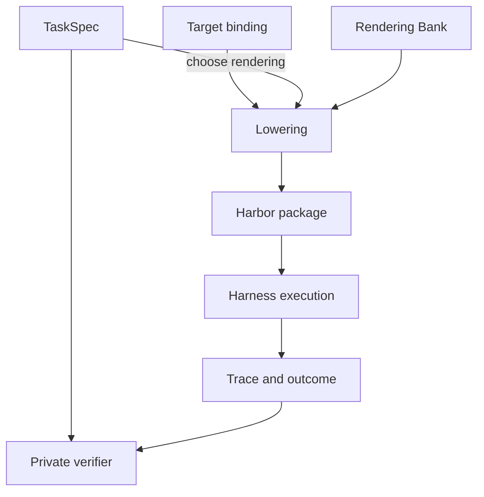

# Design: Task Compendium, a unified semantic representation of RL tasks

The goal of TaskCompendium is to provide a source-agnostic and target-agnostic semantic representation of tasks for model evaluation and training. It should support a wide range of task shapes, including:

- Single-step tasks in a stateless "chat" format.
- Tasks that require a specific initial state, such as a Docker image, a pinned repository, or a provider action surface.
- Multi-step tasks with ordered requests, each with its own submission and correctness check.

TaskCompendium stores reproducible task semantics separately from task presentation and execution. Each record specifies what problem the model needs to solve, what state must exist, what needs to be submitted, and how success is determined. A rendering chooses how that submission is presented. A lowering adapts the rendered task to a runtime such as Harbor or a direct chat rollout.

Separately, TaskCompendium comes with a loose facet-based ontology for tasks, which can be used to evaluate coverage of subject area, difficulty, and other dimensions. This ontology is not meant to be prescriptive, but rather to provide a common vocabulary for describing tasks.


## Problems being solved

- Right now, we don't have an obvious way of jointly training an agentic + nonagentic model. Our current recipes choose one or the other.
- Our current agentic dataset TaskTrove standardizes specifically on a single lowering of tasks into a docker environment + file submission acceptance formula. Given what we know about Snowball's preference to overfit to training distribution formatting, this is likely to be a problem for generalization: we know that AA-II requires supporting multiple harnesses including chat-only harnesses.
- While TaskTrove is split into multiple datasets based on their source, some of those sources, including the voluminous `laion__nemotron-gym-knowledge-mcqa-v2` dataset contain many, many subject areas. We don't have a holistic sense of how well our datasets cover the space of tasks, subject areas, difficulty, and other dimensions. TaskCompendium will allow us to evaluate coverage of these dimensions in a source-agnostic way.
- TaskCompendium also supports multi-step tasks, which are not currently supported in TaskTrove. Not a big extension.

## Design

More information in [DESIGN.md](/lib/taskcompendium/DESIGN.md).


TaskCompendium has two layers:

- `TaskSpec`: a source-agnostic representation of the task, including its initial state, instructions, and verification criteria.
- `TaskLowering`: a target-specific/framework-specific adaptation of the task specification, which may include additional context or constraints required by the target environment. For instance, lowerings may specialize to Harbor.

TaskLowerings choose specific backends as well as making last mile prompt and submission formatting decisions.

Honestly it is probably best to just look at the data. Here are links to the HF dataset spike for each layer:

- [Specs](https://huggingface.co/datasets/open-athena/taskcompendium-spike/viewer/specifications)
- [Lowerings](https://huggingface.co/datasets/open-athena/taskcompendium-spike/viewer/lowerings)



For instance, consider a simple GSM8K math problem. The `TaskSpec` would include the initial state (the question), the instructions (solve the problem), and the verification criteria (the correct answer). A `TaskLowering` for a chat-based model might format the question as a chat message, while a lowering for a docker execution environment might package the question in a specific file format in a specific place (as is done in TaskTrove). Multiple task lowerings can be created for the same `TaskSpec`, allowing us to ensure that the model encounters a variety of packagings and formats for the same kinds of problems. (Likely we'd typically only want one rendering per epoch, but we could vary the rendering across epochs.)

As an extension, we can also imagine combining multiple TaskSpecs into a single multi-step task to better simulate real-world use.

## TaskSpecs

TaskSpecs declare the following fields:

- id: a unique identifier for the task specification.
- metadata: a dictionary of metadata about the task, including its source, subject area, difficulty, and other relevant information.
- steps: a list of steps that make up the task, each of which includes:
  - instructions: the instructions for the step.
  - verification_criteria: the criteria for determining whether the step was completed successfully.
- requirements: a list of requirements for the task, such as initial state, specific libraries or tools that must be available in the execution environment.
- resources: a list of files (with paths and content or pointers to content) that are required for the task, such as input data or reference materials.
- coverage_tags: a list of tags that describe the coverage of the task in terms of subject area, difficulty, and other relevant dimensions. These tags can be used to evaluate the coverage of the task compendium as a whole.

### Requirements

Requirements are split into three categories:

- Capabilities: Semantic requirements like `filesystem`, `network`, etc.
- State: image, working directory, etc.
- Action Interfaces: stateful action surfaces meant to encapsulate things like tool bundles, MCP, etc.

An action interface is a package of tools plus the persistent world they act on. The current Workplace example is pinned from [NVIDIA's Nemotron RL Workplace Assistant dataset](https://huggingface.co/datasets/nvidia/Nemotron-RL-agent-workplace_assistant). It has:

```
Tools: email_reply, create_task, move_task, look_up_employee, ...
State: inboxes, projects, task boards, directory records
Seed: the specific initial company snapshot
Rules: how each tool mutates state and what it returns
```

Action Interfaces are not fully baked. They're meant to cover non-shell, non-filesystem stateful providers. They should be versioned and pinned to a specific seed state.

### Resources and visibility

Every resource has a normalized relative path, content, roles, and an executable bit. Content is embedded bytes or a URI with a SHA256 digest. Roles describe what scopes have access to the resource (`agent`, `verifier`, `oracle`)


### Verifiers

Verifiers come from either an ontology of known verifiers or backed by a script. They are used to determine whether a task has been completed successfully.

ATM, the plan is for the ontology to encapsulate answer parsing for MCQA, math extraction, and a few others. We will likely extend it to cover IFEval and things from NemoGym.

We haven't fully specced LLM-as-judge yet but it fits here.


## Coverage Ontology

More information in [TAGGING.md](/lib/taskcompendium/TAGGING.md).

The basic idea is that we want to be able to describe the coverage of a task compendium in terms of subject area, difficulty, and other relevant dimensions. We can do this by defining a set of tags that can be applied to each task specification. These tags can then be used to evaluate the coverage of the task compendium as a whole. We leave the full (but not exhaustive) list of tags and their definitions to the TAGGING.md document, but here are some examples:

- `competency:`, the main reasoning or execution skill, including:
  - `causal_reasoning`
  - `information_extraction`
  - `function_calling`
  - `program_synthesis`
- `subject:`:
  - `math`
  - `science`
  - `history`
  - `literature`
  - `javascript.react` (note: sub-subject areas are allowed)
- `shape:`: the shape of the task, including:
  - `multiple_choice`
  - `explanation`
  - `code_generation`
- `artifact:`: the type of artifact produced by the task, including:
  - `prose`
  - `python_package`
  - `artifact:application/xml`
- `context`: important inputs or the stting
  - `context:filesystem`
  - `context:workplace_assistant`
- `difficulty:`: a rough measure of how hard the task is, namely:
  - `difficulty:easy`
  - `difficulty:medium`
  - `difficulty:hard`


We can use a medium-sized model to assign tags to a task specification, and then use those tags to evaluate the coverage of the task compendium as a whole. For instance, we can look at the distribution of subject areas, difficulty levels, and other dimensions across the entire compendium. This will allow us to identify gaps in coverage and ensure that we are providing a diverse set of tasks for model evaluation and training.
