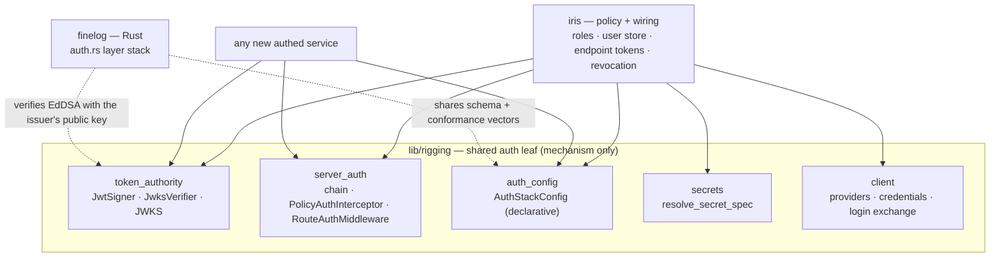
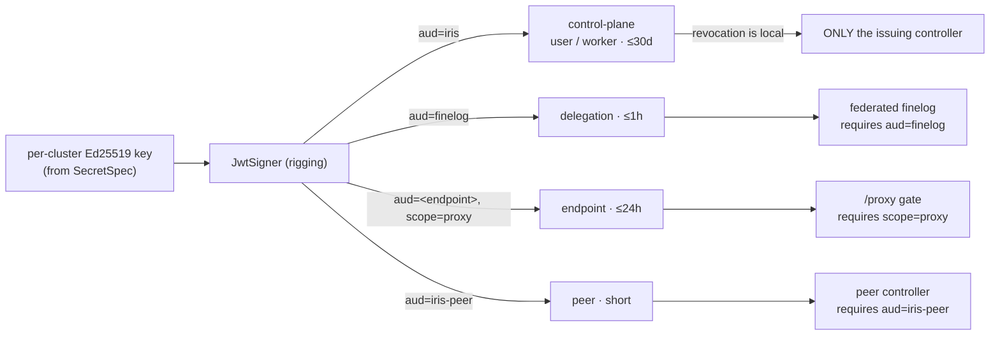
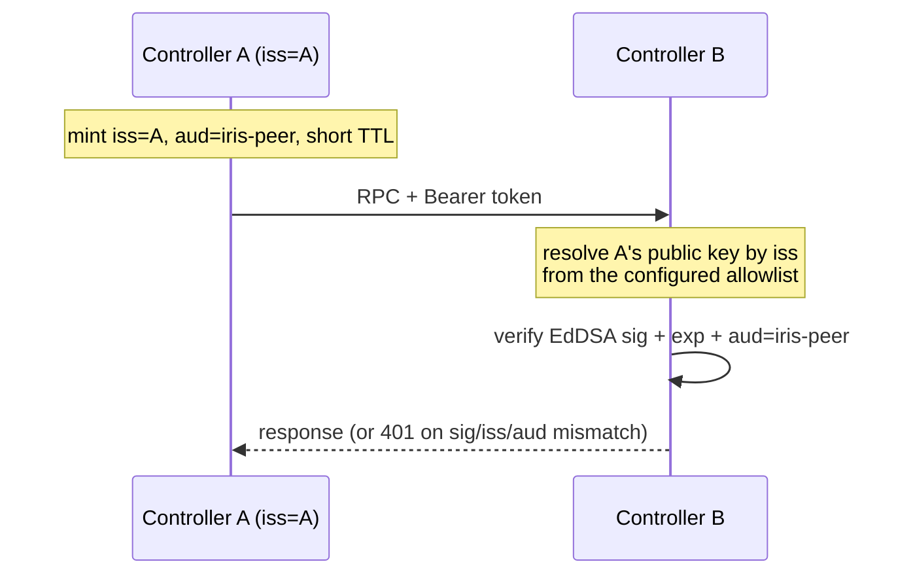
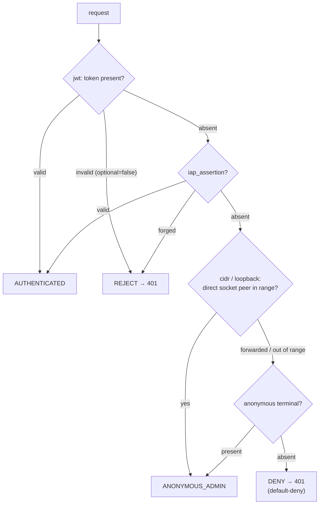
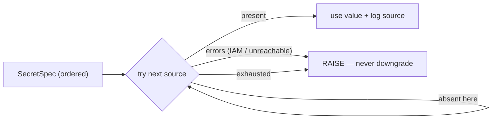

# Unified server auth & secret configuration

_Why are we doing this? What's the benefit?_

Server auth is already centralized in `lib/rigging` — verifiers, the
authenticator chain, and the two enforcement points a service mounts
unconditionally ([`server_auth.py`](https://github.com/marin-community/marin/blob/5a6f64cbeef5e1962ed367deb3aaf72956ddb4d1/lib/rigging/src/rigging/server_auth.py)).
The "sloppiness" the audit names is four gaps *around* that seam. This umbrella
picks one standard pattern for **defining a new authed service**, **where auth
config and keys live**, and **how services and clients authenticate** — closing
out #6861, #6873, #6580, #6592 as one posture. Because **no service tokens are
deployed yet**, it also makes the one breaking change worth making now: asymmetric
keys. Full current-state map and external prior art: [`research.md`](./research.md);
contracts: [`spec.md`](./spec.md); headless onboarding + user tightening:
[`onboarding.md`](./onboarding.md).

## Overall shape

`rigging` is the single home for the auth *mechanism* — signer/verifier/JWKS,
the request chain, client credential resolution, and login. iris and finelog are
thin **policy + wiring** on top.

## Challenges

Auth is enforced by *two* implementations that mirror each other but drift:
rigging assembles its chain **in Python code** (`RequestAuthPolicy.enforcing`);
finelog parses a **declarative JSON layer stack** in Rust (`FINELOG_AUTH_POLICY`,
[`auth.rs`](https://github.com/marin-community/marin/blob/5a6f64cbeef5e1962ed367deb3aaf72956ddb4d1/lib/finelog/rust/src/server/auth.rs)),
with a different default posture (finelog default-deny; rigging installs
authenticators only when a verifier is present) and ordering (finelog cidr-first).
Second, iris **controller config** inlines shared secrets (`delegation_key`,
static tokens) into a world-readable ConfigMap / GCE metadata via `config_to_dict`
(#6873) — the very class finelog's server refuses to inline
(`assert_inlineable_auth`).

## Costs / Risks

- Churn in a security-sensitive path with no user-visible feature; every
  regression is a potential auth bypass, so changes are test-gated behind the
  default-deny invariants.
- The token-format switch is cheap *now* (greenfield, ~3 sites) but breaking —
  do it before any token is issued, not after.
- Asymmetric keys add **key rotation** (JWKS overlap windows) as a real
  operational concern a single symmetric secret didn't have.
- A shared declarative schema adds a config surface + a cross-language conformance
  suite that must stay in lockstep.
- The Phase-2 Rust engine would give rigging a compiled wheel — deferred, gated.

## Design

### 0. Foundational: asymmetric, JWKS-verified tokens

Adopt **public-key JWTs (EdDSA/Ed25519)** now instead of HS256. A service is a
**signing authority**: it mints with a **per-cluster private key** (sourced from
a `SecretSpec`, §2 — never generated into the node-local SQLite, which is lost on
node replacement, `f691c03f2`) and publishes public keys at
`/.well-known/jwks.json`; every verifier holds only the **public** key. A single
marin-wide *private* key is rejected — it would recreate the shared blast radius.
The generic mechanism lives in `rigging.token_authority`; iris keeps only policy.

**This retires #6873's headline secret:** `delegation_key` (a *shared symmetric
HMAC secret* finelog verifies with, that "anyone who reads can mint") becomes the
controller's **public** key — inline-safe, not a secret. `peers.static_token` and
`finelog.static_token` retire the same way. So `assert_inlineable_auth` *inverts*
(a jwt layer is now inline-safe), and the `SecretSpec` residue shrinks to the
private key plus dev/CI static tokens and the IAP OAuth secret.

**MANDATORY corollary — per-plane audience binding (RFC 8725).** One key removes
the incidental isolation a *dedicated* symmetric key gave (a finelog-verifiable
token physically couldn't mint control-plane tokens). Without audience binding,
sig+exp-only verification would let any iris token verify at any federated
finelog, and let a compromised global finelog **replay** a delegation token at the
controller's RPC surface. So every token carries an `aud` naming exactly one
plane, every verifier **requires** its expected `aud`, and **revocation stays
local** — remote verifiers only ever see short-TTL, plane-scoped tokens; long-lived
control-plane JWTs are verified only by the issuing controller (where the jti
revocation set lives).

**Federation — how controller A talks to B.** Each controller is its own issuer
(`iss=<cluster>`, own keypair + JWKS). A mints `iss=A, aud=iris-peer`; B verifies
against **A's public key**, resolved by `iss` from B's *configured* allowlist
(never a URL from the token — SSRF), and checks `aud`. No shared secret; blast
radius stays per-cluster. (A marin **root** signing cluster keys — a CA / SPIFFE
trust domain — is the scaling step if cluster count grows.)

One verification mechanism serves everything: the IAP assertion (ES256), Google
ID tokens (RS256), and service tokens (EdDSA) all verify through the same JWKS
machinery, and finelog verifies with the same `jsonwebtoken` crate the Phase-2
engine would use.

### 1. One declarative auth-stack schema (#6861)

`rigging.auth_config.AuthStackConfig` — an ordered list of typed layers, parsed
from JSON/YAML, **deny-by-default**, that models the *request chain*
(`jwt` / `iap_assertion` / `cidr` / `loopback` / `anonymous`); login-exchange
verifiers stay in code behind the `Login` RPC. `RequestAuthPolicy.from_config`
compiles it into the existing authenticator chain, with a state→stack table
(spec §1.3) pinning **no behavior change** for every current cluster. The schema
shape follows Istio's `RequestAuthentication`/`AuthorizationPolicy` (research §7.1),
including the explicit CIDR proxy-trust model (socket-peer vs `X-Forwarded-For`).

What is *shared* with finelog is the ordered-list wire convention, the
default-deny/allow-localhost semantics, and the `cidr` layer. The drift fix is
the **Casbin lesson** (research §7.1): a **shared conformance test-vector suite**
both the Python and Rust evaluators must pass in CI — not two parsers that happen
to agree. The `jwt` layer stays per-implementation (rigging injects a Python
verifier; finelog's `JwtAuthLayer` carries an inline public key per §0).

### 2. Secret supply — `rigging/secrets.py` (#6873)

A secret field is a `SecretSpec`: an **ordered list of references**
(`env:` → `file:`; `gcp-secret://…/versions/<v>` always explicit, version
mandatory), resolved first-*present*-wins with an **absent-vs-failed** discipline
— the same `ABSENT`/`REJECT` rule the auth chain uses, so a stale source can't
silently shadow a rotated key.

A **default field-keyed path** (`env:` → `file:`) means the common case needs no
per-field config; it matches the platform-injection preference (research §7.2:
ESO/CSI populate `env:`/`file:` so the controller links no Secret-Manager SDK; only
GCE reads `gcp-secret://` via the attached SA). Resolution happens at the
**controller runtime** (not `load_config`, which also renders the deploy artifact);
fields carry an explicit `SecretRefSpec` marker (not the `is_sensitive_key_name`
name-heuristic, which misses `delegation_key`), and the two render sites call
`assert_no_inlined_secrets`, refusing a raw value anywhere in a path. No
`k8s-secret://` scheme (would need `secrets: get`, which the ClusterRole grants
none of). **Everything secret — including the private signing key — flows through
this one path.**

### 3. Consistent posture + the rollout runbook

Both iris and finelog express their request stack in the §1 schema (default-deny,
allow-localhost, `cidr` for direct-peer trust, `jwt`, IAP in front); finelog also
gets a docs fix (`finelog/AGENTS.md:29-31` still claims it "ships no auth"). The
**missing artifact** is a single page, `lib/rigging/docs/authed-service.md`, that
walks a service author through: mount `PolicyAuthInterceptor` + `RouteAuthMiddleware`
unconditionally; declare the stack; inject a verifier + role resolver; annotate
routes `@public`/`@requires_auth`; read `get_verified_identity()`; front with IAP
(`iap_gclb.py`) / Traefik (`install_traefik_proxy.py`) or expose at `/proxy/<name>`;
source secrets via `SecretSpec`. It calls out that a `cidr` layer grants
`ANONYMOUS_ADMIN` — operator-trust ranges only, never an ingress hop's. The
**client** recipe sits alongside: `credentials_for(cluster, auth)` →
`ClientCredentials.interceptors()` → `connect(transport, factory, auth=...)`.

### 4. Headless onboarding + user tightening → [`onboarding.md`](./onboarding.md)

The #6580/#6592 slice — Workload Identity Federation for keyless headless access,
the `SetUserRole` RPC + `iris user grant` CLI, and the IAP `login`-provisioning
flip — is a nearly-independent workstream, split into its own doc.

## Phasing & the Rust engine

- **Phase 1 (this design's core):** the token switch (§0) + declarative schema +
  conformance vectors + `secrets.py`, plus the onboarding work. No packaging change.
- **Phase 2 (final, optional): a shared Rust *verify* engine.** Server-side
  verification is standard JWT crypto — IAP (ES256), Google ID token (RS256), and
  EdDSA service tokens all verify with `jsonwebtoken` + a JWKS cache, and finelog
  **already** verifies in Rust and **already ships a pyo3/abi3 wheel**
  (`lib/finelog/rust/pyext/`). So the engine generalizes `auth.rs` + ports the pure
  layers of `server_auth.py` behind an existing packaging pattern; it returns
  verified claims and Python assigns the role (the email→role resolver hits iris's
  DB — a Python callback). **Client-side minting stays Python and *standard*** (WIF
  for headless, installed-app OAuth for humans, `iris login` as a token-exchange in
  the RFC 8693 *pattern*) — there is no bespoke Rust re-mint to write. **Recommend
  building Phase 2 only if the conformance vectors surface real semantic drift**;
  if built, verify-only.

## Testing

The **shared conformance vectors** (input request → expected verdict) run against
both evaluators — the drift gate. `resolve_secret_spec` per scheme, covering
absent-vs-failed and unknown-scheme-raises. `RequestAuthPolicy` round-trip tests
that every state→stack entry (spec §1.3) admits/denies identically to today's
chains (re-running `test_server_auth.py`: loopback, `X-Forwarded-For` spoof,
worker-JWT attribution, scoped-token RPC denial). The load-bearing #6873 test is a
**deploy-path round trip**: a reference-configured cluster renders the *reference*
(never the value) and passes `assert_no_inlined_secrets`, a raw secret raises, and
`serve` resolves at startup. Add EdDSA verify + **per-plane `aud` rejection** tests
(a control-plane token must be rejected by finelog; a delegation token by the RPC
surface). Rollout: exercised against the Iris dev controller before marin.

## Open Questions

- **Signature algorithm: EdDSA vs ES256.** Recommend **EdDSA (Ed25519)** — small,
  modern, PyJWT (`cryptography`) + Rust `jsonwebtoken`. ES256 is the conservative
  choice if a future non-Rust/non-Python verifier matters.
- **Does any symmetric bearer survive?** Part 0 retires `delegation_key`,
  `finelog.static_token`, *and* `peers.static_token`. Only `StaticAuthConfig.tokens`
  remains — keep it as dev/CI convenience (guarded by `SecretSpec`), or make static
  tokens test-only?
- **Biscuit — optional, attenuation-only, separate.** With asymmetric native, its
  only residual win is offline *attenuation* of scoped `/proxy` tokens (self-mint).
  It replaces the `jwt` layer, not the stack. Recommend: skip for the core;
  evaluate separately only if offline capability-attenuation is wanted.
- **Commit to the Phase-2 Rust engine now, or gate on drift?** Recommend gate;
  verify-only; mint stays Python.
- **`SecretSpec` default path** (`env:` → `file:`; `gcp-secret://` always explicit
  since its version can't be conventional). Keep the field-name→source default, or
  require every secret to be explicit?
- **Out of scope (confirming):** unauthenticated bundle downloads (deferred in
  `20260312_iris_auth_design.md`) and 30-day-JWT refresh stay out — flag if you
  disagree.
