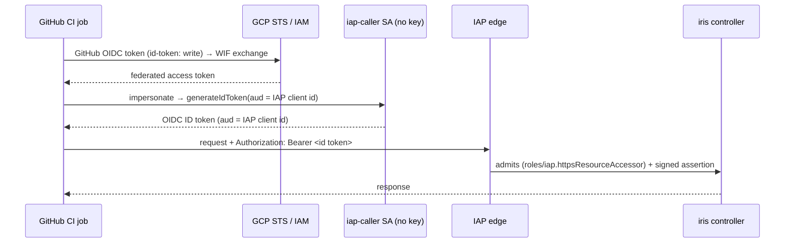
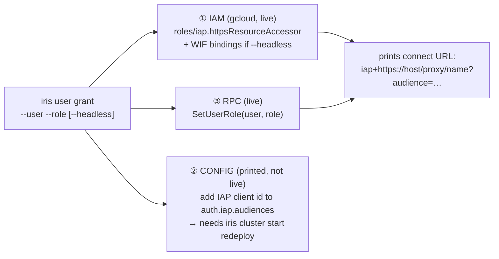

# Headless onboarding & user tightening (#6580, #6592)

A nearly-independent slice of the [auth umbrella](./design.md): how a headless
identity (CI, cron, ops script) reaches an IAP-fronted Marin service without a
downloaded key, and how the controller's user store becomes a real allowlist
instead of auto-granting write access on first login. Contracts: [`spec.md`](./spec.md)
§3; current-state map: [`research.md`](./research.md) §2 (user store), §7.2 (WIF).

## Problem

Two loose ends around IAP:

- **#6580 — no clean headless auth.** The service-account→IAP flow is fully
  implemented (`IapServiceAccountTokenProvider`), but standing up a CI/cron
  identity is tribal, spread across GCP IAM + cluster config + the controller user
  store — so jobs (e.g. the cost-manager, PR #6555) fall back to an SSH tunnel with
  an extra SSH-key secret.
- **#6592 — the user store isn't an allowlist.** The `login` RPC auto-provisions
  *any* IAP-admitted identity at the write-capable default role `"user"`
  (`service.py:2584-2620`); there is **no** role-change RPC (`set_user_role` runs
  only at startup for `admin_users`). So "who can reach IAP" is the only real gate.

## #6580 — keyless headless access via Workload Identity Federation

Recommend **WIF — no downloaded SA key** (research §7.2). It retires both the SA
key *and* the SSH-tunnel fallback. A CI job's own OIDC token is federated and used
to impersonate one dedicated, minimal `iap-caller` SA, which mints the IAP ID
token; the SA's key is **never exported**.

Why the dedicated SA: a *custom-audience* IAP ID token requires the impersonation
path (direct WIF issues only ≤10-min access tokens with no arbitrary audience), so
one keyless `iap-caller` SA stays the impersonation target. GCE/GKE cron is the
same minus the federation hop: the attached SA calls `generateIdToken(audience=<IAP
client id>)` off the metadata server.

## #6592 — make the user store an allowlist

Add an admin-only **`SetUserRole` RPC** (the missing role-change path;
`AuthzAction.MANAGE_USER_ROLES`, admin-only) and flip `login` on **IAP clusters**
to provision at `unprovisioned_role` (read-only `dashboard`) instead of `"user"` —
so the user store, not "reached IAP", is the write-access allowlist. `gcp`/`static`
login is unchanged (there `GcpAccessTokenVerifier`'s project check already *is* the
allowlist).

## `iris user grant` — one command, three planes

The only non-startup grant path, for humans and service accounts alike. It spans
three distinct actuation planes; only the live ones are applied automatically:

Plane ② is a config edit the command cannot apply to a running controller, so it
prints the diff + redeploy step rather than pretending to mutate live state.

**Claims trap (runbook note):** a role is baked into the (30-day) JWT and
verification never reads the user store, so a grant takes effect only after the
user re-runs `iris login`.

## Rollout / open question

The `login`-provisioning flip is a behavior change for every IAP cluster (today
first login grants write). Land it behind an ops announcement, or as a follow-up
once `SetUserRole` exists so operators can pre-grant current users first? (This is
the one open question this slice owns; the rest are in [`design.md`](./design.md).)
