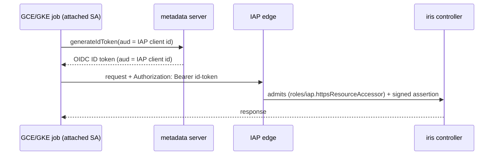
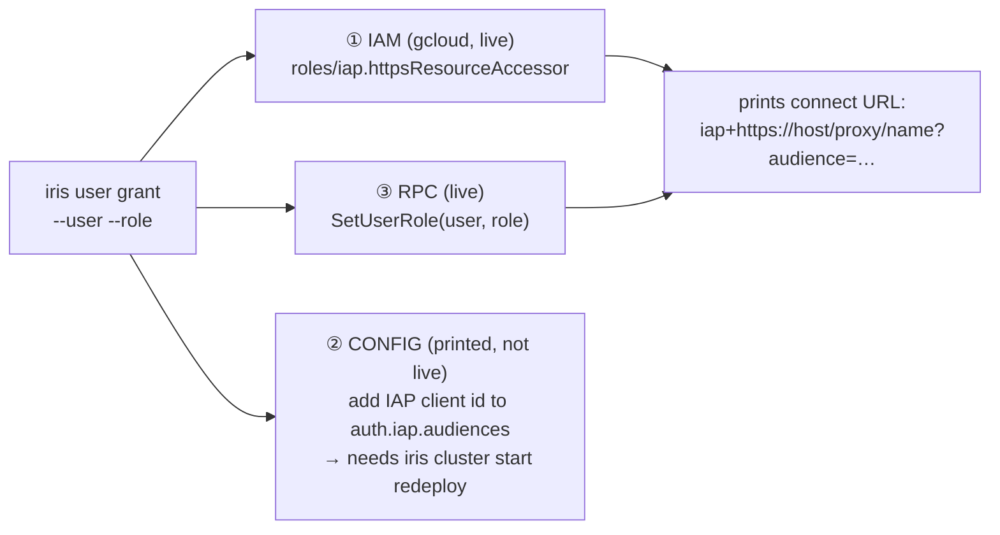

# Headless onboarding & user tightening (#6580, #6592)

A nearly-independent slice of the [auth umbrella](./design.md): how a headless
identity (CI, cron, ops script) reaches an IAP-fronted Marin service without a
downloaded key, and how the controller's user store becomes a real allowlist
instead of auto-granting write access on first login. Contracts: [`spec.md`](./spec.md)
§3; current-state map: [`research.md`](./research.md) §2 (user store), §7.2 (WIF).

## Problem

Two loose ends around IAP:

- **#6580 — no clean headless auth.** The service-account→IAP flow is fully
  implemented (`IapServiceAccountTokenProvider`), but standing up a CI/cron
  identity is tribal, spread across GCP IAM + cluster config + the controller user
  store — so jobs (e.g. the cost-manager, PR #6555) fall back to an SSH tunnel with
  an extra SSH-key secret.
- **#6592 — the user store isn't an allowlist.** The `login` RPC auto-provisions
  *any* IAP-admitted identity at the write-capable default role `"user"`
  (`service.py:2584-2620`); there is **no** role-change RPC (`set_user_role` runs
  only at startup for `admin_users`). So "who can reach IAP" is the only real gate.

## #6580 — headless access (phase 1: SA credentials, no WIF yet)

The existing `IapServiceAccountTokenProvider` already turns an SA identity into an
IAP ID token; the only real question is **how the SA credential is sourced**.
Full Workload Identity Federation (keyless, no downloaded key) is the right
*end-state*, but standing up pools + providers + a chain of IAM bindings is
over-built for the first cut. **Phase 1** therefore ships the two simplest safe
paths and keeps WIF as a documented fast-follow:

- **Attached identity (GCE/GKE cron) — no key at all.** The attached SA calls
  `generateIdToken(audience=<IAP client id>)` off the metadata server. This is the
  default wherever a workload identity already exists; nothing is downloaded.

- **Keyless environments (GitHub CI) — a time-gated SA key.** Where no GCP
  identity exists, use a downloaded `iap-caller` SA key, but **sourced through the
  same `SecretSpec` path** (§2) so it is never inlined, and **time-gated**: enforce
  key expiry/rotation via the `iam.serviceAccountKeyExpiryHours` org policy so a
  leaked key self-expires. This trades WIF's setup cost for a rotation obligation —
  acceptable for phase 1.

**WIF is the end-state, not phase 1.** When CI-identity federation is worth the
setup, the keyless upgrade (CI OIDC → WIF → impersonate `iap-caller` →
`generateIdToken`) drops the downloaded key entirely and retires the rotation
obligation. Tracked as a fast-follow; not built in this PR.

## #6592 — make the user store an allowlist

Add an admin-only **`SetUserRole` RPC** (the missing role-change path;
`AuthzAction.MANAGE_USER_ROLES`, admin-only) and flip `login` on **IAP clusters**
to provision at `unprovisioned_role` (read-only `dashboard`) instead of `"user"` —
so the user store, not "reached IAP", is the write-access allowlist. `gcp`/`static`
login is unchanged (there `GcpAccessTokenVerifier`'s project check already *is* the
allowlist).

## `iris user grant` — one command, three planes

The only non-startup grant path, for humans and service accounts alike. It spans
three distinct actuation planes; only the live ones are applied automatically:

Plane ② is a config edit the command cannot apply to a running controller, so it
prints the diff + redeploy step rather than pretending to mutate live state. In
phase 1 a headless SA is granted exactly like a human (an IAM binding +
`SetUserRole`); the WIF binding orchestration lands with the keyless upgrade.

**Claims trap (runbook note):** a role is baked into the (30-day) JWT and
verification never reads the user store, so a grant takes effect only after the
user re-runs `iris login`.

## Rollout / open question

The `login`-provisioning flip is a behavior change for every IAP cluster (today
first login grants write). Land it behind an ops announcement, or as a follow-up
once `SetUserRole` exists so operators can pre-grant current users first? (This is
the one open question this slice owns; the rest are in [`design.md`](./design.md).)
