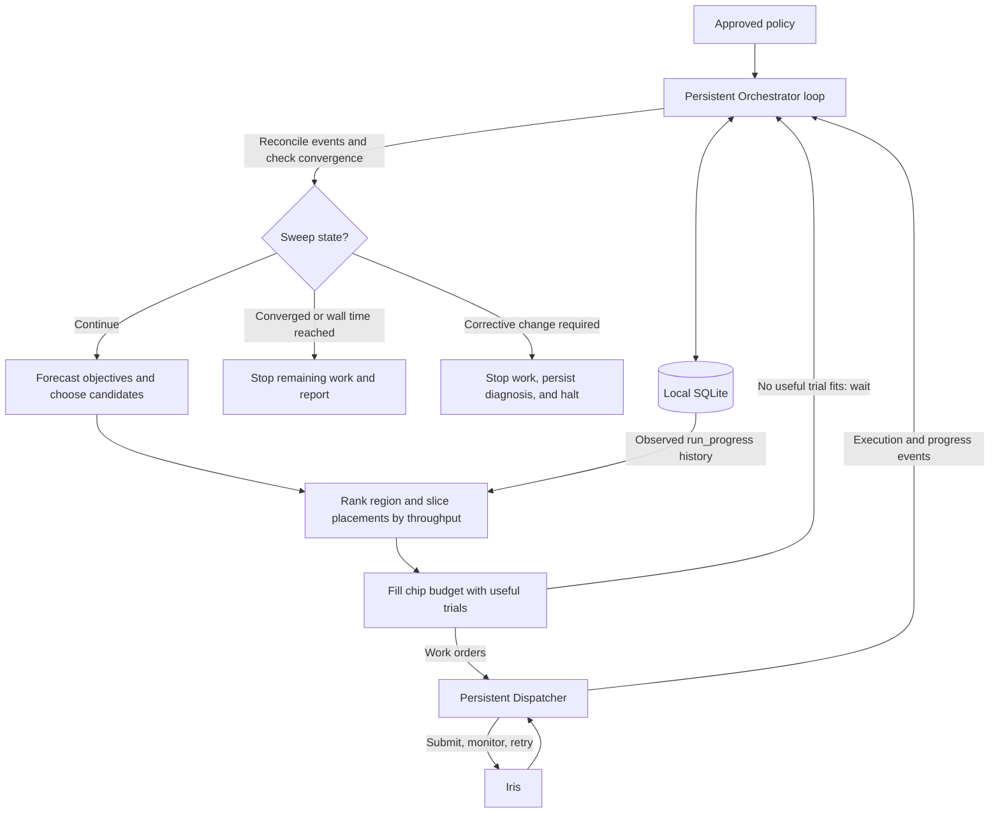

# Run Adaptive Sweep

Minimize wall time until every resource rung converges. Use one Orchestrator, local SQLite, and one persistent Dispatcher subagent operating under `dispatch-job`.

## Keep Boundaries Exact

- The Orchestrator owns SQLite, grid changes, objective forecasts, candidate and target choices, chip allocation, relocations, stopping, and approvals. Store trial configurations by axis value, not mutable grid position.
- The Dispatcher executes, monitors, and recovers exact Iris work orders and returns normalized execution facts.
- Iris owns scheduling and individual preemption handling.
- Tools calculate strict convergence, candidate predictions, throughput, and placement ranges; they never choose an action.

One `(configuration, resource rung)` is one logical trial. Never duplicate a logical trial. Operational retries and relocations produce at most one objective.

Before launch, verify the training script and single-job command. Require explicit TPU and region inputs. Confirm TPU-dependent batch sizing, region-scoped W&B and checkpoint identity, same-region TPU resume, monotonic `run_progress`, exact objective matching, target chip counts, SQLite path, preferences, and directives. Ask before modifying an incompatible script.

Never move checkpoint data across regions. A same-region TPU move keeps the regional run identity and starts a new dispatch. A region change abandons that regional run and starts the logical trial from initial state under a new regional identity.

## Use Three Tools

```text
uv run --with scikit-learn python \
  .agents/skills/run-adaptive-sweep/scripts/sweep_tools.py <operation> <request.json>
```

Read [references/tools.md](references/tools.md) for the JSON contracts.
After material orchestration changes, use [references/trc-simulator-eval.md](references/trc-simulator-eval.md) for deterministic simulator tests and a blind-agent evaluation.

| Operation | Purpose |
| --- | --- |
| `check-convergence` | Apply only the strict one-step neighbor test at every rung. |
| `predict-objectives` | Fit one gradient-boosted regressor to every completed trial and rank proposed candidates within each rung. |
| `rank-targets` | Normalize observed progress across rungs, rank targets, expose exploration depth, and report stagnation eligibility. |

Map `experiment.objective`, `search.grid`, `search.resource_ladder`, and relevant `execution` fields into the flat tool requests described in the reference. Convert RFC 3339 timestamps and policy durations into one numeric time unit, and convert `execution.full_exploitation_level` from a resource value to its rung index. Map Dispatcher facts into the observation records.

## Orchestrate

Replan after every objective, progress observation, terminal event, grid change, or newly available chip budget:

1. Reconcile Dispatcher events into SQLite and call `check-convergence`.
2. Stop automatically when every rung passes. A failed check is not proof of non-convergence; inspect observed patterns and record any operator-reviewed manual claim separately.
3. For each unresolved rung, inspect cross-rung trajectories and define plausible unrun candidates. Treat the axis's `scale`, `preferred_max_gap`, and adjacent spacing as the default for an implicated edge extension within its hard bound; `special_values` remain declared exceptions. Choose different spacing when evidence supports it, and record the value and reason in SQLite.
4. Call `predict-objectives` with all completed trials across all rungs and every plausible candidate. Predicted objective is the primary ordering within a rung. Give additional priority to a predicted center and the immediate neighbors needed to test strict dominance.
5. Allocate work across rungs using the forecasts and relative resource cost. While predictions are unavailable or flat, fill capacity from the lowest unresolved rung; never seed a higher rung only to consume chips. Numerical differences from a few observations are weak transfer evidence. Before assigning chips upward, prefer a cheaper unresolved rung when its next candidate could both advance strict convergence there and materially change the upper-rung ranking. Otherwise interleave higher-rung work without fixed barriers.
6. For each selected trial, call `rank-targets`. Choose within its selection pool, using target diversity while exploration remains and the highest-throughput feasible target when exploration reaches zero.
7. Keep launching unique candidates until submitted, running, and retrying dispatches consume `max_inflight_chips`, or no allowed target fits the remaining chips. Record the prediction, placement evidence, and decision before dispatch.

The regressor is an ordering aid, not a stopping rule. Refit it after every completed objective. When predictions fail to match observations, broaden or shift the candidate region rather than continuing a stale ranking.

## Maintain Throughput And Placement

The Dispatcher observes `run_progress` at `observation_interval`. Re-run `rank-targets` on each observation. Its normalized throughput multiplies progress gained by the rung's `resource_ratio` and divides by wall time. Observation intervals receive raised-cosine age weights over the policy's wall-time limit: recent evidence is nearly flat, middle-aged evidence decays approximately linearly, and evidence reaches zero weight at the limit. Placement uses the slowest active dispatch rate for a target. A fresh active dispatch with no measurable interval contributes a zero marginal rate, so queued or stalled work lowers the target's rank without a separate capacity probe.

Target exploration decreases linearly from all feasible targets at the first resource rung to one target at `full_exploitation_level`. At and beyond that rung, use only the highest-throughput feasible target. If its jobs stop progressing, its measured throughput decays and another target can become first.

Honor the tool's stagnation eligibility without treating it as an automatic command:

- `initial_wandb_timeout` permits a same-region TPU move when the current execution has never appeared in W&B.
- `progress_stall_timeout` permits a same-region TPU move when a W&B-registered regional run has stopped increasing `run_progress`.
- `cross_region_restart_timeout` permits abandoning that regional run only after a same-region TPU move has occurred and the replacement dispatch has itself exceeded the applicable startup or progress-stall timeout.
- Any observed progress resets the no-progress clock.

An abandoned regional run remains resumable on a compatible TPU in its original region at any later time. Resume its regional identity and checkpoint; never copy either to another region.

Automatic Dispatcher retries remain on the assigned target and do not authorize relocation. Only the Orchestrator changes targets.

## Finish

Report strict or manually reviewed convergence per rung, final dominant points, objectives, grid changes, prediction history, normalized target throughput, relocations, elapsed wall time, and consumed limits.

## Flow

The Orchestrator stays in one event loop until every rung converges or the wall-time limit is reached. Launches, observations, retries, partial convergence, and changing target throughput feed the next iteration; none completes the task by itself.

```text
start one persistent Dispatcher
load policy and reconcile SQLite with existing dispatches

while wall time remains:
    ingest every new Dispatcher event and update SQLite
    recompute rung convergence

    if every rung converged:
        break

    if evidence shows that valid progress requires a corrective change:
        stop active dispatches, persist the diagnosis, and halt for resolution

    inspect unresolved rungs and any justified one-step grid extensions
    refresh objective forecasts from all completed trials
    choose candidates across rungs using predicted objective and relative cost
    rank feasible region and slice targets from current throughput evidence
    issue launch, stop, or relocation work orders until the chip budget is full
        or no useful policy-compliant trial fits

    wait for the next Dispatcher event or observation deadline

stop remaining dispatches and report convergence or the reached limit
```

Absorb operational volatility when retrying, waiting, or policy-authorized relocation restores progress without changing trial semantics or concealing a persistent defect. Halt when evidence shows that valid progress requires an external correction or a change to the experiment's code, data, configuration, or authorization. A reproducible OOM, missing regional input, or blocking permission failure illustrates this boundary but does not define an exhaustive list. Diagnose from concrete logs and behavior, not from an unfamiliar Iris status or retry count alone.


