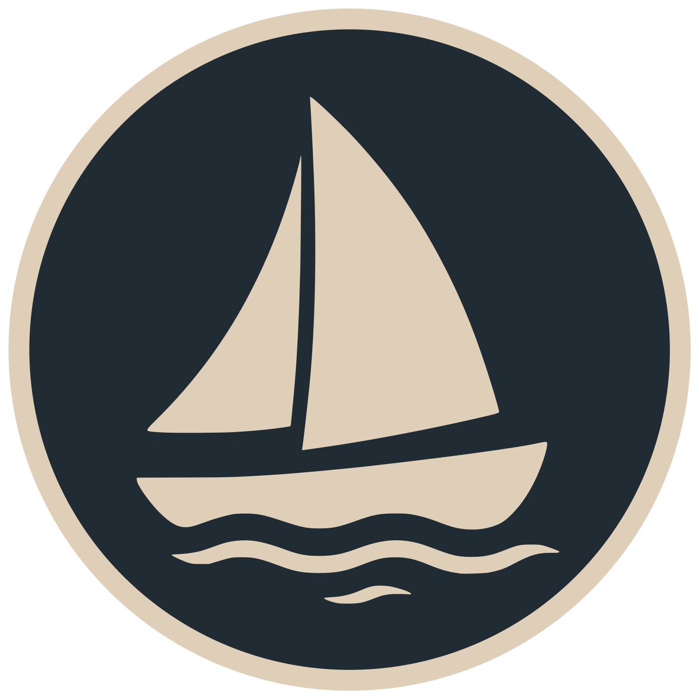
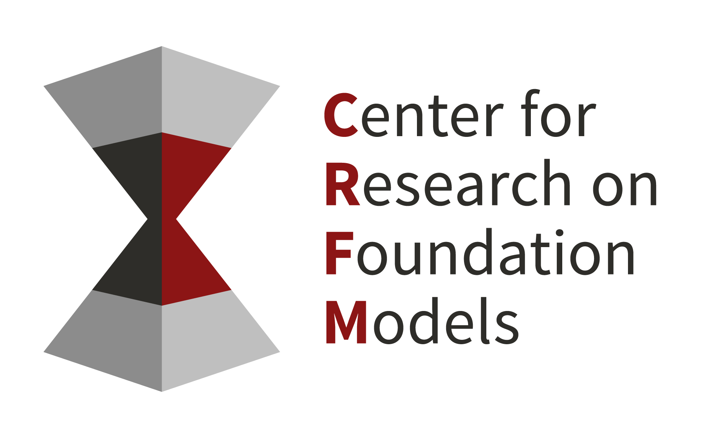
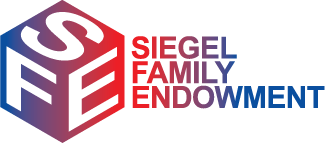
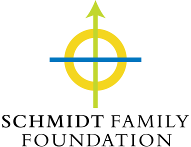

#  Marin

<a href="https://marin.readthedocs.io/en/latest/?badge=latest">
    
</a>
<a href="">
    
</a>

<!--marin-intro-start-->

> "*I am not afraid of storms, for I am learning how to sail my ship.*"<br/>
> – Louisa May Alcott

[Marin](https://marin.community) is a research program, software platform, and community for the research and development of [foundation models](https://en.wikipedia.org/wiki/Foundation_model).

Marin's concern is training large language models. This includes data curation, transformation, filtering, tokenization, pretraining, posttraining, and evaluation. Beyond the artifacts, software, and infrastructure, behind these models, Marin is committed to openly sharing *all* of the process knowledge required to build these models.

Marin's core value is **[open development](https://openathena.ai/blog/open-development-of-frontier-ai/)**. We document our processes, experiments, and decisions as they happen. Every step, from raw data to the final model, is recorded. Failed experiments are part of that record.

Marin has also been used for building [audio-text models](https://github.com/marin-community/marin/issues/1699), [DNA](https://github.com/Open-Athena/marin-dna), and [protein models](https://github.com/Open-Athena/MarinFold). We encourage this work through the use of Marin as a library, in [marin/experiments](https://github.com/marin-community/marin-experiments).

## Current work

### Frontier mixture-of-experts

Our current focus is pretraining, from scratch, and posttraining a large (5e24 model-FLOPs, 500 billion+ total parameters) mixture-of-experts model to succeed on tasks of importance to scientists and researchers.

### Scaling suite

<a href="https://openathena.ai/blog/delphi/">Delphi</a> is Marin's open scaling suite scaling a LLM recipe from 3e18 to 1e23 FLOPs, inspired by <a href="https://github.com/eleutherai/pythia">Pythia</a>. It has three parts: a scaling recipe that maps compute budgets to model configurations, a scaling suite trained from that recipe on the Google TPU Research Cloud, and a scaling law that uses the smaller Delphi models to predict the larger ones.

We released:

- **Checkpoints** for every run, available on Hugging Face at [marin-community/delphi](https://huggingface.co/collections/marin-community/delphi-69f93cbd09845c03b070bae9)
- **Training mixture pipelines** that deterministically reproduce the mix from the public Nemotron-CC, StarCoderData, and ProofPile 2 in the [Marin repo](https://github.com/marin-community/marin/blob/67099b9aa5aa468155f0ce430276be72b39a3bd2/experiments/pretraining_datasets/nemotron.py)
- **Recipe code** as a forkable [`CompletedAdamHParams` class](https://github.com/marin-community/marin/blob/78ae89a5324e09ddd9d0bc39af8565da40cfb3e9/experiments/scaling_law_sweeps/completed_adamh.py#L96) in the Marin repo
- **Development methodology** as the [`add_scaling_heuristic` agent skill](https://github.com/marin-community/marin/blob/main/docs/recipes/add_scaling_heuristic.md) in the Marin repo
- **Plot-ready data** for the Delphi figures, with one config per figure and a `wandb_url` on every row, at [marin-community/delphi-blog-data](https://huggingface.co/datasets/marin-community/delphi-blog-data)

Progress was tracked in [GitHub issue #1337](https://github.com/marin-community/marin/issues/1337).

### Other learnings

Some additional consolidated learnings can be found on the [Open Athena blog](https://openathena.ai/blog/). A selection, below:

- [Cluster Scheduling with Iris](https://openathena.ai/blog/cluster-scheduling-with-iris/) · scheduling jobs across heterogeneous clusters
- [Improving our LLM Pretraining Efficiency](https://openathena.ai/blog/pretraining-speedup/) · squeezing more throughput from pretraining
- [Scaling Laws That Extrapolate 300× Past the Fit (Delphi)](https://openathena.ai/blog/delphi/) · predicting big models from small
- [Mixture of Experts Quantile Balancing: Validated at 32B-A5B (1e22 FLOPs) Scale](https://openathena.ai/blog/quantile-balancing/) · keeping MoE experts load balanced

### Other models

Previously, we used Marin to train an 8B parameter model that outperformed Llama 3.1 8B on our [base-model benchmark suite](docs/reports/marin-8b-retro.md#base-model-results).
You can see the [training script](https://github.com/marin-community/marin/blob/main/experiments/tootsie/exp600_tootsie.py) or read the [retrospective](docs/reports/marin-8b-retro.md). We also trained [Marin 32B](docs/reports/marin-32b-retro.md).

<!--marin-intro-end-->

## Learning more & using Marin

The documentation for Marin is available on [ReadTheDocs](https://marin.readthedocs.io/en/latest/) or in the [`docs/`](docs/) folder.

<!--marin-first-steps-start-->

To get started with Marin:

- [Install](docs/tutorials/installation.md) Marin.
- Train a [tiny language model](docs/tutorials/first-experiment.md) using Marin.
- See how to run a much larger [DCLM 1B/1x](docs/tutorials/train-an-lm.md) experiment using Marin.
- See a [summary of the experiments](docs/reports/index.md) we've run.
- Join the [Marin Discord](https://discord.gg/J9CTk7pqcM) to chat with the community.

<!--marin-first-steps-end-->

### Example

Marin experiments are defined as a set of steps that can depend on each other and are executed in a topological order,
like a Makefile.

As a brief example of how you can use Marin, here is a complete script for training a tiny model on [TinyStories](https://huggingface.co/datasets/roneneldan/TinyStories).
You can check out the [full script](https://github.com/marin-community/marin/blob/main/experiments/tutorials/train_tiny_model_cpu.py) for more details.

<!--marin-example-start-->

```python
from fray import ResourceConfig
from levanter.data.text import TextLmDatasetFormat
from marin.execution.executor import executor_main
from marin.execution.types import versioned

from experiments.defaults import default_train
from experiments.llama import llama_nano
from experiments.marin_models import marin_tokenizer
from experiments.simple_train_config import SimpleTrainConfig
from experiments.tokenization import default_tokenize

# 1. Choose a dataset
tinystories_hf_id = "roneneldan/TinyStories"

# 2. Tokenize the dataset with sampling
# For this tutorial, we limit to 1000 documents per shard
tinystories_tokenized = default_tokenize(
    name=tinystories_hf_id,
    dataset=tinystories_hf_id,
    tokenizer=marin_tokenizer,
    format=TextLmDatasetFormat(),
    sample_count=1000,
)

# 3. Define training configuration
nano_train_config = SimpleTrainConfig(
    # Here we define the hardware resources we need.
    resources=ResourceConfig.with_cpu(),
    train_batch_size=4,
    num_train_steps=100,
    # set hyperparameters
    learning_rate=6e-4,
    weight_decay=0.1,
    # keep eval quick for tutorial
    max_eval_batches=4,
)

# 4. Train the model
nano_tinystories_model = default_train(
    name="marin-nano-tinystories",
    # Steps can depend on other steps: nano_tinystories_model depends on tinystories_tokenized
    tokenized=tinystories_tokenized,
    model_config=versioned(llama_nano),
    train_config=nano_train_config,
    # wandb tags
    tags=["llama", "nano", "tinystories", "tutorial"],
    # We can run many [eval_harness](https://github.com/EleutherAI/lm-evaluation-harness) tasks in the loop
    # during training, but there's no point in running evals on such a tiny model
    eval_harness_tasks=[],
    # to keep tutorial fast, skip default validation sets
    use_default_validation=False,
)

if __name__ == "__main__":
    executor_main(
        steps=[
            nano_tinystories_model,
        ]
    )
```

Here, we create two [steps](docs/explanations/executor.md#steps), one for tokenizing the dataset and one for training the model.
The training step depends on the tokenized dataset step, so it will be executed after the tokenization step is completed.

<!--marin-example-end-->

With slight modifications, you can extend this to train a [larger model on a larger dataset](docs/tutorials/train-an-lm.md),
a [mixture of datasets](docs/tutorials/train-an-lm.md#mixture-of-sources), even scaling to very large GPU or TPU pods (or multislice TPUs!).

### For Contributors

- See [`CONTRIBUTING.md`](CONTRIBUTING.md) for project workflow.
- See `.agents/skills/` (also `.claude/skills/`) for loadable agent skills. For example, `.agents/skills/add-dataset/` has a step-by-step guide to adding new datasets.


## Core Contributors

Marin's core collaborators come from [Stanford CRFM](https://crfm.stanford.edu/) and [Open Athena](https://openathena.ai/).

<p>
  <a href="https://crfm.stanford.edu/"></a>
  &nbsp;&nbsp;&nbsp;
  <a href="https://openathena.ai/"></a>
</p>

## Supporters

Marin's research is made possible by the generous support of our partners.

<table>
  <tr>
    <td align="center" width="240"><a href="https://sites.research.google/trc/about/"></a></td>
    <td align="center" width="240"></td>
  </tr>
  <tr>
    <td align="center"><sub>for TRC accelerators</sub></td>
    <td align="center"><sub>for GPU clusters</sub></td>
  </tr>
  <tr>
    <td align="center"><a href="https://www.siegelendowment.org/"></a></td>
    <td align="center"><a href="https://tsffoundation.org/"></a></td>
  </tr>
  <tr>
    <td align="center"><sub>for supporting development</sub></td>
    <td align="center"><sub>for supporting development</sub></td>
  </tr>
</table>
