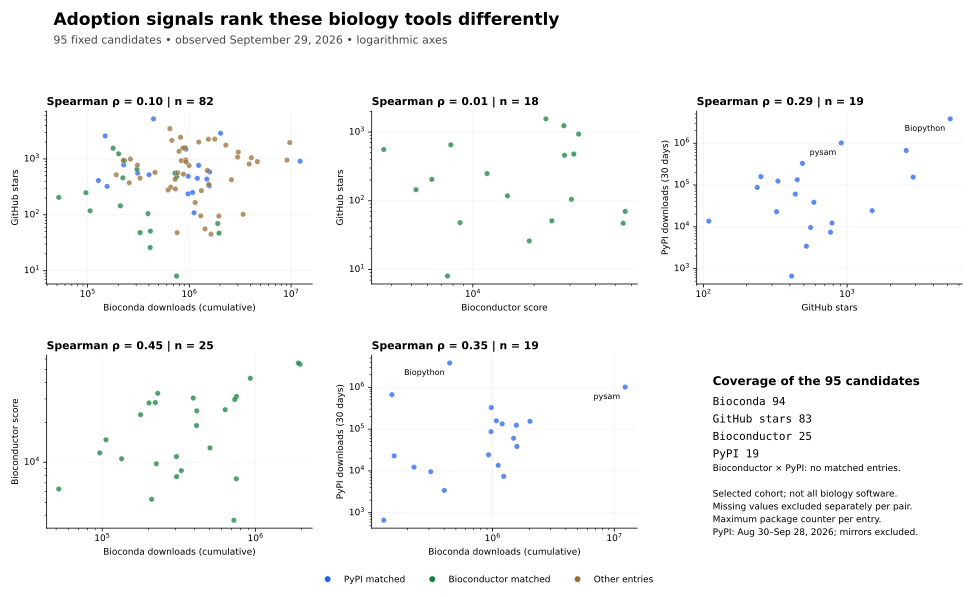

# Adoption analysis: September 29, 2026

[Discovery inventory](index.md) · [Structured data](inventory.json)

This analysis holds the existing 95 software candidates fixed. See the
[metric definitions and provenance](index.md#metrics-and-provenance) for source
dates, observation windows and package-to-source mapping.

[Download the adoption table](data/adoption-2026-09-29.csv).

Coverage is 94 entries for Bioconda, 25 for Bioconductor, 83 for GitHub stars,
and 19 for PyPI. Missing measurements are excluded separately for each pair,
never converted to zero. GitHub metrics remain missing for the three GitLab
projects, the two source archives, and seven Bioconductor entries without a
verified GitHub mapping in this pass. This does not exclude those software
sources from discovery.

Spearman ρ measures agreement between rankings: +1 means identical order,
0 means no monotonic association, and −1 means reversed order. Average ranks
handle ties. Pearson correlations on raw counts and `log10(1 + count)` show
sensitivity to scale and large observations. Each row uses a different overlap
population; the correlations should not be compared as competing estimators
on the same sample.

| Measures | Matched entries | Spearman ρ | Pearson, log scale | Pearson, raw scale |
| --- | ---: | ---: | ---: | ---: |
| Bioconda cumulative downloads / GitHub stars | 82 | 0.10 | 0.10 | 0.09 |
| Bioconductor score / GitHub stars | 18 | 0.01 | 0.04 | 0.02 |
| GitHub stars / PyPI 30-day downloads | 19 | 0.29 | 0.47 | 0.83 |
| Bioconda cumulative downloads / Bioconductor score | 25 | 0.45 | 0.47 | 0.73 |
| Bioconda cumulative downloads / PyPI 30-day downloads | 19 | 0.35 | 0.41 | 0.14 |
| Bioconductor score / PyPI 30-day downloads | 0 | — | — | — |

Bioconductor and PyPI have no matched candidates here, so their correlation
cannot be estimated. No inference of independence follows from that absence.

The raw stars/PyPI Pearson correlation of 0.83 is dominated by a large
observation: removing Biopython lowers it to 0.36 (n = 18). Rank correlation
is 0.29 with Biopython and 0.17 without it. Biopython records 3,815,234 PyPI
downloads in the 30-day window and 5,215 stars; pysam records 1,014,605 downloads
and 911 stars. These are channel counts and repository interest, not user counts.

Two further checks leave the broad ranking result similar:

- Excluding all entries with multiple package counters gives stars/Bioconda
  ρ = 0.07 (n = 78), Bioconda/PyPI ρ = 0.28 (n = 17), and stars/PyPI
  ρ = 0.28 (n = 17). Using sums instead of maximum package counters gives
  0.08, 0.34 and 0.31, respectively.
- Using 90 days of PyPI counts gives Bioconda/PyPI ρ = 0.36 and stars/PyPI
  ρ = 0.34 (both n = 19), versus 0.35 and 0.29 for 30 days.

Role composition matters. Excluding entries labeled scientific libraries changes
stars/PyPI ρ to 0.54 (n = 11) and stars/Bioconductor ρ to 0.27 (n = 12).
Those smaller subsets are descriptive checks, not evidence that one metric is
a universal substitute for another. Exact coefficients, pair membership and
all sensitivity results are in the JSON's `adoption_analysis` object.

The cohort was selected partly through download screens, which limits the range
and representativeness of this analysis. The time windows also differ: cumulative
Bioconda downloads, a twelve-month Bioconductor IP average, recent PyPI downloads,
and present GitHub stars. [PyPA](https://packaging.python.org/en/latest/guides/analyzing-pypi-package-downloads/)
documents additional effects from caching, mirrors and automation. Neither the
correlations nor the counts measure scientific diversity or task quality.

Keep the signals separate when defining the next discovery sample. GitHub
[topic searches](https://docs.github.com/en/search-github/searching-on-github/searching-for-repositories#search-by-topic),
such as `topic:bioinformatics` sorted by stars, can find software outside package
registries. Topics are optional and maintainer-assigned, so they are an additional
discovery route, not a complete biological classification. No new candidates
were added for this comparison.

PyPI identity checks excluded the package named `sepp`: its metadata describes
an unrelated ESA platform. BUSCO and SPAdes returned 404 under their expected
PyPI names. Other entries without a verified PyPI mapping remain missing;
alternate names and third-party wrappers have not been exhaustively searched.
