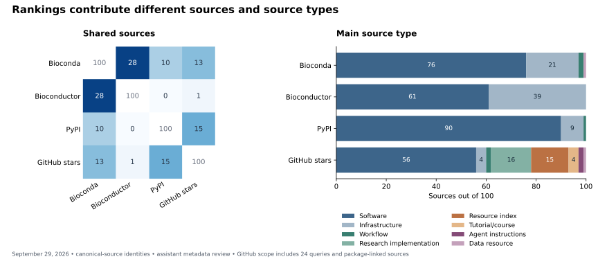
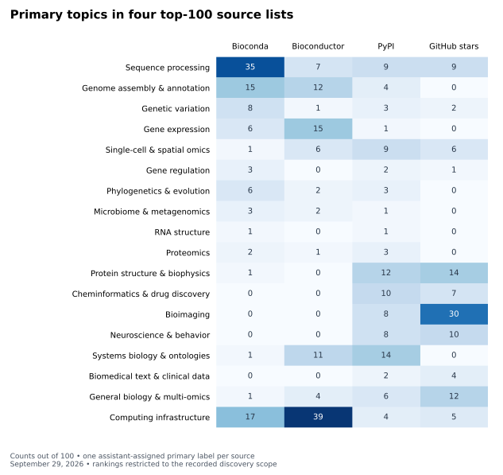

# Comparing four top-100 source lists

[Discovery results](index.md) · [All four ranked lists](ranking-lists.md)

The September 29, 2026 comparison contains **335 distinct sources across four
100-source lists**. Within the recorded discovery scope, PyPI provides the most
even distribution of manually assigned topics. Bioconda concentrates on sequence
processing; Bioconductor contributes many support packages; GitHub stars add
medical-imaging projects and educational resources. These measures identify
different candidate pools and should remain separate selection signals.

This is an exploratory comparison of sources, including repositories and official
source archives. No packages were installed and no tasks were authored or graded.
The [original 95-source inventory](inventory.json) is unchanged. The present lists
are selected separately from broader source pools, rather than reranking those 95.

## Overlap

Each cell is the number of shared canonical sources. Two 100-source lists sharing
10 entries have a Jaccard overlap of 10 / 190, or 5.3%.

| Ranking | Bioconda | Bioconductor | PyPI | GitHub stars |
| --- | ---: | ---: | ---: | ---: |
| Bioconda | 100 | 28 | 10 | 13 |
| Bioconductor | 28 | 100 | 0 | 1 |
| PyPI | 10 | 0 | 100 | 15 |
| GitHub stars | 13 | 1 | 15 | 100 |

Bioconda has 51 sources absent from the other three lists; Bioconductor has 71,
PyPI 77, and GitHub 73. Zero overlap between Bioconductor and PyPI reflects these
package/source identities and cutoffs, not an absence of shared scientific uses.
Bioconductor is R-centered; the lists can contain different implementations of
the same analysis.

| Pair | Shared at top 10 | Top 25 | Top 50 | Top 100 | Top-100 Jaccard |
| --- | ---: | ---: | ---: | ---: | ---: |
| Bioconda / Bioconductor | 0 | 8 | 15 | 28 | 16.3% |
| Bioconda / PyPI | 1 | 2 | 4 | 10 | 5.3% |
| Bioconda / GitHub | 0 | 0 | 3 | 13 | 7.0% |
| Bioconductor / PyPI | 0 | 0 | 0 | 0 | 0.0% |
| Bioconductor / GitHub | 0 | 0 | 0 | 1 | 0.5% |
| PyPI / GitHub | 1 | 3 | 7 | 15 | 8.1% |

The [computed results](data/ranking-results-2026-09-29.json) include exact shared
identities and rank correlations within each intersection. Those small, truncated
intersections answer a different question from the [fixed-cohort adoption
correlations](adoption.md); they do not estimate agreement across all biological
software.



## Topics and source types

Each source has an assistant-assigned **primary topic group**, a finer scientific
topic, and a separate **source type**. The labels come from package metadata,
repository descriptions, and selected README checks. They have not received
independent human validation. This practical discovery taxonomy mixes scientific
areas with recurring analysis activities; it is not a comprehensive ontology of
biology. Its 18 primary groups include general biology/multi-omics and computing
infrastructure, so a group count is not a count of distinct biological fields.

| Ranking | Primary groups | Finer topics | Effective primary groups | Largest primary group |
| --- | ---: | ---: | ---: | --- |
| Bioconda | 14 | 31 | 7.5 | Sequence processing: 35 |
| Bioconductor | 11 | 25 | 6.6 | Computing infrastructure: 39 |
| PyPI | 18 | 40 | 13.9 | Systems biology and ontologies: 14 |
| GitHub stars | 11 | 40 | 8.1 | Bioimaging: 30 |

“Effective groups” is exp(Shannon entropy): a list split evenly across eight
groups scores eight. It measures balance under these labels, not source quality
or task yield. Removing the two broad groups and renormalizing gives effective
group counts of 6.2, 6.5, 12.1 and 6.4 respectively, on 82, 57, 90 and 83 sources.
PyPI's greater balance therefore persists in that sensitivity check.



PyPI adds chemistry, structural biology, neurophysiology and imaging to the
sequencing-heavy Bioconda view. GitHub contributes many imaging and protein-model
implementations, but a star ranking can also repeat one area: bioimaging accounts
for 30 entries here. GitHub has the most distinct raw tags while PyPI has the
most even manual topic distribution. Those are different definitions of diversity.

| Main source type | Bioconda | Bioconductor | PyPI | GitHub stars |
| --- | ---: | ---: | ---: | ---: |
| Software | 76 | 61 | 90 | 56 |
| Infrastructure | 21 | 39 | 9 | 4 |
| Workflow | 2 | 0 | 1 | 2 |
| Research implementation | 0 | 0 | 0 | 16 |
| Resource index | 0 | 0 | 0 | 15 |
| Tutorial/course | 0 | 0 | 0 | 4 |
| Agent instructions | 0 | 0 | 0 | 2 |
| Data resource | 1 | 0 | 0 | 1 |

The source type describes the repository's main deliverable. A software repository
can contain useful tutorials without being classified as a course. Resource
indexes include curricula and paper lists that primarily link to other sources;
they should not be assumed to contain executable exercises themselves. Infrastructure
includes biological data containers, package support and workflow engines.

The four teaching sources in the GitHub list are
[Neuromatch's computational-neuroscience course](https://github.com/neuromatchacademy/course-content),
[the single-cell best-practices tutorial](https://github.com/theislab/single-cell-tutorial),
[bioinformatics one-liners](https://github.com/stephenturner/oneliners), and
[genomics tools and learning notes](https://github.com/crazyhottommy/getting-started-with-genomics-tools-and-resources).
These are useful inspection candidates even though they have no package-download
measure in this comparison.

A software-only subset retains software, infrastructure, workflows and research
implementations. Its sizes are 99 / 100 / 100 / 78, and its effective primary-group
counts are 7.5 / 6.6 / 13.9 / 8.0, in table order. This is a subset of each original
100, without backfilling to another 100. GitHub's topic concentration persists
after excluding its 22 educational, index, instruction and data sources.

## GitHub tags

| Ranking | Sources with a GitHub mapping | Sources with any tags | Distinct raw tags |
| --- | ---: | ---: | ---: |
| Bioconda | 89 | 59 | 183 |
| Bioconductor | 76 | 61 | 66 |
| PyPI | 99 | 70 | 326 |
| GitHub stars | 100 | 76 | 404 |

Missing tags and missing GitHub mappings remain separate. Tag counts include
language, framework, funding and ecosystem labels. For example, Bioconductor's
most frequent labels are `bioconductor-package` (35) and `core-package` (33);
the GitHub ranking includes `medical-imaging` (18) and `deep-learning` (16).
Raw tag richness alone is therefore an unreliable measure of biological breadth.

The [tag-frequency table](data/ranking-topic-frequencies-2026-09-29.csv) preserves
every observed tag. A separate [exact-string mapping](data/tag-domains-2026-09-29.csv)
groups selected tags into the same primary-topic vocabulary. Generic language and
registry labels are not interpreted as biological topics. Sources can match
several groups; the results retain both presence counts and fractional counts
that divide one source evenly among its matched groups. Untagged sources and
unmapped tags do not receive invented labels. This tag-based view is conditional
on metadata coverage; the manual view covers all 100 sources in every list.

| Ranking | Sources matching a tag group | Tag groups present | Effective tag groups, fractional counts |
| --- | ---: | ---: | ---: |
| Bioconda | 59 | 12 | 5.4 |
| Bioconductor | 56 | 8 | 3.5 |
| PyPI | 70 | 17 | 12.2 |
| GitHub stars | 73 | 15 | 7.8 |

These grouped tags also put PyPI first for balance, but their coverage and
multiple labels per source prevent a direct numerical comparison with the
single-primary-label manual analysis.

## Ranking definitions and search scope

| Approach | Pool and score | 100th source's score |
| --- | --- | ---: |
| Bioconda | Official 12,740-package cumulative-download table; screen the highest 250 package rows | 611,284 downloads; raw package rank 140 |
| Bioconductor | Official 3,118-package score table; screen the highest 150 rows; average monthly distinct IPs over September 2025–August 2026 | 6,164; raw package rank 100 |
| PyPI | 15,053 metadata-matching projects; count downloads August 30–September 28, 2026; retain top 1,000 numeric rows and verify current identity for the first 200 | 52,503 downloads; raw package rank 127 |
| GitHub | 1,370 unique resolved repositories from 24 broad searches, package links, the original inventory and recorded identity checks; current stars | 1,386 stars |

Bioconda counts use the [pinned official statistics table](https://github.com/bioconda/bioconda-stats/blob/cd491b0a4c9a7e80069c8894fbd369d8b07ceddc/package-downloads/anaconda.org/bioconda/packages.tsv).
Bioconductor's [download score](https://bioconductor.org/packages/stats/) is a
different unit and time window. Neither measures unique researchers.

PyPI uses the public [ClickPy dataset](https://github.com/ClickHouse/clickpy), with
the [retained SQL query](data/pypi-count-query-2026-09-29.sql). It excludes the
`bandersnatch`, `z3c.pypimirror`, `Artifactory` and `devpi` installers, following
the [PyPIStats mirror list](https://github.com/psf/pypistats.org/blob/main/pypistats/tasks/pypi.py).
Other installer strings are retained; this does not reproduce PyPIStats' complete
ingestion and filtering pipeline.
The metadata search uses the Bio-Informatics classifier plus recorded biological
terms and aliases in names, summaries and keywords. It can miss packages with
uninformative metadata. Partitioned queries were checked for complete responses;
partial responses carrying server exceptions were rejected.

The original 95-source analysis used PyPIStats. ClickPy and PyPIStats return
different counts even for the same requested window and mirror exclusions;
do not splice the snapshots or interpret their difference as growth. This
30-day window begins after PyPI's [August 24 artifact-only counting change](https://blog.pypi.org/posts/2026-08-31-download-counts/).
The original report's longer 90-day sensitivity window crosses that change.

GitHub queries have the form
`TERM in:name,description,topics fork:false is:public stars:>=500`, sorted by stars.
The 24 terms are `bioinformatics`, `biology`, `genomics`, `proteomics`,
`transcriptomics`, `metagenomics`, `microbiome`, `phylogenetics`, `molecular`,
`protein`, `neuroscience`, `neuroimaging`, `microscopy`, `cheminformatics`,
`systems-biology`, `synthetic-biology`, `ecology`, `medical-imaging`, `biomedical`,
`bioimaging`, `single-cell`, `drug-discovery`, `structural-biology` and
`computational-biology`. No alternative-splicing-specific search or domain quota
was used. The two searches with more than 100 results ended their first pages
at 642 and 523 stars, below the selected cutoff.

This is **the top 100 within the observed GitHub universe**, not a claim of an
exhaustive global biology ranking. Package links help recover sources missed by
name/description/topic search. Known-source checks explicitly added AlphaFold 2
and AlphaFold 3. Searches alone retain 86 of the supplemented top 100; their
overlaps with Bioconda, Bioconductor and PyPI become 11, 0 and 10. The reported
overlap therefore partly depends on using package discovery to supplement GitHub.

Eligibility includes biological tools, dedicated biological support packages,
workflows, tutorials, courses, research code, data resources and biological
resource collections. General computing false positives are excluded. Broad
cross-science projects and source-type boundaries involve judgment; per-source
scope notes expose these cases. Stars for a broad project cover the whole project,
including any non-biological content. No licensing, runtime or exercise-quality
approval is implied by selection.

Source identity is resolved before taking the top 100. Several package names
sharing a source contribute their **maximum** counter, not their sum. Independent
bindings and maintained forks remain separate. Packaging-only wrappers map to
upstream code. MEME Suite and Entrez Direct remain eligible through their official
source archives. Current PyPI identity checks exclude `seqio` and `fitz`, whose
historical biology metadata does not describe the current project.

## Artifacts and reproduction

- [All ranked sources](ranking-lists.md), with scores, source types and finer topics.
- [400 ranking positions](data/rankings-2026-09-29.csv), [335 source observations](data/source-observations-2026-09-29.json), and [manual annotations](data/source-annotations-2026-09-29.csv).
- Candidate rows and screening decisions for [Bioconda](data/ranking-candidates-bioconda-2026-09-29.csv), [Bioconductor](data/ranking-candidates-bioconductor-2026-09-29.csv), [PyPI](data/ranking-candidates-pypi-2026-09-29.csv) and [GitHub](data/ranking-candidates-github-2026-09-29.csv). Rows below the cutoff are explicitly not exhaustively reviewed.
- [Provenance](data/ranking-provenance-2026-09-29.json): exact search queries, collection times, revisions, response hashes, identity corrections and input-artifact hashes.
- [Computed results](data/ranking-results-2026-09-29.json), including sensitivity checks and exact pairwise intersections.

From the repository root, the bounded local analysis requires only Python's
standard library:

```bash
uv run --no-project experiments/bio_tasks/01_discovery/analyze_rankings.py \
  --data-dir docs/experiments/bio-task-generation/01-discovery/data \
  --date 2026-09-29
```

The analysis checks source-key uniqueness, four ordered 100-source cohorts,
package-to-source maximum aggregation, annotation coverage, input hashes and
search-page boundaries. It regenerates the results JSON and tag-frequency table.
Figures use Matplotlib. Recollecting remote measurements may change membership;
the retained observations define this comparison.
