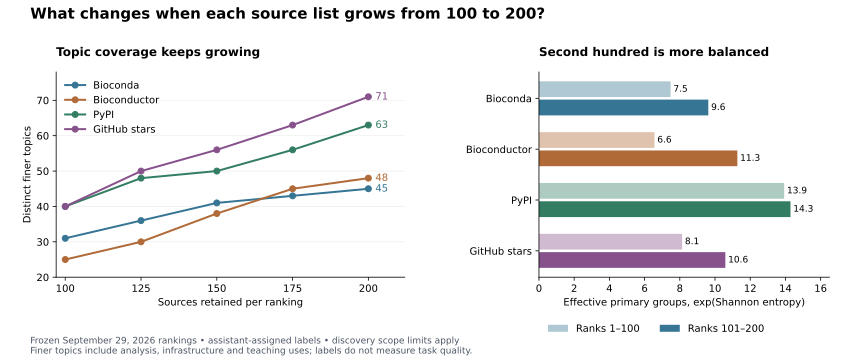

# Expanding each ranking from 100 to 200

[Discovery results](index.md) · [Top-100 baseline](ranking-comparison.md) · [Ranks 101–200](ranking-additions.md)

Expanding to 200 is useful within the recorded discovery scope. The four lists
now contain **672 distinct sources, up from 335**, with **337 new sources** and
46 additional finer topic labels. Bioconductor shows the largest improvement in
primary-topic balance; PyPI remains the most balanced. GitHub adds teaching,
conservation and biomechanics sources while retaining a strong imaging bias.
Normalized overlap between rankings changes little.

The first 100 source identities, scores and manual labels in every list are
unchanged. Download snapshots, score windows and the GitHub discovery pool are
held fixed. The original 95-source inventory and all top-100 data artifacts are
preserved. This is source discovery: candidate software and source archives were
not executed, and task usefulness has not been validated.

## What the extra hundred contributes

“New sources” below means absent from the **combined 335-source baseline**, not
merely absent from that ranking's first hundred. These counts are not additive:
some newly discovered sources enter more than one expanded list.

| Ranking | New sources vs. combined baseline | Primary groups, 100 → 200 | Finer topics, 100 → 200 | Effective primary groups, 100 → 200 |
| --- | ---: | ---: | ---: | ---: |
| Bioconda | 70 | 14 → 15 | 31 → 45 | 7.5 → 8.9 |
| Bioconductor | 99 | 11 → 14 | 25 → 48 | 6.6 → 9.7 |
| PyPI | 92 | 18 → 19 | 40 → 63 | 13.9 → 15.2 |
| GitHub stars | 83 | 11 → 18 | 40 → 71 | 8.1 → 10.0 |

Effective groups are exp(Shannon entropy): a larger value indicates a more even
spread under the chosen labels. Comparing equal-size halves gives 7.5 → 9.6 for
Bioconda, 6.6 → 11.3 for Bioconductor, 13.9 → 14.3 for PyPI and 8.1 → 10.6 for
GitHub. The right panel below uses those equal-size halves, rather than the
100-versus-200 values in the table.



The combined lists grow from 18 to 22 primary groups and from 79 to 125 finer
labels. Four new **primary assignments** appear: immunology, metabolomics,
ecology/conservation and biomechanics/physiology. This does not establish that
all uses of those subjects were absent from the first hundred: multi-purpose
sources receive one primary label, and some baseline repositories already carry
immunology or metabolomics tags.

These are practical discovery labels, not a comprehensive biological ontology.
The finer labels include formats, infrastructure, teaching and literature uses.
They were assigned from metadata and selected README checks, without independent
human validation. Existing labels are frozen; newly selected sources can receive
additional labels when the old vocabulary does not describe their main use.

## Scientific and instructional additions

Bioconda adds [ANARCI](https://github.com/oxpig/ANARCI) for immune-receptor
annotation, [CRISPRme](https://github.com/pinellolab/CRISPRme) for off-target
analysis, [cooltools](https://github.com/open2c/cooltools) for chromosome
conformation, and [Augur](https://github.com/nextstrain/augur) for pathogen
phylogenetics. Its primary-group gain is modest, 14 to 15, but its finer labels
grow by 14. Sequence processing falls from 35% of the first hundred to 18% of
the second hundred.

Bioconductor's second hundred includes metabolomics through
[xcms](https://github.com/sneumann/xcms), methylation through
[minfi](https://github.com/hansenlab/minfi) and [bsseq](https://github.com/hansenlab/bsseq),
cell trajectories through [Slingshot](https://github.com/kstreet13/slingshot),
and [DEXSeq](https://bioconductor.org/packages/3.23/bioc/html/DEXSeq.html) for
differential exon usage. DEXSeq appears through the download ranking, without a
splicing-specific search. Computing infrastructure accounts for 39 of its first
hundred primary labels and 19 of its second hundred. Bioconductor remains
R-centered; these additions broaden scientific uses within that ecosystem.

PyPI already covers many primary groups in its first hundred. The expansion
adds finer uses such as antigen presentation and vaccine peptides through
[mhctools](https://github.com/openvax/mhctools),
[Topiary](https://github.com/openvax/topiary) and
[Vaxrank](https://github.com/openvax/vaxrank); population simulation through
[msprime](https://github.com/tskit-dev/msprime); and biochemical reaction/diffusion
simulation through [Smoldyn](https://github.com/ssandrews/Smoldyn).

GitHub adds [OpenSim](https://github.com/opensim-org/opensim-core) for
musculoskeletal modeling and the [Microsoft Biodiversity hub](https://github.com/microsoft/Biodiversity)
for conservation resources. The latter currently links to separately maintained
projects, so it is classified as a resource index. Those linked projects were
not recursively added to the frozen ranking. Imaging still accounts for 57 of
200 sources, or 28.5%, compared with 30% at the original cutoff.

GitHub's five additional teaching sources are
[Practical Cheminformatics Tutorials](https://github.com/patwalters/practical_cheminformatics_tutorials),
[Single-cell Best Practices](https://github.com/theislab/single-cell-best-practices),
[Applied Computational Genomics](https://github.com/quinlan-lab/applied-computational-genomics),
the [GWAS/PRS tutorial](https://github.com/MareesAT/GWA_tutorial), and
[An Introduction to Applied Bioinformatics](https://github.com/applied-bioinformatics/an-introduction-to-applied-bioinformatics).
They bring the teaching total to nine. Two microscope-construction projects and
one review/article also enter, adding source types missing from the first hundred.

## Marginal gains by blocks of 25

Each cell counts finer labels first encountered in that ranking at the indicated
block. A label already found through another ranking still counts here; the
combined-union row counts novelty across all four lists.

| Ranking | 101–125 | 126–150 | 151–175 | 176–200 |
| --- | ---: | ---: | ---: | ---: |
| Bioconda | 5 | 5 | 2 | 2 |
| Bioconductor | 5 | 8 | 7 | 3 |
| PyPI | 8 | 2 | 6 | 7 |
| GitHub stars | 10 | 6 | 7 | 8 |
| Combined union | 14 | 10 | 12 | 10 |

The corresponding additions of distinct sources to the union are 82, 88, 85
and 82. There is no clear plateau by rank 200 under these labels. This supports
keeping the expanded inventory; it does not by itself establish that collecting
another hundred will improve executable task yield.

## Overlap remains low outside Bioconda/Bioconductor

Absolute intersections grow with the lists. Jaccard overlap divides the shared
sources by the union and makes the two cutoff sizes comparable.

| Pair | Shared at 100 | Shared at 200 | Jaccard at 100 | Jaccard at 200 |
| --- | ---: | ---: | ---: | ---: |
| Bioconda / Bioconductor | 28 | 54 | 16.3% | 15.6% |
| Bioconda / PyPI | 10 | 20 | 5.3% | 5.3% |
| Bioconda / GitHub stars | 13 | 25 | 7.0% | 6.7% |
| Bioconductor / PyPI | 0 | 0 | 0.0% | 0.0% |
| Bioconductor / GitHub stars | 1 | 3 | 0.5% | 0.8% |
| PyPI / GitHub stars | 15 | 31 | 8.1% | 8.4% |

The near-constant normalized overlaps support retaining separate discovery
routes. The zero Bioconductor/PyPI intersection concerns canonical source
identities at these cutoffs, not shared scientific capabilities or interoperability.

## Source types in ranks 101–200

| Main deliverable | Bioconda | Bioconductor | PyPI | GitHub stars |
| --- | ---: | ---: | ---: | ---: |
| Software | 78 | 74 | 85 | 54 |
| Infrastructure | 18 | 26 | 14 | 8 |
| Workflow | 3 | 0 | 0 | 3 |
| Research implementation | 0 | 0 | 0 | 14 |
| Resource index | 0 | 0 | 0 | 10 |
| Tutorial/course | 0 | 0 | 0 | 5 |
| Agent instructions | 0 | 0 | 0 | 2 |
| Data resource | 1 | 0 | 1 | 1 |
| Hardware project | 0 | 0 | 0 | 2 |
| Review/article | 0 | 0 | 0 | 1 |

A software-only sensitivity retains software, infrastructure, workflows and
research implementations without backfilling. Resource indexes and educational
materials remain eligible for the main discovery inventory. Source type records
the main deliverable; software packages may also contain useful exercises.

| Ranking | Software subset at 200 | Effective groups in that subset |
| --- | ---: | ---: |
| Bioconda | 198 | 8.9 |
| Bioconductor | 200 | 9.7 |
| PyPI | 199 | 15.1 |
| GitHub stars | 157 | 10.1 |

## GitHub tags

Raw tags expand substantially, but include languages, frameworks and agent
infrastructure. They should not be interpreted as a count of biological fields.
Coverage is especially sparse in the second hundred of both Bioconda and
Bioconductor: only 33 and 31 sources, respectively, have any GitHub tags.

| Ranking | Tagged sources, first / second hundred | Distinct tags, 100 → 200 | New raw tags |
| --- | ---: | ---: | ---: |
| Bioconda | 59 / 33 | 183 → 276 | 93 |
| Bioconductor | 61 / 31 | 66 → 126 | 60 |
| PyPI | 70 / 56 | 326 → 545 | 219 |
| GitHub stars | 76 / 75 | 404 → 804 | 400 |

The expanded exact-string mapping adds scientific tags and gives `immunology`
and `metabolomics` their own groups. **Both cutoffs are recomputed using this same
mapping**, so the tag-based baseline below differs slightly from the earlier
report's coarser mapping. No baseline tags or star observations were refreshed.
A source matching several groups contributes one unit divided equally among
them; untagged or unmapped sources receive no inferred tags.

| Ranking | Sources with mapped tags, 100 → 200 | Mapped groups, 100 → 200 | Effective tag groups, 100 → 200 |
| --- | ---: | ---: | ---: | ---: |
| Bioconda | 59 → 92 | 12 → 13 | 5.4 → 6.6 |
| Bioconductor | 56 → 81 | 9 → 14 | 3.6 → 6.4 |
| PyPI | 70 → 126 | 19 → 19 | 13.0 → 13.0 |
| GitHub stars | 73 → 148 | 16 → 22 | 7.9 → 10.2 |

Tags broadly agree that Bioconductor and GitHub gain balance, while PyPI's
mapped-tag balance changes little. Manual labels find new immune-analysis uses
in PyPI even though its second-hundred sources do not add an immunology tag
assignment. This is a concrete reason to retain both views.

## Scope, identity checks and cutoffs

The [baseline methods](ranking-comparison.md#ranking-definitions-and-search-scope)
remain in force: separate scores, no composite popularity rank, the same broad
searches, and no biological-domain quotas. Eligibility includes software,
workflows, education, research code, biological resource collections and official
source archives. General computing/materials false positives are explicitly
screened out. Ambiguous cross-domain cases have per-source notes.

| Ranking | Expanded screen | 200th source score | Raw rank |
| --- | --- | ---: | ---: |
| Bioconda | Highest 500 raw package rows | 304,978 | 317 |
| Bioconductor | Highest 250 package rows | 2,174 | 200 |
| PyPI | Current identities checked for highest 350 of 1,000 retained numeric rows | 21,313 | 249 |
| GitHub stars | Same 1,370 resolved repository universe | 889 | 241 |

Bioconda still uses cumulative file counters; Bioconductor uses average monthly
distinct IPs over September 2025–August 2026. PyPI still uses the same ClickPy
30-day window, August 30–September 28, 2026, excluding the four recorded mirror
installers. These counters are not interchangeable and do not measure unique
researchers. The original 95-source PyPIStats measurements remain a separate
provider snapshot.

The GitHub list is the top 200 **within the recorded universe**, not an exhaustive
global biology ranking. Newly checked package repositories receive metadata but
do not enter the star-ranking pool. Otherwise deeper package discovery could
change the first hundred and confound the depth comparison. The two truncated
search pages ended at 642 and 523 stars, below the new 889-star cutoff. Restricting
to search-discovered repositories retains 172 of the supplemented top 200;
its overlaps with Bioconda, Bioconductor and PyPI are 15, 1 and 25. Package seeds
therefore still affect the GitHub overlap analysis.

Identity review collapses BioPerl metapackage/core distributions to one source,
verifies redirects for PyRanges/NCLS, and corrects stale PyPI links for
PEPHubClient, fcsparser and medspacy-QuickUMLS. The unresolved scCoord repository
link is replaced with its official PyPI source archive. GMAP, ClustalW,
Clustal Omega, Stacks, Subread and RpsbProc have versioned source-archive links
from pinned recipes. Archive payloads were not downloaded or executed. MEME
Suite and Entrez Direct remain in the unchanged first hundred.

## Artifacts and reproduction

- [Additional ranked sources](ranking-additions.md), with scores, GitHub stars, source types and finer topics.
- [Complete ranking table](data/top200-2026-09-29/rankings-2026-09-29.csv), [annotations](data/top200-2026-09-29/source-annotations-2026-09-29.csv), and [source observations](data/top200-2026-09-29/source-observations-2026-09-29.json).
- [Expansion results](data/top200-2026-09-29/expansion-results-2026-09-29.json), [top-200 results](data/top200-2026-09-29/ranking-results-2026-09-29.json), [tag frequencies](data/top200-2026-09-29/ranking-topic-frequencies-2026-09-29.csv), and [tag mapping](data/top200-2026-09-29/tag-domains-2026-09-29.csv).
- Screening tables for [Bioconda](data/top200-2026-09-29/ranking-candidates-bioconda-2026-09-29.csv), [Bioconductor](data/top200-2026-09-29/ranking-candidates-bioconductor-2026-09-29.csv), [PyPI](data/top200-2026-09-29/ranking-candidates-pypi-2026-09-29.csv) and [GitHub](data/top200-2026-09-29/ranking-candidates-github-2026-09-29.csv).
- [Provenance](data/top200-2026-09-29/ranking-provenance-2026-09-29.json) and [exclusions](data/top200-2026-09-29/ranking-exclusions-2026-09-29.json), including input hashes, identity overrides, the frozen discovery scope and provider definitions.

The commands below run from the repository root using Python's standard library.
They validate ordered unique sources, package-to-source maximum aggregation,
annotation coverage, input hashes, unchanged baseline identities/scores/labels,
frozen baseline tags/stars and the search-page boundaries.

```bash
uv run --no-project experiments/bio_tasks/01_discovery/analyze_rankings.py \
  --data-dir docs/experiments/bio-task-generation/01-discovery/data/top200-2026-09-29 \
  --date 2026-09-29 --size 200

uv run --no-project experiments/bio_tasks/01_discovery/analyze_expansion.py \
  --baseline-dir docs/experiments/bio-task-generation/01-discovery/data \
  --expanded-dir docs/experiments/bio-task-generation/01-discovery/data/top200-2026-09-29 \
  --date 2026-09-29
```

On the shared VM, run analysis inside the nonblocking heavy-work lock and the
resource limits in `AGENTS.md`. This pass used one local worker, no candidate
package execution and no paid compute. Analysis peaked below 50 MiB RSS;
figure generation used Matplotlib 3.10.8 and peaked near 80 MiB.

All 800 scores were checked against the cached provider responses. Independent
entropy, overlap and block-novelty calculations, baseline hashes, and the
400-entry additions catalog passed verification. Repository lint and the strict
BioTasks documentation build passed. The full-repository documentation build
has a previously reproduced baseline `mkdocstrings` incompatibility involving
`ignore_init_summary`; this pass validates the BioTasks pages with the current
navigation. The provenance records the base revision, analysis script hashes
and Python 3.12.3 runtime.

The retained 200-source lists provide enough additional breadth to justify the
expansion. Source inspection should now determine which of the new scientific
and teaching uses provide observed data, runnable examples and defensible
oracles; diversity labels alone cannot answer that question.
