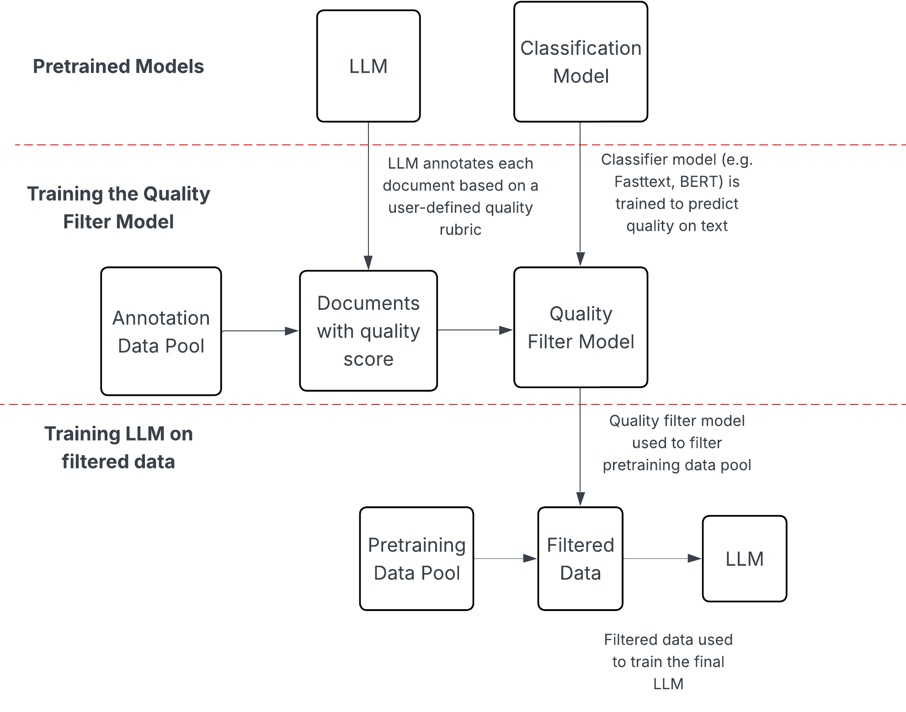

# Datashop Overview
Datashop is a data curation pipeline that takes a large pretraining dataset and applies model-based quality filters to create a higher quality dataset. This pipeline has been shown to increase downstream task performance at lower token counts. Datashop supports the usage of pretrained models to filter data as well as training your own quality filter models. This makes curating a domain-specific dataset easy by simply prompting the model to look for the desired data.

## Architectural Diagram

The diagram above illustrates the Datashop pipeline, which is used for data filtering and quality assessment. The pipeline processes raw pretraining data through several stages:

1. **Annotation**: Small subset of data is annotated by an LLM annotator model
2. **Quality filter model training**: A quality filter model is trained using the LLM's annotations.
3. **Filtering**: Annotated data is filtered based on quality scores
4. **LLM Training**: The filtered data is used to train an LLM.

For a practical example of using Datashop, see the [tutorial script](https://github.com/marin-community/marin/blob/main/experiments/tutorials/exp1096_datashop_example.py).
