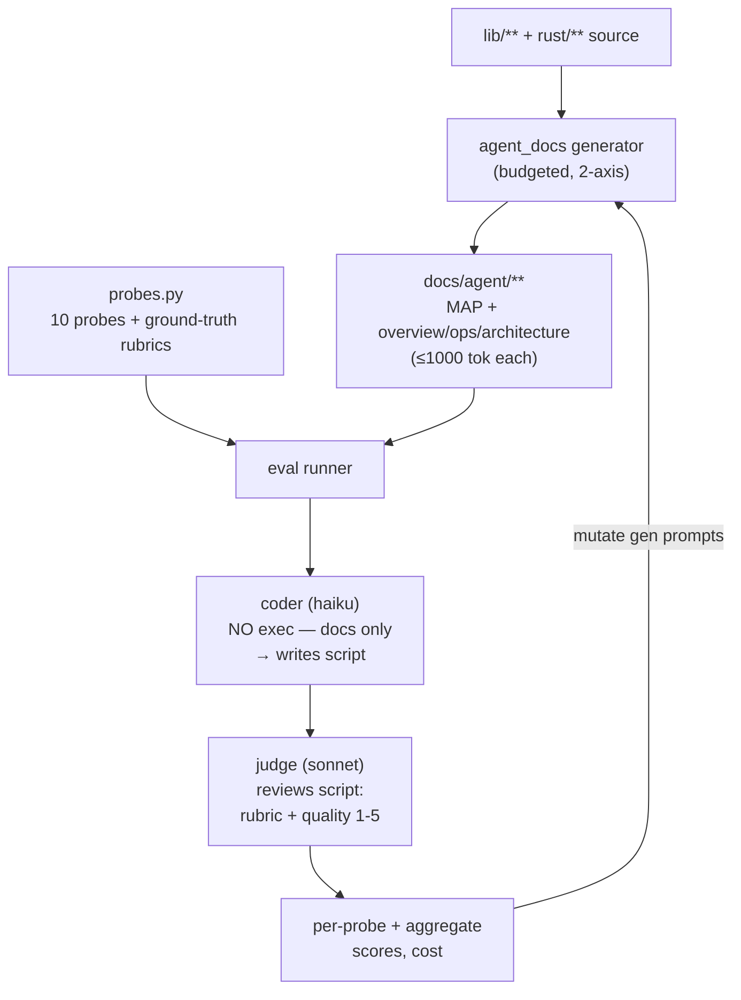

# Agent-Docs Experiment v2: budgeted two-axis docs, probe-judged

Takes over PR [#4321](https://github.com/marin-community/marin/pull/4321)
(`[docs] Add agent-optimized documentation generator`, branch
`claude/quirky-bouman`).

## Problem & goal

Today the repo's documentation for agents is two things at once, and neither is
trustworthy:

1. **Scattered, stale internal docs.** `.agents/projects/`, `lib/iris/docs/`,
   `lib/fray/docs/`, `lib/zephyr/docs/` are a grab-bag of design memos and
   incident notes (`autoscaler-fix.md`, `resultectomy.md`, `vue-refactor.md`, …).
   An agent that reads them is as likely to be misled by a half-finished design
   memo as helped. They actively add confusion.
2. **A doc generator validated against a single synthetic task.** PR #4321 builds
   a real two-tier generator (`scripts/agent_docs/`: tree-sitter parse → `claude`
   CLI → per-package cards + `MAP.md`). Its quality bar (`validation.py`, rounds
   R1–R6 in `scripts/agent_docs/experiments.md`) rests on **one** probe: "can
   haiku write a fuzzy-dedup script from the docs?" R6 scored 10/10 on that
   probe — but we cannot conclude the format generalizes from n=1, and the docs
   have no token budget, so they sprawl.

**Goal.** Replace the n=1 validation with a real evaluation and converge on a
*budgeted, two-axis* documentation format that measurably helps a weak agent do
real Marin tasks:

- **Clear the decks** — delete the confusing internal scratch docs.
- **A two-axis doc taxonomy under hard token budgets** — top-level map + per
  sub-project {overview, ops, architecture}, each ≤ 1000 tokens.
- **A real probe suite (10 probes)** mined from actual `~/.claude` usage, split
  across "how to *use*" and "how to *understand/change*" intents.
- **A judging methodology** — a basic model writes a script *with no execution
  privileges* (so it must rely on the docs alone), and a judge model *always
  reviews that script* against embedded ground truth plus a holistic quality
  rubric.
- **A 10-round iteration loop** that mutates the doc-generation prompts to
  maximize probe scores under the budgets, logging each round.

**Done looks like:** the stale docs are gone; `agent_docs/` produces the budgeted
two-axis taxonomy; `probes.py` + the generalized judge harness score a doc set
across all 10 probes in one command; `experiments.md` records the 10-round sweep;
`AGENTS.md` and the `autodoc` skill point at the new taxonomy; a PR is open.

## What we keep vs delete

| Path | Verdict | Why |
|------|---------|-----|
| `.agents/projects/` (10 files) | **delete** | agent design scratch (grugformer, iris-perf, vllm-docker…) |
| `.agents/docs/` (6 files) | **delete** | agent scratch: migration memos + smoke-test notes |
| `lib/iris/docs/` (21 files) | **delete** | internal design/incident notes; explicitly named in the goal |
| `lib/fray/docs/` (4 files) | **delete** | design + research scratch (`fray-lite-*`, `fix-ray-local`) |
| `lib/zephyr/docs/` (1 file) | **delete** | single design memo |
| `docs/agent/` | regenerated | generated output of the pipeline; `MAP.md` already removed |
| `lib/haliax/docs/` (34 files) | **keep** ⚠️ | published user docs — has its own `mkdocs.yml` |
| `lib/levanter/docs/` (52 files) | **keep** ⚠️ | published user docs — has its own `mkdocs.yml` |
| `docs/` (top-level) | **keep** | the user documentation the goal says to preserve "for now" |

⚠️ `lib/haliax/docs` and `lib/levanter/docs` are full mkdocs sites
(Getting-Started, Installation, Performance-Guide, api/cheatsheet). They read as
real *user* documentation, not scratch, so the plan keeps them. See open
question OQ1 if they should also go.

## Doc taxonomy & token budgets

These are the "doc options" the loop iterates. Every file has a **hard 1000-token
budget**, enforced by counting tokens with a real tokenizer and re-running a
"shorten" pass if a draft is over.

```
docs/agent/
  MAP.md                         # top-level map           ≤ 1000 tok
  <project>/
    overview.md                  # per sub-project          ≤ 1000 tok
    ops.md                       # "how to USE project X"   ≤ 1000 tok
    architecture.md              # "how to UNDERSTAND &     ≤ 1000 tok
                                 #  CHANGE project X"
```

`<project>` ∈ {iris, marin, levanter, haliax, fray, rigging, zephyr, finelog,
dupekit}. The two axes are deliberate and map onto how the probes were asked:

- **ops.md — how to use it.** Entry points, the happy-path command/call, required
  vs default parameters, where artifacts land. Answers "how do I run/call X?"
- **architecture.md — how to understand and change it.** The mental model:
  components, data flow, key invariants, and *where in the source you'd make a
  given change*. Answers "how does X work / where would I change it?"
- **overview.md** — the 30-second orientation that routes you to ops vs
  architecture and names the few files that matter.
- **MAP.md** — whole-monorepo index: one line per sub-project, cross-library
  dependency edges, the handful of top entry points. Loaded into every agent
  conversation, so it must stay tiny.

Budgets are about *forcing editorial choices*: 1000 tokens cannot hold an API
dump, so the generator must decide what an agent actually needs. This is the
variable the experiment optimizes.

## Probe suite (10, mined from `~/.claude/history.jsonl`)

Selected from a scan of 2508 Marin-project history entries (full candidate list
in the scan notes). Chosen for: reproducibility (answerable from docs+source,
not a live incident), coverage across sub-projects, and a balance of **USE** vs
**UNDERSTAND** intent. The history is heavily iris/finelog-weighted; marin /
levanter / rigging probes are included for balance even where history hits are
thinner.

| # | Subproject | Intent | Probe | Primary doc(s) |
|---|-----------|--------|-------|----------------|
| P1 | iris | understand | Trace how an Iris worker resolves the controller `host:port` through `lib/iris/src/iris/cluster/`. | iris/architecture |
| P2 | iris | understand | How does gang scheduling work for the "direct"/k8s provider for a 64×8 worker config? | iris/architecture |
| P3 | iris | use | Stand up an HTTP endpoint over a multi-host JAX mesh on Iris — the happy path. | iris/ops |
| P4 | iris | understand | What is reconciliation, and how would the controller drive worker state with poll-only updates (no status RPC)? | iris/architecture |
| P5 | finelog | understand | Explain the finelog storage hierarchy: L0/L1, "promote to L0", compaction/offload. | finelog/architecture |
| P6 | finelog | use | How do I publish the finelog native Rust wheel, and how do workers pull it from the AR/pypi mirror? | finelog/ops |
| P7 | marin | understand | How does the Marin executor work — is `ExecutorStep` execution deterministic, and where is that enforced? | marin/architecture |
| P8 | marin | use | Write a script that runs Marin's fuzzy-dedup pipeline with the correct default MinHash params. *(R6 regression anchor)* | marin/ops |
| P9 | levanter | use | How is `jax.distributed.init` configured for a multi-host Levanter training run? | levanter/ops |
| P10 | rigging | understand | Role of `maybe_proxy` vs reachability in `resolver.py`; how does a client reach an `iris://` log server? | rigging/architecture |

Each probe carries a **ground-truth rubric** (the same shape as today's
`REVIEW_RUBRIC`: exhaustive list of valid APIs / files / required params, so the
judge never guesses about the codebase). P8 reuses the existing fuzzy-dedup
ground truth verbatim as a regression anchor against R6.

## Judging methodology

Generalize `validation.py` into a probe-runner. For each probe:

1. **Assemble the doc bundle** — only the doc(s) a well-organized agent *should*
   consult for this probe (per the table), plus `MAP.md`. Not the whole tree:
   the point is to test whether the *right* doc carries the load.
2. **Coder writes a script — no execution privileges.** A basic model (default
   `haiku`) is given the doc bundle + the probe and must emit a complete,
   runnable script (or, for understand-probes, a script/snippet that *exercises*
   the relevant APIs). It runs through the `claude` CLI with **tools disabled** —
   no bash, no file reads, no grep. It cannot route around bad docs by exploring
   the repo, so the score is a clean measure of *doc* quality.
3. **Judge always reviews the script.** A strong model (default `sonnet`)
   reviews the *script artifact* (never executes it) and produces:
   - **Rubric score** — per-probe binary criteria scored 0/1 against embedded
     ground truth (import path correct, function/entry-point exists, required
     params present, defaults right, no hallucinated APIs).
   - **Quality score** — a holistic 1–5 ("would this actually work / is it
     idiomatic / does it use the right entry points?") with a written
     justification.
4. **Aggregate** — per-probe `{rubric: k/n, quality: 1–5, notes}`; suite-level
   mean rubric accuracy and mean quality, plus cost.

Why script-not-prose and judge-reviews-the-script: a concrete artifact is far
easier to score objectively than free-form prose, and embedding ground truth in
the rubric is what stopped the R6 reviewer from hallucinating API verdicts. The
coder having no exec is the load-bearing constraint — it is what makes the score
attributable to the docs.



## Iteration loop (10 rounds)

```
for round r in 1..10:
  1. generate the doc set (MAP + per-project overview/ops/architecture)
     under the 1000-token budgets, using round r's prompt/format variant
  2. for each of the 10 probes:
        bundle = relevant docs + MAP
        script = coder(bundle, probe)          # no exec
        result = judge(script, ground_truth)   # rubric + quality
  3. record aggregate (mean rubric acc, mean quality, cost) + per-probe failures
  4. inspect failures → mutate the generation prompt for round r+1
     (e.g. how to split ops vs architecture, what earns its place in 1000 tok)
  5. append the round to experiments.md (R7, R8, …)
stop early if a target is hit (e.g. mean rubric ≥ 0.9 AND mean quality ≥ 4.0
  for 2 consecutive rounds), else run all 10.
```

Each round mutates the *prompt templates*, not the harness — the prior R1–R6
lessons (haiku coder, no examples needed, sub-package granularity, prose for
defaults + code blocks for imports, ground truth in rubric) are the starting
point. New questions this loop answers: what belongs in 1000-token ops vs
architecture; whether the overview is worth its budget; how to phrase
"where would I change this" so architecture docs are actionable.

**Cost.** Each round ≈ (docs generated) + 10 coder + 10 judge calls. A full
10-round sweep is the expensive part and is **gated on explicit approval** (see
OQ2) — the harness is built and smoke-tested first, then the sweep is run as one
command.

## Wiring

- `AGENTS.md` — update the `@docs/agent/...` reference from the old
  `packages/<package>.md` shape to the new `MAP.md` + `<project>/{overview,ops,
  architecture}.md` taxonomy.
- `.agents/skills/autodoc/SKILL.md` — update the workflow to generate the new
  taxonomy and run the probe suite as a quality gate before opening the weekly PR.

## Tasks

Each task has a stable id. `exec: session|issue` tasks become weaver issues on
`weaver plan sync`; `inline` tasks do not. Status is projected from the ledger —
never hand-edit it here.

### T1 — Delete stale internal docs  `exec: inline`  `value: high`  `deps: —`

Remove `.agents/projects/`, `lib/iris/docs/`, `lib/fray/docs/`, `lib/zephyr/docs/`
in a dedicated commit (git-reversible, easy to review). Keep `lib/haliax/docs`,
`lib/levanter/docs`, and top-level `docs/`. Acceptance: those four trees gone,
the three kept trees untouched, repo still lints.

### T2 — Probe suite  `exec: session`  `value: high`  `deps: —`

`scripts/agent_docs/probes.py`: the 10 probes as data (id, subproject, intent,
prompt, doc-bundle selector, ground-truth rubric). P8 reuses the existing
fuzzy-dedup ground truth. Acceptance: importable; `eval.py --list` prints all 10.

### T3 — Generalized judge harness  `exec: session`  `value: high`  `deps: T2`

Refactor `validation.py` → `eval.py`: load a doc set, for each probe run
coder(no-exec) → judge(rubric + 1–5 quality), write per-probe + aggregate JSON.
Coder runs via `claude_cli` with tools disabled. Acceptance: runs end-to-end on
one probe against an existing doc and emits a scored `result.json`.

### T4 — Budgeted two-axis generator  `exec: session`  `value: high`  `deps: —`

Add `OVERVIEW_PROMPT`, `OPS_PROMPT`, `ARCHITECTURE_PROMPT` to `prompts.py`;
token-budget enforcement (count + shorten pass) replacing the char limits; emit
`docs/agent/<project>/{overview,ops,architecture}.md` + `MAP.md`. Acceptance:
`main.py` produces the taxonomy for one project under budget.

### T5 — Iteration runner + changelog  `exec: session`  `value: medium`  `deps: T3, T4`

Driver that runs N rounds (generate → score → log), appending each round to
`experiments.md` (R7…). Acceptance: a 1-round dry pass writes a round entry. The
full 10-round sweep is gated (OQ2).

### T6 — Wire AGENTS.md + autodoc skill  `exec: inline`  `value: medium`  `deps: T4`

Update the `@docs/agent` reference and `SKILL.md` workflow to the new taxonomy +
probe gate.

### T7 — Open PR  `exec: inline`  `value: high`  `deps: T1, T2, T3, T4`

Update PR #4321 (branch `claude/quirky-bouman`) with the plan, deletions, and
harness; `agent-generated` label; summary of what's ready vs gated.

## Open questions

- **OQ1 — haliax/levanter docs.** Kept as published user docs (they have mkdocs
  sites). Confirm they should stay, or whether the "reduce confusion" goal wants
  them gone too. *Default: keep.*
- **OQ2 — sweep budget.** A full 10-round sweep is ~tens of dollars of API spend
  (10 doc generations + 200 coder/judge calls). Harness is built and
  smoke-tested in this session; running the full sweep is gated on explicit
  approval. *Default: do not auto-run the sweep.*
- **OQ3 — probe balance.** History is iris/finelog-heavy, so the final mix is
  4 iris, 3 finelog, 2 marin, 1 levanter (no rigging — the `maybe_proxy`/resolver
  concept from history turned out to live in finelog's client, not rigging, so
  P10 was retagged finelog with `maybe_proxy`/`iris://` listed as hallucination
  markers). Confirm this mix or swap in others from the candidate list.
- **OQ4 — branch must contain `lib/finelog/` before the sweep.** finelog landed
  on `main` *after* this branch forked, so P5/P6/P10 (3 of 10 probes) reference
  source/docs that do not exist in this worktree. The generator will produce no
  finelog docs and those probes auto-fail until the branch is rebased on / merged
  with `main`. Do that before running the generator or the sweep. *Default:
  rebase on main before T4's emit loop runs.*

## Built in this session vs remaining

**Built & committed:** T1 (deletions), the loom plan, T2 (`probes.py`), T3
(`eval.py` + `claude_cli.disable_tools`), the T4 prompt layer
(`OVERVIEW`/`OPS`/`ARCHITECTURE`/`CODER`/`JUDGE` templates + `tokens.py`), T6
(AGENTS.md + autodoc skill). All lint-clean; validated structurally (no API
spend): `eval.py --list`, prompt-format integrity, missing-doc handling.

**Remaining (cost-gated / deferred):** T4's generator *emit loop* — wire
`main.py`/`generate_package.py`/`generate_index.py` to write the
`<project>/{overview,ops,architecture}.md` + budgeted `MAP.md` taxonomy using the
new prompts + `tokens.py` budget enforcement (the old per-package emit path is
left intact until then). T5 — the 10-round iteration runner + `experiments.md`
changelog. Running the generator and the sweep both spend API budget (OQ2) and
need finelog present (OQ4), so they are left for an approved follow-up.
