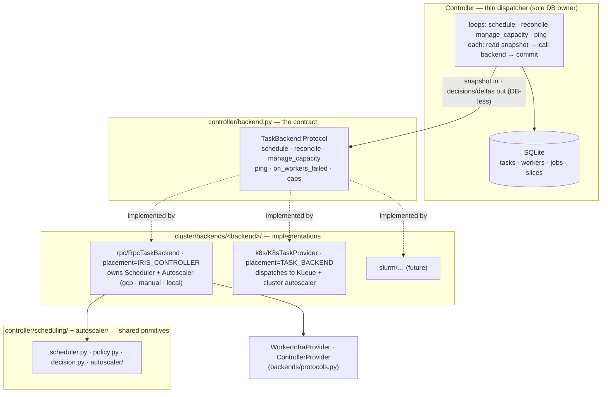

# Iris TaskBackend Contract — Stage 1 (landed) + cleanup pass

Tracking: [marin#6178](https://github.com/marin-community/marin/issues/6178) ·
weaver issue #21 · PR [#6209](https://github.com/marin-community/marin/pull/6209)

## Status

**Stage 1 — the DB-less `TaskBackend` contract — is implemented** (commits
T1–T7 on this branch) and open for review as PR #6209. The controller now drives
every backend through one `TaskBackend` protocol: it owns the DB and the loop
cadences, hands the backend read-only snapshots, and commits what the backend
returns. No `isinstance` on backend type remains in `controller.py` / `main.py`;
both implementations (`RpcTaskBackend` for GCP/manual/local, `K8sTaskProvider`
for Kueue) satisfy the contract and are selected on a `placement` capability.

**We are now in a cleanup pass** responding to PR review (rjpower) plus two
structural renames. The bulk refactor is done; this pass is naming, module
placement, and a few thin-dispatcher simplifications. Progress and remaining
work are tracked in [Cleanup pass](#cleanup-pass-pr-review-response) below.

Done so far in the cleanup pass (C1–C7, each its own commit, tests green):
`cluster/providers` → `cluster/backends`; `autoscaler_factory.py` →
`autoscaler/factory.py`; `direct_provider.py` → `reconcile/dispatch.py` (+ the
`direct_provider` → `dispatch` vocabulary retirement); `Placement` →
`PlacementOwner {IRIS_CONTROLLER, TASK_BACKEND}`; `Controller._provider` →
`_task_backend`; scheduling decision passes renamed (`apply_placements` /
`apply_preemptions` / `compute_diagnostics`) and two moved into
`scheduling/decision.py`; contract docstrings fixed.

Remaining (C8–C13): two thin-dispatcher simplifications the reviewer flagged
(uniform loop spawning; `on_workers_failed` shape), the backend-construction
cleanup (factory builds+attaches the autoscaler; de-duplicate the log client),
lifting one scheduling DB read into `build_scheduling_context`, retiring the
`has_direct_provider` provider-status field, and the doc sync for the renames.

---

## The core abstraction (as implemented)

> **A backend is the control-plane driver for one cluster.** It owns
> *scheduling*, *reconciliation*, *capacity management (autoscaling)*, and the
> *one-off* operations (status / profile / exec) for that cluster. Some backends
> (k8s, later slurm) implement these by **dispatching to the underlying system**;
> others (gcp/manual/local) **do the work themselves** with Iris's own scheduler
> and autoscaler primitives. **The controller is a thin dispatcher: it owns the
> DB and the loop cadences, hands the backend read-only snapshots, and commits
> the decisions the backend returns. The backend never touches the DB.**

The DB-less contract is the load-bearing invariant: **every backend method takes
a snapshot dataclass and returns a result/delta dataclass; the backend performs
no DB I/O.** A backend may hold in-memory state (RPC stub caches, autoscaler
slice tracking) seeded once at construction, but its steady-state methods are
pure-in / effects-and-data-out.

### The contract

`controller/backend.py` (the consumer side; the reconcile/scheduling data types
it references are controller-internal, which is why the contract module stays in
`controller/` — moving it into `backends/` would make `backends/` import the
scheduling/reconcile/autoscaler layers and cycle). The infra protocols
(`ControllerProvider`, `WorkerInfraProvider`) stay in `backends/protocols.py` —
"provider" remains the right word for the VM-lifecycle layer a backend drives.

```python
class PlacementOwner(StrEnum):
    IRIS_CONTROLLER = "iris_controller"  # Iris schedules task→worker; backend fans RPCs to daemons
    TASK_BACKEND    = "task_backend"     # the backend places tasks (Kueue, slurmctld); Iris does not schedule

class TaskBackend(Protocol):
    name: str
    placement: ClassVar[PlacementOwner]
    manages_capacity: ClassVar[bool]      # True => backend provisions nodes itself (k8s)

    def schedule(self, snapshot: ScheduleInput) -> ScheduleResult: ...
    def reconcile(self, batch: BackendReconcileInput) -> BackendReconcileResult: ...
    def manage_capacity(self, snapshot: CapacityInput) -> CapacityResult: ...
    def on_workers_failed(self, worker_ids: list[WorkerId]) -> WorkersFailedResult: ...
    def ping_workers(self, workers: list[tuple[WorkerId, str | None]]) -> list[PingResult]: ...
    def capacity(self) -> ClusterCapacity | None: ...
    def attach_autoscaler(self, autoscaler: Autoscaler) -> None: ...
    # on-demand (not loop-driven), via TaskTarget:
    def get_process_status(self, target, request) -> ...: ...
    def profile_task(self, target, request, timeout_ms) -> ...: ...
    def exec_in_container(self, target, request, timeout_seconds) -> ...: ...
```

### Two apply paths, selected on `placement` (not `isinstance`)

`reconcile`'s two apply paths are **not interchangeable**:
- `IRIS_CONTROLLER` → `ops.worker.apply_reconcile` (emits worker heartbeats,
  `WORKER_RECONCILE` transition source).
- `TASK_BACKEND` → `ops.task.apply_dispatch_updates` (`DISPATCH` source, no
  heartbeats). The controller-side, DB-coupled input builder for this path is
  `controller/reconcile/dispatch.py` (`drain_for_dispatch`) — the counterpart to
  `reconcile/worker.py` for the IRIS path.

### Thin-dispatcher loops + DB-less autoscaler

Each controller loop keeps its cadence (scheduling ~10s adaptive, reconcile 1s,
autoscale ~10s, ping 5s) but its body is read-snapshot → call-backend → commit.
The autoscaler is DB-less: `ScalingGroup`/`Autoscaler` hold in-memory state as
authoritative and expose `persistable_state() -> AutoscalerState`;
`manage_capacity` / `on_workers_failed` return it and the controller does a
wholesale state sync (`persist_autoscaler_state`). Startup restore is a one-time
controller-owned bootstrap (`restore_from_db`, then `attach_autoscaler`).

---

## Architecture



---

## Tasks

### Stage 1 — the contract (one PR, commit spiral) — all ✅

- **T1 — Contract + neutral reconcile types** ✅ — `controller/backend.py`:
  `TaskBackend`, `PlacementOwner`, `BackendReconcileInput/Result`,
  `ClusterCapacity`, `SchedulingEvent`, `PingResult`, `TaskTarget`.
- **T2 — Adopt the reconcile contract** ✅ — K8s `sync`→`reconcile`;
  `WorkerProvider`→`backends/rpc/backend.py` `RpcTaskBackend`; controller drives
  both via `reconcile`, no `isinstance`; deleted `controller/provider.py`.
- **T3 — Scheduling into the backend** ✅ — `backend.schedule(snapshot)`;
  `RpcTaskBackend` owns the stateless `Scheduler`; K8s no-op.
- **T4 — Autoscaling into the backend, DB-less** ✅ — `manage_capacity` /
  `on_workers_failed`; wholesale state sync; `attach_autoscaler`.
- **T5 — Name the shared scheduling layer** ✅ — `controller/scheduling/`.
- **T6 — Capability-driven dashboard** ✅ — `/auth/config` backend descriptor;
  `App.vue` filters one tab list by capabilities; `provider_kind` retired.
- **T7 — Documentation** ✅ — architecture.md, AGENTS.md, README, coreweave.md,
  archived design record.

### Cleanup pass (PR review response)

Each is its own commit. Structural renames are pure moves + import rewrites
(behavior-preserving, verified by pyrefly + `tests/cluster`).

- **C1 — `cluster/providers` → `cluster/backends`** ✅ — vocabulary clash from
  review ("can't have backend.py and a providers/ module"): the package
  implements the `TaskBackend` contract (rpc, k8s) plus the machine-lifecycle
  providers those backends drive (gcp, manual, local). `WorkerInfraProvider` /
  `ControllerProvider` keep the "provider" name. 88 files, import rewrite only.
- **C2 — `autoscaler_factory.py` → `autoscaler/factory.py`** ✅ — the package
  `__init__` does not import it, so the `config` import inside still resolves
  without a cycle.
- **C3 — `direct_provider.py` → `reconcile/dispatch.py`** ✅ — answers the review
  question "should it be in backends/k8s?": no. It reads *and writes* the DB in a
  controller transaction (the `TASK_BACKEND` reconcile-input builder, counterpart
  to `reconcile/worker.py`), so it belongs with the reconcile thin-I/O layer, not
  a DB-less backend.
- **C4 — `Placement` → `PlacementOwner {IRIS_CONTROLLER, TASK_BACKEND}`** ✅ —
  reads clearly at the comparison sites; wire values follow the member names
  (`/auth/config` consumes the placement string opaquely).
- **C5 — `Controller._provider` → `_task_backend`** ✅ — field name matches the
  contract; also trimmed a superfluous "applied in one transaction" docstring.
- **C6 — Scheduling decision passes renamed + relocated** ✅ — `_placement_pass`
  → `apply_placements`, `_preemption_pass` → `apply_preemptions`,
  `_job_scheduling_diagnostics` → `compute_diagnostics`. `apply_preemptions` and
  `compute_diagnostics` reference only scheduling-layer types and moved to
  `scheduling/decision.py`; `apply_placements` stays in `backend.py` (it needs the
  controller-layer `ReservationClaim`, and moving it would make `scheduling/`
  import the controller layer). Also fixed three contract docstrings to state
  what the data *is*, not how it is assembled.
- **C7 — `direct_provider` → `dispatch` vocabulary retirement** ✅ —
  `drain_for_direct_provider`→`drain_for_dispatch`,
  `DIRECT_PROVIDER_PROMOTION_RATE`→`DISPATCH_PROMOTION_RATE`,
  `writes.promote_to_direct_provider`→`promote_for_dispatch`,
  `ops.task.apply_direct_provider_updates`→`apply_dispatch_updates`,
  `TransitionSource.DIRECT_PROVIDER`→`DISPATCH`, and the `_sync_dispatch` /
  `_run_dispatch_loop` controller methods. Safe per the user: none of this goes
  over the wire (the `direct_provider` term in proto is config-parsing only).

- **C8 — Lift `running_for_preemption` into `build_scheduling_context`** ⬜ —
  review comment at `controller.py:847` ("move this into get_scheduling_context?").
  The preemption-band DB read currently sits between context-build and
  `backend.schedule`. Pass `claims` into `build_scheduling_context` and read it
  there so the controller's scheduling tick is one read + one backend call + one
  commit. `value: medium`.
- **C9 — Backend construction: factory builds+attaches the autoscaler; one log
  client** ⬜ — review comments at `main.py:187` ("the factory should do this, not
  hacks here — the rpc backend builds+attaches the autoscaler at setup, k8s
  doesn't") and `controller.py:345` ("make the backend constructor accept
  `self._log_client`; rpc et al may ignore it"). Move the autoscaler
  build+`restore_from_db`+`attach_autoscaler` into the backend factory keyed on
  `manages_capacity`, and pass the single controller `LogClient` into the backend
  (drop the duplicate `LogClient.connect` for the k8s log sink). `value: medium`.
- **C10 — Uniform loop spawning (design)** ⬜ — review comments at
  `controller.py:528` and `:574`: "run the same loops for all backends; k8s just
  has a no-op polling/autoscaler loop." Today `start()` branches on `placement`
  to spawn either the dispatch loop or the scheduling/polling/ping loops, and
  gates the autoscaler loop on `manages_capacity`. Target: always spawn the loop
  set; the backend's no-op `schedule`/`manage_capacity`/`ping_workers` make the
  k8s versions cheap no-ops. Needs care — the dispatch loop and the
  scheduling+polling loops are genuinely different bodies today; unifying them is
  the "make the controller a pure dispatch point" step. `value: medium`,
  `deps: keep behavior identical`.
- **C11 — `on_workers_failed` shape (design)** ⬜ — review comment at
  `controller.py:1233`: "we just called the backend to reconcile — doesn't it
  already know the failed workers? this feels weird." Re-examine why the
  controller calls `ops.worker.fail` then passes the failed worker ids to
  `backend.on_workers_failed`; fold the worker-failure signal into the reconcile
  return or otherwise remove the double-handling. `value: medium`.
- **C12 — Retire the `has_direct_provider` provider-status field** ⬜ — distinct
  from the dispatch drain (it is the `GetProviderStatus` RPC's
  `has_direct_provider` bool + the `Controller.has_direct_provider` property +
  service gates). Post-T6 the dashboard reads capabilities from `/auth/config`, so
  this internal flag and possibly the whole `GetProviderStatus` RPC may be
  removable rather than renamed. Touches `controller.proto` (regen) +
  `service.py` + test mocks. `value: low`, `deps: assess remove-vs-rename`.
- **C13 — Doc sync for the renames** ⬜ — update path/prose references for
  `backends/`, `PlacementOwner`, `dispatch`, `scheduling/decision.py` in
  `lib/iris/docs/architecture.md`, `AGENTS.md`, `TESTING.md`, `coreweave.md`,
  `reconcile_rpc.md`, and the archived design record. `value: low`.

---

## Beyond this PR

Sketch only (each = one chonky PR):

- **Slurm backend.** `placement=TASK_BACKEND`, `manages_capacity=True`;
  `sbatch`/`squeue`/`sacct`; reuse the contract. Open question: worker daemon
  inside the allocation (reuse `RpcTaskBackend`) vs direct sbatch launch (closer
  to k8s).
- **Multi-backend.** `Controller` accepts `list[TaskBackend]`; a meta-scheduler
  routes pending tasks by constraint/selector; capacity + reconcile fan out per
  backend.
- **Single-tick collapse (optional).** Fold the per-activity loops into one
  driving tick if cadences allow. Deferred — separate cadences + slow provisioning
  I/O are load-bearing today. C10 is the prerequisite groundwork.

---

## Resolved decisions

- **Naming: `TaskBackend`** for the contract; **`PlacementOwner`** for the
  scheduling-owner enum. "Provider" stays for the infra protocols
  (`ControllerProvider`, `WorkerInfraProvider`); the bare `TaskProvider` is gone.
- **The contract module stays in `controller/`** — it references controller-layer
  scheduling/reconcile/autoscaler types; relocating it into `backends/` would
  cycle. Renaming `providers/`→`backends/` resolves the vocabulary clash without
  the cycle.
- **`direct_provider.py` is controller-side**, not a backend module — it owns DB
  I/O. Renamed to `reconcile/dispatch.py`.
- **One PR for all of Stage 1** (T1–T7); the cleanup pass lands as further
  commits on the same PR.

## Open questions

- **C10 loop unification depth** — make the k8s loops cheap no-ops in place, or
  actually merge the dispatch loop and the scheduling/polling loops into one
  reconcile tick? *Leaning:* no-op-in-place first (lowest behavioral risk), full
  merge as Stage-2 groundwork.
- **C12 `GetProviderStatus`** — rename the field, or delete the RPC now that the
  dashboard is capability-driven? *Leaning:* check for remaining consumers; delete
  if dead.
