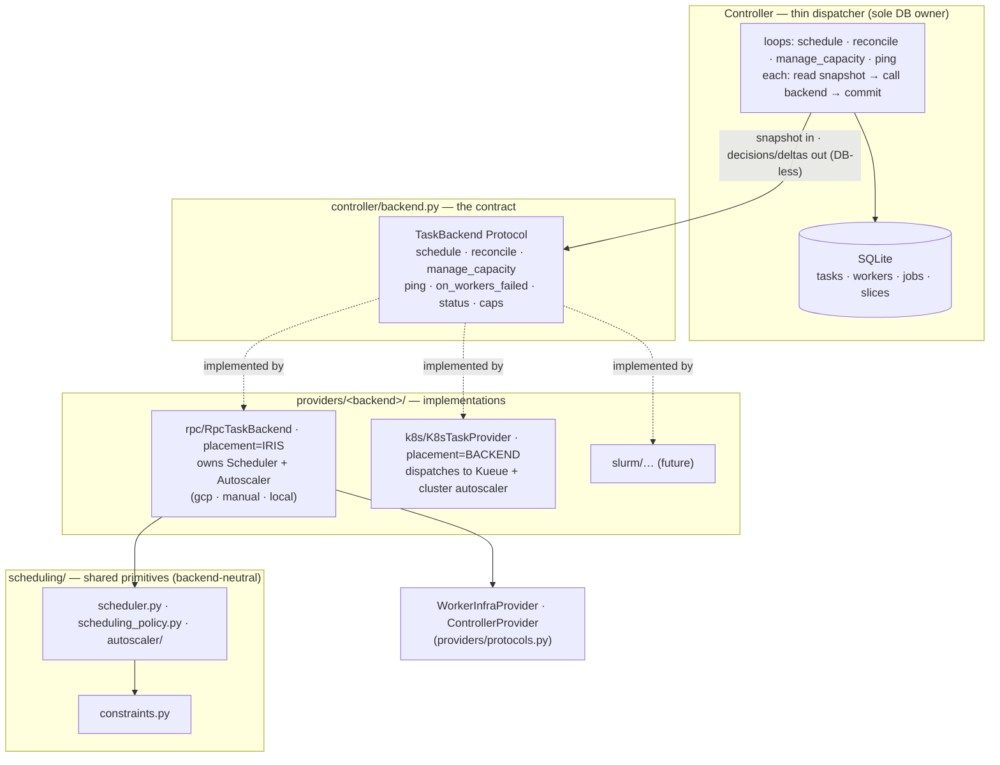

# Iris TaskProvider / Backend Contract — Stage 1

Tracking: [marin#6178](https://github.com/marin-community/marin/issues/6178) ·
weaver issue #21

## Problem & goal

Iris supports two execution models today — Iris-scheduled (GCP/TPU, manual,
local) and backend-scheduled (Kubernetes/CoreWeave) — but it has **no named
boundary** for what a "backend" is. The split is encoded as
`isinstance(self._provider, K8sTaskProvider)` in four places in
`controller.py` plus a `not isinstance(...)` gate in `main.py`, with the
controller's provider typed as the union `TaskProvider | K8sTaskProvider` (a
protocol OR-ed with a concrete class). The word "provider" already means three
unrelated things (see [Current state](#current-state)). Adding a third backend
(Slurm) by extending the `isinstance` ladder is not viable.

**Stage 1 goal.** Define one clear backend contract and refactor the existing
two implementations behind it, so the controller drives every backend through a
single, DB-free interface shaped like the loop the issue author asked for:

```python
# controller.py — the target driving tick
def reconcile(self):
    task_state  = self._read_control_state(cur)   # query_db   (only the controller touches the DB)
    task_update = self._backend.reconcile(task_state)  # backend does backend-specific I/O, no DB
    self._apply(cur, task_update)                  # update_db
```

**Done when, after Stage 1:**

1. The controller talks to a single `TaskBackend` protocol (naming discussed
   [below](#naming)) via a clear, non-DB interface. No `isinstance` on backend
   type anywhere in `controller.py` / `main.py`.
2. The two existing implementations (`K8sTaskProvider`, the GCP/manual/local RPC
   fan-out) both satisfy that protocol and live under `providers/`.
3. Backend-neutral scheduling primitives (`scheduler.py`, `scheduling_policy.py`,
   `constraints.py`) sit in their own clearly-labelled layer, importable by any
   backend.
4. The dashboard renders from a backend **capability descriptor**, not a
   hard-coded "k8s vs gcp" boolean.
5. No behavioral change: GCP/TPU, CoreWeave, manual, and local clusters behave
   exactly as before. Existing fakes + tests are the safety net.

**Stage 1 is explicitly NOT:** adding Slurm, supporting more than one backend at
once, or collapsing the autoscaler's slow provisioning I/O into the reconcile
tick. Those are Stages 2–5 (sketched at the [end](#beyond-stage-1)).

This document is the design for review. Implementation lands as one chonky PR
after sign-off (see [Rollout](#q2-rollout--chonky-prs)).

---

## Current state

### "Provider" means three different things

| Name | File | Role | Implementers |
|------|------|------|--------------|
| `TaskProvider` (Protocol) | `controller/provider.py:20` | RPC fan-out to **worker daemons**: `get_process_status`, `profile_task`, `on_worker_failed`, `close`. **Incomplete** — the controller also calls `dispatch_reconcile_plans` and `ping_workers`, which are *not* on the protocol. | `WorkerProvider` (`controller/worker_provider.py:105`) |
| `K8sTaskProvider` (concrete class) | `providers/k8s/tasks.py:1229` | Direct pod control. Exposes `sync(batch) -> result`, `profile_task`, `exec_in_container`, `get_cluster_status`, `close`. Does **not** implement `TaskProvider`. | itself |
| `ControllerProvider` + `WorkerInfraProvider` (Protocols) | `providers/protocols.py:23,96` | **Infra lifecycle** — controller VM start/stop/tunnel, slice/VM CRUD for the Autoscaler. Orthogonal to task execution. | `providers/gcp/`, `providers/k8s/`, `providers/manual/` |

So `self._provider: TaskProvider | K8sTaskProvider` unions a protocol with a
concrete class, and the controller `isinstance`-branches to pick an execution
model.

### Two execution models, branched by `isinstance`

| | Iris-scheduled (GCP / manual / local) | Backend-scheduled (K8s / CoreWeave) |
|---|---|---|
| Loops | `_run_scheduling_loop` + `_run_polling_loop` + `_run_ping_loop` (+ prune, +autoscaler) | `_run_direct_provider_loop` only |
| Placement | Iris `Scheduler.find_assignments` matches task→worker | Kueue / k8s scheduler places pods |
| Dispatch | `provider.dispatch_reconcile_plans(plans, addrs)` — RPC to worker daemons | `provider.sync(batch)` — `kubectl apply` |
| Capacity | Iris `Autoscaler` provisions slices via `WorkerInfraProvider` | cluster autoscaler provisions nodes (k8s-native) |
| Liveness | `provider.ping_workers` heartbeat (5s) | pod-phase polling inside `sync` |
| Status feedback | reconcile RPC results | pod poll → `DirectProviderSyncResult` |

The `isinstance` sites (to be removed in Stage 1):
`controller.py:345` (log-client injection), `controller.py:530` (which loops to
spawn), `controller.py:800` (assert in `_sync_direct_provider`),
`controller.py:1512` (`has_direct_provider` property), `main.py:188` (autoscaler
gate).

### The loop the user wants already exists — for K8s only

`controller.py:797 _sync_direct_provider` is already
`query_db → provider.sync → update_db`:

```python
batch  = drain_for_direct_provider(cur, cache=..., max_promotions=...)  # query_db
result = provider.sync(batch)                                           # provider.reconcile
apply_direct_provider_updates(cur, result.updates, ...)                # update_db
```

Stage 1 generalizes this shape to **both** backends. The GCP path already has
the same bones — `_reconcile_tick` does
`snapshot → build_reconcile_plans (pure) → provider.dispatch_reconcile_plans →
apply_reconcile` — it just splits "build plans" out as a controller-side pure
step and fans out per-worker. The unification is to express both as one
`reconcile(desired_state) -> observed_updates` call.

### What's already backend-neutral (good news)

From the subsystem audit: `scheduler.py` (`Scheduler.find_assignments`,
`scheduler.py:616`), `scheduling_policy.py` (`compute_demand_entries`), and
`constraints.py` (`Constraint`, `ConstraintIndex`, `WellKnownAttribute`,
`PlacementRequirements`) are **already pure and backend-agnostic** — they
operate on `WorkerSnapshot` / `JobRequirements` / abstract attributes with zero
GCP types. The autoscaler's `planning.py` and `routing.py` are pure too; only
`runtime.py` / `scaling_group.py` / `operations.py` touch `WorkerInfraProvider`
and parse `.gcp`/`.coreweave` config fields. So "shared scheduling primitives"
mostly already exist — Stage 1 *names and relocates* them rather than rewriting.

---

## The core abstraction

> **A backend is the control-plane driver for one cluster.** It owns
> *scheduling*, *reconciliation*, *capacity management (autoscaling)*, and the
> *one-off* operations (status / profile / exec) for that cluster. Some backends
> (k8s, later slurm) implement these by **dispatching to the underlying system**;
> others (gcp/manual/local) **do the work themselves** with Iris's own scheduler
> and autoscaler primitives. **The controller becomes a thin dispatcher: it owns
> the DB and the loop cadences, hands the backend read-only snapshots, and
> commits the decisions the backend returns. The backend never touches the DB.**

This extends the existing *functional core / imperative shell* design (see
`.agents/projects/2026-05-31_iris_reconcile_control_flow.md`) to the backend
boundary:

- **Controller = imperative shell + the only DB owner.** Each loop reads a
  snapshot (DB → plain dataclass), calls one backend method, commits the
  returned decisions/deltas. It holds *no* scheduling, autoscaling, or dispatch
  logic of its own — only the read/commit glue and the cadence.
- **Backend = the cluster's control logic.** Snapshot in, decisions + side
  effects (RPC fan-out, `kubectl apply`, VM provisioning) out, deltas back.
  No SQLite, no controller internals.

The DB-less contract is the load-bearing invariant: **every backend method takes
a snapshot dataclass and returns a result/delta dataclass; the backend performs
no DB I/O.** A backend may hold in-memory state (RPC stub caches, autoscaler
slice tracking) seeded once at construction, but its steady-state methods are
pure-in / effects-and-data-out.

### Proposed protocol

Lives in `controller/backend.py` (the consumer side; the reconcile/scheduling
data types it references are controller-internal). The infra protocols
(`ControllerProvider`, `WorkerInfraProvider`) stay in `providers/protocols.py`.

```python
class Placement(StrEnum):
    IRIS = "iris"        # Iris schedules task→worker; backend fans RPCs to worker daemons
    BACKEND = "backend"  # the backend places tasks (Kueue, slurmctld); Iris does not schedule

class TaskBackend(Protocol):
    """Control-plane driver for a single cluster backend. Never touches the DB."""

    # --- capabilities (replace the isinstance ladder) ---
    name: str                  # "gcp", "coreweave", "manual", "local", later "slurm-stanford"
    placement: Placement       # who schedules; selects the controller's commit path
    manages_capacity: bool     # True => backend provisions nodes itself (k8s); False => its own Autoscaler does

    # --- scheduling: pure decision from a DB snapshot; controller commits ---
    #   IRIS: preference + find_assignments + preemption (uses the shared Scheduler).
    #   BACKEND: no-op (the backend system schedules) — returns an empty result.
    def schedule(self, snapshot: ScheduleInput) -> ScheduleResult: ...

    # --- reconciliation: converge running tasks, observe; controller commits ---
    #   IRIS: fan out the per-worker Reconcile RPC -> raw worker_results.
    #   BACKEND: apply pods / poll -> pre-computed task updates.
    def reconcile(self, snapshot: BackendReconcileInput) -> BackendReconcileResult: ...

    # --- capacity management (autoscaling): cloud I/O here, DB deltas back ---
    #   IRIS: autoscaler refresh + probe + scale (provisions via WorkerInfraProvider).
    #   BACKEND: no-op (the cluster autoscaler handles capacity).
    def manage_capacity(self, snapshot: CapacityInput) -> CapacityResult: ...

    # --- liveness + worker-failure handling (IRIS); no-ops for BACKEND ---
    def ping_workers(self, workers: list[tuple[WorkerId, str | None]]) -> list[PingResult]: ...
    def on_workers_failed(self, worker_ids: list[WorkerId]) -> WorkersFailedResult: ...

    # --- capacity rollup for the dashboard ---
    def capacity(self) -> ClusterCapacity | None: ...

    # --- on-demand request/response (NOT loop-driven; see Async ops) ---
    def get_process_status(self, target: TaskTarget, request) -> ...: ...
    def profile_task(self, target: TaskTarget, request, timeout_ms) -> ...: ...
    def exec_in_container(self, target: TaskTarget, request, timeout_seconds=60) -> ...: ...
    def on_worker_failed(self, worker_id, address) -> None: ...   # evict stub cache

    def close(self) -> None: ...
```

`schedule`/`reconcile`/`manage_capacity`/`ping_workers`/`on_workers_failed` are
each driven by an existing controller loop (cadences preserved); the K8s backend
implements `schedule`/`manage_capacity`/`ping_workers`/`on_workers_failed` as
no-ops because Kueue + the cluster autoscaler own those. The result is that the
**only execution-model-specific logic left in `controller.py` is which snapshot
to build and how to commit — and even that is selected on `placement`, never on
the concrete type.**

### The reconcile data types (the DB-free interface)

`BackendReconcileInput` carries the placement-appropriate desired/observed state
(`tasks_to_run` + `running_tasks` for BACKEND; pre-built `plans` +
`worker_addresses` for IRIS); `BackendReconcileResult` carries `updates`
(BACKEND) or raw `worker_results` (IRIS) plus shared `scheduling_events` and
`capacity`. `ScheduleInput`/`ScheduleResult` and `CapacityInput`/`CapacityResult`
follow the same shape: a read-only snapshot in, decisions/deltas out. These live
in `controller/backend.py` (done for the reconcile pair in T1).

### Why two apply paths, selected on `placement`

`reconcile`'s two apply paths are **not interchangeable** and must both be kept:
- IRIS → `ops.worker.apply_reconcile` (emits worker heartbeats,
  `WORKER_RECONCILE` transition source).
- BACKEND → `ops.task.apply_direct_provider_updates` (`DIRECT_PROVIDER` source,
  no heartbeats, no build-failed reaping).

The controller picks the path on `backend.placement`. A new backend slots in by
declaring its placement; no controller `isinstance`.

---

## The thin dispatcher loops

Each controller loop keeps its own cadence but its body collapses to
read-snapshot → call-backend → commit. No `isinstance`; no scheduling or
autoscaling logic in `controller.py`.

```python
# scheduling loop (adaptive backoff; IRIS does work, BACKEND returns empty)
snap   = build_schedule_input(db)              # query_db: pending/workers/usage/budgets/claims/running
result = backend.schedule(snap)                # pure decision (Scheduler + preemption) or no-op
commit_schedule(db, result)                    # update_db: ASSIGNED rows + preemptions + unschedulable

# poll/reconcile loop (1s)
snap   = build_reconcile_input(db)             # query_db: desired + running (+ addresses for IRIS)
result = backend.reconcile(snap)               # RPC fan-out OR kubectl apply
apply_reconcile_result(db, result)             # update_db (placement-selected apply path)

# capacity loop (autoscaler cadence; IRIS provisions, BACKEND no-op)
snap   = build_capacity_input(db)              # query_db: demand + worker status
result = backend.manage_capacity(snap)         # cloud I/O (create/terminate slices), DB deltas back
apply_capacity_deltas(db, result)              # update_db: slices/scaling_groups rows

# ping loop (5s) — liveness + slice-sibling termination on failure
results = backend.ping_workers(addresses)
... if unhealthy: failed = backend.on_workers_failed(ids); commit(db, failed)
```

The fast-wake events and adaptive backoff are preserved; this changes *what each
loop calls*, not the cadence model. Collapsing the loops into a single tick is a
possible later simplification but is **not** done here — the cadences differ
(scheduling ~10s adaptive, reconcile 1s, autoscale ~10s, ping 5s) and the slow
provisioning I/O must not block the 1s reconcile path (see [async ops](#q3-async-operations)).

### Making the autoscaler DB-less

The autoscaler is the one piece with real DB coupling: `ScalingGroup` today holds
a `db` handle and writes the `slices` / `scaling_groups` tables during
`refresh`/scale operations (`_db_upsert_slice`, `_db_update_group`,
`_db_remove_slice`). To honor the DB-less contract when the backend owns the
autoscaler:

1. Remove the `db` handle from `ScalingGroup` / `Autoscaler`; the in-memory slice
   state is the source of truth during operation.
2. `manage_capacity` (and `on_workers_failed`) accumulate slice/scaling-group
   **deltas** (created / ready / failed / removed, scale timestamps) and return
   them in `CapacityResult` / `WorkersFailedResult`.
3. The controller applies those deltas to the `slices` / `scaling_groups` tables
   in one transaction — the same write-through, now controller-owned.
4. Startup recovery stays controller-owned: the controller reads the slices
   checkpoint and hands the backend its initial tracked state at construction
   (a one-time bootstrap, not a steady-state DB touch).

This is the largest single piece of the migration and lands as its own commit.

---

## Module & provider refactor

Goal: backend implementations under `providers/<backend>/`, shared primitives in
a named layer, neutral contract types in a leaf module. Dependency direction
within `iris.cluster`: `providers → {scheduling, backend_types, types}` and
`controller → {providers, scheduling, backend_types}`. No reverse edges.

| Today | Stage 1 target | Why |
|------|----------------|-----|
| `controller/provider.py` (`TaskProvider` protocol) | **deleted**; folded into `TaskBackend` in `providers/protocols.py` | one contract, not an incomplete one |
| `controller/worker_provider.py` (`WorkerProvider` = RPC fan-out) | `providers/rpc/backend.py` as `RpcTaskBackend` | it's the daemon-RPC backend shared by gcp/manual/local — belongs under `providers/`, not `controller/` |
| `controller/direct_provider.py` types (`DirectProviderBatch/SyncResult`, `ClusterCapacity`, `SchedulingEvent`) | `cluster/backend_types.py` (renamed per [above](#neutral-data-types-the-db-free-interface)) | neutral contract types; breaks the `providers→controller` import |
| `controller/direct_provider.py` drain + `RunTaskRequest` building (`drain_for_direct_provider`, `build_run_request`, template cache) | stays controller-side (it's DB reads) → `controller/dispatch.py`; `RunTaskRequest` *construction* is shared by both backends, keep it neutral | drain is `query_db`; request-building is shared |
| `providers/k8s/tasks.py` `K8sTaskProvider.sync` | rename `sync`→`reconcile`, adapt to `BackendReconcileInput/Result`, declare `placement=BACKEND, manages_capacity=True` | implement the protocol |
| GCP RPC backend `dispatch_reconcile_plans` / `ping_workers` (on `WorkerProvider`) | become `RpcTaskBackend.reconcile` (+ internal `build_reconcile_plans`) / `ping_workers`; declare `placement=IRIS, manages_capacity=False` | implement the protocol |
| `controller/scheduler.py`, `controller/scheduling_policy.py` | `controller/scheduling/` package (or `cluster/scheduling/`) — the shared "scheduling primitives" layer | name the neutral layer the issue calls for |
| `cluster/constraints.py` | stays (already at the right level); re-exported from the scheduling layer | already neutral |
| autoscaler (`controller/autoscaler/*`) | unchanged in Stage 1; gated by `backend.manages_capacity` instead of `isinstance` in `main.py` | autoscaler refactor is Stage 2 |

`providers/factory.py` already returns `workers=None` for CoreWeave — extend it
(or a sibling) to also construct the `TaskBackend`, so `main.py` gets a backend
+ optional infra bundle and drops its `isinstance` gate.

Misplaced code noted for cleanup (low priority, fold in opportunistically):
`providers/gcp/local.py` is generic but lives under `gcp/`; daemon/port helpers
in `providers/types.py` are RPC-path-specific.

---

## Answers to the four questions

### Q1: UI / dashboard

Today the dashboard is binary: `dashboard.py:585` sets
`provider_kind = "kubernetes" if has_direct_provider else "worker"`; `App.vue`
swaps whole tab sets (`WORKER_TABS` = Jobs/Scheduler/**Fleet**/Endpoints/**Autoscaler**/…
vs `KUBERNETES_TABS` = Jobs/Scheduler/**Cluster**/Endpoints/…). The GCP-only view
is `GetAutoscalerStatus` (slices, scale groups — `vm.proto` `SliceInfo`,
`ScaleGroupStatus`); the K8s-only view is `GetKubernetesClusterStatus` (node
pools, pods).

**Approach: replace the boolean with a capability descriptor; keep the dashboard
a thin UI over RPC (per `lib/iris/AGENTS.md`).** The controller already knows the
backend's capabilities (`name`, `placement`, `manages_capacity`); expose them
plus the list of backend-specific panels the backend supports, and let the
frontend render tabs from that list instead of a k8s/worker `if`.

- Neutral, always-present tabs (already backend-agnostic): **Jobs, Tasks,
  Scheduler, Endpoints, Account, Status, Logs.** These read jobs/tasks/workers —
  unchanged.
- Backend-specific panels become *optional, capability-gated*: `GetAutoscalerStatus`
  (the Fleet/Autoscaler/slice view) renders only when the backend advertises it;
  `GetKubernetesClusterStatus` (node pools/pods) likewise. A future Slurm backend
  advertises e.g. a `partitions` panel without touching the frontend's core
  routing.
- `has_direct_provider` (`controller.py:1512`, consumed at `dashboard.py:585`,
  `service.py:1731/1781/1819`) is replaced by `backend.placement` /
  `backend.manages_capacity` / the panel list. The RPC `get_*_status` methods stay
  but key off capabilities, not `isinstance`.

Stage 1 scope: introduce the descriptor + make tab selection data-driven; keep
the two existing status RPCs as-is behind capability gates. A genuinely unified
"capacity/topology" view (a generic scaling-unit model spanning slices ↔ node
pools ↔ partitions) is deferred — not needed until backend #3.

The proto/`rpc.ts` messages are already provider-shaped but coexist fine; no
proto churn required in Stage 1 beyond adding the capability fields to the
`/auth/config` (or a small `GetBackendInfo`) response the frontend already reads.

### Q2: Rollout — chonky PRs

**Decided: Stage 1 ships as a single PR** so the new model is validated end-to-end
together (rather than landing a half-migrated contract). Commits T1–T7 are the
spiral *within* that one PR; each commit builds and passes tests, but they are not
split across PRs. Later stages (2–5) are their own chonky PRs.

Within the PR, commit in a spiral so the branch builds and tests pass at every
commit (the order the existing fakes make safe). Status as of this revision:

1. ✅ **Contract + neutral types** — `controller/backend.py`: `TaskBackend`,
   `Placement`, `BackendReconcileInput/Result`, `ClusterCapacity`,
   `SchedulingEvent`, `PingResult`, `TaskTarget`; rename out of `direct_provider.py`.
2. ✅ **Adopt the reconcile contract** — K8s `sync`→`reconcile`; `WorkerProvider`
   → `providers/rpc/backend.py` `RpcTaskBackend`; controller drives both through
   `reconcile`, no `isinstance`; delete `controller/provider.py`. (Scheduler +
   Autoscaler still controller-owned at this point.)
3. ✅ **Move scheduling into the backend** — `backend.schedule(snapshot)`;
   `RpcTaskBackend` owns the (stateless) `Scheduler` and runs preference +
   find_assignments + preemption; K8s no-op. Controller scheduling loop becomes
   read-snapshot → schedule → commit.
4. ✅ **Move autoscaling into the backend, DB-less** — `ScalingGroup`/`Autoscaler`
   are DB-less (in-memory state authoritative, exposed via `persistable_state()`);
   `RpcTaskBackend` owns the autoscaler; `backend.manage_capacity(snapshot)` +
   `backend.on_workers_failed(...)`; K8s no-op. Controller autoscale loop +
   worker-failure path are thin dispatch + wholesale state sync
   (`persist_autoscaler_state`). Construction attaches the autoscaler to the
   backend (`attach_autoscaler`); `main.py`/`Controller.__init__` simplified.
5. ✅ **Relocate scheduling primitives** — `scheduler.py`/`scheduling_policy.py`
   into `controller/scheduling/` (`scheduler.py` + `policy.py`); pure import churn.
6. ✅ **Dashboard descriptor** — `/auth/config` serves a backend descriptor
   (name/placement/manages_capacity/capabilities); `App.vue` filters one tab list
   by capabilities; `provider_kind` retired. (Frontend `build:check` is red on
   `main` independently — TS 6.0.3 pin from #6173; the App.vue change is type-clean.)
7. ✅ **Docs** — architecture.md (contract + retired boundary debt), AGENTS.md,
   README, coreweave.md, and the archived record
   `.agents/projects/2026-06-06_iris_task_backend_contract.md`. (OPS.md needed no
   change — its references were already current.)

The reconcile refactor already proved this functional-core boundary is testable
in isolation; we lean on `providers/gcp/fake.py`, `providers/k8s/fake.py`, the
autoscaler tests, and the controller test suite as the regression net.

Rationale for one PR: a half-migrated contract (reconcile unified but scheduling/
autoscaling still controller-owned, or `has_direct_provider` still UI-shaped) is
a worse intermediate state to review than one cohesive change proving the whole
model works together.

### Q3: Async operations

Every control activity becomes a backend method driven by a controller loop on
its own cadence. The controller keeps the *threads* (it owns timing); the backend
owns the *logic*. What each becomes:

| Operation | Today | This PR | Principle |
|-----------|-------|---------|-----------|
| **Status / profile / exec** | sync RPC handler → provider | on-demand `TaskBackend` method via `TaskTarget`, called from the RPC handler | request/response, **not** loop-driven |
| **Liveness ping** | `_run_ping_loop` (5s) → `provider.ping_workers` | `backend.ping_workers` (IRIS) / no-op (BACKEND); ping thread runs only when meaningful | per-backend liveness |
| **Scheduling** | `_run_scheduling_loop` runs Scheduler + preemption *in the controller* | `backend.schedule(snapshot) -> decisions`; controller reads the snapshot and commits the result | logic in the backend; controller reads/commits |
| **Autoscaling** | `_run_autoscaler_loop` drives a controller-owned, DB-writing `Autoscaler` | `backend.manage_capacity(snapshot) -> deltas`; the backend owns the (now DB-less) autoscaler and does the cloud I/O; controller applies deltas | logic in the backend; **slow I/O on its own cadence, never the 1s reconcile path** |

The governing principle: **each loop reads a snapshot, calls one backend method,
commits; fast backend I/O (kubectl apply, worker RPC with hard
`ThreadPoolExecutor` timeouts) runs in-tick; slow infra I/O (VM provisioning,
10–60 s) stays on the autoscaler cadence and its effects are observed on a later
tick** (eventual consistency — "create a slice now, see its worker register
later"). This is *why* the loops keep separate cadences rather than collapsing
into one 1s tick. The autoscaler is made DB-less by returning slice/scaling-group
deltas the controller persists (see [Making the autoscaler DB-less](#making-the-autoscaler-db-less)),
so the backend owns the logic without owning a DB handle.

### Q4: Documentation

| Doc | Change |
|-----|--------|
| `lib/iris/AGENTS.md` | **Source Layout** (new `providers/rpc/`, `cluster/backend_types.py`, `scheduling/` layer; deleted `controller/provider.py`); **Architecture Notes** (replace "two execution models" framing with the `TaskBackend` contract + `placement`/`manages_capacity` capabilities) |
| `lib/iris/docs/coreweave.md` | reframe `runtime=kubernetes` / "direct provider" language as "the CoreWeave backend (`placement=BACKEND`)" |
| `lib/iris/README.md` | overview/provider section, if it enumerates providers |
| `lib/iris/OPS.md` | any provider-type-specific operational commands / dashboard tab references |
| **New** `.agents/projects/2026-06-06_iris_task_backend_contract.md` | durable archived design record (this plan, distilled), per the `2026*_iris_*.md` convention — the repo's canonical home for implemented design docs |
| `docs/task-states.md` | review only — the task state machine is unchanged by Stage 1 |
| dashboard docs / comments | tab model is now capability-driven |

---

## Architecture



---

## Tasks

The one PR, as a commit spiral. T1–T2 are landed; T3–T7 remain.

### T1 — Contract + neutral reconcile types  `exec: session`  `value: high`  `deps: —`  ✅

`controller/backend.py`: `TaskBackend`, `Placement`, `BackendReconcileInput/Result`,
`ClusterCapacity`, `SchedulingEvent`, `PingResult`, `TaskTarget`,
`ProviderError`/`ProviderUnsupportedError`; renamed out of `direct_provider.py`.

### T2 — Adopt the reconcile contract across providers + controller + service  `exec: session`  `value: high`  `deps: T1`  ✅

K8s `sync`→`reconcile`; `WorkerProvider`→`providers/rpc/backend.py` `RpcTaskBackend`;
controller drives both via `reconcile` with no `isinstance`; on-demand RPCs via
`TaskTarget`; `main.py` autoscaler gate on `manages_capacity`; delete
`controller/provider.py`.

### T3 — Move scheduling into the backend  `exec: session`  `value: high`  `deps: T2`  ✅

Add `schedule(ScheduleInput) -> ScheduleResult` to the contract. `RpcTaskBackend`
owns the (stateless) `Scheduler` and runs the preference + `find_assignments` +
preemption decision; K8s returns an empty result. Controller's scheduling loop
becomes read-snapshot → `backend.schedule` → commit (assignments / preemptions /
unschedulable). All scheduling *decision* logic leaves `controller.py`; the DB
read (`build_scheduling_context`, running-task info for preemption) and the commit
stay. Reservation-claim refresh stays controller-owned (it is DB read+write).

### T4 — Move autoscaling into the backend, DB-less  `exec: session`  `value: high`  `deps: T3`  ✅

Made `ScalingGroup`/`Autoscaler` DB-less: dropped their `db` handles; mutations
update in-memory state only, and the autoscaler exposes its tracked slices/groups
via `persistable_state() -> AutoscalerState`. Added
`manage_capacity(CapacityInput) -> CapacityResult` and
`on_workers_failed(worker_ids) -> WorkersFailedResult` to the contract;
`RpcTaskBackend` owns the autoscaler and performs the cloud I/O; K8s no-ops.
Controller's autoscale loop + worker-failure path are read-snapshot →
backend-call → **wholesale state sync** (`persist_autoscaler_state` upserts
present `slices`/`scaling_groups` rows and deletes slice rows no longer tracked;
fails sibling workers). Startup restore stays controller-owned (`main()` reads the
checkpoint via `restore_from_db`, then `attach_autoscaler`s the seeded autoscaler
to the backend — the one-time bootstrap DB touch). `Controller.__init__` dropped
its `autoscaler` param; `Controller.autoscaler` is now a read-only proxy over the
backend for dashboard/status RPCs. `tests/cluster/controller/test_autoscaler*.py`
green, full `tests/cluster` green, pyrefly clean.

### T5 — Name the shared scheduling layer  `exec: session`  `value: medium`  `deps: T4`  ✅

Grouped `scheduler.py` / `scheduling_policy.py` under `controller/scheduling/`
(`scheduler.py` + `policy.py`) — the package the backends compose. `constraints.py`
and `controller/autoscaler/` stay where they are. Pure import churn; full
`tests/cluster` green, pyrefly clean.

### T6 — Capability-driven dashboard  `exec: session`  `value: medium`  `deps: T2`  ✅

`/auth/config` serves a backend descriptor (`name`/`placement`/`manages_capacity`/
`capabilities`) built by `backend_descriptor(backend)`; `App.vue` filters a single
tab list by the advertised capabilities (`workers`/`autoscaler`/`cluster`) instead
of two hard-coded lists; the `provider_kind` binary is retired. The internal
`has_direct_provider` property + RPC gates stay (placement-based, correct).
`test_dashboard.py` asserts the descriptor for both backends (43 passed, pyrefly
clean). `App.vue` is type-clean; note `npm run build:check` is already red on
`main` (TypeScript `^6.0.3` pin from #6173 vs 5.x-era code — unrelated to this PR).

### T7 — Documentation  `exec: session`  `value: medium`  `deps: T4, T6`  ✅

Updated `architecture.md` (contract + retired the TaskProvider/isinstance boundary
debt), `AGENTS.md`, `README.md`, `coreweave.md`; wrote the archived design record
`.agents/projects/2026-06-06_iris_task_backend_contract.md`. OPS.md needed no
change (references already current).

---

## Beyond this PR

Sketch only, for context (each = one chonky PR):

- **Slurm backend.** `placement=BACKEND`, `manages_capacity=True`;
  `sbatch`/`squeue`/`sacct`; reuse the contract. Open question carried from the
  issue: worker daemon inside the allocation (reuse `RpcTaskBackend`) vs direct
  sbatch launch (closer to k8s).
- **Multi-backend.** `Controller` accepts `list[TaskBackend]`; a meta-scheduler
  routes pending tasks to backends by constraint/selector; capacity + reconcile
  fan out per backend in parallel.
- **Single-tick collapse (optional).** If cadences allow, fold the per-activity
  loops into one driving tick. Deferred — separate cadences + slow provisioning
  I/O are load-bearing today.

---

## Resolved decisions

- <a id="naming"></a>**Naming: `TaskBackend`** for the new contract (confirmed).
  "Provider" stays for the infra protocols (`ControllerProvider`,
  `WorkerInfraProvider`); the bare `TaskProvider` name is retired.
- **PR size: one PR for all of Stage 1** (T1–T7), validated end-to-end; commits
  are the spiral within it.

## Open questions (carried into implementation, decide as we hit them)

- **Where the neutral types live** — `cluster/backend_types.py` (proposed) vs
  reusing `cluster/types.py`; and whether to move `TaskUpdate` out of
  `controller/reconcile/snapshot.py` or re-export it to avoid `providers→controller`.
  *Leaning:* new `cluster/backend_types.py`; re-export `TaskUpdate` to avoid a wide move.
- **Liveness for `placement=IRIS`** — keep the dedicated ping thread (preserves the
  5 s heartbeat cadence + fast failure detection) vs. fold the heartbeat into
  `reconcile`'s return. *Leaning:* keep the ping thread, gated by capability — least
  behavioral risk for Stage 1.
- **Dashboard descriptor transport** — extend `/auth/config` (already fetched on
  load) vs. a dedicated `GetBackendInfo` RPC. *Leaning:* extend `/auth/config`.
