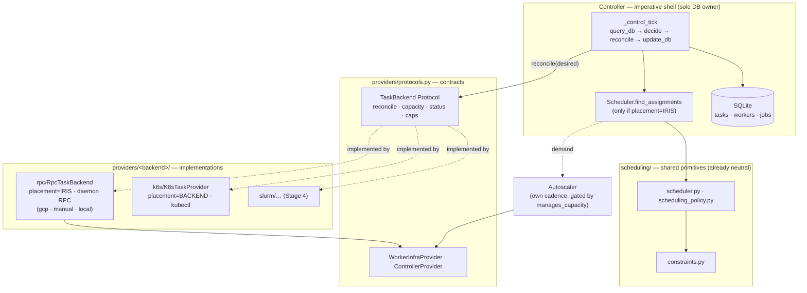

# Iris TaskProvider / Backend Contract — Stage 1

Tracking: [marin#6178](https://github.com/marin-community/marin/issues/6178) ·
weaver issue #21

## Problem & goal

Iris supports two execution models today — Iris-scheduled (GCP/TPU, manual,
local) and backend-scheduled (Kubernetes/CoreWeave) — but it has **no named
boundary** for what a "backend" is. The split is encoded as
`isinstance(self._provider, K8sTaskProvider)` in four places in
`controller.py` plus a `not isinstance(...)` gate in `main.py`, with the
controller's provider typed as the union `TaskProvider | K8sTaskProvider` (a
protocol OR-ed with a concrete class). The word "provider" already means three
unrelated things (see [Current state](#current-state)). Adding a third backend
(Slurm) by extending the `isinstance` ladder is not viable.

**Stage 1 goal.** Define one clear backend contract and refactor the existing
two implementations behind it, so the controller drives every backend through a
single, DB-free interface shaped like the loop the issue author asked for:

```python
# controller.py — the target driving tick
def reconcile(self):
    task_state  = self._read_control_state(cur)   # query_db   (only the controller touches the DB)
    task_update = self._backend.reconcile(task_state)  # backend does backend-specific I/O, no DB
    self._apply(cur, task_update)                  # update_db
```

**Done when, after Stage 1:**

1. The controller talks to a single `TaskBackend` protocol (naming discussed
   [below](#naming)) via a clear, non-DB interface. No `isinstance` on backend
   type anywhere in `controller.py` / `main.py`.
2. The two existing implementations (`K8sTaskProvider`, the GCP/manual/local RPC
   fan-out) both satisfy that protocol and live under `providers/`.
3. Backend-neutral scheduling primitives (`scheduler.py`, `scheduling_policy.py`,
   `constraints.py`) sit in their own clearly-labelled layer, importable by any
   backend.
4. The dashboard renders from a backend **capability descriptor**, not a
   hard-coded "k8s vs gcp" boolean.
5. No behavioral change: GCP/TPU, CoreWeave, manual, and local clusters behave
   exactly as before. Existing fakes + tests are the safety net.

**Stage 1 is explicitly NOT:** adding Slurm, supporting more than one backend at
once, or collapsing the autoscaler's slow provisioning I/O into the reconcile
tick. Those are Stages 2–5 (sketched at the [end](#beyond-stage-1)).

This document is the design for review. Implementation lands as one chonky PR
after sign-off (see [Rollout](#q2-rollout--chonky-prs)).

---

## Current state

### "Provider" means three different things

| Name | File | Role | Implementers |
|------|------|------|--------------|
| `TaskProvider` (Protocol) | `controller/provider.py:20` | RPC fan-out to **worker daemons**: `get_process_status`, `profile_task`, `on_worker_failed`, `close`. **Incomplete** — the controller also calls `dispatch_reconcile_plans` and `ping_workers`, which are *not* on the protocol. | `WorkerProvider` (`controller/worker_provider.py:105`) |
| `K8sTaskProvider` (concrete class) | `providers/k8s/tasks.py:1229` | Direct pod control. Exposes `sync(batch) -> result`, `profile_task`, `exec_in_container`, `get_cluster_status`, `close`. Does **not** implement `TaskProvider`. | itself |
| `ControllerProvider` + `WorkerInfraProvider` (Protocols) | `providers/protocols.py:23,96` | **Infra lifecycle** — controller VM start/stop/tunnel, slice/VM CRUD for the Autoscaler. Orthogonal to task execution. | `providers/gcp/`, `providers/k8s/`, `providers/manual/` |

So `self._provider: TaskProvider | K8sTaskProvider` unions a protocol with a
concrete class, and the controller `isinstance`-branches to pick an execution
model.

### Two execution models, branched by `isinstance`

| | Iris-scheduled (GCP / manual / local) | Backend-scheduled (K8s / CoreWeave) |
|---|---|---|
| Loops | `_run_scheduling_loop` + `_run_polling_loop` + `_run_ping_loop` (+ prune, +autoscaler) | `_run_direct_provider_loop` only |
| Placement | Iris `Scheduler.find_assignments` matches task→worker | Kueue / k8s scheduler places pods |
| Dispatch | `provider.dispatch_reconcile_plans(plans, addrs)` — RPC to worker daemons | `provider.sync(batch)` — `kubectl apply` |
| Capacity | Iris `Autoscaler` provisions slices via `WorkerInfraProvider` | cluster autoscaler provisions nodes (k8s-native) |
| Liveness | `provider.ping_workers` heartbeat (5s) | pod-phase polling inside `sync` |
| Status feedback | reconcile RPC results | pod poll → `DirectProviderSyncResult` |

The `isinstance` sites (to be removed in Stage 1):
`controller.py:345` (log-client injection), `controller.py:530` (which loops to
spawn), `controller.py:800` (assert in `_sync_direct_provider`),
`controller.py:1512` (`has_direct_provider` property), `main.py:188` (autoscaler
gate).

### The loop the user wants already exists — for K8s only

`controller.py:797 _sync_direct_provider` is already
`query_db → provider.sync → update_db`:

```python
batch  = drain_for_direct_provider(cur, cache=..., max_promotions=...)  # query_db
result = provider.sync(batch)                                           # provider.reconcile
apply_direct_provider_updates(cur, result.updates, ...)                # update_db
```

Stage 1 generalizes this shape to **both** backends. The GCP path already has
the same bones — `_reconcile_tick` does
`snapshot → build_reconcile_plans (pure) → provider.dispatch_reconcile_plans →
apply_reconcile` — it just splits "build plans" out as a controller-side pure
step and fans out per-worker. The unification is to express both as one
`reconcile(desired_state) -> observed_updates` call.

### What's already backend-neutral (good news)

From the subsystem audit: `scheduler.py` (`Scheduler.find_assignments`,
`scheduler.py:616`), `scheduling_policy.py` (`compute_demand_entries`), and
`constraints.py` (`Constraint`, `ConstraintIndex`, `WellKnownAttribute`,
`PlacementRequirements`) are **already pure and backend-agnostic** — they
operate on `WorkerSnapshot` / `JobRequirements` / abstract attributes with zero
GCP types. The autoscaler's `planning.py` and `routing.py` are pure too; only
`runtime.py` / `scaling_group.py` / `operations.py` touch `WorkerInfraProvider`
and parse `.gcp`/`.coreweave` config fields. So "shared scheduling primitives"
mostly already exist — Stage 1 *names and relocates* them rather than rewriting.

---

## The core abstraction

> **A backend is a reconciler over task execution.** Given the desired set of
> task attempts (optionally already placed on workers) and the observed running
> set, it converges the real world toward the desired state using
> backend-specific I/O, and reports back the observed task-state transitions,
> scheduling events, and capacity. **It never touches the controller DB.**

This is the existing *functional core / imperative shell* design (see
`.agents/projects/2026-05-31_iris_reconcile_control_flow.md`) extended to the
backend boundary:

- **Controller = imperative shell + the only DB owner.** It reads desired/observed
  state, runs Iris-side scheduling decisions (for backends that need them),
  commits everything.
- **Backend = the I/O actuator for one cluster.** Pure-ish: data in (desired
  attempts), side effects out (apply pods / fan out RPCs), data back (observed
  updates). No SQLite, no controller internals.

### Proposed protocol

Lives in `providers/protocols.py` next to the infra protocols (the natural home
for backend contracts); neutral data types live in a leaf module so the
dependency flows `providers → cluster` and `controller → {providers, cluster}`,
with **no `providers → controller` import** (today `providers/k8s/tasks.py`
imports `DirectProviderSyncResult` from `controller/direct_provider.py` — Stage 1
fixes that inversion).

```python
# providers/protocols.py  (alongside ControllerProvider, WorkerInfraProvider)

class Placement(StrEnum):
    IRIS = "iris"        # Iris Scheduler picks the worker; reconcile gets worker-bound attempts
    BACKEND = "backend"  # the backend places tasks (Kueue, slurmctld); reconcile gets unplaced attempts

class TaskBackend(Protocol):
    """Drives task execution + capacity for a single cluster backend.

    The controller owns all DB access. Each tick it hands the backend a
    read-only desired/observed snapshot and applies the returned updates.
    Backends perform backend-specific I/O (RPC fan-out, kubectl apply,
    sbatch) but never read or write the controller database.
    """

    # --- capabilities (replace the isinstance ladder) ---
    name: str                  # "gcp", "coreweave", "manual", "local", later "slurm-stanford"
    placement: Placement       # who schedules: Iris or the backend
    manages_capacity: bool     # True => backend provisions nodes itself (k8s); False => Iris Autoscaler does

    # --- the per-tick reconcile (the user's provider.reconcile(task_state)) ---
    def reconcile(self, desired: BackendReconcileInput) -> BackendReconcileResult: ...

    # --- capacity rollup for the scheduler + dashboard ---
    def capacity(self) -> ClusterCapacity | None: ...

    # --- on-demand request/response (NOT loop-driven; see Async ops) ---
    def get_process_status(self, worker_id, address, request): ...
    def profile_task(self, target, request, timeout_ms): ...
    def exec_in_container(self, target, request): ...   # ProviderUnsupportedError where N/A
    def on_worker_failed(self, worker_id, address) -> None: ...

    def close(self) -> None: ...
```

### Neutral data types (the DB-free interface)

Moved out of `controller/direct_provider.py` into a leaf module (proposed
`cluster/backend_types.py`), generalizing the K8s-only names:

```python
@dataclass(frozen=True)
class DesiredAttempt:
    """One task attempt the backend should ensure is running.

    worker_id is set iff the backend's placement == IRIS (the Scheduler already
    chose). For placement == BACKEND it is None and the backend places the task.
    """
    request: job_pb2.RunTaskRequest
    worker_id: WorkerId | None
    coscheduled: bool

@dataclass(frozen=True)
class BackendReconcileInput:          # generalizes DirectProviderBatch + per-worker plans
    desired: list[DesiredAttempt]     # attempts that should be running this tick
    running: list[RunningTaskEntry]   # attempts the DB believes are already running (for diff/poll)
    worker_addresses: dict[WorkerId, str | None]   # for the RPC fan-out backend only

@dataclass(frozen=True)
class BackendReconcileResult:         # == today's DirectProviderSyncResult, renamed
    updates: list[TaskUpdate]         # observed task-state transitions -> controller commits these
    scheduling_events: list[SchedulingEvent]
    capacity: ClusterCapacity | None

# ClusterCapacity, SchedulingEvent move here verbatim from direct_provider.py.
# TaskUpdate (today in controller/reconcile/snapshot.py) is referenced by the
# result; either move it here or re-export to avoid providers -> controller.
```

The asymmetry between the two execution models reduces to **one field**:
`DesiredAttempt.worker_id` is filled for `placement == IRIS` (scheduler ran
first) and `None` for `placement == BACKEND` (backend places). Same reconcile
contract; the backend reads only the parts it needs.

---

## The unified driving loop

The controller keeps a small number of cadenced threads, but every one routes
through the contract — no `isinstance`. The core tick:

```python
# controller.py
def _control_tick(self, cur: Tx) -> None:
    # 1. query_db: read everything the decision + reconcile needs
    state = read_control_state(cur)            # pending/assigned/running tasks, workers, capacity

    # 2. Iris-side placement, only for backends that need it (was: isinstance else-branch)
    if self._backend.placement is Placement.IRIS:
        assignments = self._scheduler.find_assignments(state.scheduling_context)
        commit_assignments(cur, assignments)   # update_db (placement decisions)

    # 3. build the DB-free desired snapshot (worker-bound iff IRIS-placed)
    desired = build_desired_input(cur, cache=self._run_template_cache)

    # 4. provider.reconcile(task_state): the only backend I/O on this path
    result = self._backend.reconcile(desired)

    # 5. update_db: commit observed transitions + scheduling events + capacity
    apply_backend_result(cur, result, health=self._health, endpoints=self._endpoints)
```

- **GCP/manual/local** (`placement=IRIS`): step 2 runs the `Scheduler`; the RPC
  backend's `reconcile` builds per-worker reconcile plans from the worker-bound
  `desired` and fans out `Reconcile` RPCs with hard timeouts, returning observed
  updates. (`build_reconcile_plans`, today controller-side, moves *into* the RPC
  backend — it is the RPC backend's "how do I converge" logic.)
- **K8s/CoreWeave** (`placement=BACKEND`): step 2 is skipped; `reconcile` is
  today's `sync` — apply pods for unplaced `desired`, delete strays, poll phases.

Liveness (`ping_workers`) and the on-demand status methods stay as separate
backend methods (see [async ops](#q3-async-operations)); whether a cadenced ping
thread runs is driven by a capability, not `isinstance` — backends with worker
daemons opt in, pod-polled backends fold liveness into `reconcile`.

The fast-wake events (`_scheduling_wake`, `_polling_wake`) and adaptive backoff
are preserved; this is a refactor of *what each loop calls*, not of the cadence
model.

---

## Module & provider refactor

Goal: backend implementations under `providers/<backend>/`, shared primitives in
a named layer, neutral contract types in a leaf module. Dependency direction
within `iris.cluster`: `providers → {scheduling, backend_types, types}` and
`controller → {providers, scheduling, backend_types}`. No reverse edges.

| Today | Stage 1 target | Why |
|------|----------------|-----|
| `controller/provider.py` (`TaskProvider` protocol) | **deleted**; folded into `TaskBackend` in `providers/protocols.py` | one contract, not an incomplete one |
| `controller/worker_provider.py` (`WorkerProvider` = RPC fan-out) | `providers/rpc/backend.py` as `RpcTaskBackend` | it's the daemon-RPC backend shared by gcp/manual/local — belongs under `providers/`, not `controller/` |
| `controller/direct_provider.py` types (`DirectProviderBatch/SyncResult`, `ClusterCapacity`, `SchedulingEvent`) | `cluster/backend_types.py` (renamed per [above](#neutral-data-types-the-db-free-interface)) | neutral contract types; breaks the `providers→controller` import |
| `controller/direct_provider.py` drain + `RunTaskRequest` building (`drain_for_direct_provider`, `build_run_request`, template cache) | stays controller-side (it's DB reads) → `controller/dispatch.py`; `RunTaskRequest` *construction* is shared by both backends, keep it neutral | drain is `query_db`; request-building is shared |
| `providers/k8s/tasks.py` `K8sTaskProvider.sync` | rename `sync`→`reconcile`, adapt to `BackendReconcileInput/Result`, declare `placement=BACKEND, manages_capacity=True` | implement the protocol |
| GCP RPC backend `dispatch_reconcile_plans` / `ping_workers` (on `WorkerProvider`) | become `RpcTaskBackend.reconcile` (+ internal `build_reconcile_plans`) / `ping_workers`; declare `placement=IRIS, manages_capacity=False` | implement the protocol |
| `controller/scheduler.py`, `controller/scheduling_policy.py` | `controller/scheduling/` package (or `cluster/scheduling/`) — the shared "scheduling primitives" layer | name the neutral layer the issue calls for |
| `cluster/constraints.py` | stays (already at the right level); re-exported from the scheduling layer | already neutral |
| autoscaler (`controller/autoscaler/*`) | unchanged in Stage 1; gated by `backend.manages_capacity` instead of `isinstance` in `main.py` | autoscaler refactor is Stage 2 |

`providers/factory.py` already returns `workers=None` for CoreWeave — extend it
(or a sibling) to also construct the `TaskBackend`, so `main.py` gets a backend
+ optional infra bundle and drops its `isinstance` gate.

Misplaced code noted for cleanup (low priority, fold in opportunistically):
`providers/gcp/local.py` is generic but lives under `gcp/`; daemon/port helpers
in `providers/types.py` are RPC-path-specific.

---

## Answers to the four questions

### Q1: UI / dashboard

Today the dashboard is binary: `dashboard.py:585` sets
`provider_kind = "kubernetes" if has_direct_provider else "worker"`; `App.vue`
swaps whole tab sets (`WORKER_TABS` = Jobs/Scheduler/**Fleet**/Endpoints/**Autoscaler**/…
vs `KUBERNETES_TABS` = Jobs/Scheduler/**Cluster**/Endpoints/…). The GCP-only view
is `GetAutoscalerStatus` (slices, scale groups — `vm.proto` `SliceInfo`,
`ScaleGroupStatus`); the K8s-only view is `GetKubernetesClusterStatus` (node
pools, pods).

**Approach: replace the boolean with a capability descriptor; keep the dashboard
a thin UI over RPC (per `lib/iris/AGENTS.md`).** The controller already knows the
backend's capabilities (`name`, `placement`, `manages_capacity`); expose them
plus the list of backend-specific panels the backend supports, and let the
frontend render tabs from that list instead of a k8s/worker `if`.

- Neutral, always-present tabs (already backend-agnostic): **Jobs, Tasks,
  Scheduler, Endpoints, Account, Status, Logs.** These read jobs/tasks/workers —
  unchanged.
- Backend-specific panels become *optional, capability-gated*: `GetAutoscalerStatus`
  (the Fleet/Autoscaler/slice view) renders only when the backend advertises it;
  `GetKubernetesClusterStatus` (node pools/pods) likewise. A future Slurm backend
  advertises e.g. a `partitions` panel without touching the frontend's core
  routing.
- `has_direct_provider` (`controller.py:1512`, consumed at `dashboard.py:585`,
  `service.py:1731/1781/1819`) is replaced by `backend.placement` /
  `backend.manages_capacity` / the panel list. The RPC `get_*_status` methods stay
  but key off capabilities, not `isinstance`.

Stage 1 scope: introduce the descriptor + make tab selection data-driven; keep
the two existing status RPCs as-is behind capability gates. A genuinely unified
"capacity/topology" view (a generic scaling-unit model spanning slices ↔ node
pools ↔ partitions) is deferred — not needed until backend #3.

The proto/`rpc.ts` messages are already provider-shaped but coexist fine; no
proto churn required in Stage 1 beyond adding the capability fields to the
`/auth/config` (or a small `GetBackendInfo`) response the frontend already reads.

### Q2: Rollout — chonky PRs

**Decided: Stage 1 ships as a single PR** so the new model is validated end-to-end
together (rather than landing a half-migrated contract). Commits T1–T7 are the
spiral *within* that one PR; each commit builds and passes tests, but they are not
split across PRs. Later stages (2–5) are their own chonky PRs.

Within Stage 1, commit in a spiral so the branch builds and tests pass at every
commit (the order the existing fakes make safe):

1. **Add, don't change** — introduce `TaskBackend` protocol + `cluster/backend_types.py`
   (move the neutral types, leave shims/aliases). No behavior change; everything
   still compiles against the new names.
2. **K8s implements it** — `K8sTaskProvider.sync`→`reconcile`, capability attrs.
   K8s path now goes through the protocol. Run k8s fakes/tests.
3. **GCP/RPC implements it** — `WorkerProvider`→`RpcTaskBackend` under
   `providers/rpc/`, fold `build_reconcile_plans` in, capability attrs.
4. **Collapse `isinstance`** — `controller.py` + `main.py` switch to the unified
   `_control_tick` + capability gates. Delete `controller/provider.py`.
5. **Relocate scheduling primitives** — move `scheduler.py`/`scheduling_policy.py`
   into the `scheduling/` layer; pure import churn.
6. **Dashboard descriptor** — capability-driven tabs; delete `has_direct_provider`.

The reconcile refactor already proved this functional-core boundary is testable
in isolation; Stage 1 leans on `providers/gcp/fake.py`, `providers/k8s/fake.py`,
and the existing controller tests as the regression net. Land Stages 2–5 as
their own chonky PRs afterward.

Rationale for bundling dashboard into Stage 1 rather than a fast-follow: leaving
`has_direct_provider` half-migrated (contract unified server-side but UI still
`isinstance`-shaped) is a worse intermediate state than one slightly larger PR.

### Q3: Async operations

These are the operations that don't fit a synchronous `reconcile`, and what
happens to each:

| Operation | Today | Stage 1 | Principle |
|-----------|-------|---------|-----------|
| **Status query** (`get_process_status`) | sync RPC handler → provider (`service.py:1298`) | unchanged: on-demand `TaskBackend` method invoked from the RPC handler | request/response, **not** loop-driven — stays off the reconcile path |
| **Profile / exec** | sync RPC handler → provider/kubectl | unchanged: on-demand `TaskBackend` methods | same |
| **Liveness ping** | `_run_ping_loop` (5s) → `provider.ping_workers` | stays a cadenced method, but gated by a *capability* (daemon backends opt in); pod-polled backends fold liveness into `reconcile` | per-backend liveness model |
| **Scheduling** | `_run_scheduling_loop` (adaptive backoff thread) | a synchronous *phase* of the driving tick, gated by `placement == IRIS` | **decisions are fast + DB-committed in the loop** |
| **Autoscaling** | `_run_autoscaler_loop` on its own interval; slow GCP `createInstance` off the hot path | **stays on its own cadence** in Stage 1, gated by `manages_capacity` not `isinstance`; contract-ify in Stage 2 | **slow infra I/O must NOT block the reconcile tick** |

The governing principle the user's loop must respect: **the reconcile tick makes
decisions synchronously and commits them; fast backend I/O (kubectl apply, worker
RPC with hard `ThreadPoolExecutor` timeouts) runs in-tick; slow infra I/O (VM
provisioning, 10–60 s) is fire-and-forget and its effects are observed on a later
tick** (eventual consistency — exactly how "create a slice now, see its worker
register later" already works). That is *why* the autoscaler cannot naively fold
into a 1 s tick. The convergence path (Stage 2): split the autoscaler's pure
`evaluate()`/`planning.py`/`routing.py` (fast — can run in the tick) from
`operations.py`/`scaling_group.py` (slow I/O — runs on a background executor the
backend owns). Then `backend.manage_capacity(demand)` is called from the loop,
computes the plan synchronously, and enqueues provisioning asynchronously. Stage
1 only *names* this as the backend's capacity responsibility; it does not move the
thread.

### Q4: Documentation

| Doc | Change |
|-----|--------|
| `lib/iris/AGENTS.md` | **Source Layout** (new `providers/rpc/`, `cluster/backend_types.py`, `scheduling/` layer; deleted `controller/provider.py`); **Architecture Notes** (replace "two execution models" framing with the `TaskBackend` contract + `placement`/`manages_capacity` capabilities) |
| `lib/iris/docs/coreweave.md` | reframe `runtime=kubernetes` / "direct provider" language as "the CoreWeave backend (`placement=BACKEND`)" |
| `lib/iris/README.md` | overview/provider section, if it enumerates providers |
| `lib/iris/OPS.md` | any provider-type-specific operational commands / dashboard tab references |
| **New** `.agents/projects/2026-06-06_iris_task_backend_contract.md` | durable archived design record (this plan, distilled), per the `2026*_iris_*.md` convention — the repo's canonical home for implemented design docs |
| `docs/task-states.md` | review only — the task state machine is unchanged by Stage 1 |
| dashboard docs / comments | tab model is now capability-driven |

---

## Architecture



---

## Tasks

Stage-1 implementation work, to be executed after this plan is approved. Each is
a commit in the spiral from [Rollout](#q2-rollout--chonky-prs); together they are
one chonky PR. (`weaver plan sync` can materialize these as issues once approved.)

### T1 — Define the contract + neutral types  `exec: session`  `value: high`  `deps: —`

Add `TaskBackend` Protocol + `Placement` enum to `providers/protocols.py`; create
`cluster/backend_types.py` with `BackendReconcileInput`, `BackendReconcileResult`,
`DesiredAttempt` and the moved `ClusterCapacity` / `SchedulingEvent`; resolve the
`TaskUpdate` location so `providers` no longer imports `controller`. Pure
addition — repo compiles, no behavior change.

### T2 — K8s backend implements the contract  `exec: session`  `value: high`  `deps: T1`

`K8sTaskProvider.sync` → `reconcile(BackendReconcileInput) -> BackendReconcileResult`;
add `name`/`placement=BACKEND`/`manages_capacity=True`. K8s fakes + tests green.

### T3 — RPC backend implements the contract  `exec: session`  `value: high`  `deps: T1`

Move `controller/worker_provider.py` → `providers/rpc/backend.py` as
`RpcTaskBackend`; fold `build_reconcile_plans` in; implement `reconcile`,
`ping_workers`, status methods; `placement=IRIS`, `manages_capacity=False`.
gcp/manual/local fakes + tests green.

### T4 — Unify the controller loop, delete `isinstance`  `exec: session`  `value: high`  `deps: T2, T3`

Replace the two loop-sets with the capability-gated `_control_tick`; remove all
four `controller.py` `isinstance` sites + the `main.py` gate; delete
`controller/provider.py`. Wire the backend through `providers/factory.py`.

### T5 — Name the shared scheduling layer  `exec: session`  `value: medium`  `deps: T4`

Move `scheduler.py` / `scheduling_policy.py` into a `scheduling/` package;
re-export `constraints`. Import churn only.

### T6 — Capability-driven dashboard  `exec: session`  `value: medium`  `deps: T4`

Expose the backend descriptor (caps + panel list) via `/auth/config` or
`GetBackendInfo`; make `App.vue` tab selection data-driven; delete
`has_direct_provider`. `npm run build:check` green.

### T7 — Documentation  `exec: session`  `value: medium`  `deps: T4, T6`

Update `AGENTS.md`, `coreweave.md`, `README.md`, `OPS.md`; write the archived
design doc under `.agents/projects/`.

---

## Beyond Stage 1

Sketch only, for context (each = one chonky PR):

- **Stage 2 — autoscaler behind the contract.** Split pure
  `evaluate`/`planning`/`routing` from slow `operations`/`scaling_group`; expose
  `manage_capacity(demand)` driven from the loop, provisioning async. Decouple
  `ScalingGroup` from `.gcp`/`.coreweave` template parsing.
- **Stage 3 — single-backend loop fully unified.** One driving loop, capacity
  rollup from `backend.capacity()`, no parallel loop-sets.
- **Stage 4 — Slurm backend.** `placement=BACKEND`, `manages_capacity=True`;
  `sbatch`/`squeue`/`sacct`; reuse the contract. Open question carried from the
  issue: worker daemon inside the allocation (reuse `RpcTaskBackend`) vs direct
  sbatch launch (closer to k8s).
- **Stage 5 — multi-backend.** `Controller` accepts `list[TaskBackend]`;
  meta-scheduler routes pending tasks to backends by constraint/selector;
  capacity + reconcile fan out per backend in parallel.

---

## Resolved decisions

- <a id="naming"></a>**Naming: `TaskBackend`** for the new contract (confirmed).
  "Provider" stays for the infra protocols (`ControllerProvider`,
  `WorkerInfraProvider`); the bare `TaskProvider` name is retired.
- **PR size: one PR for all of Stage 1** (T1–T7), validated end-to-end; commits
  are the spiral within it.

## Open questions (carried into implementation, decide as we hit them)

- **Where the neutral types live** — `cluster/backend_types.py` (proposed) vs
  reusing `cluster/types.py`; and whether to move `TaskUpdate` out of
  `controller/reconcile/snapshot.py` or re-export it to avoid `providers→controller`.
  *Leaning:* new `cluster/backend_types.py`; re-export `TaskUpdate` to avoid a wide move.
- **Liveness for `placement=IRIS`** — keep the dedicated ping thread (preserves the
  5 s heartbeat cadence + fast failure detection) vs. fold the heartbeat into
  `reconcile`'s return. *Leaning:* keep the ping thread, gated by capability — least
  behavioral risk for Stage 1.
- **Dashboard descriptor transport** — extend `/auth/config` (already fetched on
  load) vs. a dedicated `GetBackendInfo` RPC. *Leaning:* extend `/auth/config`.
