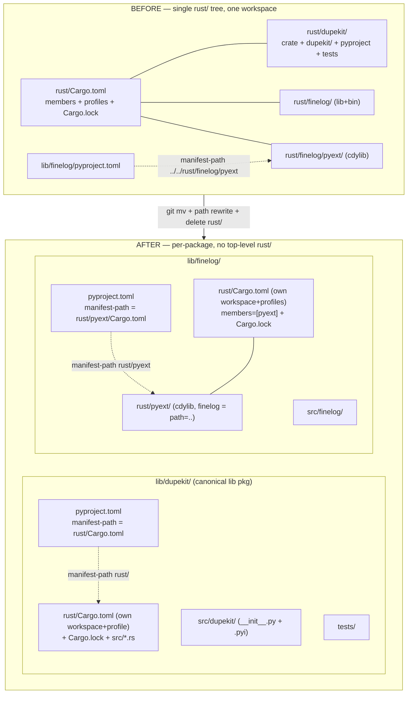

# Remove rust/ namespace; build Rust per-package under lib/{project}/rust

Tracks [issue #6206](https://github.com/marin-community/marin/issues/6206).

## Problem & goal

Today native code is siloed under a single top-level `rust/` tree with one shared
Cargo workspace, while the Python halves live elsewhere. This forced the awkward
**up-references** #6204 introduced: `lib/finelog/pyproject.toml` reaches *up and
across* to `../../rust/finelog/pyext/Cargo.toml` to build its wheel. Reasoning
across a project means hopping between two trees.

**Goal:** every native crate lives next to the package that owns it, at
`lib/{project}/rust/`, each as its **own Cargo workspace**. Delete the top-level
`rust/` tree entirely. `dupekit` gets promoted from its bespoke single-dir maturin
project into a canonical `lib/dupekit/` package. After this change, no path
crosses out of a `lib/{project}/` subtree to find its own Rust source.

**Done looks like:**
- `rust/` no longer exists; `lib/dupekit/rust/` and `lib/finelog/rust/` do.
- `lib/dupekit/` is a canonical lib package (`src/dupekit/`, `tests/`, `rust/`).
- Both wheels still build via maturin; `finelog-server` binary + Docker image
  still build; `scripts/rust_mode.py dev|user` still toggles source vs. wheel.
- All CI workflows, dependabot, Dockerfiles, and the Iris runtime entrypoint
  reference the new paths. `cargo`/`pytest`/`maturin`/`docker`/pre-commit green.

## Current state (post-#6204, verified on branch)

#6204 is **merged** (2026-06-06) and this branch is rebased onto it, so the
"native finelog wheel" arrangement is live. Three different layouts coexist today:

| Package | Rust crate(s) | Python pkg | Wheel build | uv member? |
|---|---|---|---|---|
| `dupekit` | `rust/dupekit/` (`_native` cdylib, **crate+pyproject in one dir**) | `rust/dupekit/dupekit/` (`python-source = "."`) | maturin, same-dir manifest | no — PyPI dep `marin-dupekit` |
| `finelog` | `rust/finelog/` (lib + `finelog-server` bin) **and** `rust/finelog/pyext/` (`finelog-native` cdylib) | `lib/finelog/src/finelog/` (`python-source = "src"`) | maturin, **cross-tree** `manifest-path = ../../rust/finelog/pyext/Cargo.toml` | no — native wheel dep `marin-finelog` |

`rust/Cargo.toml` is one shared workspace: `members = ["dupekit", "finelog", "finelog/pyext"]`,
holding the shared `[profile.release]` (thin LTO) and `[profile.fast]` (deploy)
profiles and a single `rust/Cargo.lock`. The two crates already pin **different
arrow majors** (dupekit `57.1`, finelog `58`), so splitting the workspace loses
nothing they share.

### Complete inventory of hard-coded `rust/` references

Found by grepping the whole tree (excluding `target/`, `.venv/`, lockfiles). The
issue's research comment listed most of these; **the Iris runtime entrypoint was
missed** and is the only non-mechanical edit.

**Plumbing / build (must change):**
- `pyproject.toml` (root) `:179` — ruff per-file ignore `rust/dupekit/tests/test_bloom.py`.
  (Workspace `members` are *explicitly enumerated*, not a glob — confirmed — so
  moving dupekit into `lib/` will **not** auto-enlist it as a uv member.)
- `scripts/rust_mode.py` `:33` — `DEV_SOURCES` editable path `rust/dupekit`; `:29`, `:73` comments.
- `lib/finelog/pyproject.toml` `:41` — `manifest-path = "../../rust/finelog/pyext/Cargo.toml"`; `:37` comment.
- `lib/finelog/build_package.py` `:8,12,169` — comments only (`REPO_ROOT = parent.parent`
  and `cwd=FINELOG_DIR` stay correct; it relies on pyproject's manifest-path).
- `rust/dupekit/build_package.py` `:48-49` — `REPO_ROOT = parent.parent` (stays correct after
  move to `lib/dupekit/`), `MANIFEST_PATH = DUPEKIT_DIR / "Cargo.toml"` (must become `…/ "rust" / "Cargo.toml"`); docstring `:27-29`.
- `rust/dupekit/pyproject.toml` — needs `manifest-path = "rust/Cargo.toml"`, `python-source = "src"`,
  and `[tool.uv] cache-keys` rewritten (`Cargo.toml`→`rust/Cargo.toml`, `src/**/*.rs`→`rust/src/**/*.rs`, `dupekit/*.pyi`→`src/dupekit/*.pyi`).
- `rust/Cargo.toml` + `rust/Cargo.lock` — deleted; profiles relocate into each per-package workspace root.
- `lib/iris/src/iris/cluster/runtime/entrypoint.py` `:87-94` — **the missed one.** Detects
  rust-dev via `grep 'path = "rust/'` and builds `for crate in rust/*/pyproject.toml`.
  Both predicates go false under the new layout. Needs a rework (see T5).

**CI / automation:**
- `.github/workflows/dupekit-unit.yaml` `:27,70,74,87,89,91` — path filter, cache glob, `cd rust/dupekit`, three `--manifest-path rust/dupekit/Cargo.toml`.
- `.github/workflows/dupekit-release-wheels.yaml` `:26,60,105,128,165` — path filter, `git log` path, three `python rust/dupekit/build_package.py`.
- `.github/workflows/finelog-release-wheels.yaml` `:10,31,65` — comment, redundant `rust/finelog/**` filter, `git log` path (rust now under `lib/finelog/`).
- `.github/dependabot.yml` `:15` — uv ecosystem directory `/rust/dupekit`.
- `.github/workflows/README.md` `:10` — doc table.

**Docker:**
- `docker/marin/Dockerfile.vllm` `:91` (`COPY rust/`), `:99` (`uv pip install -e rust/dupekit`).
- `lib/finelog/deploy/Dockerfile` `:52-53` (`WORKDIR /build/rust` + `COPY rust/ ./`), comments `:3,16,30-33,39,105`.
- `lib/finelog/deploy/Dockerfile.dockerignore` `:15-24` (`!rust/Cargo.toml`, `!rust/Cargo.lock`, `!rust/finelog/`, `!rust/dupekit/`, `rust/**/target/`).

**Docs / comments (low-risk):**
- `docs/dev-guide/releasing.md` `:26` — package table.
- `tests/processing/classification/deduplication/test_fuzzy.py` `:335` — code comment.

**Intentionally NOT changed:** `.agents/projects/*.md` (historical design records —
`2026-06-05_finelog_python_deletion.md`, `iris_pypi_mirror/*`). Leaving them as a
point-in-time record per AGENTS.md.

## Architecture

## Design decisions

1. **Per-project Cargo workspaces** (the issue's explicit choice). Each
   `lib/{proj}/rust/Cargo.toml` declares its own `[workspace]`:
   - dupekit: `[workspace]` (the crate is the lone member) + a copied
     `[profile.release]` (thin-LTO) so wheel build characteristics match today.
   - finelog: `[workspace]` with `members = ["pyext"]` + the copied
     `[profile.release]` **and** `[profile.fast]` (the deploy Dockerfile passes
     `--build-arg CARGO_PROFILE=fast`). `pyext`'s `finelog = { path = ".." }`
     stays valid (now a sibling, not cross-tree).
   - Regenerate a fresh `Cargo.lock` per workspace (`cargo generate-lockfile`).
   - Trade-off accepted: no shared `target/` for cold builds, no single lock.
     Neither crate depends on the other and they pin different arrow majors, so
     there is no real loss; isolation + per-package locks are a net positive.

2. **dupekit stays a non-uv-member native wheel dep** (`marin-dupekit`), mirroring
   `marin-finelog`, swapped to an editable `path = "lib/dupekit"` source by
   `rust_mode.py dev`. This keeps the change a pure relocation + path-rewrite and
   preserves the published-wheel model. *(This is the one genuine open question —
   see below. The user said adding `lib/dupekit` "into the workspace" is
   acceptable; I read that as "into the `lib/` tree", not necessarily a uv member.)*

3. **finelog wheel mechanism unchanged** — still maturin via pyproject
   `manifest-path`, only the path shortens from cross-tree `../../rust/finelog/pyext`
   to in-package `rust/pyext`.

4. **Iris entrypoint detection generalized** — replace the `rust/`-specific grep
   and glob with: detect rust-dev via the `editable = true` marker, then build
   *every maturin package under `lib/`*
   (`for crate in lib/*/pyproject.toml; do grep -q 'build-backend = "maturin"' … && uv pip install -e …`).
   Self-maintaining, and it incidentally **fixes a latent gap**: the old
   `rust/*/pyproject.toml` glob only ever matched dupekit, so finelog's native
   ext was never source-built in rust-dev mode on Iris.

5. **Sequencing:** #6204 is merged and this branch is rebased onto it, so there is
   **no blocker**. The post-#6204 diff is a mechanical rename + path-rewrite.

## Tasks

Ordered steps of a **single mechanical PR** (`exec: inline`). They are listed
separately for review/verification granularity, not to be split into sessions.

### T1 — Relocate & promote dupekit to `lib/dupekit/`  `exec: inline`  `value: high`  `deps: —`

`git mv` the crate and restructure into canonical lib layout:
- `rust/dupekit/{Cargo.toml,src}` → `lib/dupekit/rust/{Cargo.toml,src}`; add a
  self-rooting `[workspace]` + copied `[profile.release]`.
- `rust/dupekit/dupekit/__init__.py{,.pyi}` → `lib/dupekit/src/dupekit/`.
- `rust/dupekit/tests/` → `lib/dupekit/tests/`; `README.md` → `lib/dupekit/README.md` (fix bench paths).
- `rust/dupekit/build_package.py` → `lib/dupekit/build_package.py`; set
  `MANIFEST_PATH = DUPEKIT_DIR / "rust" / "Cargo.toml"`, fix docstring (`REPO_ROOT` unchanged).
- `rust/dupekit/pyproject.toml` → `lib/dupekit/pyproject.toml`; add
  `manifest-path = "rust/Cargo.toml"`, `python-source = "src"`, rewrite `[tool.uv] cache-keys`.
- Regenerate `lib/dupekit/uv.lock` (`cd lib/dupekit && uv lock`) and `lib/dupekit/rust/Cargo.lock`.

**Accept:** `cd lib/dupekit && uv run --frozen --group test pytest tests/ -q` passes;
`cargo test --manifest-path lib/dupekit/rust/Cargo.toml` passes;
`python lib/dupekit/build_package.py --mode manual --build sdist` produces a wheel/sdist.

### T2 — Relocate finelog Rust into `lib/finelog/rust/`  `exec: inline`  `value: high`  `deps: —`

- `rust/finelog/{Cargo.toml,build.rs,proto,src}` → `lib/finelog/rust/…`.
- `rust/finelog/pyext/` → `lib/finelog/rust/pyext/` (`finelog = { path = ".." }` unchanged).
- `lib/finelog/rust/Cargo.toml`: add `[workspace] members = ["pyext"]` + copied
  `[profile.release]` and `[profile.fast]` (relocated from `rust/Cargo.toml`).
- `lib/finelog/pyproject.toml:41` → `manifest-path = "rust/pyext/Cargo.toml"`; fix `:37` comment.
- `lib/finelog/build_package.py`: comment-only path fixes.
- Regenerate `lib/finelog/rust/Cargo.lock`.

**Accept:** `cargo build --manifest-path lib/finelog/rust/Cargo.toml -p finelog --bin finelog-server`
and `cargo test --manifest-path lib/finelog/rust/Cargo.toml` pass;
`python lib/finelog/build_package.py --mode manual --build sdist` builds the native wheel.

### T3 — Delete top-level `rust/`  `exec: inline`  `value: high`  `deps: T1, T2`

Remove `rust/Cargo.toml`, `rust/Cargo.lock`, and the emptied `rust/` tree. Grep
confirms no remaining live references outside `.agents/projects/`.

### T4 — Root pyproject + rust_mode.py  `exec: inline`  `value: high`  `deps: T1`

- `pyproject.toml:179` ruff ignore → `lib/dupekit/tests/test_bloom.py`.
- `scripts/rust_mode.py` `DEV_SOURCES` → `marin-dupekit = { path = "lib/dupekit", editable = true }`;
  fix `:29`, `:73` comments. (finelog's `path = "lib/finelog"` already correct.)

**Accept:** `python scripts/rust_mode.py dev && uv sync && python scripts/rust_mode.py user`
round-trips; dev mode builds both native exts.

### T5 — Iris runtime entrypoint  `exec: inline`  `value: high`  `deps: T1`

Rework `entrypoint.py:87-94`: detect rust-dev via `grep -q 'editable = true'` and
build every maturin package under `lib/`
(`for crate in lib/*/pyproject.toml; do grep -q 'build-backend = "maturin"' "$crate" && uv pip install -e "$(dirname "$crate")"; done`).
Update the surrounding comment.

**Accept:** the generated setup script builds `lib/dupekit` **and** `lib/finelog`
in dev mode and is a no-op in user mode (existing entrypoint test still passes; add
one if coverage is missing).

### T6 — CI workflows + dependabot  `exec: inline`  `value: med`  `deps: T1, T2`

- `dupekit-unit.yaml`: path filter→`lib/dupekit/**`, cache glob→`lib/dupekit/uv.lock`,
  `cd lib/dupekit`, `--manifest-path lib/dupekit/rust/Cargo.toml` (×3).
- `dupekit-release-wheels.yaml`: path filter, `git log` path, `python lib/dupekit/build_package.py` (×3).
- `finelog-release-wheels.yaml`: drop redundant `rust/finelog/**` filter + `git log` term; fix `:10` comment.
- `dependabot.yml:15` → `/lib/dupekit`.
- `.github/workflows/README.md:10` → `lib/dupekit`.

**Accept:** `actionlint` clean (or manual YAML review); path filters reference real dirs.

### T7 — Docker  `exec: inline`  `value: med`  `deps: T1, T2`

- `Dockerfile.vllm`: drop `COPY rust/`; `-e rust/dupekit` → `-e lib/dupekit`.
- `lib/finelog/deploy/Dockerfile`: `COPY lib/finelog/rust/ ./` into the rustbuild
  stage; fix comments. `cargo build -p finelog --bin finelog-server` unchanged.
- `Dockerfile.dockerignore`: re-include `!lib/finelog/rust/` (drop the dupekit
  re-include — finelog's workspace no longer needs it), exclude `lib/finelog/rust/**/target/`.

**Accept:** `docker build -f lib/finelog/deploy/Dockerfile -t finelog:planverify .`
succeeds (both `release` and `--build-arg CARGO_PROFILE=fast`); vllm image build smoke.

### T8 — Docs & comments  `exec: inline`  `value: low`  `deps: T1`

`docs/dev-guide/releasing.md:26` table; `test_fuzzy.py:335` comment.

### T9 — Full verification & lint  `exec: inline`  `value: high`  `deps: T1-T8`

`./infra/pre-commit.py --all-files --fix`; `uv run pyrefly`; the per-crate cargo
fmt/clippy/test for both workspaces; confirm `grep -rn 'rust/' --include=…` returns
only `.agents/projects/` history.

## Open questions (for reviewer)

1. **Make `lib/dupekit` a real uv workspace member?** Recommended **no** — keep it a
   pre-built `marin-dupekit` wheel dep like `marin-finelog`, so this stays a pure
   relocation. Making it a member (`marin-dupekit = { workspace = true }`) would
   drop the `>= 0.1.0.dev0` PyPI pin and the `prerelease = "allow"` workaround, but
   changes the dependency/publish model and diverges from finelog. Easy to do as a
   follow-up if desired.
2. **Per-package workspaces vs. one root `Cargo.toml` referencing `lib/*/rust`?**
   Plan assumes per-package (matches "build Rust per-package"). A root workspace
   would keep one `Cargo.lock` + shared `target/` (faster cold CI builds) at the
   cost of re-introducing a top-level Rust file — counter to the issue's intent.
3. **OK to fix the latent Iris rust-dev finelog-build gap** as part of T5 (the old
   glob never built finelog), or keep behavior byte-for-byte and only repath?
