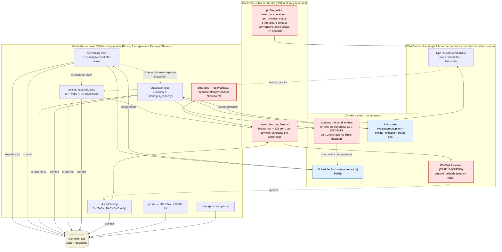
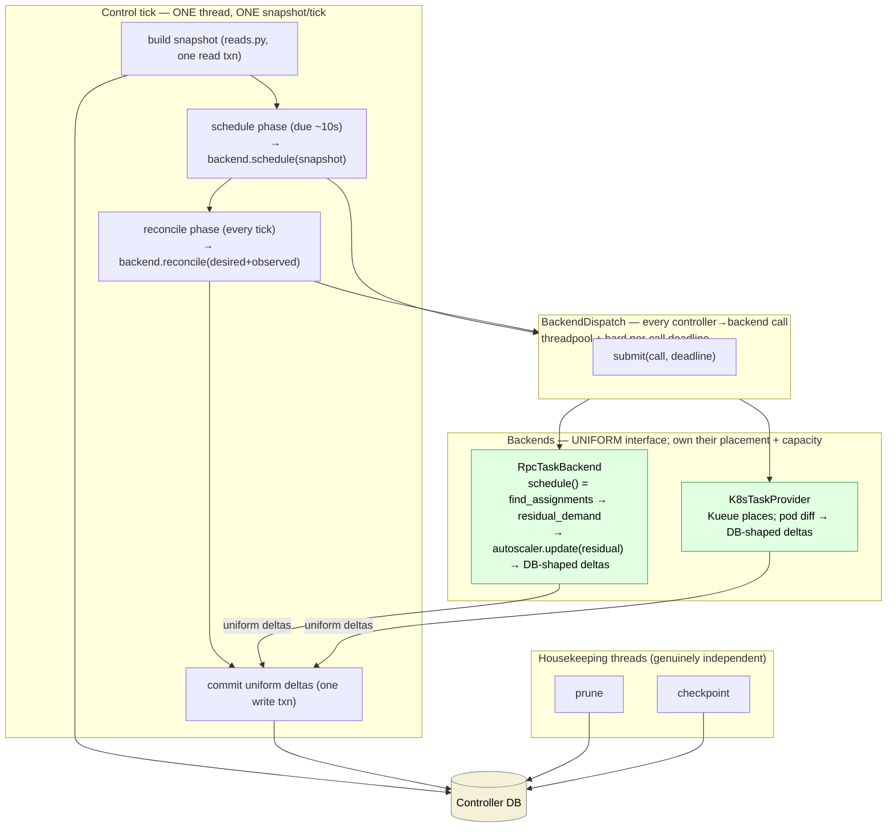

# Tighten Iris control boundaries (multi-backend readiness)

> Revised after maintainer review. The chosen direction is sharper than the first
> draft: **push placement/capacity logic into the backend** behind one uniform
> interface (don't have the controller dispatch capabilities), **fold the autoscaler
> and ping loops into a single control tick**, and **bound every call the controller
> *dispatches into* a backend** (not the inbound service handlers). `cluster=` is a
> **hard** constraint. The single-tick model is the target.

## Problem & goal

The recent `TaskBackend` work pulled most backend specifics behind a contract, but
the control plane is still **loose** in five concrete ways:

1. The controller drives **seven independent `ManagedThread` loops**, each opening its
   *own* DB snapshot on its *own* cadence and committing on its *own* schedule.
   Coordination is only a single write `RLock` plus best-effort wake events — so the
   scheduler, autoscaler and reconciler routinely act on **skewed snapshots** of the
   same state.
2. **Demand is computed twice.** The autoscaler does not consume the scheduler's
   output; it re-derives demand by running the scheduler a *second* time as a dry-run
   (`compute_demand_entries` → `scheduler.find_assignments`) against the shared mutable
   `self._scheduler` on a *separate* snapshot. No synchronization boundary exists between
   scheduler and autoscaler — they are two readers of the DB that happen to agree most of
   the time.
3. The controller **dispatches on backend type/capability**. It branches on `placement`
   (`controller.py:761/1092`) and `manages_capacity` (`1234`) to pick between a dispatch
   loop and a reconcile loop, and `K8sTaskProvider` stubs six contract methods
   (`tasks.py:1255-1269,1395,1404`). The controller "knows" how each backend works.
4. The reconcile **result shape is backend-specific**: `BackendReconcileResult` carries
   *both* `updates` (K8s) and `worker_results` (RPC); the controller picks the field by
   `placement` and runs different apply paths.
5. **Calls the controller dispatches into a backend are not uniformly bounded.** Reconcile
   and ping fan out with a 10 s per-worker timeout and 128-way semaphore (good), but
   `RpcTaskBackend.reconcile` runs `asyncio.run(...)` on the *caller* thread, so a slow
   batch stalls whatever loop called it; and `exec_in_container` permits an RPC deadline
   of **up to one hour** (`backend.py:232-237`). There is no single place that guarantees
   "any call into a backend completes within a bound."

**Long-term goal:** a *multi-backend* Iris — e.g. a GCP TPU cluster and a Slurm GPU
cluster live simultaneously, jobs dispatched by a **hard `cluster=<name>` constraint**.
That future needs the controller to be a pure state/serialization layer that calls **one
uniform interface** on every backend and persists whatever DB-shaped deltas come back —
never branching on which backend it is talking to.

**What "done" looks like for this plan:** this document — a verified map of the current
control flow, a target control flow, and five targeted improvements with concrete code
shapes and a feasibility analysis with a recommended landing sequence. Implementation is
tracked as the task breakdown below.

### What is already good (don't regress it)

- `Scheduler.find_assignments(context) -> SchedulingResult` is a **pure function**, zero
  runtime imports of controller state (`scheduling/scheduler.py`).
- Both backends are **DB-clean**: neither `RpcTaskBackend` nor `K8sTaskProvider` imports
  `db`/`reads`/`writes`/`schema`/`sqlalchemy`. The `RpcTaskBackend` *already owns* its
  `Scheduler` (`backend.py:141`) and `Autoscaler` (`backend.py:136`) — Improvement 3 just
  finishes the job of making the controller stop orchestrating them.
- Capability dispatch is **flag-based, never `isinstance`** today — but the goal is to
  delete the flags entirely (Improvement 3).
- The reconcile *kernel* (`reconcile/overlay|task|job|worker|effects`) is a **pure state
  machine**; `loader → snapshot → kernel → commit` is a clean load→pure→write pipeline,
  and `writes.validate()` enforces projection-table ownership.
- Reconcile already fans out to **every active healthy worker**
  (`reads.list_active_healthy_workers`, `controller.py:1017`); idle workers get an
  empty-rows heartbeat reconcile — which is *why* the separate ping loop is now vestigial
  (Improvement 1).

### Static dependency-graph findings (the coupling smells)

Package-level import graph over `cluster/controller`, `cluster/backends`, `rpc`
(edge = "imports", verified against code):

- `controller.backend → {autoscaler, scheduling, reconcile, ops}` — the *contract* module
  pulls in the scheduler and autoscaler, so "the backend abstraction" and "the
  Iris-specific scheduling/capacity implementation" are tangled. Improvement 3 moves that
  logic fully *inside* `RpcTaskBackend` so the contract carries only the uniform interface.
- `backends.rpc → {controller.scheduling, controller.autoscaler, controller.reconcile}`
  — backends reach *up* into controller modules; confirmed types/pure-logic only. After
  Improvement 3 these become the backend's *own* internals, not shared contract surface.
- `controller.scheduling → {db, reads, projections, budget}` — all in `policy.py` (the DB
  context-builder), not `scheduler.py`. Improvement 4 routes the remaining raw queries
  through `reads.py` so the controller's snapshot build is the single DB fan-out point.
- `controller.autoscaler → {db, schema, worker_health}` — startup `restore_from_db` +
  per-cycle re-derivation; the latter is deleted by Improvement 2.

## Architecture — current control flow



## Architecture — target control flow



Net thread count: **7 → 3** (one control tick + prune + checkpoint). The controller never
branches on backend type; it builds a snapshot, calls the same interface on every backend,
and persists whatever uniform deltas come back through one apply path.

## The five targeted improvements

### I1 — One phased control tick; delete the autoscaler, ping, and dispatch threads

**Problem.** Five fast loops each open an independent snapshot and commit independently
(`_run_scheduling`, `_reconcile_tick`, `_sync_dispatch`, `_run_ping_loop`,
`_run_autoscaler_once`). The ping loop is vestigial — reconcile already reaches every
active healthy worker (verified above). The dispatch loop is just "reconcile for
TASK_BACKEND placement." The autoscaler loop re-snapshots state the scheduler just read.

**Change.** One driver thread, one snapshot per tick, fixed phase order:

```
control_tick(now):
    snap = build_control_snapshot(db)          # ONE read txn via reads.py (I4)
    deltas = Deltas()
    if schedule_phase.due(now):                 # autoscaler folded in here (I2/I3)
        deltas += backend.schedule(snap)        # backend owns placement + capacity
    deltas += backend.reconcile(snap, deltas)   # bounded dispatch (I5); reaches all workers
    deltas += derive_liveness(deltas)           # over-threshold terminations off reconcile errors
    with db.transaction() as tx:                # ONE write txn
        commit(tx, deltas)                      # one uniform apply path (I3/I4)
```

Per-phase `due(now)` predicates (one `RateLimiter` each) preserve cadences (schedule/
autoscale ~10 s, reconcile every tick ~5 s) **without** a separate snapshot per phase.
Wake events just shorten the next tick deadline.

- **Drop the ping loop.** Reconcile contacts every active worker; fold ping's only unique
  job — terminating workers past the failure threshold — onto reconcile-RPC errors
  (`ReconcileResult.error` already exists; bump `WorkerHealthTracker`, terminate
  over-threshold in the same tick). No idle-worker liveness gap.
- **Drop the dispatch loop.** Unify it into the single reconcile phase (I3 makes the
  reconcile input uniform across placements).
- **Drop the autoscaler loop.** Folded into the schedule phase (I2).
- **Keep** prune + checkpoint as separate slow housekeeping threads.

**Serves:** poll over loose threading (#3); one snapshot fans out to DB-free abstractions
(#1); strong scheduler↔autoscaler sync (#6).

**Risk:** highest blast radius. Land it *after* I2/I3/I4 so each phase is already a clean
`(snapshot) -> deltas` call; the tick is then an ordering shell. Backend I/O must be
bounded (I5) so a slow backend never stalls the tick. Ship behind a flag; bake on
`marin-dev`. **Never bounce the live controller without explicit OK** (AGENTS.md).

### I2 — Scheduler emits residual demand; autoscaler runs off it (one phase, no dry-run, no thread)

**Problem.** `compute_demand_entries` (`policy.py:181`) runs a **full dry-run**
`scheduler.find_assignments` (`policy.py:283`) on a *second* snapshot, limits disabled,
against the shared mutable `self._scheduler` — *unlocked* (`controller.py:1240-1245`). So
placement runs twice per cycle through two paths on two snapshots.

**Change.** The real scheduling pass emits residual demand as a first-class output, and
the autoscaler consumes it **in the same phase** — no separate loop, no dry-run:

```python
@dataclass(frozen=True)
class ScheduleResult:
    assignments: list[Assignment] = field(default_factory=list)
    preemptions: list[TerminalDecision] = field(default_factory=list)
    unschedulable: list[PendingTask] = field(default_factory=list)
    residual_demand: list[DemandEntry] = field(default_factory=list)   # NEW: single demand source
    autoscaler_state: AutoscalerState | None = None                    # NEW: capacity delta, same call
    diagnostics: dict[str, str] = field(default_factory=dict)
    post_taint_context: SchedulingContext | None = None
```

`find_assignments` already walks the per-worker capacity model; it computes
`residual_demand` from the same traversal (capacity-fit, ignoring per-cycle *promotion*
caps, matching today's `_UNLIMITED` dry-run). Inside `RpcTaskBackend.schedule` (I3) the
flow becomes `find_assignments → residual_demand → autoscaler.refresh/probe/update(residual)
→ persistable_state()`, returned as one delta set. `compute_demand_entries` and the
autoscaler thread are **deleted**.

**Serves:** one demand artifact across a typed boundary (#6); one way to compute demand
(#5); removes a snapshot and the unlocked shared-scheduler access (#1).

**Risk:** medium — must reproduce the dry-run's reservation-taint / holder-task demand in
the real pass. Guard with a golden-fixture parity test before deleting the dry-run.

### I3 — One uniform backend interface; push placement/capacity into the backend; controller dispatches only on returned deltas

**Problem.** The controller orchestrates backend specifics — it branches on `placement`
and `manages_capacity`, calls `schedule`/`manage_capacity`/`reconcile`/`ping_workers` in a
type-specific sequence, and reads a type-specific result field (`updates` vs
`worker_results`). K8s stubs six methods.

**Change.** Make the contract a single uniform interface that **every** backend
implements, push all placement/capacity logic *inside* the backend, and have the
controller persist whatever DB-shaped deltas come back — dispatching on the **delta type**,
never the backend type:

```python
class TaskBackend(Protocol):
    name: str
    # Decide: place tasks + manage capacity for this cluster, over a DB-less snapshot.
    # RpcTaskBackend runs the Iris scheduler + autoscaler internally; K8s lets Kueue place.
    def schedule(self, snap: ControlSnapshot) -> BackendDeltas: ...
    # Operate: drive the cluster toward desired state, observe actual state.
    def reconcile(self, snap: ControlSnapshot, scheduled: BackendDeltas) -> BackendDeltas: ...
    def set_log_sink(self, ...) -> None: ...
    def close(self) -> None: ...

@dataclass(frozen=True)
class BackendDeltas:
    """Everything the controller writes back to the DB this tick — a tagged union of
    row-level changes the controller applies through one writes.py path. The controller
    does not interpret backend internals: assignments, task-state observations, slice /
    scaling-group state, endpoint changes. Empty fields = 'this backend has nothing here'
    (e.g. K8s emits no autoscaler_state)."""
    assignments: list[Assignment] = field(default_factory=list)
    observations: list[ReconcileObservation] = field(default_factory=list)
    preemptions: list[TerminalDecision] = field(default_factory=list)
    autoscaler_state: AutoscalerState | None = None
    ...
```

- The controller stops importing/owning `Scheduler`/`Autoscaler`; they become
  `RpcTaskBackend` internals (it already holds both — `backend.py:136,141`).
- `placement` / `manages_capacity` flags and every branch on them are **deleted**. K8s
  simply returns empty `assignments`/`autoscaler_state` from `schedule` because Kueue
  places and the cluster autoscaler provisions — a real "nothing to add," not a stub/raise.
- `BackendReconcileResult`'s two fields collapse into the one `observations` shape. The
  small amount of uid-resolution that needs the snapshot is done by a **shared pure
  resolver** the controller runs on `deltas.observations` before writing — so the backend
  stays DB-less and the apply path is uniform (K8s observations pass through; RPC
  observations resolve identically).
- This is the multi-backend keystone: a `BackendRegistry` holds N backends; the controller
  iterates them, calling the same `schedule`/`reconcile`, routed by the hard
  `cluster=<name>` constraint (which backend a task is eligible for); deltas merge into one
  commit.

**Serves:** controller = state, backend = operation (#2); one interface, one result shape,
one apply path (#5); the direct enabler of multi-backend.

**Risk:** largest churn (contract type + both backends + ~6 call sites), low conceptual
risk. Sequence: define `BackendDeltas` + uniform `ControlSnapshot` input → move
scheduler/autoscaler ownership into `RpcTaskBackend.schedule` → unify reconcile input/
result → migrate controller call sites to the uniform calls → delete the flags.

**Design decision (flag in open questions):** does the backend return *raw* observations
(controller resolves — recommended, keeps resolution centralized near the DB) or
*pre-resolved* deltas (backend resolves against the in-memory snapshot)? Recommend raw +
shared resolver.

### I4 — `reads.py` is the single DB fan-out point feeding the uniform snapshot

**Problem.** The reconcile-input snapshot (`_snapshot_reconcile_inputs`, raw
`task_attempts ⋈ tasks` join, `controller.py:1038-1059`) bypasses `reads.py`, the intended
DB chokepoint. Same class of violation in `policy.py`, `budget.py`, `checkpoint.py`. With
I3, the controller's snapshot build becomes *the* place central DB queries fan out to the
DB-free backends — so it must go through one chokepoint.

**Change.** Build one typed `ControlSnapshot` per tick via `reads.py` helpers (reuse
`reconcile/loader.load_closed_snapshot` where it fits), hand it to `backend.schedule` /
`backend.reconcile`. Move the reconcile-input join and the other raw selects behind
`reads.py` so `reads.py`/`writes.py`/projections are the **only** modules issuing schema
queries.

**Serves:** central DB queries fan out to DB-free abstractions from a single chokepoint
(#1); supports the controller-as-serialization-layer goal.

**Risk:** medium; independent of the others and individually shippable. Pairs naturally
with I3 (the `ControlSnapshot` type is the backends' uniform input).

### I5 — Bound every call the controller *dispatches into* a backend

**Problem.** This is about the controller's **outbound** calls into backends, not inbound
service handlers. Today reconcile/ping fan-out is per-call bounded (10 s/worker, 128-way
semaphore) but `RpcTaskBackend.reconcile` runs `asyncio.run(...)` on the **caller** thread,
so a slow batch blocks the whole tick; and `exec_in_container` allows an RPC deadline of
**up to one hour** (`backend.py:232-237`). No single place guarantees a bound.

**Change.** Route **every** controller→backend call through one `BackendDispatch`: a
bounded `ThreadPoolExecutor` where each submission carries a **hard wall-clock deadline**
(`future.result(timeout=cap)`), so:

1. The **reconcile phase** gets a bounded result regardless of fleet size — workers that
   don't answer by the deadline are surfaced as reconcile errors (which now drive liveness,
   per I1), so a hung worker can never stall the tick.
2. The **on-demand one-offs** (`profile_task` / `exec_in_container` / `get_process_status`)
   go through the same dispatch with one timeout convention and one error path — the 1-hour
   `exec` deadline is replaced by a hard cap (long-running exec/profile get an explicit,
   bounded override, not "unlimited").
3. `schedule`/`autoscale` (now in-process, in the backend) also run under the dispatch so a
   pathological scheduling pass can't wedge the tick.

**Serves:** any call into a backend completes in bounded time, threadpool-dispatched (#4);
one bounded dispatch path for all backend ops (#5).

**Risk:** low–medium. The deadline wrapper + executor is small; the care item is choosing
caps (reconcile-phase cap vs per-worker timeout; explicit long caps for profile/exec).

## Constraint → improvement coverage

| Constraint | Addressed by |
|---|---|
| Central DB queries fan out to DB-free abstractions | I4 (one `reads.py` snapshot), I3 (backend takes snapshot, returns deltas), I2 (single demand artifact) |
| Controller handles state, backends handle operation | I3 (uniform interface, logic pushed into backend, controller persists deltas) |
| Prefer poll workflows vs loose threading | I1 (one control tick; drop autoscaler/ping/dispatch threads) |
| Any controller→backend call completes in bounded time, threadpool-dispatched | I5 (BackendDispatch: pool + hard deadline) |
| Only one way to do something | I3 (one interface + one result shape), I2 (one demand path), I5 (one dispatch path) |
| Strong sync boundary scheduler ↔ autoscaler | I2 (autoscaler consumes scheduler's residual_demand in one phase) + I1 (shared snapshot) |

## Tasks

Each task has a stable id. `exec: session` tasks become weaver issues on
`weaver plan sync … --apply`. Ordered by recommended landing sequence.

### T1 — I5: BackendDispatch — bound every controller→backend call  `exec: session`  `value: high`  `deps: —`
Introduce a bounded `ThreadPoolExecutor` dispatch with a hard per-call deadline; route
reconcile/ping fan-out and the three one-offs through it; replace the 1-hour `exec`
deadline with an explicit bounded cap. Acceptance: a hung worker RPC is surfaced as a
reconcile error within the cap and never blocks the caller; `exec`/`profile` run under an
explicit bounded deadline; no backend call path lacks a timeout.

### T2 — I2: scheduler emits residual demand; autoscaler runs off it  `exec: session`  `value: high`  `deps: —`
Add `residual_demand` (+ `autoscaler_state`) to the schedule output, compute residual in
`find_assignments`, run the autoscaler off it in the schedule path, delete
`compute_demand_entries`' dry-run. Acceptance: golden-fixture parity (same demand in/out)
with the scheduler invoked once per cycle; no dry-run `find_assignments` remains.

### T3 — I4: one reads.py-built ControlSnapshot  `exec: session`  `value: medium`  `deps: —`
Build a typed per-tick snapshot via `reads.py`; move the reconcile-input join and the
policy/budget/checkpoint raw selects behind `reads.py`. Acceptance: no schema query
outside `reads.py`/`writes.py`/projections; backends receive one snapshot type.

### T4 — I3: uniform backend interface + BackendDeltas  `exec: session`  `value: high`  `deps: T2, T3`
Define `BackendDeltas` + the uniform `schedule`/`reconcile(snapshot)` interface; move
`Scheduler`/`Autoscaler` ownership into `RpcTaskBackend`; collapse the two reconcile-result
fields via a shared pure resolver; migrate controller call sites to the uniform calls;
delete `placement`/`manages_capacity` and every branch on them. Acceptance: `grep` finds no
`placement ==`/`manages_capacity` branch in the controller and no stub/`raise`-Unsupported
in any backend; controller commits via one apply path that dispatches on delta type only.

### T5 — I1: collapse the fast loops into one phased control tick  `exec: session`  `value: high`  `deps: T1, T2, T4`
Replace the five fast loops with one driver: snapshot → schedule → reconcile → commit,
per-phase `due()` cadence, one snapshot/tick; fold ping's over-threshold termination onto
reconcile errors; keep prune/checkpoint separate. Acceptance: one control thread; one read
snapshot + one write txn per tick (counter/test); no idle-worker liveness gap; cadences
preserved; chaos/integration suite green; behind a fallback flag.

## Feasibility analysis

**Overall: feasible and incremental.** No data-model change or migration; all refactors
over a sound state layer. The `RpcTaskBackend` already owns the scheduler and autoscaler,
so I3 *relocates ownership* rather than rewriting logic, and I2 mostly deletes a duplicate
path. The aggressive simplification the maintainer asked for (uniform interface, 3 threads)
makes the end state *smaller* than today's.

**Recommended landing sequence** (deps in parentheses):

1. **T1 (I5)** — independent, high value, immediately removes the 1-hour `exec` foot-gun
   and makes backend calls non-blocking. Prereq for a safe single tick.
2. **T2 (I2)** — independent; deletes the duplicate scheduling pass and the unlocked
   shared-scheduler access. Care item: reservation/holder demand parity.
3. **T3 (I4)** — independent; produces the typed `ControlSnapshot` that T4's uniform
   interface consumes.
4. **T4 (I3)** — depends on T2 + T3 (needs the residual-demand output and the snapshot
   type). Largest churn; the multi-backend keystone. Protocol-first, then relocate
   ownership, then delete flags.
5. **T5 (I1)** — last; depends on T1 (bounded dispatch so no phase stalls the tick), T2
   (autoscaler folded in), T4 (uniform calls). The tick is then an ordering shell over
   functions that already exist. Behind a fallback flag, baked on `marin-dev`.

**Risk register:**

- *T5 is the one to fear* — folding cadences into one tick can starve a phase or change
  effective latency. Mitigation: per-phase `due()` predicates; bounded dispatch (T1) so no
  phase blocks; fallback flag; `marin-dev` bake. Never bounce the live controller without
  explicit OK.
- *Dropping ping (T5):* verified reconcile reaches all active workers, but the
  over-threshold *termination* path must move onto reconcile errors in the same change, or
  unhealthy workers linger. Covered in T5's acceptance.
- *Commit ordering (T5):* schedule and reconcile in one tick means assignments may be acted
  on before they're committed. The worker daemon is the source of truth (reconcile observes
  actual state), so a crash between RPC and commit self-heals on the next tick — but confirm
  this is acceptable vs. a commit-after-schedule boundary (open question).
- *T2 correctness:* golden-fixture parity before deleting the dry-run.
- *T4 churn:* wide but mechanical; pyrefly + capability tests catch drift.
- *Cross-region / cost:* none; pure control-plane code.
- *Multi-backend itself is out of scope here* — these five make it tractable; the
  `BackendRegistry` + `cluster=` routing is a follow-on plan once T4 + T5 land.

**Independently shippable now (no deps):** T1, T2, T3. **Sequenced:** T4 (after T2+T3) → T5
(after T1+T2+T4). Estimated ~6 focused sessions; T1–T3 parallelizable.

## Open questions

- **Commit boundary in the tick (I1):** single end-of-tick write txn (schedule + reconcile
  commit together; faster convergence, relies on reconcile self-heal after a crash), or
  commit assignments after the schedule phase then reconcile (preserves persist-before-act
  at the cost of an extra txn)? Recommend single commit + self-heal; confirm.
- **Observation resolution (I3):** backend returns raw observations and the controller
  resolves (recommended), vs. backend returns pre-resolved deltas against the in-memory
  snapshot. Affects where uid-resolution lives.
- **I5 caps:** reconcile-phase wall-clock cap vs per-worker timeout; explicit long caps for
  `profile`/`exec` (what values?).
- **`cluster=` routing (follow-on):** as a hard constraint, where is it resolved — a
  pre-scheduler dispatcher that partitions tasks per backend, or inside each backend's
  eligibility filter? Affects the `BackendRegistry` shape.
