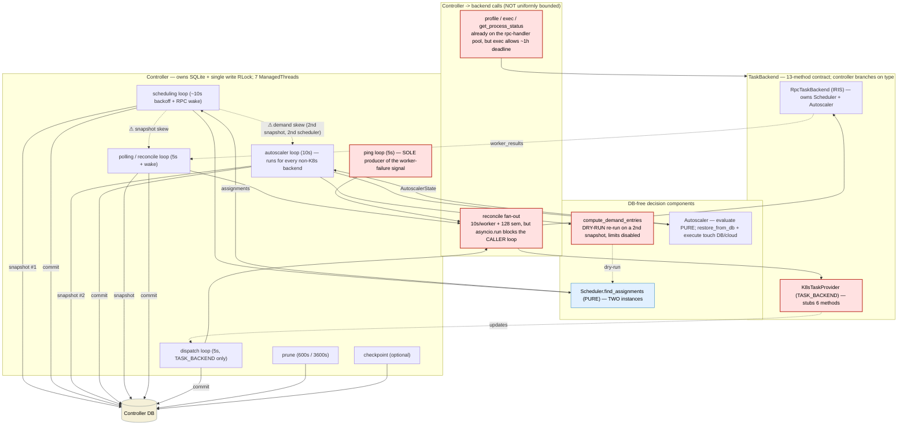
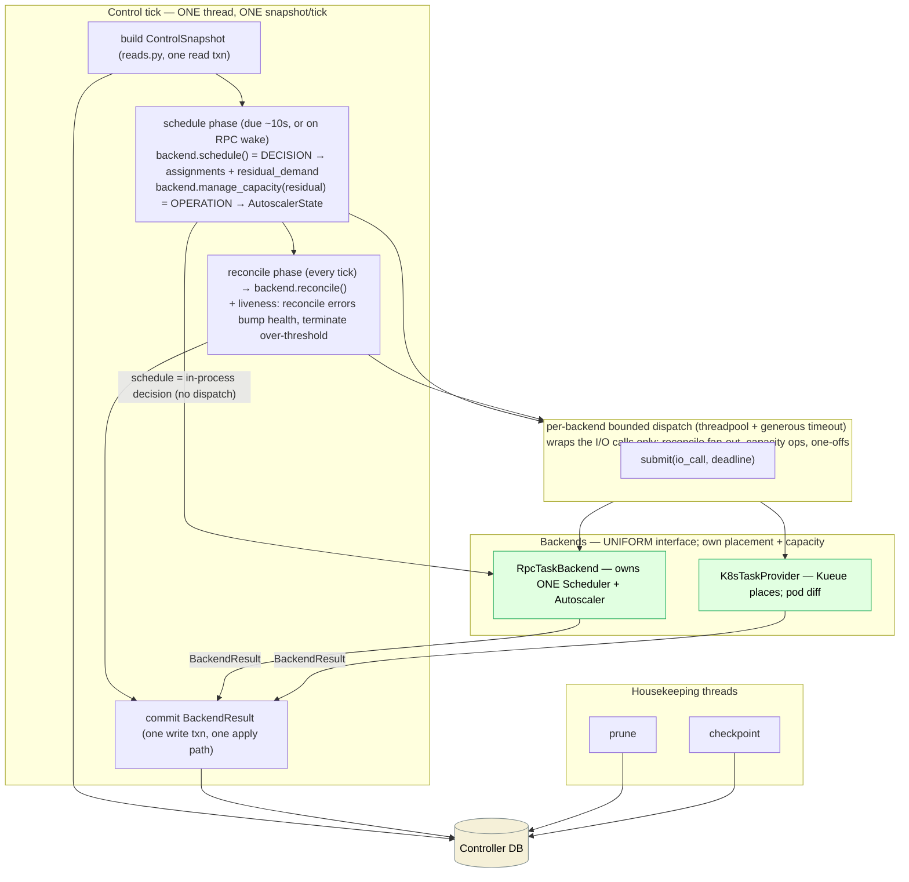

# Tighten Iris control boundaries (multi-backend readiness)

> Revised twice: once for the maintainer's direction (uniform backend interface, single
> control tick, bounded backend dispatch), then again after an **adversarial review** that
> caught four things the earlier draft oversold as "already true / free." Those are now
> scoped as explicit work: (E1) reconcile-error → liveness, (E2) residual demand is a real
> capacity-fit, (E4) the autoscaler is not DB-clean, (B2) the failure→slice-teardown path.
> `cluster=` is a **hard** constraint; the single-tick model is the target.

## Problem & goal

The recent `TaskBackend` work pulled most backend specifics behind a contract, but the
control plane is still **loose**:

1. The controller drives **seven independent `ManagedThread` loops**, each opening its own
   DB snapshot on its own cadence and committing on its own schedule. Coordination is a
   single write `RLock` plus wake events — so scheduler, autoscaler and reconciler act on
   **skewed snapshots**.
2. **Demand is computed twice.** The autoscaler re-derives demand by running the scheduler
   a *second* time as a dry-run (`compute_demand_entries` → `scheduler.find_assignments`,
   `policy.py:283`) on a *separate* snapshot, against a *separate* `Scheduler` instance
   (`controller.py:350`) from the one the backend schedules with (`backend.py:141`).
3. The controller **dispatches on backend type**: it branches on `placement`
   (`controller.py:761/1092`) and `manages_capacity` (`1234`); `K8sTaskProvider` stubs six
   contract methods.
4. The reconcile **result shape is backend-specific** — `BackendReconcileResult` carries
   both `updates` (K8s) and `worker_results` (RPC); the controller picks by `placement`.
5. **Calls the controller dispatches into a backend are not uniformly bounded.**
   `RpcTaskBackend.reconcile` runs `asyncio.run(...)` on the *caller* thread
   (`backend.py:153`), and `exec_in_container` permits an RPC deadline of **up to one hour**
   (`backend.py:232-237`).

**Long-term goal:** a *multi-backend* Iris (e.g. GCP TPU + Slurm GPU clusters), jobs routed
by a **hard `cluster=<name>` constraint**. The controller must be a pure state/serialization
layer that calls **one uniform interface** on every backend and persists the DB-shaped
results — never branching on which backend it is.

**What "done" looks like for this plan:** a verified map of the current control flow, a
target flow, and five improvements with concrete code shapes and an honest feasibility
analysis. Implementation is the task breakdown below.

### What is already good — and the precise caveats (post-review)

- `Scheduler.find_assignments(context) -> SchedulingResult` is a **pure function**
  (`scheduling/scheduler.py`). But it returns only `assignments` and marks a job
  `exhausted` on the first capacity miss without recording *why* — so residual demand does
  **not** fall out of it for free (see I2). And there are **two** `Scheduler` instances —
  the controller's (`controller.py:350`, feeds the building cap at `814` and the dry-run at
  `1242`) and the backend's (`backend.py:141`) — which I2/I3 must reconcile.
- The backend **classes** are DB-clean (no `db`/`reads`/`schema`/`sqlalchemy` imports). The
  `Autoscaler` they own is **not**: `runtime.restore_from_db(db)` (`autoscaler/runtime.py:682`)
  and `autoscaler/recovery.py`/`persistence.py` import `schema` and issue SQL. Its per-cycle
  `evaluate/update` is pure and capacity **persist is already controller-side**
  (`persist_autoscaler_state`, `controller.py:1249`), but **startup-restore touches the DB**.
  I3 must keep restore controller-driven so the backend stays DB-less per-tick.
- Reconcile already **reaches** every active healthy worker
  (`reads.list_active_healthy_workers`, `controller.py:1017`; idle workers get an empty-rows
  heartbeat). But reconcile RPC errors today only `logger.debug` (`controller.py:1109-1111`)
  — they do **not** feed `WorkerHealthTracker`. The failure signal (`consecutive_failures`)
  is produced **only** by the ping loop's `_health.ping(healthy=False)`
  (`controller.py:1156-1160`, `worker_health.py`). So the ping loop is vestigial for
  *reaching* workers but is the **sole producer of the liveness-failure signal** — dropping
  it is real new work (I1 / task T5).
- The reconcile *kernel* (`reconcile/overlay|task|job|worker|effects`) is a **pure state
  machine**; `loader → snapshot → kernel → commit` is clean; `writes.validate()` enforces
  projection-table ownership.

## Architecture — current control flow



## Architecture — target control flow



Net threads: **7 → 3** (control tick + prune + checkpoint). The controller builds a
snapshot, calls one interface, and persists `BackendResult` through one apply path —
dispatching on the **result shape**, never the backend type. `schedule` stays a pure
in-process decision; only the actual **I/O** (reconcile fan-out, capacity cloud ops,
one-offs) goes through the bounded dispatch.

## The five targeted improvements

### I1 — One phased control tick; drop the autoscaler & dispatch loops; **migrate** ping's liveness signal

**Problem.** Five fast loops each re-snapshot and commit independently. The dispatch loop is
just "reconcile for TASK_BACKEND." The autoscaler loop re-snapshots state the scheduler just
read. The ping loop reaches workers reconcile already reaches — **but it is the only thing
that produces the worker-failure signal** (verified: reconcile errors only log,
`controller.py:1109-1111`; `consecutive_failures` is bumped only by `_health.ping`).

**Change.** One driver thread, one snapshot per tick, fixed phase order:

```
control_tick(now):
    snap = build_control_snapshot(db)              # ONE read txn via reads.py (I4)
    result = BackendResult()
    if schedule_phase.due(now) or woken:
        result += backend.schedule(snap)           # pure decision: assignments + residual_demand
        result += backend.manage_capacity(snap, result.residual_demand)   # capacity OPERATION (I5-bounded)
    if reconcile_phase.due(now):
        rec = backend.reconcile(snap, result)      # bounded dispatch (I5); reaches all workers
        result += rec
        result += liveness_from(rec)               # NEW: bump health on RPC errors, terminate over-threshold
    with db.transaction() as tx:                   # ONE write txn, one apply path
        commit(tx, result)
```

- **Migrate ping's liveness signal (new work, task T5).** Translate `ReconcileResult.error`
  → `WorkerHealthTracker` failure bumps → over-threshold termination, plus the
  failure→sibling-slice-teardown path (today `backend.on_workers_failed`,
  `controller.py:1182-1222`) folded into the tick. This is *not* "for free"; it has its own
  test (a worker whose reconcile RPC fails N times is failed and its slice torn down).
- **Drop the dispatch loop** — it is the reconcile phase for TASK_BACKEND placement (uniform
  after I3).
- **Drop the autoscaler loop** — folded into the schedule phase (I2).
- **Scheduling latency:** today RPC handlers wake the scheduler thread directly. In one tick,
  a submit-wake must not be gated on an in-flight reconcile — a wake triggers a
  **schedule-only mini-tick** (reconcile skipped unless due), so worst-case submit→assign =
  schedule time, not (reconcile cap + schedule). State and confirm this bound.
- **Keep** prune + checkpoint as separate housekeeping threads.

**Serves:** poll over loose threading (#3); one snapshot fans out to DB-free abstractions
(#1); strong scheduler↔autoscaler sync (#6).

**Risk:** highest blast radius; land last. Ship behind a fallback flag; bake on `marin-dev`.
Never bounce the live controller without explicit OK (AGENTS.md).

### I2 — One scheduler, one snapshot: co-locate residual demand; autoscaler off it (no dry-run, no thread)

**Problem.** Demand is a **second** `find_assignments` dry-run on a **second** snapshot with
limits disabled (`policy.py:268-285`), against a **second** `Scheduler` instance. The real
pass runs with `max_assignments_per_worker`/`max_building_tasks` caps and marks jobs
exhausted without recording cap-vs-capacity — so the residual genuinely needs a
**limits-free capacity fit**, not a by-product of the capped pass.

**Change.** Keep the capacity-fit computation (it is real), but compute it **once, on the
same snapshot, with a single `Scheduler` instance**, and hand the result to the autoscaler
in-memory in the same phase:

```python
@dataclass(frozen=True)
class ScheduleResult:
    assignments: list[Assignment] = field(default_factory=list)
    preemptions: list[TerminalDecision] = field(default_factory=list)
    unschedulable: list[PendingTask] = field(default_factory=list)
    residual_demand: list[DemandEntry] = field(default_factory=list)   # NEW: limits-free capacity-fit residual
    diagnostics: dict[str, str] = field(default_factory=dict)
    post_taint_context: SchedulingContext | None = None
```

The win is **not** "free demand" — it is: one snapshot (not two), one `Scheduler` (reconcile
`controller.py:350` and `backend.py:141`), demand handed across a typed in-memory boundary,
and the separate autoscaler thread + `compute_demand_entries` plumbing deleted. The residual
is still a deliberate limits-free fit co-located in the schedule path. The **golden-fixture
parity test is load-bearing** (same demand entries in/out, incl. reservation/holder cases),
not just a refactor guard.

**Serves:** one demand artifact across a typed boundary (#6); one way to compute demand (#5);
removes a snapshot + the unlocked dual-scheduler access (#1).

**Risk:** medium-high — reproducing reservation-taint / holder-task demand semantics exactly.

### I3 — One uniform backend interface; controller persists `BackendResult`, never branches on type — but keep decision separate from operation

**Problem.** The controller orchestrates backend specifics (branches on `placement`/
`manages_capacity`; type-specific result fields; K8s stubs).

**Change.** A single uniform interface every backend implements, with the Iris scheduler/
autoscaler living *inside* `RpcTaskBackend`. The controller persists the returned
`BackendResult` through one apply path, dispatching on **result shape**, never backend type:

```python
class TaskBackend(Protocol):
    name: str
    def schedule(self, snap: ControlSnapshot) -> BackendResult: ...        # DECISION (pure): assignments + residual_demand
    def manage_capacity(self, snap, residual_demand) -> BackendResult: ...  # OPERATION: scale up/down, AutoscalerState delta
    def reconcile(self, snap, scheduled: BackendResult) -> BackendResult: ...# OPERATION: drive cluster, observe state
    def on_workers_failed(self, ids) -> BackendResult: ...                   # OPERATION: slice teardown + AutoscalerState
    def set_log_sink(self, ...) -> None: ...
    def close(self) -> None: ...

@dataclass(frozen=True)
class BackendResult:
    """The DB-shaped write-back the controller commits this tick — a tagged union of
    row-level changes applied through one writes.py path: assignments, task-state
    observations, preemptions, capacity (slice / scaling-group) state, endpoint changes.
    Empty fields = 'this backend has nothing here' (K8s emits no AutoscalerState)."""
    assignments: list[Assignment] = field(default_factory=list)
    observations: list[ReconcileObservation] = field(default_factory=list)
    preemptions: list[TerminalDecision] = field(default_factory=list)
    residual_demand: list[DemandEntry] = field(default_factory=list)
    autoscaler_state: AutoscalerState | None = None
    ...
```

**Critical: do NOT fold capacity into `schedule()`.** `autoscaler.update` is an *operation*
with side effects (mutates slice/group state; `execute` calls cloud APIs, `runtime.py:662`).
Keeping `schedule()` a pure decision and `manage_capacity()` a separate (bounded, I5)
operation preserves "controller=state, backend=operation, decision separable from operation"
(#2) — while still running both in the one schedule phase off `residual_demand` (the
maintainer's "autoscaler off the scheduler output, same loop"). Same for `on_workers_failed`
(the failure→teardown operation) — it stays an explicit method, invoked from the liveness
step (I1/T5).

Also in scope (the review caught these as prerequisites, not free):
- **Reconcile the two `Scheduler` instances** → one, owned by the backend; the building cap
  (`controller.py:814`) sources from it.
- **Keep autoscaler startup-restore controller-driven** (`restore_from_db` stays at the
  controller boundary, handing restored state to the backend) so the backend stays DB-less
  per-tick; per-cycle `evaluate/update` is already pure and persist is already controller-side.
- Collapse the two reconcile-result fields into `observations` via a **shared pure resolver**
  the controller runs before writing (RPC observations resolve; K8s pass through).
- Delete `placement`/`manages_capacity` and every branch on them.

**Naming:** the maintainer proposed `BackendResult` (used above). Caveat from review: it
collides with the existing `*Result` swarm (`ScheduleResult`, `CapacityResult`,
`BackendReconcileResult`, `SchedulingResult`, `PingResult`) and reads vaguer than the
write-back delta-set it is; alternatives `BackendDeltas` / `ControlDeltas`. **Open question.**

**Serves:** controller = state, backend = operation (#2); one interface + one result shape +
one apply path (#5); the multi-backend keystone (a `BackendRegistry` over N backends, routed
by the hard `cluster=` constraint).

**Risk:** largest churn; conceptually low *except* the autoscaler DB-decoupling and
dual-scheduler reconciliation, which are genuine sub-projects.

### I4 — `reads.py` is the single DB fan-out point feeding the typed `ControlSnapshot`

**Problem.** `_snapshot_reconcile_inputs`' raw `task_attempts ⋈ tasks` join
(`controller.py:1038-1059`) bypasses `reads.py`; same in `policy.py`, `budget.py`,
`checkpoint.py`. With I3, the controller's snapshot build *is* the central DB fan-out to the
DB-free backends, so it must go through one chokepoint.

**Change.** Build one typed `ControlSnapshot` per tick via `reads.py` (reuse
`reconcile/loader.load_closed_snapshot` where it fits); move the reconcile-input join and the
other raw selects behind `reads.py`. `reads.py`/`writes.py`/projections become the only
modules issuing schema queries.

**Serves:** central DB queries fan out to DB-free abstractions from a single chokepoint (#1).
**Risk:** medium; independent; the `ControlSnapshot` type is the backends' uniform input.

### I5 — Policy: every controller→backend RPC is threadpool-dispatched with a bounded (generous) timeout

**Problem.** Not all controller→backend calls are bounded. `RpcTaskBackend.reconcile` runs
`asyncio.run(...)` on the **caller** thread (`backend.py:153`); `exec_in_container` allows a
**~1-hour** RPC deadline (`backend.py:232-237`).

**Change — keep the policy, drop the ceremony.** The policy is: *every call the controller
dispatches into a backend runs on a threadpool and has a hard, generous timeout.* It is fine
for reconcile to take ~5 s; we are **not** chasing constant-time-regardless-of-fleet and we
do **not** need a single global pool (per-backend pools are fine).

1. **One-offs are already pooled — just bound them.** `profile_task` / `exec_in_container` /
   `get_process_status` already run on the uvicorn `rpc-handler` pool (invoked from
   `service.py`, off the tick thread). They are small one-offs; the only fix is replacing the
   ~1-hour `exec` deadline with an explicit generous cap (e.g. 10–15 min for exec/profile).
   **Do not re-route them through a new pool** — that double-pools an already-pooled call.
2. **Wrap the one inline call.** `RpcTaskBackend.reconcile` is the call that blocks its
   caller; give the backend a small pool and run the fan-out under `future.result(timeout=cap)`.
   The inner per-worker RPCs already have a 10 s timeout + 128-way semaphore, so the outer cap
   is a **fleet-size-aware watchdog** (`cap ≈ per_worker_timeout × ceil(workers/128) + slack`),
   not a fixed 5 s.
3. **Do not wrap in-process decisions.** `schedule`/`manage_capacity`-decision are in-process;
   a watchdog over an uncancellable Python thread is ceremony — bound only the actual I/O.

**Serves:** any backend call completes in bounded time, threadpool-dispatched (#4); no second
way to dispatch (#5).
**Risk:** low. Care item: choosing the reconcile watchdog cap and the exec/profile caps.

## Constraint → improvement coverage

| Constraint | Addressed by |
|---|---|
| Central DB queries fan out to DB-free abstractions | I4 (one `reads.py` snapshot), I3 (backend takes snapshot, returns `BackendResult`), I2 (single demand artifact) |
| Controller handles state, backends handle operation | I3 (uniform interface; **schedule=decision, capacity/reconcile/teardown=operation, kept separable**) |
| Prefer poll workflows vs loose threading | I1 (one control tick; drop autoscaler/ping/dispatch threads) |
| Any controller→backend call is threadpool-dispatched + bounded timeout | I5 (per-backend pool + generous deadline; fix the 1h exec) |
| Only one way to do something | I3 (one interface + one result shape), I2 (one demand path), I5 (one dispatch policy) |
| Strong sync boundary scheduler ↔ autoscaler | I2 (autoscaler consumes the scheduler's `residual_demand`, one scheduler, one snapshot) + I1 |

## Tasks

`exec: session` tasks become weaver issues on `weaver plan sync … --apply`. Ordered by
recommended landing sequence.

### T1 — I5: bound controller→backend RPCs  `exec: session`  `value: high`  `deps: —`
Give the backend a small pool; run `reconcile` fan-out under a fleet-size-aware watchdog
deadline; replace the ~1-hour `exec` deadline with an explicit generous cap. Leave the
already-pooled one-offs in place (just bounded). Acceptance: a hung worker is surfaced as a
reconcile error within the cap without blocking the caller; `exec`/`profile` run under an
explicit bounded deadline; no backend call path lacks a timeout.

### T2 — I2: single scheduler + co-located residual demand  `exec: session`  `value: high`  `deps: —`
Compute residual demand once on the schedule snapshot with one `Scheduler` instance; feed the
autoscaler off it in the schedule path; delete the dry-run + the separate autoscaler thread.
Acceptance: golden-fixture parity (same demand in/out, incl. reservation/holder), one
`Scheduler` instance, one scheduling snapshot per cycle, no `compute_demand_entries` dry-run.

### T3 — I4: one reads.py-built ControlSnapshot  `exec: session`  `value: medium`  `deps: —`
Build a typed per-tick snapshot via `reads.py`; move the reconcile-input join and the
policy/budget/checkpoint raw selects behind `reads.py`. Acceptance: no schema query outside
`reads.py`/`writes.py`/projections.

### T4 — I3: uniform backend interface + BackendResult  `exec: session`  `value: high`  `deps: T2, T3`
Define `BackendResult` + the uniform `schedule`/`manage_capacity`/`reconcile`/
`on_workers_failed(snapshot)` interface, **keeping decision separate from operation**; move
the single `Scheduler` + `Autoscaler` ownership into `RpcTaskBackend` while keeping
autoscaler startup-restore controller-driven (backend stays DB-less per-tick); collapse the
two reconcile-result fields via a shared resolver; migrate call sites; delete
`placement`/`manages_capacity` and every branch. Acceptance: `grep` finds no
`placement ==`/`manages_capacity` branch in the controller and no stub/Unsupported in any
backend; controller commits via one apply path on result shape only; backend imports no
`db`/`reads`/`schema` on the per-tick path.

### T5 — Migrate ping's liveness signal onto reconcile + teardown  `exec: session`  `value: high`  `deps: T1`
Translate `ReconcileResult.error` → `WorkerHealthTracker` failure bumps → over-threshold
termination; fold the failure→sibling-slice-teardown (`on_workers_failed`) into the tick.
Acceptance: a worker whose reconcile RPC fails the threshold count is failed and its slice
torn down — *without* the ping loop; no idle-worker liveness gap. (Prereq for dropping ping
in T6.)

### T6 — I1: collapse the fast loops into one phased control tick  `exec: session`  `value: high`  `deps: T1, T2, T4, T5`
One driver: snapshot → schedule(+capacity off residual) → reconcile(+liveness) → commit;
per-phase `due()`; wake → schedule-only mini-tick; drop autoscaler/ping/dispatch loops; keep
prune/checkpoint. Acceptance: one control thread; one read snapshot + one write txn per tick
(counter/test); submit→assign latency = schedule time (not gated on reconcile); chaos/
integration suite green; behind a fallback flag.

## Feasibility analysis

**Overall: feasible and incremental — but bigger than the first draft implied.** The
adversarial pass converted three "already true" claims into real tasks (T2's parity work,
T4's autoscaler DB-decoupling + dual-scheduler merge, T5's liveness migration). None needs a
data-model change or migration. The end state is still *smaller* than today (3 threads, one
interface, one apply path).

**Recommended landing sequence:**

1. **T1 (I5)** — independent; removes the 1-hour `exec` foot-gun and the inline-blocking
   reconcile. Prereq for a safe single tick and for T5.
2. **T2 (I2)** — independent; deletes the duplicate scheduling pass, the second snapshot, and
   the second `Scheduler`. Care item: demand parity.
3. **T3 (I4)** — independent; produces the `ControlSnapshot` T4 consumes.
4. **T5 (liveness)** — after T1; can land *before* the tick (reconcile errors start driving
   health while the ping loop still exists as belt-and-suspenders), de-risking T6.
5. **T4 (I3)** — after T2 + T3; largest churn (uniform interface, single scheduler/autoscaler
   ownership, autoscaler restore decoupling, flag deletion).
6. **T6 (I1)** — last; after T1, T2, T4, T5. The tick is then an ordering shell over functions
   that already exist. Fallback flag; `marin-dev` bake.

**Risk register:**

- *T6 (single tick)* — phase starvation / latency. Mitigation: per-phase `due()`; wake →
  schedule-only mini-tick (submit→assign not gated on reconcile); bounded reconcile (T1);
  fallback flag. Never bounce the live controller without explicit OK.
- *T5 (drop ping)* — verified the failure signal is ping-only today; the migration must land
  and be tested *before* ping is removed, or unhealthy workers linger. Sequenced before T6.
- *T2 (demand parity)* — limits-free residual must match the old dry-run on reservation/holder
  jobs; golden-fixture test gates the deletion.
- *T4 (autoscaler DB-decoupling)* — `restore_from_db`/`recovery`/`persistence` touch the DB;
  keep restore controller-driven, do not drag it into the backend per-tick path.
- *B1 avoided* — capacity stays a separate operation from the schedule decision (not a
  god-method).
- *Cross-region / cost* — none; pure control-plane code.
- *Multi-backend itself is out of scope* — these five make it tractable; `BackendRegistry` +
  `cluster=` routing is a follow-on once T4 + T6 land.

**Independently shippable now:** T1, T2, T3 (and T5 after T1). **Sequenced:** T4 (after
T2+T3) → T6 (after T1, T2, T4, T5). Estimated ~7 focused sessions.

## Open questions

- **`BackendResult` vs `BackendDeltas`/`ControlDeltas`** — the review flagged a collision with
  the existing `*Result` swarm and that "Result" reads vaguer than the write-back delta-set.
  Maintainer proposed `BackendResult`; confirm or pick `BackendDeltas`.
- **Commit boundary in the tick (I1):** single end-of-tick write (schedule + reconcile commit
  together; relies on reconcile self-heal after a crash) vs commit-after-schedule. Recommend
  single commit + self-heal; confirm.
- **Observation resolution (I3):** backend returns raw observations and the controller
  resolves (recommended), vs backend pre-resolves against the in-memory snapshot.
- **I5 caps:** the reconcile watchdog cap (fleet-size-aware) and the exec/profile caps (values?).
- **`cluster=` routing (follow-on):** hard constraint resolved by a pre-scheduler dispatcher
  that partitions tasks per backend, or inside each backend's eligibility filter?
