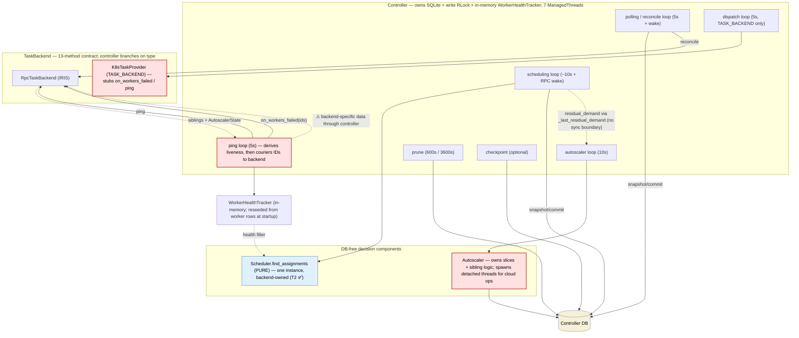
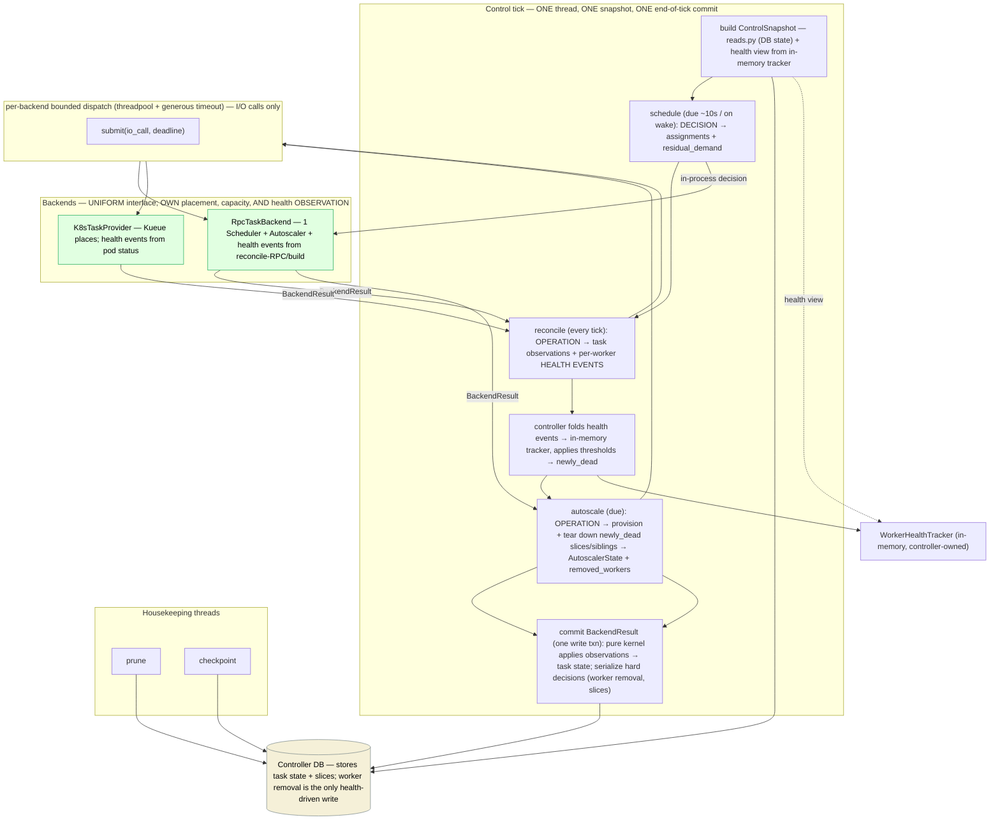

# Tighten Iris control boundaries (multi-backend readiness)

> Revised through several rounds. The settled model: **worker health is observed by the
> backend but owned by the controller.** Each backend tracks health from its own I/O (RPC
> backend: reconcile-RPC + build failures; K8s: pod status) and returns generic per-worker
> **health events** in `BackendResult`; the controller folds them into its **in-memory**
> `WorkerHealthTracker`, applies the thresholds, and serializes **only the hard decision** —
> a worker crossing the threshold and being torn down. Health is **not** persisted (the
> tracker is reseeded from worker rows at startup, as today). That still deletes
> `on_workers_failed` / `on_worker_failed` / `ping_workers`, the ping loop, and the scattered
> in-reconcile tracker mutations — and removes the last place backend-specific data flowed
> through the controller (the dead set is now controller-derived and passed via the uniform
> `autoscale(...)`). Phase order is **schedule → reconcile → autoscale**, committed **once at
> end of tick**. `cluster=` is a **hard** constraint; the single-tick model is the target; the
> `BackendResult` name stays (the `*Result` swarm collapses, so the earlier naming concern is
> moot).

## Status — all tasks landed (2026-06-12)

T1–T6 are merged to `main`, plus two post-merge fixes (#6349, #6352) from the adversarial
review of the T5×T6 composition. The remaining step is operational: restart `marin-dev` onto
the new controller (user decision; see Open questions).

| Task | PR | Outcome |
|---|---|---|
| T1 / I5 | #6291 | **Scope reduced in review** — see I5 below. exec deadline 1 h → 15 min; fan-out bounds documented as named constants. The watchdog pool was rolled back: reconcile/ping fan-outs were *already* bounded (10 s/RPC × 128-way semaphore), and a tripped watchdog would leave a hung pool thread still mutating the shared `Autoscaler` while the next cycle dispatched — two unsynchronized writers. |
| T2 / I2 | #6295 | As specced. One `Scheduler` (backend-owned, `rpc/backend.py:152`); residual demand computed in the scheduling pass (`backend.py:283`) and returned on `ScheduleResult`; autoscaler loop consumes the cached `_last_residual_demand`; dry-run + second snapshot + controller `Scheduler` deleted. Demand-parity tests pin holder/taint/absorption semantics. Validated live on `marin-dev` (fineweb 10BT dedup end-to-end). |
| T3 / I4 | #6294 | As specced. `reads.py` is the DB fan-out point; `ControlSnapshot{worker_addresses, reconcile_rows, timeout_rows, health}` built by `load_control_snapshot` in one read txn (`reads.py:1612`), health tracker attached by the controller. |
| T4 / I3 | #6311 | Uniform `schedule`/`reconcile`/`autoscale`; ping + dispatch loops deleted (7→5 threads); health observed by backend, folded via one `WorkerHealthTracker.apply`; `placement`/`manages_capacity` deleted in favor of a `BackendCapability` descriptor consulted once at construction (+ service-RPC guards). **Design deltas:** results are three *method-specific* types (`ScheduleResult`/`ReconcileResult`/`AutoscaleResult`), each uniform across backends — better than the planned single fat `BackendResult`; `schedule` keeps `ScheduleInput` (genuinely different shape); the dispatch drain stays controller-side (it is a *write*). **Review caught a blocker the 1900-test suite couldn't:** the ping RPC was also the *workers'* keep-alive — reconcile now resets the worker heartbeat deadline. Detection latency is grace-based (`worker_unreachable_grace`=50s ÷ `poll_interval`); placement excludes failing workers while reconcile keeps probing them. **Rollout:** no churn-free deploy order (old workers decode `health` unset → reaped; old controller pings → gone on new workers); controller-first one-time churn recommended on marin-dev, optional one-release shim for prod. |
| T5 / I1 | #6344 | As specced. One `control-loop` thread: snapshot → schedule → reconcile → fold health → autoscale → **single end-of-tick write txn** (`_commit_tick`); per-phase `due()`; wake → schedule-only mini-tick; `run_autoscale → run_schedule` invariant guarantees fresh same-tick residual demand (no cached handoff on the new path); legacy loops retained behind `single_control_tick` (default on). Honest exceptions to one-txn: CLUSTER_VIEW drains in a pre-read txn (documented); dead-worker teardown rides post-commit writes (matches legacy). **Post-merge review found** a stale `build_scheduling_context(db, ...)` call in `lib/iris/scripts/benchmark_controller.py` (pyrefly-uncovered; the same gap as T4's round) — fixed in #6349; structural fix tracked in #6348. |
| T6 | #6343 | **Design delta — simpler than planned:** no operation-handle state machine. The detached threads were never necessary: TPU `create_slice` submits the LRO and returns, the persisted slice row *is* the operation handle, and the existing `BOOTING→READY/FAILED` `describe()` poll in `refresh()` is the polling mechanism. Shipped as plan → bounded parallel issue (`_run_io_batch`, joined in-phase) → serial fold; restart adoption reuses slice adoption unchanged. **Post-merge review refuted the boundedness claim for VM slices:** `vm_create` still blocked in `_wait_zone_operation` (600 s) — composed with T5's single tick this could stall reconcile (now the worker keep-alive) for 10 min on `GCP_SLICE_MODE_VM`. Fixed in #6352 (`wait: bool = False`, synthesized PROVISIONING `VmInfo`, token-refresh lock); tests sharpened to HTTP-boundary assertions in #6355. |

**Verified post-merge state (audit of `main`, 2026-06-10 — after T1–T3, before T4–T6):**

- **Still 7 `ManagedThread` loops** + uvicorn (`controller.py:493-541`): scheduling, polling/
  reconcile, ping, dispatch, prune, autoscaler, checkpoint. T4 deletes ping; T5 collapses
  scheduling/polling/dispatch/autoscaler into the tick.
- **Health is mutated from two loops**: the ping loop (`ping`/`bump_heartbeat`/
  `workers_over_threshold` → `_terminate_workers`, `controller.py:1075-1160`) and the reconcile
  commit path (`heartbeat`/`build_failed`/`mark_unhealthy` via effects, `reconcile/commit.py:236-240`).
  Ping and reconcile are two RPCs probing the same liveness fact — T4's deletion target stands.
- **The uniform interface is closer than the plan assumed**: `K8sTaskProvider.schedule()`,
  `manage_capacity()`, and `on_workers_failed()` are already no-ops returning empty results
  (`k8s/tasks.py:1271-1283`), so the controller's three `placement`/`manages_capacity` branches
  (`controller.py:757, 1029, 1174`) are largely redundant guards. The real remaining asymmetry
  is the **input shape**: the controller builds dispatch-drain inputs for TASK_BACKEND and
  reconcile-plan inputs for IRIS placement. T4's churn is mostly input/result unification, not
  behavior change — risk lower than originally estimated.
- **New finding — the autoscaler trades boundedness for loose threading** (violates
  constraint #3): `Autoscaler.update()` spawns detached threads for scale-up
  (`platform.create_slice()` blocks up to the 600 s GCP operation timeout inside the spawned
  thread) and `terminate_slices_for_workers` spawns a thread per slice handle. The control
  thread never blocks, but the work is untracked fire-and-forget. → **T6**.
- **Cross-thread handoff without a sync boundary**: `_last_residual_demand` is written by the
  scheduling loop (`controller.py:822, 844`) and read by the autoscaler loop
  (`controller.py:1179`) with no ordering guarantee — benign under the GIL, but exactly the
  skew constraint #6 targets. Resolved structurally by T5 (autoscale phase consumes the same
  tick's result).
- **Three snapshot builders remain on control paths**: `load_control_snapshot` (reconcile),
  `build_scheduling_context` (`policy.py:932`), `refresh_reservation_claims` (`policy.py:661`).
  Each is internally consistent; T5's "one snapshot per tick" folds them.

## Problem & goal

The recent `TaskBackend` work pulled most backend specifics behind a contract, but the
control plane is still **loose**:

1. **Seven independent `ManagedThread` loops**, each on its own snapshot/cadence, coordinated
   only by a write `RLock` + wake events → scheduler, autoscaler and reconciler act on skewed
   snapshots.
2. **Demand is computed twice** — a dry-run `find_assignments` (`policy.py:283`) on a second
   snapshot against a second `Scheduler` instance (`controller.py:350` vs `backend.py:141`).
3. **Backend-specific data flows through the controller.** The controller derives worker
   liveness (ping loop), then *couriers* failed worker IDs into the backend
   (`on_workers_failed`, `controller.py:1202`) and loops over backend-returned siblings — even
   though the sibling/slice logic already lives in the autoscaler (`operations.py:36-102`). It
   also branches on `placement`/`manages_capacity` and reads type-specific result fields.
4. The reconcile **result shape is backend-specific** (`updates` vs `worker_results`).
5. **Calls the controller dispatches into a backend are not uniformly bounded** —
   `RpcTaskBackend.reconcile` runs `asyncio.run(...)` on the caller thread (`backend.py:153`);
   `exec_in_container` permits a ~1-hour RPC deadline (`backend.py:232-237`).

**Long-term goal:** a *multi-backend* Iris (GCP TPU + Slurm GPU, …), jobs routed by a **hard
`cluster=<name>` constraint**. The controller must build a snapshot, call **one uniform
interface** on every backend, and persist the DB-shaped `BackendResult` — never branching on
backend type, never holding backend-specific data.

**What "done" looks like:** a verified current-flow map, a target flow, and five improvements
with concrete code shapes + an honest feasibility analysis. Implementation = the tasks below.

### What is already good — and the precise caveats (verified)

- `Scheduler.find_assignments` is **pure** (`scheduling/scheduler.py`) but returns only
  `assignments` and marks a job `exhausted` on the first capacity miss without recording *why*
  — so residual demand is a deliberate limits-free fit, **not** a by-product (I2). And there
  are **two** `Scheduler` instances (`controller.py:350` feeds the building cap `:814` and the
  dry-run `:1242`; `backend.py:141` is the one the backend schedules with) — I2/I3 reconcile
  them to one.
- **Sibling-teardown already lives in the autoscaler** (`autoscaler/operations.py:36-102`,
  `runtime.py:774-802`): given dead workers, it finds the slice, derives siblings, detaches.
  The controller's `on_workers_failed` is a courier (`controller.py:1199-1217`) — deletable.
- **Worker health is purely in-memory in the controller** (`worker_health.py`; no DB
  persistence; reseeded from the workers table at startup, `controller.py:447-458`). Mutated
  by the ping loop (`consecutive_failures`, `:1157-1163`) **and** the reconcile path
  (heartbeat on success `batches.py:182`; `build_failed` on BUILDING→FAILED `task.py:441`;
  `mark_unhealthy` on the fail cascade `batches.py:226`). Read by scheduling-context filtering
  (`policy.py:1063` → `reads.py:1097`) and the read-only RPCs (`ListWorkers` `service.py:1578`,
  `GetWorkerStatus` `:1985`, `GetAutoscalerStatus` `:1766`). **Health is not in the scheduling
  snapshot today** — it's a separate post-filter. We **keep** this in-memory model; we change
  only *what feeds it* (one stream of backend health events instead of a ping loop + scattered
  in-reconcile mutations).
- **K8s has no daemon-ping health model** — workers are pods, health is pod status
  (`backends/k8s/tasks.py`); it stubs `on_workers_failed`/`ping_workers`. This asymmetry is the
  reason health must be *observed in* the backend (each backend knows its own liveness source),
  even though the threshold decision stays controller-side.
- The reconcile *kernel* (`reconcile/overlay|task|job|worker|effects`) is a **pure state
  machine**; `loader → snapshot → kernel → commit` is clean; `writes.validate()` enforces
  projection-table ownership.

## Architecture — current control flow



## Architecture — target control flow



Net threads: **7 → 3**. No ping loop, no `on_workers_failed`, no scattered tracker mutations.
The controller builds a snapshot (DB state + in-memory health view), calls one interface, folds
the returned health events into its tracker, and persists `BackendResult` through one pure-kernel
apply path — dispatching on result shape, never backend type. `schedule` is an in-process
decision; only the actual **I/O** (reconcile, autoscale ops, one-offs) goes through the bounded
dispatch. Health stays in-memory; only worker **removal** is serialized.

## The five targeted improvements

### I1 — One phased control tick (schedule → reconcile → autoscale), one end-of-tick commit; drop the ping, dispatch & autoscaler loops

**Problem.** Five fast loops re-snapshot/commit independently; the dispatch loop is "reconcile
for TASK_BACKEND"; the autoscaler loop re-snapshots; the ping loop derives liveness and
couriers failures into the backend.

**Change.** One driver thread, one snapshot per tick, fixed order, **one write txn at the end
of the tick**:

```
control_tick(now):
    snap = build_control_snapshot(db, health_tracker)   # ONE read txn via reads.py (I4) + in-memory health view
    r = BackendResult()
    newly_dead = []
    if schedule_phase.due(now) or woken:
        r += backend.schedule(snap)                      # pure decision: assignments + residual_demand
    if reconcile_phase.due(now):
        r += backend.reconcile(snap)                     # bounded I/O (I5): observations + health events
        newly_dead = health_tracker.apply(r.health_events)   # in-memory; PING/BUILD thresholds → who crossed
    if autoscale_phase.due(now):
        r += backend.autoscale(snap, r.residual_demand, newly_dead)  # bounded I/O: scale + dead-slice/sibling teardown
    with db.transaction() as tx:                         # ONE end-of-tick write txn (decided)
        commit(tx, r)                                    # pure kernel: observations → task state; serialize removals/slices
```

- **Commit boundary (decided):** a **single end-of-tick write** covering schedule + reconcile +
  autoscale. A mid-tick crash leaves no partial commit; the next tick's reconcile self-heals
  from observed state. No commit-after-schedule.
- **Drop the ping loop.** Reconcile already reaches every active worker (idle ones get an
  empty-rows heartbeat); liveness now comes from the backend reporting its own reconcile-RPC
  outcomes as health events (I3), folded into the in-memory tracker. Keep the reconcile cadence
  ≈ the old ping interval so detection isn't slower.
- **Drop the dispatch loop** (it is reconcile for TASK_BACKEND placement; uniform after I3).
- **Drop the autoscaler loop** (now the autoscale phase, off `residual_demand` + the
  controller-derived `newly_dead` set).
- **Scheduling latency:** an RPC wake triggers a **schedule-only mini-tick** (reconcile/
  autoscale skipped unless due), so submit→assign = schedule time, not gated on in-flight
  reconcile.
- **Keep** prune + checkpoint as separate housekeeping threads, and the in-memory
  `WorkerHealthTracker` (now mutated in exactly one place: `apply(health_events)`).

**Serves:** poll over loose threading (#3); one snapshot fans out to DB-free abstractions (#1);
strong scheduler↔autoscaler sync (#6).
**Risk:** highest blast radius; land last; fallback flag; `marin-dev` bake. Never bounce the
live controller without explicit OK (AGENTS.md).

### I2 — One scheduler, one snapshot: co-locate residual demand; autoscaler off it

**Problem.** Demand is a second `find_assignments` dry-run on a second snapshot, limits
disabled (`policy.py:268-285`), against a second `Scheduler`.

**Change.** Keep the limits-free capacity fit (it is real work), but compute it **once, on the
schedule snapshot, with one `Scheduler` instance**, returning it on `BackendResult`:

```python
@dataclass(frozen=True)
class BackendResult:
    assignments: list[Assignment] = field(default_factory=list)
    residual_demand: list[DemandEntry] = field(default_factory=list)   # limits-free capacity-fit residual
    ...                                                                # (other fields below in I3)
```

The autoscale phase consumes `residual_demand` in the same tick. Delete the dry-run, the
second snapshot, the second `Scheduler`, and `compute_demand_entries`. The **golden-fixture
parity test is load-bearing** (same demand entries in/out, incl. reservation/holder cases).

**Serves:** one demand artifact across a typed boundary (#6); one way to compute demand (#5);
removes a snapshot + the unlocked dual-scheduler access (#1).
**Risk:** medium-high — reproduce reservation-taint / holder-task demand semantics exactly.

### I3 — One uniform backend interface; the backend observes placement, capacity, AND health; the controller owns health state and stores `BackendResult`

**Problem.** The controller orchestrates backend specifics: branches on `placement`/
`manages_capacity`; derives health itself via a ping loop; couriers failures via
`on_workers_failed`; reads type-specific result fields; K8s stubs methods.

**Change.** One uniform interface every backend implements; the Iris scheduler, autoscaler,
**and worker-health observation** live inside `RpcTaskBackend`; the controller keeps the
in-memory health *state* and persists the returned `BackendResult` through one pure-kernel
apply path, dispatching on result shape only:

```python
class TaskBackend(Protocol):
    name: str
    def schedule(self, snap: ControlSnapshot) -> BackendResult: ...          # DECISION: assignments + residual_demand (filters on snap health view)
    def reconcile(self, snap: ControlSnapshot) -> BackendResult: ...         # OPERATION: observations + per-worker health events
    def autoscale(self, snap, residual_demand, dead_workers) -> BackendResult: ...# OPERATION: scale + tear down dead slices/siblings
    def set_log_sink(self, ...) -> None: ...
    def close(self) -> None: ...

@dataclass(frozen=True)
class BackendResult:
    """The DB-shaped write-back the controller commits this tick — applied through one
    writes.py / reconcile-kernel path. Empty fields = 'this backend has nothing here'."""
    assignments: list[Assignment] = field(default_factory=list)
    residual_demand: list[DemandEntry] = field(default_factory=list)
    observations: list[ReconcileObservation] = field(default_factory=list)   # task-state observed
    health_events: list[WorkerHealthEvent] = field(default_factory=list)     # generic per-worker: reached / unreachable / build-failed
    removed_workers: list[WorkerId] = field(default_factory=list)            # autoscale teardown result (dead slices + siblings)
    autoscaler_state: AutoscalerState | None = None
    ...
```

**Worker health — observed in the backend, owned by the controller (the heart of this revision):**
- `RpcTaskBackend.reconcile` counts its own reconcile-RPC outcomes (reached → heartbeat event;
  RPC error/timeout → unreachable event) plus build failures, and returns generic per-worker
  **health events**. It may evict its own cached stub on an RPC failure (I/O hygiene) — but it
  does **not** decide dead/alive.
- The **controller** keeps the in-memory `WorkerHealthTracker` (unchanged, reseeded from worker
  rows at startup) and folds the events in via a single `apply(health_events)` — accumulating
  `consecutive_failures`/`build_failures` and applying `PING_FAILURE_THRESHOLD`/
  `BUILD_FAILURE_THRESHOLD`. Crossing the threshold yields the `newly_dead` set.
- `autoscale(snap, residual_demand, dead_workers)` receives that controller-derived `newly_dead`
  set (db values — worker ids, not backend-specific data), tears down their slices **and** their
  healthy siblings (logic already in `autoscaler/operations.py`), and returns the full set as
  `removed_workers` — so the controller never couriers IDs back in via a dedicated RPC.
- `K8sTaskProvider.reconcile` derives health events from pod status — its native liveness source.
- **Health is not persisted.** The tracker stays in-memory; the snapshot's health view is read
  from it (I4). The pure reconcile kernel still runs in `commit`, consuming
  `observations + newly_dead` to compute task transitions (WORKER_FAILED cascades). **Only the
  hard decision** — a removed worker — is serialized (worker row + slice teardown), exactly as
  today.

**Deleted:** `on_workers_failed`, `on_worker_failed`, `ping_workers`, the ping loop, the
scattered in-reconcile tracker mutations (`batches.py:182/226`, `task.py:441` → one
`apply(health_events)` site), and `placement`/`manages_capacity` + every branch. **Kept:** the
controller's in-memory `WorkerHealthTracker` and its threshold logic.

Also in scope: reconcile the two `Scheduler` instances → one (backend-owned; building cap
sources from it); keep autoscaler startup-restore controller-driven so the backend stays
DB-less per-tick; collapse the two reconcile-result fields via a shared pure resolver.

**Naming (resolved):** keep `BackendResult`. The `*Result` swarm collapses — `PingResult`
deleted (ping gone), `BackendReconcileResult`/`CapacityResult`/`WorkersFailedResult` subsumed
by `BackendResult`, the per-worker `ReconcileResult` (`reconcile/worker.py`) becomes
backend-internal — so there is no remaining collision.

**Serves:** controller = state/storage, backend = operation, **no backend-specific data in the
controller** (#2); one interface + one result shape + one apply path (#5); the multi-backend
keystone (`BackendRegistry` over N backends, routed by the hard `cluster=` constraint).
**Risk:** largest churn; the genuine sub-projects are health-events-into-backend, autoscaler
DB-decoupling, and the dual-scheduler merge.

### I4 — `reads.py` is the single DB fan-out point feeding the typed `ControlSnapshot`

**Problem.** `_snapshot_reconcile_inputs`' raw join (`controller.py:1038-1059`) bypasses
`reads.py`; same in `policy.py`/`budget.py`/`checkpoint.py`.

**Change.** Build one typed `ControlSnapshot` per tick: `reads.py` fans out the DB state (reuse
`reconcile/loader.load_closed_snapshot` where it fits) and the controller attaches a **health
view from the in-memory tracker** so the backend can filter/observe from a uniform input. Move
the raw selects behind `reads.py`. `reads.py`/`writes.py`/projections become the only modules
issuing schema queries; the health view is the one non-DB field, composed in by the controller.

**Serves:** central DB queries fan out to DB-free abstractions from one chokepoint (#1).
**Risk:** medium; independent; the `ControlSnapshot` is the backends' uniform input.

### I5 — Policy: every controller→backend RPC is threadpool-dispatched with a bounded (generous) timeout

**Problem.** `RpcTaskBackend.reconcile` runs `asyncio.run(...)` on the caller thread
(`backend.py:153`); `exec_in_container` allows a ~1-hour deadline (`backend.py:232-237`).

**Change — keep the policy, drop the ceremony.** Every call the controller dispatches into a
backend runs on a (per-backend) threadpool with a hard, generous timeout. It is fine for
reconcile to take ~5 s; no constant-time target, no global pool.

1. **One-offs are already pooled** (`profile`/`exec`/`get_process_status` run on the uvicorn
   `rpc-handler` pool, off the tick) — just replace the ~1-hour `exec` deadline with an
   explicit generous cap (e.g. 10–15 min). Do not re-route them.
2. **Wrap the inline calls** — `reconcile` and `autoscale` ops run under
   `future.result(timeout=cap)`. The inner per-worker RPCs already have a 10 s timeout +
   128-way semaphore, so the outer cap is a **fleet-size-aware watchdog**
   (`per_worker_timeout × ceil(workers/128) + slack`), not a fixed constant.
3. **Do not wrap in-process decisions** (`schedule`) — a watchdog over an uncancellable Python
   thread is ceremony; bound only real I/O.

**Serves:** any backend call completes in bounded time, threadpool-dispatched (#4); one
dispatch policy (#5).
**Risk:** low. Care item: choosing the reconcile/autoscale watchdog caps and the exec/profile caps.

**Outcome (#6291, merged):** item 1 landed (exec deadline 1 h → 15 min via
`EXEC_IN_CONTAINER_MAX_TIMEOUT`); item 2 — the watchdog pool — was **rolled back in review**.
Two reasons: (a) the fan-outs are already bounded without it — every per-worker RPC carries
`DEFAULT_WORKER_RPC_TIMEOUT` (10 s) under a 128-way semaphore, so a full reconcile completes in
~`10s × ceil(workers/128)` even with the whole fleet hung; (b) a tripped watchdog abandons a
pool thread that may still be mutating the shared `Autoscaler` while the next cycle dispatches
a fresh call — two unsynchronized writers on `refresh`/`update` state, strictly worse than
blocking. The constants and bound documentation were kept. **Residual gap:** the autoscaler's
cloud operations are "bounded" only by being fire-and-forget in detached threads — that is
constraint #3's loose threading, now tracked as **T6** (polled operations), which supersedes
the watchdog idea for the capacity path.

## Constraint → improvement coverage

| Constraint | Addressed by |
|---|---|
| Central DB queries fan out to DB-free abstractions | I4 (one `reads.py` snapshot), I3 (snapshot in → `BackendResult` out), I2 (single demand artifact) |
| Controller handles state, backends handle operation | I3 (backend observes placement/capacity/**health**; controller owns the in-memory health model + applies thresholds; **no backend-specific data in the controller**; only worker removal serialized) |
| Prefer poll workflows vs loose threading | I1 (one control tick; drop ping/dispatch/autoscaler loops) |
| Any controller→backend call is threadpool-dispatched + bounded | I5 (per-backend pool + generous deadline; fix the 1h exec) |
| Only one way to do something | I3 (one interface + one result shape; delete `on_workers_failed`/`ping_workers`), I2 (one demand path) |
| Strong sync boundary scheduler ↔ autoscaler | I2 (autoscaler consumes the scheduler's `residual_demand`; one scheduler, one snapshot) + I1 |

## Tasks

`exec: session` tasks become weaver issues on `weaver plan sync … --apply`. Ordered by
recommended landing sequence.

### T1 — I5: bound controller→backend RPCs  `exec: session`  `value: high`  `deps: —`
**Done — #6291** (scope reduced in review; see I5 outcome). exec deadline 1 h → 15 min; fan-out
bounds named + documented; watchdog pool rolled back (fan-outs already bounded; tripped watchdog
risks overlapping autoscaler writers). Capacity-path boundedness moved to T6.

### T2 — I2: single scheduler + co-located residual demand  `exec: session`  `value: high`  `deps: —`
**Done — #6295.** One backend-owned `Scheduler`; residual demand computed in the scheduling
pass and returned on `ScheduleResult`; dry-run/second-snapshot/duplicate-`Scheduler` deleted;
demand-parity tests pin reservation/holder/taint semantics; validated live on `marin-dev`.

### T3 — I4: one reads.py-built ControlSnapshot  `exec: session`  `value: medium`  `deps: —`
**Done — #6294.** `ControlSnapshot` built by `load_control_snapshot` in one read txn; health
tracker attached by the controller; reconcile-input join + policy/budget/checkpoint selects
moved behind `reads.py`. (Remaining acceptable locals: `dispatch.py:_dispatch_query` — dissolves
when T4 unifies dispatch into reconcile — and service-RPC detail-view queries.)

### T4 — I3: uniform backend interface + backend-observed health  `exec: session`  `value: high`  `deps: T2, T3`
**Done — #6311 (merged 2026-06-12).** See the status table for outcome + design deltas. A final
review round fixed a CoreWeave smoke flake: k8s `_apply_pod` is now create-if-absent (the old
delete-then-create raced the 1 s redrive against pod deletion → 409 → attempt churn). Doc
nits deferred to T5: AGENTS.md/architecture.md still claim capabilities "never gate the
per-tick loops" (the `_backend_drains_dispatch` exception exists and is documented in
`backend.py`) and call BUILD_FAILED backend-emitted (it is controller-synthesized);
`set_worker_consecutive_failures_for_test` is unused.

Define `BackendResult` + the uniform `schedule`/`reconcile`/`autoscale(snapshot)` interface;
**move worker-health observation into the backend** (RPC: reconcile-RPC + build failures emitted
as generic events; K8s: pod status), returning per-worker health events; **keep the in-memory
`WorkerHealthTracker` controller-side**, folding events in via one `apply(...)` that applies the
thresholds (no persistence, no new columns); **delete `on_workers_failed`/`on_worker_failed`/
`ping_workers` + the ping loop + the scattered in-reconcile mutations**; backend tears down dead
slices + siblings in `autoscale` off the controller-derived `newly_dead` set, returning
`removed_workers`; reconcile the two `Scheduler` instances → one; keep autoscaler startup-restore
controller-driven; collapse the result fields via a shared resolver; delete `placement`/
`manages_capacity` + branches. Acceptance: `grep` finds no `placement ==`/`manages_capacity`
branch and no `on_workers_failed`/`ping_workers`; backend imports no `db`/`reads`/`schema` on the
per-tick path; the health tracker is mutated in exactly one place; a worker whose reconcile RPC
fails the threshold is failed and its slice torn down with no ping loop.

Post-merge audit notes (lowers risk): K8s `schedule`/`manage_capacity`/`on_workers_failed` are
already no-ops, so the controller's capability branches are redundant guards — the real work is
unifying the **input shape** (dispatch-drain vs reconcile-plan inputs both become
`ControlSnapshot`) and the health-event flow. The Scheduler merge is already done (T2); strike
it from this task's scope.

### T5 — I1: collapse the fast loops into one phased control tick  `exec: session`  `value: high`  `deps: T1, T2, T4`
**Done — #6344 (merged 2026-06-12).** See the status table for outcome + post-merge fix (#6349).

One driver: snapshot → schedule → reconcile(+health events) → apply-thresholds → autoscale →
**single end-of-tick commit**; per-phase `due()`; wake → schedule-only mini-tick; drop
ping/dispatch/autoscaler loops; keep prune/checkpoint + the in-memory tracker. Acceptance: one
control thread; one read snapshot + one write txn per tick (counter/test); submit→assign latency
= schedule time; reconcile cadence ≈ old ping interval (no liveness regression); chaos/integration
suite green; behind a fallback flag. Also fold the remaining control-path snapshot builders
(`build_scheduling_context`, `refresh_reservation_claims`) into the per-tick snapshot, and
replace the `_last_residual_demand` cross-thread field with same-tick dataflow.

### T6 — autoscaler cloud ops become polled operations  `exec: session`  `value: medium`  `deps: T4`
**Done — #6343 (merged 2026-06-12), simpler than specced.** No `AutoscalerState` operation
handles: the slice row is the handle and `refresh()`'s `describe()` poll is the poller; the
spec below survives as the *constraint* (every autoscale phase bounded, no detached threads,
restart-adopted in-flight work) rather than the mechanism. VM-create boundedness completed by
#6352. See the status table.

Today `Autoscaler.update()` and `terminate_slices_for_workers` spawn detached fire-and-forget
threads that block inside cloud calls (GCP `create_slice`/`terminate` wait up to the 600 s
operation timeout). Replace with the poll workflow: the autoscale phase *issues* the cloud
request and records an operation handle in `AutoscalerState`; subsequent autoscale phases poll
operation status (a fast bounded call) and fold completion/failure into state. No detached
threads; every autoscale phase completes in bounded time; in-flight operations survive in
`AutoscalerState` and are re-adopted after a controller restart the same way slices are.
Acceptance: no `threading.Thread`/executor spawn inside the autoscaler runtime; an autoscale
phase with a slow cloud API returns within its poll budget; an operation outcome lands in state
within one poll interval of completion; restart with an in-flight create adopts or reconciles it.

**Why this supersedes T1's watchdog for the capacity path:** the watchdog bounded the *wait*
but left the work untracked on a hung thread; polled operations make the work itself a
state-machine entry — bounded, observable, restart-safe, and aligned with constraint #3.

## Feasibility analysis

**Overall: feasible, incremental, and genuinely simplifying.** Observing health in the backend
while keeping the tracker controller-side *removes* code (ping loop, `on_workers_failed`/
`on_worker_failed`/`ping_workers`, the scattered tracker-mutation sites, the courier-and-loop
sibling dance) rather than adding it, and the sibling/slice logic it relies on already lives in
the autoscaler. **No data-model change at all** — health stays in-memory (reseeded at startup as
today); only worker removal is serialized, as today. End state: 3 threads, one interface, one
apply path.

**Landing sequence (T1–T3 merged 2026-06-09):**

1. ~~**T1 (I5)**~~ — done (#6291, reduced scope; capacity-path boundedness → T6).
2. ~~**T2 (I2)**~~ — done (#6295; demand parity pinned by tests, validated on `marin-dev`).
3. ~~**T3 (I4)**~~ — done (#6294; `ControlSnapshot` with health view is now T4's input).
4. ~~**T4 (I3)**~~ — done (#6311, merged 2026-06-12; two review rounds — the adversarial pass
   caught the worker-keep-alive blocker).
5. ~~**T5 (I1)**~~ — done (#6344, merged 2026-06-12; post-merge fix #6349). The `marin-dev`
   bake is still pending and doubles as the T4/T5 rollout churn validation.
6. ~~**T6**~~ — done (#6343, merged 2026-06-12 in parallel with T5; post-merge fix #6352,
   test sharpening #6355).

**Risk register:**

- *T4 (health-events-into-backend)* — health is mutated from several sites today (ping +
  reconcile + build + cascade); consolidating onto one `apply(health_events)` must preserve the
  threshold semantics (`PING_FAILURE_THRESHOLD`/`BUILD_FAILURE_THRESHOLD`). Mitigation: keep ping
  running until backend events match its liveness on `marin-dev`, then delete.
- *T5 (single tick)* — phase starvation/latency. Mitigation: per-phase `due()`; wake →
  schedule-only mini-tick; bounded reconcile (T1); single end-of-tick commit + reconcile
  self-heal; fallback flag. Never bounce the live controller without explicit OK.
- *T2 (demand parity)* — ~~golden-fixture test gates the dry-run deletion~~ landed; parity tests
  in `test_reservation.py` are the regression gate.
- *T4 (autoscaler DB-decoupling)* — `restore_from_db`/`recovery`/`persistence` touch the DB;
  keep restore controller-driven, off the per-tick path.
- *T6 (operation adoption)* — an in-flight cloud operation must survive controller restart;
  reuse the slice-adoption pattern rather than inventing a second recovery mechanism.
- *K8s health* — events must come from pod status, not a daemon ping; verify the pod-diff
  reconcile already exposes enough to emit a pod-worker-unreachable event.
- *Cross-region / cost* — none; pure control-plane code.
- *Multi-backend itself is out of scope* — these five make it tractable; `BackendRegistry` +
  `cluster=` routing is a follow-on once T4 + T5 land.

**Shipped:** all of T1–T6 (+ post-merge fixes #6349/#6352). End state vs the six constraints:
3 control threads (tick + prune + checkpoint); DB touched only at snapshot/commit boundaries;
backends operate, controller serializes; every per-tick cloud call is a single bounded
submission polled by `refresh()`; one RPC per idea (Ping deleted — reconcile is the
keep-alive); scheduler↔autoscaler synchronized by same-tick dataflow.

## Decisions & open questions

**Decided:**
- **Commit boundary (I1):** single end-of-tick write (schedule+reconcile+autoscale commit
  together; relies on reconcile self-heal after a crash). Not commit-after-schedule.
- **Health persistence (I3):** none. The `WorkerHealthTracker` stays in-memory and
  controller-owned, fed by backend health events; only worker removal is serialized (as today).
- **`cluster=`:** a hard constraint.

**Decided since (T1 review):**
- **No watchdog pool over backend calls.** Fan-outs are bounded by per-RPC deadline × semaphore;
  abandoning a hung pool thread that mutates shared autoscaler state is worse than blocking.
  Capacity-path boundedness comes from T6's polled operations instead.

**Decided since (T4 review):**
- **Method-specific results, uniform across backends** (`ScheduleResult`/`ReconcileResult`/
  `AutoscaleResult`) instead of one fat `BackendResult`. The constraint that matters is *no
  backend-type branching in the apply paths* — verified held.
- **Reconcile is the worker keep-alive** (deadline reset + stats + self-health bit ride the
  reconcile RPC); the worker Ping RPC is deleted end-to-end.
- **Detection thresholds are time-based** (`worker_unreachable_grace`, default 50s, divided by
  `poll_interval`) so cadence changes can't silently change reap latency again.
- **Placement vs probing filters split**: scheduling excludes `consecutive_failures > 0`;
  reconcile targets all active workers.

**Decided since (T5/T6 review):**
- **Observation resolution (I3) settled as a hybrid:** the backend emits liveness events
  (REACHED/UNREACHABLE from its own I/O) while BUILD_FAILED is controller-synthesized in
  `_fold_health` from kernel effects; thresholds resolve controller-side in one
  `WorkerHealthTracker.apply`.
- **No poll budget needed (T6):** with no operation-handle machinery, the only per-phase cloud
  calls are single bounded HTTP submissions plus one `describe()` per non-ready slice; the
  in-phase `_run_io_batch` join makes phase duration = slowest single call. This puts a hard
  contract on platform methods — `create_slice`/`terminate` must submit-and-return (the
  `vm_create` violation was the one post-merge blocker, #6352).
- **The tick has no per-phase watchdog by design** (consistent with the T1 decision): its
  liveness leans on the bounded-submission contract above, not on timeouts around phases.

**Open:**
- **Rollout** (now covers T4+T5+T6 together — one `marin-dev` restart validates all of it):
  one-time controller-first churn vs one-release Ping/health-unset shim — user decision at
  deploy time; analysis on PR #6311.
- **`cluster=` routing (follow-on):** hard constraint resolved by a pre-scheduler dispatcher
  that partitions tasks per backend, or inside each backend's eligibility filter?
