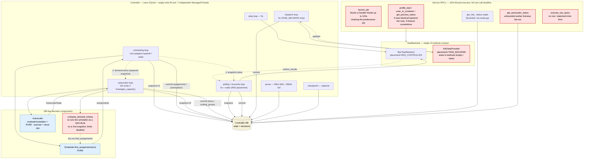

# Tighten Iris control boundaries (multi-backend readiness)

## Problem & goal

The recent `TaskBackend` work pulled most backend specifics behind a contract, but
the control plane is still **loose** in five concrete ways:

1. The controller drives **seven independent `ManagedThread` loops**, each opening its
   *own* DB snapshot on its *own* cadence and committing on its *own* schedule.
   Coordination is only a single write `RLock` plus best-effort wake events — so the
   scheduler, autoscaler and reconciler routinely act on **skewed snapshots** of the
   same state.
2. **Demand is computed twice.** The autoscaler does not consume the scheduler's
   output; it re-derives demand by running the scheduler a *second* time as a dry-run
   (`compute_demand_entries` → `scheduler.find_assignments`) against the shared mutable
   `self._scheduler` on a *separate* snapshot. There is no synchronization boundary
   between scheduler and autoscaler — they are two readers of the DB that happen to
   agree most of the time.
3. The `TaskBackend` contract is **one fat 13-method interface**. `K8sTaskProvider`
   stubs out six of them (`schedule`/`manage_capacity`/`on_workers_failed`/`ping_workers`
   return empty, `attach_autoscaler` raises `AssertionError`, `get_process_status`
   raises `ProviderUnsupportedError`). Capability is tracked by two side-channel flags
   (`placement`, `manages_capacity`) that can drift from which methods actually do work.
4. The reconcile **result shape is backend-specific**: `BackendReconcileResult` carries
   *both* `updates` (K8s) and `worker_results` (RPC); the controller picks the field by
   `placement` and runs different apply paths. The controller "knows" each backend's
   encoding.
5. RPCs are bounded by **thread count** (a 1024-thread executor) but **not by latency**.
   The timing interceptor only *measures*; nothing enforces a deadline. `launch_job`
   blocks a handler thread for up to 120 s; the three on-demand one-offs each
   re-implement controller→backend→worker fan-out with three different timeout
   conventions; `get_autoscaler_status` fans out to all workers with no cap;
   `execute_raw_query` has no row/time limit.

**Long-term goal:** a *multi-backend* Iris — e.g. a GCP TPU cluster and a Slurm GPU
cluster live simultaneously, jobs dispatched by a `cluster=` constraint. That future
needs sharp boundaries *now*: the controller as a pure state/serialization layer, each
backend exposing only the capabilities it actually has, a single demand artifact handed
scheduler→autoscaler, and one bounded path for every RPC.

**What "done" looks like for this plan:** this document — a verified map of the current
control flow, five targeted, independently-shippable improvements with concrete code
shapes, and a feasibility analysis with a recommended landing sequence. Implementation
is tracked as the task breakdown below.

### What is already good (don't regress it)

The audit confirmed the design is *decent*, not broken — these properties hold today and
every improvement below must preserve them:

- `Scheduler.find_assignments(context) -> SchedulingResult` is a **pure function**, zero
  runtime imports of controller state (`scheduling/scheduler.py`).
- Both backends are **DB-clean**: neither `RpcTaskBackend` nor `K8sTaskProvider` imports
  `db`/`reads`/`writes`/`schema`/`sqlalchemy`. Their imports of `controller.scheduling`/
  `autoscaler`/`reconcile` are **types and pure logic only**.
- Capability dispatch is **flag-based, never `isinstance`** (`placement`,
  `manages_capacity` — `controller.py:761/1092/1234`).
- The reconcile *kernel* (`reconcile/overlay|task|job|worker|effects`) is a **pure state
  machine**; `reconcile/loader` → `snapshot` → kernel → `commit` is a clean
  load→pure→write pipeline, and `writes.validate()` enforces projection-table ownership.
- A single write `RLock` + `BEGIN IMMEDIATE` serializes all mutations; reads use a
  separate `query_only` pool. Correctness is sound; the issue is *looseness and
  duplication*, not races that corrupt state.

### Static dependency-graph findings (the coupling smells)

Package-level import graph over `cluster/controller`, `cluster/backends`, `rpc`
(edge = "imports", verified against code):

- `controller.scheduling → {db, reads, projections, budget, worker_health}` — these are
  all in `policy.py` (the DB **context-builder**), *not* `scheduler.py`. The boundary is
  in the right place but lives in the same package as the pure scheduler, which obscures
  it.
- `controller.autoscaler → {db, schema, worker_health}` — the autoscaler reads the DB at
  startup (`restore_from_db`) and re-derives demand per-cycle (see Improvement 2).
- `backends.rpc → {controller.scheduling, controller.autoscaler, controller.reconcile}`
  and `backends.k8s → {controller.backend, controller.reconcile, controller.autoscaler}`
  — backends reach *up* into controller modules. Confirmed to be types/pure-logic only,
  but it means the contract type (`controller/backend.py`) itself imports
  `autoscaler`/`scheduling`/`reconcile` (fan-in: 7 modules depend on `controller.backend`).
- `controller.backend → {autoscaler, scheduling, reconcile, ops}` — the *contract*
  module pulls in the scheduler and autoscaler, so "the backend abstraction" and "the
  Iris-specific scheduling/capacity implementation" are not cleanly separable. This is
  what Improvement 3 untangles.

## Architecture (current control flow)



Legend: **red** = looseness/duplication this plan targets; **blue** = already-pure
components to preserve; the two dashed ⚠ edges are the cross-loop snapshot races.

## The five targeted improvements

### I1 — Collapse the fast control loops into one phased "control tick"

**Problem.** Five fast loops (`scheduling`, `polling/reconcile`, `dispatch`, `ping`,
`autoscaler`) each open an independent DB snapshot and commit independently
(`controller.py:_run_scheduling`, `_reconcile_tick`, `_sync_dispatch`, `_run_ping_loop`,
`_run_autoscaler_once`). This is the "loose threading" the goal calls out: the scheduler
commits assignments that the reconciler's just-captured snapshot can't see, and the
autoscaler snapshots demand *after* the scheduler already placed it.

**Change.** One driver thread runs a fixed-order tick over **one snapshot per tick**:

```
control_tick(now):
    snap = build_control_snapshot(db)          # ONE read txn -> typed snapshot
    effects = Effects()
    if schedule_phase.due(now):                 # IRIS placement only
        effects += run_schedule(snap)           # pure
    if capacity_phase.due(now):                 # !manages_capacity only
        effects += run_capacity(snap, effects.residual_demand)   # consumes I2 output
    effects += run_reconcile(snap)              # backend I/O (bounded, I5)
    if health_phase.due(now):
        effects += run_health(snap)             # ping / liveness (backend I/O)
    with db.transaction() as tx:                # ONE write txn
        commit(tx, effects)
```

Per-phase `due(now)` predicates (a `RateLimiter` each) preserve the existing cadences
(autoscale every ~10 s, ping every ~5 s) **without** a separate snapshot per phase. Wake
events stop targeting individual loops; they just shorten the next tick deadline.
`prune` and `checkpoint` stay as separate slow housekeeping threads — they are genuinely
independent and must not block the control tick.

**Serves:** poll-over-threading (#3); one snapshot fans out to DB-free abstractions (#1);
and it is the structural enabler for the scheduler↔autoscaler sync boundary (#6).

**Risk:** highest blast radius of the five — it rewrites the loop architecture in
`controller.py`. Mitigation: land it *after* I2 and I4 so each phase is already a clean
`(snapshot) -> effects` function; the tick is then just an ordering shell over functions
that already exist. The backend I/O phases (reconcile, ping) must be bounded (I5) so one
slow backend can't stall the whole tick.

### I2 — Scheduler emits the demand model; autoscaler consumes it (delete the dry-run)

**Problem.** `compute_demand_entries` (`scheduling/policy.py:181`) runs a **full dry-run**
`scheduler.find_assignments(context)` (`policy.py:283`) on a *second* read snapshot
(`policy.py:221,255`), with building/assignment limits disabled, against the shared
mutable `self._scheduler` — *unlocked* (`controller.py:1240-1245`). So placement logic
runs twice per cycle through two code paths, and the autoscaler's demand can diverge from
what the scheduler actually did. This is precisely the missing "strong synchronization
boundary between scheduler & autoscaler."

**Change.** Make the **real** scheduling pass emit residual demand as a first-class
output, so demand is computed exactly once and handed across a typed boundary:

```python
@dataclass(frozen=True)
class ScheduleResult:
    assignments: list[Assignment] = field(default_factory=list)
    preemptions: list[TerminalDecision] = field(default_factory=list)
    unschedulable: list[PendingTask] = field(default_factory=list)
    # NEW: tasks that did not fit on existing capacity this tick, bucketed by
    # requirement — the single source of truth for the autoscaler.
    residual_demand: list[DemandEntry] = field(default_factory=list)
    diagnostics: dict[str, str] = field(default_factory=dict)
    post_taint_context: SchedulingContext | None = None
```

`find_assignments` already walks the per-worker capacity model; it computes
`residual_demand` from the same traversal using **capacity-fit** semantics (what doesn't
fit on existing/known capacity) while ignoring per-cycle *promotion* caps — so demand
reflects saturation, not "what we declined to promote this tick." `compute_demand_entries`
and its dry-run are **deleted**; `CapacityInput.demand_entries` is populated from
`ScheduleResult.residual_demand` produced earlier in the same control tick (I1).

**Serves:** one demand artifact across a typed boundary (#6); one way to compute demand
(#5); removes a DB snapshot and the unlocked shared-scheduler access (#1).

**Risk:** medium — must reproduce the dry-run's reservation-taint and holder-task
behavior (`inject_reservation_taints`, holder demand) inside the real pass. Ships
independently of I1 (immediate win: kills the double-compute), but the *full* sync
guarantee only lands once I1 makes the two phases share a snapshot.

### I3 — Segment the `TaskBackend` contract by capability (kill the stubs; ready multi-backend)

**Problem.** One 13-method contract forces `K8sTaskProvider` to stub six methods
(`tasks.py:1255-1269,1395,1404` — empty results, `AssertionError`,
`ProviderUnsupportedError`). Capability lives in two side-channel flags that can drift
from which methods actually do work.

**Change.** Split the contract into composed capability protocols exposed as **optional
sub-objects**, so capability is *structural* — a backend physically cannot offer an
operation it doesn't implement:

```python
class TaskBackend(Protocol):              # core — every backend
    name: str
    def reconcile(self, inp: BackendReconcileInput) -> BackendReconcileResult: ...
    def set_log_sink(self, ...) -> None: ...
    def close(self) -> None: ...
    # Capability handles (None == not offered):
    placement: "PlacementBackend | None"  # exposes schedule(...)
    capacity:  "CapacityBackend | None"   # exposes manage_capacity / on_workers_failed
                                          #         / ping_workers / attach_autoscaler
    oneoffs:   "OneOffOps"                # status / profile / exec (I5)

class PlacementBackend(Protocol):
    def schedule(self, inp: ScheduleInput) -> ScheduleResult: ...

class CapacityBackend(Protocol):
    def manage_capacity(self, inp: CapacityInput) -> CapacityResult: ...
    def on_workers_failed(self, ids: list[WorkerId]) -> WorkersFailedResult: ...
    def ping_workers(self, w: list[tuple[WorkerId, str | None]]) -> list[PingResult]: ...
```

Controller dispatch becomes presence checks, not flags:
`if backend.placement is not None: ...`, `if backend.capacity is not None: ...`. The
`backend_descriptor` capability strings (`backend.py:101`) derive from sub-object
presence. Every stub and `raise` is deleted. This is also the shape the multi-backend
future needs: a `BackendRegistry` holding N heterogeneous backends, the controller
iterating those exposing `placement`/`capacity`, routed by a `cluster=` constraint. It
also lets the contract module stop importing the Iris `Scheduler`/`Autoscaler` (those
move behind `PlacementBackend`/`CapacityBackend` implementations).

**Serves:** controller stops "knowing" backend specifics (#2); structural single-way
dispatch (#5); the direct enabler of multi-backend.

**Risk:** large but mechanical — touches the contract type, both backends, and ~6
controller call sites. Highest *churn*, lowest *conceptual* risk. Sequence: define
protocols → adapt both backends → migrate call sites → delete `manages_capacity`/
`placement`-flag branches.

### I4 — One reconcile result shape + route the reconcile-input through `reads.py`

**Problem (a).** `BackendReconcileResult` carries both `updates` (K8s) and
`worker_results` (RPC); the controller picks the field by placement
(`controller.py:778` vs `1104`) and runs different apply paths. The controller knows each
backend's encoding.
**Problem (b).** The reconcile-input snapshot (`_snapshot_reconcile_inputs`, the raw
`task_attempts ⋈ tasks` join around `controller.py:1038-1059`) bypasses `reads.py`, the
single DB chokepoint. (Same class of violation in `policy.py`, `budget.py`,
`checkpoint.py`.)

**Change (a).** Unify on the **raw-observation** shape (`worker_results`) as the single
result type, and run **one** apply path. The controller already holds the DB snapshot, so
uid-resolution / worker-loss interpretation stays controller-side (preserving backend
DB-purity); K8s wraps its `TaskUpdate`s as already-resolved observations that flow through
the *same* `apply_reconcile`. Collapse `BackendReconcileResult` to one field and delete
the placement branch at apply time.

```python
@dataclass(frozen=True)
class BackendReconcileResult:
    observations: list[ReconcileObservation]   # ONE shape; controller resolves+applies uniformly
```

**Change (b).** Move the reconcile-input join into a `reads.py` helper (or reuse
`reconcile/loader.load_closed_snapshot`), and sweep the other raw-select sites behind
`reads.py`, so `reads.py`/`writes.py` are the *only* modules issuing schema queries.

**Serves:** controller = state, backend = operation (#2); one way to apply reconcile
results (#5); central DB queries fan out from a single chokepoint (#1).

**Risk:** medium. (a) and (b) are independent and individually shippable. The subtlety in
(a) is that worker-loss interpretation needs the snapshot — keep it controller-side; the
backend returns observations, never resolved DB rows.

### I5 — Centralized RPC bounding: deadline interceptor + one bounded one-off path

**Problem.** The 1024-thread executor bounds *thread count*, not *latency*. The
`RequestTimingInterceptor` only logs (`interceptors.py` — no `raise` on overrun).
`launch_job` blocks ≤120 s inline (`service.py:1122`). The three on-demand one-offs
(`get_process_status`/`profile_task`/`exec_in_container`) each re-implement
controller→backend→worker fan-out with three timeout conventions (client-driven, none,
K8s-only 60 s default). `get_autoscaler_status` fans out to all workers uncapped;
`execute_raw_query` has no row/time limit.

**Change.**
1. **Server-side deadline interceptor** — every RPC runs under a hard wall-clock cap
   (default e.g. 30 s, per-method override) by submitting the handler to the bounded
   executor with a `future.result(timeout=...)` and returning `DEADLINE_EXCEEDED` on
   overrun. One chokepoint where latency is capped.
2. **De-block `launch_job`** — don't hold a handler thread for 120 s. Record the
   drain/replace intent and return; the control tick (I1) completes the replacement and
   the client polls job status. (Interim: cap the wait at the RPC deadline.)
3. **One bounded one-off path** — fold the three one-offs into a single
   `OneOffOps.run(target, op, deadline)` on the backend handle (I3), dispatched through a
   dedicated **bounded** `ThreadPoolExecutor` with a hard per-call timeout — one timeout
   convention, one fan-out pool, one `ProviderUnsupportedError`. `get_autoscaler_status`'s
   liveness fan-out uses the same bounded pool.
4. **Cap `execute_raw_query`** with a row limit + statement timeout.

**Serves:** all RPCs bounded + threadpool-dispatched + latency-capped (#4); one way for
the on-demand one-offs (#5).

**Risk:** low–medium. (1) and (4) are small, high-value, and ship immediately. (3) pairs
naturally with I3's `oneoffs` handle. (2) interacts with I1 (the tick finishes the
drain) — until I1 lands, cap-the-wait is the safe interim.

## Constraint → improvement coverage

| Constraint | Addressed by |
|---|---|
| Central DB queries fan out to DB-free abstractions | I1 (one snapshot/tick), I2 (single demand artifact), I4b (reads.py chokepoint) |
| Controller handles state, backends handle operation | I3 (capability segregation), I4a (uniform result + apply) |
| Prefer poll workflows vs loose threading | I1 (phased control tick) |
| All RPCs bounded, threadpool-dispatched, latency-capped | I5 (deadline interceptor + bounded one-off pool) |
| Only one way to do something | I2 (one demand path), I4 (one result shape), I5 (one one-off path) |
| Strong sync boundary scheduler ↔ autoscaler | I1 (shared snapshot, phase order) + I2 (typed handoff) |

## Tasks

Each task has a stable id. `exec: session` tasks become weaver issues on
`weaver plan sync … --apply`. Ordered by the recommended landing sequence (see
Feasibility), not by id.

### T1 — I5a: server-side RPC deadline interceptor + cap raw query  `exec: session`  `value: high`  `deps: —`
Add a deadline-enforcing interceptor (per-method cap, default ~30 s) that returns
`DEADLINE_EXCEEDED` on overrun; add row limit + statement timeout to `execute_raw_query`.
Smallest, safest, immediately caps tail latency. Acceptance: a handler that sleeps past
its cap returns `DEADLINE_EXCEEDED`; raw query truncates at the row limit.

### T2 — I2: scheduler emits residual demand, delete the dry-run  `exec: session`  `value: high`  `deps: —`
Add `residual_demand` to `ScheduleResult`, compute it in `find_assignments`, delete
`compute_demand_entries`' dry-run, feed the autoscaler from the scheduler's output.
Acceptance: autoscaler provisions identically on representative fixtures with the
scheduler invoked once per cycle; no `scheduler.find_assignments` call remains in the
autoscaler path.

### T3 — I4: unify reconcile result shape + route reconcile-input via reads.py  `exec: session`  `value: medium`  `deps: —`
Collapse `BackendReconcileResult` to one observation list with one apply path; move the
reconcile-input join (and the policy/budget/checkpoint raw selects) behind `reads.py`.
Acceptance: controller has a single apply path independent of placement; no schema query
outside `reads.py`/`writes.py`/projections.

### T4 — I3: segment TaskBackend into capability protocols  `exec: session`  `value: high`  `deps: T3`
Define `PlacementBackend`/`CapacityBackend`/`OneOffOps`, expose as optional sub-objects,
migrate controller call sites to presence checks, delete all K8s stubs and the
`placement`/`manages_capacity` flag branches. Acceptance: no stub/`raise`-`NotImplemented`
methods on any backend; `grep` finds no `manages_capacity`/`placement ==` branches in the
controller; `backend_descriptor` derives capabilities from sub-object presence.

### T5 — I5c: consolidate the three on-demand one-offs onto OneOffOps  `exec: session`  `value: medium`  `deps: T4`
Fold `get_process_status`/`profile_task`/`exec_in_container` into one bounded
`OneOffOps.run(target, op, deadline)` over a dedicated bounded pool; route
`get_autoscaler_status` liveness through the same pool. Acceptance: one timeout
convention, one `ProviderUnsupportedError` path; all three RPCs delegate to the shared op.

### T6 — I1: collapse fast loops into one phased control tick  `exec: session`  `value: high`  `deps: T2, T3`
Replace the five fast `ManagedThread` loops with one driver running
snapshot → schedule → capacity → reconcile → health → commit, per-phase `due()` cadence,
one snapshot/tick; keep prune/checkpoint separate. Acceptance: one control thread; one
read snapshot + one write txn per tick (verified by a counter/test); cadences preserved;
chaos/integration suite green.

## Feasibility analysis

**Overall: feasible and incremental.** None of the five requires a data-model change or a
migration; all are refactors over an already-sound state layer. The pure scheduler,
DB-clean backends, and flag-based (non-`isinstance`) dispatch that exist today are the
foundation each improvement builds on.

**Recommended landing sequence** (dependencies in parentheses):

1. **T1 (I5a)** — independent, ~1 session, immediate tail-latency safety. No design risk.
2. **T2 (I2)** — independent, high value (deletes a whole duplicate scheduling pass and an
   unlocked shared-object access). The only care item is reproducing reservation-taint /
   holder-task demand in the real pass.
3. **T3 (I4)** — independent; unifies the reconcile boundary and closes the `reads.py`
   chokepoint. Prereq for clean phase functions in T6.
4. **T4 (I3)** — depends on T3 (so the reconcile sub-object is already clean). Large churn,
   low conceptual risk; this is the multi-backend keystone.
5. **T5 (I5c)** — depends on T4's `oneoffs` handle. Small once T4 lands.
6. **T6 (I1)** — depends on T2 + T3 so every phase is already a `(snapshot) -> effects`
   function; the tick is then an ordering shell, not a rewrite. Highest blast radius —
   land last, behind the chaos/integration suite, ideally with a feature flag to fall
   back to the legacy loops during bake.

**Risk register:**

- *T6 is the one to fear.* Folding five cadences into one tick can starve a phase or
  change effective latency under load. Mitigation: per-phase `due()` predicates preserve
  cadence; keep the bounded backend I/O (T1/T5) so no phase stalls the tick; ship behind a
  flag and bake on `marin-dev` before `marin`. **Never bounce the live controller without
  the user's explicit OK** (AGENTS.md).
- *T2 correctness:* demand semantics must match today's dry-run on reservation/holder
  jobs. Mitigation: golden-fixture parity test (same demand entries in/out) before
  deleting the dry-run.
- *T4 churn:* mechanical but wide. Mitigation: protocol-first, adapt backends, then migrate
  call sites in one pass; pyrefly + the existing capability tests catch drift.
- *Cross-region / cost:* none of these move data across regions; pure control-plane code.
- *Multi-backend itself is out of scope here* — these five make it *tractable* (capability
  registry, `cluster=` routing, per-backend ticks) but the registry/routing work is a
  follow-on plan once T4 + T6 land.

**Independently shippable now (no deps):** T1, T2, T3. **Sequenced:** T4 → T5; T6 last.
Estimated ~6 focused sessions; T1–T3 can run in parallel.

## Open questions

- **I1 cadence:** keep per-phase `RateLimiter`s inside one tick (recommended), or run the
  autoscaler on its own slower tick that still consumes the scheduler's published
  `residual_demand`? The former gives the strongest sync boundary; the latter is a smaller
  diff.
- **I2 residual semantics:** confirm "capacity-fit, promotion-cap-free" is the demand the
  autoscaler wants (matches today's `_UNLIMITED` dry-run) — verify against a cold-start
  fixture with reservations.
- **I5 default deadline:** what is the right global RPC cap (30 s?) and which methods need
  explicit overrides (profile/exec are inherently long)?
- **Multi-backend routing:** is `cluster=<name>` a hard constraint resolved at submit
  time, or a soft preference the scheduler can override? Affects whether routing lives in
  the scheduler or a pre-scheduler dispatcher. (Follow-on plan.)
