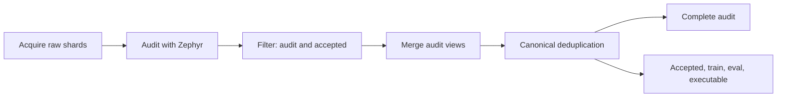

# Task curation pipeline

TaskCompendium curates pinned Hugging Face (HF) sources and local snapshots through
per-source acquisition, audit and filter artifacts, followed by merged audit and
accepted views. Zephyr normalizes rows, groups duplicates and conflicting references,
checks graders, and preserves model-review evidence. Every completed filter artifact
assigns each input `keep` or `reject`, while retaining its reasons. Recipes support numeric, exact,
multiple-choice, predicted-action, IFEval, structured documents, puzzle, Reasoning Gym,
calendar, open QA, rubric judges, repository repair, preference evidence, preserved
source evaluator contracts and executable submissions. Source-specific checks bind the
grader and its controls; model quality review remains separate from grading.

## Build the artifact graph

`experiments.post_training.task_curation_pipeline` is the artifact-graph entrypoint.
The default prints the plan without acquiring sources or calling GLM:

```bash
MARIN_PREFIX=/tmp/task-curation-artifacts \
uv run --package marin-core --group test python -m \
  experiments.post_training.task_curation_pipeline \
  --recipe taskcompendium.pipeline.datasets.svamp \
  --recipe taskcompendium.pipeline.datasets.aime24 \
  --limit 10 --model-revision <serving-job-or-weights-identity>
```

Add `--run --base-url <reachable-GLM-batch-endpoint>` to execute the graph.
Set `GLM_BULK_TOKEN` in the caller's environment. For module recipes, `--limit`
counts acquired rows per source, including rows that later reject. Sources selected
through `--sources-dir` use their saved sample-manifest counts. Acquisition fails if the source
yields fewer than the requested count. `--all-rows` reads a finite module source
to its end and records `source_exhausted=true`; it cannot be combined with
`--sources-dir`. For a snapshot, this means all rows in that snapshot, not all
rows in its upstream corpus. Generated sources require an explicit finite limit.
The entrypoint uses the existing inference
endpoint; it does not start or restart a serving job.

`MARIN_PREFIX` selects the artifact storage location. It can name local storage,
S3 or GCS according to Marin's configured filesystem access. The `acquire_source`
builder writes to that configured destination. Credentials
and transport clients stay outside persisted artifact configurations.

Each source has an independent branch:



| Stage | Retained output and boundary |
| --- | --- |
| Acquire | `raw/part-*.jsonl` and a source manifest; copies the pinned sample or finite complete source into artifact storage. |
| Audit | `audit/part-*.parquet`, source-wide duplicate/conflict decisions, verifier observations and `evidence/<batch-id>/` model records. |
| Filter | Final `audit/part-*.parquet` for every input and `accepted/part-*.parquet` for kept tasks, plus policy and count metadata. |
| Canonical merge | Retains every audit row, chooses exact-duplicate representatives, and records competing accepted verifier contracts and evaluation overlap. Exports accepted, train, eval and executable subdirectories. |
| Export | Separate audit and accepted artifacts, each with `data/part-*.parquet` and input-source metadata. |

Merge reshards each view into `ceil(rows / 100000)` partitions, with at least
one partition, before writing Parquet.

Deduplication groups all acquired shards within one source. Exact copies retain
the first source row and mark later rows with `duplicate_of`; differing private
references for the same public task reject every member. Preference records are
keyed by prompt and candidate evidence: different labeled responses to one prompt
are valid separate records, not conflicting answer keys.
Opaque source evaluator contracts likewise use their full semantics as the key:
different private inputs do not prove contradictory answers. Exact copies still
deduplicate, and GLM checks their reference agreement. Typed answer verifiers
retain public-task conflict detection.

Canonical merging groups matching task contracts across sources. It chooses an
accepted representative deterministically, preferring evaluation records and then
sorting by source dataset, revision, row and task ID. Competing accepted verifier
contracts cause conservative rejection; already rejected references do not poison
accepted ones. Matching training records are cut when evaluation membership is
present. This is exact task overlap detection, not a semantic contamination scan.
Every original row and reason remains in the audit, with `duplicate_of` linking
exact copies. `intended_use` distinguishes training and evaluation regardless of
the upstream split name. Unknown intended use is excluded from both use-specific
views. The executable view contains accepted records with ready grader controls.

Filter identity includes the policy and audited artifact identity. A policy-only
change rebuilds filtering and merging while reusing acquisition, controls and
model responses. Recipe code, rubric, check configuration or model identity
changes invalidate the audit stage. Acquisition has its own source and sample
identity, so unchanged source inputs can remain cached. Worker and batch settings
are execution parameters. Restart reuse follows the completed-shard behavior
described below and permits a different worker count.

Modules supplied through `--recipe` export a pinned `DatasetRecipe` named `recipe`.
Use `--snapshot-recipe MODULE PATH SHA256` for a module exporting a
`recipe(snapshot)` factory. A static snapshot recipe supplied through `--recipe`
also needs `--sample-sha256 SOURCE SHA256`, where `SOURCE` is its recipe name.
For other constructor arguments, build a `SourceBinding` in an experiment and
call `build_workflow`. Snapshot bindings pin their file digest in
`SourceAcquisition.sample_sha256`.

The earlier [1,000-task exercise](https://gist.github.com/rjpower/eebecc1ec4035014e2080b3d1da0c057#file-report-md)
kept 595 and rejected 405 tasks. Those results precede this artifact graph and
the standalone verifier migration; their frozen inputs, code and inference
records remain the historical evidence. Reusing saved observations to test
filtering or merging does not establish a fresh end-to-end graph run or new
quality estimates.

## Run a pilot

The Marin launcher reuses the existing GLM bulk client. It resolves a registered
relay through Iris; it does not launch or restart an inference service.
`GLM_BULK_TOKEN` must be set in the caller's environment.

```bash
uv run --no-sync --with './lib/taskcompendium[pipeline]' python -m \
  experiments.post_training.task_curation \
  --cluster cw-us-east-02a --relay-job /muchanem/glm53-relay \
  --recipe taskcompendium.pipeline.datasets.svamp \
  --recipe taskcompendium.pipeline.datasets.aime24 \
  --recipe taskcompendium.pipeline.datasets.gpqa \
  --limit 10 --output /tmp/task-curation-pilot
```

Discover registered relay names with `uv run iris --cluster cw-us-east-02a endpoints list`.
For endpoint `/muchanem/glm53-relay/glm-5.3`, use
`--relay-job /muchanem/glm53-relay`. GPQA requires an approved
HF account and `HF_TOKEN` in the caller's environment, or a cached `hf auth login`.
The three recipes pin HF commits, configurations and splits. SVAMP is
marked for training; AIME24 and GPQA are marked for evaluation even though their
HF split is named `train`. The limit counts source rows per recipe, including
rows later rejected. The loader streams the first ten rows in source order;
this is a reproducible exercise, not a representative quality estimate.

The resolved relay address must be reachable from the caller. For a local run,
port-forward the existing relay pod and add `--base-url http://127.0.0.1:18020/v1`
to override its private address. The launcher still verifies the registered
relay and records its identity. Keep the tunnel open until the pilot finishes.
List pods with the command below and match their IP against the address in the
endpoint listing. Pass that pod name to the forwarding command:

```bash
kubectl --kubeconfig ~/.kube/coreweave-iris --context marin-gpu_US-EAST-02A \
  --namespace iris get pods -o wide

kubectl --kubeconfig ~/.kube/coreweave-iris --context marin-gpu_US-EAST-02A \
  --namespace iris port-forward pod/<relay-pod> 18020:8020
```

## Exercise executable tasks

Shellbox is the reusable machine execution interface. An oracle is a private
reference script or trajectory used as a positive control. The agentic pilot
adds these source adapters:

| Recipe | Source | Submission and controls |
| --- | --- | --- |
| `nemo_actions` | Pinned NeMo conversational tool-use HF rows | Predicted final call; empty, reference and wrong-tool controls. Text targets are rejected because no meaningful text grader is available. |
| `shell_files` | Generated CSV selection tasks | `/output/command_capture.txt`; no-op, oracle, wrong output and a fresh oracle repeat. |
| `calendar` | Generated calendars and scheduling goals | Saved state; no-op, valid schedule, invalid schedule, alternate valid schedule and a fresh repeat. |
| TaskTrove nl2bash exemplar | Checked-in TaskTrove archive, exported to a JSONL snapshot | Same file controls and comparator as `shell_files`; forwards public setup files and private reference fixtures from the cleanup converter. |

The generated sources are deterministic mocks. The TaskTrove snapshot contains
one real exemplar. They do not constitute coverage of the full TaskTrove or
agentic dataset families.

```bash
uv run --no-sync --with './lib/taskcompendium[pipeline]' python -m \
  experiments.post_training.task_curation_agentic \
  --cluster cw-us-east-02a --relay-job /muchanem/glm53-relay \
  --base-url http://127.0.0.1:18020/v1 \
  --image <existing-local-docker-image> \
  --limit 10 --max-steps 4 --solve-per-source 1 \
  --output /tmp/task-curation-agentic
```

Use a local image containing Bash, coreutils and awk. The launcher resolves its
immutable image ID, uses `DockerMachineFactory` through Shellbox, and creates a
fresh container for every episode with network disabled and a 512 MB memory
limit. It does not pull or build images. Shell commands have a 15-second timeout;
observations and capture files are limited to 65,536 bytes. The calendar backend
runs in memory with a fresh copy of the fixture state.

`--limit` applies to each of the three sampled sources; the TaskTrove exemplar
always has one row. `--solve-per-source 1` runs one independent GLM solve for each
executable source after curation, selecting the first normalized task in source
order, regardless of its filtering decision. A source with no normalized tasks
produces no probe. It stores requests, batch IDs, raw replies,
rollouts and results under `solver/`. The solver receives the conversation,
advertised interaction tools and public resources. It can inspect calendar
state through `list_events`. It receives no private verifier or oracle script.
Solving probes do not change filtering decisions. They rerun when requested;
curation records retain the normal resume behavior. Omit the option to run only
controls and quality review.

A final assistant text message ends an executable episode. Tool calls execute
and append observations; `--max-steps` limits assistant turns, including the final
message. Budget exhaustion and infrastructure errors are recorded separately.
The solver pilot executes turns sequentially and has no persistent interactive
shell or Harbor lowering for executable tasks.

### TaskSpec and runtime binding

Schema `0.11` retains `interaction_tools`, `fixture`, `resources` and `output_paths`
from `0.10`. It adds the `structured_fields`, `source_contract` and
`preference_evidence` verifier kinds. Structured fields retain XML element-name
or CSV column-name checks; source contracts retain a pinned evaluator and its
private reward inputs; preference evidence retains pairwise candidates or an
unpaired boolean label. Unbound source evaluators and preference reward models
report infrastructure unavailable when asked to grade a new response.
`final_tools` still describes predicted final calls; `interaction_tools` describes
calls that an episode executes. The fixture pins a semantic interface revision
and initial state. Resource bytes are embedded as base64 with SHA-256 hashes and
an `agent`, `verifier` or `control` visibility. Normal actor environments receive
only agent resources; scripted oracle controls also receive control resources.
Backend image, network policy, memory, command and turn budgets belong to the
check suite's run configuration. Saved conversations, observations and produced
artifacts belong to `RolloutRecord`, outside TaskSpec.

The calendar converter illustrates stateful normalization in a small source
module: it converts `initial_state` and `goal` fields into a fixture, tool schemas,
a public scheduling instruction and a private postcondition verifier. Its rubric
allows any valid slot and requires preservation of existing events. Bind its
runtime in the experiment:

```python
from dataclasses import replace
from taskcompendium.pipeline.datasets.calendar import recipe
from taskcompendium.runtime.calendar import CalendarFactory
from taskcompendium.runtime.checks import episode_suite

calendar_recipe = replace(
    recipe, check_suite=episode_suite(CalendarFactory(), max_steps=4),
)
```

To adapt another HF calendar schema, replace `GeneratedSource` with a pinned
`HFSource` and map its fields in `normalize`. The existing runner, calendar tools,
controls and filter policy can remain the same when their semantics match. An
exported local dataset can use `SnapshotSource`; its caller supplies the snapshot
revision and path. The runner hashes each raw row and retains the snapshot in its
run outputs. Changing an execution interface requires a new implementation and
revision, rather than only a new source binding.

## Exercise ten real sources

The graph's source bindings map decoded snapshots to these recipes:

| Source | Recipe factory | Grading controls |
| --- | --- | --- |
| nl2bash | `executable_tasks.recipe("nl2bash", ...)` | Captured shell output, public seed files and source oracle. |
| TACO | `executable_tasks.recipe("taco", ...)` | Private stdin/stdout cases and source oracle; unsupported function tasks and sample-only cases retain rejection reasons. |
| Codeforces | `executable_tasks.recipe("codeforces", ...)` | Private stdin/stdout cases; absent source oracles remain unsupported. |
| UnitSyn | `executable_tasks.recipe("unitsyn", ...)` | Private Python tests and source oracle. |
| Calendar | `calendar_tasks.recipe(snapshot)` | Actual event constraints and source solution; alternative valid schedules pass. |
| Reasoning Gym | `reasoning_tasks.reasoning_recipe(snapshot)` | Named upstream scorer, including partial credit; known broken scorer families are excluded explicitly. |
| All Puzzles | `reasoning_tasks.puzzle_recipe(snapshot)` | Existing ordered-list, choice and symbolic-math scorers. |
| NeMo actions | `nemo_actions.snapshot_recipe(snapshot)` | Public tool-schema validation and exact-call controls; message targets remain excluded. |
| Knowledge open QA | `qa_tasks.knowledge_recipe(snapshot)` | Source normalized exact gate; semantic grading remains unsupported until a judge is bound. |
| Science open QA | `qa_tasks.science_recipe(snapshot)` | Same grading boundary, with science reference and output-format review criteria. |

Nine sources use TaskTrove revision
`02923004846e4e73862c20962f823a6d05100e7a`; NeMo uses
`9643c8103d7bfbc2d7fc4d15991d6739c612ff58`. The sampler records the exact
configuration, original row or byte offset, archive digest, sampling method and
snapshot digest. It assigns grouped development/holdout partitions before review;
identical instructions or NeMo trajectories stay in one partition. Holdout counts
can differ from 30 when a group contains multiple rows.

```bash
uv run --package marin-core --group test --with fastparquet python -m \
  experiments.post_training.task_curation_sampling \
  --count 100 --seed 6101 --nemo-shard train.jsonl \
  --output /tmp/task-curation-ten/sources

MARIN_PREFIX=/tmp/task-curation-ten/artifacts \
uv run --package marin-core --group test python -m \
  experiments.post_training.task_curation_pipeline \
  --sources-dir /tmp/task-curation-ten/sources \
  --source nl2bash --source taco --source codeforces --source unitsyn \
  --source calendar --source reasoning_gym --source all_puzzles \
  --source nemo_actions --source knowledge_openqa --source science_openqa \
  --base-url http://127.0.0.1:18020/v1 \
  --model-revision <verified-serving-job-identity> \
  --image <immutable-local-docker-image-id> --run
```

The sample reads selected Parquet row groups, with a 64 MiB decoded-data budget
per source. Oversized dictionary-encoded shards use a bounded prefix reader
instead. That reader supports flat, non-null byte-array columns with dictionary
or plain data across V1 pages, using Snappy, Zstd or uncompressed dictionaries.
It fails explicitly on unsupported encodings.
NeMo reads eight 1 MiB JSONL windows. These methods
produce bounded exercises with recorded selection bias, rather than population
quality estimates. Archived snapshots, rather than a new sample, are the replay
input for a completed exercise.

The graph pins saved sample manifests and records rubric identity before GLM
review. Final per-source artifacts contain `audit/part-*.parquet` and
`accepted/part-*.parquet`; the two merged views contain `data/part-*.parquet`.
Their artifact paths are printed in the plan and recorded by Marin.
`MARIN_PREFIX` can also name an accessible `gs://` or `s3://` prefix. `--source`
selects a subset; omitting it selects every registered source name, so include
the desired names when the directory contains only one cohort. Executable
audit stages use four workers by default, with fresh
network-disabled containers, a 512 MB memory limit and 120-second command limits.
The supplied image must contain Bash, GNU utilities, Python, the pinned
`verifyit` package, pytest with JSON reporting, and a C++ compiler when needed.
Its immutable ID is recorded. Using a common image substitutes for each source
Dockerfile; a passing oracle does not establish full environment equivalence.
Source-oracle controls exercise the grader; this launcher does not run an
independent solving actor. Submitted programs share the grading container with
private tests, so this prototype does not prevent them from inspecting those tests.

The earlier ten-source experiment also retained an independent review and manual
adjudication in its report artifacts. That separate analysis adds
`independent_quality`, `independent_confidence`, `independent_reason`,
`adjudication_status`, `adjudication_reason`, `post_audit_status` and
`post_audit_reasons` to the combined audit. Its `accepted_after_audit.parquet`
selects `post_audit_status = keep`. These annotations and the additional export
are historical analysis outputs outside the graph; that exercise's `accepted.parquet`
selects `filter_status = keep`. Current production filtering always ends in
`keep` or `reject`, with independent audits used to calibrate the rubric and policy.

Existing cleanup converters run at the Marin experiment boundary. Library recipes
consume their converted instructions, grader specs and resource maps, keeping
the package independent of Marin. Legacy TaskTrove converters, release tooling
and existing consumers retain their original verifier dependency. The new curation
wrapper serializes their baseline spec types and normalizes emitted checker
environment references to `VERIFYIT_*`. Its `normalization_changes` retain the
original and replacement resource bytes and a reason; original source files stay
unchanged. Migrating the legacy cleanup is deferred. For example:

```python
from dataclasses import replace
from pathlib import Path
from taskcompendium.pipeline.datasets import executable_tasks

recipe = executable_tasks.recipe(
    "unitsyn", Path("converted.jsonl"), image_id,
    timeout=120.0, memory_mb=512,
)
recipe = replace(recipe, rubric=replace(
    recipe.rubric,
    version="2",
    criteria=(*recipe.rubric.criteria, "Check that the empty-input behavior is stated and matches the tests."),
))
```

The graph changes audit identity when a rubric changes. The bounded local helper
requires a new output directory for that change. GLM reviews receive readable
UTF-8 resource previews, visibility, hashes and truncation markers: 8,192
characters per resource and 32,768 total. Full bytes remain in the audit.
At most 256 files are previewed, prioritizing public inputs and control scripts;
a hashed manifest records omitted files. The duplicate verifier resource list
is summarized. The reviewer must
leave reference agreement unknown when it depends on omitted content.

## Add a source with its own rubric

Each of the next ten sources has a module containing its `RUBRIC` and `recipe`
factory. Shared family modules implement normalization and grading when the
source contracts agree. The source module remains the place to change its
quality criteria, source configuration and recipe version.

| Source module | Normalization and grading | Source rubric checks |
| --- | --- | --- |
| `code_contests` | Existing stdin/stdout converter and private cases; source has no oracle. | Contradictory examples, missing context, numerical tolerance and arbitrary-output grading. |
| `codenet` | Python source solutions and private token-comparison cases. | Public examples, input domains and reference agreement; process-exit parity remains unverified. |
| `math_openreasoning` | Typed mathematical answers and equivalent-expression comparison. | Complete problem statements, answer equivalence and explicit domains. |
| `advanced_calculations` | Numerical answers with source tolerance and final-expression extraction. | Required external tools or data, numerical targets and output-format agreement. |
| `knowledge_mcqa` | Lettered options and pinned reference extraction. | Distinct options, a supported answer and coherent formatting. |
| `web_search_mcqa` | Same option parser; preserves the search requirement. | Whether supplied evidence or available tools can support a current factual answer. |
| `qa_abstention` | Source exact-answer gate and abstention token; semantic fallback remains unbound. | Whether the question supports a factual answer or justified abstention, and whether exact grading rejects valid paraphrases. |
| `arc_transductive` | Source grid parsing and exact grid comparison. | Demonstrations, grid dimensions and conflicting serialization instructions. |
| `arc_inductive` | Python `transform` contract and hidden input/output grids. Isolated execution remains unbound. | Demonstrations, function signature, required packages and environment agreement. |
| `indirect_injection` | Legitimate goal, tool schemas and untrusted text; source avoided-call scoring. | Whether the grader rewards invalid or unauthorized actions. Empty and nonexistent-tool controls fail. |

Prepare snapshots using repeated `--source` arguments, then run their recipes:

```bash
uv run --package marin-core --group test --with fastparquet python -m \
  experiments.post_training.task_curation_sampling \
  --count 100 --seed 6201 \
  --source knowledge_mcqa --source arc_transductive \
  --output /tmp/task-curation-next/sources

MARIN_PREFIX=/tmp/task-curation-next/artifacts \
uv run --package marin-core --group test python -m \
  experiments.post_training.task_curation_pipeline \
  --sources-dir /tmp/task-curation-next/sources \
  --source knowledge_mcqa --source arc_transductive \
  --base-url http://127.0.0.1:18020/v1 \
  --model-revision <verified-serving-job-identity> \
  --run
```

These two selected recipes do not execute containers and need no `--image`.
Coding-source selections require an immutable grading image. The sampler's
default selection remains the first ten-source cohort, so specify each next-round
source when sampling and running the graph. Existing historical
`frozen-plan.json`, flat Parquet files and bulk-run records remain evidence from
the earlier runner; the graph emits the stage directories described above.

For example, extend a source's rubric without changing its shared option parser:

```python
from dataclasses import replace
from pathlib import Path
from taskcompendium.pipeline.datasets import knowledge_mcqa

recipe = knowledge_mcqa.recipe(Path("knowledge-mcqa.jsonl"))
recipe = replace(recipe, rubric=replace(
    knowledge_mcqa.RUBRIC,
    version="2",
    criteria=(*knowledge_mcqa.RUBRIC.criteria,
              "Reject options that become duplicates after normalizing whitespace."),
))
```

Quality review and executable readiness are separate observations. A statically
coherent task can be kept while `grader_readiness = unverified`. Consumers that
require an exercised grader must also select `grader_readiness = ready`; an
accepted static task alone does not establish source-runtime equivalence.

## Filter instruction-following tasks and propose repairs

The `instruction_following` and `structured_output` recipe factories consume
TaskTrove JSONL snapshots with `instruction` and `verifier_data` fields. The
snapshot may retain archive `path`, Parquet `group` and `offset` locators. Export
rows from the pinned source before running the pilot; the launcher does not
sample or download TaskTrove archives. To use a factory with the generic launcher,
write a small module that binds its snapshot:

```python
from pathlib import Path
from taskcompendium.pipeline.datasets.instruction_following import recipe as if_recipe

recipe = if_recipe(Path("/tmp/ifeval-sample.jsonl"))
```

The IF adapter removes the known shell-delivery preamble and retains the content
request and constraint parameters. Its rubric checks missing requests, absent
inputs, incompatible formats and language requirements. An exclusive response
language can contradict a mandatory foreign word; the language of a question
alone does not require an exclusive response language. The recipe also rejects
explicit exclusive non-Latin language rules paired with mandatory Latin positional
words. This bounded check does not classify foreign words in languages sharing a
script or interpret exceptions outside the source's fixed template.

The structured adapter preserves the source's authoritative contract allowing
any schema-valid instance and unstated values. It retains the private schema
unchanged. Its checks detect forbidden required keys in mandatory object branches.
Optional branches and union types are excluded from that check. Neither schema
meta-validation nor this check proves general satisfiability. The rubric separately
checks public/private schema differences, meaningful field constraints and
formatting prose that conflicts with typed values.

Run quality review over both prepared snapshots:

```bash
uv run --no-sync --with './lib/taskcompendium[pipeline]' python -m \
  experiments.post_training.task_curation_instruction \
  --if-snapshot /tmp/ifeval-sample.jsonl \
  --structured-snapshot /tmp/structured-sample.jsonl \
  --base-url http://127.0.0.1:18020/v1 \
  --model-revision /muchanem/glm53-relay \
  --stage filter --comparison domain --output /tmp/instruction-curation
```

The launcher reviews every row in each snapshot. `--comparison both` adds generic
reviews of the same rows. It writes one standard curation directory per source
and rubric. This launcher uses the supplied endpoint and declared model revision;
it does not discover or verify a relay through Iris.

`BatchRewriter` is a separate pass with its own `ReviewRubric`. It returns an
`action` (`rewrite`, `unchanged`, `unrepairable`), literal `edits` and a reason.
Each edit names an `old_text` occurring exactly once and its `replacement`.
Overlapping or unmatched edits are invalid. Repairs support one user instruction;
other conversation shapes remain unavailable. Every candidate gets a new ID.
The original source and all fields outside the instruction remain unchanged.
Each rewrite input remains in `audit.parquet`, including unchanged, unrepairable
and invalid attempts. Cleanup columns record the action, rationale and literal
edits; original and candidate task payloads retain the before/after content.

For example, a schema requiring numbers and booleans can justify this proposal:

```json
{
  "task_id": "example-task",
  "action": "rewrite",
  "edits": [{
    "old_text": "All values for attributes should be in quotes",
    "replacement": "Use the JSON types required by the schema"
  }],
  "reason": "Quoting every value contradicts the required numeric and boolean types."
}
```

The rewriter saves originals, proposals, candidates and parent hashes under its
output directory. Candidate generation does not accept a task. Compare the
candidate with the original through `BatchReviewer.review(..., originals=...)`,
where the mapping keys are candidate IDs. Apply `protected_text_checks` to the
recipe's contract/schema spans and run grader controls before filtering again.
A witness can be checked with `verify_witness`; it demonstrates formal feasibility,
without establishing factual correctness or a useful content answer.
After checking candidates, call `write_rewrite_audit(output_path, checks=...,
reviews=..., decisions=...)` to attach their assessments. Final decisions must
account for every effective task exactly once: the candidate when rewritten,
otherwise the original with its saved source-filter checks, review and decision.
An unchanged or unsuccessful rewrite creates no new review queue. Pass the returned table
to `write_accepted_parquet` for the final export. Both functions live in
`taskcompendium.pipeline.rewriting` and `taskcompendium.pipeline.parquet`, respectively.

The experiment's `--stage rewrite --filter-evidence <prior-output>` reuses completed
filter evidence in a new output directory:

```bash
uv run --no-sync --with './lib/taskcompendium[pipeline]' python -m \
  experiments.post_training.task_curation_instruction \
  --if-snapshot /tmp/ifeval-sample.jsonl \
  --structured-snapshot /tmp/structured-sample.jsonl \
  --base-url http://127.0.0.1:18020/v1 \
  --model-revision /muchanem/glm53-relay \
  --stage rewrite --comparison domain \
  --filter-evidence /tmp/instruction-curation \
  --if-rewrite-limit 3 --structured-rewrite-limit 3 \
  --output /tmp/instruction-repairs
```

The limits select the first normalized rows, including rows without flagged
defects; they count selected inputs rather than successful repairs. To choose
specific IF rows instead, supply space-separated original `scan_index` values,
for example `--if-rewrite-indices 9 140`. Each index must exist in that snapshot.
This overrides `--if-rewrite-limit`; both source limits default to three.
The experiment compares proposals with originals,
protects structured contracts and schemas, and asks GLM for independent JSON
witnesses for structured candidates. It applies the same binary quality policy
to candidates and records unavailable verification as unverified grader readiness.

## Specify a converter and rubric

A Python module exports a `DatasetRecipe` named `recipe`. Its `normalize` function
receives `RawRow(id, source, data)` and returns a `TaskSpec`, a `NormalizedTask`
carrying the task and normalization edits, or an `ImportRejection`.
It must retain the supplied identity and provenance. Known malformed source
shapes should return a rejection with a reason and detail; unexpected exceptions
fail the run. The runner records the recipe version and hashes the recipe module,
TaskCompendium source, and pinned standalone verifyit scorer source.

The [SVAMP recipe](https://github.com/marin-community/marin/blob/main/lib/taskcompendium/src/taskcompendium/pipeline/datasets/svamp.py)
joins `Body` and `Question`, parses its numeric `Answer`, and selects the shared
numeric grader with explicit zero tolerances. It omits `Equation` from the
model-visible conversation. The
[AIME recipe](https://github.com/marin-community/marin/blob/main/lib/taskcompendium/src/taskcompendium/pipeline/datasets/aime24.py)
maps `problem` and `answer`, retaining LaTeX and the 0–999 integer contract. The
[GPQA recipe](https://github.com/marin-community/marin/blob/main/lib/taskcompendium/src/taskcompendium/pipeline/datasets/gpqa.py)
orders choices by a task-specific hash and records the corresponding private key.
It rejects repeated choices and omits source explanations from the task context.

This complete module shows the source fields, normalization, grader, and rubric
for SVAMP. The packaged recipe also validates malformed fields before conversion.

```python
from taskcompendium.grading import numeric_answer
from taskcompendium.models import (
    AnswerType, ConversationInput, EnvironmentRequirements, TaskSpec, TextMessage,
)
from taskcompendium.pipeline.models import (
    DatasetRecipe, HFSource, IntendedUse, RawRow, ReviewRubric,
)


def normalize(row: RawRow) -> TaskSpec:
    return TaskSpec(
        id=row.id,
        source=row.source,
        context=ConversationInput(events=(TextMessage(
            role="user",
            content=f"{row.data['Body'].strip()} {row.data['Question'].strip()}",
        ),)),
        environment_requirements=EnvironmentRequirements(),
        answer_type=AnswerType.NUMBER,
        verifier=numeric_answer(float(row.data["Answer"]), tolerance_abs=0.0, tolerance_rel=0.0),
    )


recipe = DatasetRecipe(
    name="svamp-custom",
    version="1",
    source=HFSource("ChilleD/SVAMP", "5e0bf1e5e7c0e9c4bc39180d224f41f3f801b7ef", "default", "train"),
    normalize=normalize,
    intended_use=IntendedUse.TRAIN,
    rubric=ReviewRubric(
        id="arithmetic-word-problems",
        version="1",
        criteria=(
            "Check quantities, units, and the requested operation.",
            "Distracting numbers alone do not make a task ambiguous.",
            "Flag missing quantities that prevent a unique numeric answer.",
        ),
    ),
)
```

Rubrics append area criteria to a shared quality review instruction. The GPQA
rubric checks options, scientific assumptions and ties; the AIME rubric checks
integer constraints and treats technical difficulty as acceptable.
Use `dataclasses.replace` to derive a recipe with a revised rubric or source.
Increment the rubric version when its criteria change. A custom recipe can live
outside this package; pass its importable module to `--recipe`. New source schemas
using supported task semantics require a converter, without runner changes.
New execution or grading semantics require a shared verifier/check implementation.

## Evidence and filtering

The controls reuse TaskCompendium's shared
[verifyit scorers](https://github.com/marin-community/verifyit)
and numeric negative-candidate generator. They exercise the actual answer grader on an empty submission, its
stored reference, and a wrong candidate. An extraction error is a valid empty negative control and is
recorded explicitly. These checks establish grading behavior, not mathematical
correctness of the stored answer. The default answer controls do not execute containers or solve tasks. A recipe
with `check_suite` supplies executable controls and records their rollout evidence.

GLM receives the task context and private verifier configuration and returns
quality, confidence, reference consistency, defect codes and brief evidence.
This review sees the key and supplies evidence for the final policy decision.
It does not establish independent reference agreement or measure difficulty.
`BatchReviewer` defaults to 2,048 response tokens and a 32,000-character cap;
the artifact-graph launcher sets 4,096 tokens and 128,000 characters by default.
The character cap is not an exact tokenizer bound.

The binary policy keeps tasks with `quality=good`, at least medium confidence,
no defect codes and no reference conflict. An unknown reference assessment does
not by itself make an otherwise coherent task bad. A bad, partially defective,
unknown or low-confidence assessment rejects the row. Any concrete defect or
reference conflict rejects it regardless of confidence. Change the acceptance
threshold with `FilterPolicy.minimum_confidence`.

Grader readiness is separate from static quality. Passing all declared controls
records `grader_readiness=ready`; a failed control records `failed` and rejects
the task. Missing controls, oracles, unbound judges or infrastructure errors
record `unverified` and do not block a favorable quality decision. Quality review
runs for every normalized nonduplicate task without a conflicting-reference
decision, including tasks with failed controls,
so the audit retains content findings alongside mechanical rejection reasons.
Acceptance is a curation decision, not a claim that an unverified grader is ready
for RL execution.

`BatchReviewer` retries invalid or unavailable assessments once by default,
retaining the original batch and a `retry-1/` batch. Retry budgets are 8,192 response
tokens and 128,000 characters; successfully parsed reviews are reused. If review
is still invalid, missing or oversized, the task is rejected with that reason.
There is no separate manual-review disposition. Unexpected response IDs or a
malformed batch file fail the run, preserving raw evidence.

Exact semantic duplicates match `TaskSpec` fields except `id`, `source` and
control resources, including the private verifier. They select the first source
row; later duplicates are rejected with `duplicate_of` lineage. Tasks with the
same public semantics but different private verifier data form a conflict group;
every member is rejected. Preference candidates and labels are part of the
grouping key, so distinct evidence for one prompt is retained. Grouping spans all
acquired shards within a source. Canonical merging also removes exact overlap
across sources, records verifier conflicts and excludes training copies that
match evaluation records while retaining every original audit row.

The bounded local helper, `run_pipeline`, invokes the same acquisition, audit
and filter Zephyr stages. It also writes flat ledgers for pilots and rewrite
exercises. Each local dataset directory contains:

| File | Contents |
| --- | --- |
| `run-config.json` | Source, converter, rubric, code, review and check-suite identity, including runtime budgets. |
| `raw.jsonl` | Pinned source rows, locators and raw digests. |
| `normalized.jsonl` | Private semantic task specifications. |
| `checks.jsonl` | Per-task grading controls, task digests and executable rollout evidence. |
| `rollouts.jsonl` | Flat executable rollout records with observations and captured artifacts. |
| `audited/evidence/<batch-id>/review/` | Requests, acknowledged batch ID, provider output/errors and result. |
| `reviews.jsonl` | Parsed review findings or unavailable/invalid states. |
| `decisions.jsonl` | Exactly one decision per input row, including duplicate lineage. |
| `audit.parquet` | Every input row, task payload and filtering/cleanup annotations, including rejected tasks. |
| `accepted.parquet` | Rows with `filter_status=keep`, retaining the same columns and schema. |
| `manifest.json` | Policy, sample digest, counts and evidence coverage. |

These artifacts contain private reference material, and GPQA artifacts retain
gated source content. They are local run outputs, not public dataset releases.

The audit stage writes observation shards before final filtering. The filter
stage adds decisions and writes both complete audit and accepted shards; the
bounded helper then exports its flat Parquet files. Their native columns include
`filter_status`, `filter_reasons`, `duplicate_of`, normalization
failure reason/detail, review status/quality/confidence/defects/evidence, and a
list of check results with explanations. `grader_readiness` is independent of
`filter_status`. Sampled runs also expose
`sample_partition`, `sample_group`, `source_sample_index` and `source_byte_offset`.
`normalization_changes` records instruction replacements with original text,
replacement text and reason, plus annotated checker-resource replacements as
base64 bytes. Source conversion annotations take precedence;
otherwise a changed single-message instruction records its delivery adjustment.
Rewrite outputs use the same schema,
adding `parent_id`, `cleanup_action`, `cleanup_reason`, `cleanup_edits` and status.
A null filter status can appear in intermediate audit observations or rewrite
proposals. Every completed filter or cleanup output contains a keep or reject
decision for every input.
Skipped reviews are distinct from model approval. Policy changes regenerate the
decision columns from retained evidence without new inference.

`task_json` stores the complete normalized or rewritten `TaskSpec`; `raw_json`
retains the original source row, locator and digest. Rewrite rows instead carry
`original_task_json` and `cleanup_lineage_json`. Arbitrary source schemas, tool
arguments and verifier settings remain JSON strings within Parquet so heterogeneous
payloads do not alter the shared annotation schema. Reasons, evidence, checks and
edits are native columns, so they can be selected without decoding task payloads:

```python
import pyarrow.parquet as pq
from taskcompendium.models import TaskSpec

rejected = pq.read_table("run/audit.parquet", filters=[("filter_status", "=", "reject")])
print(rejected.select(["task_id", "filter_reasons", "review_evidence", "checks"]).to_pylist())
accepted = pq.read_table("run/accepted.parquet")
tasks = [TaskSpec.model_validate_json(value) for value in accepted["task_json"].to_pylist()]
```

## Add sources by contract

Each leaf owns its dataset pin,
normalization binding and area rubric; family helpers share parsing only where the
source contract agrees.

| Cohort | Source names | Shared contract |
| --- | --- | --- |
| Python and structured output | `curriculum_easy`, `curriculum_medium`, `e2egit`, `e2egit_large`, `multifile`, `pymethods`, `pymethods_large`, `stack_pytest`, `unitsyn_large`, `structured_outputs` | Named/multifile Python outputs and private tests; JSON/YAML/TOML schema checks, XML element-name checks and CSV column-name checks. |
| Semantic judges and calendar | `glaive_code`, `codereview`, `stack_overflow`, `superuser`, `unix`, `safety`, `multichallenge`, `wizard_orca`, `tezos`, `if_calendar` | Original holistic numeric or all-pass judge contracts; calendar uses the existing schedule verifier. Semantic runtime judges remain unbound. |
| Math, coding and repositories | `math_prism`, `math_stack`, `math_gym`, `math_oracle`, `competitive_coding`, `swe_rebench`, `swesmith`, `hardmath`, `hendrycks_math`, `deepscaler` | Typed math controls, exact stdin/stdout cases, repository checkout/test contracts and direct HF training records. Source math-comparator parity and repository execution remain unverified. |

Sample and run one source using its registered name:

```bash
uv run --with fastparquet python -m experiments.post_training.task_curation_sampling \
  --source multichallenge --count 10 --seed 6501 --output /tmp/task-samples

MARIN_PREFIX=/tmp/task-artifacts uv run python -m \
  experiments.post_training.task_curation_pipeline \
  --sources-dir /tmp/task-samples --source multichallenge \
  --model-revision <deployment-revision> --review-cache /tmp/task-review-cache \
  --base-url <GLM-batch-endpoint> --run
```

TaskTrove prefix acquisition supports Snappy, Zstd and plain dictionaries across
leading row groups. Direct sources use bounded Parquet ranges, streamed JSON,
gzip, XML or validated viewer prefixes according to each source contract. These
samples exercise ingestion; ordered prefixes do not estimate population quality.
Source manifests retain pins, positions, byte budgets and snapshot hashes.

### Direct and Nemotron Ultra sources

The additional 95 recipes comprise 75 pinned Nemotron Ultra component selections
and 20 direct-source recipes. Ultra leaves retain complete conversation and tool
events, private source judge inputs and agent runtime requirements. Shared parsing
does not replace their evaluators with guessed exact-answer keys. The direct
recipes cover math, coding, science, SQL, instruction following, preference
records and generated reasoning tasks.

The checked-in `experiments/post_training/task_curation_atlas_catalog.json`
accounts for 196 atlas listings: 148 map to converters, 45 remain explicitly
excluded and three KTO contributor selections remain unavailable. Converter
coverage does not establish complete ingestion or runtime readiness. The canonical
`kto_mix` aggregate recipe is additional: its rows expose no contributor selector,
so it does not certify the three named contributor listings. Listings and recipes
are not one-to-one; verified aliases may share a recipe.

Use the main dispatcher for all registered sampler names:

```bash
PYTHONPATH=lib/taskcompendium/src:. \
uv run --with './lib/taskcompendium[pipeline]' --with fastparquet python -m \
  experiments.post_training.task_curation_sampling \
  --source hh_helpful_base --source nemotron_if \
  --source nemotron_ultra_mopd_hs3_en \
  --count 10 --seed 6501 --output /tmp/task-direct-samples
```

The dispatcher delegates direct acquisition to `task_curation_direct_sampling`,
HH/KTO/direct IF and generation to `task_curation_preference_sampling`, and Ultra
components to `task_curation_nemotron_sampling`. It serializes Ultra selections by
blend: the first missing component acquires sibling packets and subsequent
selections reuse verified snapshot caches. Independent sources may sample in
parallel. The CLI default remains the original ten-source cohort; repeat
`--source` for additional selections.

`reasoning_gym_generated` acquires the exact generator commit, samples task names
from its registry with the supplied seed and records each resolved generation
configuration. Its acquisition-time native positive and negative controls are
recorded evidence; they do not bind the current runtime. Direct `nemotron_if` and
`rlvr_ifeval` preserve the canonical SkyRL function contracts and fraction-satisfied
reward. TaskTrove similarly named constraint functions differ, so their grader
is not substituted. HH pairs and KTO binary labels remain private preference
evidence; a reward model for new responses remains unbound.

`RubricJudgeVerifier` retains the original question, criteria, parsed aggregation,
raw judge JSON and TOML. The review projection includes the complete public
conversation and parsed judge rules, replacing repeated raw copies with hashes.
The complete originals remain in the audit. `RepositoryPatchVerifier` retains
repository, source ref, workspace, grader paths and source environment hash.
Both return infrastructure outcomes until their runtime is bound; neither
manufactures a semantic reward.

### Source contracts and environment evidence

Source modules own field extraction, component selection, immutable provenance,
intended use and rubric criteria. Shared builders accept explicit conversation
events, references or evaluator parameters. Reuse a scorer only when its actual
rules agree: similarly named SkyRL and TaskTrove IFEval checks differ in empty
strings, punctuation and fractional scoring.

`SourceContractVerifier` preserves an identified upstream evaluator, its revision,
private inputs and runtime requirements. The common verification pass records it
as unbound. `PreferenceEvidenceVerifier` preserves pairwise candidates or binary
labels privately; these labels do not define an exact answer for a new response.
Neither contract manufactures a reward. GLM still makes a final quality decision.
The NeMo adapter pins the atlas's MarinSkyRL wrapper; its upstream NeMo Gym runtime
binding remains unverified.

NeMo blend recipes share request/tool-history parsing, with separate leaf selectors
and family criteria. Sampling positions are excluded from semantic task payloads.
Original records and normalization edits remain in the audit. Placeholder questions
must be resolved with the pinned upstream filler and indexed source rows; an empty
placeholder is not an ordinary solvable task. SWE subcorpus selection uses a pinned
instance-membership inventory and the published mixture composition.

Review requests preserve the complete public conversation and tool schemas.
Duplicate private transcripts point to their public copy; historical reasoning and
large private test fixtures have bounded previews with counts and hashes. The
default character guard is 512,000 and can be changed with `--prompt-budget` for
the selected model. A guard failure remains an explicit rejected review failure.

GLM already receives bounded previews of declared task resources, including their
visibility and truncation. A source can additionally set
`ReviewRubric.environment_inventory`, or the launcher can attach a saved inventory
with `--environment-inventory SOURCE inventory.json`. The inventory carries a
pinned environment identity, acquisition origin, inspected roots, file paths and
a completeness flag. It changes that source's actual review query and cache key.
It is private reviewer evidence and does not alter the solving actor's context.

`taskcompendium.pipeline.environment_inventory.inspect_environment` collects this
evidence through an injected Shellbox `MachineFactory` and `MachineSpec`, closing
the machine afterward. Select roots relevant to the task rather than listing a
whole image. An inventory proves path availability within its scope; it does not
prove dependency compatibility, file contents or a passing solution. Source
manifests describe declared files; observed machine listings identify their backend.

Shellbox's QEMU backend can inspect or execute an image using explicitly prepared
guest assets. ShellSim inventories describe its simulated filesystem: ShellSim
ignores Harbor Dockerfiles and cannot certify arbitrary Python or repository tests.
Existing executable controls use the Docker backend. Bind QEMU assets explicitly
when a source needs that runtime; static review and unverified readiness remain
valid outcomes when execution adds little evidence.

## Resume and change policy

Audit groups public task keys across all acquired source shards into
`ceil(input_rows / 100)` partitions, independently of `max_workers`, then forms
review windows within each partition. Zephyr atomically writes audit observation shards
with `write_parquet(skip_existing=True)`. On restart, its existing writer skips
completed shards before consuming the lazy grader and model iterator.
Normalization and grouping may recompute. An incomplete partition repeats its
grader and model work and may resubmit in-flight calls; saved transport files
remain evidence. With `--review-cache <stable-storage-path>`, valid GLM completions
are additionally cached by exact query using Finestore. Completed cache entries
can be reused across sources and catalog versions.

The query cache identity includes the submitted model request, source-specific
criteria, response schema, budgets and declared model revision. Top-level task ID
and source provenance are canonicalized before submission, then restored on the
review record. Changed rubric content, task content or model revision misses the
cache; changing the catalog version alone does not. Invalid, missing or truncated
responses are not cached. Cache location and concurrency do not change identity.
Concurrent workers can submit the same uncached query; this cache does not provide
single-flight coordination. Transport evidence is namespaced by missing query
batch and model revision, preventing a previous deployment's result from being
replayed under a new revision.

Repeat a bounded local run with the same directory to reuse its source sample
and completed audit. After bounded retries, unavailable or invalid reviews yield
rejection. Use a new output directory to run a different model attempt.

`run_pipeline` accepts a `FilterPolicy`; changing only this policy reuses the
entire completed audit artifact and recalculates decisions without new source
reads, verifier calls, or model requests. Changing
the code, source, converter, rubric or model configuration requires a new
directory. Model identity currently names a serving job, not immutable weights;
use a stable revision for an unchanged deployment, and update it whenever the
served weights or configuration changes. Use the
artifact graph above for independently cached source stages and merged outputs.
The bounded helper preserves flat local ledgers; neither path establishes a
full-corpus release gate.

With the original `recipe`, `reviewer` and dataset directory:

```python
import os
from marin.inference.openai_batch import OpenAIBatchClient
from taskcompendium.pipeline.models import Confidence, FilterPolicy
from taskcompendium.pipeline.review import BatchReviewer
from taskcompendium.pipeline.runner import run_pipeline

# Recreate the same reviewer identity and budgets used by the original launcher.
reviewer = BatchReviewer(
    OpenAIBatchClient("http://127.0.0.1:18020/v1", os.environ["GLM_BULK_TOKEN"]),
    model="glm-5.3", model_revision="/muchanem/glm53-relay",
)

run_pipeline(
    recipe, iter(()), output_path=dataset_directory, limit=10, reviewer=reviewer,
    policy=FilterPolicy(id="medium-confidence", minimum_confidence=Confidence.MEDIUM),
)
```

Run package tests with:

```bash
uv run --project lib/taskcompendium --extra pipeline --extra harbor --group test \
  pytest lib/taskcompendium/tests -q
```
