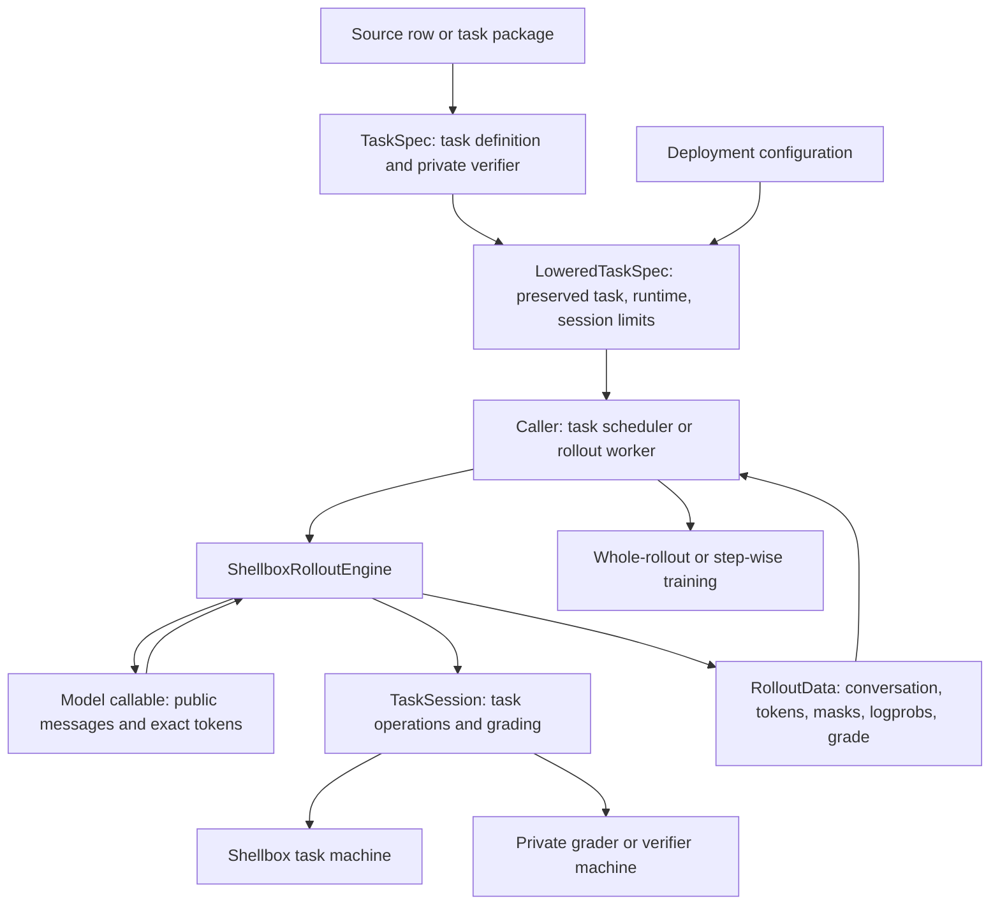

# Task rollouts

`ShellboxRolloutEngine.run(lowered)` executes one single-stage task and returns `RolloutData`.
The caller supplies the model callable, configured Shellbox factories, and optional task-session factories.
The caller owns concurrency, retries, group grading, and training projections.
TaskCompendium defines `TaskSpec` and grading outcomes. VerifyIT supplies verifier schemas and implementations.
Shellbox supplies machine backends. RolloutEngine supplies the execution loop and session interface.



## Task and runtime specs

`TaskSpec` contains the task definition: public context, tools, output paths, answer type, private verifier, environment requirements, resources, source, and tags.
Its `environment_requirements` includes capabilities, an optional digest-pinned Docker image, workdir, setup commands, environment variables, and named tool-provider contracts.
The verifier declares separate requirements in `verifier.environment_requirements`.

Lowering preserves the task definition and adds these deployment settings:

| Spec | Fields |
| --- | --- |
| `MachineRuntimeSpec` | `backend`, `network`, `cpus`, `memory_mb`, `storage_mb`, `gpus`, `user`, `startup_timeout`, `cleanup_timeout` |
| `TaskRuntimeSpec` | Optional `task_machine` and `verifier_machine` selections |
| `TaskSessionSpec` | `task_session`, `max_turns`, `model_turn_timeout`, `command_timeout`, `tool_turn_timeout`, `total_turn_timeout`, `attempt_timeout`, `verifier_timeout`, `cleanup_timeout` |
| `LoweredTaskSpec` | `task: TaskSpec`, `runtime: TaskRuntimeSpec`, `session: TaskSessionSpec` |

`rolloutengine.lowering.lower_task(task, runtime, session, factories=..., sessions=...)` constructs and validates the lowered record.
The engine validates a directly constructed `LoweredTaskSpec` before execution.

All runtime fields require explicit values. Optional fields accept `None`.
`TaskSessionSpec.cleanup_timeout` requires a finite, positive value.
Other deadlines accept `None` or a finite, positive value.

`backend` identifies a factory in the engine's `factories` mapping.
`task_session` identifies a factory in its `sessions` mapping.
The reserved session identifier `shellbox` selects the engine's shell-tool session.
Custom session factories receive `(lowered, machine)` and return a fresh session for each attempt.
A machine selection of `None` supplies no machine.
Answer-only tasks can omit the task machine.
`verifier_machine=None` selects host execution for supported answer graders.
Shell grading requires a separate verifier machine.
A verifier-machine selection creates a fresh private grader.

The engine validates factory identifiers and supported requirements before machine acquisition.
The selected factory applies network and hardware settings and rejects settings that it cannot enforce.
The engine does not change those settings to match a backend.

An environment with `docker_image` uses that prebuilt image. The reference must contain a SHA-256 digest.
An environment without an image uses `ShellSimBuiltins` and requires a compatible factory.
The default workdir is the image's workdir, or `/workspace` for the built-in filesystem.
An explicit `working_directory` overrides that selection.

Machine setup commands run as trusted root before task operations.
`MachineRuntimeSpec.user` supplies the default user for session commands.
An explicit command user overrides that default.
The verifier uses its own machine user.

## Session lifecycle and private files

The engine installs `resources.all` and `resources.worker` on the task machine before session preparation.
It calls these session methods:

1. `prepare()` returns `SessionStart`: public messages and model options.
2. `advance(turn)` executes task operations and returns `Transition`: observations, completion, and optional per-turn grades or credit.
3. `grade(messages)` returns the final `GradeResult`.
4. `close()` releases session resources before machine cleanup.

The engine owns model calls, conversation accumulation, and exact-token accounting.
Each model request returns one turn, then `advance` executes that turn's operations.
Completion, a generation limit, the turn limit, or the cumulative turn deadline starts final grading.
A session does not call the model.
The default session exposes `shell(command: string)` when the task declares the shell capability.
Each command starts a fresh shell. Files persist between commands.
Native interaction tools and tool-provider contracts require a registered custom session.

The model receives only public context, submission instructions, tool definitions, and task observations.
The serialized task and lowered record contain private grading inputs. Do not send them to the model.
The Shellbox session installs private verifier resources in `/tests` on the verifier machine after the turn loop.
Oracle resources contain private control inputs for task-curation checks. They do not enter a rollout.

A separate shell verifier receives `resources.all` and the declared artifacts from the task machine.
Collect commands execute on the task machine before artifact transfer.
Artifacts specify a source, target, kind, exclusions, and missing-file policy.
Directory exclusions use `tar --exclude` on the task machine.
VerifyIT supplies shared verifier specifications and grading implementations.
A separate VerifyIT grader receives captured `output_paths`, common resources, and private verifier resources.
Worker-only resources do not enter a separate verifier.

## Deadlines and failures

| Field | Boundary |
| --- | --- |
| Machine `startup_timeout` | Machine creation, resource upload, and setup commands |
| `model_turn_timeout` | One model request |
| `command_timeout` | Each shell-tool command, including separate calls within one model turn |
| `tool_turn_timeout` | One `advance` call, including its tool operations |
| `total_turn_timeout` | The cumulative model-and-tool loop across all turns in one attempt |
| `attempt_timeout` | Task startup, session preparation, turns, and final verification |
| `verifier_timeout` | The full `grade` call, including separate verifier startup and artifact transfer |
| Session `cleanup_timeout` | Each cleanup action, outside the attempt deadline |
| Machine `cleanup_timeout` | Optional override for that machine's cleanup action |

The total-turn deadline excludes startup, session preparation, and final verification.
Its expiration ends the turn loop and starts grading with `stop_reason="total_turn_timeout"`.
No model response means `grade.status=Outcome.UNAVAILABLE` and `grade.reward=None`.
Backend command limits also stop commands that outlive an enclosing coroutine deadline.
The command limit is separate from the tool-turn deadline.
When these limits are finite, lowering requires the command limit to be less than the tool-turn deadline.
Configure the tool-turn deadline to allow the commands and backend cleanup within that turn.
A timed-out shell command returns a `timed_out` tool observation. The model can continue the task.
Expiration of the tool-turn deadline interrupts the transition.

`RolloutInterrupted` retains the failed operation, served token evidence, and original exception cause.
Its `rollout` field contains the retained record. Its `operation` field identifies the failed operation.
Startup failures retain an empty record.
A model failure after a completed turn triggers grading of the completed state.
An interrupted transition retains a terminal step with `advance_incomplete=1`.
Training callers must exclude incomplete, ungraded custom-session steps from their training projections.
Token-contract failures propagate as `RolloutContractError`.
External cancellation remains cancellation.

Cleanup errors preserve a completed grade or the original execution failure.
`grade.diagnostics.cleanup_errors` contains cleanup operation names and exception types.
`metrics.cleanup_error_count` contains their count.
Repeated cancellation does not extend a cleanup deadline.
The engine retains unfinished cleanup operations and late machine creation until their resources can close.
Late cleanup failures appear in logs after the returned record becomes final.
Thread-backed sessions retain their pending operations until session cleanup can safely release resources.

## Grading

The built-in session accepts shared VerifyIT verifier kinds, private shell graders, and explicit skipped grading.
External verifiers require a custom session.
Group grading belongs to the caller.

Text, JSON, and final-action submissions use typed grading contracts.
A malformed submission receives `Outcome.SUBMISSION_FAILURE` with reward 0.
File submissions use captured workspace files.
Action and structured-candidate graders do not support a separate verifier machine.

`ShellVerifierSpec` defines a grader command, collect commands, artifacts, and a reward source.
The command receives the conversation as JSON on standard input.
The session's verifier deadline controls the full grading phase.

| Reward source | Result |
| --- | --- |
| `StdoutReward` | Zero exit code and one finite number on standard output |
| `ExitCodeReward` | Reward 1 for zero exit code, otherwise reward 0 |
| `FileReward` | The first existing file supplies the scalar grade |

`FileReward` accepts a number or a JSON object with the configured numeric key.
A malformed first file is a verifier failure. The engine does not try a lower-priority file.
The optional `pass_above` threshold supplies a separate pass/fail result.
Harbor task packages contain instructions, environment configuration, and private test scripts.
Their reward files use `reward.json` before `reward.txt` and treat a positive reward as a pass.
The engine removes existing reward files before the private grader executes.
A valid reward file can supply a grade after a nonzero exit code. A command timeout has no grade.

`GradeResult.failure` identifies timeout, execution failure, missing reward, empty reward, or invalid reward.
An incorrect answer receives a numeric grade. A verifier failure has no reward.
Score bounds describe the verifier's native range.

The Harbor importer reads the package environment and private verifier.
The caller selects backend settings, users, and deadlines during lowering.
The Harbor importer accepts only separate verifier environments.
An unset verifier mode without a separate environment selects shared mode and causes rejection.
Shell grading requires a prebuilt, digest-pinned verifier image and a separate machine.
The Shellbox session's Harbor setup uses root-user overrides. The Iris backend rejects these overrides, so this Harbor path is unsupported on Iris.
Other unsupported cases include multi-stage tasks, task-specific image builds, Harbor collect hooks, and healthchecks.
Shellbox's generic image-builder API remains available outside this task path.
SWE tasks require prebuilt images and initialize `refs/taskcompendium/base` before inference.
Patch collection compares the final index with that revision, including agent commits and new files.

## Exact-token contract

The model callable accepts `ModelRequest` and returns `ModelTurn` with a parsed assistant message and exact served token IDs.
`ModelRequest.messages` contains public messages. `prefix_token_ids` contains the earlier served tokens that the next request must preserve.
`ModelTurn.prompt_token_ids` contains the exact prompt sent to inference. `response_token_ids` contains the sampled response.
Optional log probabilities align with response tokens.
A continuation prompt preserves the full served prefix, including earlier response tokens.
The engine rejects changed prefixes, empty response evidence, and misaligned log probabilities or token credit.

`RolloutData` contains the conversation, token IDs, loss mask, optional log probabilities, grade, and per-step records.
`prompt_token_ids` contains the initial prompt. `response_token_ids` contains subsequent model responses and intervening observation tokens.
The loss mask and log probabilities align with `response_token_ids`, which excludes the initial prompt.
Model tokens have loss mask 1. Observation tokens have mask 0 and log probability 0.
The caller applies its training and failure policies when it projects the record.
A conversation reset discards earlier turns from the training record when another turn is available.
The session supplies new public messages in `Transition.reset_conversation`.
The engine clears the accumulated prefix, turns, and token evidence, then starts a fresh prefix check.
The reset preserves session state and workspace files.
Final grading receives the new conversation and its subsequent turns.
A custom session can use this operation after a failed proof attempt.

`GenerationLimitReached` retains rendered prompt tokens when the model cannot start another response.
The engine grades completed state with stop reason `length`.
It does not add an oversized observation to retained response evidence.

## Use

The submission convention controls final-answer extraction and model-visible submission instructions.
The Shellbox session selects native-action or JSON extraction when the task's answer type requires it.

Construct the record with `lower_task(...)`. The [rollout tests](../../lib/rolloutengine/tests/test_rollout.py) contain executable examples.
This function accepts a fully lowered record and a model callable:

```python
from collections.abc import Awaitable, Callable

from rolloutengine.contracts import ModelRequest, ModelTurn, RolloutData
from rolloutengine.engine import ShellboxRolloutEngine
from rolloutengine.spec import LoweredTaskSpec
from shellbox.backends.docker.machine import DockerMachineFactory
from shellbox.backends.shellsim.machine import ShellSimMachineFactory
from taskcompendium.submission import PlainText


async def run_task(
    lowered: LoweredTaskSpec, model: Callable[[ModelRequest], Awaitable[ModelTurn]]
) -> RolloutData:
    engine = ShellboxRolloutEngine(
        model,
        {"docker": DockerMachineFactory(), "shellsim": ShellSimMachineFactory()},
        convention=PlainText(id="plain"),
    )
    return await engine.run(lowered)
```

From the Marin repository root, with the test environment installed:

```bash
task_test_prefix=$(mktemp -d -t taskcompendium-tests.XXXXXX)
MARIN_PREFIX="$task_test_prefix" uv run --frozen --no-sync pytest lib/taskcompendium/tests -q -n 0
uv run --project lib/rolloutengine --frozen --group test pytest lib/rolloutengine/tests -q
```

CPU tests use ShellSim and model or HTTP fixtures. A live GPU run and a real container backend require separate validation.
